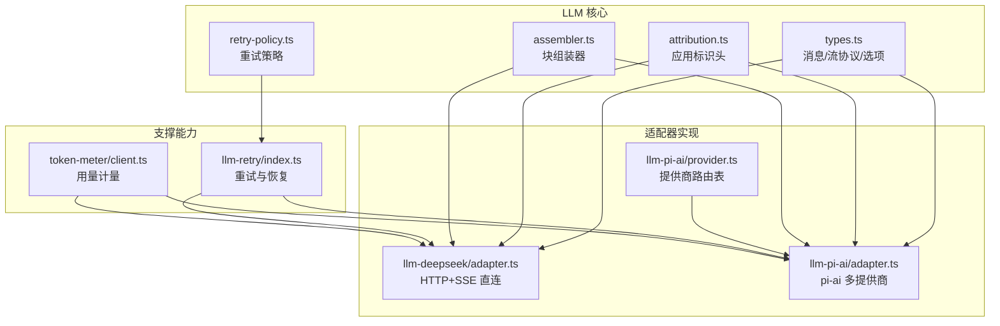
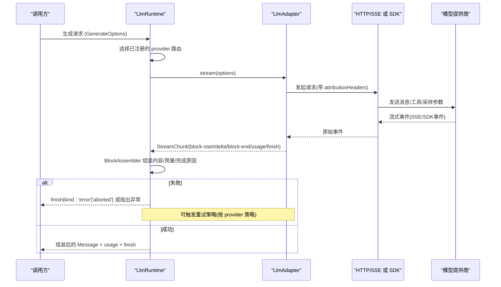
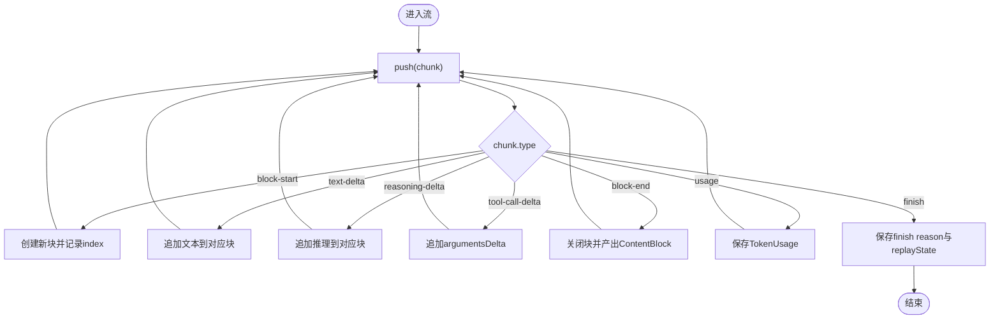
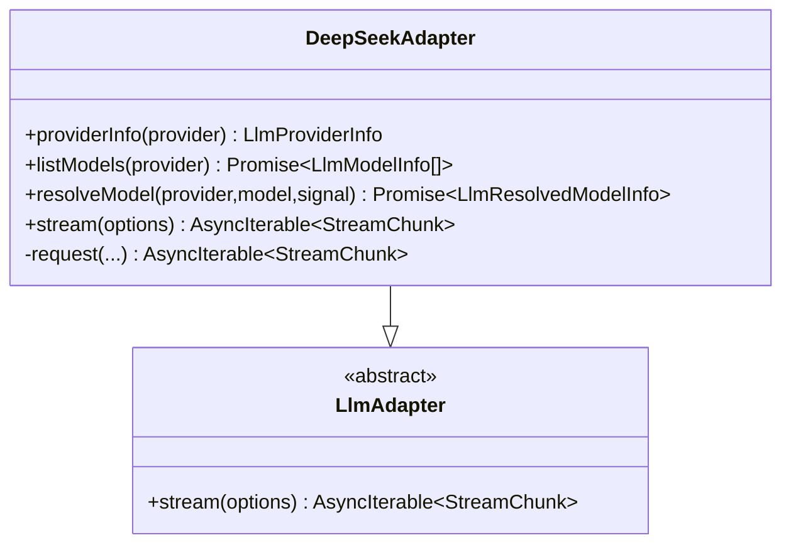
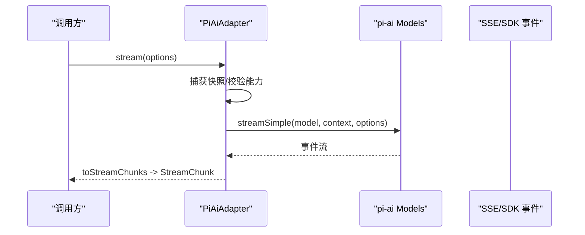
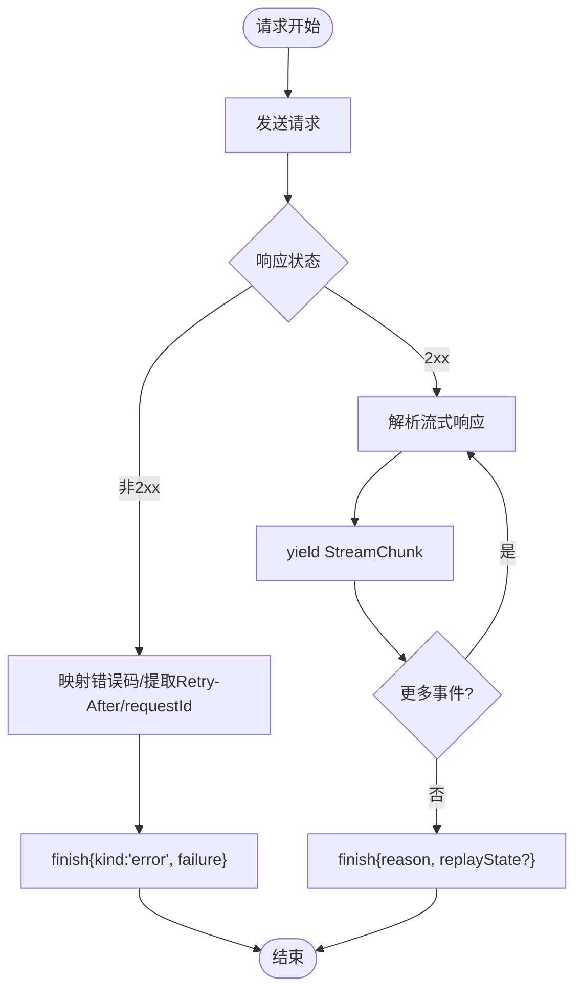
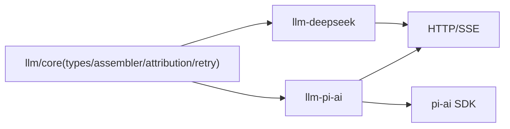

# LLM 适配器开发

<cite>
**本文引用的文件**
- [packages/llm/llm/src/types.ts](file://packages/llm/llm/src/types.ts)
- [packages/llm/llm/src/assembler.ts](file://packages/llm/llm/src/assembler.ts)
- [packages/llm/llm/src/attribution.ts](file://packages/llm/llm/src/attribution.ts)
- [packages/llm/llm-deepseek/src/adapter.ts](file://packages/llm/llm-deepseek/src/adapter.ts)
- [packages/llm/llm-pi-ai/src/adapter.ts](file://packages/llm/llm-pi-ai/src/adapter.ts)
- [packages/llm/llm-pi-ai/src/provider.ts](file://packages/llm/llm-pi-ai/src/provider.ts)
- [packages/llm/llm-retry/src/index.ts](file://packages/llm/llm-retry/src/index.ts)
- [packages/llm/token-meter/src/client.ts](file://packages/llm/token-meter/src/client.ts)
- [docs/cookbook/adding-an-llm-adapter.md](file://docs/cookbook/adding-an-llm-adapter.md)
- [docs/subsystems/llm-streaming.md](file://docs/subsystems/llm-streaming.md)
- [docs/testing.md](file://docs/testing.md)
</cite>

## 目录
1. [简介](#简介)
2. [项目结构](#项目结构)
3. [核心组件](#核心组件)
4. [架构总览](#架构总览)
5. [详细组件分析](#详细组件分析)
6. [依赖关系分析](#依赖关系分析)
7. [性能考量](#性能考量)
8. [故障排查指南](#故障排查指南)
9. [结论](#结论)
10. [附录](#附录)

## 简介
本教程面向希望为 DeepSeek Harness 接入不同大模型提供商的开发者。你将学到：
- LLM 适配器接口规范、消息与流式协议约定
- 如何集成 OpenAI、Anthropic、本地模型等（通过统一抽象）
- 完整的适配器实现示例：认证配置、请求处理、错误重试
- 适配器注册、配置管理与性能监控
- 测试方法、调试技巧与部署注意事项

本仓库提供了两套参考实现：
- llm-deepseek：直接 HTTP + SSE 对接 OpenAI 兼容端点
- llm-pi-ai：基于 pi-ai SDK 的多提供商适配层，支持 OpenAI、Anthropic 等

## 项目结构
围绕 LLM 适配器的关键目录与职责：
- packages/llm/llm：核心类型、适配器抽象、流组装器、应用标识头、重试策略等
- packages/llm/llm-deepseek：DeepSeek/OpenAI 兼容直连适配器
- packages/llm/llm-pi-ai：多提供商适配层（OpenAI、Anthropic 等）
- packages/llm/llm-retry：重试策略与恢复
- packages/llm/token-meter：Token 用量计量与投影
- docs：适配器开发指南、流式协议文档、测试策略

图表来源
- [packages/llm/llm/src/types.ts:1-378](file://packages/llm/llm/src/types.ts#L1-L378)
- [packages/llm/llm/src/assembler.ts:289-346](file://packages/llm/llm/src/assembler.ts#L289-L346)
- [packages/llm/llm/src/attribution.ts:245-265](file://packages/llm/llm/src/attribution.ts#L245-L265)
- [packages/llm/llm-deepseek/src/adapter.ts:171-387](file://packages/llm/llm-deepseek/src/adapter.ts#L171-L387)
- [packages/llm/llm-pi-ai/src/adapter.ts:202-378](file://packages/llm/llm-pi-ai/src/adapter.ts#L202-L378)
- [packages/llm/llm-pi-ai/src/provider.ts:22-51](file://packages/llm/llm-pi-ai/src/provider.ts#L22-L51)
- [packages/llm/llm-retry/src/index.ts:127-160](file://packages/llm/llm-retry/src/index.ts#L127-L160)
- [packages/llm/token-meter/src/client.ts:1-200](file://packages/llm/token-meter/src/client.ts#L1-L200)

章节来源
- [docs/cookbook/adding-an-llm-adapter.md:1-44](file://docs/cookbook/adding-an-llm-adapter.md#L1-L44)
- [docs/subsystems/llm-streaming.md:1-927](file://docs/subsystems/llm-streaming.md#L1-L927)

## 核心组件
- 适配器抽象与协议
  - LlmAdapter：必须实现 stream()，可选 providerInfo/listModels/resolveModel/providerRetryPolicy
  - StreamChunk：统一的原始流协议（block-start/text-delta/tool-call-delta/block-end/usage/finish）
  - GenerateOptions：一次完整模型调用参数（provider/model/messages/system/tools/temperature/maxTokens/stop/signal/sessionId/purpose）
  - TokenUsage：每次调用的 Token 用量统计（输入/输出/缓存/推理）
  - FinishReason：停止原因（stop/tool-calls/max-tokens/error/aborted）
- 块组装器 BlockAssembler
  - 将 StreamChunk 增量组装为 ContentBlock、最终 Message、usage、finish、replayState
- 应用标识头 attributionHeaders
  - 所有适配器对外请求必须携带标准 User-Agent 等应用标识
- 重试策略 ResolvedRetryPolicy
  - 正常模式与始终模式，含退避参数；由提供者或全局配置决定

章节来源
- [packages/llm/llm/src/types.ts:127-378](file://packages/llm/llm/src/types.ts#L127-L378)
- [packages/llm/llm/src/assembler.ts:289-346](file://packages/llm/llm/src/assembler.ts#L289-L346)
- [packages/llm/llm/src/attribution.ts:245-265](file://packages/llm/llm/src/attribution.ts#L245-L265)
- [docs/subsystems/llm-streaming.md:154-346](file://docs/subsystems/llm-streaming.md#L154-L346)

## 架构总览
下图展示从上层调用到具体提供商的端到端流程，包括适配器选择、流式响应、错误归一化与重试。

图表来源
- [packages/llm/llm/src/types.ts:340-378](file://packages/llm/llm/src/types.ts#L340-L378)
- [packages/llm/llm/src/assembler.ts:289-346](file://packages/llm/llm/src/assembler.ts#L289-L346)
- [packages/llm/llm-deepseek/src/adapter.ts:228-387](file://packages/llm/llm-deepseek/src/adapter.ts#L228-L387)
- [packages/llm/llm-pi-ai/src/adapter.ts:292-378](file://packages/llm/llm-pi-ai/src/adapter.ts#L292-L378)

## 详细组件分析

### 适配器接口与协议规范
- 必须实现的 stream(options): AsyncIterable<StreamChunk>
- 协议约束要点
  - usage 必须在 finish 之前发出，finish 后不得再发任何 chunk
  - tool-call 的 arguments 始终以原始 JSON 字符串形式传递，delta 以 argumentsDelta 流式传输
  - block index 在首次出现时分配，同一块的所有 delta 复用该 index
  - 错误仅两条合法路径：从 stream() 抛出（传输/协议错误），或在 finish 中携带 {kind:'error'|'aborted', failure}
  - 必须尊重 options.signal，并在不支持的能力上抛出明确错误码
  - 成功 finish 可携带 replayState，用于后续历史重放
- 模型元数据
  - resolveModel(provider,model,signal) 返回 exact-route 的上下文窗口、默认 maxTokens、推理努力等级等
  - listModels(provider) 提供建议性模型目录
  - providerRetryPolicy(provider) 返回该 provider 的重试策略

章节来源
- [docs/subsystems/llm-streaming.md:154-346](file://docs/subsystems/llm-streaming.md#L154-L346)
- [docs/subsystems/llm-streaming.md:665-740](file://docs/subsystems/llm-streaming.md#L665-L740)
- [packages/llm/llm/src/types.ts:127-378](file://packages/llm/llm/src/types.ts#L127-L378)

### 流式响应处理与块组装
- BlockAssembler 负责将 StreamChunk 增量组装为：
  - blocks(): 当前已闭合/开放的内容块
  - interruptedBlocks(): 中断时可安全保留的前缀
  - usage/finish/replayState/message
- 对“最大 token 截断”等场景，会同步裁剪内容与 replayState 的 per-block 条目，保证一致性

图表来源
- [packages/llm/llm/src/assembler.ts:289-346](file://packages/llm/llm/src/assembler.ts#L289-L346)
- [docs/subsystems/llm-streaming.md:154-346](file://docs/subsystems/llm-streaming.md#L154-L346)

章节来源
- [packages/llm/llm/src/assembler.ts:289-346](file://packages/llm/llm/src/assembler.ts#L289-L346)

### 适配器实现一：llm-deepseek（OpenAI 兼容直连）
- 特点
  - 直接 fetch + SSE，使用 eventsource-parser 解析
  - 严格遵循适配器契约：usage 在 finish 前、空响应视为错误、超时与中止区分
  - 自动附加 attributionHeaders、用户 ID、会话 ID、用途标记
  - 图片输入需通过 AttachmentStore 转为 base64 data URL，且受模型能力限制
- 错误映射
  - 将 HTTP 状态与错误体映射为稳定代码（AUTH/RATE_LIMIT/CONTEXT_WINDOW_EXCEEDED/QUOTA_EXCEEDED/TRANSPORT/EMPTY_RESPONSE 等）
  - 支持 Retry-After 秒数与日期格式解析，提取 requestId
- 重试与超时
  - 每读一次流都启用空闲看门狗，超过阈值则超时终止
  - 调用方 AbortSignal 与内部控制器合并，确保中止传播

图表来源
- [packages/llm/llm-deepseek/src/adapter.ts:171-387](file://packages/llm/llm-deepseek/src/adapter.ts#L171-L387)

章节来源
- [packages/llm/llm-deepseek/src/adapter.ts:171-387](file://packages/llm/llm-deepseek/src/adapter.ts#L171-L387)

### 适配器实现二：llm-pi-ai（多提供商封装）
- 特点
  - 基于 pi-ai SDK，支持 OpenAI、Anthropic 等提供商
  - 通过 provider 路由表选择 API 实现（openai-completions/openai-responses/anthropic-messages）
  - 每个操作捕获不可变快照，避免配置变更影响进行中的请求
  - 支持 reasoning effort 的校验与映射，拒绝不支持的努力级别
  - 同样强制附加 attributionHeaders，并透传会话 ID 与用途标记
- 图片与附件
  - 若消息包含图片，需检查模型是否支持 image 输入，并通过 AttachmentStore 读取
- 重试与超时
  - 禁用 SDK 内置重试（由上层重试策略控制）
  - 使用空闲看门狗保护长连接

图表来源
- [packages/llm/llm-pi-ai/src/adapter.ts:202-378](file://packages/llm/llm-pi-ai/src/adapter.ts#L202-L378)
- [packages/llm/llm-pi-ai/src/provider.ts:22-51](file://packages/llm/llm-pi-ai/src/provider.ts#L22-L51)

章节来源
- [packages/llm/llm-pi-ai/src/adapter.ts:202-378](file://packages/llm/llm-pi-ai/src/adapter.ts#L202-L378)
- [packages/llm/llm-pi-ai/src/provider.ts:22-51](file://packages/llm/llm-pi-ai/src/provider.ts#L22-L51)

### 认证配置与密钥管理
- 适配器不直接持有密钥，而是通过注入的回调在每次请求时解析密钥
  - llm-deepseek：resolveApiKey(connection) => Promise<string>
  - llm-pi-ai：resolveApiKey(provider, profile) => Promise<string | undefined>
- 所有外部请求必须附带 attributionHeaders()，禁止泄露敏感信息
- 对于 OAuth 等无需 API Key 的场景，适配器保持最小假设，由上层凭证系统负责

章节来源
- [packages/llm/llm-deepseek/src/adapter.ts:79-94](file://packages/llm/llm-deepseek/src/adapter.ts#L79-L94)
- [packages/llm/llm-pi-ai/src/adapter.ts:64-84](file://packages/llm/llm-pi-ai/src/adapter.ts#L64-L84)
- [packages/llm/llm/src/attribution.ts:245-265](file://packages/llm/llm/src/attribution.ts#L245-L265)

### 请求处理与错误重试
- 请求处理
  - 构造请求体（文本/图片）、设置 headers、发送请求、解析流
  - 对非 2xx 响应，解析错误体并映射为稳定错误码
- 错误分类
  - AUTH、RATE_LIMIT、CONTEXT_WINDOW_EXCEEDED、QUOTA_EXCEEDED、TRANSPORT、EMPTY_RESPONSE、ABORTED、TIMEOUT 等
- 重试策略
  - 通过 ResolvedRetryPolicy 控制 normal/always 模式与退避参数
  - 适配器自身不重复重试，交由上层重试层决策

图表来源
- [packages/llm/llm-deepseek/src/adapter.ts:304-387](file://packages/llm/llm-deepseek/src/adapter.ts#L304-L387)
- [packages/llm/llm-retry/src/index.ts:127-160](file://packages/llm/llm-retry/src/index.ts#L127-L160)

章节来源
- [packages/llm/llm-deepseek/src/adapter.ts:304-387](file://packages/llm/llm-deepseek/src/adapter.ts#L304-L387)
- [packages/llm/llm-retry/src/index.ts:127-160](file://packages/llm/llm-retry/src/index.ts#L127-L160)

### 适配器注册、配置管理与模型发现
- 注册
  - 通过 ctx.llm.registerAdapter(providers, adapter) 注册一个或多个 provider 路由
  - 支持 registerConfigurableProviders 声明可配置的 provider 目录
- 配置
  - 配置项通过插件注入，运行时可热更新；适配器通过回调重新解析最新配置
- 模型发现
  - listModels(provider) 提供建议性模型列表
  - resolveModel(provider,model) 返回精确模型的上下文窗口、默认 maxTokens、推理等级等

章节来源
- [docs/subsystems/llm-streaming.md:744-800](file://docs/subsystems/llm-streaming.md#L744-L800)
- [packages/llm/llm-deepseek/src/adapter.ts:176-226](file://packages/llm/llm-deepseek/src/adapter.ts#L176-L226)
- [packages/llm/llm-pi-ai/src/adapter.ts:243-290](file://packages/llm/llm-pi-ai/src/adapter.ts#L243-L290)

### 性能监控与 Token 用量
- TokenUsage
  - 每次调用结束后产出 inputTokens/outputTokens/cacheReadTokens/cacheWriteTokens/reasoningTokens
- Token Meter
  - 提供用量投影与聚合，便于计费与配额管理
- 指标建议
  - 记录每次调用的 provider/model、duration、tokens、错误码、重试次数

章节来源
- [packages/llm/llm/src/types.ts:127-141](file://packages/llm/llm/src/types.ts#L127-L141)
- [packages/llm/token-meter/src/client.ts:1-200](file://packages/llm/token-meter/src/client.ts#L1-L200)

## 依赖关系分析
- 适配器对核心的依赖
  - types.ts：消息/流协议/选项定义
  - assembler.ts：块组装器
  - attribution.ts：应用标识头
  - retry-policy.ts：重试策略
- 适配器间差异
  - llm-deepseek：轻量直连，适合 OpenAI 兼容端点
  - llm-pi-ai：多提供商封装，适合混合生态
- 外部依赖
  - pi-ai SDK：多提供商抽象
  - 网络库：fetch + ReadableStream

图表来源
- [packages/llm/llm/src/types.ts:1-378](file://packages/llm/llm/src/types.ts#L1-L378)
- [packages/llm/llm-deepseek/src/adapter.ts:171-387](file://packages/llm/llm-deepseek/src/adapter.ts#L171-L387)
- [packages/llm/llm-pi-ai/src/adapter.ts:202-378](file://packages/llm/llm-pi-ai/src/adapter.ts#L202-L378)
- [packages/llm/llm-pi-ai/src/provider.ts:22-51](file://packages/llm/llm-pi-ai/src/provider.ts#L22-L51)

章节来源
- [packages/llm/llm/src/types.ts:1-378](file://packages/llm/llm/src/types.ts#L1-L378)
- [packages/llm/llm-deepseek/src/adapter.ts:171-387](file://packages/llm/llm-deepseek/src/adapter.ts#L171-L387)
- [packages/llm/llm-pi-ai/src/adapter.ts:202-378](file://packages/llm/llm-pi-ai/src/adapter.ts#L202-L378)

## 性能考量
- 流式处理
  - 使用异步迭代器与空闲看门狗，避免长时间无数据导致资源占用
- 内存与阻塞
  - 块组装器对未闭合的未知块类型采取防御策略，防止恶意流增长内存
- 并发与取消
  - 合并 caller 信号与内部控制器，确保及时释放底层资源
- 重试与退避
  - 合理设置 initialDelayMs/maxDelayMs/jitterRatio，避免雪崩
- 图片处理
  - 限制单次请求的图片大小，避免过大 payload 导致超时

[本节为通用指导，不直接分析具体文件]

## 故障排查指南
- 常见问题定位
  - 认证失败：检查 attributionHeaders 与密钥注入回调是否正确
  - 上下文溢出：识别 CONTEXT_WINDOW_EXCEEDED_CODE，调整消息长度或启用压缩
  - 速率限制：根据 RATE_LIMIT 与 providerRetryAfterMs 实施退避
  - 传输错误：TRANSPORT 通常来自 DNS/TLS/代理问题，检查网络与证书
  - 空响应：EMPTY_RESPONSE 应视为可重试错误
- 调试技巧
  - 打印 StreamChunk 序列，验证 block-start/delta/block-end/usage/finish 顺序
  - 使用 mock server 模拟 SSE 事件，覆盖边界情况（早闭、乱序、超长延迟）
  - 利用 snapshot 测试对比期望输出，确保协议稳定性
- 日志与追踪
  - 记录 provider/model、duration、tokens、错误码、重试次数、requestId

章节来源
- [packages/llm/llm-deepseek/tests/adapter.spec.ts:376-709](file://packages/llm/llm-deepseek/tests/adapter.spec.ts#L376-L709)
- [docs/testing.md:1-50](file://docs/testing.md#L1-L50)

## 结论
通过统一的 LLM 适配器接口与流式协议，DeepSeek Harness 能够以一致的方式接入多种模型提供商。参考实现展示了如何在认证、请求、错误、重试、监控等方面构建健壮的生产级适配器。遵循本文档的规范与实践，你可以快速扩展新的提供商，并确保质量与可维护性。

[本节为总结，不直接分析具体文件]

## 附录
- 快速上手步骤
  - 阅读添加适配器指南，理解 StreamChunk 协议
  - 选择实现方式：直连（llm-deepseek）或多提供商封装（llm-pi-ai）
  - 实现 LlmAdapter.stream()，遵守协议约束
  - 注册适配器并提供配置与密钥解析回调
  - 编写单元测试与 e2e 测试，覆盖错误与边界
  - 接入 Token 计量与监控，观察性能指标
- 相关文档
  - 添加适配器指南
  - LLM 流式协议文档
  - 测试策略

章节来源
- [docs/cookbook/adding-an-llm-adapter.md:1-44](file://docs/cookbook/adding-an-llm-adapter.md#L1-L44)
- [docs/subsystems/llm-streaming.md:1-927](file://docs/subsystems/llm-streaming.md#L1-L927)
- [docs/testing.md:1-50](file://docs/testing.md#L1-L50)