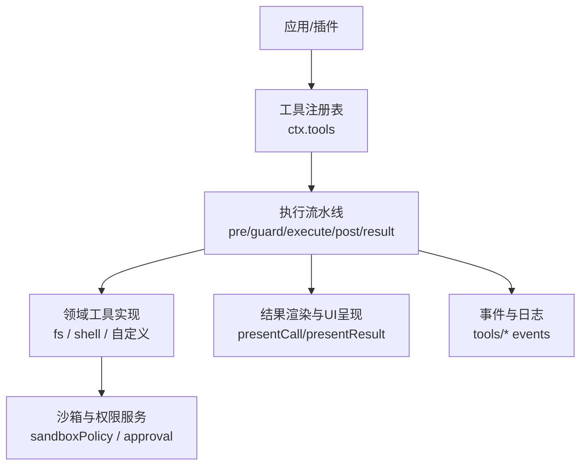
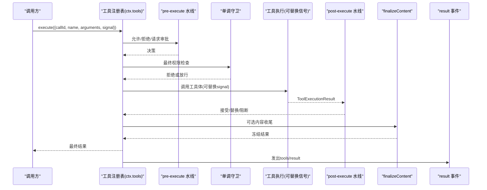
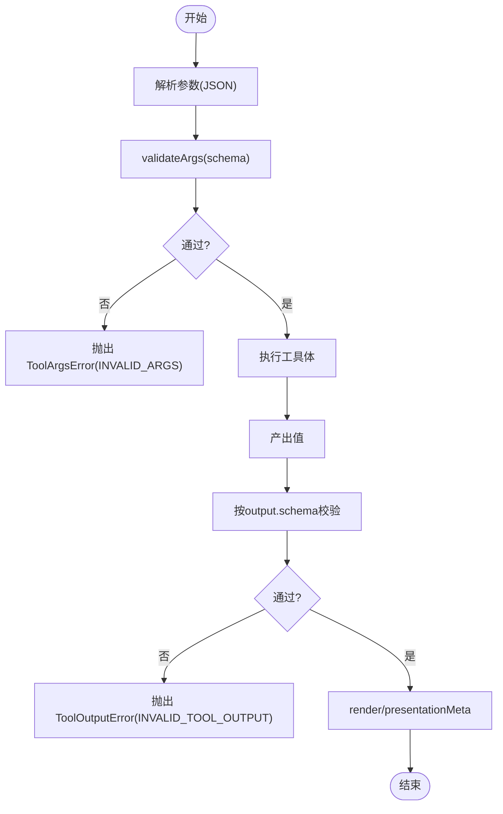
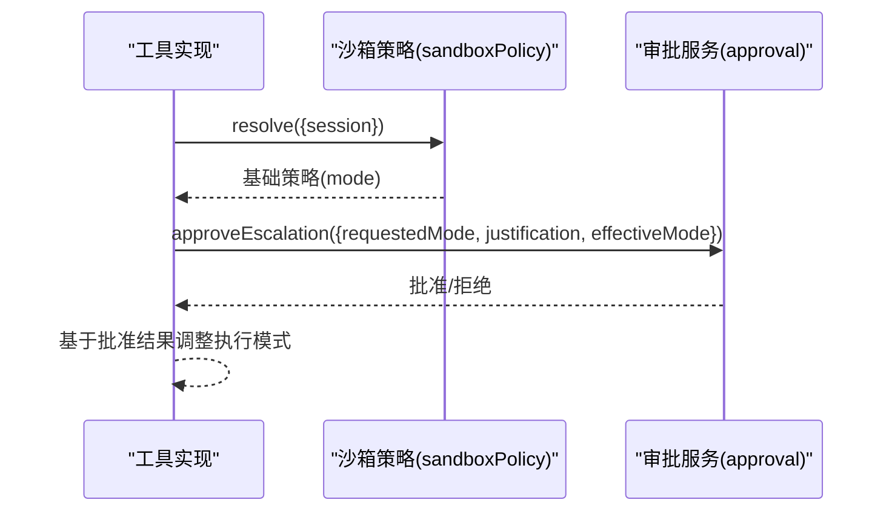
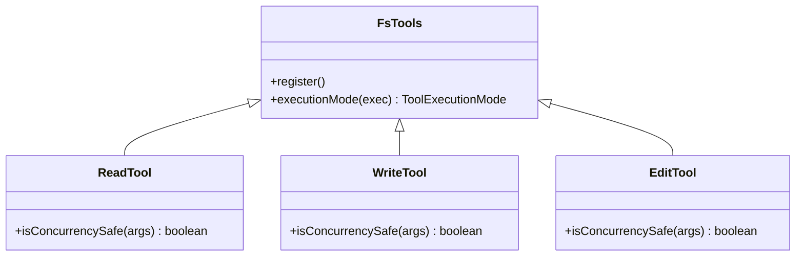
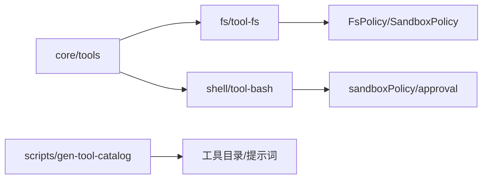

# 工具开发

<cite>
**本文引用的文件**
- [packages/core/tools/src/index.ts](file://packages/core/tools/src/index.ts)
- [packages/core/tools/src/schema.ts](file://packages/core/tools/src/schema.ts)
- [packages/core/tools/src/presentation.ts](file://packages/core/tools/src/presentation.ts)
- [packages/core/tools/tests/tools.spec.ts](file://packages/core/tools/tests/tools.spec.ts)
- [packages/fs/tool-fs/src/index.ts](file://packages/fs/tool-fs/src/index.ts)
- [packages/fs/tool-fs/src/sandbox.ts](file://packages/fs/tool-fs/src/sandbox.ts)
- [packages/fs/tool-fs/tests/tools.spec.ts](file://packages/fs/tool-fs/tests/tools.spec.ts)
- [packages/shell/tool-bash/src/index.ts](file://packages/shell/tool-bash/src/index.ts)
- [docs/subsystems/tools.md](file://docs/subsystems/tools.md)
- [docs/subsystems/tools.zh.md](file://docs/subsystems/tools.zh.md)
- [scripts/gen-tool-catalog.ts](file://scripts/gen-tool-catalog.ts)
</cite>

## 目录
1. [简介](#简介)
2. [项目结构](#项目结构)
3. [核心组件](#核心组件)
4. [架构总览](#架构总览)
5. [详细组件分析](#详细组件分析)
6. [依赖关系分析](#依赖关系分析)
7. [性能考虑](#性能考虑)
8. [故障排查指南](#故障排查指南)
9. [结论](#结论)
10. [附录](#附录)

## 简介
本指南面向希望为 DeepSeek Harness 开发“工具”的工程师，目标是帮助你快速、安全地创建可扩展的工具：从工具定义规范、参数校验与返回值处理，到权限控制、沙箱执行环境、错误处理机制；并提供文件系统工具、Shell 工具与自定义工具的完整开发示例。文档同时覆盖工具注册、调用流程、性能优化、测试策略、调试技巧与最佳实践，确保你能够构建出既强大又可靠的工具扩展。

## 项目结构
DeepSeek Harness 的工具系统由核心工具运行时（dsh-tools）与各领域工具包组成：
- 核心工具运行时负责工具注册表、模型可见的 Schema 投影、执行流水线（pre-execute → guards → execute → post-execute → finalizeContent → result）、并发调度、超时与取消、以及 UI 呈现协议。
- 文件系统工具（tool-fs）提供 read/write/edit/read-image 等能力，并集成沙箱策略与会话工作目录。
- Shell 工具（tool-bash）提供 bash/pwsh 执行能力，支持后台运行、沙箱模式与权限升级审批。
- 脚本与文档用于生成工具目录、提示词片段与类型导出。

图表来源
- [packages/core/tools/src/index.ts:1-200](file://packages/core/tools/src/index.ts#L1-L200)
- [packages/fs/tool-fs/src/index.ts](file://packages/fs/tool-fs/src/index.ts)
- [packages/shell/tool-bash/src/index.ts:190-200](file://packages/shell/tool-bash/src/index.ts#L190-L200)

章节来源
- [docs/subsystems/tools.md:1-12](file://docs/subsystems/tools.md#L1-L12)
- [packages/core/tools/src/index.ts:1-200](file://packages/core/tools/src/index.ts#L1-L200)

## 核心组件
- 工具定义与 Schema DSL
  - 使用统一的 ValueSchemaSpec/ParameterSchemaSpec 声明参数与输出，编译为标准 JSON Schema 子集，并在运行时严格校验。
  - defineTool 将参数推导与 validateArgs 绑定，将 execute/render/presentationMeta 与输出类型绑定，保证类型与运行时一致。
- 工具注册表与执行流水线
  - ctx.tools.register 注册工具；schemas() 仅暴露模型可见字段（name/description/parameters），不泄露回调。
  - 执行顺序：tools/pre-execute → 单调守卫 → tools/execute（可替换信号）→ tools/post-execute → finalizeContent → tools/result。
- 并发与调度
  - isConcurrencySafe(args) 返回 true 才允许并行；否则默认独占。read 标记为并行，write/edit 为独占。
- 超时与取消
  - timeoutMs 声明协作式超时预算；exec.signal 贯穿整个执行链，确保可取消。
- 呈现协议
  - presentCall/presentResult 以 card-tagged 视图描述待执行与已完成状态，供 UI 适配。

章节来源
- [docs/subsystems/tools.md:9-96](file://docs/subsystems/tools.md#L9-L96)
- [docs/subsystems/tools.md:98-151](file://docs/subsystems/tools.md#L98-L151)
- [docs/subsystems/tools.md:170-213](file://docs/subsystems/tools.md#L170-L213)
- [docs/subsystems/tools.md:459-468](file://docs/subsystems/tools.md#L459-L468)
- [packages/core/tools/tests/tools.spec.ts:2047-2067](file://packages/core/tools/tests/tools.spec.ts#L2047-L2067)
- [packages/fs/tool-fs/tests/tools.spec.ts:153-167](file://packages/fs/tool-fs/tests/tools.spec.ts#L153-L167)

## 架构总览
下图展示了工具从注册到执行的端到端流程，包括权限审批、沙箱策略、并发调度与结果呈现。

图表来源
- [packages/core/tools/src/index.ts:152-197](file://packages/core/tools/src/index.ts#L152-L197)
- [docs/subsystems/tools.md:170-213](file://docs/subsystems/tools.md#L170-L213)

## 详细组件分析

### 工具定义与参数校验
- 统一 Schema DSL
  - 参数通过 ParameterPropertySpec 声明，required 标注在属性上；对象根隐式开放，数组项 items 约束元素。
  - 输出通过 ValueSchemaSpec 声明，valueSchemaSpecToJsonSchema 编译为受支持的原始 JSON Schema 子集。
- 类型推导与运行时校验
  - InferValue/InferArgs 提供精确的类型推导（最多 16 层容器后放宽为 JsonValue）。
  - validateArgs 对传入参数进行严格校验；不匹配时抛出 ToolArgsError(INVALID_ARGS)。
  - 输出值经 valueSchemaSpecToJsonSchema 编译后的 schema 校验；无效输出抛出 ToolOutputError(INVALID_TOOL_OUTPUT)。
- 注册与模型可见性
  - schemas() 仅暴露 name/description/parameters，不泄露 execute/render/presentationMeta。
  - 注册表要求 output 存在，并对 timeoutMs 做语义检查（正有限值）。

图表来源
- [docs/subsystems/tools.md:98-151](file://docs/subsystems/tools.md#L98-L151)
- [packages/core/tools/tests/tools.spec.ts:2556-2586](file://packages/core/tools/tests/tools.spec.ts#L2556-L2586)

章节来源
- [docs/subsystems/tools.md:98-151](file://docs/subsystems/tools.md#L98-L151)
- [packages/core/tools/tests/tools.spec.ts:2047-2067](file://packages/core/tools/tests/tools.spec.ts#L2047-L2067)
- [packages/core/tools/tests/tools.spec.ts:2556-2586](file://packages/core/tools/tests/tools.spec.ts#L2556-L2586)

### 权限控制与沙箱执行
- 沙箱策略与服务
  - tool-bash 在 apply 中根据上下文决定默认沙箱模式，并通过 sandboxPolicy.resolve 解析当前会话的策略。
  - tool-fs 在执行前可能触发权限升级审批（approveEscalation），结合 standingPolicy 与 agent/session 信息批准更严格的模式。
- 审批与降级
  - 若未挂载沙箱策略但启用了限制执行器，会抛出明确错误，避免不一致配置。
  - 审批失败或未启用审批通道时，ask 决策退化为拒绝。

图表来源
- [packages/shell/tool-bash/src/index.ts:190-200](file://packages/shell/tool-bash/src/index.ts#L190-L200)
- [packages/fs/tool-fs/src/sandbox.ts:95-108](file://packages/fs/tool-fs/src/sandbox.ts#L95-L108)

章节来源
- [packages/shell/tool-bash/src/index.ts:190-200](file://packages/shell/tool-bash/src/index.ts#L190-L200)
- [packages/fs/tool-fs/src/sandbox.ts:95-108](file://packages/fs/tool-fs/src/sandbox.ts#L95-L108)

### 文件系统工具（read/write/edit）
- 注册与并发
  - 注册 read/write/edit；read 声明为并行安全，write/edit 为独占。
- 会话工作目录
  - 相对路径解析基于调用会话的工作目录（exec.agent.session.header.cwd），而非后端配置的 cwd。
- 权限与观察策略
  - 写/编辑操作默认要求先读（通过 fs/write-intent 与 fs/edit-intent 事件驱动），由观察策略派生所有者并校验版本期望。

图表来源
- [packages/fs/tool-fs/tests/tools.spec.ts:153-167](file://packages/fs/tool-fs/tests/tools.spec.ts#L153-L167)
- [packages/fs/tool-fs/tests/integration.spec.ts:376-400](file://packages/fs/tool-fs/tests/integration.spec.ts#L376-L400)

章节来源
- [packages/fs/tool-fs/tests/tools.spec.ts:153-167](file://packages/fs/tool-fs/tests/tools.spec.ts#L153-L167)
- [packages/fs/tool-fs/tests/integration.spec.ts:376-400](file://packages/fs/tool-fs/tests/integration.spec.ts#L376-L400)

### Shell 工具（bash/pwsh）
- 执行模式与背景任务
  - 支持 enableRunInBackground 开关；默认模式来自 ctx.shell.sandboxMode。
  - 当启用限制执行器但未挂载 sandboxPolicy 时，抛出明确错误。
- 权限升级
  - ESCALATION_TARGETS 定义了可升级的目标模式；resolveSandboxPolicy 基于会话上下文解析策略。

章节来源
- [packages/shell/tool-bash/src/index.ts:190-200](file://packages/shell/tool-bash/src/index.ts#L190-L200)

### 自定义工具开发示例
- 步骤概览
  - 使用 defineTool 声明 name/description/parameters/output/execute；必要时提供 presentCall/presentResult。
  - 在插件 apply 中通过 ctx.tools.register 注册；如需限制可见范围，使用 ctx.tools.restrict。
  - 如需超时控制，设置 timeoutMs 并确保工具体响应 exec.signal。
  - 如需并发控制，实现 isConcurrencySafe(args) 返回 true 表示可并行。
- 参考路径
  - 定义与导出：[packages/core/tools/src/index.ts:65-107](file://packages/core/tools/src/index.ts#L65-L107)
  - Schema 与校验：[packages/core/tools/src/schema.ts](file://packages/core/tools/src/schema.ts)
  - 呈现协议：[packages/core/tools/src/presentation.ts](file://packages/core/tools/src/presentation.ts)

章节来源
- [packages/core/tools/src/index.ts:65-107](file://packages/core/tools/src/index.ts#L65-L107)
- [docs/subsystems/tools.md:9-96](file://docs/subsystems/tools.md#L9-L96)

## 依赖关系分析
- 工具注册表依赖
  - 依赖 ScopeKey 与作用域过滤，支持全局与代理作用域的注册与限制。
  - 依赖 CodeRuntime 语言映射，以便在非原生模式下生成 SDK 代码段。
- 工具包依赖
  - tool-fs 依赖 LocalFileSystem、FsPolicy、SystemPrompt、ToolRuntime。
  - tool-bash 依赖 shell 执行器、sandboxPolicy、approval。
- 目录生成
  - scripts/gen-tool-catalog.ts 维护工具包的元数据（名称、源、依赖、写入的事件等），用于生成工具目录与提示词。

图表来源
- [scripts/gen-tool-catalog.ts:135-164](file://scripts/gen-tool-catalog.ts#L135-L164)
- [packages/fs/tool-fs/src/index.ts](file://packages/fs/tool-fs/src/index.ts)
- [packages/shell/tool-bash/src/index.ts:190-200](file://packages/shell/tool-bash/src/index.ts#L190-L200)

章节来源
- [scripts/gen-tool-catalog.ts:135-164](file://scripts/gen-tool-catalog.ts#L135-L164)

## 性能考虑
- 并发与独占
  - 合理声明 isConcurrencySafe：读类工具可并行，写类工具应独占以避免竞争。
- 超时与取消
  - 设置合理的 timeoutMs，并在工具体内监听 exec.signal，及时释放资源。
- 结果大小与呈现
  - 大文本结果可通过 post-execute 或 code-dispatch-log 进行裁剪与预览，避免阻塞 UI。
- 缓存与幂等
  - 对只读工具实现幂等与缓存，减少重复 I/O。

## 故障排查指南
- 参数错误
  - 现象：INVALID_ARGS。
  - 排查：检查 parameters 声明与传入值是否匹配；查看 validateArgs 的错误信息。
- 输出错误
  - 现象：INVALID_TOOL_OUTPUT。
  - 排查：核对 output.schema；确认 execute 返回值符合 schema。
- 权限不足
  - 现象：pre-execute 或 guard 拒绝；ask 未获批准。
  - 排查：检查 sandboxPolicy 与 approval 服务是否可用；确认 requestedMode 与 justification。
- 未知工具
  - 现象：UNKNOWN_TOOL。
  - 排查：确认工具已注册且在当前作用域可见；检查 restrict 是否移除了该工具。
- 取消与超时
  - 现象：ABORTED_BEFORE_DISPATCH 或 ABORTED。
  - 排查：确认 exec.signal 被正确传递与监听；工具体是否在收到取消后尽快退出。

章节来源
- [docs/subsystems/tools.md:170-213](file://docs/subsystems/tools.md#L170-L213)
- [packages/core/tools/tests/tools.spec.ts:2556-2586](file://packages/core/tools/tests/tools.spec.ts#L2556-L2586)

## 结论
DeepSeek Harness 的工具系统提供了强大的定义、校验、执行与呈现能力。通过统一的 Schema DSL、严格的参数与输出校验、灵活的权限与沙箱策略、以及完善的执行流水线与事件机制，开发者可以安全地扩展工具生态。遵循并发、超时与取消的最佳实践，并结合测试与调试技巧，能够快速构建高质量的工具扩展。

## 附录
- 快速上手清单
  - 使用 defineTool 声明工具；注册到 ctx.tools。
  - 声明 output.schema 并使用 validateArgs 校验输入。
  - 根据需要实现 presentCall/presentResult 提升用户体验。
  - 设置 timeoutMs 并监听 exec.signal。
  - 使用 ctx.tools.restrict 控制可见范围。
- 参考路径
  - 工具运行时与事件：[packages/core/tools/src/index.ts:152-197](file://packages/core/tools/src/index.ts#L152-L197)
  - Schema DSL 与校验：[packages/core/tools/src/schema.ts](file://packages/core/tools/src/schema.ts)
  - 呈现协议：[packages/core/tools/src/presentation.ts](file://packages/core/tools/src/presentation.ts)
  - 文件系统工具：[packages/fs/tool-fs/src/index.ts](file://packages/fs/tool-fs/src/index.ts)
  - Shell 工具：[packages/shell/tool-bash/src/index.ts:190-200](file://packages/shell/tool-bash/src/index.ts#L190-L200)
  - 工具目录生成：[scripts/gen-tool-catalog.ts:135-164](file://scripts/gen-tool-catalog.ts#L135-L164)