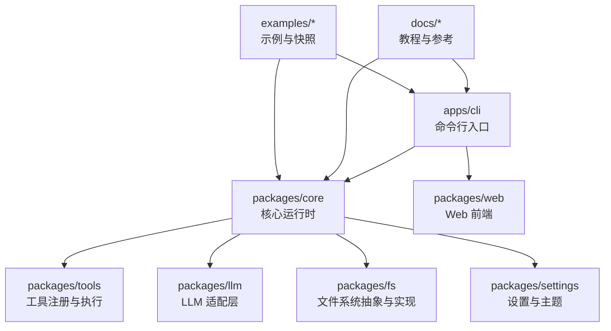
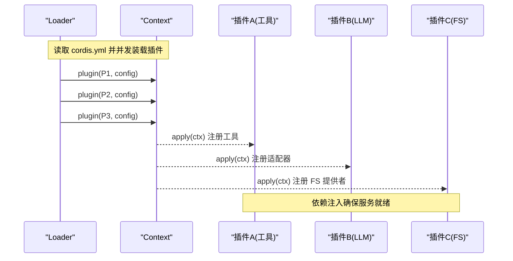
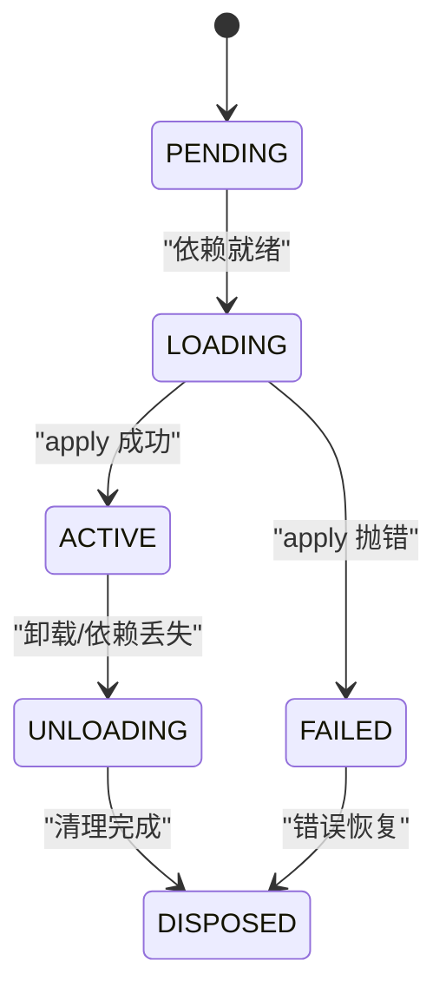
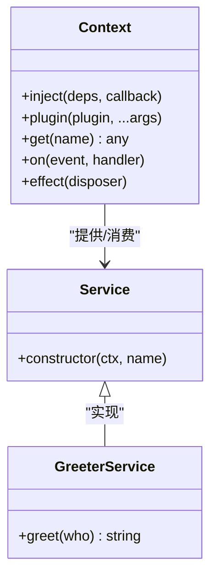
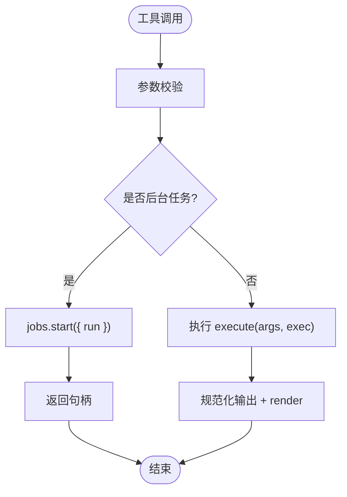
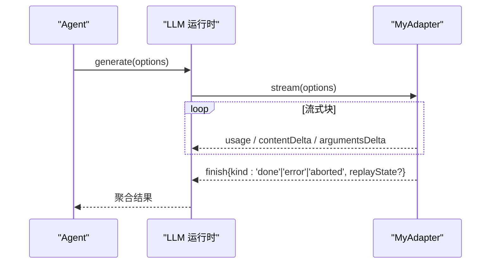
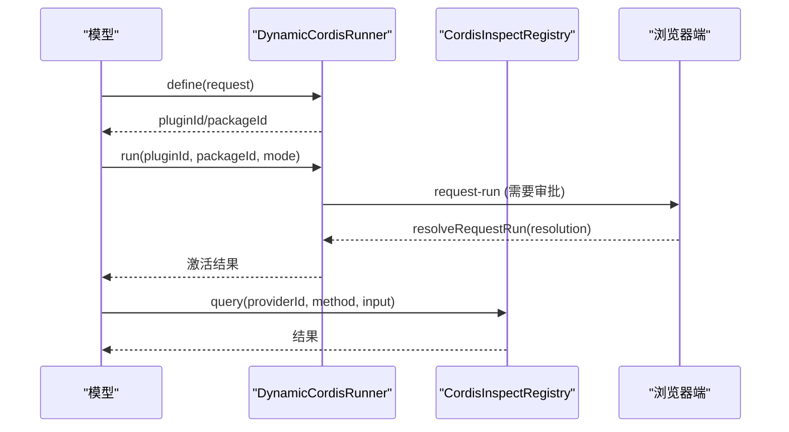
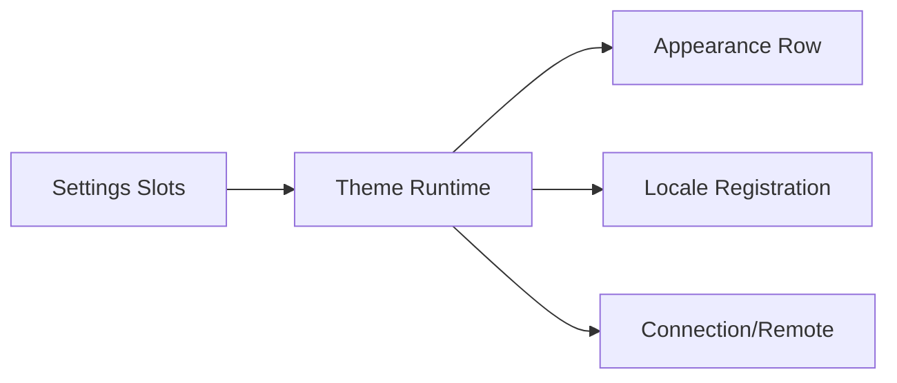
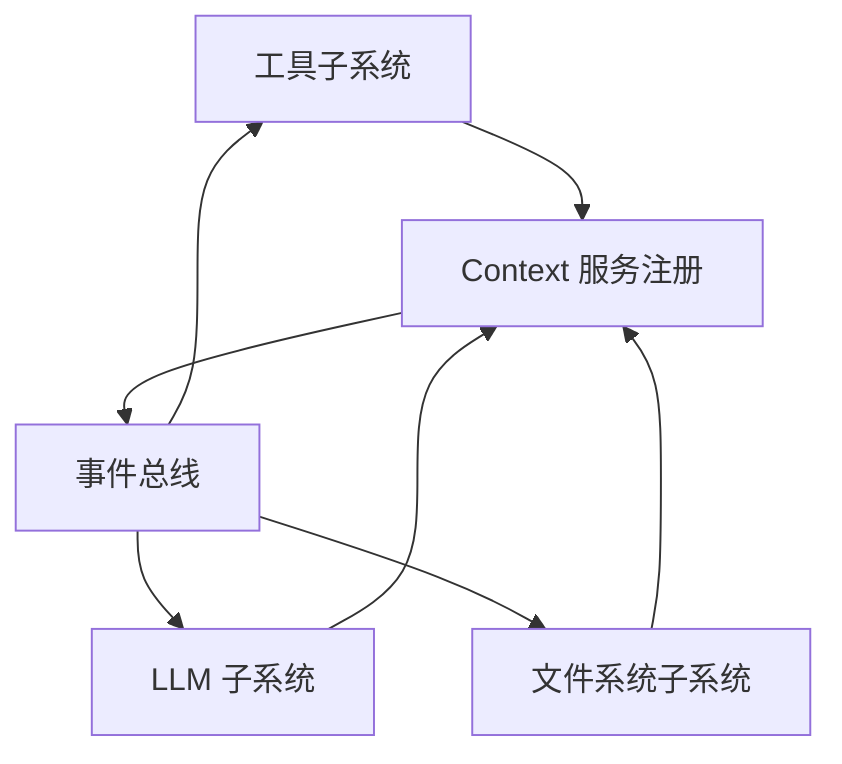

# 扩展开发

<cite>
**本文引用的文件**
- [README.md](file://README.md)
- [Cordis 教程索引](file://docs/cordis-tutorial/index.md)
- [注册表与依赖注入（Registry）](file://docs/cordis-api/registry.md)
- [插件生命周期与效果（Lifecycle and Effects）](file://docs/cordis-tutorial/02-lifecycle-and-effects.md)
- [服务与依赖（Services）](file://docs/cordis-tutorial/03-services.md)
- [扩展子系统 API（Extensions）](file://docs/subsystems/extensions.md)
- [文件系统子系统（Filesystem）](file://docs/subsystems/filesystem.md)
- [工具作者参考（Adding a Tool）](file://docs/cookbook/adding-a-tool.md)
- [添加 LLM 适配器（Adding an LLM Adapter）](file://docs/cookbook/adding-an-llm-adapter.md)
- [你的第一个 Harness 插件（User Basic Index）](file://docs/user/develop/basic/index.md)
- [测试策略（Testing Policy）](file://docs/testing.md)
</cite>

## 目录
1. [简介](#简介)
2. [项目结构](#项目结构)
3. [核心组件](#核心组件)
4. [架构总览](#架构总览)
5. [详细组件分析](#详细组件分析)
6. [依赖关系分析](#依赖关系分析)
7. [性能考虑](#性能考虑)
8. [故障排查指南](#故障排查指南)
9. [结论](#结论)
10. [附录](#附录)

## 简介
本指南面向 DeepSeek Harness 的扩展开发者，围绕“一切皆插件”的 Cordis 框架，系统讲解插件基础、结构与生命周期钩子；提供自定义工具、LLM 适配器与文件系统提供者的完整开发路径；解释插件注册机制、依赖注入与服务发现；并覆盖测试策略、调试技巧、发布流程、主题定制与界面扩展方法，以及性能优化与安全最佳实践。

## 项目结构
DeepSeek Harness 采用多包工作区组织：
- apps：CLI 与 Web 应用入口
- packages：领域能力与子系统（如 tools、llm、fs、web、settings 等）
- docs：教程、API 参考、子系统文档与用户指南
- examples：可运行的示例与快照测试用例
- scripts：构建、验证、生成文档与测试脚本



图表来源
- [README.md:1-60](file://README.md#L1-L60)
- [Cordis 教程索引:1-61](file://docs/cordis-tutorial/index.md#L1-L61)

章节来源
- [README.md:1-60](file://README.md#L1-L60)
- [Cordis 教程索引:1-61](file://docs/cordis-tutorial/index.md#L1-L61)

## 核心组件
- 插件与上下文：插件通过导出 apply(ctx) 贡献能力；Context 提供注册、事件、服务、效果等 API。
- 服务与依赖注入：通过 inject 声明所需服务，框架保证加载顺序与可用性；Service 子类用于暴露跨插件能力。
- 工具：使用 defineTool 定义模型可调用的工具，包含参数 schema、输出渲染、执行契约与呈现意图。
- LLM 适配器：继承 LlmAdapter 实现流式协议，注册到 ctx.llm 以接入新模型提供商。
- 文件系统：抽象 FileSystem 接口 + 本地/沙箱后端 + 观察策略事件，统一读写编辑与版本守卫。
- 扩展子系统：动态插件运行、宿主/客户端半程协调、检查与清单同步、事件总线。

章节来源
- [注册表与依赖注入（Registry）:1-153](file://docs/cordis-api/registry.md#L1-L153)
- [服务与依赖（Services）:1-99](file://docs/cordis-tutorial/03-services.md#L1-L99)
- [工具作者参考（Adding a Tool）:1-95](file://docs/cookbook/adding-a-tool.md#L1-L95)
- [添加 LLM 适配器（Adding an LLM Adapter）:1-44](file://docs/cookbook/adding-an-llm-adapter.md#L1-L44)
- [文件系统子系统（Filesystem）:1-496](file://docs/subsystems/filesystem.md#L1-L496)
- [扩展子系统 API（Extensions）:1-365](file://docs/subsystems/extensions.md#L1-L365)

## 架构总览
插件在 Cordis Context 中按配置挂载，依赖驱动加载，生命周期受 Fiber 状态机管理；工具、LLM、FS 等能力通过服务与事件解耦；扩展子系统支持动态插件定义、宿主/客户端协同与检查查询。



图表来源
- [Cordis 教程索引:1-61](file://docs/cordis-tutorial/index.md#L1-L61)
- [注册表与依赖注入（Registry）:1-153](file://docs/cordis-api/registry.md#L1-L153)

## 详细组件分析

### 插件生命周期与钩子
- Fiber 状态机：PENDING → LOADING → ACTIVE → UNLOADING → DISPOSED；失败进入 FAILED。
- 自动清理：通过 ctx.on、ctx.tools.register、ctx.llm.registerAdapter、ctx.effect 注册的资源随插件卸载自动回收。
- 外部副作用：必须用 ctx.effect 包裹并返回清理函数，确保热重载或卸载时安全释放。



图表来源
- [插件生命周期与效果（Lifecycle and Effects）:1-60](file://docs/cordis-tutorial/02-lifecycle-and-effects.md#L1-L60)
- [你的第一个 Harness 插件（User Basic Index）:1-145](file://docs/user/develop/basic/index.md#L1-L145)

章节来源
- [插件生命周期与效果（Lifecycle and Effects）:1-60](file://docs/cordis-tutorial/02-lifecycle-and-effects.md#L1-L60)
- [你的第一个 Harness 插件（User Basic Index）:1-145](file://docs/user/develop/basic/index.md#L1-L145)

### 服务、依赖注入与服务发现
- 提供服务：继承 Service 并在构造函数中调用 super(ctx, name)，即可将实例注册为服务。
- 消费服务：在插件中声明 inject = ['serviceName']，框架保证 apply 内服务可用。
- 可选依赖：使用 ctx.get('name') 获取可能不存在的服务，避免强耦合。
- 命名空间：服务名全局唯一，建议前缀区分。



图表来源
- [注册表与依赖注入（Registry）:1-153](file://docs/cordis-api/registry.md#L1-L153)
- [服务与依赖（Services）:1-99](file://docs/cordis-tutorial/03-services.md#L1-L99)

章节来源
- [注册表与依赖注入（Registry）:1-153](file://docs/cordis-api/registry.md#L1-L153)
- [服务与依赖（Services）:1-99](file://docs/cordis-tutorial/03-services.md#L1-L99)

### 自定义工具开发
- 最小形态：defineTool 声明 name、description、parameters、output.schema/render、execute。
- 执行契约：参数由框架校验；返回值需为规范 JSON；抛出异常或非法值视为错误；必须尊重 exec.signal。
- 长任务：通过 jobs.start 启动后台任务，返回句柄供 UI 跟踪。
- 呈现意图：presentCall/presentResult 返回 card 类型（generic/terminal/diff/search/web），纯函数且可回放。
- 代码模式：注册后可直接 await tools.<name>(args) 调用，走同一执行管线。



图表来源
- [工具作者参考（Adding a Tool）:1-95](file://docs/cookbook/adding-a-tool.md#L1-L95)

章节来源
- [工具作者参考（Adding a Tool）:1-95](file://docs/cookbook/adding-a-tool.md#L1-L95)

### LLM 适配器开发
- 形状：继承 LlmAdapter，实现 stream(options) 产出 StreamChunk；在 apply 中通过 ctx.llm.registerAdapter 注册。
- 协议义务：usage 必须在 finish 之前；finish 后不再发送任何块；arguments 作为原始 JSON 字符串传递；错误通过 throw 或 finish{kind:'error'|'aborted'} 上报；尊重 options.signal；不支持的能力应明确报错。
- 模型元数据：实现 resolveModel 提供能力列表与默认 effort；保持 provider-neutral 能力边界。
- 实现结构：分离 wire 类型、请求序列化、传输解析、块转换与适配器类。



图表来源
- [添加 LLM 适配器（Adding an LLM Adapter）:1-44](file://docs/cookbook/adding-an-llm-adapter.md#L1-L44)

章节来源
- [添加 LLM 适配器（Adding an LLM Adapter）:1-44](file://docs/cookbook/adding-an-llm-adapter.md#L1-L44)

### 文件系统提供者与策略
- 抽象与后端：FileSystem 提供 resolve/stat/read/write/edit/listDir 等；dsh-fs-local 为本地实现，dsh-fs-sandbox 为沙箱实现。
- 版本守卫：writeText/editText 支持 createIfAbsent/replaceIfVersion，基于 FsVersion 防冲突。
- 策略事件：fs/write-intent、fs/edit-intent 为单槽决策瀑布；fs/observed 记录存在/缺失观测；策略插件不阻塞工具，仅决定守卫行为。
- 错误分类：稳定错误码便于重试、权限与 UI 分支处理。

```mermaid
flowchart TD
R["read/write/edit"] --> Intent{"intent 瀑布"}
Intent --> |createIfAbsent| W["创建或拒绝已存在"]
Intent --> |replaceIfVersion| V["版本匹配则替换"]
Intent --> |next()| Bare["裸提供者无条件写入"]
R --> Observe["fs/observed 记录观测"]
W --> Done["原子提交并返回版本"]
V --> Done
Bare --> Done
```

图表来源
- [文件系统子系统（Filesystem）:1-496](file://docs/subsystems/filesystem.md#L1-L496)

章节来源
- [文件系统子系统（Filesystem）:1-496](file://docs/subsystems/filesystem.md#L1-L496)

### 动态插件与扩展子系统
- 动态注册：DynamicCordisRunnerService 支持 define/run/stop/invoke/snapshot 等，管理 Host/Client 半程生命周期。
- 检查与清单：CordisInspectRegistryService 提供 list/query/syncClientManifest 等，支持跨页面路由与只读查询。
- 事件：cordis/dynamic-package、cordis/request-run、cordis/inspect-query 等事件贯穿激活、审批与查询流程。



图表来源
- [扩展子系统 API（Extensions）:1-365](file://docs/subsystems/extensions.md#L1-L365)

章节来源
- [扩展子系统 API（Extensions）:1-365](file://docs/subsystems/extensions.md#L1-L365)

### 主题定制与界面扩展
- 设置插槽：ui-settings 通过 slots 注册通用设置项，UI 壳层零拷贝，特性自管设置页。
- 主题服务：ui-theme 提供 theme 服务，监听 theme/change 事件，绑定 settingsScope 持久化偏好。
- 扩展点：通过 slots/locale/connection/remote/settingsScope 等服务组合外观与国际化。



图表来源
- [你的第一个 Harness 插件（User Basic Index）:1-145](file://docs/user/develop/basic/index.md#L1-L145)

章节来源
- [你的第一个 Harness 插件（User Basic Index）:1-145](file://docs/user/develop/basic/index.md#L1-L145)

## 依赖关系分析
- 插件间松耦合：通过服务名与事件通信，避免直接导入。
- 依赖驱动加载：inject 声明硬依赖，服务消失时自动卸载再加载。
- 子系统边界：tools/llm/fs 各自维护能力边界，通过 ctx 暴露能力。



图表来源
- [注册表与依赖注入（Registry）:1-153](file://docs/cordis-api/registry.md#L1-L153)
- [文件系统子系统（Filesystem）:1-496](file://docs/subsystems/filesystem.md#L1-L496)

章节来源
- [注册表与依赖注入（Registry）:1-153](file://docs/cordis-api/registry.md#L1-L153)
- [文件系统子系统（Filesystem）:1-496](file://docs/subsystems/filesystem.md#L1-L496)

## 性能考虑
- 工具执行：优先使用后台任务处理长耗时操作，避免阻塞主循环；合理设置超时与取消信号。
- 流式 LLM：遵循协议减少冗余块，缓冲 finish/usage 以避免尾部数据问题。
- 文件系统：使用流式读取大文件，限制字节上限；利用版本守卫减少冲突重试。
- 插件卸载：通过 effect 管理定时器/连接，避免内存泄漏与悬挂回调。
- 快照与回放：UI 呈现器保持纯函数，利于回放与缓存。

[本节为通用指导，无需特定文件引用]

## 故障排查指南
- 插件未加载：检查 cordis.yml 模块解析是否正确；Loader 无法解析时会通过日志报告而非崩溃。
- 依赖缺失：确认 inject 声明的服务已提供；服务消失会导致依赖插件卸载。
- 工具无输出：检查 output.render 与 presentCall/presentResult 是否返回有效 card；回放需纯函数。
- LLM 适配器异常：确认 finish 前已发送 usage；错误通过 throw 或 finish{kind:'error'|'aborted'} 上报；尊重 signal。
- 文件系统冲突：使用 replaceIfVersion 守卫；出现 FS_STALE_VERSION 时需重新读取最新版本。
- 测试失败：遵循测试策略，优先真实入口路径与键控 e2e；必要时更新快照。

章节来源
- [你的第一个 Harness 插件（User Basic Index）:1-145](file://docs/user/develop/basic/index.md#L1-L145)
- [测试策略（Testing Policy）:1-50](file://docs/testing.md#L1-L50)

## 结论
DeepSeek Harness 以 Cordis 为核心，通过插件化、服务化与事件化实现了高度可扩展的 AI 代理平台。开发者可基于统一的 Context 与契约，快速构建工具、LLM 适配器与文件系统提供者，并通过扩展子系统实现动态加载与跨端协作。配合完善的测试策略与性能、安全最佳实践，能够高效交付高质量扩展。

## 附录
- 快速开始：从仓库根目录克隆、安装依赖、构建并运行 Web UI。
- 教程路径：Cordis 教程从零搭建插件，逐步引入生命周期、服务、事件、配置与集成。
- 示例与快照：examples 下提供可运行场景与快照测试，便于回归与演示。

章节来源
- [README.md:1-60](file://README.md#L1-L60)
- [Cordis 教程索引:1-61](file://docs/cordis-tutorial/index.md#L1-L61)