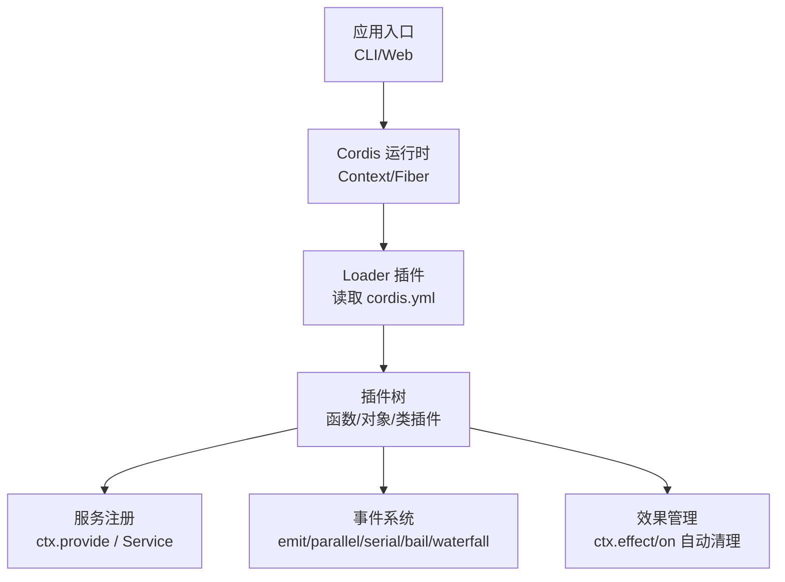
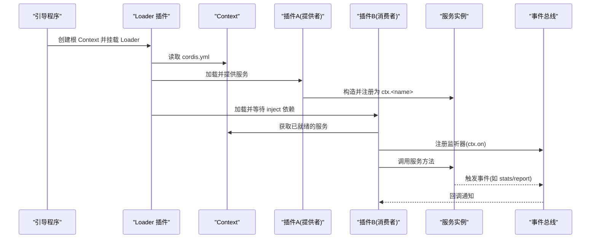
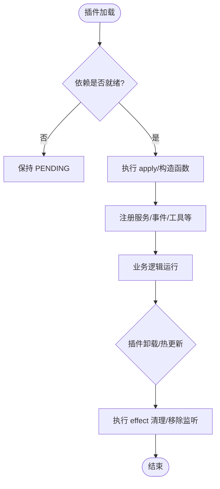
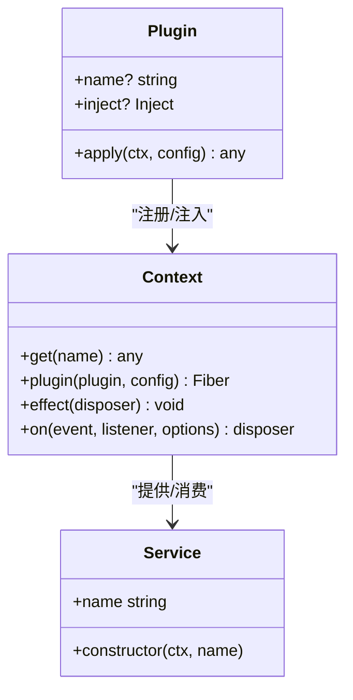
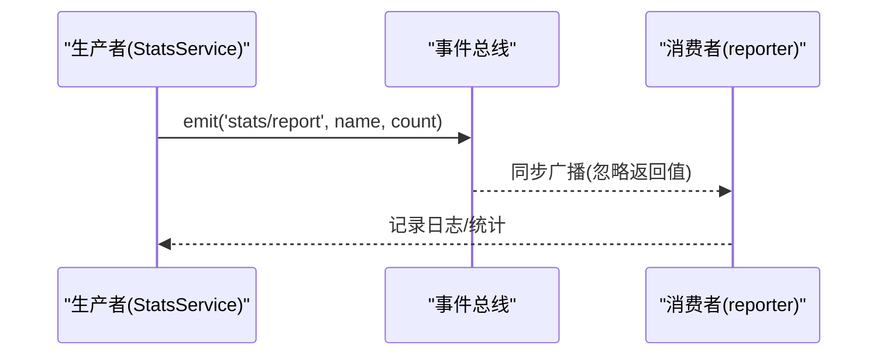
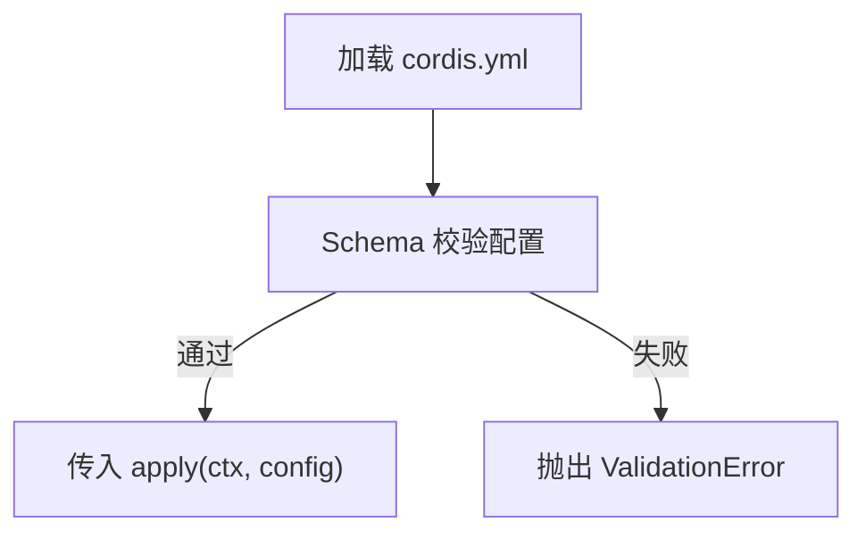

# 插件开发基础

<cite>
**本文引用的文件**
- [docs/cordis-primer.md](file://docs/cordis-primer.md)
- [docs/cordis-tutorial/index.md](file://docs/cordis-tutorial/index.md)
- [docs/cordis-tutorial/01-first-plugin.md](file://docs/cordis-tutorial/01-first-plugin.md)
- [docs/cordis-tutorial/02-lifecycle-and-effects.md](file://docs/cordis-tutorial/02-lifecycle-and-effects.md)
- [docs/cordis-tutorial/03-services.md](file://docs/cordis-tutorial/03-services.md)
- [docs/cordis-tutorial/04-events.md](file://docs/cordis-tutorial/04-events.md)
- [docs/cordis-tutorial/05-config.md](file://docs/cordis-tutorial/05-config.md)
- [docs/cordis-tutorial/06-composition-and-hmr.md](file://docs/cordis-tutorial/06-composition-and-hmr.md)
- [docs/cordis-tutorial/07-into-the-harness.md](file://docs/cordis-tutorial/07-into-the-harness.md)
- [docs/cordis-api/context.md](file://docs/cordis-api/context.md)
- [docs/cordis-api/events.md](file://docs/cordis-api/events.md)
- [docs/cordis-api/fiber.md](file://docs/cordis-api/fiber.md)
- [docs/cordis-api/registry.md](file://docs/cordis-api/registry.md)
- [docs/cordis-api/service.md](file://docs/cordis-api/service.md)
- [docs/user/develop/basic/index.md](file://docs/user/develop/basic/index.md)
- [apps/cli/config/agent-presets/cordis/skills/cordis-plugin-development/SKILL.md](file://apps/cli/config/agent-presets/cordis/skills/cordis-plugin-development/SKILL.md)
- [examples/acp-agent/cordis.yml](file://examples/acp-agent/cordis.yml)
- [examples/headless-agent/cordis.yml](file://examples/headless-agent/cordis.yml)
- [examples/jsonrpc-agent/cordis.yml](file://examples/jsonrpc-agent/cordis.yml)
- [examples/web-cordis/cordis.yml](file://examples/web-cordis/cordis.yml)
- [examples/web-schedule/cordis.yml](file://examples/web-schedule/cordis.yml)
- [scripts/gen-config-catalog.ts](file://scripts/gen-config-catalog.ts)
- [docs/testing.md](file://docs/testing.md)
</cite>

## 目录
1. [简介](#简介)
2. [项目结构](#项目结构)
3. [核心组件](#核心组件)
4. [架构总览](#架构总览)
5. [详细组件分析](#详细组件分析)
6. [依赖关系分析](#依赖关系分析)
7. [性能与可维护性](#性能与可维护性)
8. [故障排查指南](#故障排查指南)
9. [结论](#结论)
10. [附录：从入门到高级的开发路径](#附录从入门到高级的开发路径)

## 简介
本指南面向 DeepSeek Harness 插件开发者，系统讲解基于 Cordis 的插件架构、生命周期、服务注入与事件机制，并给出最小化模板到复杂实现的完整路径。你将学会如何组织插件目录、编写配置文件、声明依赖、注册能力、调试与测试，以及发布流程要点。文档内容严格来源于仓库内的教程、API 参考与示例工程。

## 项目结构
DeepSeek Harness 将“一切皆插件”的理念贯穿始终：工具、LLM 适配器、文件系统、会话等能力均以插件形式挂载到共享上下文（Context）。Cordis 是底层插件框架，负责加载、依赖解析、生命周期管理与事件分发。

- 教程与 API 参考位于 docs/cordis-* 目录，提供从零开始的实操步骤与生成式 API 文档。
- 用户级插件入门位于 docs/user/develop/basic/index.md，指导如何在 Web UI 中加载本地插件。
- 示例工程位于 examples/*，包含多种 cordis.yml 组合方式，便于对照学习。
- 配置目录与预设位于 apps/cli/config/agent-presets/*，展示不同场景下的插件装配。



图表来源
- [docs/cordis-tutorial/index.md:1-61](file://docs/cordis-tutorial/index.md#L1-L61)
- [docs/cordis-api/registry.md:1-153](file://docs/cordis-api/registry.md#L1-L153)
- [docs/cordis-api/events.md:1-208](file://docs/cordis-api/events.md#L1-L208)

章节来源
- [docs/cordis-tutorial/index.md:1-61](file://docs/cordis-tutorial/index.md#L1-L61)

## 核心组件
- 上下文 Context：插件能力的统一访问点，通过键名获取服务、注册效果、监听事件。
- 插件 Plugin：三种形态——函数、对象（含 apply）、类（继承 Service），由 Loader 加载并执行。
- 服务 Service：以 ctx.<name> 暴露的稳定 API，支持类型扩展与依赖注入。
- 事件 Events：跨插件通信机制，支持 emit、parallel、serial、bail、waterfall 多种分发模式。
- 效果 Effects：通过 ctx.effect() 或 ctx.on() 注册的副作用，随插件卸载自动回滚。
- 配置 Config：通过 Schema 校验 cordis.yml 中的配置，失败即停止加载，避免半配置运行。

章节来源
- [docs/cordis-primer.md:1-13](file://docs/cordis-primer.md#L1-L13)
- [docs/cordis-api/registry.md:1-153](file://docs/cordis-api/registry.md#L1-L153)
- [docs/cordis-api/service.md:1-103](file://docs/cordis-api/service.md#L1-L103)
- [docs/cordis-api/events.md:1-208](file://docs/cordis-api/events.md#L1-L208)
- [docs/cordis-tutorial/05-config.md:1-68](file://docs/cordis-tutorial/05-config.md#L1-L68)

## 架构总览
下图展示了插件从加载到运行的关键路径：Loader 读取 cordis.yml，按依赖关系启动插件；插件通过 Service 暴露能力，通过事件与其他插件协作；所有注册的效果在卸载时自动清理。



图表来源
- [docs/cordis-tutorial/index.md:1-61](file://docs/cordis-tutorial/index.md#L1-L61)
- [docs/cordis-tutorial/03-services.md:1-99](file://docs/cordis-tutorial/03-services.md#L1-L99)
- [docs/cordis-tutorial/04-events.md:1-145](file://docs/cordis-tutorial/04-events.md#L1-L145)

## 详细组件分析

### 插件生命周期与效果
- 插件入口支持函数、对象（apply）和类（Service 子类）。
- 通过 ctx.effect() 返回清理函数，确保资源释放；通过 ctx.on() 注册的事件监听器随插件卸载自动移除。
- 当依赖服务消失或被替换，依赖方插件会被卸载并重新加载，保证一致性。



图表来源
- [docs/cordis-tutorial/01-first-plugin.md:1-96](file://docs/cordis-tutorial/01-first-plugin.md#L1-L96)
- [docs/cordis-tutorial/02-lifecycle-and-effects.md:1-200](file://docs/cordis-tutorial/02-lifecycle-and-effects.md#L1-L200)
- [docs/cordis-tutorial/03-services.md:1-99](file://docs/cordis-tutorial/03-services.md#L1-L99)

章节来源
- [docs/cordis-tutorial/01-first-plugin.md:1-96](file://docs/cordis-tutorial/01-first-plugin.md#L1-L96)
- [docs/cordis-tutorial/02-lifecycle-and-effects.md:1-200](file://docs/cordis-tutorial/02-lifecycle-and-effects.md#L1-L200)
- [docs/cordis-tutorial/03-services.md:1-99](file://docs/cordis-tutorial/03-services.md#L1-L99)

### 服务注入与依赖管理
- 使用 inject 声明硬依赖，Cordis 会等待所有依赖就绪后再执行插件。
- 可选依赖通过 ctx.get('name') 探测，避免不必要的阻塞。
- 服务名称在同一应用中处于扁平命名空间，建议前缀区分。



图表来源
- [docs/cordis-api/registry.md:1-153](file://docs/cordis-api/registry.md#L1-L153)
- [docs/cordis-api/service.md:1-103](file://docs/cordis-api/service.md#L1-L103)
- [docs/cordis-tutorial/03-services.md:1-99](file://docs/cordis-tutorial/03-services.md#L1-L99)

章节来源
- [docs/cordis-tutorial/03-services.md:1-99](file://docs/cordis-tutorial/03-services.md#L1-L99)
- [docs/cordis-api/registry.md:1-153](file://docs/cordis-api/registry.md#L1-L153)

### 事件系统与拦截
- 事件用于解耦通信，支持五种分发模式：emit、parallel、serial、bail、waterfall。
- Waterfall 模式可用于拦截与转换，遵循“只观察必须调用 next()”的规则。
- 事件签名通过 TypeScript 声明合并进行类型约束。



图表来源
- [docs/cordis-tutorial/04-events.md:1-145](file://docs/cordis-tutorial/04-events.md#L1-L145)
- [docs/cordis-api/events.md:1-208](file://docs/cordis-api/events.md#L1-L208)

章节来源
- [docs/cordis-tutorial/04-events.md:1-145](file://docs/cordis-tutorial/04-events.md#L1-L145)
- [docs/cordis-api/events.md:1-208](file://docs/cordis-api/events.md#L1-L208)

### 配置与验证
- 每个 cordis.yml 条目可携带 config 块，插件需导出同名 Schema 进行校验。
- 配置错误会在加载阶段抛出明确错误，避免半配置运行。
- 生成的配置目录（config catalog）汇总了各插件的可配置项与类型。



图表来源
- [docs/cordis-tutorial/05-config.md:1-68](file://docs/cordis-tutorial/05-config.md#L1-L68)
- [scripts/gen-config-catalog.ts:819-836](file://scripts/gen-config-catalog.ts#L819-L836)

章节来源
- [docs/cordis-tutorial/05-config.md:1-68](file://docs/cordis-tutorial/05-config.md#L1-L68)
- [scripts/gen-config-catalog.ts:819-836](file://scripts/gen-config-catalog.ts#L819-L836)

### 插件目录结构与配置文件格式
- 插件模块通常导出 name、apply（或对象/类形式的插件）。
- 通过 cordis.yml 组合插件树，支持 insert/overlay 等方式注入到宿主。
- Web 插件可通过 dsh web --patch 加载本地绝对路径插件。

章节来源
- [docs/user/develop/basic/index.md:1-145](file://docs/user/develop/basic/index.md#L1-L145)
- [examples/web-cordis/cordis.yml:1-200](file://examples/web-cordis/cordis.yml#L1-L200)
- [examples/web-schedule/cordis.yml:1-200](file://examples/web-schedule/cordis.yml#L1-L200)

### 环境限制与最佳实践
- code.host 与 code.client 为纯 JavaScript 函数体，不支持 import/require/TS 类型/装饰器/JSX。
- 客户端 React 代码需使用 React.createElement(...)。
- 谨慎使用 inject，仅在强依赖时使用；可选能力用 ctx.get 探测。

章节来源
- [apps/cli/config/agent-presets/cordis/skills/cordis-plugin-development/SKILL.md:61-125](file://apps/cli/config/agent-presets/cordis/skills/cordis-plugin-development/SKILL.md#L61-L125)

## 依赖关系分析
- 插件之间通过服务键名耦合，而非直接导入实现，便于配置替换与隔离。
- 依赖图由 inject 声明驱动，Loader 负责拓扑排序与等待。
- 事件作为松耦合通信通道，降低模块间直接依赖。

```mermaid
graph LR
A["插件A(提供者)"] --> |注册服务| K["Context"]
B["插件B(消费者)"] --> |inject['svc']| K
B --> |调用| A
A --> |事件| E["事件总线"]
B --> |监听| E
```

图表来源
- [docs/cordis-tutorial/03-services.md:1-99](file://docs/cordis-tutorial/03-services.md#L1-L99)
- [docs/cordis-tutorial/04-events.md:1-145](file://docs/cordis-tutorial/04-events.md#L1-L145)

章节来源
- [docs/cordis-tutorial/03-services.md:1-99](file://docs/cordis-tutorial/03-services.md#L1-L99)
- [docs/cordis-tutorial/04-events.md:1-145](file://docs/cordis-tutorial/04-events.md#L1-L145)

## 性能与可维护性
- 并发加载：cordis.yml 中插件条目并发启动，顺序由依赖决定，避免手工编排。
- 轻量依赖：优先使用事件与接口抽象，减少编译期耦合。
- 配置校验：尽早失败，避免运行时异常扩散。
- 热更新：HMR 下依赖变更会触发插件卸载与重载，确保状态一致。

章节来源
- [docs/cordis-tutorial/index.md:1-61](file://docs/cordis-tutorial/index.md#L1-L61)
- [docs/cordis-tutorial/06-composition-and-hmr.md:1-200](file://docs/cordis-tutorial/06-composition-and-hmr.md#L1-L200)

## 故障排查指南
- 插件未加载：检查 cordis.yml 模块路径拼写与解析；Loader 无法解析时会通过日志报告。
- 插件卡住 PENDING：确认 inject 依赖是否被提供；必要时使用 HMR 诊断。
- 配置错误：查看 Schema 校验抛出的 ValidationError，定位字段类型不匹配。
- 事件无响应：确认事件名与签名是否正确声明；Waterfall 中是否遗漏 next()。
- 资源泄漏：确保 ctx.effect() 返回清理函数；事件监听器应通过 ctx.on() 注册以便自动清理。

章节来源
- [docs/cordis-tutorial/01-first-plugin.md:1-96](file://docs/cordis-tutorial/01-first-plugin.md#L1-L96)
- [docs/cordis-tutorial/06-composition-and-hmr.md:1-200](file://docs/cordis-tutorial/06-composition-and-hmr.md#L1-L200)
- [docs/cordis-tutorial/05-config.md:1-68](file://docs/cordis-tutorial/05-config.md#L1-L68)
- [docs/cordis-tutorial/04-events.md:1-145](file://docs/cordis-tutorial/04-events.md#L1-L145)

## 结论
DeepSeek Harness 通过 Cordis 提供了强大而灵活的插件体系：以 Context 为中心，以 Service 为能力边界，以 Events 为通信纽带，以 Effects 保障生命周期安全。借助 cordis.yml 的组合能力与严格的配置校验，开发者可以构建从简单工具到复杂工作流的各类插件。遵循本指南的实践，你将能高效地设计、开发与调试插件，并顺利进入生产环境。

## 附录：从入门到高级的开发路径
- 入门
  - 阅读教程索引，了解 Cordis 基本概念与实操步骤。
  - 创建最小插件：导出 name 与 apply，并在 cordis.yml 中注册。
  - 理解生命周期与效果：使用 ctx.effect() 管理资源，使用 ctx.on() 监听事件。
- 进阶
  - 提供服务：继承 Service，通过 super(ctx, 'name') 注册能力。
  - 声明依赖：使用 inject 声明硬依赖，使用 ctx.get 处理可选依赖。
  - 事件通信：定义事件签名，选择合适的分发模式（emit/parallel/serial/bail/waterfall）。
  - 配置校验：导出 Schema，确保配置正确性与健壮性。
- 高级
  - 组合与 HMR：通过 cordis.yml 组装插件树，利用 HMR 快速迭代。
  - 接入 Harness：通过 Web UI 加载本地插件，集成真实服务（如 tools、llm）。
  - 测试与发布：遵循测试策略，编写单元、快照与 e2e 用例；按发布流程打包与分发。

章节来源
- [docs/cordis-tutorial/index.md:1-61](file://docs/cordis-tutorial/index.md#L1-L61)
- [docs/user/develop/basic/index.md:1-145](file://docs/user/develop/basic/index.md#L1-L145)
- [docs/testing.md:1-50](file://docs/testing.md#L1-L50)