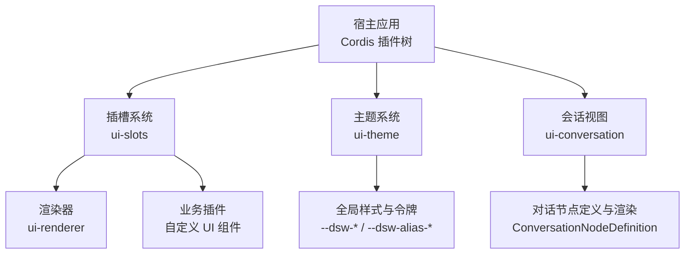
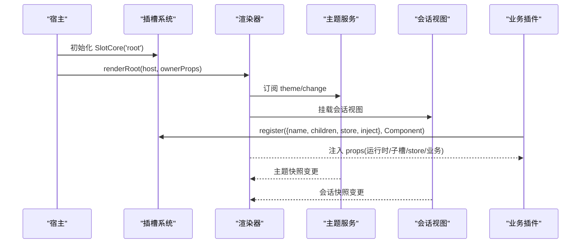
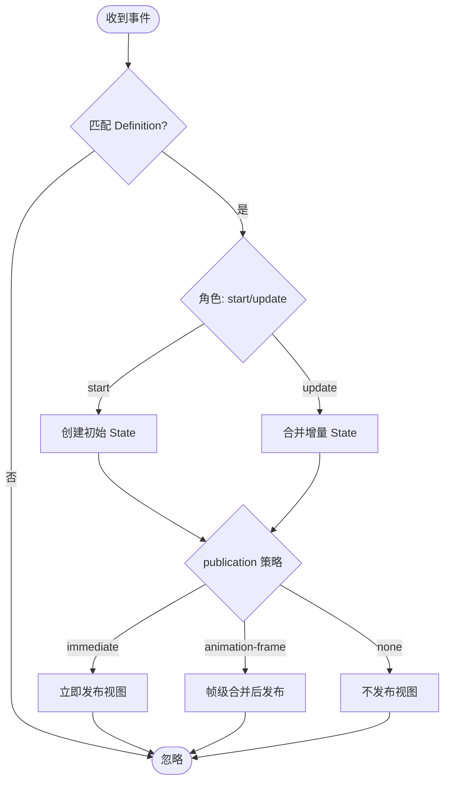
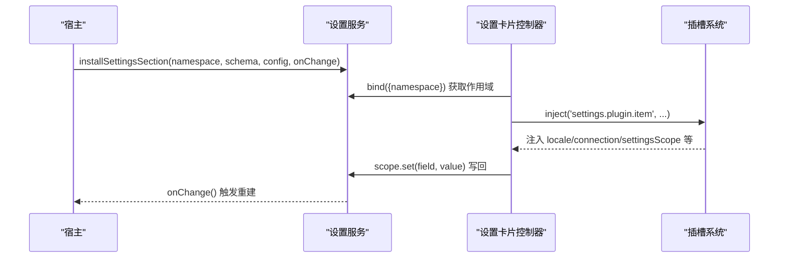
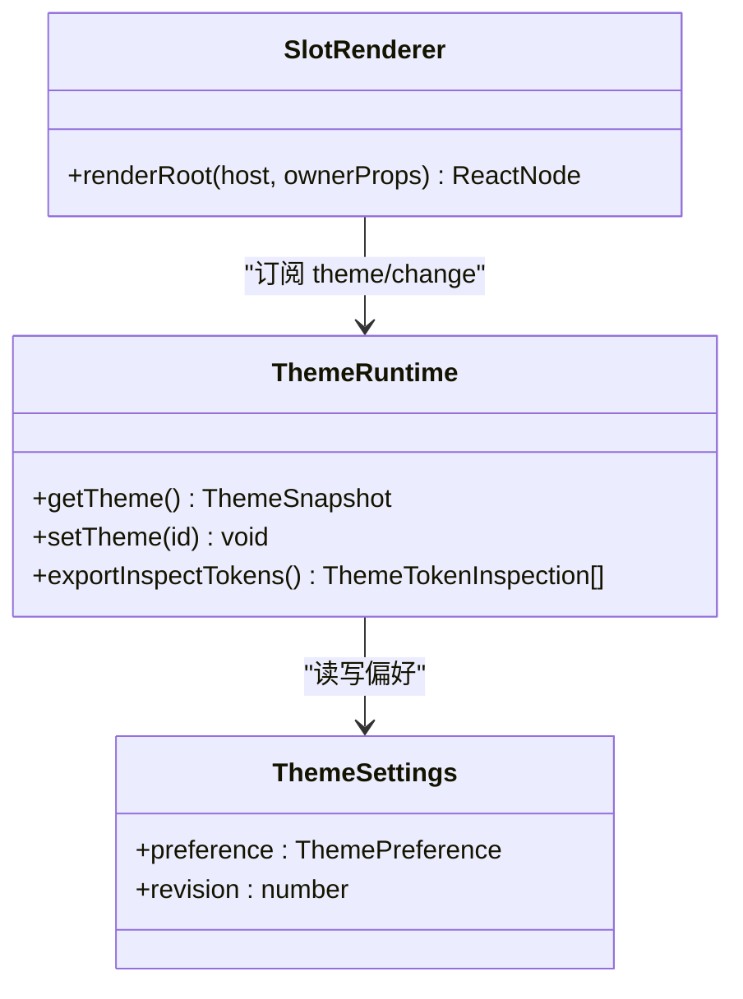
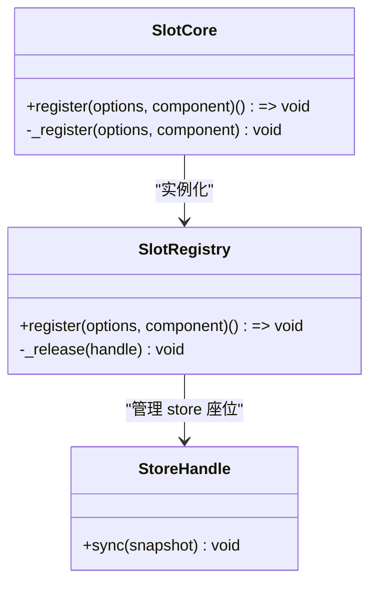
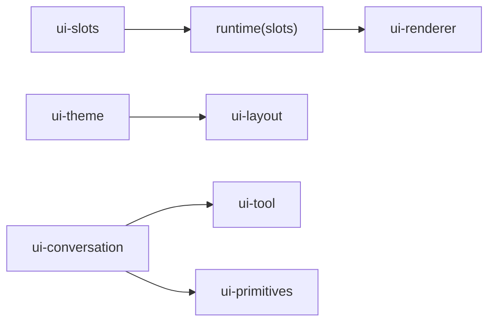

# 界面扩展

<cite>
**本文引用的文件**
- [添加对话节点](file://docs/cookbook/adding-a-conversation-node.md)
- [添加设置卡片](file://docs/cookbook/adding-a-settings-card.md)
- [Web UI 样式参考](file://docs/web-styling.md)
- [插槽系统标准（实现笔记）](file://.agents/notes/implemented/architecture/2026-07-22-slot-type-chain-implementation.md)
- [Web 客户端架构（实现笔记）](file://.agents/notes/implemented/architecture/2026-07-19-gui-web-client-architecture.md)
- [插槽注册表核心](file://packages/client/ui-slots/src/index.ts)
- [插槽渲染安装契约](file://packages/client/ui-slots/src/renderer.ts)
- [插槽运行时注册实现](file://packages/client/runtime/src/client/slots.ts)
- [主题插件入口（Host 侧）](file://packages/client/ui-theme/src/index.ts)
- [主题插件客户端入口](file://packages/client/ui-theme/src/client/index.ts)
- [主题插件 README](file://packages/client/ui-theme/README.md)
- [会话视图组件包 README](file://packages/client/ui-conversation/README.md)
- [测试策略](file://docs/testing.md)
- [国际化文档规范](file://docs/i18n/README.md)
</cite>

## 目录
1. [简介](#简介)
2. [项目结构](#项目结构)
3. [核心组件](#核心组件)
4. [架构总览](#架构总览)
5. [详细组件分析](#详细组件分析)
6. [依赖关系分析](#依赖关系分析)
7. [性能考虑](#性能考虑)
8. [故障排查指南](#故障排查指南)
9. [结论](#结论)
10. [附录](#附录)

## 简介
本指南面向需要在 DeepSeek Harness Web 端进行界面扩展的开发者，围绕 React 组件架构、插槽组合机制、主题系统与样式定制、状态管理与事件通信、用户交互模式与可访问性，提供从“如何添加对话节点”到“如何注册设置卡片”再到“如何编写可测试、可维护、可扩展的 UI 插件”的完整路径。目标是帮助你在不侵入宿主应用的前提下，以插件方式稳定地扩展界面，并保持与内置 UI 一致的视觉、行为与可维护性。

## 项目结构
DeepSeek Harness 的 Web 端采用“插件化 + 插槽组合”的架构：
- 宿主通过 Cordis 加载多个独立插件；
- 每个插件通过声明式插槽（Slot）将自身 UI 注入到指定区域；
- 主题、布局、会话视图等由若干专用包协作完成；
- 数据流通过不可变快照与事件驱动更新，React 仅消费快照并做最小重渲染。

图表来源
- [Web 客户端架构（实现笔记）:1-84](file://.agents/notes/implemented/architecture/2026-07-19-gui-web-client-architecture.md#L1-L84)
- [插槽系统标准（实现笔记）:1-15](file://.agents/notes/implemented/architecture/2026-07-22-slot-type-chain-implementation.md#L1-L15)
- [会话视图组件包 README:1-20](file://packages/client/ui-conversation/README.md#L1-L20)

章节来源
- [Web 客户端架构（实现笔记）:1-84](file://.agents/notes/implemented/architecture/2026-07-19-gui-web-client-architecture.md#L1-L84)
- [插槽系统标准（实现笔记）:1-15](file://.agents/notes/implemented/architecture/2026-07-22-slot-type-chain-implementation.md#L1-L15)

## 核心组件
- 插槽系统（ui-slots）：纯核心的插槽注册表与类型链，负责声明槽位、授权渲染、绑定 store 座位与业务注入面，所有 props 类型由单一声明推导。
- 渲染器（ui-renderer）：将宿主 API 与 React 适配，挂载根插槽树，并将不可变快照绑定为 React 钩子供组件消费。
- 主题系统（ui-theme）：管理主题偏好、令牌与全局样式注入，提供 `theme/change` 事件与设置项集成。
- 会话视图（ui-conversation）：会话骨架、聊天视图、输入区、队列、详情壳等，并通过“对话节点”机制扩展聊天行。
- 设置插件（ui-settings-plugins）：在设置页中按命名空间注册卡片，读写配置作用域。

章节来源
- [插槽注册表核心:1-24](file://packages/client/ui-slots/src/index.ts#L1-L24)
- [插槽渲染安装契约:188-207](file://packages/client/ui-slots/src/renderer.ts#L188-L207)
- [主题插件入口（Host 侧）:1-43](file://packages/client/ui-theme/src/index.ts#L1-L43)
- [主题插件客户端入口:198-416](file://packages/client/ui-theme/src/client/index.ts#L198-L416)
- [会话视图组件包 README:1-48](file://packages/client/ui-conversation/README.md#L1-L48)

## 架构总览
Web 客户端的核心思想是“对象层 + 快照 + 插槽 + 事件”：
- 对象层（runtime）持有 Session、工作区、连接等可观察源；
- ui-renderer 将对象层暴露为 React 可消费的 selector 钩子；
- 插件通过 slots.register 声明 UI 贡献，并在同一调用中声明子槽、store 座位与业务注入面；
- 主题、会话、设置等通过事件与快照驱动 UI 更新。

图表来源
- [Web 客户端架构（实现笔记）:78-84](file://.agents/notes/implemented/architecture/2026-07-19-gui-web-client-architecture.md#L78-L84)
- [插槽系统标准（实现笔记）:97-122](file://.agents/notes/implemented/architecture/2026-07-22-slot-type-chain-implementation.md#L97-L122)
- [主题插件客户端入口:391-416](file://packages/client/ui-theme/src/client/index.ts#L391-L416)

## 详细组件分析

### 对话节点（Conversation Node）
目标：在不扫描事件窗口或已渲染节点的情况下，基于稳定的事件族增量构建业务状态，并以键控 Chat Node 形式渲染。

关键要点
- 设计可回放的事件族：为每个事件携带稳定业务 id；start/progress/end 三态清晰；增量事件需具备确定性。
- 实现 Definition 与类型化 Chat payload：通过 declare module 扩展 SessionEventMap、ChatNodeDataMap、ConversationStepDataMap。
- 生命周期：match 提取身份与角色；start 创建初始 State；update 合并增量；publication 控制发布节奏（immediate/animation-frame/none）。
- 位置数据：buildLocationData 将 Definition 自有数据发布到 Turn/Step，供同位置其他节点消费。
- 视图节点：buildViewNode 返回 renderer-ready 数据，保持 context.key 稳定，使用 visibility 控制显隐而非移除。
- 查询前驱：start 内通过 ConversationContextReader.previous 获取更早的业务 Context，避免扫描事件。

图表来源
- [添加对话节点:25-199](file://docs/cookbook/adding-a-conversation-node.md#L25-L199)

章节来源
- [添加对话节点:9-234](file://docs/cookbook/adding-a-conversation-node.md#L9-L234)
- [会话视图组件包 README:13-16](file://packages/client/ui-conversation/README.md#L13-L16)

### 设置卡片（Settings Card）
目标：在 Web 设置页中以命名空间为单位注册卡片，读写配置并受版本围栏保护。

关键要点
- Host 侧：通过 installSettingsSection 注册命名空间、Schema 与变更回调；支持 secret 字段与 applies:'restart'。
- 浏览器侧：通过 ctx.settingsScope 读取 value/base/user 三层，使用 set/unset 写入单个字段；通过 slots.inject/register 将卡片注入 settings.plugin.item。
- 打包：导出 ./client 并声明 dsh.client，由模块系统按需懒加载。

图表来源
- [添加设置卡片:9-70](file://docs/cookbook/adding-a-settings-card.md#L9-L70)

章节来源
- [添加设置卡片:9-101](file://docs/cookbook/adding-a-settings-card.md#L9-L101)

### 主题系统与样式定制
目标：统一主题令牌、语义别名与全局样式，确保功能组件只消费语义 token，不直接引用静态色板。

关键要点
- 所有权：ui-theme 拥有 --dsw-* 静态刻度、语义别名、排版、动效、渐变、阴影、滚动条样式与明暗偏好；ui-layout 将解析后的主题快照应用到文档。
- 规则：组件样式使用 CSS Modules 与 clsx；使用 --dsw-alias-*；主题选择器不在功能组件 CSS 中；保留键盘焦点可见性与减少动效行为。
- 运行时：ThemeRuntime 管理偏好、解析 system、发布 ThemeSnapshot；通过 settings 持久化；Host 注入初始主题到 HTML。

图表来源
- [主题插件客户端入口:198-231](file://packages/client/ui-theme/src/client/index.ts#L198-L231)
- [插槽渲染安装契约:188-207](file://packages/client/ui-slots/src/renderer.ts#L188-L207)

章节来源
- [Web UI 样式参考:1-26](file://docs/web-styling.md#L1-L26)
- [主题插件 README:1-27](file://packages/client/ui-theme/README.md#L1-L27)
- [主题插件客户端入口:391-416](file://packages/client/ui-theme/src/client/index.ts#L391-L416)

### 插槽系统与 React 组件架构
目标：通过单一 register 调用同时完成 UI 贡献、子槽声明、store 座位与业务注入面，使组件 props 类型完全由声明推导。

关键要点
- 四份共享 props：运行时（owner/session/global）、子槽渲染、store、业务注入面；全部来自单一 SlotMap 入口。
- 类型链：register 签名使用裸函数签名与 NoInfer 固定推断，防止组件漂移吸收类型错误。
- 生命周期：SlotCore 在构造时播种 'root'；卸载时递归折叠子槽、贡献与 store 挂载。
- 运行时注册：ctx.effect 绑定 dispose，保证插件卸载时清理。

图表来源
- [插槽系统标准（实现笔记）:97-122](file://.agents/notes/implemented/architecture/2026-07-22-slot-type-chain-implementation.md#L97-L122)
- [插槽运行时注册实现:448-471](file://packages/client/runtime/src/client/slots.ts#L448-L471)

章节来源
- [插槽注册表核心:1-24](file://packages/client/ui-slots/src/index.ts#L1-L24)
- [插槽系统标准（实现笔记）:97-122](file://.agents/notes/implemented/architecture/2026-07-22-slot-type-chain-implementation.md#L97-L122)
- [插槽运行时注册实现:448-471](file://packages/client/runtime/src/client/slots.ts#L448-L471)

### 状态管理与事件通信
- 不可变快照：生产者使用结构共享，消费者通过 Object.is 或 shallowEqual 短路比较，React.memo 浅比较。
- 事件驱动：主题变更、会话快照、工具结果等通过事件通知；UI 订阅快照或事件，避免全局状态散落导致的抖动。
- 会话视图：会话骨架、聊天视图、输入区、队列、详情壳等通过标准 kit 提供的 useSession/useWorkspaces/useInput 等钩子消费状态。

章节来源
- [Web 客户端架构（实现笔记）:78-84](file://.agents/notes/implemented/architecture/2026-07-19-gui-web-client-architecture.md#L78-L84)
- [会话视图组件包 README:37-48](file://packages/client/ui-conversation/README.md#L37-L48)

### 用户交互模式与可访问性
- 键盘可达：提交、导航、菜单、确认等交互需支持键盘操作与焦点可见性。
- 屏幕阅读器：为关键控件提供 aria-* 属性（如 aria-expanded、aria-controls），对提示与告警使用 alert/role 语义。
- 动效与无障碍：尊重 prefers-reduced-motion，避免仅依赖 hover 的交互。

章节来源
- [Web UI 样式参考:13-22](file://docs/web-styling.md#L13-L22)

## 依赖关系分析
- ui-slots 是纯核心，无 React 运行时依赖，仅依赖 React 类型；ui-renderer 实现安装契约；runtime 提供插槽注册的生命周期绑定。
- ui-theme 通过 Host 设置与 HTTP 注入初始主题，并向 ui-layout 提供快照。
- ui-conversation 依赖 ui-tool、ui-primitives 等，并通过插槽扩展 composer、view、input 等区域。

图表来源
- [插槽注册表核心:1-24](file://packages/client/ui-slots/src/index.ts#L1-L24)
- [插槽运行时注册实现:448-471](file://packages/client/runtime/src/client/slots.ts#L448-L471)
- [主题插件入口（Host 侧）:1-43](file://packages/client/ui-theme/src/index.ts#L1-L43)
- [会话视图组件包 README:1-20](file://packages/client/ui-conversation/README.md#L1-L20)

章节来源
- [插槽注册表核心:1-24](file://packages/client/ui-slots/src/index.ts#L1-L24)
- [插槽运行时注册实现:448-471](file://packages/client/runtime/src/client/slots.ts#L448-L471)
- [主题插件入口（Host 侧）:1-43](file://packages/client/ui-theme/src/index.ts#L1-L43)
- [会话视图组件包 README:1-20](file://packages/client/ui-conversation/README.md#L1-L20)

## 性能考虑
- 事件处理：每个 incoming 事件对每个 Definition 执行一次 match，之后常量时间查找 Context；避免遍历事件窗口或已渲染节点集合。
- 发布节奏：publication 使用 immediate/animation-frame/none 控制视图发布频率，高频 delta 建议 animation-frame。
- 快照比较：生产者使用结构共享，消费者使用 Object.is/shallowEqual，React.memo 浅比较，避免深比较。
- 浏览器压力测试：通过 stress-tests 与 perf 配置监控长历史与推理分片场景下的响应性。

章节来源
- [添加对话节点:208-221](file://docs/cookbook/adding-a-conversation-node.md#L208-L221)
- [Web 客户端架构（实现笔记）:78-84](file://.agents/notes/implemented/architecture/2026-07-19-gui-web-client-architecture.md#L78-L84)
- [测试策略:1-50](file://docs/testing.md#L1-L50)

## 故障排查指南
- 插槽相关错误：
  - StaleAuthorizationError：保留的 renderSlot 绑定在其声明条目被释放后被调用。
  - SlotOwnershipError：对未声明的子 key 进行 renderSlot。
- 主题相关错误：
  - 切换未知主题 id 会抛出错误；确保仅使用已注册的主题 id 或 system。
- 设置相关错误：
  - 字段存在但值无效：validate 回调应拒绝非法值；secret 字段不会出现在响应中。
- 会话视图相关：
  - 无会话状态下 composer 锁定；选择工作区后才激活会话；检查 blocks 是否阻止发送。

章节来源
- [插槽渲染安装契约:199-207](file://packages/client/ui-slots/src/renderer.ts#L199-L207)
- [主题插件客户端入口:217-231](file://packages/client/ui-theme/src/client/index.ts#L217-L231)
- [添加设置卡片:33-45](file://docs/cookbook/adding-a-settings-card.md#L33-L45)
- [会话视图组件包 README:9-15](file://packages/client/ui-conversation/README.md#L9-L15)

## 结论
通过插槽系统、主题系统与不可变快照的组合，DeepSeek Harness 提供了高度模块化、可插拔且类型安全的 Web 界面扩展能力。开发者可以：
- 以对话节点形式扩展聊天行，无需扫描事件或节点；
- 以设置卡片形式扩展配置页面，安全读写配置；
- 遵循主题与样式约定，确保一致的外观与可访问性；
- 借助事件与快照机制，实现高性能、可测试的用户界面。

## 附录

### 完整的界面扩展示例清单
- 添加对话节点：设计事件族、实现 Definition、注册渲染器、验证回放与分页。
- 添加设置卡片：注册命名空间、实现卡片控制器、打包与懒加载。
- 主题与样式：在 ui-theme 中添加/修改 token，功能组件消费语义别名。
- 插槽与组件：使用 slots.register 声明 UI 贡献、子槽、store 与注入面。
- 国际化：遵循 i18n 配对规范，维护中英双语文档与资源。

章节来源
- [添加对话节点:9-234](file://docs/cookbook/adding-a-conversation-node.md#L9-L234)
- [添加设置卡片:9-101](file://docs/cookbook/adding-a-settings-card.md#L9-L101)
- [Web UI 样式参考:1-26](file://docs/web-styling.md#L1-L26)
- [插槽系统标准（实现笔记）:97-122](file://.agents/notes/implemented/architecture/2026-07-22-slot-type-chain-implementation.md#L97-L122)
- [国际化文档规范:1-61](file://docs/i18n/README.md#L1-L61)