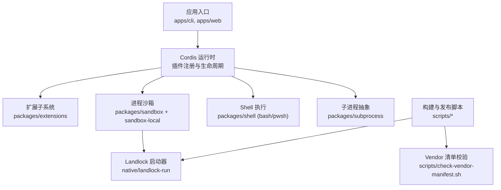
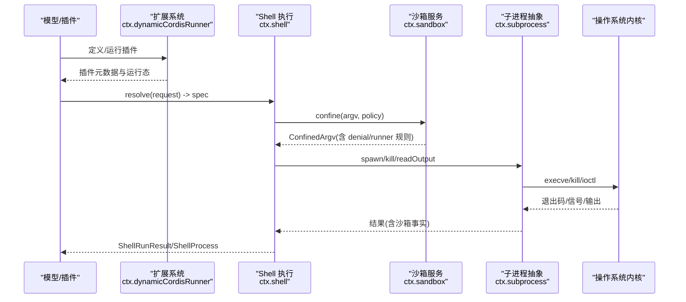
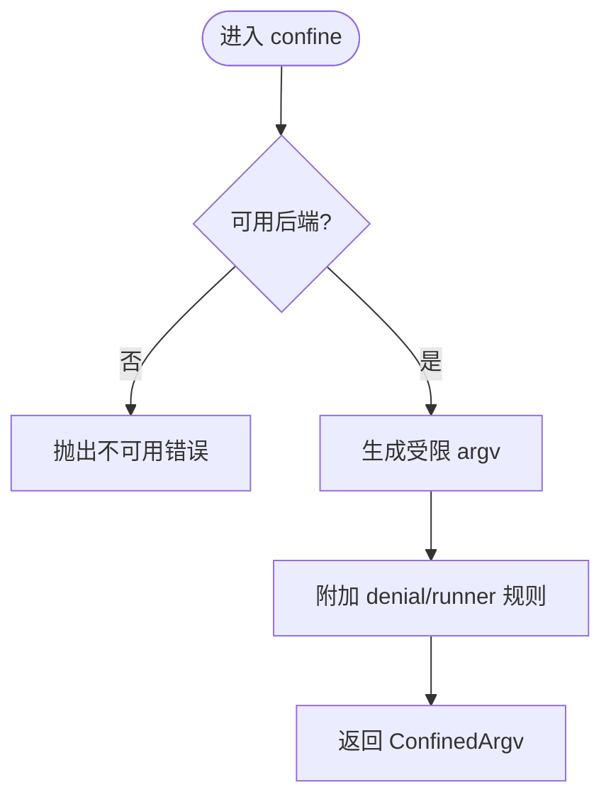
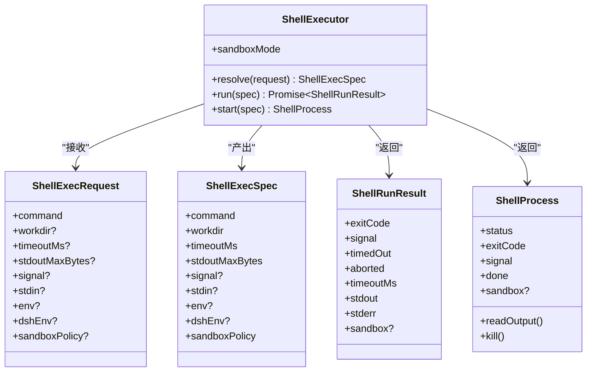
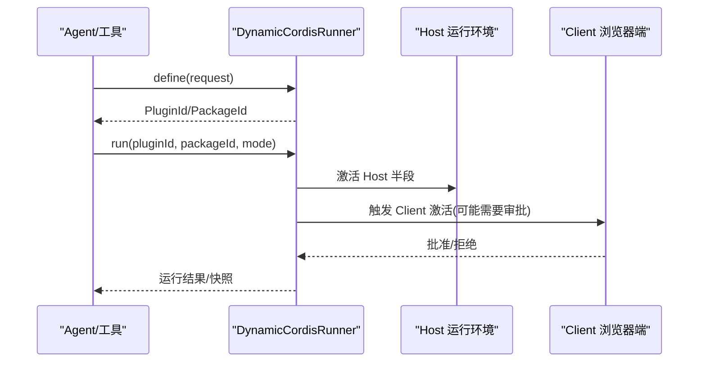
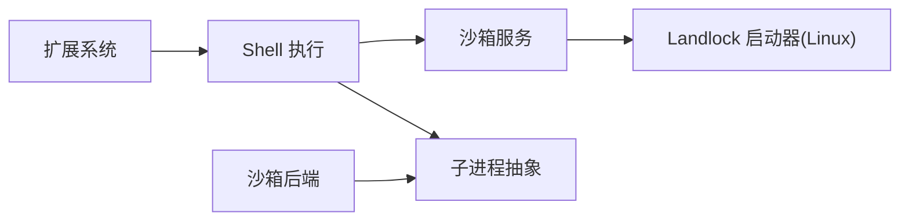
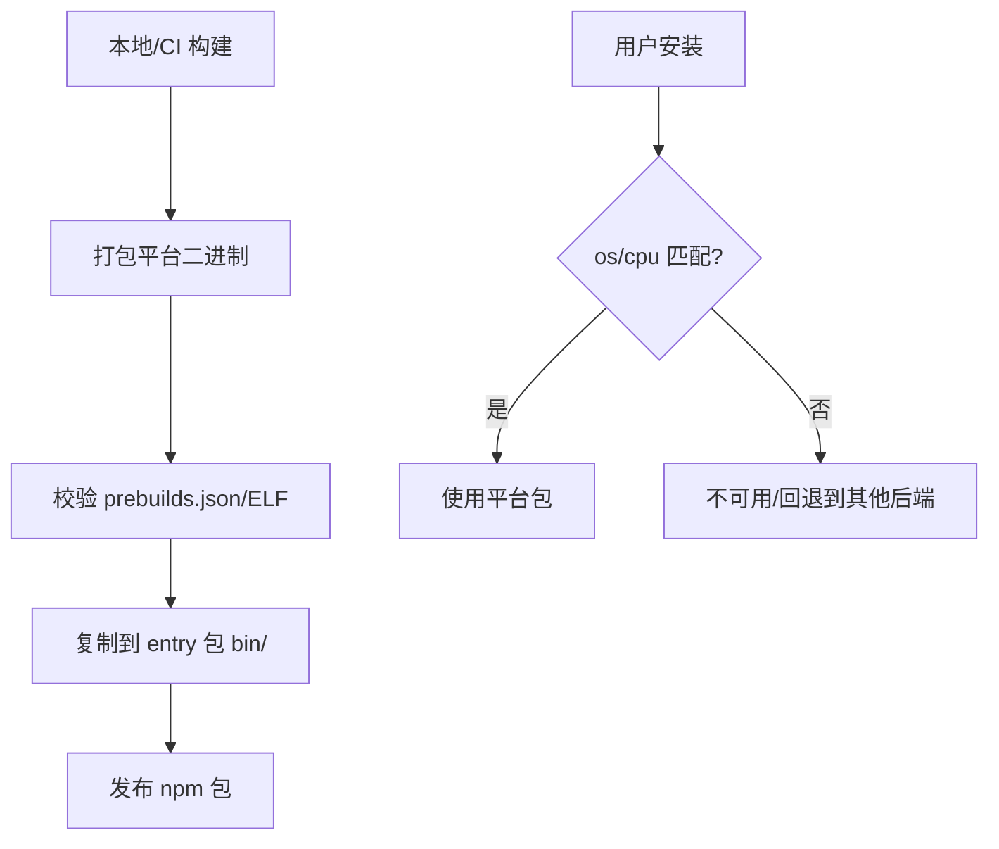

# 高级扩展技术

<cite>
**本文引用的文件**
- [README.md](file://README.md)
- [native/README.md](file://native/README.md)
- [native/landlock-run/README.md](file://native/landlock-run/README.md)
- [docs/subsystems/sandbox.md](file://docs/subsystems/sandbox.md)
- [docs/subsystems/extensions.md](file://docs/subsystems/extensions.md)
- [docs/subsystems/shell.md](file://docs/subsystems/shell.md)
- [packages/sandbox/README.md](file://packages/sandbox/README.md)
- [packages/sandbox/sandbox/src/index.ts](file://packages/sandbox/sandbox/src/index.ts)
- [packages/subprocess/subprocess-local/src/process-inspector.ts](file://packages/subprocess/subprocess-local/src/process-inspector.ts)
- [scripts/check-vendor-manifest.sh](file://scripts/check-vendor-manifest.sh)
- [docs/cookbook/adding-a-vendored-package.md](file://docs/cookbook/adding-a-vendored-package.md)
- [native/landlock-run/scripts/assemble-prebuilds.mjs](file://native/landlock-run/scripts/assemble-prebuilds.mjs)
- [native/landlock-run/scripts/repo.mjs](file://native/landlock-run/scripts/repo.mjs)
</cite>

## 目录
1. [简介](#简介)
2. [项目结构](#项目结构)
3. [核心组件](#核心组件)
4. [架构总览](#架构总览)
5. [详细组件分析](#详细组件分析)
6. [依赖关系分析](#依赖关系分析)
7. [性能与内存管理](#性能与内存管理)
8. [故障恢复与可观测性](#故障恢复与可观测性)
9. [安全、权限与资源限制](#安全权限与资源限制)
10. [跨平台与二进制依赖管理](#跨平台与二进制依赖管理)
11. [高级扩展开发示例](#高级扩展开发示例)
12. [结论](#结论)

## 简介
本指南面向有经验的开发者，聚焦企业级扩展开发的高级主题：原生模块集成、V8 扩展能力、系统级功能扩展；包内嵌（vendoring）与二进制依赖管理；跨平台兼容性；安全沙箱、权限控制与资源限制；以及性能调优、内存管理与故障恢复策略。内容基于仓库中已实现的子系统与工具链，提供可操作的实践路径与最佳实践。

## 项目结构
仓库采用多包工作区组织，围绕 Cordis 插件体系构建“一切皆插件”的架构。关键目录与职责：
- apps/cli、apps/web：命令行与 Web 入口
- packages/*：按子系统拆分的插件与服务（如 sandbox、shell、subprocess、extensions 等）
- native/landlock-run：Linux 下 Landlock 自限制后执行的原生启动器及 npm 发布产物
- docs/*：子系统文档、Cookbook、API 参考
- scripts/*：构建、验证、发布脚本（含 vendor 清单校验）

图表来源
- [packages/sandbox/README.md:1-16](file://packages/sandbox/README.md#L1-L16)
- [native/landlock-run/README.md:1-61](file://native/landlock-run/README.md#L1-L61)
- [scripts/check-vendor-manifest.sh:1-17](file://scripts/check-vendor-manifest.sh#L1-L17)

章节来源
- [README.md:1-60](file://README.md#L1-L60)
- [native/README.md:1-12](file://native/README.md#L1-L12)

## 核心组件
- 进程沙箱（Sandbox）：以 per-call 策略封装子进程的文件访问边界，支持 read-only、workspace-write、danger-full-access 三种模式，并报告 enforcement 完整性（full/partial）。
- Shell 执行（Bash/Pwsh）：统一的前后台命令执行接口，结合沙箱策略与环境注入，输出流具备溢出回退与截断提示。
- 扩展系统（Extensions）：动态定义、激活、停止 Cordis 插件，提供 Host/Client 双端运行与检查查询路由。
- 子进程抽象（Subprocess）：对文件系统、进程表、信号的系统调用进行可测试封装，支撑上层执行与监控。
- 原生启动器（Landlock Run）：在 Linux 上通过 Landlock 实现“先自限制再执行”，以预编译二进制形式按平台分发。

章节来源
- [docs/subsystems/sandbox.md:1-219](file://docs/subsystems/sandbox.md#L1-L219)
- [docs/subsystems/shell.md:1-304](file://docs/subsystems/shell.md#L1-L304)
- [docs/subsystems/extensions.md:1-365](file://docs/subsystems/extensions.md#L1-L365)
- [packages/subprocess/subprocess-local/src/process-inspector.ts:28-59](file://packages/subprocess/subprocess-local/src/process-inspector.ts#L28-L59)
- [native/landlock-run/README.md:1-61](file://native/landlock-run/README.md#L1-L61)

## 架构总览
下图展示从模型/插件到系统能力的调用链：扩展系统负责插件生命周期，Shell 执行作为能力入口之一，沙箱服务为受控执行提供策略与后端选择，最终由子进程抽象落地到操作系统。

图表来源
- [docs/subsystems/extensions.md:67-257](file://docs/subsystems/extensions.md#L67-L257)
- [docs/subsystems/shell.md:13-166](file://docs/subsystems/shell.md#L13-L166)
- [docs/subsystems/sandbox.md:96-156](file://docs/subsystems/sandbox.md#L96-L156)
- [packages/subprocess/subprocess-local/src/process-inspector.ts:28-59](file://packages/subprocess/subprocess-local/src/process-inspector.ts#L28-L59)

## 详细组件分析

### 进程沙箱（Sandbox）
- 模式与强制力：read-only、workspace-write、danger-full-access；enforcement 为 full/partial，消费者需据此决定是否拒绝或降级。
- 每调用策略：SandboxExecutionPolicy 携带 mode、workspaceRoot、sessionId；SandboxPolicyService 负责优先级与根回退。
- argv 包装与分类：ConfinedArgv 包含 wrapped argv、enforcement、denialSignatures、runnerFailureRules；区分“被沙箱拒绝”和“启动器失败”。
- 失败关闭：无可用后端时抛出不可用错误；静默放行不受限执行不被允许。

图表来源
- [docs/subsystems/sandbox.md:9-156](file://docs/subsystems/sandbox.md#L9-L156)
- [packages/sandbox/sandbox/src/index.ts:1-32](file://packages/sandbox/sandbox/src/index.ts#L1-L32)

章节来源
- [docs/subsystems/sandbox.md:1-219](file://docs/subsystems/sandbox.md#L1-L219)
- [packages/sandbox/sandbox/src/index.ts:1-32](file://packages/sandbox/sandbox/src/index.ts#L1-L32)

### Shell 执行（Bash/Pwsh）
- 请求与规格分离：resolve() 将可选参数补齐为必填的 ShellExecSpec，供 run/start 使用。
- 前台/后台：run 返回 ShellRunResult（exitCode/signal/timedOut/aborted/timeoutMs/输出），start 返回 ShellProcess（status/kill/readOutput/done）。
- 沙箱融合：executor 暴露 sandboxMode，消费方通过 ctx.sandboxPolicy.resolve 得到 per-call 策略；结果附带 ShellSandboxInfo（mode/denied/enforcement/runnerFailed）。
- 输出与溢出：CollectedOutput 支持截断时的 spill 文件与 lossy 标记。

图表来源
- [docs/subsystems/shell.md:13-221](file://docs/subsystems/shell.md#L13-L221)

章节来源
- [docs/subsystems/shell.md:1-304](file://docs/subsystems/shell.md#L1-L304)

### 扩展系统（Extensions）
- 动态插件：define/run/stop/inspect/inventory 等 API 覆盖插件全生命周期与状态快照。
- 客户端/主机协同：Host/Client 双端运行，支持 inspect 查询路由与审批流程。
- 事件总线：dynamic-package、dynamic-retract、request-run 等事件驱动 UI 与诊断。

图表来源
- [docs/subsystems/extensions.md:67-257](file://docs/subsystems/extensions.md#L67-L257)

章节来源
- [docs/subsystems/extensions.md:1-365](file://docs/subsystems/extensions.md#L1-L365)

### 子进程抽象（Subprocess）
- 可测试的系统调用封装：文件读取、目录枚举、fd 操作、exec、kill 等，便于单元测试与模拟。
- 支撑上层 executor 与沙箱的后端实现，屏蔽平台差异。

章节来源
- [packages/subprocess/subprocess-local/src/process-inspector.ts:28-59](file://packages/subprocess/subprocess-local/src/process-inspector.ts#L28-L59)

### 原生启动器（Landlock Run）
- 目标：在 Linux 上以最小可信面运行不受信命令，自身安装 Landlock 规则后再 exec 子进程，继承规则形成隔离。
- 分发：按平台发布预编译二进制，npm 根据 os/cpu 选择对应包；无匹配包则视为不可用。
- API：launcherPath、probe、grantArgs 等，配合 CLI 契约完成受限执行。

章节来源
- [native/landlock-run/README.md:1-61](file://native/landlock-run/README.md#L1-L61)

## 依赖关系分析
- 沙箱与 Shell：Shell 执行通过 ctx.sandboxPolicy 解析策略，并通过 ctx.sandbox 获取受限 argv；两者解耦，便于替换后端。
- 子进程抽象：被 Shell/Sandbox 共同复用，提供统一的进程/IO/信号能力。
- 扩展系统：独立于执行与沙箱，但可通过工具/服务调用上述能力。
- 原生启动器：仅 Linux 平台生效，其他平台由不同后端替代。

图表来源
- [packages/sandbox/README.md:1-16](file://packages/sandbox/README.md#L1-L16)
- [native/landlock-run/README.md:1-61](file://native/landlock-run/README.md#L1-L61)

章节来源
- [packages/sandbox/README.md:1-16](file://packages/sandbox/README.md#L1-L16)

## 性能与内存管理
- 输出流与溢出：Shell 输出支持截断与 spill 文件，避免大输出阻塞内存；建议上游消费方按需增量读取，减少峰值内存。
- 超时与中止：ShellRunResult 明确区分超时与中止原因，避免误判；合理设置 timeoutMs 与 stdoutMaxBytes，降低资源占用。
- 沙箱探测：在启动前 probe 后端可用性，避免无效尝试；partial 模式下谨慎处理严格边界需求。
- 子进程回收：后台进程 done 永不 reject，确保资源释放；组合销毁时等待进程终止，避免僵尸进程。

[本节为通用指导，不直接分析具体文件]

## 故障恢复与可观测性
- 失败关闭：沙箱不可用时抛错；启动器失败通过 runnerFailureRules 识别，优先归类为基础设施问题而非任务失败。
- 诊断信息：ShellSandboxInfo 提供 mode/denied/enforcement/runnerFailed；ShellRunResult 提供 exitCode/signal/timedOut/aborted。
- 事件与快照：扩展系统提供 inventory/snapshot 等只读视图，便于定位插件状态与渲染失败。

章节来源
- [docs/subsystems/sandbox.md:96-156](file://docs/subsystems/sandbox.md#L96-L156)
- [docs/subsystems/shell.md:105-221](file://docs/subsystems/shell.md#L105-L221)
- [docs/subsystems/extensions.md:180-257](file://docs/subsystems/extensions.md#L180-L257)

## 安全、权限与资源限制
- 沙箱模式：read-only 仅允许必要写入点（如 /dev/null），workspace-write 允许工作区与后端临时目录，danger-full-access 绕过限制。
- 强制力报告：full/partial 告知消费者是否满足绝对边界要求；部分场景（旧 ABI、ACL 边界）可能为 partial。
- 环境变量与凭据：Shell 执行会清理环境中的敏感项，合并受信任的 DSH_* 变量，防止凭据泄露。
- 资源上限：通过 stdoutMaxBytes、timeoutMs 限制 IO 与时间；后台进程 kill 保证可控终止。

章节来源
- [docs/subsystems/sandbox.md:9-94](file://docs/subsystems/sandbox.md#L9-L94)
- [docs/subsystems/shell.md:9-103](file://docs/subsystems/shell.md#L9-L103)

## 跨平台与二进制依赖管理
- 平台分发包：Landlock 启动器按 linux-x64/linux-arm64 发布，npm 自动选择；无匹配包即不可用。
- 预构建装配：CI 将各平台二进制复制到 entry 包的 bin 目录，并设置可执行位；脚本校验 ELF 机器类型与 prebuilds.json 一致性。
- Vendor 规范：新增 vendored 包需遵循清单约束，提交时同步更新 vendor/README.md，pre-commit 钩子强制校验。

图表来源
- [native/landlock-run/scripts/assemble-prebuilds.mjs:39-51](file://native/landlock-run/scripts/assemble-prebuilds.mjs#L39-L51)
- [native/landlock-run/scripts/repo.mjs:24-58](file://native/landlock-run/scripts/repo.mjs#L24-L58)
- [scripts/check-vendor-manifest.sh:1-17](file://scripts/check-vendor-manifest.sh#L1-L17)
- [docs/cookbook/adding-a-vendored-package.md:1-60](file://docs/cookbook/adding-a-vendored-package.md#L1-L60)

章节来源
- [native/landlock-run/README.md:1-61](file://native/landlock-run/README.md#L1-L61)
- [docs/cookbook/adding-a-vendored-package.md:1-60](file://docs/cookbook/adding-a-vendored-package.md#L1-L60)
- [scripts/check-vendor-manifest.sh:1-17](file://scripts/check-vendor-manifest.sh#L1-L17)

## 高级扩展开发示例

### 系统工具集成（以 Bash 为例）
- 步骤：
  - 通过 ctx.shell.resolve 构造 ShellExecSpec，设置 workdir、timeoutMs、stdoutMaxBytes、dshEnv 与 sandboxPolicy。
  - 前台执行使用 run，后台执行使用 start；读取输出时使用 readOutput 增量消费，关注 lossy 与 spill 路径。
  - 若需要受限执行，通过 ctx.sandboxPolicy.resolve 获取策略，交由 ctx.sandbox.confine 包装 argv。
- 注意事项：
  - 区分超时与中止原因；后台进程完成后仍可读输出。
  - 沙箱 denied/runnerFailed 需在结果中显式处理。

章节来源
- [docs/subsystems/shell.md:13-221](file://docs/subsystems/shell.md#L13-L221)
- [docs/subsystems/sandbox.md:41-94](file://docs/subsystems/sandbox.md#L41-L94)

### 网络代理（通过 Shell 与子进程）
- 思路：
  - 使用 Shell 执行外部代理工具（如 curl/httpie），通过 env 注入代理地址与认证信息。
  - 利用 stdoutMaxBytes 限制响应体大小，避免内存膨胀。
  - 结合沙箱限制对外网访问（如需），或使用 workspace-write 模式限定写盘范围。
- 可观测性：
  - 记录 exitCode/signal/timedOut/aborted；必要时启用 stderr 收集与 spill。

[本节为概念性说明，不直接分析具体文件]

### 文件监控（通过 Shell 与子进程）
- 思路：
  - 使用 inotifywait/fswatch 等工具监听目录变化，通过 Shell 后台进程持续运行。
  - 使用 readOutput 增量消费事件，结合 spill 文件保留完整日志。
  - 通过 timeoutMs 与 kill 控制生命周期，避免长期驻留进程失控。
- 安全：
  - 使用沙箱限制可访问路径，仅授予工作区与必要系统路径。

[本节为概念性说明，不直接分析具体文件]

## 结论
该代码库提供了企业级扩展开发的坚实基础：以 Cordis 为核心的插件化架构，完善的进程沙箱与 Shell 执行抽象，Linux 原生 Landlock 启动器保障不受信代码的安全执行，以及严格的 vendor 与二进制分发机制。通过合理的策略配置、资源限制与故障恢复设计，可在复杂环境中稳定地集成系统工具、网络代理与文件监控等高级能力。建议在开发中始终遵循“最小权限、可观测、可回滚”的原则，充分利用 per-call 策略与失败关闭语义，确保扩展的安全性与可靠性。