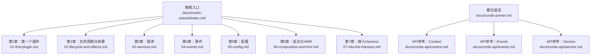
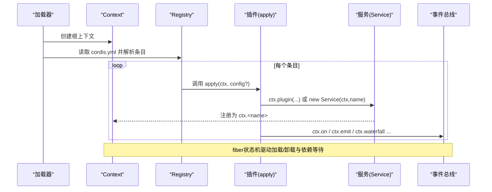
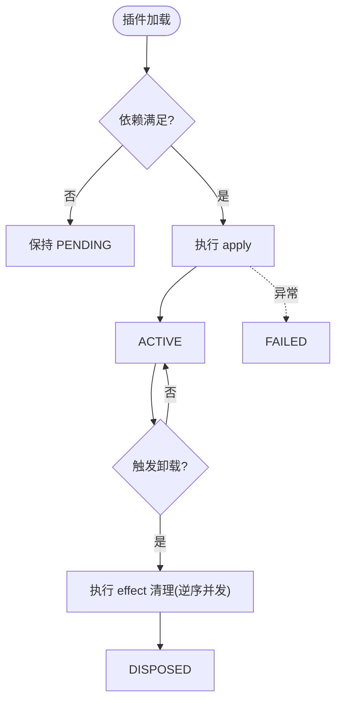
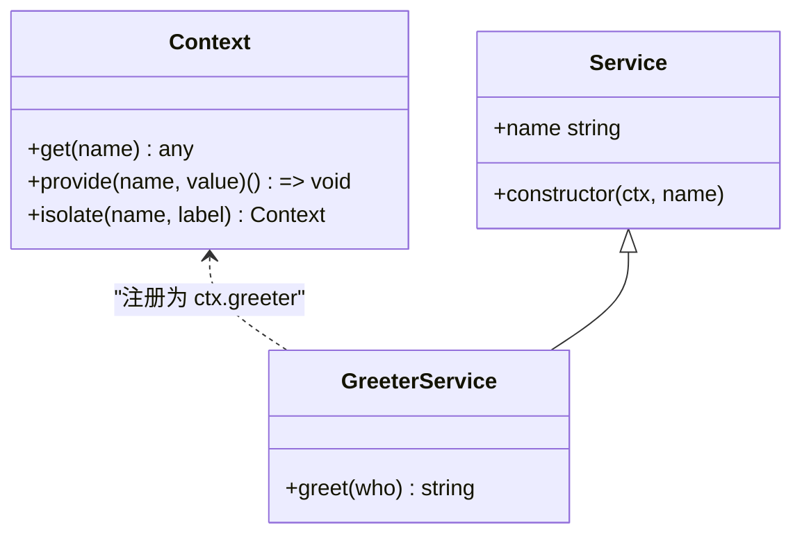
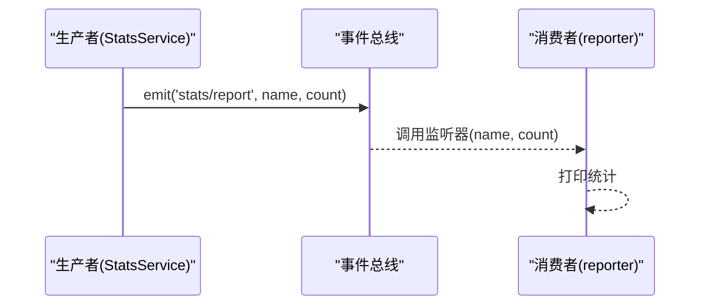
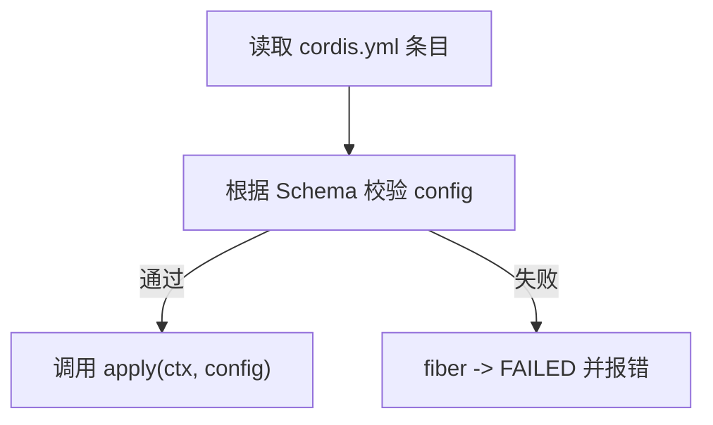
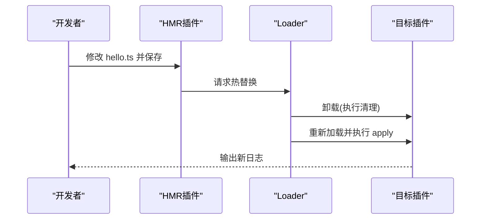
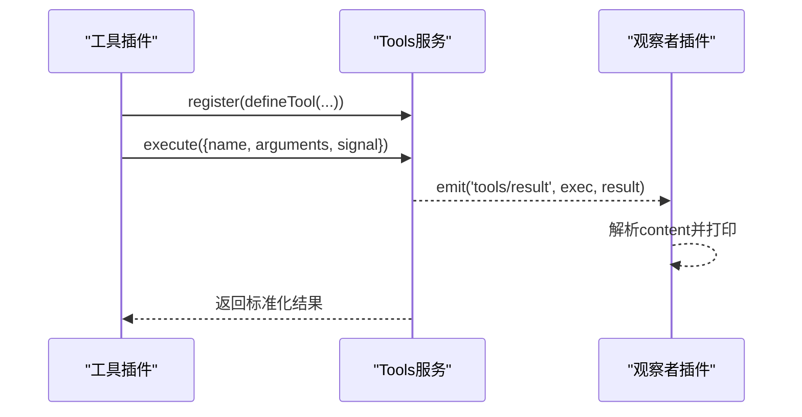
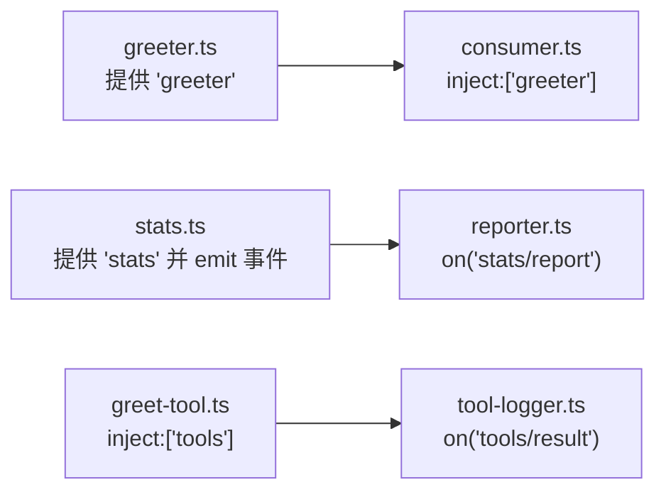

# Cordis框架基础

<cite>
**本文引用的文件**
- [docs/cordis-tutorial/index.md](file://docs/cordis-tutorial/index.md)
- [docs/cordis-tutorial/01-first-plugin.md](file://docs/cordis-tutorial/01-first-plugin.md)
- [docs/cordis-tutorial/02-lifecycle-and-effects.md](file://docs/cordis-tutorial/02-lifecycle-and-effects.md)
- [docs/cordis-tutorial/03-services.md](file://docs/cordis-tutorial/03-services.md)
- [docs/cordis-tutorial/04-events.md](file://docs/cordis-tutorial/04-events.md)
- [docs/cordis-tutorial/05-config.md](file://docs/cordis-tutorial/05-config.md)
- [docs/cordis-tutorial/06-composition-and-hmr.md](file://docs/cordis-tutorial/06-composition-and-hmr.md)
- [docs/cordis-tutorial/07-into-the-harness.md](file://docs/cordis-tutorial/07-into-the-harness.md)
- [docs/cordis-api/context.md](file://docs/cordis-api/context.md)
- [docs/cordis-api/events.md](file://docs/cordis-api/events.md)
- [docs/cordis-api/service.md](file://docs/cordis-api/service.md)
- [docs/cordis-primer.md](file://docs/cordis-primer.md)
</cite>

## 目录
1. [简介](#简介)
2. [项目结构](#项目结构)
3. [核心组件](#核心组件)
4. [架构总览](#架构总览)
5. [详细组件分析](#详细组件分析)
6. [依赖关系分析](#依赖关系分析)
7. [性能考虑](#性能考虑)
8. [故障排查指南](#故障排查指南)
9. [结论](#结论)
10. [附录](#附录)

## 简介
本指南面向初学者，基于仓库中的教程与API文档，系统讲解Cordis插件框架的核心概念与实践路径。你将学会：
- 插件的基本结构与三种形态（函数、对象、类）
- 生命周期管理与资源清理（effect/fiber）
- 服务注册与依赖注入（Service、inject）
- 事件系统与五种分发模式（emit/parallel/serial/bail/waterfall）
- 配置校验与动态配置（Schema、!!js）
- 插件组合与热重载（HMR）
- 从零开始编写一个简单插件，并逐步演进到与真实Harness服务集成的复杂场景
- TypeScript在插件开发中的使用方式（类型注解、import type、接口合并）

## 项目结构
教程位于 docs/cordis-tutorial，按章节递进；API参考位于 docs/cordis-api；概念速览位于 docs/cordis-primer。通过该结构，你可以从“最小可运行插件”起步，逐步掌握服务、事件、配置、组合与HMR等能力，最终接入Harness的tools等服务。

**图表来源**
- [docs/cordis-tutorial/index.md:1-61](file://docs/cordis-tutorial/index.md#L1-L61)
- [docs/cordis-primer.md:1-46](file://docs/cordis-primer.md#L1-L46)

**章节来源**
- [docs/cordis-tutorial/index.md:1-61](file://docs/cordis-tutorial/index.md#L1-L61)

## 核心组件
- 上下文 Context：所有服务、事件、生命周期API的统一入口，支持扩展、隔离、拦截与反射式存取。
- 服务 Service：以稳定名称挂载到ctx的能力提供者，支持声明式依赖注入与自动卸载。
- 事件 Events：跨插件通信机制，提供多种分发模式以满足观察、并行、串行、短路或中间件式拦截。
- 生命周期 Fiber/Effect：每个插件实例拥有fiber状态机；effect用于管理可逆的资源与注册。
- 配置 Config：通过Schema对cordis.yml中的config进行强校验，失败即停，避免半配置启动。
- 组合与HMR：将cordis.yml视为应用装配图，支持id稳定标识、分组、隔离与热重载。

**章节来源**
- [docs/cordis-api/context.md:1-365](file://docs/cordis-api/context.md#L1-L365)
- [docs/cordis-api/service.md:1-103](file://docs/cordis-api/service.md#L1-L103)
- [docs/cordis-api/events.md:1-208](file://docs/cordis-api/events.md#L1-L208)
- [docs/cordis-tutorial/02-lifecycle-and-effects.md:1-99](file://docs/cordis-tutorial/02-lifecycle-and-effects.md#L1-L99)
- [docs/cordis-tutorial/05-config.md:1-85](file://docs/cordis-tutorial/05-config.md#L1-L85)
- [docs/cordis-tutorial/06-composition-and-hmr.md:1-114](file://docs/cordis-tutorial/06-composition-and-hmr.md#L1-L114)

## 架构总览
下图展示了从加载器到插件、服务、事件的协作关系，以及fiber生命周期如何贯穿其中。

**图表来源**
- [docs/cordis-tutorial/01-first-plugin.md:1-96](file://docs/cordis-tutorial/01-first-plugin.md#L1-L96)
- [docs/cordis-tutorial/02-lifecycle-and-effects.md:1-99](file://docs/cordis-tutorial/02-lifecycle-and-effects.md#L1-L99)
- [docs/cordis-tutorial/03-services.md:1-99](file://docs/cordis-tutorial/03-services.md#L1-L99)
- [docs/cordis-tutorial/04-events.md:1-145](file://docs/cordis-tutorial/04-events.md#L1-L145)
- [docs/cordis-api/context.md:1-365](file://docs/cordis-api/context.md#L1-L365)

## 详细组件分析

### 插件与生命周期（Fiber/Effect）
- 插件形态：函数、对象、类（Service子类）。
- 生命周期：PENDING → LOADING → ACTIVE → UNLOADING → DISPOSED，异常时进入FAILED。
- Effect：用ctx.effect()包装外部资源，返回清理函数；卸载时按逆序并发执行异步清理。
- Fiber：ctx.plugin(...)返回fiber句柄，可用于显式dispose与诊断。

**图表来源**
- [docs/cordis-tutorial/02-lifecycle-and-effects.md:68-94](file://docs/cordis-tutorial/02-lifecycle-and-effects.md#L68-L94)

**章节来源**
- [docs/cordis-tutorial/01-first-plugin.md:53-92](file://docs/cordis-tutorial/01-first-plugin.md#L53-L92)
- [docs/cordis-tutorial/02-lifecycle-and-effects.md:1-99](file://docs/cordis-tutorial/02-lifecycle-and-effects.md#L1-L99)

### 服务与依赖注入（Service/inject）
- 提供服务：继承Service并在构造函数中super(ctx, name)，或通过ctx.provide注册。
- 消费服务：导出inject数组声明硬依赖；未满足则保持PENDING。
- 可选依赖：使用ctx.get(name)按需获取，避免阻塞加载。
- 作用域隔离：ctx.isolate可为同名服务提供独立作用域。

**图表来源**
- [docs/cordis-api/context.md:237-314](file://docs/cordis-api/context.md#L237-L314)
- [docs/cordis-api/service.md:1-103](file://docs/cordis-api/service.md#L1-L103)
- [docs/cordis-tutorial/03-services.md:7-43](file://docs/cordis-tutorial/03-services.md#L7-L43)

**章节来源**
- [docs/cordis-tutorial/03-services.md:1-99](file://docs/cordis-tutorial/03-services.md#L1-L99)

### 事件系统（Events）
- 声明事件：通过declare module合并Events接口，获得类型安全的事件名与参数。
- 分发模式：
  - emit：同步广播，不收集返回值
  - parallel：并行监听，全部await后结束
  - serial：顺序监听，首个非空结果短路
  - bail：同步版serial
  - waterfall：中间件式next链，支持改写与否决
- 监听器自动清理：ctx.on注册的监听器随插件卸载而移除。

**图表来源**
- [docs/cordis-tutorial/04-events.md:8-78](file://docs/cordis-tutorial/04-events.md#L8-L78)
- [docs/cordis-api/events.md:8-147](file://docs/cordis-api/events.md#L8-L147)

**章节来源**
- [docs/cordis-tutorial/04-events.md:1-145](file://docs/cordis-tutorial/04-events.md#L1-L145)

### 配置管理（Config）
- Schema校验：导出与TS接口同名的Schema对象，确保apply接收完整且合法配置。
- 默认值与必填：Schema支持default与required语义。
- 动态配置：在config中使用!!js标签计算运行时值；disabled字段也可表达式化。
- 失败即停：校验失败直接让fiber进入FAILED，便于快速定位问题。

**图表来源**
- [docs/cordis-tutorial/05-config.md:1-85](file://docs/cordis-tutorial/05-config.md#L1-L85)

**章节来源**
- [docs/cordis-tutorial/05-config.md:1-85](file://docs/cordis-tutorial/05-config.md#L1-L85)

### 组合与热重载（Composition & HMR）
- 条目元数据：id稳定标识、disabled开关、group分组、isolate隔离。
- HMR：保存文件后，旧实例卸载（effects回滚），新代码加载并重新执行apply。
- 诊断PENDING：遍历registry查看fiber.state，定位缺失服务。

**图表来源**
- [docs/cordis-tutorial/06-composition-and-hmr.md:23-59](file://docs/cordis-tutorial/06-composition-and-hmr.md#L23-L59)
- [docs/cordis-tutorial/06-composition-and-hmr.md:61-110](file://docs/cordis-tutorial/06-composition-and-hmr.md#L61-L110)

**章节来源**
- [docs/cordis-tutorial/06-composition-and-hmr.md:1-114](file://docs/cordis-tutorial/06-composition-and-hmr.md#L1-L114)

### 接入Harness（工具与服务集成）
- 注册工具：通过ctx.tools.register(defineTool(...))将工具加入执行管线。
- 执行工具：ctx.tools.execute(...)驱动一次工具调用，得到标准化结果。
- 观察结果：订阅tools/result事件，实现无侵入的日志与监控。
- 依赖保证：inject ['tools']确保工具服务可用后再加载。

**图表来源**
- [docs/cordis-tutorial/07-into-the-harness.md:7-95](file://docs/cordis-tutorial/07-into-the-harness.md#L7-L95)

**章节来源**
- [docs/cordis-tutorial/07-into-the-harness.md:1-108](file://docs/cordis-tutorial/07-into-the-harness.md#L1-L108)

### TypeScript在插件开发中的使用
- 类型注解：为ctx、参数、返回值添加类型，提升可读性与安全性。
- import type：仅引入类型信息，零运行时开销。
- 接口合并：通过declare module合并Context与Events，使ctx.xxx与事件签名具备类型推导。
- 配置Schema：结合interface与Schema对象，同时获得编译期类型与运行时校验。

**章节来源**
- [docs/cordis-tutorial/index.md:48-59](file://docs/cordis-tutorial/index.md#L48-L59)
- [docs/cordis-tutorial/03-services.md:14-40](file://docs/cordis-tutorial/03-services.md#L14-L40)
- [docs/cordis-tutorial/04-events.md:14-44](file://docs/cordis-tutorial/04-events.md#L14-L44)
- [docs/cordis-tutorial/05-config.md:17-34](file://docs/cordis-tutorial/05-config.md#L17-L34)

## 依赖关系分析
- 插件间通过服务名解耦，而非直接导入；加载顺序由inject决定。
- 事件作为松耦合通信通道，生产者和消费者无需感知彼此。
- 配置与行为分离：cordis.yml负责装配，插件内部专注能力实现。
- HMR与fiber状态机共同保障热替换时的正确性。

**图表来源**
- [docs/cordis-tutorial/03-services.md:44-72](file://docs/cordis-tutorial/03-services.md#L44-L72)
- [docs/cordis-tutorial/04-events.md:46-78](file://docs/cordis-tutorial/04-events.md#L46-L78)
- [docs/cordis-tutorial/07-into-the-harness.md:51-95](file://docs/cordis-tutorial/07-into-the-harness.md#L51-L95)

**章节来源**
- [docs/cordis-tutorial/03-services.md:1-99](file://docs/cordis-tutorial/03-services.md#L1-L99)
- [docs/cordis-tutorial/04-events.md:1-145](file://docs/cordis-tutorial/04-events.md#L1-L145)
- [docs/cordis-tutorial/07-into-the-harness.md:1-108](file://docs/cordis-tutorial/07-into-the-harness.md#L1-L108)

## 性能考虑
- 优先使用事件进行观测与策略拦截，避免紧耦合调用带来的性能与耦合成本。
- 合理使用分发模式：高频通知用emit；需要聚合结果用parallel；决策链路用serial/bail；中间件式处理用waterfall。
- 谨慎使用全局状态，尽量通过服务与作用域隔离减少竞争条件。
- 利用HMR加速迭代，但注意effect清理顺序与并发清理可能带来的时序问题。

[本节为通用指导，不直接分析具体文件]

## 故障排查指南
- 插件无输出：检查fiber状态是否为PENDING，常见原因为缺少inject所需服务。
- 配置错误：关注Schema校验错误信息，修正类型或缺失字段。
- 热重载无效：确认HMR已启用且root包含目标目录；检查id是否稳定。
- 事件未触发：确认事件名与参数类型一致，监听器是否正确注册且未被提前卸载。
- 工具未生效：确认tools服务已加载，defineTool参数与output.render符合规范。

**章节来源**
- [docs/cordis-tutorial/06-composition-and-hmr.md:61-110](file://docs/cordis-tutorial/06-composition-and-hmr.md#L61-L110)
- [docs/cordis-tutorial/05-config.md:53-69](file://docs/cordis-tutorial/05-config.md#L53-L69)
- [docs/cordis-tutorial/01-first-plugin.md:79-92](file://docs/cordis-tutorial/01-first-plugin.md#L79-L92)

## 结论
通过本指南，你已掌握Cordis插件框架的关键能力：从最简单的插件到服务、事件、配置、组合与HMR，再到与Harness工具的集成。建议按教程章节循序渐进实践，遇到问题优先检查fiber状态、inject依赖与Schema校验。随着复杂度提升，继续遵循“插件化、事件化、配置化”的设计原则，构建可维护、可扩展的系统。

[本节为总结性内容，不直接分析具体文件]

## 附录
- 快速上手命令：在教程目录执行 node --import tsx ../../vendor/cordis/bin.js 运行当前cordis.yml装配的应用。
- 推荐学习路径：
  1) 第1章：理解插件与加载流程
  2) 第2章：掌握effect与fiber生命周期
  3) 第3章：学会服务与依赖注入
  4) 第4章：使用事件进行松耦合通信
  5) 第5章：用Schema做配置校验
  6) 第6章：组合与HMR调试
  7) 第7章：接入Harness工具与服务
- 参考文档：
  - 概念速览：docs/cordis-primer.md
  - API参考：docs/cordis-api/{context,events,service}.md

**章节来源**
- [docs/cordis-tutorial/index.md:13-46](file://docs/cordis-tutorial/index.md#L13-L46)
- [docs/cordis-primer.md:7-46](file://docs/cordis-primer.md#L7-L46)