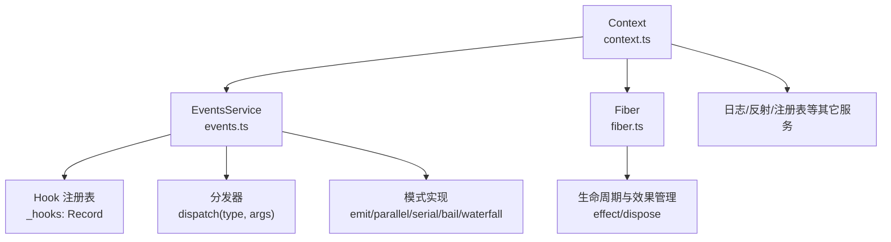
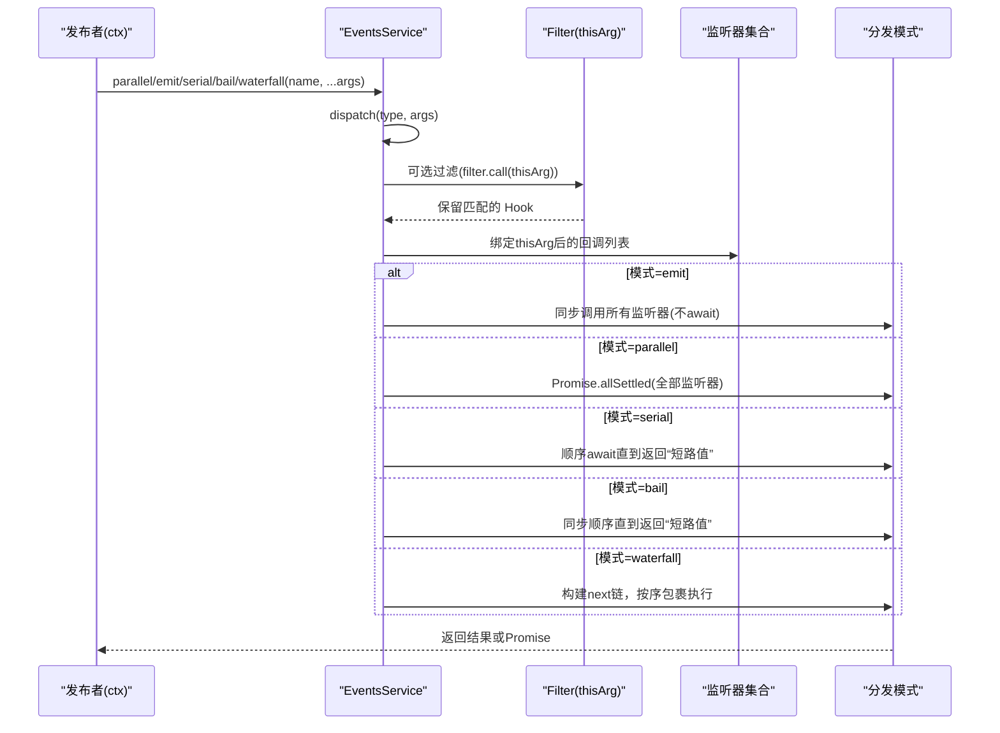
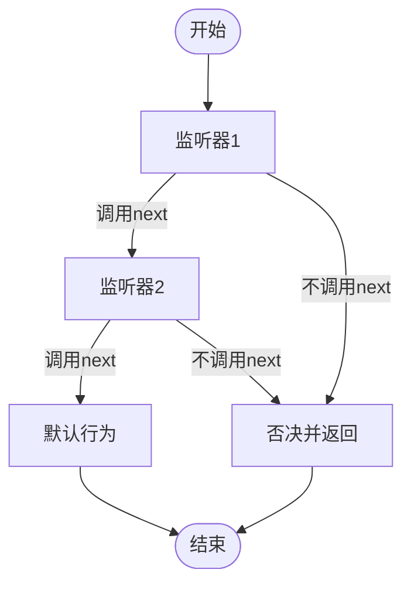
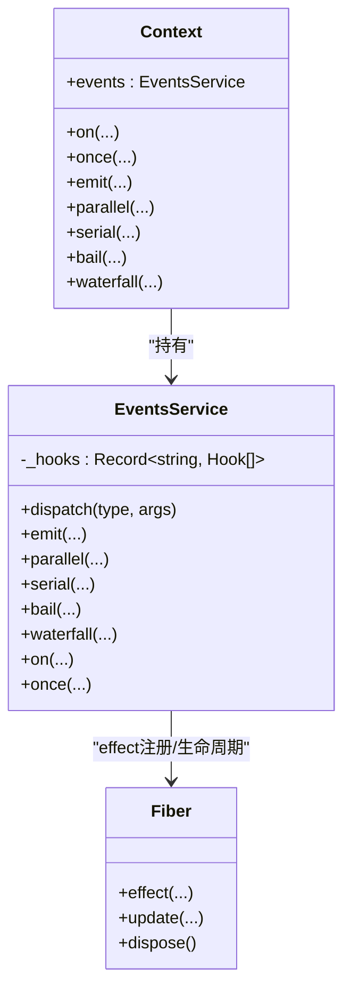

# 事件系统

<cite>
**本文引用的文件**
- [vendor/cordis/src/events.ts](file://vendor/cordis/src/events.ts)
- [vendor/cordis/src/context.ts](file://vendor/cordis/src/context.ts)
- [vendor/cordis/src/fiber.ts](file://vendor/cordis/src/fiber.ts)
- [docs/cordis-api/events.md](file://docs/cordis-api/events.md)
- [docs/cordis-tutorial/04-events.md](file://docs/cordis-tutorial/04-events.md)
- [docs/event-producer-consumer.md](file://docs/event-producer-consumer.md)
</cite>

## 目录
1. [简介](#简介)
2. [项目结构](#项目结构)
3. [核心组件](#核心组件)
4. [架构总览](#架构总览)
5. [详细组件分析](#详细组件分析)
6. [依赖关系分析](#依赖关系分析)
7. [性能考量](#性能考量)
8. [故障排查指南](#故障排查指南)
9. [结论](#结论)
10. [附录：最佳实践与示例路径](#附录：最佳实践与示例路径)

## 简介
本文件系统性说明 Cordis 事件系统的类型化设计、广播分发机制与水短路处理，覆盖事件定义、订阅、回调处理、数据流、错误传播与性能优化。同时提供发布、订阅、错误处理的完整场景指引与最佳实践（命名规范、数据格式、性能技巧），并给出常见问题诊断方法。

## 项目结构
Cordis 事件系统位于 vendor/cordis 核心包中，通过 Context 注入到每个插件上下文，并提供五种分发模式：emit、parallel、serial、bail、waterfall。事件声明通过模块合并扩展 Events 接口，实现类型安全的发布/订阅。

图表来源
- [vendor/cordis/src/context.ts:70-84](file://vendor/cordis/src/context.ts#L70-L84)
- [vendor/cordis/src/events.ts:131-156](file://vendor/cordis/src/events.ts#L131-L156)
- [vendor/cordis/src/fiber.ts:184-333](file://vendor/cordis/src/fiber.ts#L184-L333)

章节来源
- [vendor/cordis/src/context.ts:70-84](file://vendor/cordis/src/context.ts#L70-L84)
- [vendor/cordis/src/events.ts:131-156](file://vendor/cordis/src/events.ts#L131-L156)
- [vendor/cordis/src/fiber.ts:184-333](file://vendor/cordis/src/fiber.ts#L184-L333)

## 核心组件
- EventsService：事件总线，维护监听器列表、过滤、分发与资源清理。
- Context：上下文代理，混入 ctx.on/once/emit/parallel/serial/bail/waterfall 等方法。
- Fiber：插件运行时实例，负责生命周期、配置更新、效果管理与清理。
- Events 接口：框架内置内部事件（internal/*）用于拦截、诊断与生命周期通知。

关键职责
- 类型安全：通过扩展 Events 接口，ctx.emit/ctx.on 具备强类型参数与返回值推断。
- 多模式分发：支持同步广播、并发等待、顺序短路、同步短路、水短路链式组合。
- 作用域与过滤：基于 thisArg 的 filter 函数控制监听器可见性；global 选项可绕过过滤。
- 自动清理：监听器以 effect 形式注册，随 Fiber 卸载自动移除。

章节来源
- [vendor/cordis/src/events.ts:119-156](file://vendor/cordis/src/events.ts#L119-L156)
- [vendor/cordis/src/events.ts:165-243](file://vendor/cordis/src/events.ts#L165-L243)
- [vendor/cordis/src/events.ts:288-318](file://vendor/cordis/src/events.ts#L288-L318)
- [vendor/cordis/src/context.ts:70-84](file://vendor/cordis/src/context.ts#L70-L84)
- [vendor/cordis/src/fiber.ts:415-561](file://vendor/cordis/src/fiber.ts#L415-L561)

## 架构总览
下图展示一次事件从发布到分发的完整流程，包括过滤、模式选择与结果聚合。

图表来源
- [vendor/cordis/src/events.ts:165-243](file://vendor/cordis/src/events.ts#L165-L243)

章节来源
- [vendor/cordis/src/events.ts:165-243](file://vendor/cordis/src/events.ts#L165-L243)

## 详细组件分析

### 事件类型与声明
- 使用模块合并扩展 Events 接口，声明事件名与监听器签名，使 ctx.emit/ctx.on 具备类型推导。
- 事件名建议采用 namespace/action 风格，保持扁平命名空间可读性。
- 每种事件的文档会标注其分发模式（emit/parallel/serial/bail/waterfall）。

章节来源
- [docs/cordis-tutorial/04-events.md:14-44](file://docs/cordis-tutorial/04-events.md#L14-L44)
- [docs/cordis-api/events.md:195-205](file://docs/cordis-api/events.md#L195-L205)

### 五种分发模式
- emit：同步广播，忽略返回值与异步结果，适合“通知型”事件。
- parallel：并发运行所有监听器，统一等待后聚合异常为 AggregateError。
- serial：顺序 await，首个非 null/false/undefined 返回值作为“短路值”，后续不再执行。
- bail：serial 的同步版本，遇到短路值立即停止。
- waterfall：最后一个参数为 next 延续；监听器可选择调用 next 继续链路或不调用以“否决”默认行为。

章节来源
- [vendor/cordis/src/events.ts:183-243](file://vendor/cordis/src/events.ts#L183-L243)
- [docs/cordis-api/events.md:8-123](file://docs/cordis-api/events.md#L8-L123)
- [docs/cordis-tutorial/04-events.md:80-139](file://docs/cordis-tutorial/04-events.md#L80-L139)

### 订阅与一次性订阅
- ctx.on：在当前 Fiber 上注册监听器，返回 disposer；支持 prepend 与 global 选项。
- ctx.once：等价于 on，但首次触发后自动注销。
- 监听器通过 fiber.effect 注册，随 Fiber 卸载自动清理，无需手动 removeListener。

章节来源
- [vendor/cordis/src/events.ts:288-318](file://vendor/cordis/src/events.ts#L288-L318)
- [vendor/cordis/src/events.ts:254-275](file://vendor/cordis/src/events.ts#L254-L275)
- [vendor/cordis/src/fiber.ts:415-561](file://vendor/cordis/src/fiber.ts#L415-L561)

### 过滤与作用域
- 可通过 thisArg 传入 filter 函数，在分发时根据上下文决定哪些监听器被调用。
- EventOptions.global=true 可绕过 filter，用于全局监听。

章节来源
- [vendor/cordis/src/events.ts:165-175](file://vendor/cordis/src/events.ts#L165-L175)
- [vendor/cordis/src/events.ts:112-117](file://vendor/cordis/src/events.ts#L112-L117)

### 水短路（Waterfall）详解
- 每个监听器接收原始参数 + next()；调用 next() 进入下一个监听器，最终到达内置默认行为。
- 不调用 next() 即“否决”，阻止后续链路与默认行为。
- 典型用途：请求拦截、策略决策、结果转换。

图表来源
- [vendor/cordis/src/events.ts:234-243](file://vendor/cordis/src/events.ts#L234-L243)
- [docs/cordis-tutorial/04-events.md:94-139](file://docs/cordis-tutorial/04-events.md#L94-L139)

章节来源
- [vendor/cordis/src/events.ts:234-243](file://vendor/cordis/src/events.ts#L234-L243)
- [docs/cordis-tutorial/04-events.md:94-139](file://docs/cordis-tutorial/04-events.md#L94-L139)

### 错误传播
- parallel：所有监听器完成后收集 rejected 结果，抛出 AggregateError，包含所有失败原因。
- emit：不捕获也不传播监听器抛出的异常（忽略返回值与异步结果）。
- serial/bail：遇到第一个“短路值”即停止；若监听器抛出异常，将沿调用栈向上抛出。
- waterfall：任一监听器抛出异常会中断链路；未调用 next 的否决不会抛出异常。

章节来源
- [vendor/cordis/src/events.ts:183-222](file://vendor/cordis/src/events.ts#L183-L222)

### 内部事件与诊断
- internal/plugin/status/config/service/get/set/listener/dispatch 等内部事件用于框架级拦截与诊断。
- internal/dispatch 在非 internal 事件分发前触发，可用于观测事件总线行为。

章节来源
- [vendor/cordis/src/events.ts:329-352](file://vendor/cordis/src/events.ts#L329-L352)

## 依赖关系分析
- Context 初始化时创建 EventsService 并暴露 events 属性；同时混入 ctx.on/once/emit/... 等方法。
- EventsService 依赖 Fiber 进行 effect 注册与生命周期管理。
- Fiber 在生命周期变化时触发 internal/status 等内部事件，供外部观察。

图表来源
- [vendor/cordis/src/context.ts:70-84](file://vendor/cordis/src/context.ts#L70-L84)
- [vendor/cordis/src/events.ts:131-156](file://vendor/cordis/src/events.ts#L131-L156)
- [vendor/cordis/src/fiber.ts:415-561](file://vendor/cordis/src/fiber.ts#L415-L561)

章节来源
- [vendor/cordis/src/context.ts:70-84](file://vendor/cordis/src/context.ts#L70-L84)
- [vendor/cordis/src/events.ts:131-156](file://vendor/cordis/src/events.ts#L131-L156)
- [vendor/cordis/src/fiber.ts:415-561](file://vendor/cordis/src/fiber.ts#L415-L561)

## 性能考量
- 选择合适的分发模式：
  - 高频通知：优先 emit，避免不必要的等待与聚合开销。
  - 需要并行处理且容忍部分失败：parallel，注意 AggregateError 成本。
  - 需要顺序短路：serial/bail，减少不必要监听器执行。
  - 需要拦截/转换：waterfall，谨慎使用否决以避免阻塞默认行为。
- 监听器数量与复杂度：过多监听器会增加分发时间；尽量拆分关注点，避免在单个监听器中进行重计算。
- 过滤与全局监听：合理使用 filter 缩小匹配范围；仅在必要时使用 global。
- 错误处理：parallel 会在结束时聚合异常，可能带来额外开销；对高吞吐场景考虑降级为 emit 或在监听器内吞掉预期异常。
- 内存与清理：确保监听器及时注销（使用 once 或 disposer），避免内存泄漏。

[本节为通用指导，不直接分析具体文件]

## 故障排查指南
- 现象：事件未触发
  - 检查是否在当前 Fiber 中注册监听器（ctx.on 必须在 active fiber 中调用）。
  - 检查事件名是否正确，是否存在拼写差异。
  - 检查是否被 filter 过滤；必要时使用 global 选项验证。
- 现象：parallel 抛出 AggregateError
  - 查看聚合的错误数组，定位失败的监听器。
- 现象：waterfall 默认行为未执行
  - 确认监听器是否调用了 next()；遗漏 next 会导致否决。
- 现象：监听器未被清理导致内存增长
  - 确认是否使用了 ctx.once 或 disposer；检查 Fiber 是否正确卸载。
- 现象：串行/短路未按预期工作
  - 确认监听器返回值是否为“短路值”（非 null/false/undefined）。

章节来源
- [vendor/cordis/src/events.ts:165-175](file://vendor/cordis/src/events.ts#L165-L175)
- [vendor/cordis/src/events.ts:183-222](file://vendor/cordis/src/events.ts#L183-L222)
- [vendor/cordis/src/events.ts:234-243](file://vendor/cordis/src/events.ts#L234-L243)
- [vendor/cordis/src/fiber.ts:415-561](file://vendor/cordis/src/fiber.ts#L415-L561)

## 结论
Cordis 事件系统通过类型化的事件声明与多种分发模式，提供了灵活而强大的解耦通信机制。合理选择分发模式、遵循命名与数据格式规范、善用过滤与清理，可在保证性能的同时提升可维护性与可观测性。

[本节为总结，不直接分析具体文件]

## 附录：最佳实践与示例路径
- 事件命名规范
  - 采用 namespace/action 风格，如 stats/report、agent/request。
  - 参考教程中的命名约定与示例。
- 数据格式设计
  - 事件参数应最小化、结构化，避免传递过大对象；必要时拆分事件。
- 性能优化技巧
  - 高频通知使用 emit；需要聚合结果时使用 parallel。
  - 使用 serial/bail 实现快速失败与短路。
  - 使用 waterfall 做拦截与转换，务必调用 next() 除非有意否决。
- 错误处理
  - parallel 下捕获 AggregateError；其他模式下在监听器内 try/catch 或向上抛出。
- 示例与参考路径
  - 教程示例（声明、发射、监听、waterfall）：[docs/cordis-tutorial/04-events.md:9-139](file://docs/cordis-tutorial/04-events.md#L9-L139)
  - API 参考（各分发模式语义）：[docs/cordis-api/events.md:8-123](file://docs/cordis-api/events.md#L8-L123)
  - 事件矩阵（生产者/消费者关系）：[docs/event-producer-consumer.md:8-78](file://docs/event-producer-consumer.md#L8-L78)
  - 核心实现（EventsService、分发模式、内部事件）：[vendor/cordis/src/events.ts:131-352](file://vendor/cordis/src/events.ts#L131-L352)
  - 上下文注入与混入方法：[vendor/cordis/src/context.ts:70-84](file://vendor/cordis/src/context.ts#L70-L84)
  - 生命周期与效果管理（监听器自动清理）：[vendor/cordis/src/fiber.ts:415-561](file://vendor/cordis/src/fiber.ts#L415-L561)

章节来源
- [docs/cordis-tutorial/04-events.md:9-139](file://docs/cordis-tutorial/04-events.md#L9-L139)
- [docs/cordis-api/events.md:8-123](file://docs/cordis-api/events.md#L8-L123)
- [docs/event-producer-consumer.md:8-78](file://docs/event-producer-consumer.md#L8-L78)
- [vendor/cordis/src/events.ts:131-352](file://vendor/cordis/src/events.ts#L131-L352)
- [vendor/cordis/src/context.ts:70-84](file://vendor/cordis/src/context.ts#L70-L84)
- [vendor/cordis/src/fiber.ts:415-561](file://vendor/cordis/src/fiber.ts#L415-L561)