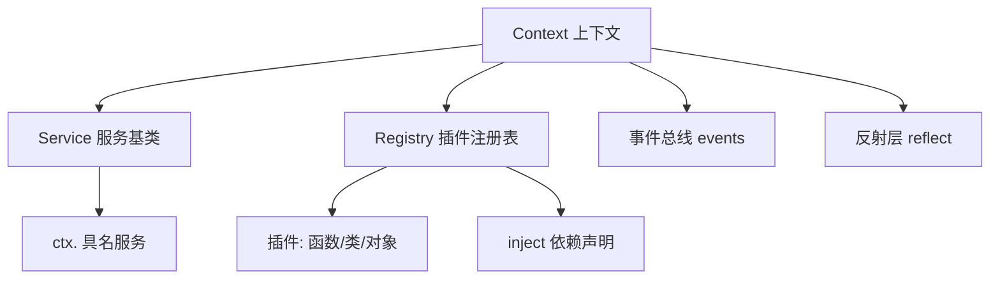
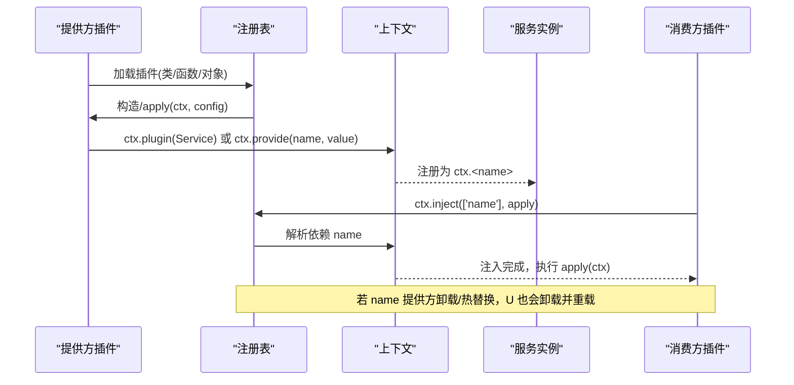
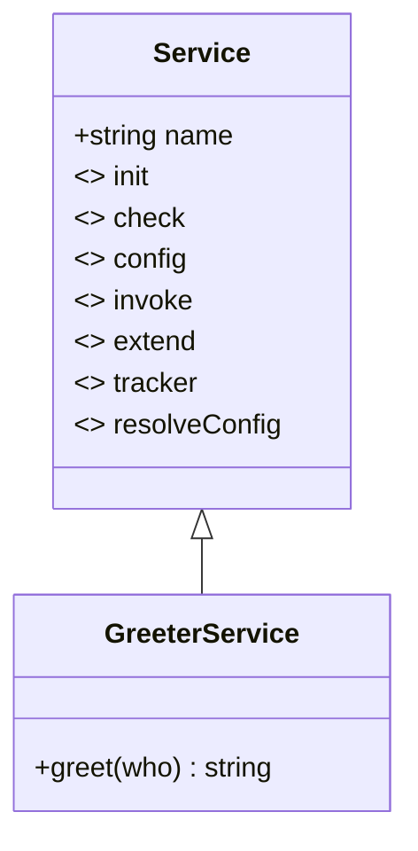
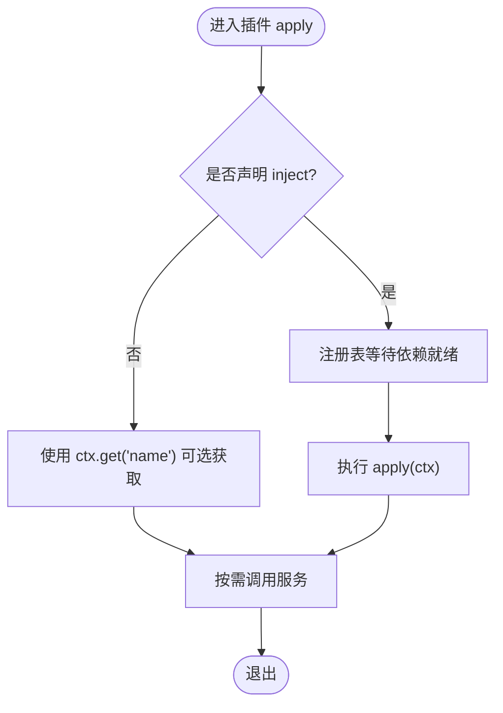
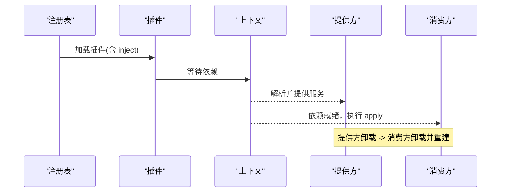
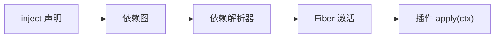

# 服务系统

<cite>
**本文引用的文件**
- [docs/cordis-api/service.md](file://docs/cordis-api/service.md)
- [docs/cordis-api/context.md](file://docs/cordis-api/context.md)
- [docs/cordis-api/registry.md](file://docs/cordis-api/registry.md)
- [docs/cordis-tutorial/03-services.md](file://docs/cordis-tutorial/03-services.md)
- [docs/cordis-tutorial/03-services.zh.md](file://docs/cordis-tutorial/03-services.zh.md)
- [packages/api/gateway/src/client/index.ts](file://packages/api/gateway/src/client/index.ts)
- [packages/api/gateway/tests/gateway.host.spec.ts](file://packages/api/gateway/tests/gateway.host.spec.ts)
- [packages/extensions/cordis-host-runner/src/guard.ts](file://packages/extensions/cordis-host-runner/src/guard.ts)
- [packages/extensions/cordis-client-runner/src/client/guard.ts](file://packages/extensions/cordis-client-runner/src/client/guard.ts)
- [scripts/gen-config-catalog.ts](file://scripts/gen-config-catalog.ts)
- [packages/spill/spill-local/src/index.ts](file://packages/spill/spill-local/src/index.ts)
- [packages/spill/spill-local/tests/spill-local.spec.ts](file://packages/spill/spill-local/tests/spill-local.spec.ts)
- [packages/subagent/subagent/src/lifecycle.ts](file://packages/subagent/subagent/src/lifecycle.ts)
- [packages/core/agent/src/index.ts](file://packages/core/agent/src/index.ts)
</cite>

## 目录
1. [简介](#简介)
2. [项目结构](#项目结构)
3. [核心组件](#核心组件)
4. [架构总览](#架构总览)
5. [详细组件分析](#详细组件分析)
6. [依赖关系分析](#依赖关系分析)
7. [性能考量](#性能考量)
8. [故障排查指南](#故障排查指南)
9. [结论](#结论)
10. [附录：完整示例与最佳实践](#附录完整示例与最佳实践)

## 简介
本文件系统性阐述 Cordis 服务系统的概念、注册机制、依赖注入模式，以及如何在 TypeScript 中通过接口合并扩展 Context 类型。文档覆盖服务的创建、注册、使用与测试，生命周期管理、错误处理与性能优化，并总结设计最佳实践与常见陷阱。

## 项目结构
Cordis 的服务体系围绕三个核心抽象展开：
- Context（上下文）：作为插件的运行时容器，提供事件总线、反射层、插件注册表等能力，并通过代理实现属性读取时的服务解析。
- Service（服务基类）：用于在 ctx 上暴露具名 API 的基类，构造时立即注册，随所属 fiber 自动移除。
- Registry（注册表）：负责插件加载与依赖注入，支持函数、类、对象三种插件形态，以及 inject 声明的依赖解析。

图表来源
- [docs/cordis-api/context.md:1-12](file://docs/cordis-api/context.md#L1-L12)
- [docs/cordis-api/service.md:1-12](file://docs/cordis-api/service.md#L1-L12)
- [docs/cordis-api/registry.md:1-10](file://docs/cordis-api/registry.md#L1-L10)

章节来源
- [docs/cordis-api/context.md:1-12](file://docs/cordis-api/context.md#L1-L12)
- [docs/cordis-api/service.md:1-12](file://docs/cordis-api/service.md#L1-L12)
- [docs/cordis-api/registry.md:1-10](file://docs/cordis-api/registry.md#L1-L10)

## 核心组件
- 服务（Service）
  - 以名称注册到 ctx，构造即生效，随 fiber 卸载自动移除。
  - 提供静态符号键用于初始化、可用性检查、拦截配置、可调用体、扩展、追踪器、配置解析等扩展点。
- 上下文（Context）
  - 代理式属性访问：读属性触发服务解析；extend/isolate/intercept 创建子上下文而不修改父上下文。
  - 提供 get/set/provide/accessor/mixin 等服务存储与混入能力。
  - 内置 events、logger、reflect、registry 等核心服务。
- 注册表（Registry）
  - 支持 ctx.plugin 加载插件，ctx.inject 等待依赖就绪后执行回调。
  - 插件形态：函数、类、对象；支持 Config 校验、inject 依赖、provide 提供名、intercept 拦截配置声明。

章节来源
- [docs/cordis-api/service.md:14-103](file://docs/cordis-api/service.md#L14-L103)
- [docs/cordis-api/context.md:14-163](file://docs/cordis-api/context.md#L14-L163)
- [docs/cordis-api/context.md:235-365](file://docs/cordis-api/context.md#L235-L365)
- [docs/cordis-api/registry.md:8-56](file://docs/cordis-api/registry.md#L8-L56)
- [docs/cordis-api/registry.md:58-153](file://docs/cordis-api/registry.md#L58-L153)

## 架构总览
下图展示了服务从“提供方”到“消费方”的完整流程：提供方通过 Service 子类或 ctx.provide 注册服务；消费方通过 inject 声明依赖；注册表确保依赖就绪后执行插件；服务变更会驱动依赖方重新加载。

图表来源
- [docs/cordis-api/registry.md:8-56](file://docs/cordis-api/registry.md#L8-L56)
- [docs/cordis-api/context.md:286-314](file://docs/cordis-api/context.md#L286-L314)
- [docs/cordis-api/service.md:1-12](file://docs/cordis-api/service.md#L1-L12)

## 详细组件分析

### 服务基类与服务注册
- 服务基类在服务构造时立即注册，名称由 super(ctx, name) 指定。
- 服务是插件的一种形态，可通过 ctx.plugin 挂载。
- 静态符号键提供扩展点：init、check、config、invoke、extend、tracker、resolveConfig。

图表来源
- [docs/cordis-api/service.md:14-103](file://docs/cordis-api/service.md#L14-L103)

章节来源
- [docs/cordis-api/service.md:1-103](file://docs/cordis-api/service.md#L1-L103)

### 上下文与依赖注入
- ctx.get / ctx.set / ctx.provide：无注入要求读取、覆盖已提供的服务、注册当前 fiber 拥有的服务。
- ctx.accessor：定义计算型属性，fiber 卸载时移除。
- ctx.mixin：将某服务的成员直接暴露到 ctx，便于如 ctx.on 转发到 ctx.events.on。
- ctx.extend / ctx.isolate / ctx.intercept：创建子上下文、隔离特定服务作用域、为下游插件注入拦截配置。

图表来源
- [docs/cordis-api/context.md:235-365](file://docs/cordis-api/context.md#L235-L365)
- [docs/cordis-api/registry.md:8-33](file://docs/cordis-api/registry.md#L8-L33)

章节来源
- [docs/cordis-api/context.md:235-365](file://docs/cordis-api/context.md#L235-L365)
- [docs/cordis-api/registry.md:8-33](file://docs/cordis-api/registry.md#L8-L33)

### 插件加载与依赖跟踪
- 插件形态：函数、类、对象，均支持 name、Config、inject、provide、intercept 元数据。
- ctx.inject 是 ctx.plugin({ inject, apply }) 的简写，当依赖变化时会卸载并重载。
- 依赖跟踪发生在加载之后：运行期间提供方卸载/热替换，依赖方也会卸载并重建，避免持有失效引用。

图表来源
- [docs/cordis-api/registry.md:58-153](file://docs/cordis-api/registry.md#L58-L153)
- [docs/cordis-tutorial/03-services.zh.md:74-78](file://docs/cordis-tutorial/03-services.zh.md#L74-L78)

章节来源
- [docs/cordis-api/registry.md:58-153](file://docs/cordis-api/registry.md#L58-L153)
- [docs/cordis-tutorial/03-services.zh.md:74-78](file://docs/cordis-tutorial/03-services.zh.md#L74-L78)

### TypeScript 接口合并扩展 Context
- 通过 declare module '@deepseek-ai/cordis' 对 Context 接口进行合并，添加自定义服务属性，获得编译期类型安全。
- 该机制仅影响类型，不生成代码；运行时行为由 Service 或 ctx.provide 决定。

章节来源
- [docs/cordis-tutorial/03-services.zh.md:14-42](file://docs/cordis-tutorial/03-services.zh.md#L14-L42)

### 实际服务实现与远程服务
- 网关客户端通过 Service 子类暴露远程能力，并在构造中建立连接、流复用、事件订阅，使用 effect 管理生命周期。
- 测试中使用 Service 子类模拟服务，验证远程方法绑定、命名空间冲突检测、参数约束等。

章节来源
- [packages/api/gateway/src/client/index.ts:143-184](file://packages/api/gateway/src/client/index.ts#L143-L184)
- [packages/api/gateway/tests/gateway.host.spec.ts:52-103](file://packages/api/gateway/tests/gateway.host.spec.ts#L52-L103)

### 沙箱与上下文守卫
- 宿主端与浏览器端均对动态插件的 ctx 进行白名单限制：禁止返回 Context、禁止访问未声明服务、仅允许工具方法与声明注入的服务。
- 这确保了沙箱代码无法逃逸到框架内部，提升安全性。

章节来源
- [packages/extensions/cordis-host-runner/src/guard.ts:657-738](file://packages/extensions/cordis-host-runner/src/guard.ts#L657-L738)
- [packages/extensions/cordis-client-runner/src/client/guard.ts:180-204](file://packages/extensions/cordis-client-runner/src/client/guard.ts#L180-L204)

### 生命周期与清理
- 服务通常通过 ctx.effect 注册清理逻辑，确保 fiber 卸载时有序释放资源。
- 清理过程应幂等且容错，避免单个清理失败阻塞整体卸载。

章节来源
- [packages/spill/spill-local/src/index.ts:83-117](file://packages/spill/spill-local/src/index.ts#L83-L117)
- [packages/spill/spill-local/tests/spill-local.spec.ts:211-224](file://packages/spill/spill-local/tests/spill-local.spec.ts#L211-L224)

### 事件监听器的错误隔离
- 事件分发时对每个监听器独立捕获同步抛错与异步拒绝，记录警告但不影响其他监听器与主流程。

章节来源
- [packages/subagent/subagent/src/lifecycle.ts:92-124](file://packages/subagent/subagent/src/lifecycle.ts#L92-L124)

### Fiber 与启动错误传播
- fiber.await 等待当前生命周期工作完成并重新抛出启动错误，便于上层统一处理。
- 启动阶段的重jection 会被观察并保留，以便诊断。

章节来源
- [packages/core/agent/src/index.ts:634-676](file://packages/core/agent/src/index.ts#L634-L676)

## 依赖关系分析
- 插件依赖通过 inject 声明，注册表维护依赖图，保证依赖就绪后再执行插件。
- 服务名称在同一应用内扁平化，应避免冲突；可通过前缀或命名空间区分。
- 构建脚本会扫描 inject 声明，用于生成配置目录与类型信息。

图表来源
- [docs/cordis-api/registry.md:123-153](file://docs/cordis-api/registry.md#L123-L153)
- [scripts/gen-config-catalog.ts:520-544](file://scripts/gen-config-catalog.ts#L520-L544)

章节来源
- [docs/cordis-api/registry.md:123-153](file://docs/cordis-api/registry.md#L123-L153)
- [scripts/gen-config-catalog.ts:520-544](file://scripts/gen-config-catalog.ts#L520-L544)

## 性能考量
- 延迟加载：inject 仅在依赖就绪时执行，避免不必要的初始化开销。
- 作用域隔离：ctx.isolate 可将同名服务在不同作用域下独立提供，减少全局状态竞争。
- 拦截配置：ctx.intercept 可在子上下文中为特定服务注入配置，避免重复实例化。
- 清理优化：effect 清理应幂等且快速，避免阻塞 fiber 卸载。
- 事件监听：监听器内部错误隔离，防止单点失败拖垮整个事件循环。

[本节为通用指导，不直接分析具体文件]

## 故障排查指南
- 服务未就绪：确认插件是否声明了 inject；若为可选依赖，请使用 ctx.get 并做空值判断。
- 服务冲突：检查服务名称是否重复；必要时使用 isolate 隔离作用域或使用不同命名空间。
- 沙箱报错：动态插件中访问未声明服务或返回 Context 会被守卫拒绝；请在 inject 中声明所需服务。
- 清理失败：确保 effect 清理函数幂等且捕获异常；参考 spill-local 的清理实现。
- 事件监听崩溃：监听器抛错会被记录但不会中断其他监听器；检查日志定位问题。

章节来源
- [docs/cordis-tutorial/03-services.zh.md:80-90](file://docs/cordis-tutorial/03-services.zh.md#L80-L90)
- [packages/extensions/cordis-host-runner/src/guard.ts:657-738](file://packages/extensions/cordis-host-runner/src/guard.ts#L657-L738)
- [packages/spill/spill-local/tests/spill-local.spec.ts:211-224](file://packages/spill/spill-local/tests/spill-local.spec.ts#L211-L224)
- [packages/subagent/subagent/src/lifecycle.ts:92-124](file://packages/subagent/subagent/src/lifecycle.ts#L92-L124)

## 结论
Cordis 服务系统通过 Context、Service、Registry 三者协作，实现了强类型的依赖注入、灵活的作用域隔离与健壮的生命周期管理。借助 TypeScript 接口合并，开发者可为 Context 扩展自定义服务属性并获得编译期保障。结合事件错误隔离、沙箱守卫与清理幂等性，系统在生产环境中具备高可靠性与可维护性。

[本节为总结，不直接分析具体文件]

## 附录：完整示例与最佳实践

### 示例一：创建与注册服务
- 创建一个继承自 Service 的子类，在构造函数中调用 super(ctx, 'your-service-name')。
- 通过 ctx.plugin(YourService) 挂载服务，或在 apply 中调用 ctx.provide('your-service-name', instance)。

章节来源
- [docs/cordis-api/service.md:1-12](file://docs/cordis-api/service.md#L1-L12)
- [docs/cordis-api/context.md:286-314](file://docs/cordis-api/context.md#L286-L314)

### 示例二：消费服务
- 在插件中声明 inject = ['your-service-name']，确保 apply 执行时服务已就绪。
- 对于可选依赖，使用 ctx.get('your-service-name') 并做空值处理。

章节来源
- [docs/cordis-api/registry.md:8-33](file://docs/cordis-api/registry.md#L8-L33)
- [docs/cordis-tutorial/03-services.zh.md:44-90](file://docs/cordis-tutorial/03-services.zh.md#L44-L90)

### 示例三：扩展 Context 类型
- 使用 declare module '@deepseek-ai/cordis' 对 Context 接口进行合并，添加自定义服务属性以获得类型安全。

章节来源
- [docs/cordis-tutorial/03-services.zh.md:14-42](file://docs/cordis-tutorial/03-services.zh.md#L14-L42)

### 示例四：远程服务实现
- 通过 Service 子类暴露远程能力，使用 effect 管理连接与流的生命周期。
- 在测试中用 Service 子类模拟服务，验证方法绑定与命名空间冲突检测。

章节来源
- [packages/api/gateway/src/client/index.ts:143-184](file://packages/api/gateway/src/client/index.ts#L143-L184)
- [packages/api/gateway/tests/gateway.host.spec.ts:52-103](file://packages/api/gateway/tests/gateway.host.spec.ts#L52-L103)

### 示例五：清理与错误隔离
- 使用 ctx.effect 注册清理逻辑，确保 fiber 卸载时有序释放资源。
- 事件监听器内部错误被隔离并记录，不影响其他监听器。

章节来源
- [packages/spill/spill-local/src/index.ts:83-117](file://packages/spill/spill-local/src/index.ts#L83-L117)
- [packages/subagent/subagent/src/lifecycle.ts:92-124](file://packages/subagent/subagent/src/lifecycle.ts#L92-L124)

### 最佳实践
- 明确依赖：优先使用 inject 声明硬性依赖；可选依赖使用 ctx.get。
- 命名规范：服务名称扁平化，使用前缀或命名空间避免冲突。
- 作用域隔离：使用 ctx.isolate 隔离同名服务，避免跨模块污染。
- 拦截配置：使用 ctx.intercept 为下游插件注入服务配置，避免全局状态。
- 清理幂等：effect 清理函数应幂等且捕获异常，避免阻塞卸载。
- 沙箱安全：动态插件中只访问白名单能力，不返回 Context，不访问未声明服务。

[本节为通用指导，不直接分析具体文件]