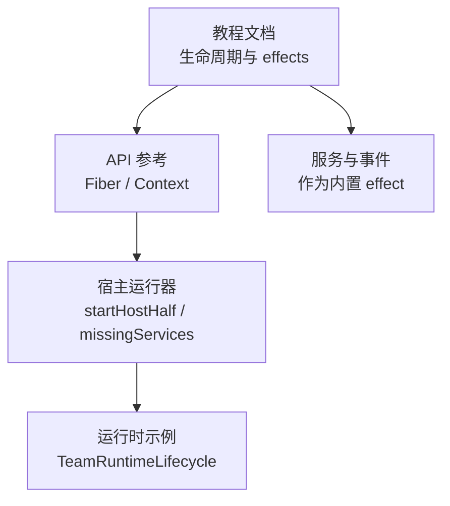
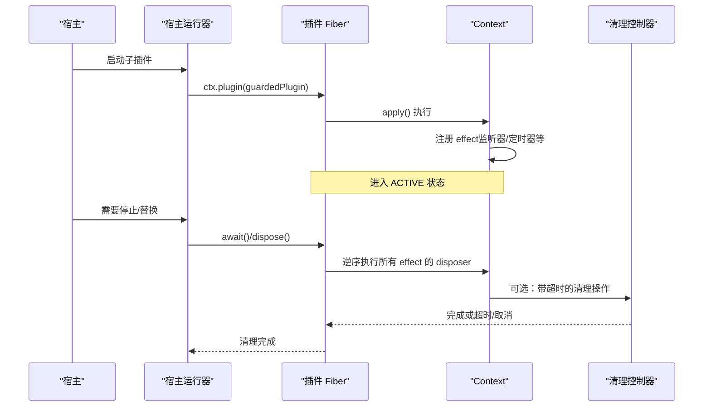
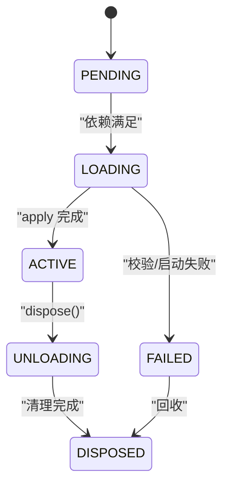
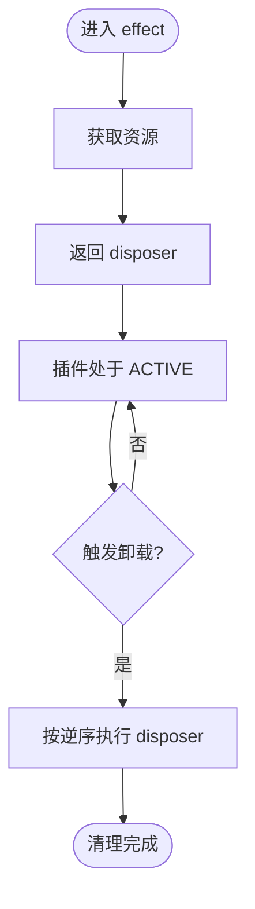
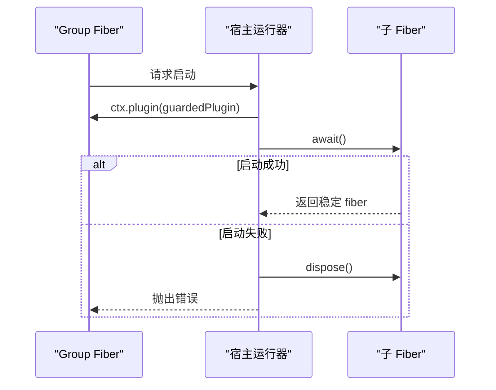
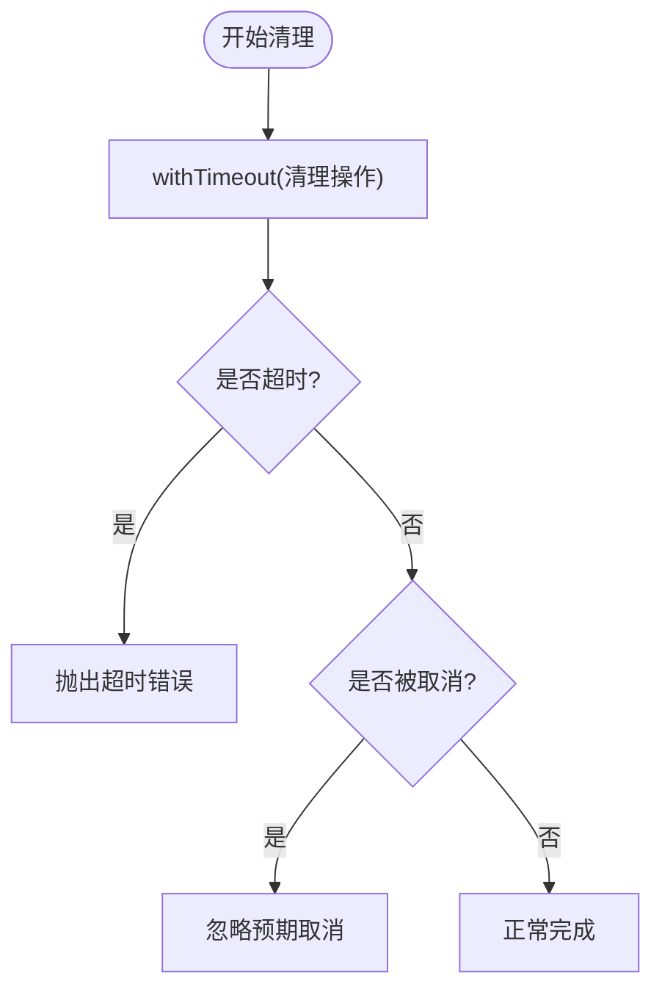
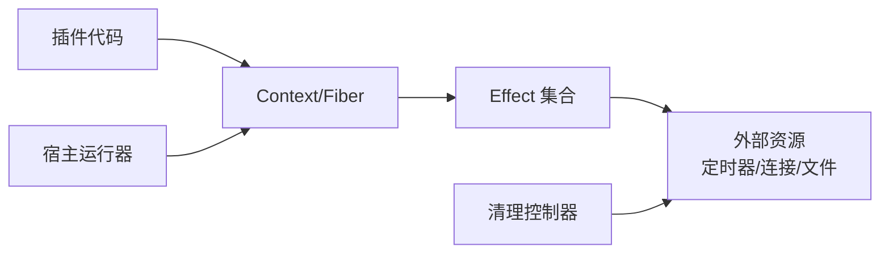

# 生命周期与副作用

<cite>
**本文引用的文件**
- [02-lifecycle-and-effects.md](file://docs/cordis-tutorial/02-lifecycle-and-effects.md)
- [02-lifecycle-and-effects.zh.md](file://docs/cordis-tutorial/02-lifecycle-and-effects.zh.md)
- [fiber.md](file://docs/cordis-api/fiber.md)
- [context.md](file://docs/cordis-api/context.md)
- [lifecycle.ts（宿主运行器）](file://packages/extensions/cordis-host-runner/src/lifecycle.ts)
- [lifecycle.ts（Agent Team）](file://packages/experimental/agent-team/src/lifecycle.ts)
- [03-services.md](file://docs/cordis-tutorial/03-services.md)
- [04-events.md](file://docs/cordis-tutorial/04-events.md)
- [testing.md](file://docs/testing.md)
</cite>

## 目录
1. [简介](#简介)
2. [项目结构](#项目结构)
3. [核心组件](#核心组件)
4. [架构总览](#架构总览)
5. [详细组件分析](#详细组件分析)
6. [依赖关系分析](#依赖关系分析)
7. [性能考量](#性能考量)
8. [故障排查指南](#故障排查指南)
9. [结论](#结论)
10. [附录](#附录)

## 简介
本文件聚焦 Cordis 插件的生命周期管理与副作用（effects）机制，系统阐述插件从初始化、启动到停止、卸载的完整流程；解释 effect 的概念、资源注册与清理模式、错误处理策略；给出在插件中正确管理定时器、网络连接、文件句柄等资源的实践方法；并总结生命周期钩子的使用模式、最佳实践、常见问题与调试技巧。

## 项目结构
围绕生命周期与副作用，仓库提供了教程文档、API 参考以及宿主侧实现示例：
- 教程文档：讲解 effect、Fiber 状态机、服务与事件如何天然成为 effect
- API 参考：定义 ctx.effect、ctx.plugin、Fiber 状态与 dispose 等能力
- 宿主实现：展示如何在宿主侧安全地启动、等待与释放子 fiber
- 运行时示例：演示超时控制与取消信号在清理阶段的应用

图表来源
- [02-lifecycle-and-effects.md:1-99](file://docs/cordis-tutorial/02-lifecycle-and-effects.md#L1-L99)
- [fiber.md:8-37](file://docs/cordis-api/fiber.md#L8-L37)
- [lifecycle.ts（宿主运行器）:1-58](file://packages/extensions/cordis-host-runner/src/lifecycle.ts#L1-L58)
- [lifecycle.ts（Agent Team）:1-88](file://packages/experimental/agent-team/src/lifecycle.ts#L1-L88)

章节来源
- [02-lifecycle-and-effects.md:1-99](file://docs/cordis-tutorial/02-lifecycle-and-effects.md#L1-L99)
- [fiber.md:8-37](file://docs/cordis-api/fiber.md#L8-L37)
- [lifecycle.ts（宿主运行器）:1-58](file://packages/extensions/cordis-host-runner/src/lifecycle.ts#L1-L58)
- [lifecycle.ts（Agent Team）:1-88](file://packages/experimental/agent-team/src/lifecycle.ts#L1-L88)

## 核心组件
- Fiber（插件实例）：承载插件配置、依赖快照、effect 集合与生命周期状态；提供 effect、dispose、await、update、restart 等方法
- Context（上下文）：通过 ctx.effect 注册清理感知型 effect；通过 ctx.plugin 挂载子插件；通过 ctx.get/provide/mixin 管理服务与能力
- 宿主侧启动器：将沙箱返回的插件包装为受保护子 fiber，等待其稳定或失败后确保被释放
- 运行时清理控制器：以 AbortController 与超时封装清理过程，区分“预期取消”和“异常失败”

章节来源
- [fiber.md:8-37](file://docs/cordis-api/fiber.md#L8-L37)
- [fiber.md:50-111](file://docs/cordis-api/fiber.md#L50-L111)
- [context.md:237-314](file://docs/cordis-api/context.md#L237-L314)
- [lifecycle.ts（宿主运行器）:14-45](file://packages/extensions/cordis-host-runner/src/lifecycle.ts#L14-L45)
- [lifecycle.ts（Agent Team）:5-88](file://packages/experimental/agent-team/src/lifecycle.ts#L5-L88)

## 架构总览
下图展示了插件加载、激活、卸载过程中，Fiber、Context、宿主侧启动器与清理控制器的交互关系。

图表来源
- [lifecycle.ts（宿主运行器）:14-45](file://packages/extensions/cordis-host-runner/src/lifecycle.ts#L14-L45)
- [fiber.md:8-37](file://docs/cordis-api/fiber.md#L8-L37)
- [lifecycle.ts（Agent Team）:44-88](file://packages/experimental/agent-team/src/lifecycle.ts#L44-L88)

## 详细组件分析

### Fiber 生命周期与状态机
- 状态转换：PENDING → LOADING → ACTIVE → UNLOADING → DISPOSED；LOADING 可转入 FAILED
- 关键行为：
  - effect 主体在加载时立即执行，disposer 在卸载时按逆序执行
  - 多个异步 disposer 并发执行；如需顺序清理，应在同一 disposer 内依次 await
  - dispose 会递归卸载子插件并等待全部清理完成

图表来源
- [02-lifecycle-and-effects.zh.md:68-82](file://docs/cordis-tutorial/02-lifecycle-and-effects.zh.md#L68-L82)
- [fiber.md:91-111](file://docs/cordis-api/fiber.md#L91-L111)

章节来源
- [02-lifecycle-and-effects.zh.md:68-82](file://docs/cordis-tutorial/02-lifecycle-and-effects.zh.md#L68-L82)
- [fiber.md:91-111](file://docs/cordis-api/fiber.md#L91-L111)

### Effect 模型与资源管理
- effect 是“清理感知”的资源登记方式：在 effect 体内获取资源，返回 disposer 用于释放
- 已内置 effect 的行为：
  - 事件监听：ctx.on 自动在卸载时移除
  - 子插件：ctx.plugin 随父插件一起释放
  - 服务注册：provide 返回的 disposer 会在卸载时注销服务
- 资源类型建议：
  - 定时器：setInterval/setTimeout 对应 clearInterval/clearTimeout
  - 网络：HTTP 客户端断开、WebSocket 关闭、请求取消（AbortController）
  - 文件：关闭文件句柄、删除临时文件、解除 watcher
  - 进程/子任务：终止进程、取消后台任务

图表来源
- [fiber.md:8-37](file://docs/cordis-api/fiber.md#L8-L37)
- [02-lifecycle-and-effects.md:7-95](file://docs/cordis-tutorial/02-lifecycle-and-effects.md#L7-L95)

章节来源
- [02-lifecycle-and-effects.md:7-95](file://docs/cordis-tutorial/02-lifecycle-and-effects.md#L7-L95)
- [fiber.md:8-37](file://docs/cordis-api/fiber.md#L8-L37)

### 宿主侧启动与等待
- startHostHalf：在 group fiber 下启动一个受保护的子 fiber，等待其稳定或失败；若失败则确保 dispose 并抛出错误
- missingServices：列出尚未就绪的 inject 依赖，便于诊断 PENDING 原因

图表来源
- [lifecycle.ts（宿主运行器）:14-45](file://packages/extensions/cordis-host-runner/src/lifecycle.ts#L14-L45)

章节来源
- [lifecycle.ts（宿主运行器）:14-45](file://packages/extensions/cordis-host-runner/src/lifecycle.ts#L14-L45)

### 清理超时与取消
- 使用 AbortController 统一发出取消信号，区分“预期取消”与“异常失败”
- 用 withTimeout 包裹清理操作，避免阻塞热重载或进程退出

图表来源
- [lifecycle.ts（Agent Team）:44-88](file://packages/experimental/agent-team/src/lifecycle.ts#L44-L88)

章节来源
- [lifecycle.ts（Agent Team）:44-88](file://packages/experimental/agent-team/src/lifecycle.ts#L44-L88)

### 服务与事件的 effect 特性
- 服务：通过 Service 基类注册，卸载时自动注销，消费者注入依赖变化时会重新加载
- 事件：ctx.on 注册的监听器在卸载时自动移除，无需手动解绑

章节来源
- [03-services.md:7-79](file://docs/cordis-tutorial/03-services.md#L7-L79)
- [04-events.md:7-78](file://docs/cordis-tutorial/04-events.md#L7-L78)

## 依赖关系分析
- 低耦合：插件通过 Context/Fiber 抽象与宿主解耦；宿主仅负责启动与释放
- 强内聚：effect 将资源获取与释放绑定在同一作用域，降低泄漏风险
- 外部依赖：
  - Node 定时器/网络/文件系统：需显式在 effect 中管理
  - AbortController：用于跨层取消
  - 测试框架：要求每个 spec 拥有独立资源与 teardown

图表来源
- [fiber.md:8-37](file://docs/cordis-api/fiber.md#L8-L37)
- [lifecycle.ts（宿主运行器）:14-45](file://packages/extensions/cordis-host-runner/src/lifecycle.ts#L14-L45)
- [lifecycle.ts（Agent Team）:44-88](file://packages/experimental/agent-team/src/lifecycle.ts#L44-L88)

章节来源
- [fiber.md:8-37](file://docs/cordis-api/fiber.md#L8-L37)
- [lifecycle.ts（宿主运行器）:14-45](file://packages/extensions/cordis-host-runner/src/lifecycle.ts#L14-L45)
- [lifecycle.ts（Agent Team）:44-88](file://packages/experimental/agent-team/src/lifecycle.ts#L44-L88)

## 性能考量
- 异步 disposer 并发执行：对无依赖的清理步骤可并行，缩短卸载时间；有顺序要求的步骤应放在同一 disposer 内串行
- 超时保护：为耗时清理设置超时，避免阻塞热重载或进程退出
- 避免长生命周期全局引用：尽量将资源绑定到 effect 作用域，减少全局泄漏
- 按需加载：通过 inject 延迟启动，直到依赖就绪，减少冷启动开销

[本节为通用指导，不直接分析具体文件]

## 故障排查指南
- 插件无输出/未启动：检查是否处于 PENDING 状态，确认所需服务是否可用
  - 参考：PENDING 语义与诊断
- 重复注册冲突：动态替换包时可能出现名称冲突，先停止旧版本再启动新版本
  - 参考：宿主启动器对“already registered”的错误提示
- 清理卡住：为清理操作添加超时；使用 AbortController 统一取消
- 资源泄漏：确认所有外部资源均在 ctx.effect 中获取并在 disposer 中释放
- 测试稳定性：遵循测试策略，确保每个 spec 拥有独立资源与 teardown，避免共享状态导致的不稳定

章节来源
- [02-lifecycle-and-effects.zh.md:68-82](file://docs/cordis-tutorial/02-lifecycle-and-effects.zh.md#L68-L82)
- [lifecycle.ts（宿主运行器）:28-43](file://packages/extensions/cordis-host-runner/src/lifecycle.ts#L28-L43)
- [lifecycle.ts（Agent Team）:44-88](file://packages/experimental/agent-team/src/lifecycle.ts#L44-L88)
- [testing.md:18-55](file://docs/testing.md#L18-L55)

## 结论
Cordis 通过 Fiber 与 Context 提供的 effect 机制，将资源生命周期与插件生命周期紧密绑定，使初始化、启动、停止、卸载过程可控且可观测。结合宿主侧的启动/等待与清理超时/取消，可有效避免内存泄漏与资源竞争。遵循“在 effect 中获取资源、在 disposer 中释放”的原则，配合服务与事件的内置 effect 行为，能够构建健壮、可维护的插件生态。

[本节为总结性内容，不直接分析具体文件]

## 附录

### 常见资源类型的 effect 示例路径
- 定时器：setInterval/setTimeout + clearInterval/clearTimeout
  - 参考路径：[教程示例（定时器 effect）:18-42](file://docs/cordis-tutorial/02-lifecycle-and-effects.zh.md#L18-L42)
- 网络连接：创建客户端/连接，在 disposer 中关闭；必要时使用 AbortController 取消
  - 参考路径：[清理超时与取消:44-88](file://packages/experimental/agent-team/src/lifecycle.ts#L44-L88)
- 文件句柄：打开文件/监听器，在 disposer 中关闭/移除
  - 参考路径：[effect 概念与用法:7-95](file://docs/cordis-tutorial/02-lifecycle-and-effects.md#L7-L95)

### 生命周期钩子与最佳实践
- 优先使用内置 effect：事件监听、服务注册、子插件均自带清理
- 自定义资源一律放入 ctx.effect，并确保 disposer 幂等
- 复杂清理保持顺序：将有序步骤放在同一 disposer 中依次 await
- 超时与取消：为可能阻塞的清理设置超时，并使用取消信号中断长耗时操作
- 诊断：利用 missingServices 与 Fiber 状态定位 PENDING/FAILED 原因

章节来源
- [02-lifecycle-and-effects.md:7-95](file://docs/cordis-tutorial/02-lifecycle-and-effects.md#L7-L95)
- [02-lifecycle-and-effects.zh.md:68-95](file://docs/cordis-tutorial/02-lifecycle-and-effects.zh.md#L68-L95)
- [lifecycle.ts（宿主运行器）:47-58](file://packages/extensions/cordis-host-runner/src/lifecycle.ts#L47-L58)