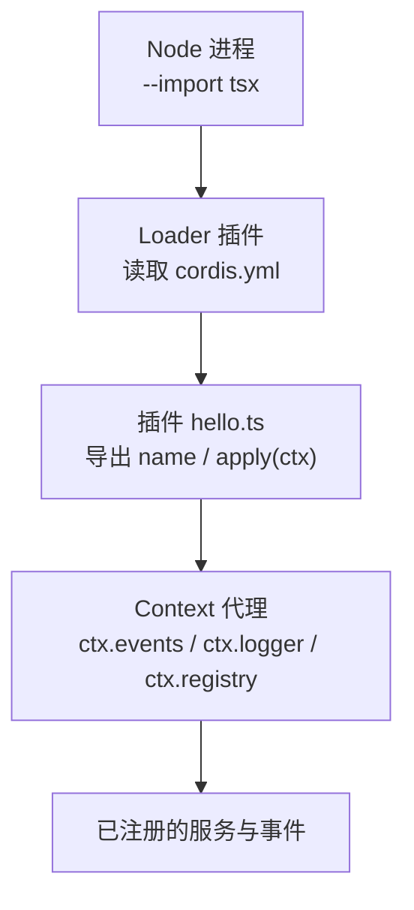
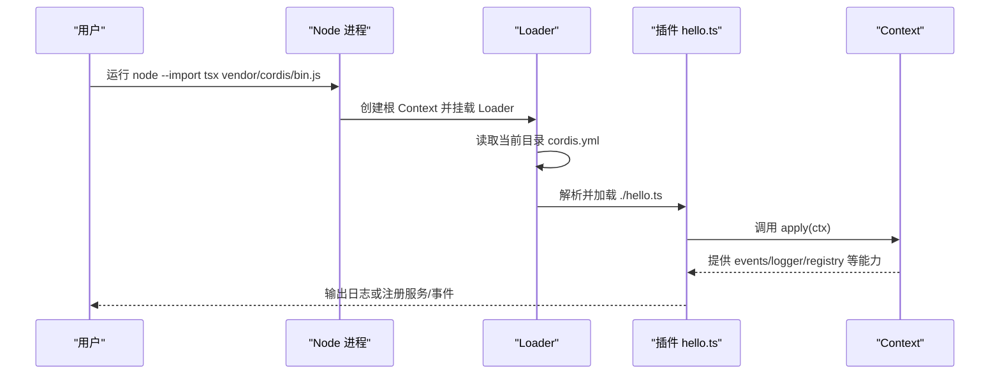
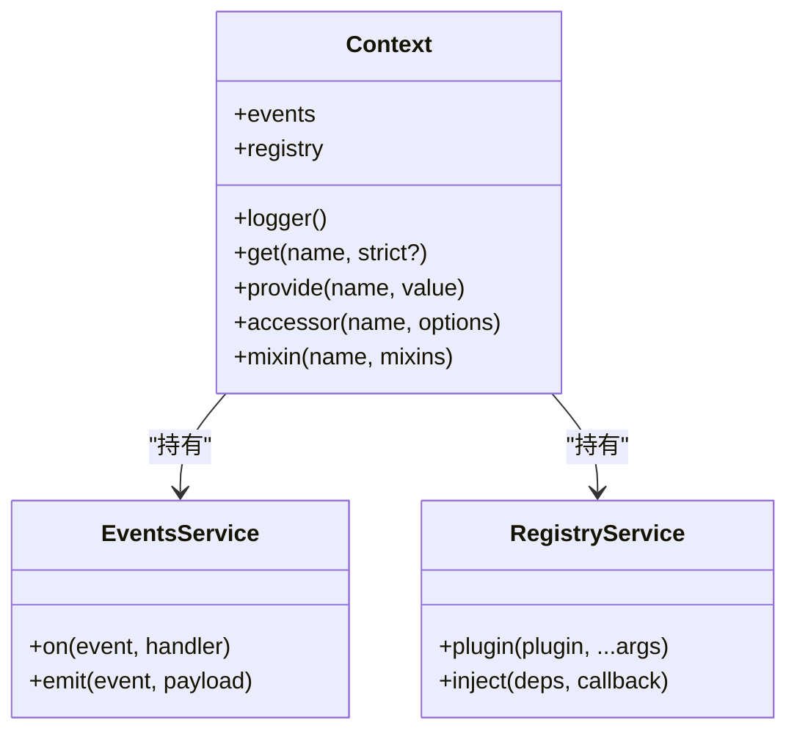
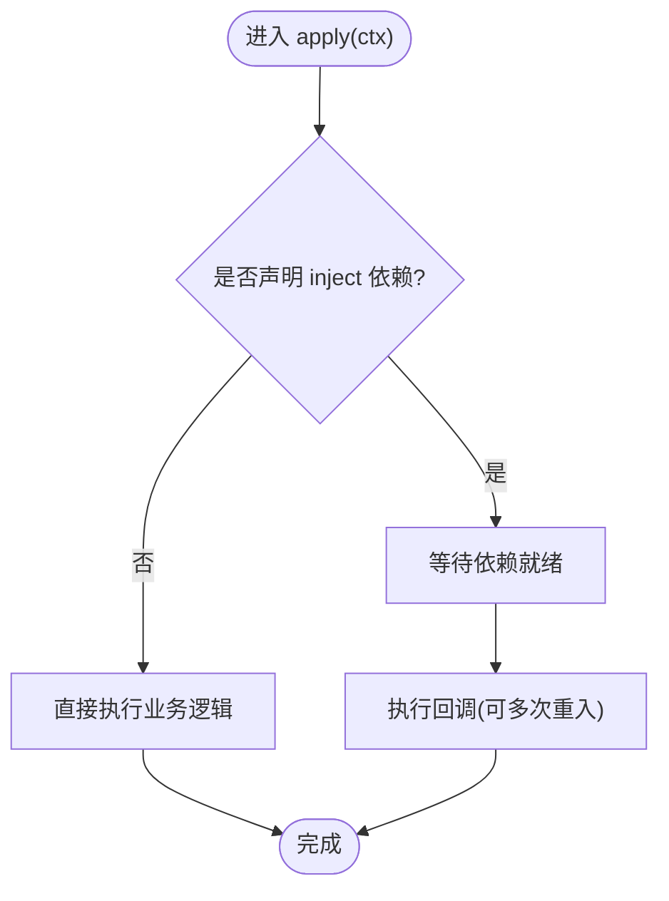
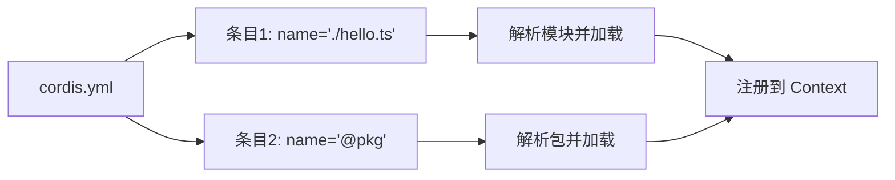
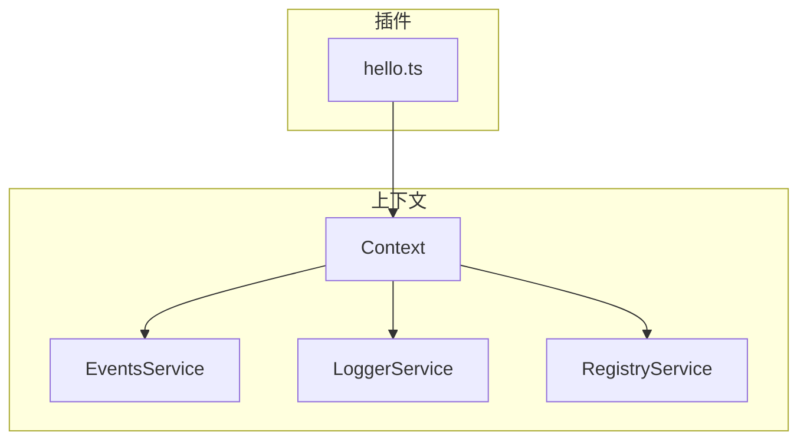

# 第一个插件

<cite>
**本文引用的文件**
- [01-first-plugin.md](file://docs/cordis-tutorial/01-first-plugin.md)
- [index.md](file://docs/cordis-tutorial/index.md)
- [context.md](file://docs/cordis-api/context.md)
- [registry.md](file://docs/cordis-api/registry.md)
- [cordis.yml（示例）](file://apps/cli/config/examples/cordis/cordis.yml)
- [github-review/cordis.yml](file://apps/cli/config/examples/github-review/cordis.yml)
- [schedule/cordis.yml](file://apps/cli/config/examples/schedule/cordis.yml)
</cite>

## 目录
1. [简介](#简介)
2. [项目结构](#项目结构)
3. [核心组件](#核心组件)
4. [架构总览](#架构总览)
5. [详细组件分析](#详细组件分析)
6. [依赖分析](#依赖分析)
7. [性能考虑](#性能考虑)
8. [故障排查指南](#故障排查指南)
9. [结论](#结论)
10. [附录：从零到一运行你的第一个插件](#附录从零到一运行你的第一个插件)

## 简介
本教程面向初学者，带你从零开始创建并运行 Cordis 框架的第一个插件。你将了解：
- 插件的基本概念与三种形态（函数、对象、类）
- 插件函数的定义与导出约定
- 通过 ctx 上下文对象进行注册、访问服务与事件
- 如何通过 cordis.yml 配置加载插件
- TypeScript 在插件开发中的基本用法（类型注解与 import type）
- 完整的步骤：创建目录、编写插件、配置、运行与验证

## 项目结构
Cordis 的插件系统由“运行时 + 配置”组成：
- 运行时负责创建根 Context、挂载 Loader、解析并启动插件
- 配置文件 cordis.yml 描述要加载的插件清单与参数
- 插件以模块形式提供 apply 或 Service，并通过 ctx 暴露能力

图表来源
- [index.md:30-36](file://docs/cordis-tutorial/index.md#L30-L36)
- [01-first-plugin.md:23-51](file://docs/cordis-tutorial/01-first-plugin.md#L23-L51)

章节来源
- [index.md:13-36](file://docs/cordis-tutorial/index.md#L13-L36)
- [01-first-plugin.md:23-51](file://docs/cordis-tutorial/01-first-plugin.md#L23-L51)

## 核心组件
- 插件入口
  - 函数插件：导出一个 apply(ctx, config?) 函数
  - 对象插件：导出 { name?, apply(ctx, config?) }
  - 类插件：继承 Service，构造时传入 ctx 与名称
- 上下文对象 ctx
  - 通过 ctx 访问 events、logger、registry 等内置能力
  - 使用 ctx.get / ctx.provide / ctx.accessor / ctx.mixin 管理服务
  - 使用 ctx.inject 声明依赖并在可用时执行回调
- 配置加载
  - cordis.yml 是一个插件条目数组，name 为模块标识符（相对路径或包名）
  - 条目并发启动，顺序不保证；依赖顺序由 inject 决定

章节来源
- [01-first-plugin.md:53-77](file://docs/cordis-tutorial/01-first-plugin.md#L53-L77)
- [registry.md:8-56](file://docs/cordis-api/registry.md#L8-L56)
- [context.md:120-162](file://docs/cordis-api/context.md#L120-L162)
- [context.md:237-365](file://docs/cordis-api/context.md#L237-L365)

## 架构总览
下图展示了从命令行启动到插件执行的完整流程，以及关键 API 的交互关系。

图表来源
- [index.md:30-36](file://docs/cordis-tutorial/index.md#L30-L36)
- [01-first-plugin.md:23-51](file://docs/cordis-tutorial/01-first-plugin.md#L23-L51)
- [registry.md:35-56](file://docs/cordis-api/registry.md#L35-L56)

## 详细组件分析

### 插件函数与上下文
- 插件函数
  - 最简单的插件只需导出 name（可选）和 apply(ctx)
  - apply 中可打印日志、注册服务、订阅事件等
- 上下文 ctx
  - 通过 ctx.events 发送/监听事件
  - 通过 ctx.logger(name) 获取命名日志器
  - 通过 ctx.registry 动态加载其他插件或注入依赖
  - 通过 ctx.get / ctx.provide / ctx.accessor / ctx.mixin 管理服务生命周期与作用域

图表来源
- [context.md:120-162](file://docs/cordis-api/context.md#L120-L162)
- [context.md:237-365](file://docs/cordis-api/context.md#L237-L365)
- [registry.md:8-56](file://docs/cordis-api/registry.md#L8-L56)

章节来源
- [01-first-plugin.md:5-21](file://docs/cordis-tutorial/01-first-plugin.md#L5-L21)
- [context.md:120-162](file://docs/cordis-api/context.md#L120-L162)
- [registry.md:8-56](file://docs/cordis-api/registry.md#L8-L56)

### 插件注册机制与依赖注入
- 插件注册
  - 通过 ctx.plugin 加载函数/对象/类插件
  - 通过 ctx.inject 声明依赖，待依赖就绪后执行回调
- 作用域与隔离
  - ctx.extend 创建带元数据的子上下文
  - ctx.isolate 对指定服务建立独立作用域
  - ctx.intercept 为下游插件合并服务配置

图表来源
- [registry.md:8-56](file://docs/cordis-api/registry.md#L8-L56)
- [context.md:14-96](file://docs/cordis-api/context.md#L14-L96)

章节来源
- [registry.md:8-56](file://docs/cordis-api/registry.md#L8-L56)
- [context.md:14-96](file://docs/cordis-api/context.md#L14-L96)

### 配置加载与组合
- cordis.yml 是插件树列表，每个条目包含 name（模块标识）、id（可选）、config（可选）等
- 条目并发启动，顺序不代表执行顺序；真正的依赖顺序由 inject 决定
- 可通过 insert/insertBefore/replace 等组合方式叠加配置（见示例）

图表来源
- [01-first-plugin.md:23-31](file://docs/cordis-tutorial/01-first-plugin.md#L23-L31)
- [github-review/cordis.yml:1-36](file://apps/cli/config/examples/github-review/cordis.yml#L1-L36)
- [schedule/cordis.yml:1-13](file://apps/cli/config/examples/schedule/cordis.yml#L1-L13)

章节来源
- [01-first-plugin.md:23-31](file://docs/cordis-tutorial/01-first-plugin.md#L23-L31)
- [github-review/cordis.yml:1-36](file://apps/cli/config/examples/github-review/cordis.yml#L1-L36)
- [schedule/cordis.yml:1-13](file://apps/cli/config/examples/schedule/cordis.yml#L1-L13)

### TypeScript 在插件中的基本用法
- 类型注解：为 ctx、参数、返回值添加类型，提升可读性与安全性
- import type：仅导入类型信息，不会引入运行时依赖
- 声明合并：扩展 @deepseek-ai/cordis 的类型，使自定义属性/事件获得类型提示

章节来源
- [index.md:48-58](file://docs/cordis-tutorial/index.md#L48-L58)

## 依赖分析
- 插件与上下文
  - 插件通过 ctx 访问事件、日志、注册表等服务
  - 通过 ctx.inject 声明对其它服务的依赖，确保按需加载与重入
- 配置与模块解析
  - cordis.yml 中的 name 支持相对路径与 npm 包名
  - 解析失败会记录日志而非崩溃；应用层需关注启动日志

图表来源
- [context.md:120-162](file://docs/cordis-api/context.md#L120-L162)
- [registry.md:35-56](file://docs/cordis-api/registry.md#L35-L56)

章节来源
- [context.md:120-162](file://docs/cordis-api/context.md#L120-L162)
- [registry.md:35-56](file://docs/cordis-api/registry.md#L35-L56)

## 性能考虑
- 插件并发启动：cordis.yml 条目并发加载，避免阻塞
- 依赖驱动顺序：使用 inject 表达依赖，减少不必要的等待
- 轻量类型导入：使用 import type 避免运行时开销
- 合理拆分：将复杂逻辑拆分为多个小插件，便于热重载与调试

[本节为通用指导，无需特定文件引用]

## 故障排查指南
- 插件抛出异常
  - 若 apply 抛错，进程将以错误退出；检查插件初始化逻辑
- 模块无法解析
  - 路径或包名拼写错误不会导致崩溃，但会在启动日志中记录；优先检查拼写
- 插件未生效
  - 确认 cordis.yml 中是否正确列出该插件条目
  - 确认模块路径或包名可被解析
- 依赖未就绪
  - 使用 ctx.inject 声明依赖，确保回调在依赖可用时执行

章节来源
- [01-first-plugin.md:79-92](file://docs/cordis-tutorial/01-first-plugin.md#L79-L92)

## 结论
通过本教程，你已掌握：
- 如何编写最简插件（函数/对象/类）
- 如何使用 ctx 访问上下文能力
- 如何通过 cordis.yml 加载插件
- 如何在 TypeScript 中安全地标注类型与导入类型
- 如何定位常见问题并进行修复

[本节为总结性内容，无需特定文件引用]

## 附录：从零到一运行你的第一个插件
以下步骤基于仓库提供的教程与示例，帮助你快速跑通第一个插件。

- 准备环境
  - 克隆仓库并安装依赖
  - 创建临时目录用于练习
- 编写插件
  - 在临时目录下创建插件文件（例如 hello.ts），导出 name 与 apply(ctx)
  - 在 apply 中打印一条日志或使用 ctx.logger/events
- 编写配置
  - 在当前目录创建 cordis.yml，添加一个条目指向你的插件文件
- 运行
  - 使用 Node 的 tsx 加载器运行 Cordis 引导脚本
  - 观察控制台输出，确认插件已执行
- 进阶
  - 尝试对象插件与类插件
  - 使用 ctx.inject 声明依赖
  - 参考示例配置学习更复杂的组合方式

章节来源
- [index.md:13-36](file://docs/cordis-tutorial/index.md#L13-L36)
- [01-first-plugin.md:7-51](file://docs/cordis-tutorial/01-first-plugin.md#L7-L51)
- [github-review/cordis.yml:1-36](file://apps/cli/config/examples/github-review/cordis.yml#L1-L36)
- [schedule/cordis.yml:1-13](file://apps/cli/config/examples/schedule/cordis.yml#L1-L13)