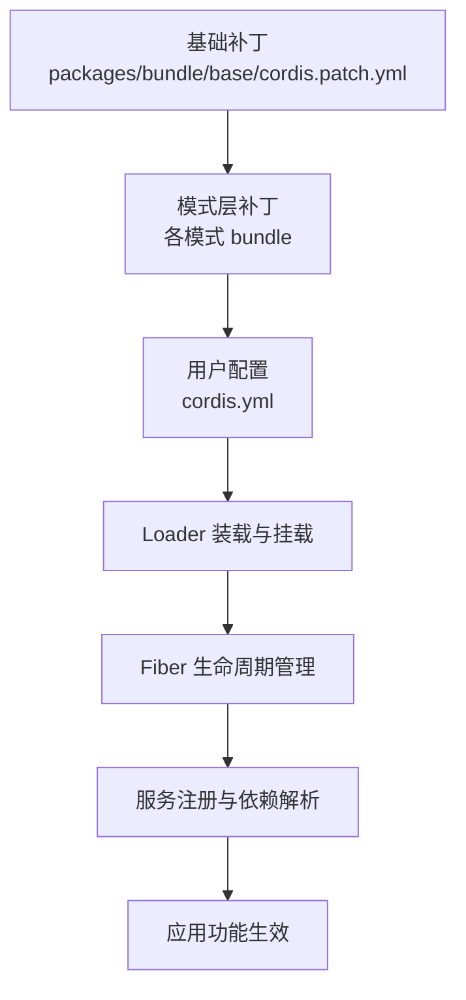
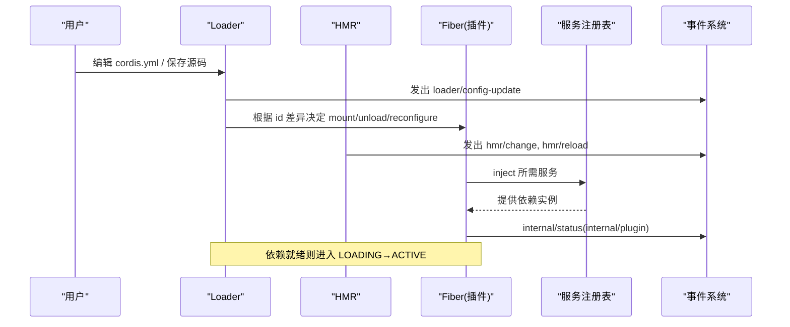
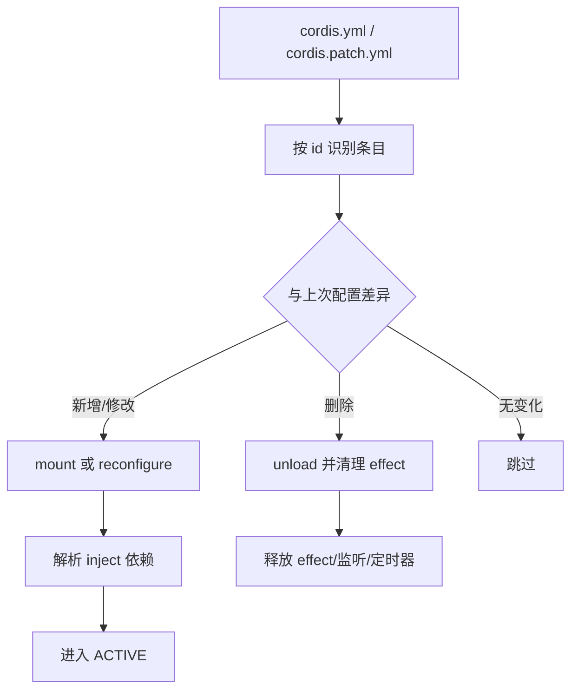
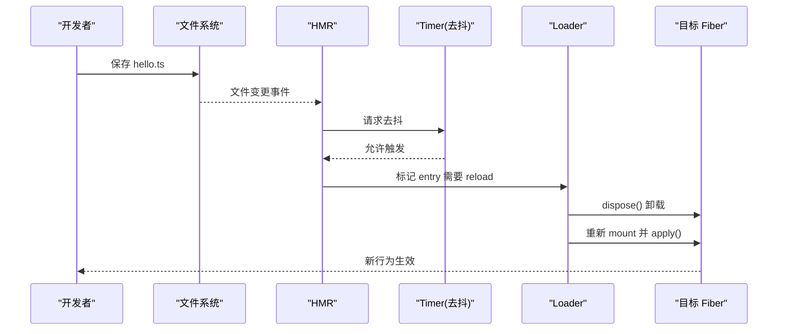
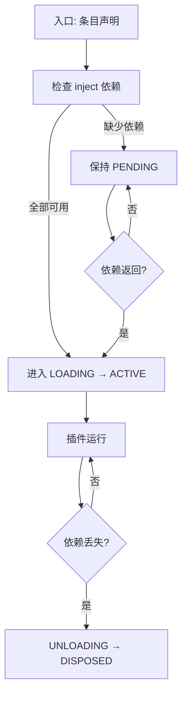
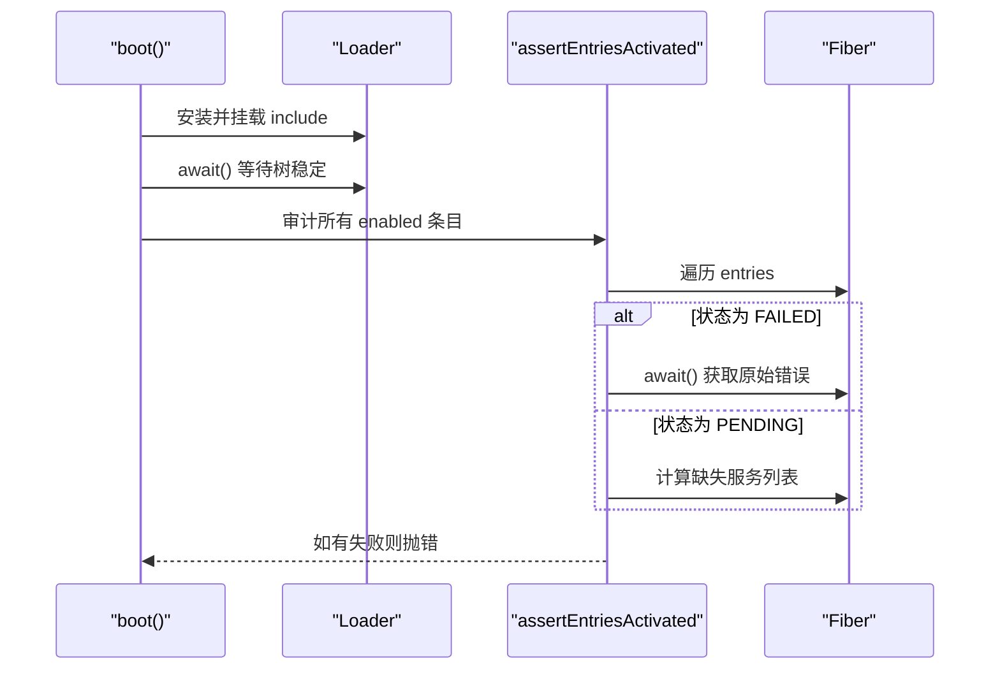
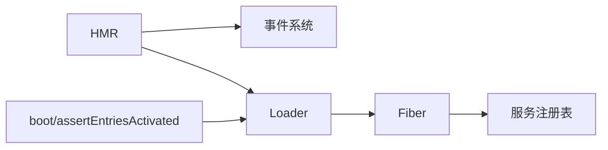

# 组合与热重载

<cite>
**本文引用的文件**
- [apps/cli/composition.md](file://apps/cli/composition.md)
- [packages/bundle/base/cordis.patch.yml](file://packages/bundle/base/cordis.patch.yml)
- [docs/cordis-tutorial/06-composition-and-hmr.md](file://docs/cordis-tutorial/06-composition-and-hmr.md)
- [docs/cordis-tutorial/06-composition-and-hmr.zh.md](file://docs/cordis-tutorial/06-composition-and-hmr.zh.md)
- [docs/cordis-api/fiber.md](file://docs/cordis-api/fiber.md)
- [docs/cordis-api/fiber.zh.md](file://docs/cordis-api/fiber.zh.md)
- [docs/cordis-api/events.md](file://docs/cordis-api/events.md)
- [docs/cordis-api/inherited.md](file://docs/cordis-api/inherited.md)
- [docs/user/develop/framework/service.md](file://docs/user/develop/framework/service.md)
- [docs/user/develop/framework/index.md](file://docs/user/develop/framework/index.md)
- [docs/user/develop/framework/index.zh.md](file://docs/user/develop/framework/index.zh.md)
- [packages/boot/app-boot/src/index.ts](file://packages/boot/app-boot/src/index.ts)
- [packages/client/hmr/tests/node-half.client.spec.ts](file://packages/client/hmr/tests/node-half.client.spec.ts)
- [packages/client/hmr/src/invariant.ts](file://packages/client/hmr/src/invariant.ts)
- [scripts/cordis-yaml.ts](file://scripts/cordis-yaml.ts)
- [scripts/verify-cordis-config.ts](file://scripts/verify-cordis-config.ts)
</cite>

## 目录
1. [简介](#简介)
2. [项目结构](#项目结构)
3. [核心组件](#核心组件)
4. [架构总览](#架构总览)
5. [详细组件分析](#详细组件分析)
6. [依赖分析](#依赖分析)
7. [性能考虑](#性能考虑)
8. [故障排查指南](#故障排查指南)
9. [结论](#结论)
10. [附录](#附录)

## 简介
本文件聚焦 Cordis 插件组合与热模块重载（HMR）的完整实践：从插件树概念、组合模式与配置文件组织，到 HMR 在开发时的快速迭代与运行时更新；并解释插件加载顺序、依赖解析与冲突解决机制。文档提供复杂插件树的构建、调试与优化方法，以及加载失败的诊断与常见原因定位，附带插件开发的调试技巧与性能优化建议。

## 项目结构
Cordis 的组合由“基础包补丁 + 模式层补丁 + 用户配置”三层叠加构成。基础补丁定义共享的核心插件集合，模式层针对具体运行模式（web/headless/sdk/acp）进行覆盖或启用特定能力，用户层通过 cordis.yml 最终选择并配置插件树。HMR 作为可选能力，默认在基础层禁用，可在模式层或用户层开启。

图表来源
- [packages/bundle/base/cordis.patch.yml:1-516](file://packages/bundle/base/cordis.patch.yml#L1-L516)
- [apps/cli/composition.md:1-277](file://apps/cli/composition.md#L1-L277)

章节来源
- [packages/bundle/base/cordis.patch.yml:1-516](file://packages/bundle/base/cordis.patch.yml#L1-L516)
- [apps/cli/composition.md:1-277](file://apps/cli/composition.md#L1-L277)

## 核心组件
- 插件与 Fiber：每个插件以 Fiber 为单位运行，维护状态机（PENDING → LOADING → ACTIVE/FAILED → UNLOADING → DISPOSED），并通过 inject/provide 声明依赖与服务。
- Loader：负责读取 cordis.yml，按 id 比较差异，增量挂载/卸载/重新配置条目；支持 group/isolate 实现分组与隔离。
- HMR：监听源文件变更，触发对应 fiber 的卸载与再加载；配合 timer 去抖，避免频繁重启。
- 启动审计：boot 流程在树稳定后校验所有 enabled 条目是否成功激活，失败时抛出包含原始堆栈的诊断信息。

章节来源
- [docs/user/develop/framework/index.md:1-61](file://docs/user/develop/framework/index.md#L1-L61)
- [docs/user/develop/framework/index.zh.md:1-61](file://docs/user/develop/framework/index.zh.md#L1-L61)
- [docs/cordis-api/fiber.md:37-109](file://docs/cordis-api/fiber.md#L37-L109)
- [docs/cordis-api/fiber.zh.md:82-146](file://docs/cordis-api/fiber.zh.md#L82-L146)
- [packages/boot/app-boot/src/index.ts:684-865](file://packages/boot/app-boot/src/index.ts#L684-L865)

## 架构总览
下图展示了从配置到运行的关键路径：Loader 解析 cordis.yml，创建/更新 fiber；HMR 监听变更并驱动 reload；事件系统贯穿生命周期，便于观测与调试。

图表来源
- [docs/cordis-api/events.md:1-208](file://docs/cordis-api/events.md#L1-L208)
- [docs/cordis-api/inherited.md:23-40](file://docs/cordis-api/inherited.md#L23-L40)
- [packages/boot/app-boot/src/index.ts:760-837](file://packages/boot/app-boot/src/index.ts#L760-L837)

## 详细组件分析

### 插件树与组合模式
- 基础补丁集中声明共享插件（如 timer、hmr、llm、session、storage、sandbox、tools 等），并按功能域分组，便于阅读与维护。
- 行 id 是稳定的标识，用于 diff 与增量更新；disabled 可临时禁用某项而不删除配置。
- 组（group）可将一组条目作为一个单元加载/卸载；isolate 可为组内服务名提供独立实例，避免跨组污染。

图表来源
- [packages/bundle/base/cordis.patch.yml:15-516](file://packages/bundle/base/cordis.patch.yml#L15-L516)
- [scripts/cordis-yaml.ts:43-54](file://scripts/cordis-yaml.ts#L43-L54)
- [scripts/verify-cordis-config.ts:163-188](file://scripts/verify-cordis-config.ts#L163-L188)

章节来源
- [packages/bundle/base/cordis.patch.yml:1-516](file://packages/bundle/base/cordis.patch.yml#L1-L516)
- [apps/cli/composition.md:1-277](file://apps/cli/composition.md#L1-L277)
- [scripts/cordis-yaml.ts:43-54](file://scripts/cordis-yaml.ts#L43-L54)
- [scripts/verify-cordis-config.ts:163-188](file://scripts/verify-cordis-config.ts#L163-L188)

### 热模块重载（HMR）工作流
- HMR 插件监听指定根目录下的文件变更，触发对应 fiber 的卸载与再加载；旧实例的所有 effect 会被回滚，新代码执行 apply。
- 通过注入 timer 服务实现去抖，避免高频保存导致反复重启。
- 在 tsx 下运行 Cordis 可获得更好的开发体验；HMR 会输出 watching 与 reload 日志。

图表来源
- [docs/cordis-tutorial/06-composition-and-hmr.md:23-59](file://docs/cordis-tutorial/06-composition-and-hmr.md#L23-L59)
- [docs/cordis-tutorial/06-composition-and-hmr.zh.md:23-59](file://docs/cordis-tutorial/06-composition-and-hmr.zh.md#L23-L59)
- [packages/client/hmr/tests/node-half.client.spec.ts:75-111](file://packages/client/hmr/tests/node-half.client.spec.ts#L75-L111)

章节来源
- [docs/cordis-tutorial/06-composition-and-hmr.md:23-59](file://docs/cordis-tutorial/06-composition-and-hmr.md#L23-L59)
- [docs/cordis-tutorial/06-composition-and-hmr.zh.md:23-59](file://docs/cordis-tutorial/06-composition-and-hmr.zh.md#L23-L59)
- [packages/client/hmr/tests/node-half.client.spec.ts:75-111](file://packages/client/hmr/tests/node-half.client.spec.ts#L75-L111)

### 插件加载顺序、依赖解析与冲突解决
- 加载顺序不依赖 cordis.yml 中的行序，而是由依赖可用性驱动：只有当 inject 中所有服务都可用时，插件才会从 PENDING 进入 LOADING 并最终 ACTIVE。
- 若依赖在服务消失后被移除，相关插件会自动卸载并在依赖恢复后重新加载，避免调用已失效的服务。
- 冲突解决：通过 isolate 为不同组提供同一服务名的独立实例；通过 id 精确匹配条目，避免重复或误替换。

图表来源
- [docs/user/develop/framework/index.md:1-61](file://docs/user/develop/framework/index.md#L1-L61)
- [docs/user/develop/framework/service.md:87-137](file://docs/user/develop/framework/service.md#L87-L137)

章节来源
- [docs/user/develop/framework/index.md:1-61](file://docs/user/develop/framework/index.md#L1-L61)
- [docs/user/develop/framework/service.md:87-137](file://docs/user/develop/framework/service.md#L87-L137)

### 启动审计与错误传播
- boot 流程在安装 Loader 后挂载 include 树，等待 Loader 结算，然后调用 assertEntriesActivated 对每个 enabled 条目进行激活审计。
- 若存在未加载或处于 FAILED/PENDING 的条目，将收集失败原因（包括缺失服务名称）并抛出带标签的错误；对于 FAILED 条目，会 await fiber.await() 获取原始异常堆栈。

图表来源
- [packages/boot/app-boot/src/index.ts:684-865](file://packages/boot/app-boot/src/index.ts#L684-L865)

章节来源
- [packages/boot/app-boot/src/index.ts:684-865](file://packages/boot/app-boot/src/index.ts#L684-L865)

### 复杂插件树的构建、调试与优化
- 构建：以基础补丁为底座，按需启用/覆盖模式层补丁，最后用 cordis.yml 做用户层定制；使用 id 保证稳定引用，必要时使用 group 与 isolate 控制作用域。
- 调试：利用事件 internal/plugin、internal/status、hmr/change、hmr/reload 观察生命周期；通过遍历 registry.fibers 检查 PENDING 条目及其 inject 缺失项。
- 优化：合理拆分 group 与 isolate，减少不必要的重载范围；为 HMR 设置 debounce；仅在开发环境启用 HMR；对重型服务（如数据库、网络）采用懒加载与缓存。

章节来源
- [docs/cordis-tutorial/06-composition-and-hmr.md:23-59](file://docs/cordis-tutorial/06-composition-and-hmr.md#L23-L59)
- [docs/cordis-api/events.md:1-208](file://docs/cordis-api/events.md#L1-L208)
- [docs/cordis-api/inherited.md:23-40](file://docs/cordis-api/inherited.md#L23-L40)

## 依赖分析
- 组件耦合：Loader 与 Fiber 强耦合（条目与 fiber 映射），HMR 通过事件与 Loader 交互；启动审计依赖 Loader 暴露的 entries 接口。
- 外部依赖：timer 用于去抖；事件系统用于跨组件通信；文件系统用于 HMR 监听。
- 循环依赖风险：通过 isolate 与 group 降低跨组耦合；inject 仅声明服务键，避免直接模块级耦合。

图表来源
- [packages/boot/app-boot/src/index.ts:760-837](file://packages/boot/app-boot/src/index.ts#L760-L837)
- [docs/cordis-api/events.md:1-208](file://docs/cordis-api/events.md#L1-L208)

章节来源
- [packages/boot/app-boot/src/index.ts:760-837](file://packages/boot/app-boot/src/index.ts#L760-L837)
- [docs/cordis-api/events.md:1-208](file://docs/cordis-api/events.md#L1-L208)

## 性能考虑
- HMR 去抖：通过 timer 服务合并高频保存事件，减少频繁卸载/加载带来的开销。
- 最小化重载范围：使用 group 限定受影响范围，结合 isolate 避免全局服务重建。
- 资源清理：确保所有 watcher、定时器、订阅都在 ctx.effect 中管理，fiber 销毁时自动回收，防止内存泄漏。
- 启动审计延迟：仅在树稳定后进行一次性审计，避免在加载过程中重复检查。

章节来源
- [packages/client/hmr/src/invariant.ts:21-59](file://packages/client/hmr/src/invariant.ts#L21-L59)
- [docs/user/develop/framework/index.md:1-61](file://docs/user/develop/framework/index.md#L1-L61)

## 故障排查指南
- 常见问题
  - 插件永远 PENDING：检查 inject 中是否有未提供的服务；可通过遍历 fibers 并过滤 PENDING 状态来定位缺失服务。
  - 插件加载失败：查看 fiber.state 为 FAILED 时 await fiber.await() 获取原始异常堆栈；启动审计会聚合所有失败条目并抛出错误。
  - HMR 不生效：确认已启用 HMR 且 root 配置正确；确保在 tsx 环境下运行；检查去抖配置与监听路径。
- 诊断步骤
  - 监听 internal/status 与 internal/plugin 事件，观察 fiber 状态变化。
  - 打印所有 enabled 条目的 fiber 状态与 inject 缺失项。
  - 逐步缩小问题范围：禁用部分条目，验证是否为依赖链问题。
- 解决方法
  - 补充缺失服务提供者；修正配置 schema；调整 group/isolate 边界；修复 HMR 根路径与忽略规则。

章节来源
- [docs/cordis-tutorial/06-composition-and-hmr.md:61-109](file://docs/cordis-tutorial/06-composition-and-hmr.md#L61-L109)
- [docs/cordis-tutorial/06-composition-and-hmr.zh.md:61-109](file://docs/cordis-tutorial/06-composition-and-hmr.zh.md#L61-L109)
- [packages/boot/app-boot/src/index.ts:684-758](file://packages/boot/app-boot/src/index.ts#L684-L758)

## 结论
Cordis 通过“基础补丁 + 模式层 + 用户配置”的分层组合，实现了高度可插拔的插件体系；基于 Fiber 的状态机与依赖驱动加载保证了系统的稳定性与可维护性；HMR 提供了开发期的高效迭代能力。借助事件系统与启动审计，可以精准定位加载问题并进行性能优化。遵循 group/isolate 的最佳实践与资源清理规范，能够在复杂插件树下保持清晰的职责边界与优秀的运行时表现。

## 附录
- 常用命令与环境
  - 在 tsx 下运行 Cordis 以启用 HMR 开发体验。
  - 通过 cordis.yml 的 id 与 disabled 字段进行细粒度控制。
- 参考文档
  - 插件与生命周期、服务依赖与隔离、事件系统、Fiber API 等。