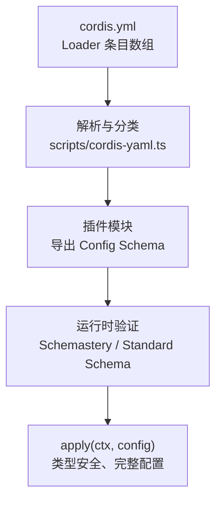
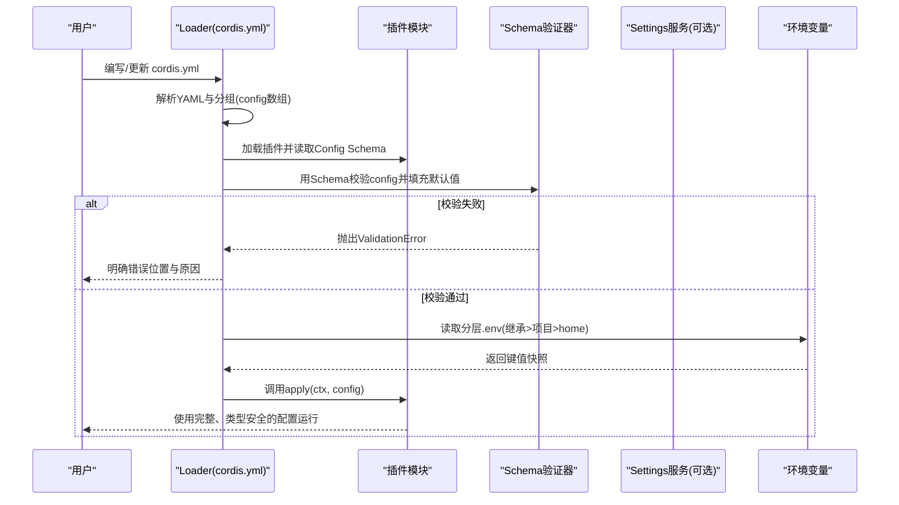
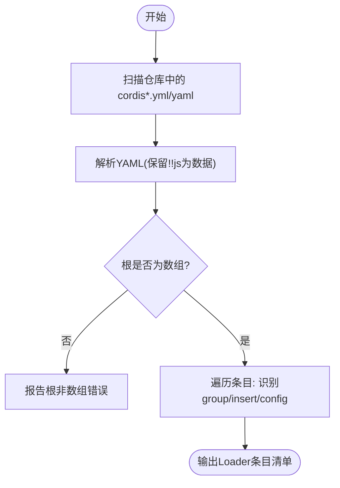
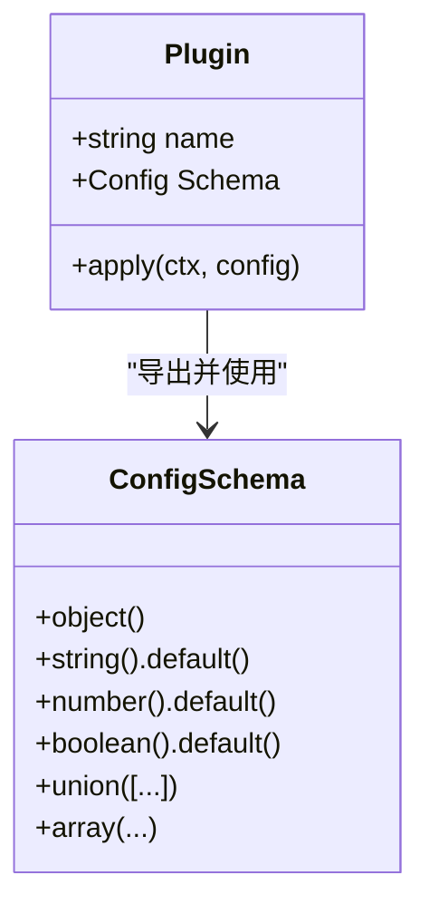
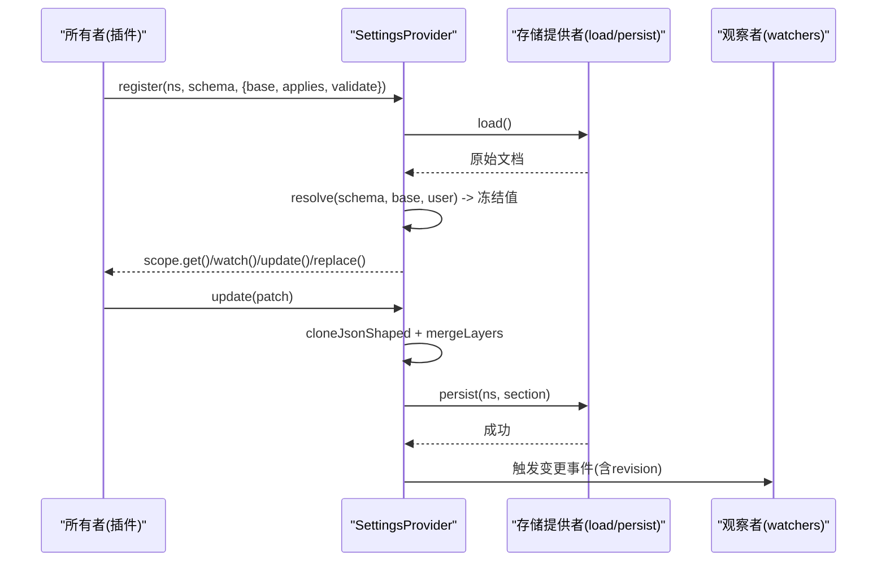
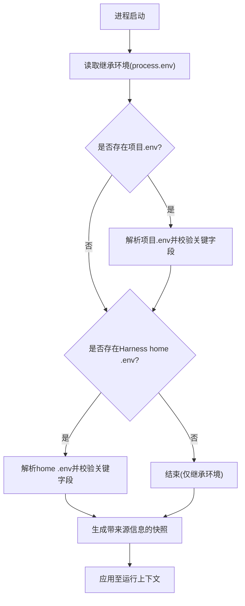
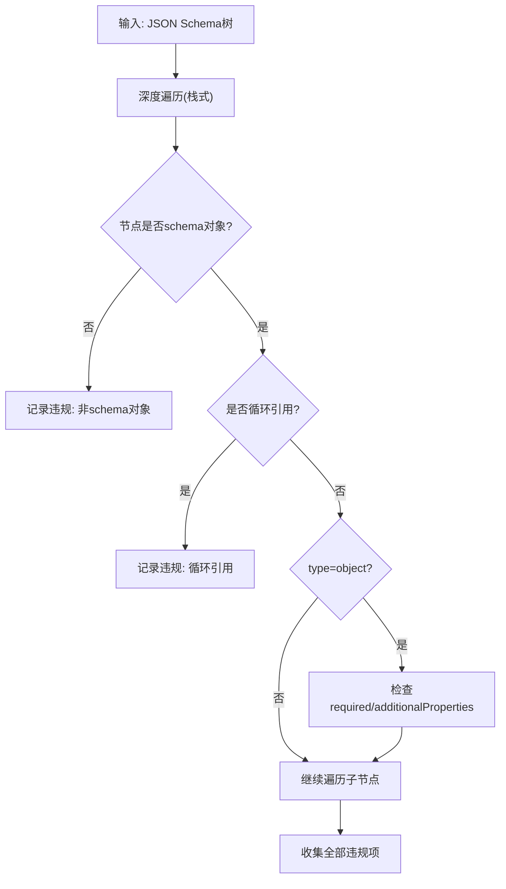
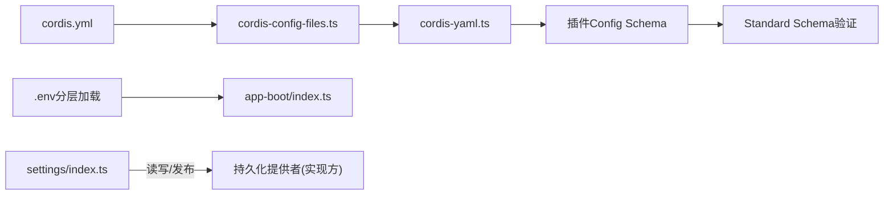

# 配置管理

<cite>
**本文引用的文件**
- [apps/cli/config/examples/cordis/cordis.yml](file://apps/cli/config/examples/cordis/cordis.yml)
- [docs/cordis-tutorial/05-config.zh.md](file://docs/cordis-tutorial/05-config.zh.md)
- [docs/user/develop/basic/config.zh.md](file://docs/user/develop/basic/config.zh.md)
- [packages/settings/settings/src/index.ts](file://packages/settings/settings/src/index.ts)
- [scripts/cordis-yaml.ts](file://scripts/cordis-yaml.ts)
- [scripts/cordis-config-files.ts](file://scripts/cordis-config-files.ts)
- [scripts/verify-cordis-config.ts](file://scripts/verify-cordis-config.ts)
- [packages/boot/app-boot/src/index.ts](file://packages/boot/app-boot/src/index.ts)
- [packages/core/tools/src/json-schema.ts](file://packages/core/tools/src/json-schema.ts)
</cite>

## 目录
1. [简介](#简介)
2. [项目结构](#项目结构)
3. [核心组件](#核心组件)
4. [架构总览](#架构总览)
5. [详细组件分析](#详细组件分析)
6. [依赖关系分析](#依赖关系分析)
7. [性能考虑](#性能考虑)
8. [故障排除指南](#故障排除指南)
9. [结论](#结论)
10. [附录](#附录)

## 简介
本文件系统性说明 Cordis 配置体系：如何在 cordis.yml 中声明与组织配置、如何通过 Schema 进行类型安全与运行时校验、如何处理错误、如何实现配置的继承与覆盖、如何结合环境变量，以及最佳实践与调试方法。目标是帮助读者从零开始构建可维护、可演进且安全的插件配置系统。

## 项目结构
Cordis 的配置由“配置文件 + Schema + 运行期验证”三部分构成：
- 配置文件：以 YAML 形式定义 Loader 条目（插件、工具、服务），每个条目可携带 config 块。
- Schema：插件导出同名的 Schemastery schema，既提供 TypeScript 类型，又作为运行时验证器。
- 运行期验证：在 apply 之前对配置进行校验并填充默认值；校验失败会立即报错，避免半配置启动。

图表来源
- [scripts/cordis-yaml.ts:1-55](file://scripts/cordis-yaml.ts#L1-L55)
- [docs/cordis-tutorial/05-config.zh.md:1-66](file://docs/cordis-tutorial/05-config.zh.md#L1-L66)

章节来源
- [scripts/cordis-yaml.ts:1-55](file://scripts/cordis-yaml.ts#L1-L55)
- [docs/cordis-tutorial/05-config.zh.md:1-66](file://docs/cordis-tutorial/05-config.zh.md#L1-L66)

## 核心组件
- 配置入口与发现
  - cordis.yml 是 Loader 的输入，根节点为条目数组，每个条目可包含 id、name、config 等字段，也支持 group 与嵌套 config 列表。
  - 脚本负责扫描仓库中的 cordis*.yml/yaml 文件，并过滤掉翻译记录等非 Loader 输入。
- Schema 与类型安全
  - 插件需导出名为 Config 的 Schemastery schema，配合 TypeScript interface，实现编译期类型与运行期校验的统一。
  - 未提供的字段可由 schema 默认值补齐；传入非法类型会抛出明确的验证错误。
- 设置服务（Settings）
  - 提供命名空间化的配置注册、合并、持久化与变更观察；支持 base（组合层）、用户层与 schema 默认值的三层合并。
  - 写入路径操作（update/replace/mutate）具备 JSON 形状校验、冲突检测与序列化队列。
- 环境变量与分层加载
  - 应用启动时按“继承环境 > 项目 .env > Harness home .env”的顺序分层加载，保留来源信息，避免污染关键变量。

章节来源
- [scripts/cordis-config-files.ts:1-18](file://scripts/cordis-config-files.ts#L1-L18)
- [docs/cordis-tutorial/05-config.zh.md:1-66](file://docs/cordis-tutorial/05-config.zh.md#L1-L66)
- [packages/settings/settings/src/index.ts:1-800](file://packages/settings/settings/src/index.ts#L1-L800)
- [packages/boot/app-boot/src/index.ts:74-210](file://packages/boot/app-boot/src/index.ts#L74-L210)

## 架构总览
下图展示了从配置文件到插件运行的端到端流程，包括解析、Schema 校验、默认值填充、错误处理与环境变量参与。

图表来源
- [scripts/cordis-yaml.ts:1-55](file://scripts/cordis-yaml.ts#L1-L55)
- [docs/cordis-tutorial/05-config.zh.md:1-66](file://docs/cordis-tutorial/05-config.zh.md#L1-L66)
- [packages/boot/app-boot/src/index.ts:74-210](file://packages/boot/app-boot/src/index.ts#L74-L210)

## 详细组件分析

### 组件A：配置解析与发现（cordis.yml）
- 作用
  - 定义 Loader 条目数组，支持 id/name/config/group/insert 等结构。
  - 示例文件演示了通过 patch overlay 的方式覆盖 webserver 端口并插入 Cordis 相关宿主与工具。
- 关键点
  - 根必须为数组；每条目的 config 会被后续步骤校验。
  - 支持 !!js 表达式保留为数据而非执行，便于安全地传递动态片段。
  - 脚本会扫描仓库内所有 cordis*.yml/yaml，排除翻译记录与 vendor/node_modules。

图表来源
- [scripts/cordis-config-files.ts:1-18](file://scripts/cordis-config-files.ts#L1-L18)
- [scripts/cordis-yaml.ts:1-55](file://scripts/cordis-yaml.ts#L1-L55)

章节来源
- [apps/cli/config/examples/cordis/cordis.yml:1-20](file://apps/cli/config/examples/cordis/cordis.yml#L1-L20)
- [scripts/cordis-config-files.ts:1-18](file://scripts/cordis-config-files.ts#L1-L18)
- [scripts/cordis-yaml.ts:1-55](file://scripts/cordis-yaml.ts#L1-L55)

### 组件B：Schema 定义与类型安全
- 作用
  - 插件导出同名 Config 接口与 Schemastery schema，确保 TypeScript 类型与运行时校验一致。
  - 支持 required、default、union、array/object 等复杂约束；缺失字段由 schema 默认值补齐。
- 行为
  - 在 apply 前完成校验；任何不合法输入都会抛出 ValidationError，并给出精确路径提示。
  - 禁止将普通对象作为 Config 导出，必须遵循 Standard Schema 接口。

图表来源
- [docs/cordis-tutorial/05-config.zh.md:1-66](file://docs/cordis-tutorial/05-config.zh.md#L1-L66)
- [docs/user/develop/basic/config.zh.md:1-72](file://docs/user/develop/basic/config.zh.md#L1-L72)

章节来源
- [docs/cordis-tutorial/05-config.zh.md:1-66](file://docs/cordis-tutorial/05-config.zh.md#L1-L66)
- [docs/user/develop/basic/config.zh.md:1-72](file://docs/user/develop/basic/config.zh.md#L1-L72)

### 组件C：设置服务（Settings）——命名空间、合并与持久化
- 作用
  - 提供命名空间化的配置注册、读取、监听与更新；支持 base（组合层）、用户层与 schema 默认值的三层合并。
  - 写入路径操作（update/replace/mutate）具备 JSON 形状校验、冲突检测与串行队列。
- 关键能力
  - register(ns, schema, options)：注册命名空间，返回 scope（get/watch/update/replace）。
  - describe(options)：暴露 schema、当前值、base、user 层与 secrets 脱敏信息，供 UI 渲染。
  - publish(doc)：外部文档变更时重新解析各命名空间，保持“最后可用值”。
  - write/update/replace/mutate：JSON 形状校验、revision 冲突检测、持久化后提交并通知观察者。

图表来源
- [packages/settings/settings/src/index.ts:1-800](file://packages/settings/settings/src/index.ts#L1-L800)

章节来源
- [packages/settings/settings/src/index.ts:1-800](file://packages/settings/settings/src/index.ts#L1-L800)

### 组件D：环境变量分层加载
- 作用
  - 启动阶段按“继承环境 > 项目 .env > Harness home .env”顺序加载，保留来源信息，避免覆盖受保护变量。
- 行为
  - 若文件不存在则静默回退到上层；若存在但不可读则告警并继续。
  - 提供 snapshot 查询 get/getFrom，支持限定来源范围。

图表来源
- [packages/boot/app-boot/src/index.ts:74-210](file://packages/boot/app-boot/src/index.ts#L74-L210)

章节来源
- [packages/boot/app-boot/src/index.ts:74-210](file://packages/boot/app-boot/src/index.ts#L74-L210)

### 组件E：JSON Schema 校验（工具侧）
- 作用
  - 对 JSON Schema 自身进行严格校验，包括 required、additionalProperties、oneOf 组合限制、循环引用与注解合法性。
- 价值
  - 保证工具链与配置描述的一致性，提前发现 schema 定义错误。

图表来源
- [packages/core/tools/src/json-schema.ts:202-255](file://packages/core/tools/src/json-schema.ts#L202-L255)

章节来源
- [packages/core/tools/src/json-schema.ts:202-255](file://packages/core/tools/src/json-schema.ts#L202-L255)

## 依赖关系分析
- 配置文件发现与解析
  - scripts/cordis-config-files.ts 负责扫描 cordis*.yml/yaml。
  - scripts/cordis-yaml.ts 扩展 YAML 解析以保留 !!js 表达式，并提供分组判断。
- 配置校验与验证
  - docs 教程与用户指南说明了 Schema 的使用方式与错误行为。
  - packages/core/tools/src/json-schema.ts 提供 JSON Schema 自身的强校验。
- 环境与启动
  - packages/boot/app-boot/src/index.ts 提供 .env 分层加载与快照。
- 设置服务
  - packages/settings/settings/src/index.ts 提供命名空间化配置的全生命周期管理。

图表来源
- [scripts/cordis-config-files.ts:1-18](file://scripts/cordis-config-files.ts#L1-L18)
- [scripts/cordis-yaml.ts:1-55](file://scripts/cordis-yaml.ts#L1-L55)
- [packages/boot/app-boot/src/index.ts:74-210](file://packages/boot/app-boot/src/index.ts#L74-L210)
- [packages/settings/settings/src/index.ts:1-800](file://packages/settings/settings/src/index.ts#L1-L800)

章节来源
- [scripts/cordis-config-files.ts:1-18](file://scripts/cordis-config-files.ts#L1-L18)
- [scripts/cordis-yaml.ts:1-55](file://scripts/cordis-yaml.ts#L1-L55)
- [packages/boot/app-boot/src/index.ts:74-210](file://packages/boot/app-boot/src/index.ts#L74-L210)
- [packages/settings/settings/src/index.ts:1-800](file://packages/settings/settings/src/index.ts#L1-L800)

## 性能考虑
- 配置解析与验证
  - 使用栈式遍历与一次性收集违规项，避免深层递归带来的开销与风险。
  - JSON 形状克隆与校验在写入前完成，减少持久化后的不一致成本。
- 设置服务并发
  - 每个命名空间维护独立的写队列，失败不会污染后续写入；观察者回调串行执行，避免竞态。
- 环境变量加载
  - 先解析再应用，避免部分生效导致的中间状态；对不可读文件仅告警不中断。

[本节为通用指导，无需特定文件引用]

## 故障排除指南
- 常见错误与定位
  - 配置类型错误：Schema 会在 apply 前抛出 ValidationError，并指出具体路径（如 $.targets expected array...）。
  - JSON Schema 定义错误：工具侧会收集所有违规项（如 required 不在 properties 中、additionalProperties 类型错误等）。
  - 环境变量问题：.env 不可读时会告警；分层加载会保留来源以便排查。
- 诊断建议
  - 使用 describe 查看命名空间的 schema、base、user 层与 secrets 脱敏信息，确认实际生效值。
  - 利用 revision 与冲突错误（SettingsConflictError）定位并发写入问题。
  - 借助 verify-cordis-config 脚本校验 Loader 元数据与插件包解析。

章节来源
- [docs/cordis-tutorial/05-config.zh.md:1-66](file://docs/cordis-tutorial/05-config.zh.md#L1-L66)
- [packages/core/tools/src/json-schema.ts:202-255](file://packages/core/tools/src/json-schema.ts#L202-L255)
- [packages/settings/settings/src/index.ts:1-800](file://packages/settings/settings/src/index.ts#L1-L800)
- [scripts/verify-cordis-config.ts:60-188](file://scripts/verify-cordis-config.ts#L60-L188)

## 结论
Cordis 配置系统通过“YAML 条目 + Schemastery Schema + 运行期验证”的组合，实现了类型安全、强校验与清晰的错误反馈。配合 Settings 服务的命名空间化配置与环境变量的分层加载，既能满足复杂场景的可组合性，又能保障稳定性与可维护性。遵循本文的最佳实践，可以构建出健壮、可演进且易于调试的配置体系。

## 附录

### 在 cordis.yml 中定义配置
- 基本结构
  - 根为数组；每条目的 config 将被插件的 Schema 校验。
  - 可通过 id/name 精准定位条目，使用 insert 插入新条目，使用 patches 覆盖已有条目。
- 示例参考
  - 参见示例文件中对 webserver 的 host/port 覆盖与 Cordis 宿主/工具的插入。

章节来源
- [apps/cli/config/examples/cordis/cordis.yml:1-20](file://apps/cli/config/examples/cordis/cordis.yml#L1-L20)

### 使用 Schema 进行配置验证
- 插件侧
  - 导出同名 Config 接口与 Schemastery schema；在 schema 上设置 default/required/union/array/object 等约束。
  - apply 接收的类型即经过验证与默认值补齐后的完整配置。
- 错误处理
  - 任何不合法输入都会抛出 ValidationError，并给出精确路径提示。

章节来源
- [docs/cordis-tutorial/05-config.zh.md:1-66](file://docs/cordis-tutorial/05-config.zh.md#L1-L66)
- [docs/user/develop/basic/config.zh.md:1-72](file://docs/user/develop/basic/config.zh.md#L1-L72)

### 配置的继承、覆盖与环境变量支持
- 继承与覆盖
  - Settings 服务采用“schema 默认值 < base（组合层） < 用户层”的合并策略；用户层通过 update/replace/mutate 写入。
  - cordis.yml 支持通过 patches 覆盖已有条目的 config，或 insert 新增条目。
- 环境变量
  - 启动阶段按“继承 > 项目 .env > Harness home .env”顺序加载，保留来源信息，避免覆盖受保护变量。

章节来源
- [packages/settings/settings/src/index.ts:1-800](file://packages/settings/settings/src/index.ts#L1-L800)
- [packages/boot/app-boot/src/index.ts:74-210](file://packages/boot/app-boot/src/index.ts#L74-L210)

### 复杂配置的创建、验证与使用（代码示例路径）
- 插件配置示例
  - 见教程中的可配置插件与严格校验示例。
- 设置服务示例
  - 见 Settings 服务的 register/describe/update/replace/mutate 用法。
- 环境变量示例
  - 见分层加载与快照查询的测试用例。

章节来源
- [docs/cordis-tutorial/05-config.zh.md:1-66](file://docs/cordis-tutorial/05-config.zh.md#L1-L66)
- [packages/settings/settings/src/index.ts:1-800](file://packages/settings/settings/src/index.ts#L1-L800)
- [packages/boot/app-boot/src/index.ts:74-210](file://packages/boot/app-boot/src/index.ts#L74-L210)

### 最佳实践
- 配置结构设计
  - 使用命名空间隔离不同领域配置；在 schema 中明确 required/default，减少歧义。
- 默认值设置
  - 尽量在 schema 中设置合理默认值，使 apply 始终获得完整配置。
- 配置迁移策略
  - 通过 Settings 的 replace({}) 重置用户层，回到 base 与 schema 默认值；利用 revision 与冲突错误协调并发编辑。
- 安全性
  - 使用 settings redactSecrets 在 UI 中脱敏敏感字段；避免在 YAML 中直接硬编码密钥。

章节来源
- [packages/settings/settings/src/index.ts:1-800](file://packages/settings/settings/src/index.ts#L1-L800)

### 调试与故障排除
- 使用 describe 获取 schema、base、user 与 secrets 信息，快速定位差异。
- 关注 ValidationError 的路径提示，修正 cordis.yml 或 schema。
- 检查 .env 分层加载结果与来源，确认环境变量优先级。
- 使用 verify-cordis-config 校验 Loader 元数据与插件包解析。

章节来源
- [packages/settings/settings/src/index.ts:1-800](file://packages/settings/settings/src/index.ts#L1-L800)
- [scripts/verify-cordis-config.ts:60-188](file://scripts/verify-cordis-config.ts#L60-L188)