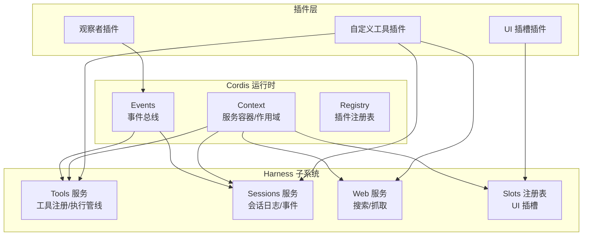
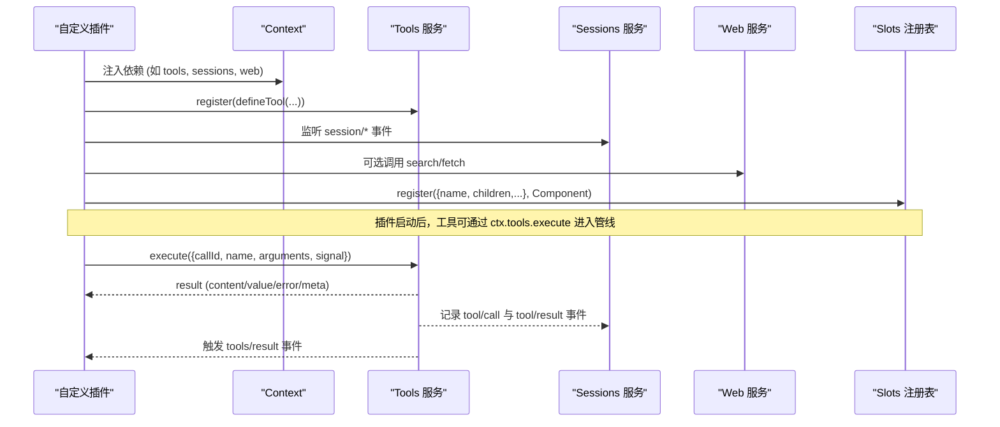
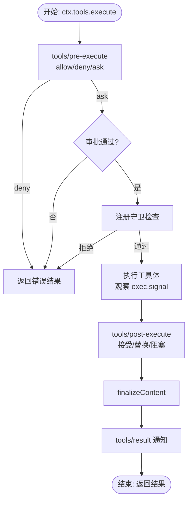
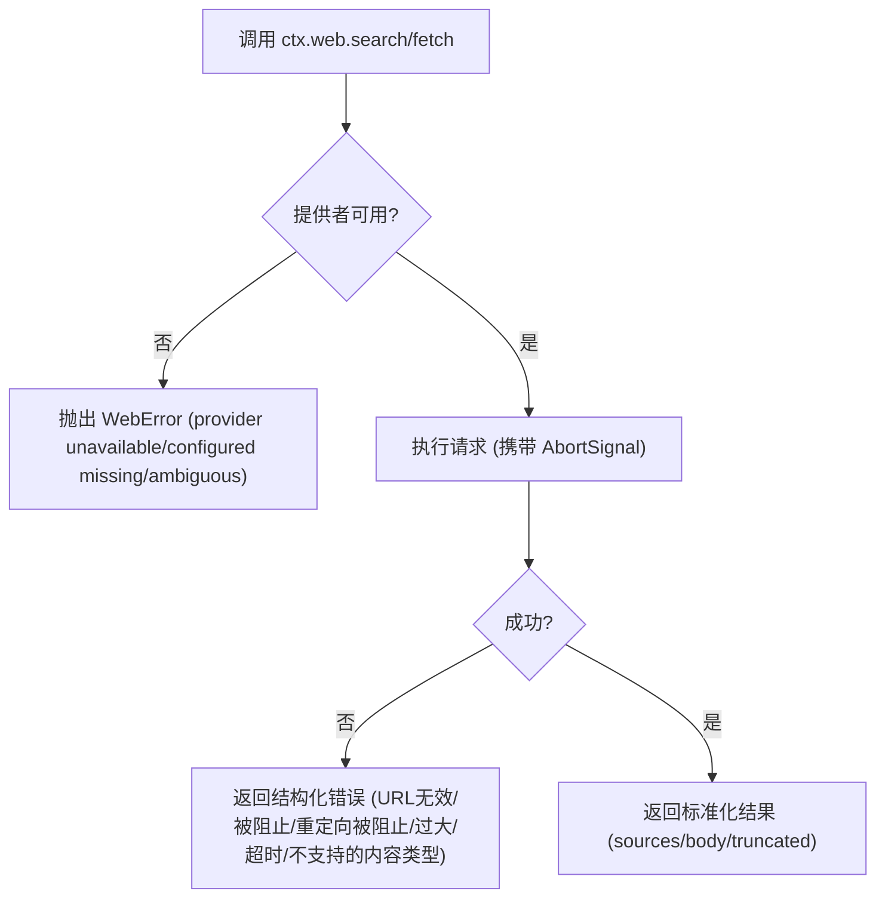
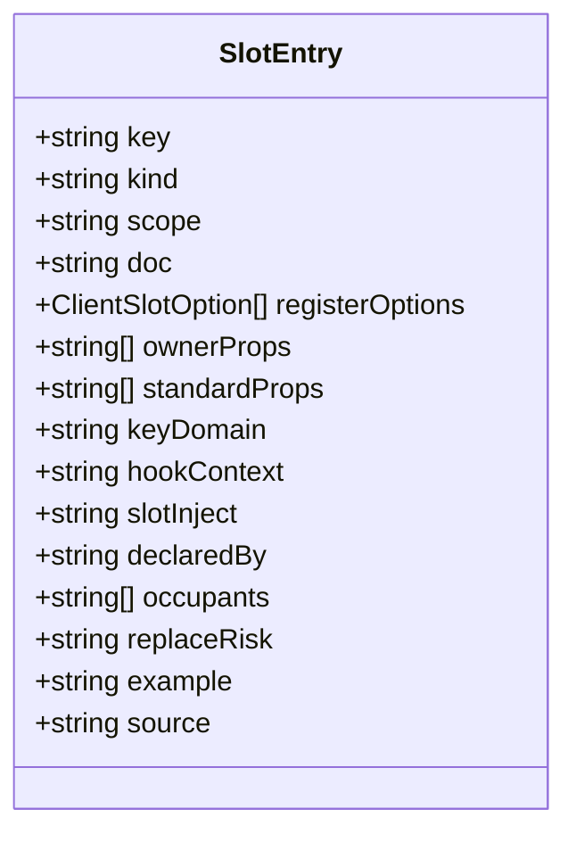
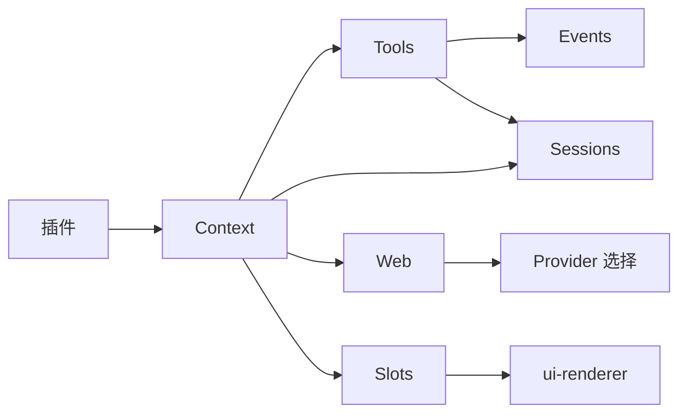

# 集成Harness

<cite>
**本文引用的文件**
- [07-into-the-harness.md](file://docs/cordis-tutorial/07-into-the-harness.md)
- [service.md](file://docs/cordis-api/service.md)
- [context.md](file://docs/cordis-api/context.md)
- [events.md](file://docs/cordis-api/events.md)
- [tools.md](file://docs/subsystems/tools.md)
- [session.md](file://docs/subsystems/session.md)
- [web.md](file://docs/subsystems/web.md)
- [slots.md](file://docs/subsystems/slots.md)
- [README.md](file://examples/node_modules/@deepseek-ai/dsh-tools/README.md)
- [guard.ts](file://packages/extensions/cordis-host-runner/src/guard.ts)
- [client/slot-catalog.ts](file://packages/extensions/cordis-client-runner/src/client/slot-catalog.ts)
- [registry.ts](file://packages/client/ui-renderer/src/client/registry.ts)
</cite>

## 目录
1. [简介](#简介)
2. [项目结构](#项目结构)
3. [核心组件](#核心组件)
4. [架构总览](#架构总览)
5. [详细组件分析](#详细组件分析)
6. [依赖关系分析](#依赖关系分析)
7. [性能与并发](#性能与并发)
8. [故障排查指南](#故障排查指南)
9. [结论](#结论)
10. [附录：完整插件示例与部署实践](#附录完整插件示例与部署实践)

## 简介
本指南面向希望将自定义 Cordis 插件集成到 DeepSeek Harness 的开发者。内容覆盖：
- 通过工具注册将自定义能力暴露给模型调用
- 使用会话服务进行状态管理与事件驱动交互
- 访问 Harness 提供的 API（工具、会话、Web 等）
- 处理异步操作、取消与错误状态
- 在 Web 界面中注册 UI 组件并响应事件
- 提供端到端示例与部署最佳实践（版本管理、兼容性）

## 项目结构
DeepSeek Harness 采用插件化架构，Cordis 作为底层插件框架，提供上下文、服务、事件与生命周期管理；各子系统（工具、会话、Web、Slots 等）以可插拔方式组合。插件通过声明依赖、注册服务/工具、监听事件来扩展系统行为。



图表来源
- [context.md:1-163](file://docs/cordis-api/context.md#L1-L163)
- [events.md:1-208](file://docs/cordis-api/events.md#L1-L208)
- [tools.md:470-721](file://docs/subsystems/tools.md#L470-L721)
- [session.md:668-800](file://docs/subsystems/session.md#L668-L800)
- [web.md:141-207](file://docs/subsystems/web.md#L141-L207)
- [slots.md:1-75](file://docs/subsystems/slots.md#L1-L75)

章节来源
- [context.md:1-163](file://docs/cordis-api/context.md#L1-L163)
- [events.md:1-208](file://docs/cordis-api/events.md#L1-L208)

## 核心组件
- Context：插件运行时的依赖容器与作用域，提供 extend/isolate/intercept 等能力，混入事件、日志、反射、注册表等。
- Services：基于 Context 的服务基类，按名称注册到 ctx，随 Fiber 生命周期自动管理。
- Events：统一的事件分发模式（emit/parallel/serial/bail/waterfall），支持作用域过滤与顺序控制。
- Tools：工具注册与执行管线，包含 pre-execute、guards、execute、post-execute、result 等阶段，支持超时、并行安全标记、UI 呈现意图。
- Sessions：事件溯源的会话日志，所有消息历史由事件派生，提供创建、查询、分页、远程接口等。
- Web：可选的网络能力，封装搜索与抓取，提供提供者选择与错误分类。
- Slots：Web Client 的 UI 插槽系统，插件通过 ctx.slots.register 贡献组件，受 SlotMap 类型约束。

章节来源
- [service.md:1-103](file://docs/cordis-api/service.md#L1-L103)
- [context.md:1-163](file://docs/cordis-api/context.md#L1-L163)
- [events.md:1-208](file://docs/cordis-api/events.md#L1-L208)
- [tools.md:1-172](file://docs/subsystems/tools.md#L1-L172)
- [session.md:1-145](file://docs/subsystems/session.md#L1-L145)
- [web.md:1-140](file://docs/subsystems/web.md#L1-L140)
- [slots.md:1-75](file://docs/subsystems/slots.md#L1-L75)

## 架构总览
下图展示了插件如何通过 Context 接入 Harness 的核心服务，并在工具执行管线与会话日志中产生可观测效果。



图表来源
- [tools.md:470-721](file://docs/subsystems/tools.md#L470-L721)
- [session.md:668-800](file://docs/subsystems/session.md#L668-L800)
- [web.md:141-207](file://docs/subsystems/web.md#L141-L207)
- [slots.md:1-75](file://docs/subsystems/slots.md#L1-L75)

## 详细组件分析

### 工具注册与执行管线
- 定义工具：使用 defineTool 声明参数 schema、输出 schema、render/presentationMeta 以及 execute。
- 注册工具：ctx.tools.register(...) 将工具加入当前作用域或全局，schemas() 仅暴露模型可见字段。
- 执行流程：pre-execute（允许/拒绝/询问）→ guards（单调守卫）→ execute（around-dispatch）→ post-execute（替换/阻塞/附加上下文）→ finalizeContent → result（最终不可变结果）。
- 取消与超时：exec.signal 必须被工具体观察；timeoutMs 为声明式预算，需配合策略包装器生效。
- 错误处理：未知工具、抛出异常、非 JSON 输出等均转为结构化错误，不会中断 turn。



图表来源
- [tools.md:170-405](file://docs/subsystems/tools.md#L170-L405)
- [tools.md:470-721](file://docs/subsystems/tools.md#L470-L721)

章节来源
- [tools.md:1-172](file://docs/subsystems/tools.md#L1-L172)
- [tools.md:470-721](file://docs/subsystems/tools.md#L470-L721)
- [README.md:25-131](file://examples/node_modules/@deepseek-ai/dsh-tools/README.md#L25-L131)

### 会话管理与事件
- 会话是追加型事件日志，所有消息历史由事件派生。
- 关键事件：turn/start/end、step/start/end、user/message、assistant/message、tool/call、tool/result、request/header/context、session/end-seed。
- 插件可监听 session/* 事件，或在工具执行后通过工具结果事件参与会话展示。
- 远程接口：list/search/create/selectModel/modelCatalog/openWorkspacePath/rename/fork/prompt/page/cancel 等。

```mermaid
sequenceDiagram
participant Loop as "Agent 循环"
participant Tools as "Tools 服务"
participant Sess as "Sessions 服务"
participant Plugin as "插件"
Loop->>Tools : execute(tool call)
Tools-->>Sess : 写入 tool/call
Tools-->>Sess : 写入 tool/result
Sess-->>Plugin : 事件回调 (on('session/...'))
Plugin-->>Loop : 可选附加上下文/反馈
```

图表来源
- [session.md:1-145](file://docs/subsystems/session.md#L1-L145)
- [session.md:668-800](file://docs/subsystems/session.md#L668-L800)

章节来源
- [session.md:1-145](file://docs/subsystems/session.md#L1-L145)
- [session.md:668-800](file://docs/subsystems/session.md#L668-L800)

### Web 能力集成
- ctx.web 提供 search/fetch 两个操作，提供者选择基于配置与可用性。
- 错误分类：WEB_PROVIDER_*、WEB_INVALID_URL、WEB_BLOCKED_URL、WEB_REDIRECT_BLOCKED、WEB_FETCH_TOO_LARGE、WEB_FETCH_TIMEOUT、WEB_UNSUPPORTED_CONTENT_TYPE。
- 网络策略：HTTP(S) 白名单、地址校验、重定向限制、大小/字符/时间上限。



图表来源
- [web.md:121-140](file://docs/subsystems/web.md#L121-L140)
- [web.md:141-207](file://docs/subsystems/web.md#L141-L207)

章节来源
- [web.md:1-140](file://docs/subsystems/web.md#L1-L140)
- [web.md:141-207](file://docs/subsystems/web.md#L141-L207)

### Web 界面与插槽（Slots）
- 插件通过 ctx.slots.register 贡献 UI，受 SlotMap 类型约束（kind/scope/owner props/store/inject/locale/select）。
- root 是唯一内建插槽，ui-renderer 渲染根节点，其他插槽由声明它们的父 entry 渲染。
- 客户端插槽条目描述 key/kind/scope/doc/registerOptions/ownerProps/standardProps/keyDomain/hookContext/slotInject/declaredBy/occupants/replaceRisk/example/source。



图表来源
- [client/slot-catalog.ts:29-65](file://packages/extensions/cordis-client-runner/src/client/slot-catalog.ts#L29-L65)
- [slots.md:1-75](file://docs/subsystems/slots.md#L1-L75)
- [registry.ts:602-613](file://packages/client/ui-renderer/src/client/registry.ts#L602-L613)

章节来源
- [slots.md:1-75](file://docs/subsystems/slots.md#L1-L75)
- [client/slot-catalog.ts:29-65](file://packages/extensions/cordis-client-runner/src/client/slot-catalog.ts#L29-L65)
- [registry.ts:602-613](file://packages/client/ui-renderer/src/client/registry.ts#L602-L613)

### 异步操作与错误状态
- 取消：exec.signal 必须被工具体观察；取消发生在调度前为 ABORTED_BEFORE_DISPATCH，之后替换成功结果为 ABORTED。
- 超时：timeoutMs 为声明式预算，需配合策略包装器；clampTimeout 用于统一校验与上限。
- 错误：工具失败、未知工具、非 JSON 输出均转为结构化错误；Web 错误按 seam 分类；Remote 边界将 abort 映射为 gateway/cancelled。

章节来源
- [tools.md:170-405](file://docs/subsystems/tools.md#L170-L405)
- [web.md:121-140](file://docs/subsystems/web.md#L121-L140)
- [guard.ts:542-592](file://packages/extensions/cordis-host-runner/src/guard.ts#L542-L592)

## 依赖关系分析
- 插件依赖 Context 获取 services（tools/sessions/web/slots）。
- Tools 依赖事件总线（tools/*）与 Session 持久化（tool/call、tool/result）。
- Web 依赖提供者注册与选择策略，错误分类跨 seam。
- Slots 依赖 SlotMap 编译期声明与 ui-renderer 运行时绑定。



图表来源
- [context.md:1-163](file://docs/cordis-api/context.md#L1-L163)
- [tools.md:470-721](file://docs/subsystems/tools.md#L470-L721)
- [session.md:668-800](file://docs/subsystems/session.md#L668-L800)
- [web.md:141-207](file://docs/subsystems/web.md#L141-L207)
- [slots.md:1-75](file://docs/subsystems/slots.md#L1-L75)

章节来源
- [context.md:1-163](file://docs/cordis-api/context.md#L1-L163)
- [tools.md:470-721](file://docs/subsystems/tools.md#L470-L721)
- [session.md:668-800](file://docs/subsystems/session.md#L668-L800)
- [web.md:141-207](file://docs/subsystems/web.md#L141-L207)
- [slots.md:1-75](file://docs/subsystems/slots.md#L1-L75)

## 性能与并发
- 工具并行：executionMode 可将独立只读调用合并为并行组；exclusive 形成顺序屏障。
- 取消与超时：exec.signal 贯穿管线；timeoutMs 需策略包装器；clampTimeout 统一校验。
- 会话日志：append-only，派生历史缓存，避免重复计算。
- Web 请求：maxResults 截断、重定向限制、大小/时间上限，避免资源耗尽。

章节来源
- [tools.md:243-255](file://docs/subsystems/tools.md#L243-L255)
- [tools.md:170-405](file://docs/subsystems/tools.md#L170-L405)
- [web.md:121-140](file://docs/subsystems/web.md#L121-L140)

## 故障排查指南
- 工具未找到：UNKNOWN_TOOL，检查工具名与可见性（restrict/get/schemas）。
- 参数不合法：ToolArgsError，检查 defineTool 参数 schema 与 required。
- 输出不合法：ToolOutputError，检查 output.schema 与 render/presentationMeta。
- 审批拒绝：tools/pre-execute 返回 deny/ask 未通过，检查审批服务。
- 网络错误：WebError 分类，检查 URL、重定向、内容类型、超时。
- 取消：AbortSignal 触发，确认工具体正确观察信号。

章节来源
- [tools.md:170-405](file://docs/subsystems/tools.md#L170-L405)
- [web.md:121-140](file://docs/subsystems/web.md#L121-L140)
- [guard.ts:542-592](file://packages/extensions/cordis-host-runner/src/guard.ts#L542-L592)

## 结论
通过 Cordis 插件机制，开发者可以灵活地将自定义工具、UI 与业务逻辑集成到 Harness。借助工具管线、会话日志与 Web 能力，插件既能与模型交互，又能提供丰富的用户界面与可观测性。遵循取消、超时、错误分类与插槽类型约束，可实现稳定、可维护且高性能的集成方案。

## 附录：完整插件示例与部署实践

### 后端：工具插件（注册与执行）
- 使用 defineTool 声明工具，注册到 ctx.tools。
- 在 apply(ctx) 中监听 tools/result 或其他事件，完成日志或后续动作。
- 通过 ctx.sessions 订阅会话事件，实现状态同步。

参考路径
- [07-into-the-harness.md:7-96](file://docs/cordis-tutorial/07-into-the-harness.md#L7-L96)
- [tools.md:470-721](file://docs/subsystems/tools.md#L470-L721)
- [session.md:668-800](file://docs/subsystems/session.md#L668-L800)

### 前端：UI 插槽插件（注册与事件）
- 在 SlotMap 中声明插槽键与基数（single/list/keyed/chain）、作用域（root/session/session-maybe）。
- 使用 ctx.slots.register 注册组件，接收 owner props、store、inject、locale 等输入。
- 通过 slots.renderSlot/renderSlotChain 渲染子插槽，确保生命周期与声明一致。

参考路径
- [slots.md:1-75](file://docs/subsystems/slots.md#L1-L75)
- [client/slot-catalog.ts:29-65](file://packages/extensions/cordis-client-runner/src/client/slot-catalog.ts#L29-L65)
- [registry.ts:602-613](file://packages/client/ui-renderer/src/client/registry.ts#L602-L613)

### 异步与错误处理最佳实践
- 始终传递并观察 exec.signal，确保工具体可取消。
- 使用 timeoutMs 声明预算，并配合策略包装器执行超时控制。
- 对 Web 请求设置 maxResults 与超时，捕获并分类 WebError。
- 在 post-execute 中替换 content/value 或 block 以提供纠正反馈。

参考路径
- [tools.md:170-405](file://docs/subsystems/tools.md#L170-L405)
- [web.md:121-140](file://docs/subsystems/web.md#L121-L140)
- [README.md:119-131](file://examples/node_modules/@deepseek-ai/dsh-tools/README.md#L119-L131)

### 部署与分发
- 版本管理：插件与服务契约（schema、event types、slot keys）变更需保持向后兼容；通过 restrict/get/schemas 控制可见性。
- 兼容性：PTC 模式需要 codeRuntime 语言注册 SDK 渲染器；providers 选择依赖配置与可用性。
- 组合与 HMR：通过 composition patch 叠加插件，利用 isolate/extend/intercept 隔离作用域与配置。

参考路径
- [tools.md:62-74](file://docs/subsystems/tools.md#L62-L74)
- [web.md:121-140](file://docs/subsystems/web.md#L121-L140)
- [context.md:14-96](file://docs/cordis-api/context.md#L14-L96)