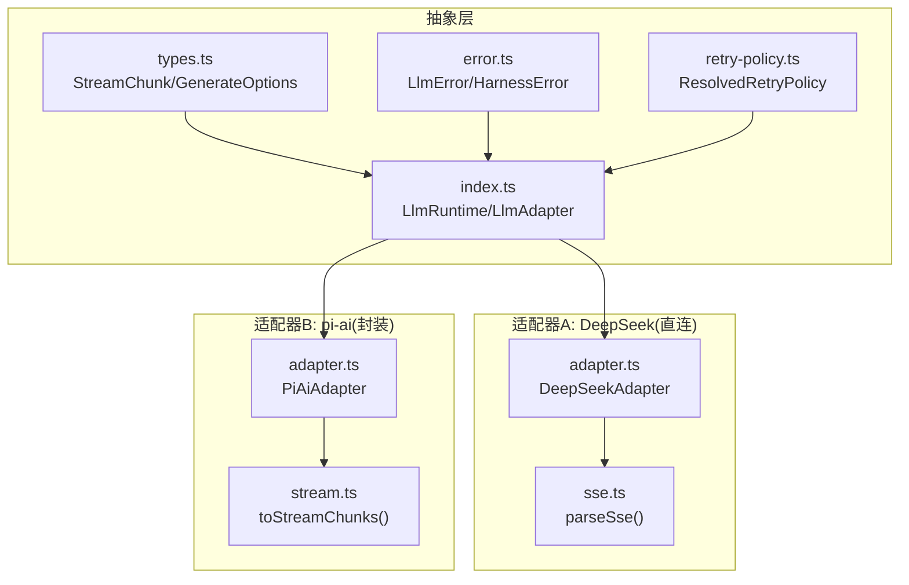
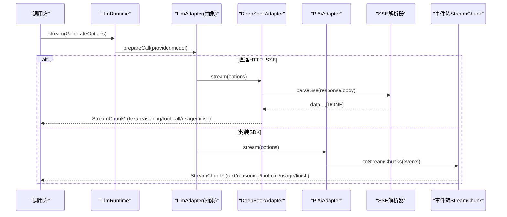
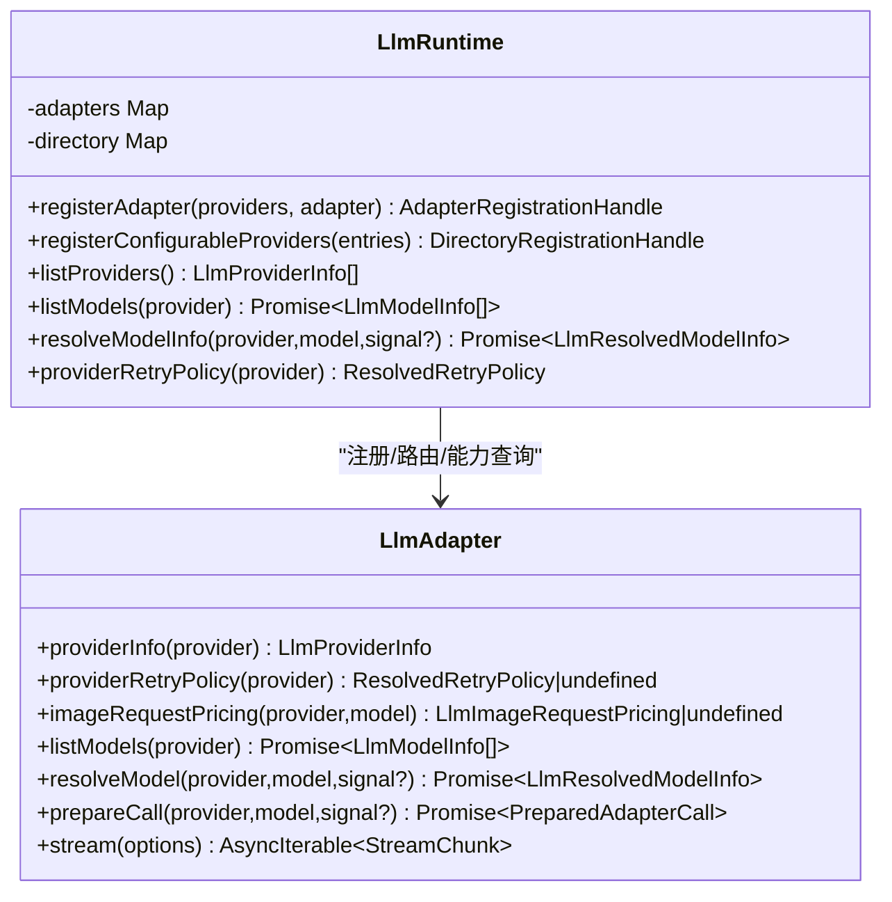
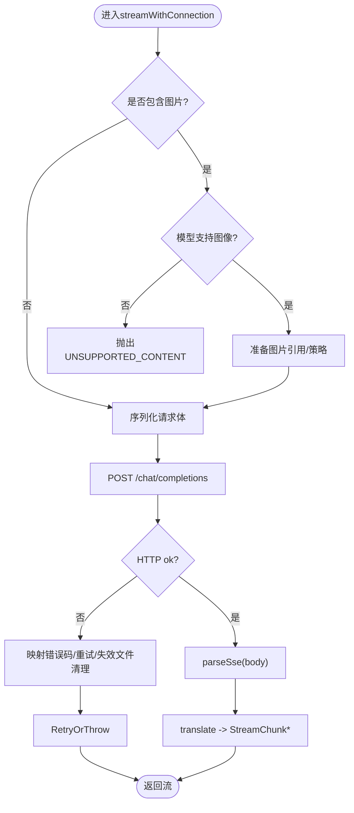
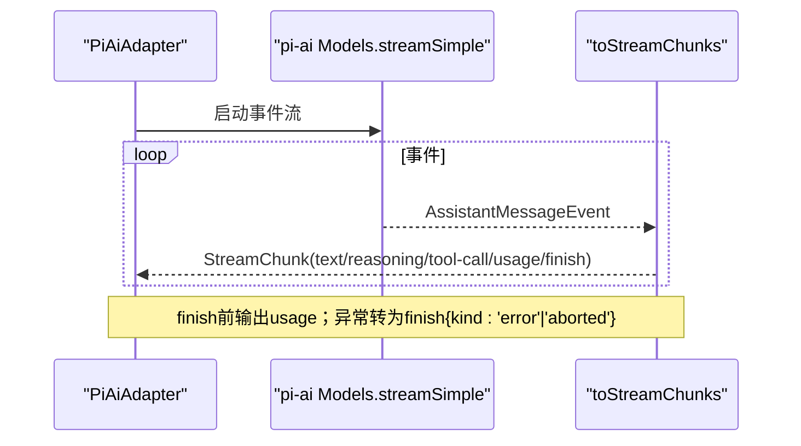
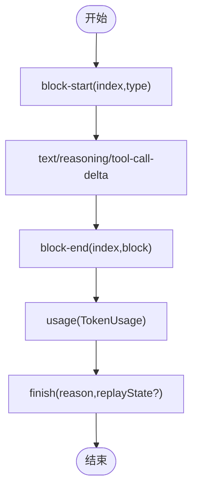
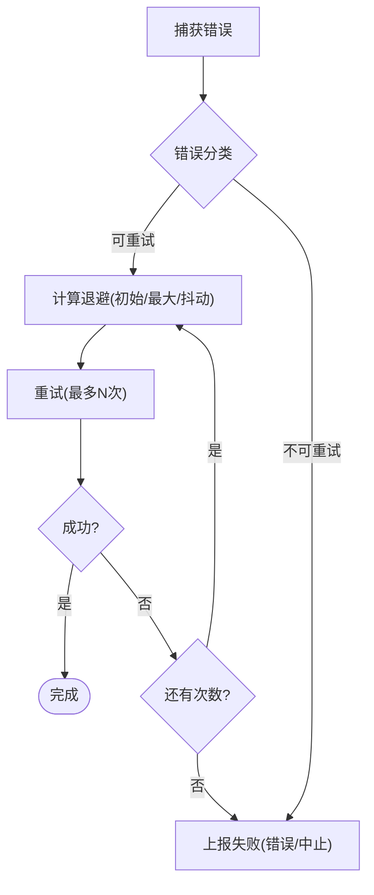
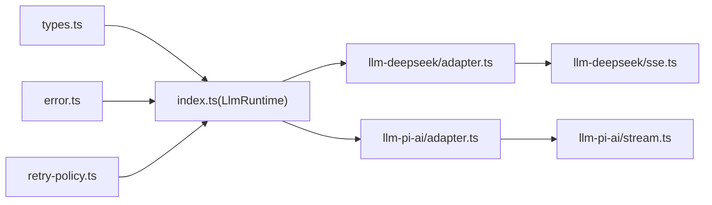
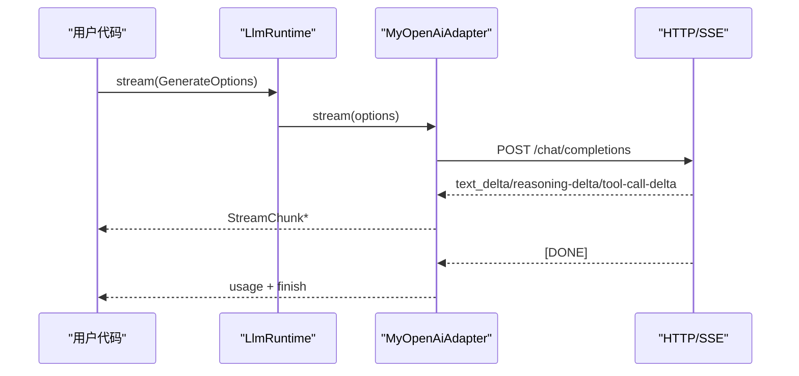

# LLM适配器开发

<cite>
**本文引用的文件**
- [packages/llm/llm/src/types.ts](file://packages/llm/llm/src/types.ts)
- [packages/llm/llm/src/index.ts](file://packages/llm/llm/src/index.ts)
- [packages/llm/llm/src/error.ts](file://packages/llm/llm/src/error.ts)
- [packages/llm/llm/src/retry-policy.ts](file://packages/llm/llm/src/retry-policy.ts)
- [packages/llm/llm-deepseek/src/adapter.ts](file://packages/llm/llm-deepseek/src/adapter.ts)
- [packages/llm/llm-deepseek/src/sse.ts](file://packages/llm/llm-deepseek/src/sse.ts)
- [packages/llm/llm-pi-ai/src/adapter.ts](file://packages/llm/llm-pi-ai/src/adapter.ts)
- [packages/llm/llm-pi-ai/src/stream.ts](file://packages/llm/llm-pi-ai/src/stream.ts)
- [docs/cookbook/adding-an-llm-adapter.md](file://docs/cookbook/adding-an-llm-adapter.md)
- [docs/subsystems/llm-streaming.md](file://docs/subsystems/llm-streaming.md)
</cite>

## 目录
1. [简介](#简介)
2. [项目结构](#项目结构)
3. [核心组件](#核心组件)
4. [架构总览](#架构总览)
5. [详细组件分析](#详细组件分析)
6. [依赖关系分析](#依赖关系分析)
7. [性能与监控](#性能与监控)
8. [故障排查指南](#故障排查指南)
9. [结论](#结论)
10. [附录：完整示例与最佳实践](#附录完整示例与最佳实践)

## 简介
本指南面向希望为不同LLM提供商（如OpenAI兼容接口、Anthropic等）实现适配器的开发者。内容涵盖：
- 如何实现统一的LLM适配器接口，包括模型调用、流式响应处理、错误处理机制
- 适配模式与差异点（直接HTTP+SSE、封装第三方SDK）
- 流式协议约定（token级增量、中断与超时、状态管理）
- 配置管理（API密钥、请求限流、重试策略）
- 性能优化与可观测性（指标、诊断、重试与降级）

## 项目结构
仓库中与LLM适配器相关的关键位置：
- 抽象层与协议定义：packages/llm/llm/src/*（类型、运行时、错误、重试策略）
- 参考实现A（直接HTTP+SSE）：packages/llm/llm-deepseek/src/*
- 参考实现B（封装第三方SDK）：packages/llm/llm-pi-ai/src/*
- 文档与Cookbook：docs/cookbook/adding-an-llm-adapter.md、docs/subsystems/llm-streaming.md

图表来源
- [packages/llm/llm/src/types.ts:370-390](file://packages/llm/llm/src/types.ts#L370-L390)
- [packages/llm/llm/src/index.ts:191-279](file://packages/llm/llm/src/index.ts#L191-L279)
- [packages/llm/llm-deepseek/src/adapter.ts:355-444](file://packages/llm/llm-deepseek/src/adapter.ts#L355-L444)
- [packages/llm/llm-deepseek/src/sse.ts:28-40](file://packages/llm/llm-deepseek/src/sse.ts#L28-L40)
- [packages/llm/llm-pi-ai/src/adapter.ts:240-344](file://packages/llm/llm-pi-ai/src/adapter.ts#L240-L344)
- [packages/llm/llm-pi-ai/src/stream.ts:141-233](file://packages/llm/llm-pi-ai/src/stream.ts#L141-L233)

章节来源
- [packages/llm/llm/src/types.ts:370-390](file://packages/llm/llm/src/types.ts#L370-L390)
- [packages/llm/llm/src/index.ts:191-279](file://packages/llm/llm/src/index.ts#L191-L279)
- [docs/cookbook/adding-an-llm-adapter.md:1-44](file://docs/cookbook/adding-an-llm-adapter.md#L1-L44)

## 核心组件
- StreamChunk协议：适配器必须按此协议输出块开始、增量、结束、用量统计与完成原因；工具参数保持原始JSON字符串；在finish之前输出usage，finish之后不得再输出任何内容。
- GenerateOptions：一次模型调用的完整输入，包含provider、model、messages、system、tools、采样参数、stop序列、AbortSignal、会话标识与用途标记。
- LlmAdapter抽象类：提供providerInfo、listModels、resolveModel、prepareCall、imageRequestPricing、providerRetryPolicy等扩展点，并强制实现stream(options)。
- LlmRuntime：注册适配器、路由选择、重试策略注入、模型发现、可配置提供者目录等运行时能力。
- 错误体系：LlmError/HarnessError统一错误码与结构化失败信息，便于上层重试与诊断。
- 重试策略：支持normal与always两种模式，含退避与抖动配置，默认对特定错误码进行有限重试。

章节来源
- [packages/llm/llm/src/types.ts:370-444](file://packages/llm/llm/src/types.ts#L370-L444)
- [packages/llm/llm/src/index.ts:191-279](file://packages/llm/llm/src/index.ts#L191-L279)
- [packages/llm/llm/src/error.ts:1-164](file://packages/llm/llm/src/error.ts#L1-L164)
- [packages/llm/llm/src/retry-policy.ts:1-196](file://packages/llm/llm/src/retry-policy.ts#L1-L196)

## 架构总览
下图展示从调用方到具体适配器的端到端流程，以及流式数据如何被转换为统一的StreamChunk。

图表来源
- [packages/llm/llm/src/index.ts:191-279](file://packages/llm/llm/src/index.ts#L191-L279)
- [packages/llm/llm-deepseek/src/adapter.ts:442-522](file://packages/llm/llm-deepseek/src/adapter.ts#L442-L522)
- [packages/llm/llm-deepseek/src/sse.ts:28-40](file://packages/llm/llm-deepseek/src/sse.ts#L28-L40)
- [packages/llm/llm-pi-ai/src/adapter.ts:342-440](file://packages/llm/llm-pi-ai/src/adapter.ts#L342-L440)
- [packages/llm/llm-pi-ai/src/stream.ts:141-233](file://packages/llm/llm-pi-ai/src/stream.ts#L141-L233)

## 详细组件分析

### 适配器基类与运行时
- LlmAdapter：定义provider元信息、模型列表、模型能力解析、图片请求定价、重试策略暴露点，以及必须实现的stream方法。
- LlmRuntime：负责适配器注册、路由冲突检测、可配置提供者目录、模型发现、重试策略注入与校验、以及对外暴露的listProviders/listModels/resolveModelInfo等能力。

图表来源
- [packages/llm/llm/src/index.ts:191-279](file://packages/llm/llm/src/index.ts#L191-L279)
- [packages/llm/llm/src/index.ts:330-531](file://packages/llm/llm/src/index.ts#L330-L531)

章节来源
- [packages/llm/llm/src/index.ts:191-279](file://packages/llm/llm/src/index.ts#L191-L279)
- [packages/llm/llm/src/index.ts:330-531](file://packages/llm/llm/src/index.ts#L330-L531)

### 直连HTTP+SSE适配器（DeepSeek）
- 职责：构造请求头与体、处理图片附件（Files API或base64回退）、SSE流解析、将provider事件翻译为StreamChunk、错误映射与重试后处理。
- 关键点：
  - 使用idleWatchdog保护流读取空闲超时，统一映射为TIMEOUT。
  - 通过parseSse消费[Done]终止符，未收到则抛出STREAM_CLOSED。
  - 错误分类：AUTH、RATE_LIMIT、CONTEXT_WINDOW_EXCEEDED、QUOTA、SERVER、INVALID_REQUEST等。
  - 图片请求：优先Files API，失败回退base64；超限按策略裁剪。

图表来源
- [packages/llm/llm-deepseek/src/adapter.ts:446-709](file://packages/llm/llm-deepseek/src/adapter.ts#L446-L709)
- [packages/llm/llm-deepseek/src/sse.ts:28-40](file://packages/llm/llm-deepseek/src/sse.ts#L28-L40)

章节来源
- [packages/llm/llm-deepseek/src/adapter.ts:355-709](file://packages/llm/llm-deepseek/src/adapter.ts#L355-L709)
- [packages/llm/llm-deepseek/src/sse.ts:28-40](file://packages/llm/llm-deepseek/src/sse.ts#L28-L40)

### 封装SDK适配器（pi-ai）
- 职责：基于第三方SDK的事件流，将其转换为StreamChunk；处理推理级别、图片输入、会话头、停止原因映射等。
- 关键点：
  - 通过createModels构建不可变快照，避免配置变更影响进行中请求。
  - 将tool-call的解析对象在block-end时重新序列化为原始JSON字符串。
  - 错误分类：AUTH、QUOTA、RATE_LIMIT、INVALID_REQUEST、SERVER、TIMEOUT、TRANSPORT等。
  - 空响应与上下文溢出识别，映射为EMPTY_RESPONSE与CONTEXT_WINDOW_EXCEEDED。

图表来源
- [packages/llm/llm-pi-ai/src/adapter.ts:342-440](file://packages/llm/llm-pi-ai/src/adapter.ts#L342-L440)
- [packages/llm/llm-pi-ai/src/stream.ts:141-233](file://packages/llm/llm-pi-ai/src/stream.ts#L141-L233)

章节来源
- [packages/llm/llm-pi-ai/src/adapter.ts:240-440](file://packages/llm/llm-pi-ai/src/adapter.ts#L240-L440)
- [packages/llm/llm-pi-ai/src/stream.ts:141-233](file://packages/llm/llm-pi-ai/src/stream.ts#L141-L233)

### 流式协议与状态管理
- 协议约定：
  - usage必须在finish之前输出；finish之后不得输出任何内容。
  - 工具调用arguments始终为原始JSON字符串；增量以argumentsDelta形式传输。
  - block index按首次出现顺序分配，同一块的所有delta复用该index。
  - 错误两条路径：throw LlmError（传输/协议错误），或在finish中携带failure（provider内联错误）。
  - 必须尊重options.signal；不支持的选项应抛出不支持的错误而非静默丢弃。
  - 成功finish可携带replayState用于历史重放。

图表来源
- [packages/llm/llm/src/types.ts:370-390](file://packages/llm/llm/src/types.ts#L370-L390)
- [docs/subsystems/llm-streaming.md:167-218](file://docs/subsystems/llm-streaming.md#L167-L218)

章节来源
- [packages/llm/llm/src/types.ts:370-390](file://packages/llm/llm/src/types.ts#L370-L390)
- [docs/subsystems/llm-streaming.md:167-218](file://docs/subsystems/llm-streaming.md#L167-L218)

### 错误处理与重试
- 错误体系：
  - HarnessError/LlmError提供稳定code与结构化failure，便于上层重试与诊断。
  - 上下文溢出与配额耗尽有专用识别函数与常量。
- 重试策略：
  - normal模式：有限次重试，仅对指定错误码重试，带指数退避与抖动。
  - always模式：无限重试直到成功/取消/释放。
  - 默认对EMPTY_RESPONSE、RATE_LIMIT、SERVER、TIMEOUT、TRANSPORT等可重试。

图表来源
- [packages/llm/llm/src/error.ts:1-164](file://packages/llm/llm/src/error.ts#L1-L164)
- [packages/llm/llm/src/retry-policy.ts:1-196](file://packages/llm/llm/src/retry-policy.ts#L1-L196)

章节来源
- [packages/llm/llm/src/error.ts:1-164](file://packages/llm/llm/src/error.ts#L1-L164)
- [packages/llm/llm/src/retry-policy.ts:1-196](file://packages/llm/llm/src/retry-policy.ts#L1-L196)

## 依赖关系分析
- 抽象层依赖：types定义协议，index提供运行时与抽象类，error与retry-policy提供错误与重试能力。
- 适配器A依赖：adapter.ts依赖SSE解析与翻译模块，负责HTTP/SSE与业务逻辑。
- 适配器B依赖：adapter.ts依赖SDK与stream.ts，负责事件到协议的转换。
- 运行时与适配器解耦：通过LlmAdapter接口与LlmRuntime注册机制，实现多后端替换与组合。

图表来源
- [packages/llm/llm/src/index.ts:191-279](file://packages/llm/llm/src/index.ts#L191-L279)
- [packages/llm/llm-deepseek/src/adapter.ts:355-444](file://packages/llm/llm-deepseek/src/adapter.ts#L355-L444)
- [packages/llm/llm-pi-ai/src/adapter.ts:240-344](file://packages/llm/llm-pi-ai/src/adapter.ts#L240-L344)

章节来源
- [packages/llm/llm/src/index.ts:191-279](file://packages/llm/llm/src/index.ts#L191-L279)
- [packages/llm/llm-deepseek/src/adapter.ts:355-444](file://packages/llm/llm-deepseek/src/adapter.ts#L355-L444)
- [packages/llm/llm-pi-ai/src/adapter.ts:240-344](file://packages/llm/llm-pi-ai/src/adapter.ts#L240-L344)

## 性能与监控
- 流式空闲超时：两个适配器均使用idleWatchdog保护next()调用，避免长时间无活动导致资源占用。
- 图片请求优化：按像素/字节/数量阈值裁剪与回退策略，减少大请求失败概率。
- 重试与退避：合理设置initialDelayMs、maxDelayMs、jitterRatio，避免雪崩与重复风暴。
- 可观测性：
  - 使用attributionHeaders确保请求可追踪。
  - 记录requestId、status、providerRetryAfterMs等结构化失败信息。
  - 利用BlockAssembler与AssistantStreamAccumulator生成紧凑日志，便于回放与诊断。

章节来源
- [packages/llm/llm-deepseek/src/adapter.ts:446-522](file://packages/llm/llm-deepseek/src/adapter.ts#L446-L522)
- [packages/llm/llm-pi-ai/src/adapter.ts:346-440](file://packages/llm/llm-pi-ai/src/adapter.ts#L346-L440)
- [docs/subsystems/llm-streaming.md:220-228](file://docs/subsystems/llm-streaming.md#L220-L228)

## 故障排查指南
- 常见问题定位：
  - 认证失败：检查API密钥来源与格式，确认attributionHeaders已添加。
  - 速率限制/配额耗尽：根据错误码区分RATE_LIMIT与QUOTA，调整重试策略或申请额度。
  - 上下文溢出：识别CONTEXT_WINDOW_EXCEEDED，压缩历史或降低输入规模。
  - 空响应：EMPTY_RESPONSE视为可重试，检查上游服务健康与负载。
  - 流提前关闭：STREAM_CLOSED表示SSE/事件流未正常结束，检查网络与上游。
- 建议步骤：
  - 查看LlmError.code与failure字段，结合requestId与status定位问题。
  - 检查重试策略配置，必要时临时提升maxRetries或调整backoff。
  - 对于图片请求，验证Files API可用性、base64大小限制与模型模态支持。

章节来源
- [packages/llm/llm/src/error.ts:1-164](file://packages/llm/llm/src/error.ts#L1-L164)
- [packages/llm/llm-deepseek/src/adapter.ts:661-709](file://packages/llm/llm-deepseek/src/adapter.ts#L661-L709)
- [packages/llm/llm-pi-ai/src/stream.ts:42-68](file://packages/llm/llm-pi-ai/src/stream.ts#L42-L68)

## 结论
通过统一的LlmAdapter接口与LlmRuntime运行时，项目实现了多后端LLM适配的解耦与标准化。参考实现展示了两种典型模式：直连HTTP+SSE与封装第三方SDK。遵循StreamChunk协议、错误与重试约定，可实现高可靠、可观测、易扩展的LLM接入层。

## 附录：完整示例与最佳实践

### 从零实现一个REST适配器（OpenAI兼容）
- 步骤概览：
  - 继承LlmAdapter，实现stream(options)，内部发起POST /chat/completions，使用SSE解析器消费data与[Done]。
  - 将provider事件翻译为StreamChunk：文本增量、推理增量、工具调用增量与结束、usage与finish。
  - 错误映射：将HTTP状态与错误体映射为LlmError的稳定code。
  - 支持stop序列、temperature、maxTokens、signal等选项。
  - 注册适配器：ctx.llm.registerAdapter(['my-openai'], new MyOpenAiAdapter(...))。

图表来源
- [packages/llm/llm/src/index.ts:191-279](file://packages/llm/llm/src/index.ts#L191-L279)
- [packages/llm/llm-deepseek/src/sse.ts:28-40](file://packages/llm/llm-deepseek/src/sse.ts#L28-L40)

章节来源
- [docs/cookbook/adding-an-llm-adapter.md:1-44](file://docs/cookbook/adding-an-llm-adapter.md#L1-L44)
- [packages/llm/llm/src/types.ts:370-444](file://packages/llm/llm/src/types.ts#L370-L444)

### 复杂WebSocket适配器（实时流）
- 设计要点：
  - 建立WebSocket连接，订阅消息事件，按StreamChunk协议输出。
  - 维护block index与工具调用ID映射，确保arguments为原始JSON字符串。
  - 处理断线重连、心跳保活、超时与取消信号。
  - 将provider错误映射为finish{kind:'error'|'aborted', failure}。
- 注意事项：
  - 保证usage在finish之前输出。
  - 对不支持的选项抛出UNSUPPORTED_OPTION。
  - 使用replayState保存必要元数据以便后续重放。

章节来源
- [packages/llm/llm/src/types.ts:370-390](file://packages/llm/llm/src/types.ts#L370-L390)
- [docs/subsystems/llm-streaming.md:288-300](file://docs/subsystems/llm-streaming.md#L288-L300)

### 配置管理：API密钥、限流与重试
- API密钥：
  - 通过凭证系统或环境变量注入，使用assertUsableApiKey进行校验。
  - 每个请求从同一快照解析密钥，避免跨配置混用。
- 请求限流：
  - 依据provider重试策略与外部网关限流，合理设置maxRetries与backoff。
- 重试机制：
  - normal模式：针对RATE_LIMIT、SERVER、TIMEOUT、TRANSPORT、EMPTY_RESPONSE等可重试。
  - always模式：适用于需要强一致性的场景，但需配合幂等与去重策略。

章节来源
- [packages/llm/llm/src/index.ts:126-159](file://packages/llm/llm/src/index.ts#L126-L159)
- [packages/llm/llm/src/retry-policy.ts:1-196](file://packages/llm/llm/src/retry-policy.ts#L1-L196)

### 性能优化与监控
- 流式优化：
  - 使用idleWatchdog避免空闲阻塞；及时释放迭代器与AbortController。
  - 图片请求按策略裁剪与回退，减少失败与带宽占用。
- 监控指标：
  - 记录每次调用的provider、model、reasoningEffort、temperature、maxTokens、stop等。
  - 收集usage（input/output/cache/reasoning tokens）与totalTokens。
  - 记录错误码、状态码、providerRetryAfterMs、requestId等结构化信息。

章节来源
- [packages/llm/llm-deepseek/src/adapter.ts:446-522](file://packages/llm/llm-deepseek/src/adapter.ts#L446-L522)
- [packages/llm/llm-pi-ai/src/stream.ts:141-233](file://packages/llm/llm-pi-ai/src/stream.ts#L141-L233)
- [docs/subsystems/llm-streaming.md:328-356](file://docs/subsystems/llm-streaming.md#L328-L356)