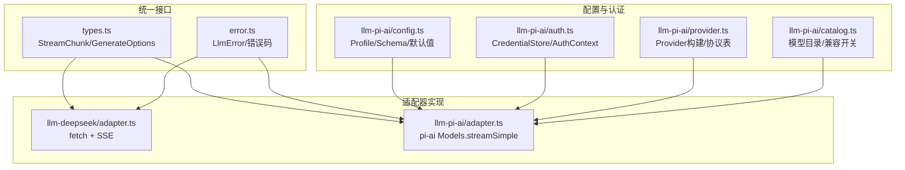
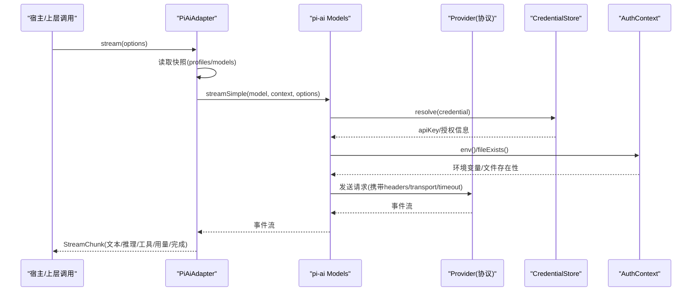
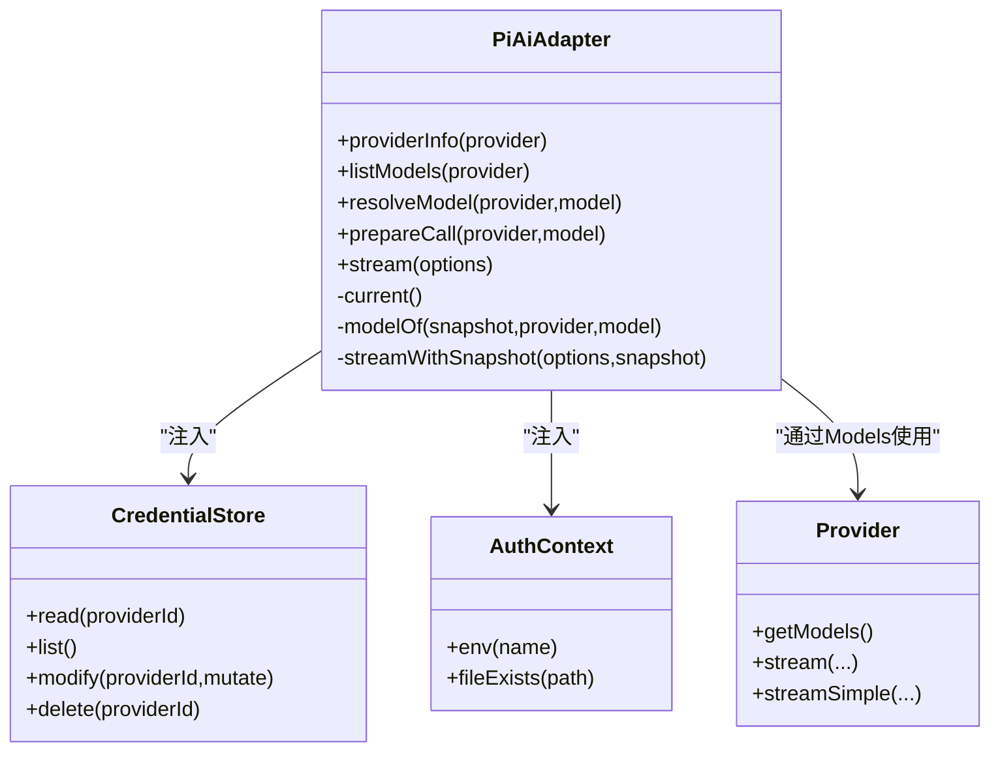
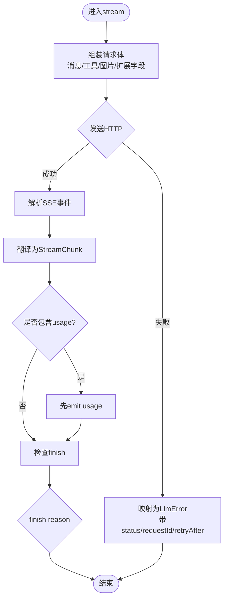
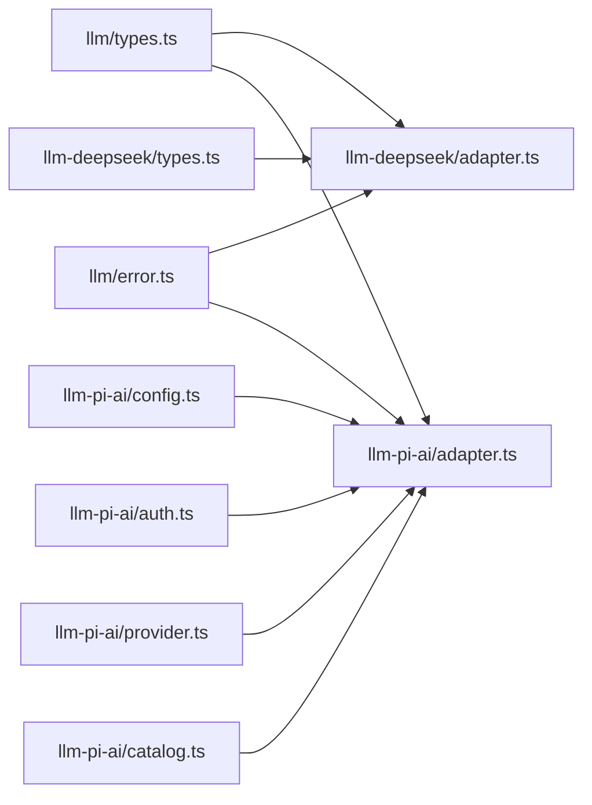

# SDK封装适配器

<cite>
**本文引用的文件**
- [packages/llm/llm/src/types.ts](file://packages/llm/llm/src/types.ts)
- [packages/llm/llm/src/error.ts](file://packages/llm/llm/src/error.ts)
- [packages/llm/llm-deepseek/src/adapter.ts](file://packages/llm/llm-deepseek/src/adapter.ts)
- [packages/llm/llm-deepseek/src/types.ts](file://packages/llm/llm-deepseek/src/types.ts)
- [packages/llm/llm-pi-ai/src/adapter.ts](file://packages/llm/llm-pi-ai/src/adapter.ts)
- [packages/llm/llm-pi-ai/src/config.ts](file://packages/llm/llm-pi-ai/src/config.ts)
- [packages/llm/llm-pi-ai/src/auth.ts](file://packages/llm/llm-pi-ai/src/auth.ts)
- [packages/llm/llm-pi-ai/src/provider.ts](file://packages/llm/llm-pi-ai/src/provider.ts)
- [packages/llm/llm-pi-ai/src/catalog.ts](file://packages/llm/llm-pi-ai/src/catalog.ts)
- [docs/cookbook/adding-an-llm-adapter.md](file://docs/cookbook/adding-an-llm-adapter.md)
</cite>

## 目录
1. [简介](#简介)
2. [项目结构](#项目结构)
3. [核心组件](#核心组件)
4. [架构总览](#架构总览)
5. [详细组件分析](#详细组件分析)
6. [依赖关系分析](#依赖关系分析)
7. [性能考量](#性能考量)
8. [故障排查指南](#故障排查指南)
9. [结论](#结论)
10. [附录：为新SDK提供商创建适配器的完整示例](#附录：为新sdk提供商创建适配器的完整示例)

## 简介
本文件面向“使用官方SDK的适配器”实现模式，聚焦于PI-AI等通过SDK封装的LLM适配器。内容涵盖：
- SDK初始化与客户端封装（以pi-ai为例）
- 错误处理转换（将SDK异常映射为统一的LlmError）
- 将SDK特有功能与限制映射到统一LLM接口（流式协议、工具调用、推理能力、图片输入等）
- SDK版本管理与兼容性处理（协议表、兼容开关、目录模型合并）
- SDK特有的认证方式、配置选项与扩展机制
- 与直接HTTP调用的差异与选择标准
- 为新SDK提供商创建适配器的步骤与要点

## 项目结构
围绕LLM适配的核心由三层组成：
- 统一接口层：定义Provider/Model/StreamChunk/GenerateOptions等契约
- 适配器实现层：两种典型路径
  - 直接HTTP+SSE：DeepSeek适配器
  - SDK封装：PI-AI适配器（基于@earendil-works/pi-ai）
- 配置与认证层：配置校验、模型目录、认证桥接、提供者构建

图表来源
- [packages/llm/llm/src/types.ts:370-390](file://packages/llm/llm/src/types.ts#L370-L390)
- [packages/llm/llm/src/error.ts:1-40](file://packages/llm/llm/src/error.ts#L1-L40)
- [packages/llm/llm-deepseek/src/adapter.ts:355-444](file://packages/llm/llm-deepseek/src/adapter.ts#L355-L444)
- [packages/llm/llm-pi-ai/src/adapter.ts:240-344](file://packages/llm/llm-pi-ai/src/adapter.ts#L240-L344)
- [packages/llm/llm-pi-ai/src/config.ts:87-223](file://packages/llm/llm-pi-ai/src/config.ts#L87-L223)
- [packages/llm/llm-pi-ai/src/auth.ts:141-186](file://packages/llm/llm-pi-ai/src/auth.ts#L141-L186)
- [packages/llm/llm-pi-ai/src/provider.ts:167-192](file://packages/llm/llm-pi-ai/src/provider.ts#L167-L192)
- [packages/llm/llm-pi-ai/src/catalog.ts:797-800](file://packages/llm/llm-pi-ai/src/catalog.ts#L797-L800)

章节来源
- [packages/llm/llm/src/types.ts:370-390](file://packages/llm/llm/src/types.ts#L370-L390)
- [packages/llm/llm/src/error.ts:1-40](file://packages/llm/llm/src/error.ts#L1-L40)
- [packages/llm/llm-deepseek/src/adapter.ts:355-444](file://packages/llm/llm-deepseek/src/adapter.ts#L355-L444)
- [packages/llm/llm-pi-ai/src/adapter.ts:240-344](file://packages/llm/llm-pi-ai/src/adapter.ts#L240-L344)
- [packages/llm/llm-pi-ai/src/config.ts:87-223](file://packages/llm/llm-pi-ai/src/config.ts#L87-L223)
- [packages/llm/llm-pi-ai/src/auth.ts:141-186](file://packages/llm/llm-pi-ai/src/auth.ts#L141-L186)
- [packages/llm/llm-pi-ai/src/provider.ts:167-192](file://packages/llm/llm-pi-ai/src/provider.ts#L167-L192)
- [packages/llm/llm-pi-ai/src/catalog.ts:797-800](file://packages/llm/llm-pi-ai/src/catalog.ts#L797-L800)

## 核心组件
- 统一类型与协议
  - StreamChunk：块开始/文本增量/推理增量/工具调用增量/块结束/用量/完成
  - GenerateOptions：provider/model/messages/tools/temperature/maxTokens/stop/signal/sessionId/purpose
  - LlmFailure/LlmError：稳定错误码、可重试策略、请求ID、状态码
- 适配器基类职责
  - providerInfo/listModels/resolveModel/prepareCall/stream
  - 将SDK或HTTP流转换为StreamChunk，并保证usage在finish之前、finish之后无输出
- 错误体系
  - 上下文超限、配额耗尽、空响应、无效凭据、传输错误、中止等

章节来源
- [packages/llm/llm/src/types.ts:370-444](file://packages/llm/llm/src/types.ts#L370-L444)
- [packages/llm/llm/src/error.ts:1-164](file://packages/llm/llm/src/error.ts#L1-L164)

## 架构总览
两种适配器实现路径对比：
- 直接HTTP+SSE（DeepSeek）
  - 自行构造请求、解析SSE、翻译为StreamChunk
  - 显式控制重试、超时、图片上传/回退、扩展字段注入
- SDK封装（PI-AI）
  - 通过createModels/Models.streamSimple发起流式请求
  - 使用Provider/Model目录、认证上下文、兼容开关、协议表进行多供应商抽象
  - 配置驱动：profile→resolved profile→provider→models→stream

图表来源
- [packages/llm/llm-pi-ai/src/adapter.ts:342-440](file://packages/llm/llm-pi-ai/src/adapter.ts#L342-L440)
- [packages/llm/llm-pi-ai/src/auth.ts:141-186](file://packages/llm/llm-pi-ai/src/auth.ts#L141-L186)
- [packages/llm/llm-pi-ai/src/provider.ts:167-192](file://packages/llm/llm-pi-ai/src/provider.ts#L167-L192)

## 详细组件分析

### PI-AI适配器（SDK封装）
- 初始化与快照
  - 每次操作读取当前profiles，构建不可变Models集合；变更时重建新集合，避免跨请求混用配置
- 认证桥接
  - CredentialStore：读写harness凭证记录（api-key/grant），支持OAuth刷新
  - AuthContext：env/fileExists桥接到harness凭证与环境变量
- 模型目录与兼容
  - catalog.ts：合并内置目录与配置覆盖，计算每模型的推理能力、模态、上下文窗口、默认maxTokens
  - provider.ts：协议表（openai-completions/openai-responses/anthropic-messages），复用内置Provider或按需创建
- 流式处理
  - 将pi-ai事件转换为StreamChunk，处理图片输入、会话标识、用途标记、空闲超时、中止信号
  - 严格遵循协议：usage在finish前，finish后不输出；工具参数保持原始JSON字符串

图表来源
- [packages/llm/llm-pi-ai/src/adapter.ts:240-344](file://packages/llm/llm-pi-ai/src/adapter.ts#L240-L344)
- [packages/llm/llm-pi-ai/src/auth.ts:141-186](file://packages/llm/llm-pi-ai/src/auth.ts#L141-L186)
- [packages/llm/llm-pi-ai/src/provider.ts:167-192](file://packages/llm/llm-pi-ai/src/provider.ts#L167-L192)

章节来源
- [packages/llm/llm-pi-ai/src/adapter.ts:240-440](file://packages/llm/llm-pi-ai/src/adapter.ts#L240-L440)
- [packages/llm/llm-pi-ai/src/config.ts:87-223](file://packages/llm/llm-pi-ai/src/config.ts#L87-L223)
- [packages/llm/llm-pi-ai/src/auth.ts:141-186](file://packages/llm/llm-pi-ai/src/auth.ts#L141-L186)
- [packages/llm/llm-pi-ai/src/provider.ts:167-192](file://packages/llm/llm-pi-ai/src/provider.ts#L167-L192)
- [packages/llm/llm-pi-ai/src/catalog.ts:797-800](file://packages/llm/llm-pi-ai/src/catalog.ts#L797-L800)

### DeepSeek适配器（直接HTTP+SSE）
- 请求构造与传输
  - 组装消息、工具、思考模式、推理努力、温度、maxTokens、stop等
  - 图片优先走Files API，失败回退base64；支持去重与过期失效处理
- 流式解析与翻译
  - 解析SSE chunk，映射为StreamChunk；处理usage、finish_reason、tool_calls
- 错误与重试
  - HTTP非2xx映射为稳定错误码（AUTH/QUOTA/RATE_LIMIT/CONTEXT_WINDOW_EXCEEDED/EMPTY_RESPONSE等）
  - 支持provider retry-after、request-id透传

图表来源
- [packages/llm/llm-deepseek/src/adapter.ts:446-711](file://packages/llm/llm-deepseek/src/adapter.ts#L446-L711)
- [packages/llm/llm-deepseek/src/types.ts:12-30](file://packages/llm/llm-deepseek/src/types.ts#L12-L30)
- [packages/llm/llm-deepseek/src/types.ts:118-178](file://packages/llm/llm-deepseek/src/types.ts#L118-L178)

章节来源
- [packages/llm/llm-deepseek/src/adapter.ts:355-711](file://packages/llm/llm-deepseek/src/adapter.ts#L355-L711)
- [packages/llm/llm-deepseek/src/types.ts:12-30](file://packages/llm/llm-deepseek/src/types.ts#L12-L30)
- [packages/llm/llm-deepseek/src/types.ts:118-178](file://packages/llm/llm-deepseek/src/types.ts#L118-L178)

### 配置与兼容性（PI-AI）
- Profile与Schema
  - providers字典键为路由名；支持displayName/api/baseURL/models/modelOverrides/compat/defaultContextWindow/defaultMaxTokens/defaultInput/headers/thinkingBudgets/cacheRetention/transport/timeout/websocketConnectTimeoutMs/streamIdleTimeoutMs/maxRequestImageBytes/requestImagePixelBudget/requestImageMaxBytes/retryPolicy
- 模型目录合并
  - 内置目录+配置覆盖；按模型id合并；未声明字段继承目录
- 兼容开关
  - 针对openai-completions/openai-responses/anthropic-messages/bedrock-converse-stream等协议的可选能力开关
  - 通过gate机制确保新增字段编译期可见，避免漂移
- 协议表与Provider构建
  - 仅暴露有限协议；未命中则报错；目录Provider可复用，保留其API实现与原生环境发现

章节来源
- [packages/llm/llm-pi-ai/src/config.ts:87-223](file://packages/llm/llm-pi-ai/src/config.ts#L87-L223)
- [packages/llm/llm-pi-ai/src/catalog.ts:212-300](file://packages/llm/llm-pi-ai/src/catalog.ts#L212-L300)
- [packages/llm/llm-pi-ai/src/catalog.ts:340-406](file://packages/llm/llm-pi-ai/src/catalog.ts#L340-L406)
- [packages/llm/llm-pi-ai/src/provider.ts:47-63](file://packages/llm/llm-pi-ai/src/provider.ts#L47-L63)
- [packages/llm/llm-pi-ai/src/provider.ts:167-192](file://packages/llm/llm-pi-ai/src/provider.ts#L167-L192)

### 认证方式（PI-AI）
- 凭证存储
  - 将harness凭证记录映射为pi-ai的api-key或grant；支持列表、修改、删除
  - 写入时进行JSON图像化，避免undefined/null语义丢失
- 环境探测
  - env()优先从harness凭证解析，再回落到进程环境变量
  - fileExists()对本地路径做存在性检查，供provider原生环境发现使用

章节来源
- [packages/llm/llm-pi-ai/src/auth.ts:52-100](file://packages/llm/llm-pi-ai/src/auth.ts#L52-L100)
- [packages/llm/llm-pi-ai/src/auth.ts:141-186](file://packages/llm/llm-pi-ai/src/auth.ts#L141-L186)
- [packages/llm/llm-pi-ai/src/auth.ts:203-232](file://packages/llm/llm-pi-ai/src/auth.ts#L203-L232)

### 错误处理转换
- 统一错误码
  - 上下文超限、配额耗尽、空响应、无效凭据、传输错误、中止等
- 适配器内映射
  - DeepSeek：HTTP状态码与错误体映射为稳定code，附带status/requestId/providerRetryAfterMs
  - PI-AI：不支持的选项/内容抛出LlmError（如UNSUPPORTED_OPTION/UNSUPPORTED_CONTENT）
- 流式完成
  - finish{kind:'error'|'aborted'}承载in-band失败；throw用于transport/protocol失败

章节来源
- [packages/llm/llm/src/error.ts:24-49](file://packages/llm/llm/src/error.ts#L24-L49)
- [packages/llm/llm-deepseek/src/adapter.ts:328-346](file://packages/llm/llm-deepseek/src/adapter.ts#L328-L346)
- [packages/llm/llm-deepseek/src/adapter.ts:661-707](file://packages/llm/llm-deepseek/src/adapter.ts#L661-L707)
- [packages/llm/llm-pi-ai/src/adapter.ts:350-381](file://packages/llm/llm-pi-ai/src/adapter.ts#L350-L381)

### 与直接HTTP调用的差异与选择标准
- 直接HTTP（DeepSeek）
  - 优点：透明可控、细粒度优化（图片上传/回退、扩展字段、重试策略）
  - 适用：单一供应商或需要深度定制的场景
- SDK封装（PI-AI）
  - 优点：多供应商抽象、目录与兼容开关、认证桥接、协议表管理
  - 适用：多供应商、需快速接入、希望复用SDK生态能力的场景

[本节为概念性总结，不直接分析具体文件]

## 依赖关系分析
- 适配器对统一类型的依赖
  - StreamChunk/GenerateOptions/LlmError作为契约边界
- PI-AI适配器对配置/认证/提供者/目录的依赖
  - config.ts提供profile与默认值
  - auth.ts提供凭证与环境探测
  - provider.ts提供协议与Provider构建
  - catalog.ts提供模型目录与兼容开关
- DeepSeek适配器对类型与SSE解析的依赖
  - types.ts定义请求/响应/错误结构
  - adapter.ts负责请求、流式解析与翻译

图表来源
- [packages/llm/llm/src/types.ts:370-444](file://packages/llm/llm/src/types.ts#L370-L444)
- [packages/llm/llm/src/error.ts:1-40](file://packages/llm/llm/src/error.ts#L1-L40)
- [packages/llm/llm-deepseek/src/adapter.ts:355-444](file://packages/llm/llm-deepseek/src/adapter.ts#L355-L444)
- [packages/llm/llm-deepseek/src/types.ts:12-30](file://packages/llm/llm-deepseek/src/types.ts#L12-L30)
- [packages/llm/llm-pi-ai/src/adapter.ts:240-344](file://packages/llm/llm-pi-ai/src/adapter.ts#L240-L344)
- [packages/llm/llm-pi-ai/src/config.ts:87-223](file://packages/llm/llm-pi-ai/src/config.ts#L87-L223)
- [packages/llm/llm-pi-ai/src/auth.ts:141-186](file://packages/llm/llm-pi-ai/src/auth.ts#L141-L186)
- [packages/llm/llm-pi-ai/src/provider.ts:167-192](file://packages/llm/llm-pi-ai/src/provider.ts#L167-L192)
- [packages/llm/llm-pi-ai/src/catalog.ts:797-800](file://packages/llm/llm-pi-ai/src/catalog.ts#L797-L800)

章节来源
- [packages/llm/llm/src/types.ts:370-444](file://packages/llm/llm/src/types.ts#L370-L444)
- [packages/llm/llm/src/error.ts:1-40](file://packages/llm/llm/src/error.ts#L1-L40)
- [packages/llm/llm-deepseek/src/adapter.ts:355-444](file://packages/llm/llm-deepseek/src/adapter.ts#L355-L444)
- [packages/llm/llm-deepseek/src/types.ts:12-30](file://packages/llm/llm-deepseek/src/types.ts#L12-L30)
- [packages/llm/llm-pi-ai/src/adapter.ts:240-344](file://packages/llm/llm-pi-ai/src/adapter.ts#L240-L344)
- [packages/llm/llm-pi-ai/src/config.ts:87-223](file://packages/llm/llm-pi-ai/src/config.ts#L87-L223)
- [packages/llm/llm-pi-ai/src/auth.ts:141-186](file://packages/llm/llm-pi-ai/src/auth.ts#L141-L186)
- [packages/llm/llm-pi-ai/src/provider.ts:167-192](file://packages/llm/llm-pi-ai/src/provider.ts#L167-L192)
- [packages/llm/llm-pi-ai/src/catalog.ts:797-800](file://packages/llm/llm-pi-ai/src/catalog.ts#L797-L800)

## 性能考量
- 流式空闲超时与中止
  - 两者均使用idleWatchdog与AbortSignal组合，保障长时间无活动及时释放资源
- 图片处理
  - DeepSeek：优先Files API，失败回退base64；按预算裁剪与去重
  - PI-AI：通过配置限制请求图片字节数与像素预算，必要时替换为文本占位
- 重试与幂等
  - DeepSeek：依据provider retry-after与错误码决定重试
  - PI-AI：将重试策略上移至适配器外部（agent recovery层），适配器自身设置maxRetries=0

[本节为通用指导，不直接分析具体文件]

## 故障排查指南
- 常见问题定位
  - 认证失败：检查apiKeyEnv或凭证记录是否存在且有效
  - 模型不支持：确认inputModalities与reasoning能力；不支持的选项应抛出UNSUPPORTED_*
  - 图片输入失败：检查附件服务可用性、图片预算与格式
  - 流式超时：检查streamIdleTimeoutMs与上游网络状况
- 错误码参考
  - CONTEXT_WINDOW_EXCEEDED/QUOTA/EMPTY_RESPONSE/INVALID_CREDENTIAL/TRANSPORT/ABORTED等

章节来源
- [packages/llm/llm/src/error.ts:24-49](file://packages/llm/llm/src/error.ts#L24-L49)
- [packages/llm/llm-deepseek/src/adapter.ts:661-707](file://packages/llm/llm-deepseek/src/adapter.ts#L661-L707)
- [packages/llm/llm-pi-ai/src/adapter.ts:350-381](file://packages/llm/llm-pi-ai/src/adapter.ts#L350-L381)

## 结论
- 对于多供应商与快速集成，优先选择SDK封装（PI-AI），利用其目录、兼容开关与认证桥接
- 对于单一供应商与深度定制，可选择直接HTTP（DeepSeek），获得更细粒度的控制
- 无论哪种路径，均需遵循统一StreamChunk协议、错误码与重试策略，确保一致性与可维护性

[本节为总结，不直接分析具体文件]

## 附录：为新SDK提供商创建适配器的完整示例
以下以“为新SDK提供商创建适配器”为目标，给出端到端步骤与关键要点。注意：此处为流程说明，不包含代码片段。

- 步骤概览
  1) 明确SDK能力与限制
     - 支持的模态（text/image）、推理能力、工具调用、流式协议、错误模型
  2) 设计配置与认证
     - 定义Profile Schema（类似llm-pi-ai/config.ts）
     - 实现CredentialStore/AuthContext桥接（类似llm-pi-ai/auth.ts）
  3) 构建Provider/Client
     - 若SDK提供Provider/Models抽象，复用之（类似llm-pi-ai/provider.ts）
     - 否则封装SDK客户端，统一请求/流式接口
  4) 实现适配器类
     - 继承LlmAdapter，实现providerInfo/listModels/resolveModel/prepareCall/stream
     - 将SDK事件转换为StreamChunk，遵守协议约定（usage在finish前、finish后无输出）
  5) 错误处理转换
     - 将SDK异常映射为LlmError，使用稳定错误码（如AUTH/QUOTA/CONTEXT_WINDOW_EXCEEDED/TRANSPORT/ABORTED）
  6) 版本与兼容性
     - 建立协议表与兼容开关，防止上游SDK升级导致漂移（类似catalog.ts的gate机制）
  7) 注册与测试
     - 通过插件apply注册适配器（参考cookbook）
     - 编写单元测试与真实提供商E2E测试

- 关键对照点
  - 流式协议：参考StreamChunk定义（llm/types.ts）
  - 错误体系：参考LlmError与错误码（llm/error.ts）
  - 配置与认证：参考PI-AI的config.ts与auth.ts
  - 提供者构建：参考provider.ts的协议表与Provider复用策略
  - 适配器骨架：参考llm-deepseek/adapter.ts与llm-pi-ai/adapter.ts

- 与直接HTTP的差异与选择
  - 若SDK已封装好认证、重试、流式与错误模型，优先采用SDK封装
  - 若需极致控制或SDK能力不足，选择直接HTTP+SSE

章节来源
- [docs/cookbook/adding-an-llm-adapter.md:1-44](file://docs/cookbook/adding-an-llm-adapter.md#L1-L44)
- [packages/llm/llm/src/types.ts:370-444](file://packages/llm/llm/src/types.ts#L370-L444)
- [packages/llm/llm/src/error.ts:1-49](file://packages/llm/llm/src/error.ts#L1-L49)
- [packages/llm/llm-pi-ai/src/config.ts:87-223](file://packages/llm/llm-pi-ai/src/config.ts#L87-L223)
- [packages/llm/llm-pi-ai/src/auth.ts:141-186](file://packages/llm/llm-pi-ai/src/auth.ts#L141-L186)
- [packages/llm/llm-pi-ai/src/provider.ts:167-192](file://packages/llm/llm-pi-ai/src/provider.ts#L167-L192)
- [packages/llm/llm-deepseek/src/adapter.ts:355-444](file://packages/llm/llm-deepseek/src/adapter.ts#L355-L444)
- [packages/llm/llm-pi-ai/src/adapter.ts:240-344](file://packages/llm/llm-pi-ai/src/adapter.ts#L240-L344)