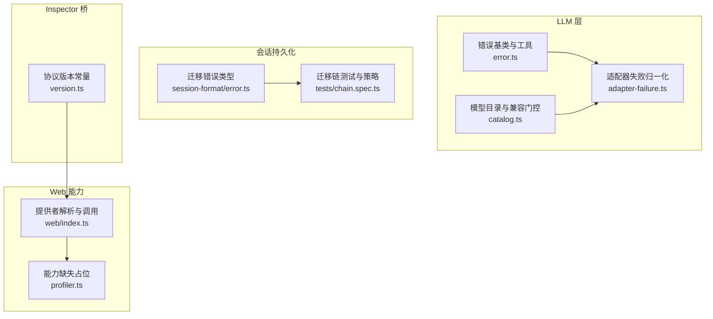
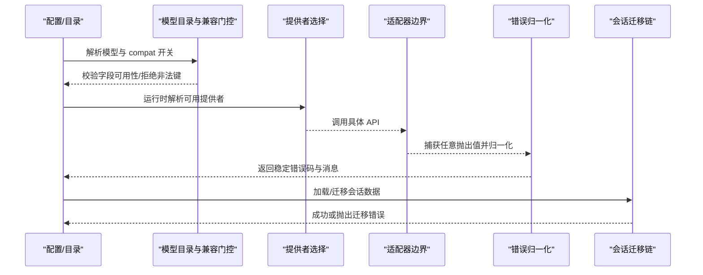
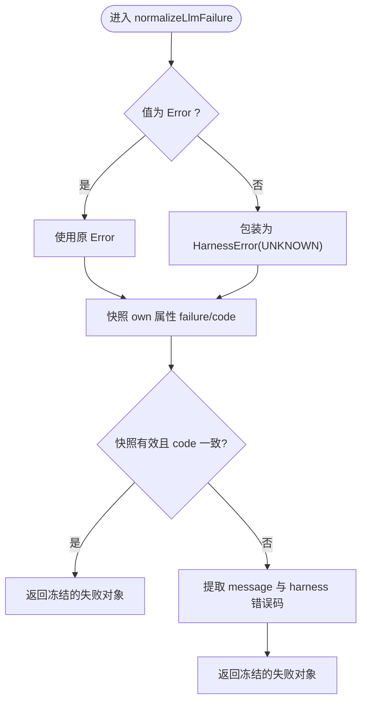
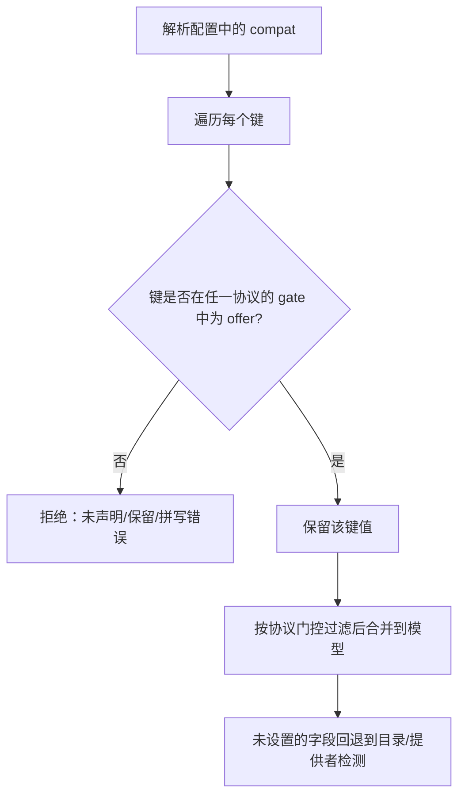
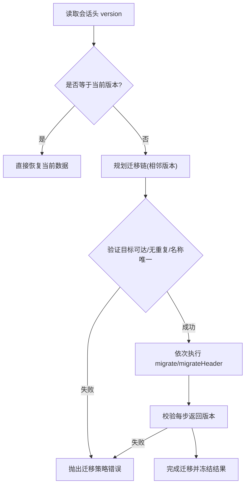
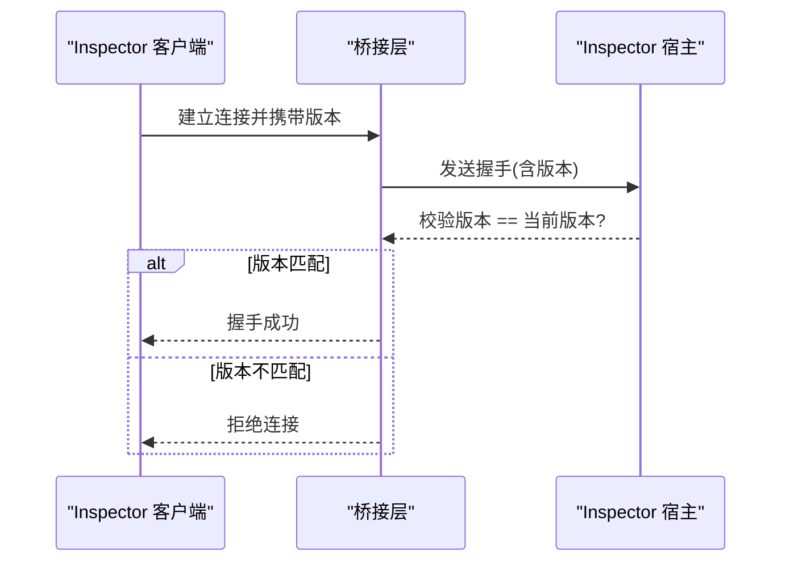
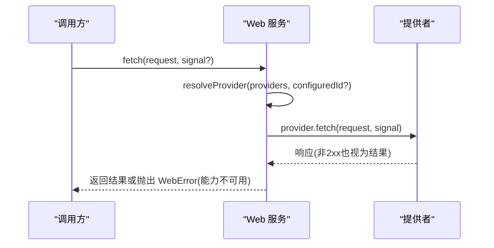
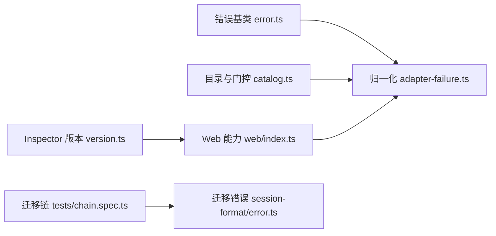

# 兼容性与特性检测

<cite>
**本文引用的文件**
- [packages/llm/llm/src/error.ts](file://packages/llm/llm/src/error.ts)
- [packages/llm/llm/src/adapter-failure.ts](file://packages/llm/llm/src/adapter-failure.ts)
- [packages/llm/llm/tests/adapter-failure.spec.ts](file://packages/llm/llm/tests/adapter-failure.spec.ts)
- [packages/llm/llm-pi-ai/src/catalog.ts](file://packages/llm/llm-pi-ai/src/catalog.ts)
- [packages/experimental/inspector/src/shared/bridge/version.ts](file://packages/experimental/inspector/src/shared/bridge/version.ts)
- [packages/session/session-format/src/error.ts](file://packages/session/session-format/src/error.ts)
- [packages/session/session-format/tests/chain.spec.ts](file://packages/session/session-format/tests/chain.spec.ts)
- [packages/web/web/src/index.ts](file://packages/web/web/src/index.ts)
- [packages/experimental/inspector/src/client/cdp/profiler.ts](file://packages/experimental/inspector/src/client/cdp/profiler.ts)
- [scripts/session-snapshot-corpus.corpus.ts](file://scripts/session-snapshot-corpus.corpus.ts)
- [docs/cookbook/adding-a-remote-api.md](file://docs/cookbook/adding-a-remote-api.md)
</cite>

## 目录
1. [简介](#简介)
2. [项目结构](#项目结构)
3. [核心组件](#核心组件)
4. [架构总览](#架构总览)
5. [详细组件分析](#详细组件分析)
6. [依赖关系分析](#依赖关系分析)
7. [性能考虑](#性能考虑)
8. [故障排除指南](#故障排除指南)
9. [结论](#结论)
10. [附录](#附录)

## 简介
本文件聚焦跨提供商的兼容性与特性检测，覆盖以下主题：
- API 版本管理与协议差异适配
- 功能降级策略与能力探测
- 向后兼容处理与平滑升级
- 错误处理与异常转换（将提供商特定错误统一为稳定错误类型）
- 版本检测与迁移策略（多版本共存、迁移链校验）
- 兼容性测试最佳实践与排障建议

## 项目结构
与兼容性相关的代码主要分布在以下模块：
- LLM 适配器与错误归一化：提供统一的错误模型、失败归一化、上下文溢出/配额耗尽识别等。
- 模型目录与兼容开关：按协议门控暴露可配置字段，实现“声明即可用”的能力治理。
- 会话格式迁移：定义迁移链、相邻版本约束、目标校验与不可用迁移的错误分类。
- Inspector 协议版本：以固定版本号进行严格匹配，确保桥接双方能力一致。
- Web 能力选择：运行时解析可用提供者并执行，不可用时抛出领域错误。
- 能力缺失占位：对不支持的能力返回空能力，避免伪造行为。

**图表来源**
- [packages/llm/llm/src/error.ts:1-164](file://packages/llm/llm/src/error.ts#L1-L164)
- [packages/llm/llm/src/adapter-failure.ts:1-105](file://packages/llm/llm/src/adapter-failure.ts#L1-L105)
- [packages/llm/llm-pi-ai/src/catalog.ts:460-749](file://packages/llm/llm-pi-ai/src/catalog.ts#L460-L749)
- [packages/session/session-format/src/error.ts:1-10](file://packages/session/session-format/src/error.ts#L1-L10)
- [packages/session/session-format/tests/chain.spec.ts:1-200](file://packages/session/session-format/tests/chain.spec.ts#L1-L200)
- [packages/experimental/inspector/src/shared/bridge/version.ts:1-3](file://packages/experimental/inspector/src/shared/bridge/version.ts#L1-L3)
- [packages/web/web/src/index.ts:149-169](file://packages/web/web/src/index.ts#L149-L169)
- [packages/experimental/inspector/src/client/cdp/profiler.ts:1-11](file://packages/experimental/inspector/src/client/cdp/profiler.ts#L1-L11)

**章节来源**
- [packages/llm/llm/src/error.ts:1-164](file://packages/llm/llm/src/error.ts#L1-L164)
- [packages/llm/llm/src/adapter-failure.ts:1-105](file://packages/llm/llm/src/adapter-failure.ts#L1-L105)
- [packages/llm/llm-pi-ai/src/catalog.ts:460-749](file://packages/llm/llm-pi-ai/src/catalog.ts#L460-L749)
- [packages/session/session-format/src/error.ts:1-10](file://packages/session/session-format/src/error.ts#L1-L10)
- [packages/session/session-format/tests/chain.spec.ts:1-200](file://packages/session/session-format/tests/chain.spec.ts#L1-L200)
- [packages/experimental/inspector/src/shared/bridge/version.ts:1-3](file://packages/experimental/inspector/src/shared/bridge/version.ts#L1-L3)
- [packages/web/web/src/index.ts:149-169](file://packages/web/web/src/index.ts#L149-L169)
- [packages/experimental/inspector/src/client/cdp/profiler.ts:1-11](file://packages/experimental/inspector/src/client/cdp/profiler.ts#L1-L11)

## 核心组件
- 统一错误模型与识别
  - 提供稳定的机器可读错误码与消息，支持 cause 链式包装，便于上层路由与重试策略。
  - 内置对“上下文窗口超限”和“账户配额耗尽”的文本模式识别，用于跨提供商错误归类。
- 适配器失败归一化
  - 将任意抛出的值转换为不可变的标准化失败对象；安全读取外部错误属性，避免访问器陷阱。
  - 仅信任 Harness 自有错误码，第三方 SDK 错误码被忽略，保证错误分类一致性。
- 模型目录与兼容门控
  - 通过“协议门控表”声明每个 wire 协议支持的 compat 字段；未声明或保留的字段在配置阶段拒绝。
  - 模型级与路由级开关分层合并，未设置的字段回退到已安装目录或提供者自身检测。
- 会话格式迁移链
  - 强制相邻版本迁移、唯一名称、无重复边、目标可达性校验；对不支持迁移与数据损坏分别分类。
- Inspector 协议版本
  - 使用固定版本号进行严格匹配，预发布端点拒绝其他版本，确保桥接双方能力一致。
- Web 能力选择与降级
  - 运行时解析可用提供者；若能力不可用则抛出领域错误；非 2xx 响应视为结果而非异常。
- 能力缺失占位
  - 对不支持的能力返回空能力，保持接口完整但不伪造行为。

**章节来源**
- [packages/llm/llm/src/error.ts:1-164](file://packages/llm/llm/src/error.ts#L1-L164)
- [packages/llm/llm/src/adapter-failure.ts:1-105](file://packages/llm/llm/src/adapter-failure.ts#L1-L105)
- [packages/llm/llm/tests/adapter-failure.spec.ts:1-68](file://packages/llm/llm/tests/adapter-failure.spec.ts#L1-L68)
- [packages/llm/llm-pi-ai/src/catalog.ts:460-749](file://packages/llm/llm-pi-ai/src/catalog.ts#L460-L749)
- [packages/session/session-format/src/error.ts:1-10](file://packages/session/session-format/src/error.ts#L1-L10)
- [packages/session/session-format/tests/chain.spec.ts:1-200](file://packages/session/session-format/tests/chain.spec.ts#L1-L200)
- [packages/experimental/inspector/src/shared/bridge/version.ts:1-3](file://packages/experimental/inspector/src/shared/bridge/version.ts#L1-L3)
- [packages/web/web/src/index.ts:149-169](file://packages/web/web/src/index.ts#L149-L169)
- [packages/experimental/inspector/src/client/cdp/profiler.ts:1-11](file://packages/experimental/inspector/src/client/cdp/profiler.ts#L1-L11)

## 架构总览
下图展示从配置到调用的兼容性关键路径：配置阶段进行能力与版本校验；运行时根据能力选择提供者；调用时进行错误归一化；持久化层进行格式迁移。

**图表来源**
- [packages/llm/llm-pi-ai/src/catalog.ts:460-749](file://packages/llm/llm-pi-ai/src/catalog.ts#L460-L749)
- [packages/web/web/src/index.ts:149-169](file://packages/web/web/src/index.ts#L149-L169)
- [packages/llm/llm/src/adapter-failure.ts:1-105](file://packages/llm/llm/src/adapter-failure.ts#L1-L105)
- [packages/session/session-format/tests/chain.spec.ts:1-200](file://packages/session/session-format/tests/chain.spec.ts#L1-L200)

## 详细组件分析

### 适配器失败归一化与错误转换
- 目标
  - 将任意抛出的值转换为不可变、序列化友好的失败对象，屏蔽宿主/SDK 的恶意访问器与类型陷阱。
- 关键点
  - 仅当外部错误的 own 属性同时包含一致的 message/code 时才采用；否则回退到默认 UNKNOWN。
  - 安全读取 code/failure/message，捕获访问器抛出的异常，避免二次失败。
  - 对非 Error 值进行安全字符串化，空串回退为通用提示。
- 适用场景
  - 所有 LLM 适配器边界、流式迭代终止、重试策略决策。

**图表来源**
- [packages/llm/llm/src/adapter-failure.ts:16-105](file://packages/llm/llm/src/adapter-failure.ts#L16-L105)

**章节来源**
- [packages/llm/llm/src/adapter-failure.ts:16-105](file://packages/llm/llm/src/adapter-failure.ts#L16-L105)
- [packages/llm/llm/tests/adapter-failure.spec.ts:1-68](file://packages/llm/llm/tests/adapter-failure.spec.ts#L1-L68)

### 模型能力探测与兼容门控
- 目标
  - 通过协议门控表声明每个 wire 协议支持的 compat 字段，配置阶段拒绝未声明或保留的键，避免静默丢弃导致的“看似生效但未应用”。
- 关键点
  - 先校验所有键名（包括无值的键），再过滤只接受 gate 标记为 offer 的字段。
  - 模型级开关优先于路由级开关；未设置字段回退到已安装目录或提供者检测。
  - 诊断信息会列出当前协议实际可用的字段集合，帮助定位拼写错误或误用。
- 适用场景
  - 新增/修改 provider 的 wire 协议时，需同步更新门控表并在配置处显式声明。

**图表来源**
- [packages/llm/llm-pi-ai/src/catalog.ts:460-549](file://packages/llm/llm-pi-ai/src/catalog.ts#L460-L549)
- [packages/llm/llm-pi-ai/src/catalog.ts:721-749](file://packages/llm/llm-pi-ai/src/catalog.ts#L721-L749)

**章节来源**
- [packages/llm/llm-pi-ai/src/catalog.ts:460-749](file://packages/llm/llm-pi-ai/src/catalog.ts#L460-L749)

### 会话格式迁移与多版本共存
- 目标
  - 通过迁移链将旧版本会话无损升级到当前版本，同时严格校验迁移声明与目标可达性。
- 关键点
  - 迁移必须相邻版本、名称唯一、无重复边、目标可达；当前版本恢复函数必须返回正确版本。
  - 对“不支持迁移”的策略拒绝与“当前数据损坏”的恢复失败进行分类，便于区分修复路径。
  - 测试覆盖输入版本过新、回调返回错误版本、策略拒绝与原始错误透传等边界情况。
- 适用场景
  - 存储格式演进、历史会话回放、跨版本部署。

**图表来源**
- [packages/session/session-format/tests/chain.spec.ts:31-200](file://packages/session/session-format/tests/chain.spec.ts#L31-L200)
- [packages/session/session-format/src/error.ts:1-10](file://packages/session/session-format/src/error.ts#L1-L10)

**章节来源**
- [packages/session/session-format/tests/chain.spec.ts:1-200](file://packages/session/session-format/tests/chain.spec.ts#L1-L200)
- [packages/session/session-format/src/error.ts:1-10](file://packages/session/session-format/src/error.ts#L1-L10)

### 协议版本检测与严格匹配
- 目标
  - 确保 Inspector 客户端与宿主之间的桥接协议版本一致，预发布环境拒绝任何不匹配版本。
- 关键点
  - 使用固定常量表示当前协议版本；对非当前版本直接拒绝。
- 适用场景
  - 调试/诊断通道、跨进程通信、插件间协议。

**图表来源**
- [packages/experimental/inspector/src/shared/bridge/version.ts:1-3](file://packages/experimental/inspector/src/shared/bridge/version.ts#L1-L3)

**章节来源**
- [packages/experimental/inspector/src/shared/bridge/version.ts:1-3](file://packages/experimental/inspector/src/shared/bridge/version.ts#L1-L3)

### Web 能力选择与降级
- 目标
  - 运行时选择可用提供者执行网络请求；能力不可用时抛出领域错误；非 2xx 响应作为结果返回。
- 关键点
  - 通过 resolveProvider 动态解析提供者；available() 决定是否能运行。
  - 非 2xx 响应不会抛出异常，而是以描述性结果返回，便于上层处理。
- 适用场景
  - 浏览器/Node 环境差异、可选能力启用、优雅降级。

**图表来源**
- [packages/web/web/src/index.ts:149-169](file://packages/web/web/src/index.ts#L149-L169)

**章节来源**
- [packages/web/web/src/index.ts:149-169](file://packages/web/web/src/index.ts#L149-L169)

### 能力缺失占位与不伪造行为
- 目标
  - 对不支持的能力返回空能力，保持接口完整性但不制造虚假行为。
- 关键点
  - 明确返回 undefined 或空能力，避免隐藏分支导致的行为漂移。
- 适用场景
  - 浏览器/宿主能力探测、实验性功能开关。

**章节来源**
- [packages/experimental/inspector/src/client/cdp/profiler.ts:1-11](file://packages/experimental/inspector/src/client/cdp/profiler.ts#L1-L11)

### 错误链渲染与诊断输出
- 目标
  - 将任意错误及其 cause 链渲染为可读字符串，用于日志与通知；AggregateError 成员也会被展开。
- 关键点
  - 循环引用保护；访问器抛错时降级为不可渲染占位；结构化失败优先使用其 own message。
- 适用场景
  - 用户可见的诊断、错误上报、调试日志。

**章节来源**
- [packages/llm/llm/src/error.ts:102-154](file://packages/llm/llm/src/error.ts#L102-L154)

## 依赖关系分析
- 低耦合设计
  - 错误归一化独立于适配器实现，仅依赖统一错误基类与类型。
  - 模型目录与兼容门控集中管理字段可用性，降低各 provider 的分支复杂度。
  - 迁移链与错误类型解耦，策略拒绝与数据损坏分别分类。
- 可能的环依赖规避
  - 通过共享接口与类型-only 导入避免循环；能力缺失占位保持薄适配。

**图表来源**
- [packages/llm/llm/src/error.ts:1-164](file://packages/llm/llm/src/error.ts#L1-L164)
- [packages/llm/llm/src/adapter-failure.ts:1-105](file://packages/llm/llm/src/adapter-failure.ts#L1-L105)
- [packages/llm/llm-pi-ai/src/catalog.ts:460-749](file://packages/llm/llm-pi-ai/src/catalog.ts#L460-L749)
- [packages/session/session-format/src/error.ts:1-10](file://packages/session/session-format/src/error.ts#L1-L10)
- [packages/session/session-format/tests/chain.spec.ts:1-200](file://packages/session/session-format/tests/chain.spec.ts#L1-L200)
- [packages/experimental/inspector/src/shared/bridge/version.ts:1-3](file://packages/experimental/inspector/src/shared/bridge/version.ts#L1-L3)
- [packages/web/web/src/index.ts:149-169](file://packages/web/web/src/index.ts#L149-L169)

**章节来源**
- [packages/llm/llm/src/error.ts:1-164](file://packages/llm/llm/src/error.ts#L1-L164)
- [packages/llm/llm/src/adapter-failure.ts:1-105](file://packages/llm/llm/src/adapter-failure.ts#L1-L105)
- [packages/llm/llm-pi-ai/src/catalog.ts:460-749](file://packages/llm/llm-pi-ai/src/catalog.ts#L460-L749)
- [packages/session/session-format/src/error.ts:1-10](file://packages/session/session-format/src/error.ts#L1-L10)
- [packages/session/session-format/tests/chain.spec.ts:1-200](file://packages/session/session-format/tests/chain.spec.ts#L1-L200)
- [packages/experimental/inspector/src/shared/bridge/version.ts:1-3](file://packages/experimental/inspector/src/shared/bridge/version.ts#L1-L3)
- [packages/web/web/src/index.ts:149-169](file://packages/web/web/src/index.ts#L149-L169)

## 性能考虑
- 配置阶段一次性校验
  - 兼容门控与模型解析在启动时完成，避免运行时分支判断开销。
- 归一化成本可控
  - 仅对最终边界值进行归一化，内部路径复用稳定错误码。
- 迁移链最小化执行
  - 当前版本直接恢复，无需迁移；相邻迁移次数有限，减少 I/O 与计算。

[本节为通用指导，不直接分析具体文件]

## 故障排除指南
- 配置阶段报错
  - 现象：compat 字段被拒绝，提示“未声明/保留/拼写错误”。
  - 排查：检查字段是否在协议门控表中为 offer；移除无值键；参考诊断列出的可用字段列表。
  - 参考路径
    - [packages/llm/llm-pi-ai/src/catalog.ts:502-549](file://packages/llm/llm-pi-ai/src/catalog.ts#L502-L549)
- 适配器失败
  - 现象：出现 UNKNOWN 错误码或通用消息。
  - 排查：确认是否为非 Error 值或访问器陷阱；查看 cause 链；必要时调整上游适配器错误类型。
  - 参考路径
    - [packages/llm/llm/src/adapter-failure.ts:16-105](file://packages/llm/llm/src/adapter-failure.ts#L16-L105)
    - [packages/llm/llm/tests/adapter-failure.spec.ts:1-68](file://packages/llm/llm/tests/adapter-failure.spec.ts#L1-L68)
- 会话迁移失败
  - 现象：迁移链构建失败或迁移过程中抛出策略错误。
  - 排查：检查迁移声明是否相邻、名称唯一、无重复；确认 restoreCurrent 返回版本正确；区分“不支持迁移”与“数据损坏”。
  - 参考路径
    - [packages/session/session-format/tests/chain.spec.ts:82-200](file://packages/session/session-format/tests/chain.spec.ts#L82-L200)
    - [packages/session/session-format/src/error.ts:1-10](file://packages/session/session-format/src/error.ts#L1-L10)
- 协议版本不匹配
  - 现象：Inspector 握手失败。
  - 排查：确保客户端与宿主使用相同协议版本常量；预发布环境严格匹配。
  - 参考路径
    - [packages/experimental/inspector/src/shared/bridge/version.ts:1-3](file://packages/experimental/inspector/src/shared/bridge/version.ts#L1-L3)
- Web 能力不可用
  - 现象：调用 fetch 抛出领域错误。
  - 排查：检查提供者 available()；确认运行时环境具备所需能力；非 2xx 响应应作为结果处理。
  - 参考路径
    - [packages/web/web/src/index.ts:149-169](file://packages/web/web/src/index.ts#L149-L169)

**章节来源**
- [packages/llm/llm-pi-ai/src/catalog.ts:502-549](file://packages/llm/llm-pi-ai/src/catalog.ts#L502-L549)
- [packages/llm/llm/src/adapter-failure.ts:16-105](file://packages/llm/llm/src/adapter-failure.ts#L16-L105)
- [packages/llm/llm/tests/adapter-failure.spec.ts:1-68](file://packages/llm/llm/tests/adapter-failure.spec.ts#L1-L68)
- [packages/session/session-format/tests/chain.spec.ts:82-200](file://packages/session/session-format/tests/chain.spec.ts#L82-L200)
- [packages/session/session-format/src/error.ts:1-10](file://packages/session/session-format/src/error.ts#L1-L10)
- [packages/experimental/inspector/src/shared/bridge/version.ts:1-3](file://packages/experimental/inspector/src/shared/bridge/version.ts#L1-L3)
- [packages/web/web/src/index.ts:149-169](file://packages/web/web/src/index.ts#L149-L169)

## 结论
- 通过“协议门控 + 配置阶段校验”实现强约束的兼容性治理，避免静默降级带来的不确定性。
- 使用统一的错误模型与归一化机制，屏蔽提供商差异，使重试、路由与诊断保持一致。
- 会话迁移链以严格的相邻版本与目标可达性保障数据完整性，并提供清晰的错误分类。
- 协议版本严格匹配确保桥接稳定性；能力缺失以占位方式保持接口完整而不伪造行为。
- 建议在新增 provider 或协议时同步更新门控表与测试用例，确保兼容性契约持续有效。

[本节为总结性内容，不直接分析具体文件]

## 附录
- 远程 API 错误分类最佳实践
  - 单一 RemoteError 类，合并领域代码；仅在边界处分类并附带 cause；避免编写退出映射函数。
  - 本地失败不跨线传输时使用调用方类型表达。
  - 参考路径
    - [docs/cookbook/adding-a-remote-api.md:51-60](file://docs/cookbook/adding-a-remote-api.md#L51-L60)

**章节来源**
- [docs/cookbook/adding-a-remote-api.md:51-60](file://docs/cookbook/adding-a-remote-api.md#L51-L60)