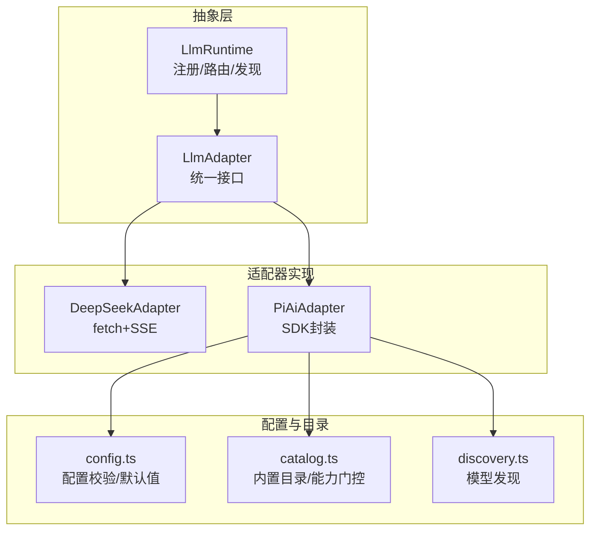
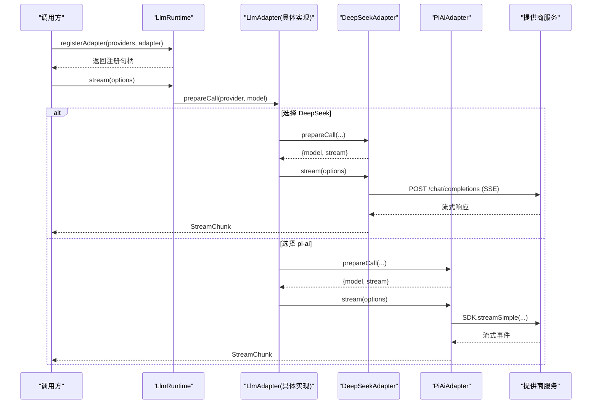
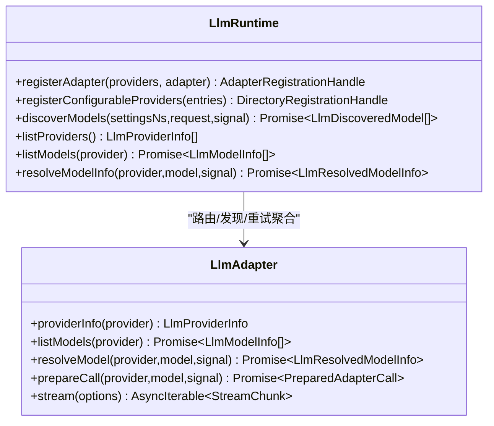
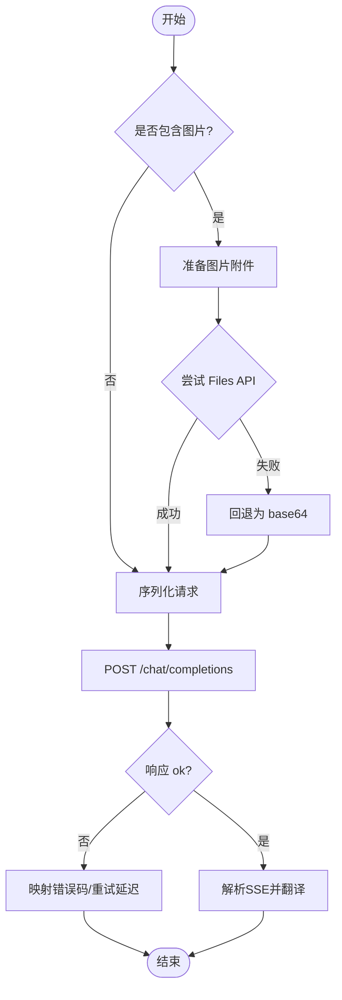
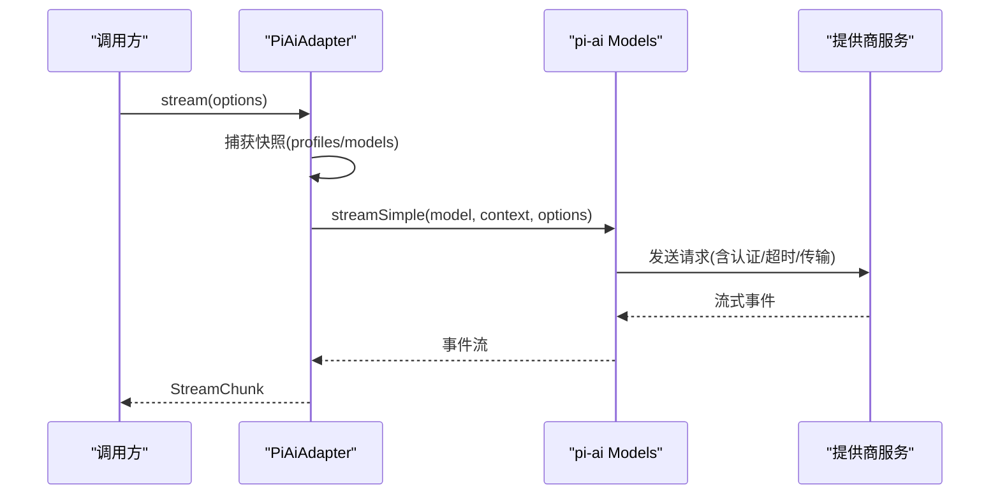
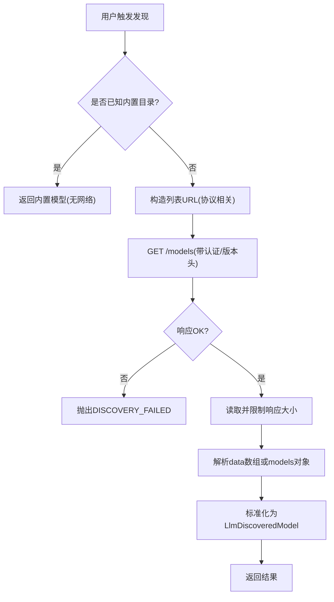
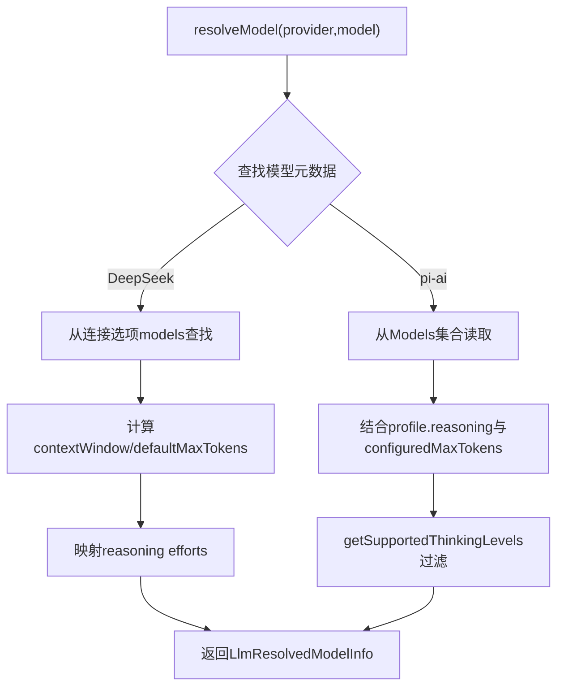
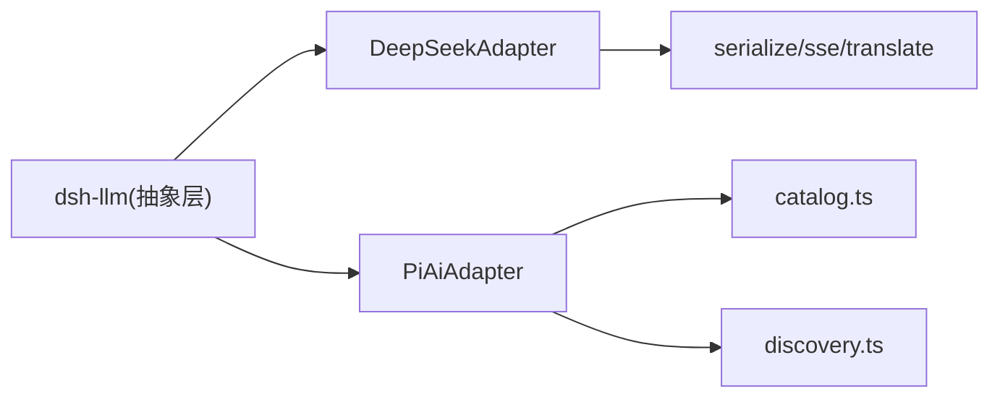

# 多提供商支持

<cite>
**本文引用的文件**
- [packages/llm/llm/src/index.ts](file://packages/llm/llm/src/index.ts)
- [packages/llm/llm/src/types.ts](file://packages/llm/llm/src/types.ts)
- [packages/llm/llm-deepseek/src/adapter.ts](file://packages/llm/llm-deepseek/src/adapter.ts)
- [packages/llm/llm-pi-ai/src/adapter.ts](file://packages/llm/llm-pi-ai/src/adapter.ts)
- [packages/llm/llm-pi-ai/src/config.ts](file://packages/llm/llm-pi-ai/src/config.ts)
- [packages/llm/llm-pi-ai/src/discovery.ts](file://packages/llm/llm-pi-ai/src/discovery.ts)
- [packages/llm/llm-pi-ai/src/catalog.ts](file://packages/llm/llm-pi-ai/src/catalog.ts)
</cite>

## 目录
1. [简介](#简介)
2. [项目结构](#项目结构)
3. [核心组件](#核心组件)
4. [架构总览](#架构总览)
5. [详细组件分析](#详细组件分析)
6. [依赖关系分析](#依赖关系分析)
7. [性能考量](#性能考量)
8. [故障排查指南](#故障排查指南)
9. [结论](#结论)
10. [附录](#附录)

## 简介
本指南面向需要在同一运行时中接入多家大模型提供商（如 DeepSeek、OpenAI、Anthropic、本地模型等）的工程团队。文档围绕以下目标展开：
- 解释两种适配模式：直接 HTTP 调用（以 DeepSeek 为例）与 SDK 封装（以 pi-ai 为例）的实现差异。
- 深入解析 resolveModel 接口的实现，包括模型元数据获取、能力探测与推理级别映射。
- 说明提供商特定配置管理：API 密钥处理、请求限流与重试策略。
- 提供主流提供商的适配示例与最佳实践。
- 介绍动态模型目录的实现，支持运行时模型发现与更新。
- 阐述跨提供商兼容性处理与特性检测机制。

## 项目结构
本项目在 packages/llm 下按“抽象层 + 具体适配器”组织：
- 抽象层（@deepseek-ai/dsh-llm）：定义 LlmAdapter 抽象类、统一消息/流式协议、错误与重试策略、注册与目录管理等。
- 适配器实现：
  - llm-deepseek：基于 fetch + SSE 的直接 HTTP 适配器，对接 OpenAI 兼容的 /chat/completions 端点。
  - llm-pi-ai：基于 @earendil-works/pi-ai SDK 的多提供商适配器，内置目录、认证上下文、模型清单与发现能力。
- 配置与目录：
  - llm-pi-ai/config.ts：对 providers 配置进行校验、默认值填充、构建 Provider 集合。
  - llm-pi-ai/catalog.ts：内置模型目录、能力门控、推理级别映射、兼容开关等。
  - llm-pi-ai/discovery.ts：对 OpenAI/Anthropic 等协议的 /models 列表进行探测与解析。

图表来源
- [packages/llm/llm/src/index.ts:191-279](file://packages/llm/llm/src/index.ts#L191-L279)
- [packages/llm/llm-deepseek/src/adapter.ts:355-444](file://packages/llm/llm-deepseek/src/adapter.ts#L355-L444)
- [packages/llm/llm-pi-ai/src/adapter.ts:240-344](file://packages/llm/llm-pi-ai/src/adapter.ts#L240-L344)
- [packages/llm/llm-pi-ai/src/config.ts:340-488](file://packages/llm/llm-pi-ai/src/config.ts#L340-L488)
- [packages/llm/llm-pi-ai/src/catalog.ts:151-190](file://packages/llm/llm-pi-ai/src/catalog.ts#L151-L190)
- [packages/llm/llm-pi-ai/src/discovery.ts:269-363](file://packages/llm/llm-pi-ai/src/discovery.ts#L269-L363)

章节来源
- [packages/llm/llm/src/index.ts:191-279](file://packages/llm/llm/src/index.ts#L191-L279)
- [packages/llm/llm-deepseek/src/adapter.ts:355-444](file://packages/llm/llm-deepseek/src/adapter.ts#L355-L444)
- [packages/llm/llm-pi-ai/src/adapter.ts:240-344](file://packages/llm/llm-pi-ai/src/adapter.ts#L240-L344)
- [packages/llm/llm-pi-ai/src/config.ts:340-488](file://packages/llm/llm-pi-ai/src/config.ts#L340-L488)
- [packages/llm/llm-pi-ai/src/catalog.ts:151-190](file://packages/llm/llm-pi-ai/src/catalog.ts#L151-L190)
- [packages/llm/llm-pi-ai/src/discovery.ts:269-363](file://packages/llm/llm-pi-ai/src/discovery.ts#L269-L363)

## 核心组件
- LlmAdapter 抽象类：定义 providerInfo、listModels、resolveModel、prepareCall、stream 等统一接口；所有提供商适配器必须实现。
- LlmRuntime：负责适配器注册、可配置提供商目录、模型发现、重试策略聚合、模型信息归一化与校验。
- DeepSeekAdapter：直接通过 fetch 调用 OpenAI 兼容的 /chat/completions，SSE 流式解析，图片附件走 Files API 或 base64 回退。
- PiAiAdapter：基于 pi-ai SDK 的多提供商封装，使用 Models/Provider 集合管理路由与能力，支持内置目录与在线发现。

章节来源
- [packages/llm/llm/src/index.ts:191-279](file://packages/llm/llm/src/index.ts#L191-L279)
- [packages/llm/llm/src/index.ts:330-715](file://packages/llm/llm/src/index.ts#L330-L715)
- [packages/llm/llm-deepseek/src/adapter.ts:355-444](file://packages/llm/llm-deepseek/src/adapter.ts#L355-L444)
- [packages/llm/llm-pi-ai/src/adapter.ts:240-344](file://packages/llm/llm-pi-ai/src/adapter.ts#L240-L344)

## 架构总览
下图展示了从上层调用到不同提供商适配器的整体流程，以及配置与目录的作用点。

图表来源
- [packages/llm/llm/src/index.ts:330-715](file://packages/llm/llm/src/index.ts#L330-L715)
- [packages/llm/llm-deepseek/src/adapter.ts:442-709](file://packages/llm/llm-deepseek/src/adapter.ts#L442-L709)
- [packages/llm/llm-pi-ai/src/adapter.ts:342-441](file://packages/llm/llm-pi-ai/src/adapter.ts#L342-L441)

## 详细组件分析

### 适配器抽象与运行时（LlmAdapter/LlmRuntime）
- 统一接口：
  - providerInfo：描述提供商显示名与路由键。
  - listModels：列出当前可 advertised 的模型（建议性）。
  - resolveModel：精确模型的元数据（上下文窗口、默认 maxTokens、推理能力等）。
  - prepareCall：将模型元数据与一次生成调用绑定，避免配置变更影响进行中请求。
  - stream：唯一必需方法，输出统一的 StreamChunk。
- 运行时职责：
  - 注册适配器与可配置提供商目录，原子替换路由集合。
  - 暴露 discoverModels 用于前端/配置界面探测可用模型。
  - 聚合 providerRetryPolicy，并对模型信息进行归一化与校验。

图表来源
- [packages/llm/llm/src/index.ts:191-279](file://packages/llm/llm/src/index.ts#L191-L279)
- [packages/llm/llm/src/index.ts:330-715](file://packages/llm/llm/src/index.ts#L330-L715)

章节来源
- [packages/llm/llm/src/index.ts:191-279](file://packages/llm/llm/src/index.ts#L191-L279)
- [packages/llm/llm/src/index.ts:330-715](file://packages/llm/llm/src/index.ts#L330-L715)

### DeepSeek 适配器（直接 HTTP 调用）
- 传输方式：直接 fetch 调用 OpenAI 兼容的 /chat/completions，SSE 流式解析。
- 图片处理：优先使用 Files API 上传引用，失败回退为 base64；具备字节/数量上限与去重策略。
- 错误映射：HTTP 状态与错误体映射为稳定代码（AUTH、RATE_LIMIT、CONTEXT_WINDOW_EXCEEDED 等），并提取 requestId/retry-after。
- 模型元数据：
  - listModels：返回配置的 models 条目。
  - resolveModel：根据连接选项与模型目录计算 contextWindow、defaultMaxTokens、reasoning efforts。
- 重试策略：通过 options().retryPolicy 注入已解析的重试策略。

图表来源
- [packages/llm/llm-deepseek/src/adapter.ts:442-709](file://packages/llm/llm-deepseek/src/adapter.ts#L442-L709)

章节来源
- [packages/llm/llm-deepseek/src/adapter.ts:355-444](file://packages/llm/llm-deepseek/src/adapter.ts#L355-L444)
- [packages/llm/llm-deepseek/src/adapter.ts:442-709](file://packages/llm/llm-deepseek/src/adapter.ts#L442-L709)

### pi-ai 适配器（SDK 封装）
- 传输方式：通过 @earendil-works/pi-ai 的 Models/Provider 集合发起流式调用，内部处理认证、超时、传输（SSE/WebSocket）。
- 快照机制：每次操作捕获不可变快照（profiles + models），确保进行中请求不受后续配置变更影响。
- 模型元数据：
  - listModels：从 Models.getModels 读取输入模态等。
  - resolveModel：结合 profile 与模型能力，推导 contextWindow、defaultMaxTokens、reasoning levels。
- 推理级别映射：
  - 通过 getSupportedThinkingLevels 获取模型支持的 thinking 级别。
  - 将 harness ReasoningEffortId 映射到 SDK 的 ModelThinkingLevel。
- 头部与身份：合并部署头、Harness 归属头与 TDAI 会话头，保证名称不冲突。

图表来源
- [packages/llm/llm-pi-ai/src/adapter.ts:342-441](file://packages/llm/llm-pi-ai/src/adapter.ts#L342-L441)

章节来源
- [packages/llm/llm-pi-ai/src/adapter.ts:240-344](file://packages/llm/llm-pi-ai/src/adapter.ts#L240-L344)
- [packages/llm/llm-pi-ai/src/adapter.ts:342-441](file://packages/llm/llm-pi-ai/src/adapter.ts#L342-L441)

### 配置管理与提供商特定设置
- DeepSeek：
  - 连接选项：baseURL、apiKeyEnv、defaults（thinking/effort）、maxTokens、contextWindow、重试策略等。
  - 图片策略：Files API 与 base64 回退、每请求最大字节/数量限制。
- pi-ai：
  - 配置项：apiKeyEnv、displayName、api/baseURL、models/modelOverrides、compat 开关、默认上下文/输出上限、请求图片预算、超时、流空闲超时、重试策略等。
  - 配置校验：headers 合法性、数值范围、必填字段、移除字段提示。
  - 构建 Provider：将配置与内置目录合并，产出不可变的 pi-ai Provider 集合。

章节来源
- [packages/llm/llm-deepseek/src/adapter.ts:74-112](file://packages/llm/llm-deepseek/src/adapter.ts#L74-L112)
- [packages/llm/llm-pi-ai/src/config.ts:87-213](file://packages/llm/llm-pi-ai/src/config.ts#L87-L213)
- [packages/llm/llm-pi-ai/src/config.ts:340-488](file://packages/llm/llm-pi-ai/src/config.ts#L340-L488)

### 动态模型目录与发现
- 内置目录（catalog.ts）：
  - 提供内置 Provider 与模型清单，支持按模型 id 覆盖 fields。
  - 能力门控：modality、thinking level、cache control、max tokens field 等。
  - 推理级别映射：将配置中的 reasoningEfforts 转换为 thinkingLevelMap。
- 在线发现（discovery.ts）：
  - 支持 OpenAI Completions/Responses 与 Anthropic Messages 的 /models 列表。
  - 安全限制：响应大小上限、分页限制、认证头处理。
  - 解析多种字段命名约定，输出 LlmDiscoveredModel。

图表来源
- [packages/llm/llm-pi-ai/src/discovery.ts:269-363](file://packages/llm/llm-pi-ai/src/discovery.ts#L269-L363)
- [packages/llm/llm-pi-ai/src/catalog.ts:151-190](file://packages/llm/llm-pi-ai/src/catalog.ts#L151-L190)

章节来源
- [packages/llm/llm-pi-ai/src/catalog.ts:151-190](file://packages/llm/llm-pi-ai/src/catalog.ts#L151-L190)
- [packages/llm/llm-pi-ai/src/discovery.ts:269-363](file://packages/llm/llm-pi-ai/src/discovery.ts#L269-L363)

### resolveModel 接口详解
- 作用：返回精确模型的元数据，包括 provider/id/name、inputModalities、contextWindow、defaultMaxTokens、reasoning efforts。
- DeepSeek：
  - 从连接选项的 models 目录查找，未找到则降级为 text-only。
  - 根据 defaults.thinking 决定可用的 reasoning efforts 与默认 effort。
- pi-ai：
  - 从 Models 集合读取模型能力，结合 profile 的 reasoning 与 configuredMaxTokens。
  - 使用 getSupportedThinkingLevels 过滤出可展示的推理级别。

图表来源
- [packages/llm/llm-deepseek/src/adapter.ts:387-432](file://packages/llm/llm-deepseek/src/adapter.ts#L387-L432)
- [packages/llm/llm-pi-ai/src/adapter.ts:305-332](file://packages/llm/llm-pi-ai/src/adapter.ts#L305-L332)

章节来源
- [packages/llm/llm-deepseek/src/adapter.ts:387-432](file://packages/llm/llm-deepseek/src/adapter.ts#L387-L432)
- [packages/llm/llm-pi-ai/src/adapter.ts:305-332](file://packages/llm/llm-pi-ai/src/adapter.ts#L305-L332)

### 跨提供商兼容性处理与特性检测
- 能力门控（catalog.ts）：
  - modality gate：text/image 严格限定。
  - thinking level gate：off/minimal/low/medium/high/xhigh/max。
  - compat gates：针对不同协议（openai-completions/responses、anthropic-messages、bedrock-converse-stream）开放可配置字段。
- 运行时校验（index.ts）：
  - 对 resolveModel 返回的 contextWindow、defaultMaxTokens、reasoning.efforts 进行类型与范围校验。
  - 对 listModels 返回的元数据进行去重与格式校验。

章节来源
- [packages/llm/llm-pi-ai/src/catalog.ts:47-149](file://packages/llm/llm-pi-ai/src/catalog.ts#L47-L149)
- [packages/llm/llm-pi-ai/src/catalog.ts:217-300](file://packages/llm/llm-pi-ai/src/catalog.ts#L217-L300)
- [packages/llm/llm/src/index.ts:726-800](file://packages/llm/llm/src/index.ts#L726-L800)

## 依赖关系分析
- 适配器对抽象层的依赖：
  - 所有适配器依赖 LlmAdapter 统一接口与 LlmError/LlmFailure 等类型。
  - 通过 LlmRuntime.registerAdapter 注册路由，并通过 providerRetryPolicy 注入重试策略。
- DeepSeek 适配器依赖：
  - 直接依赖 fetch/SSE 解析、图片 Files API、请求定价与序列化模块。
- pi-ai 适配器依赖：
  - 依赖 @earendil-works/pi-ai 的 createModels/streamSimple/getSupportedThinkingLevels。
  - 依赖 catalog.ts 的内置目录与能力门控，discovery.ts 的在线发现。

图表来源
- [packages/llm/llm/src/index.ts:191-279](file://packages/llm/llm/src/index.ts#L191-L279)
- [packages/llm/llm-deepseek/src/adapter.ts:355-444](file://packages/llm/llm-deepseek/src/adapter.ts#L355-L444)
- [packages/llm/llm-pi-ai/src/adapter.ts:240-344](file://packages/llm/llm-pi-ai/src/adapter.ts#L240-L344)
- [packages/llm/llm-pi-ai/src/catalog.ts:151-190](file://packages/llm/llm-pi-ai/src/catalog.ts#L151-L190)
- [packages/llm/llm-pi-ai/src/discovery.ts:269-363](file://packages/llm/llm-pi-ai/src/discovery.ts#L269-L363)

章节来源
- [packages/llm/llm/src/index.ts:191-279](file://packages/llm/llm/src/index.ts#L191-L279)
- [packages/llm/llm-deepseek/src/adapter.ts:355-444](file://packages/llm/llm-deepseek/src/adapter.ts#L355-L444)
- [packages/llm/llm-pi-ai/src/adapter.ts:240-344](file://packages/llm/llm-pi-ai/src/adapter.ts#L240-L344)
- [packages/llm/llm-pi-ai/src/catalog.ts:151-190](file://packages/llm/llm-pi-ai/src/catalog.ts#L151-L190)
- [packages/llm/llm-pi-ai/src/discovery.ts:269-363](file://packages/llm/llm-pi-ai/src/discovery.ts#L269-L363)

## 性能考量
- 流式空闲超时：
  - DeepSeek：streamIdleTimeoutMs 控制流读取空闲超时，避免长时间挂起。
  - pi-ai：同样通过 streamIdleTimeoutMs 保护长连接。
- 图片负载控制：
  - DeepSeek：按字节/数量阈值进行 offload，优先 Files API，失败回退 base64。
  - pi-ai：maxRequestImageBytes、requestImagePixelBudget、requestImageMaxBytes 控制内联图片质量与大小。
- 重试策略：
  - 通过 providerRetryPolicy 注入，避免重复造轮子；pi-ai 适配器将 SDK 层重试交由上层恢复层处理。
- 响应大小限制：
  - discovery 阶段限制响应字节数，防止恶意或异常端点导致内存压力。

[本节为通用指导，无需特定文件来源]

## 故障排查指南
- 认证失败（AUTH）：
  - 检查 apiKeyEnv 是否正确指向环境变量或凭证存储。
  - 确认 headers 中 Authorization 或 x-api-key 正确设置。
- 速率限制（RATE_LIMIT）：
  - 关注 retry-after 头，适配器会将其映射为 providerRetryAfterMs。
- 上下文超限（CONTEXT_WINDOW_EXCEEDED）：
  - 调整 messages 长度或启用压缩/摘要策略。
- 图片处理失败：
  - DeepSeek：检查 Files API 超时与配额，必要时回退 base64。
  - pi-ai：降低 requestImagePixelBudget/requestImageMaxBytes。
- 模型发现失败（DISCOVERY_FAILED）：
  - 检查 baseURL/api 是否正确，认证头是否合法，响应是否为 JSON。

章节来源
- [packages/llm/llm-deepseek/src/adapter.ts:334-346](file://packages/llm/llm-deepseek/src/adapter.ts#L334-L346)
- [packages/llm/llm-deepseek/src/adapter.ts:661-696](file://packages/llm/llm-deepseek/src/adapter.ts#L661-L696)
- [packages/llm/llm-pi-ai/src/discovery.ts:130-165](file://packages/llm/llm-pi-ai/src/discovery.ts#L130-L165)
- [packages/llm/llm-pi-ai/src/discovery.ts:337-363](file://packages/llm/llm-pi-ai/src/discovery.ts#L337-L363)

## 结论
本项目通过统一的 LlmAdapter 抽象与 LlmRuntime 注册机制，实现了多提供商的统一接入与运行期管理。DeepSeek 适配器采用直接 HTTP+SSE 的方式，灵活可控；pi-ai 适配器借助 SDK 封装，简化了认证、传输与目录管理。两者均提供了完善的模型元数据解析、能力探测与推理级别映射，并支持动态模型发现与配置热更新。工程实践中，应结合业务需求选择合适的适配器，并合理配置图片负载、超时与重试策略，以获得稳定高效的推理体验。

[本节为总结性内容，无需特定文件来源]

## 附录
- 主流提供商适配要点：
  - OpenAI：可通过 DeepSeek 适配器（OpenAI 兼容端点）或 pi-ai 适配器（openai-completions/responses）接入。
  - Anthropic：推荐使用 pi-ai 适配器（anthropic-messages），利用其原生 /v1/models 列表与认证头。
  - 本地模型：若提供 OpenAI 兼容端点，可使用 DeepSeek 适配器；否则通过 pi-ai 自定义 baseURL 与 api。
- 最佳实践：
  - 明确声明 inputModalities，避免过度承诺图像能力。
  - 使用 configurable providers 目录，集中管理 displayName/settingsNs/settingsPath。
  - 在 discovery 阶段限制响应大小，避免异常端点影响稳定性。

[本节为补充说明，无需特定文件来源]