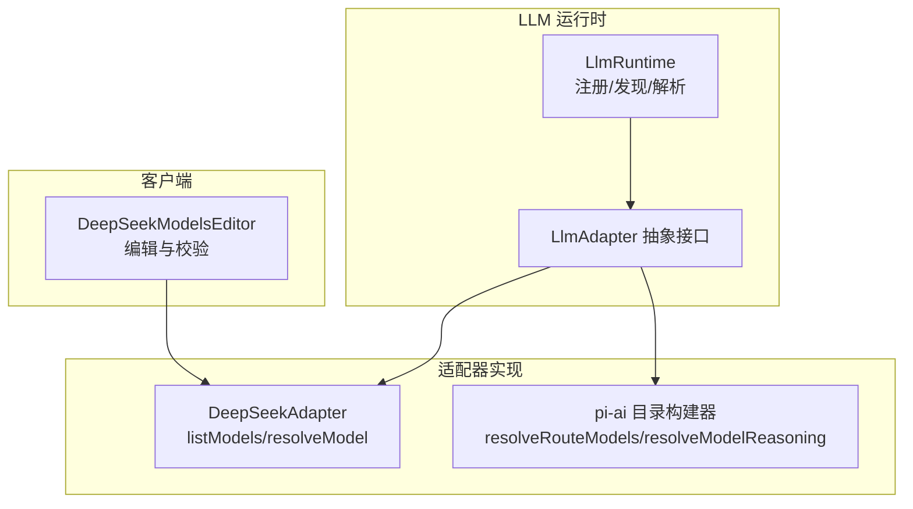
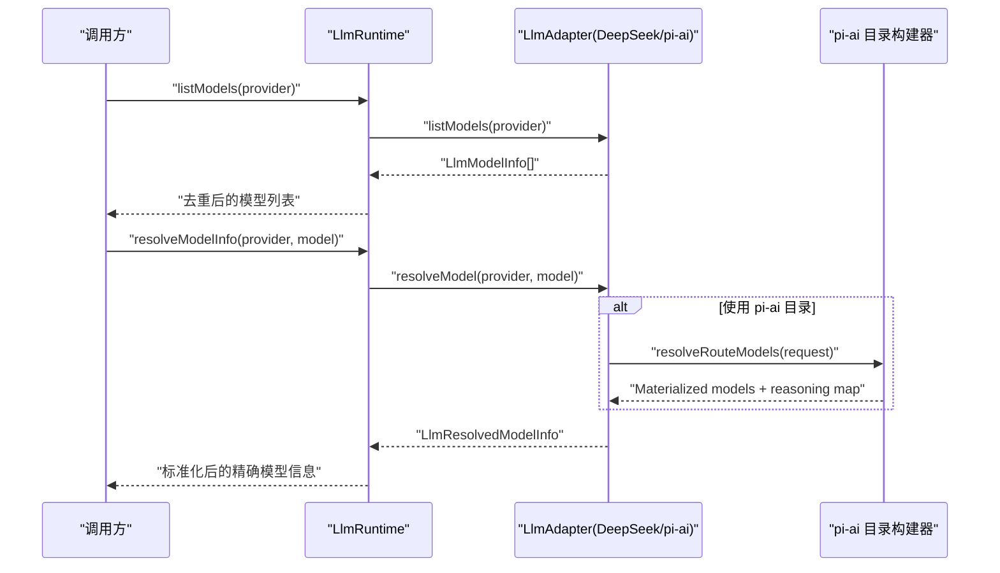
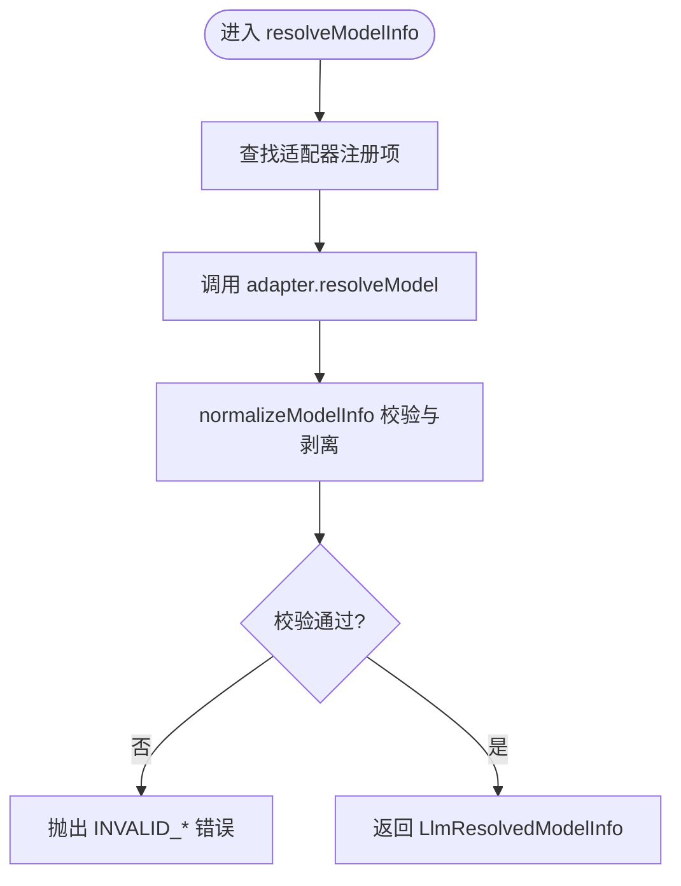
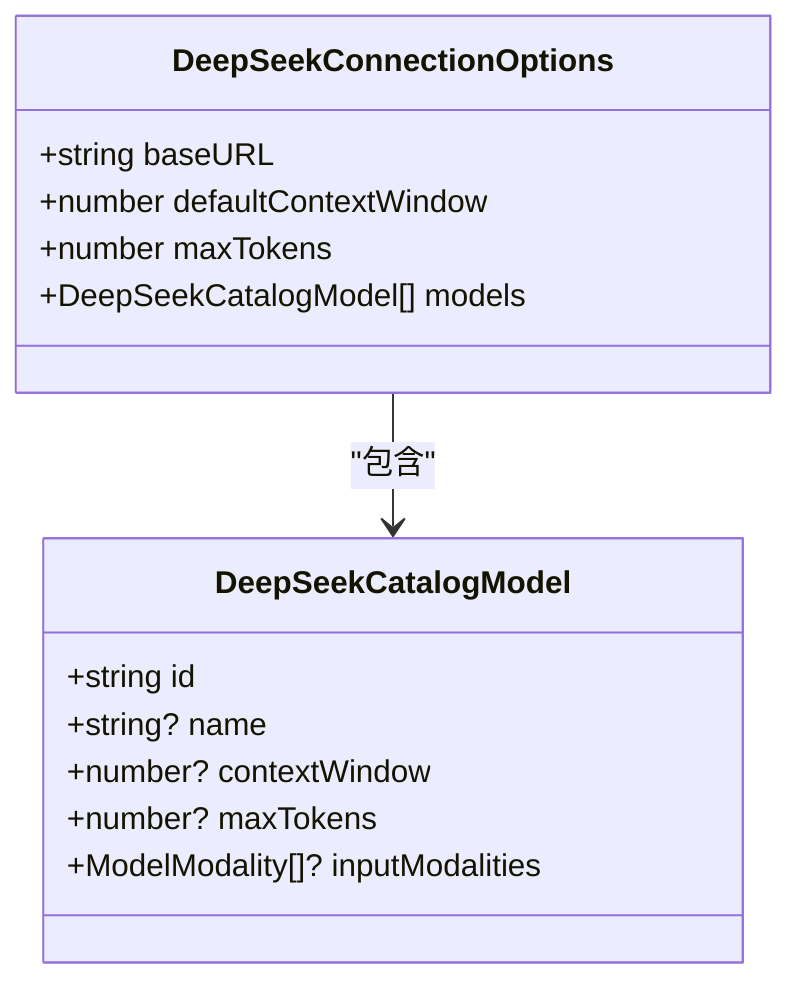
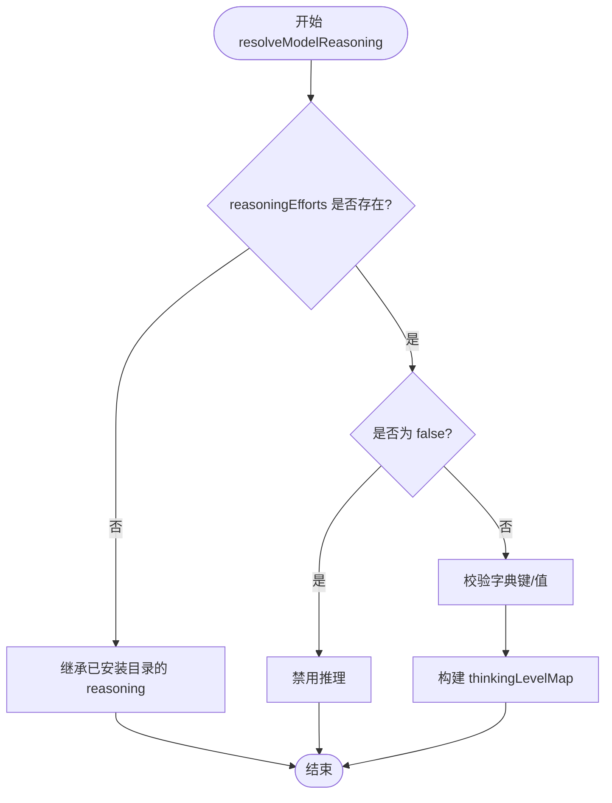
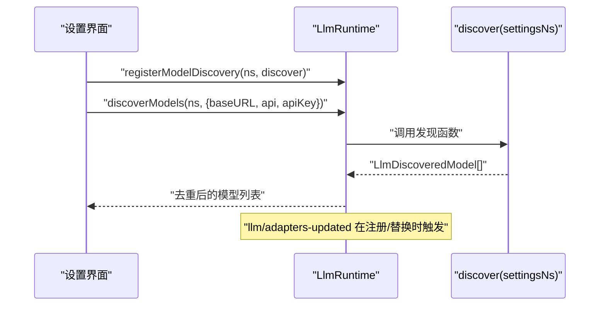
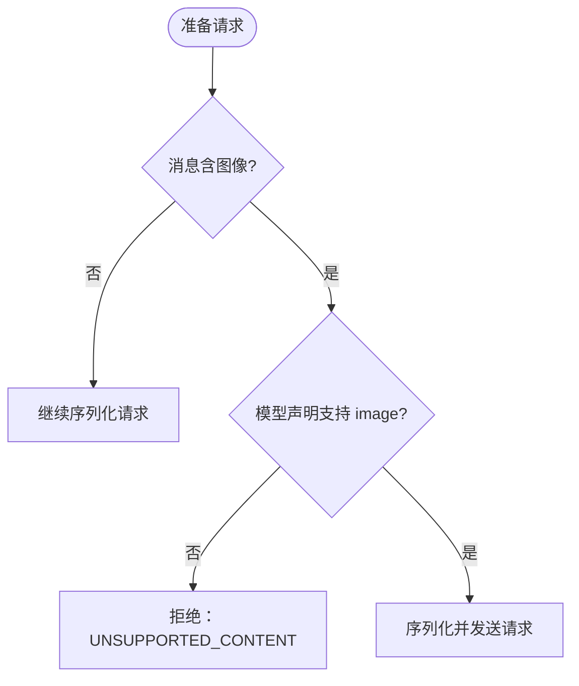
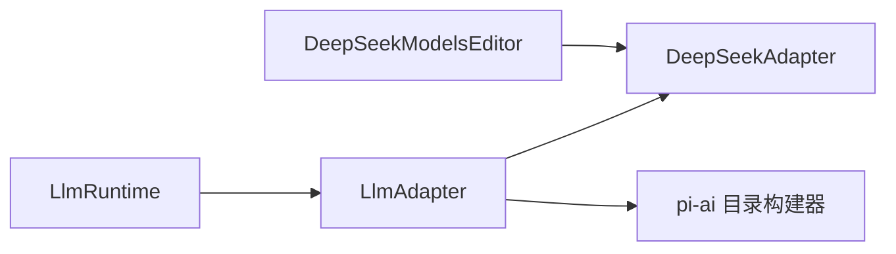

# 模型解析与目录管理

<cite>
**本文引用的文件**
- [packages/llm/llm/src/index.ts](file://packages/llm/llm/src/index.ts)
- [packages/llm/llm/src/types.ts](file://packages/llm/llm/src/types.ts)
- [packages/llm/llm-pi-ai/src/catalog.ts](file://packages/llm/llm-pi-ai/src/catalog.ts)
- [packages/llm/llm-deepseek/src/adapter.ts](file://packages/llm/llm-deepseek/src/adapter.ts)
- [packages/client/ui-settings-models/src/client/DeepSeekModelsEditor.tsx](file://packages/client/ui-settings-models/src/client/DeepSeekModelsEditor.tsx)
</cite>

## 目录
1. [简介](#简介)
2. [项目结构](#项目结构)
3. [核心组件](#核心组件)
4. [架构总览](#架构总览)
5. [详细组件分析](#详细组件分析)
6. [依赖关系分析](#依赖关系分析)
7. [性能考量](#性能考量)
8. [故障排查指南](#故障排查指南)
9. [结论](#结论)
10. [附录：配置示例与最佳实践](#附录配置示例与最佳实践)

## 简介
本文件聚焦“模型解析与目录管理”能力，系统性说明 resolveModelInfo 的解析流程、模型目录结构与校验规则、动态模型发现机制、以及多模态能力检测。文档面向不同技术背景的读者，提供从高层到代码级的分层解释，并附带流程图与时序图帮助理解数据与控制流。

## 项目结构
围绕模型解析与目录管理的核心实现分布在以下模块：
- LLM 运行时与适配器契约：定义统一的模型元数据、能力探测、推理级别等接口与规范。
- pi-ai 目录构建器：将内置目录与用户配置合并，生成可路由的模型清单，并处理推理能力映射。
- DeepSeek 适配器：直接对接 OpenAI 兼容端点，提供模型列表、精确模型信息解析与请求流式调用。
- 客户端模型设置编辑器：对 DeepSeek 适配器的“建议性目录”进行可视化编辑与校验。

**图表来源**
- [packages/llm/llm/src/index.ts:197-279](file://packages/llm/llm/src/index.ts#L197-L279)
- [packages/llm/llm-deepseek/src/adapter.ts:355-440](file://packages/llm/llm-deepseek/src/adapter.ts#L355-L440)
- [packages/llm/llm-pi-ai/src/catalog.ts:797-800](file://packages/llm/llm-pi-ai/src/catalog.ts#L797-L800)
- [packages/client/ui-settings-models/src/client/DeepSeekModelsEditor.tsx:94-123](file://packages/client/ui-settings-models/src/client/DeepSeekModelsEditor.tsx#L94-L123)

**章节来源**
- [packages/llm/llm/src/index.ts:197-279](file://packages/llm/llm/src/index.ts#L197-L279)
- [packages/llm/llm-deepseek/src/adapter.ts:355-440](file://packages/llm/llm-deepseek/src/adapter.ts#L355-L440)
- [packages/llm/llm-pi-ai/src/catalog.ts:797-800](file://packages/llm/llm-pi-ai/src/catalog.ts#L797-L800)
- [packages/client/ui-settings-models/src/client/DeepSeekModelsEditor.tsx:94-123](file://packages/client/ui-settings-models/src/client/DeepSeekModelsEditor.tsx#L94-L123)

## 核心组件
- LlmRuntime：统一注册适配器、声明可配置提供者、提供模型发现与精确模型信息解析入口。
- LlmAdapter：适配器抽象，要求实现 listModels、resolveModel、prepareCall 等；默认实现返回最小元数据。
- DeepSeekAdapter：具体适配器，提供模型列表、精确模型信息（上下文窗口、默认输出上限、推理努力级别）、图像能力检查与流式调用。
- pi-ai 目录构建器：将内置目录与用户配置合并，计算推理能力映射、协议兼容性开关，产出最终模型清单。
- DeepSeekModelsEditor：前端编辑器，对用户维护的模型条目做字段级校验（ID、名称、上下文窗口、最大令牌数）。

**章节来源**
- [packages/llm/llm/src/index.ts:330-540](file://packages/llm/llm/src/index.ts#L330-L540)
- [packages/llm/llm/src/index.ts:688-741](file://packages/llm/llm/src/index.ts#L688-L741)
- [packages/llm/llm-deepseek/src/adapter.ts:383-440](file://packages/llm/llm-deepseek/src/adapter.ts#L383-L440)
- [packages/llm/llm-pi-ai/src/catalog.ts:797-800](file://packages/llm/llm-pi-ai/src/catalog.ts#L797-L800)
- [packages/client/ui-settings-models/src/client/DeepSeekModelsEditor.tsx:94-123](file://packages/client/ui-settings-models/src/client/DeepSeekModelsEditor.tsx#L94-L123)

## 架构总览
下图展示了从上层调用到适配器实现的完整链路，包括模型列表查询、精确模型信息解析、以及 pi-ai 目录合并过程。

**图表来源**
- [packages/llm/llm/src/index.ts:688-741](file://packages/llm/llm/src/index.ts#L688-L741)
- [packages/llm/llm-deepseek/src/adapter.ts:383-440](file://packages/llm/llm-deepseek/src/adapter.ts#L383-L440)
- [packages/llm/llm-pi-ai/src/catalog.ts:797-800](file://packages/llm/llm-pi-ai/src/catalog.ts#L797-L800)

## 详细组件分析

### resolveModelInfo 解析流程
- 入口：LlmRuntime.resolveModelInfo(provider, model)。
- 内部：通过 registration(provider) 找到对应适配器，调用 adapter.resolveModel(provider, model)。
- 归一化：normalizeModelInfo 校验 provider、id、name、description、contextWindow、defaultMaxTokens、reasoning.efforts 等字段合法性，并剥离适配器私有对象，返回稳定结构。

**图表来源**
- [packages/llm/llm/src/index.ts:726-741](file://packages/llm/llm/src/index.ts#L726-L741)
- [packages/llm/llm/src/index.ts:744-800](file://packages/llm/llm/src/index.ts#L744-L800)

**章节来源**
- [packages/llm/llm/src/index.ts:726-800](file://packages/llm/llm/src/index.ts#L726-L800)

### 模型目录结构与验证（DeepSeek 建议性目录）
- 目录条目字段：
  - id：必填，唯一，用于匹配模型。
  - name：可选，显示名。
  - contextWindow：可选，正整数，表示上下文窗口。
  - maxTokens：可选，正整数，表示每请求输出上限。
- 前端校验：
  - ID 不能为空且需去重。
  - name 若存在必须是非空字符串。
  - contextWindow/maxTokens 若存在必须是正整数。
- 运行时行为：
  - 未命中目录的模型被视为文本-only，避免误报图像能力导致后续失败。
  - 上下文窗口与默认输出上限按“条目优先→连接默认”的优先级解析。

**图表来源**
- [packages/llm/llm-deepseek/src/adapter.ts:48-112](file://packages/llm/llm-deepseek/src/adapter.ts#L48-L112)
- [packages/llm/llm-deepseek/src/adapter.ts:395-432](file://packages/llm/llm-deepseek/src/adapter.ts#L395-L432)

**章节来源**
- [packages/client/ui-settings-models/src/client/DeepSeekModelsEditor.tsx:94-123](file://packages/client/ui-settings-models/src/client/DeepSeekModelsEditor.tsx#L94-L123)
- [packages/llm/llm-deepseek/src/adapter.ts:395-432](file://packages/llm/llm-deepseek/src/adapter.ts#L395-L432)

### 推理级别映射（pi-ai 目录）
- 推理能力由 PiAiModelProfile.reasoningEfforts 决定：
  - 省略：继承已安装目录的能力。
  - false：声明为非推理模型。
  - 非空字典：显式声明各推理级别的线网拼写；未声明级别被钉为不支持。
- 解析逻辑：
  - 仅允许 THINKING_LEVELS 中的键。
  - off 可为空值（发送无参），其他级别必须提供非空字符串。
  - 至少声明一个非 off 级别，否则报错。
- 产物：
  - 生成 thinkingLevelMap，供下游调度使用。

**图表来源**
- [packages/llm/llm-pi-ai/src/catalog.ts:662-716](file://packages/llm/llm-pi-ai/src/catalog.ts#L662-L716)

**章节来源**
- [packages/llm/llm-pi-ai/src/catalog.ts:662-716](file://packages/llm/llm-pi-ai/src/catalog.ts#L662-L716)

### 动态模型发现机制
- 可配置提供者目录：
  - registerConfigurableProviders(entries) 声明可由配置激活的提供者，支持原子替换 replace()。
  - 全量校验后一次性提交，避免中间状态暴露。
- 模型发现：
  - registerModelDiscovery(settingsNs, discover) 注册某命名空间的发现函数。
  - discoverModels(settingsNs, request) 根据请求（provider/baseURL/api/apiKey）调用注册的发现函数，返回去重后的模型元数据。
- 拓扑事件：
  - llm/adapters-updated 在每次提交时广播，消费者可重新读取 listProviders/listModels/listConfigurableProviders。

**图表来源**
- [packages/llm/llm/src/index.ts:478-540](file://packages/llm/llm/src/index.ts#L478-L540)
- [packages/llm/llm/src/index.ts:552-614](file://packages/llm/llm/src/index.ts#L552-L614)
- [packages/llm/llm/src/types.ts:12-24](file://packages/llm/llm/src/types.ts#L12-L24)

**章节来源**
- [packages/llm/llm/src/index.ts:478-614](file://packages/llm/llm/src/index.ts#L478-L614)
- [packages/llm/llm/src/types.ts:12-24](file://packages/llm/llm/src/types.ts#L12-L24)

### 多模态能力检测
- 模型能力以 inputModalities 表达，支持 text 与 image。
- DeepSeek 适配器：
  - listModels 返回每条模型的 inputModalities（默认 text-only）。
  - resolveModel 在未命中目录时保守地视为 text-only，避免误报图像能力。
  - 流式调用前检查消息是否包含图像，若模型不支持则拒绝。
- pi-ai 目录：
  - MODALITIES 限定可声明的模态集合，确保类型安全。
  - 配置层可通过 input 覆盖默认模态，但需与实际端点能力一致。

**图表来源**
- [packages/llm/llm-deepseek/src/adapter.ts:442-472](file://packages/llm/llm-deepseek/src/adapter.ts#L442-L472)
- [packages/llm/llm-deepseek/src/adapter.ts:303-311](file://packages/llm/llm-deepseek/src/adapter.ts#L303-L311)
- [packages/llm/llm-pi-ai/src/catalog.ts:47-53](file://packages/llm/llm-pi-ai/src/catalog.ts#L47-L53)

**章节来源**
- [packages/llm/llm-deepseek/src/adapter.ts:303-472](file://packages/llm/llm-deepseek/src/adapter.ts#L303-L472)
- [packages/llm/llm-pi-ai/src/catalog.ts:47-53](file://packages/llm/llm-pi-ai/src/catalog.ts#L47-L53)

## 依赖关系分析
- LlmRuntime 依赖 LlmAdapter 抽象，解耦具体后端实现。
- DeepSeekAdapter 依赖连接选项（默认上下文窗口、默认输出上限、模型目录）与附件服务（图像上传/访问）。
- pi-ai 目录构建器依赖内置提供商索引与模型清单，结合用户配置生成最终模型集。
- 客户端编辑器依赖 DeepSeek 适配器的目录结构，提供可视化编辑与校验。

**图表来源**
- [packages/llm/llm/src/index.ts:197-279](file://packages/llm/llm/src/index.ts#L197-L279)
- [packages/llm/llm-deepseek/src/adapter.ts:355-440](file://packages/llm/llm-deepseek/src/adapter.ts#L355-L440)
- [packages/llm/llm-pi-ai/src/catalog.ts:797-800](file://packages/llm/llm-pi-ai/src/catalog.ts#L797-L800)
- [packages/client/ui-settings-models/src/client/DeepSeekModelsEditor.tsx:94-123](file://packages/client/ui-settings-models/src/client/DeepSeekModelsEditor.tsx#L94-L123)

**章节来源**
- [packages/llm/llm/src/index.ts:197-279](file://packages/llm/llm/src/index.ts#L197-L279)
- [packages/llm/llm-deepseek/src/adapter.ts:355-440](file://packages/llm/llm-deepseek/src/adapter.ts#L355-L440)
- [packages/llm/llm-pi-ai/src/catalog.ts:797-800](file://packages/llm/llm-pi-ai/src/catalog.ts#L797-L800)
- [packages/client/ui-settings-models/src/client/DeepSeekModelsEditor.tsx:94-123](file://packages/client/ui-settings-models/src/client/DeepSeekModelsEditor.tsx#L94-L123)

## 性能考量
- 目录构建与合并：
  - pi-ai 目录构建一次缓存提供商索引，减少重复开销。
  - 模型列表与精确信息解析尽量无 I/O，避免阻塞。
- 流式调用：
  - 使用空闲看门狗与超时控制，防止长连接挂起。
  - 图像资源按需加载与降级（Files API → base64），降低大请求体积。
- 去重与校验：
  - 模型列表与发现结果均进行去重，避免冗余处理。
  - 严格校验元数据，尽早失败，减少无效请求。

[本节为通用指导，不直接分析具体文件]

## 故障排查指南
- 常见错误码与场景：
  - INVALID_MODEL_INFO / INVALID_MODEL_CONTEXT / INVALID_MODEL_MAX_TOKENS：适配器返回的精确模型信息不合法。
  - INVALID_MODEL_REASONING：推理级别为空或非法。
  - UNSUPPORTED_CONTENT：请求包含图像但模型不支持图像输入。
  - NO_DISCOVERY / INVALID_DISCOVERY：模型发现未注册或请求参数缺失。
  - DUPLICATE_DIRECTORY / DUPLICATE_ADAPTER：重复注册提供者或适配器。
- 定位步骤：
  - 检查 listModels 返回的 inputModalities 是否与请求内容一致。
  - 检查 resolveModelInfo 返回的 contextWindow、defaultMaxTokens、reasoning 是否满足约束。
  - 确认 registerModelDiscovery 已正确注册且 settingsNs 唯一。
  - 查看 llm/adapters-updated 事件是否在替换时触发，确保观察者刷新。

**章节来源**
- [packages/llm/llm/src/index.ts:744-800](file://packages/llm/llm/src/index.ts#L744-L800)
- [packages/llm/llm/src/index.ts:552-614](file://packages/llm/llm/src/index.ts#L552-L614)
- [packages/llm/llm/src/index.ts:478-540](file://packages/llm/llm/src/index.ts#L478-L540)
- [packages/llm/llm-deepseek/src/adapter.ts:442-472](file://packages/llm/llm-deepseek/src/adapter.ts#L442-L472)

## 结论
本系统通过统一的 LlmAdapter 抽象与 LlmRuntime 编排，实现了模型目录的灵活构建、精确模型信息的可靠解析、以及运行时的动态模型发现与热更新。pi-ai 目录构建器提供了强大的推理能力映射与协议兼容性控制，DeepSeek 适配器则在请求侧保障多模态能力的正确性与健壮性。配合前端编辑器，部署者可直观地管理与优化模型目录。

[本节为总结，不直接分析具体文件]

## 附录：配置示例与最佳实践
- 建议性目录（DeepSeek 适配器）：
  - 每个条目包含 id、name、contextWindow、maxTokens。
  - 保持 id 唯一且非空；name 非空字符串；contextWindow/maxTokens 为正整数。
  - 未声明 inputModalities 时默认为文本；如需图像能力，请明确声明并确保端点支持。
- 推理能力（pi-ai 目录）：
  - 省略 reasoningEfforts 以继承已安装目录能力。
  - 设置为 false 以禁用推理。
  - 使用字典显式声明各推理级别及其线网拼写；off 可为空值，其他级别必须非空。
  - 至少声明一个非 off 级别。
- 动态发现：
  - 为每个 settingsNs 注册唯一的 discover 函数。
  - 请求中提供 baseURL 或 provider，必要时附加 api 与 apiKey。
  - 监听 llm/adapters-updated 事件以刷新 UI。

[本节为通用指导，不直接分析具体文件]