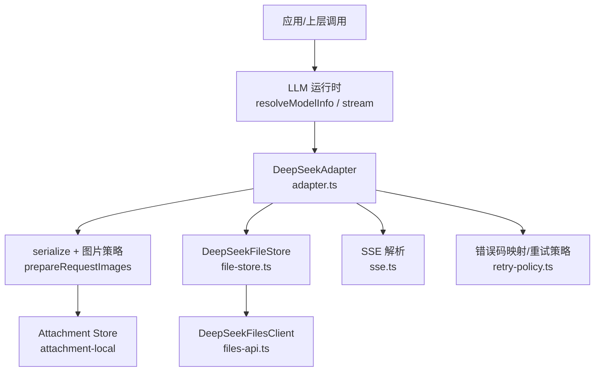
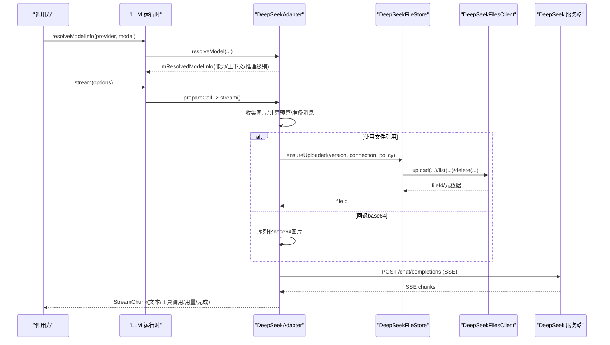
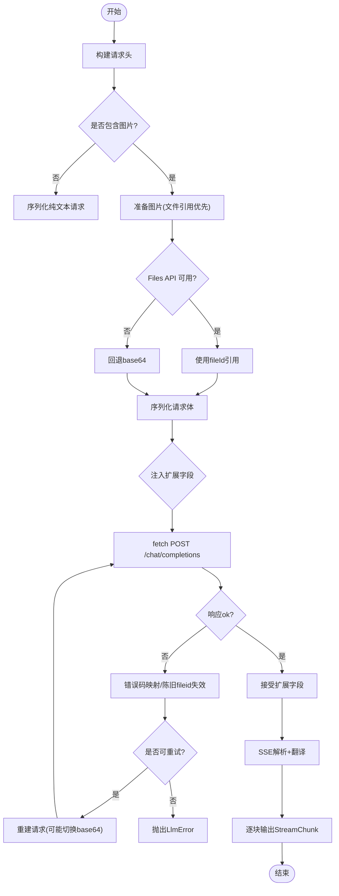
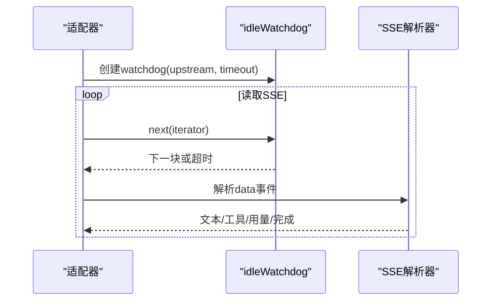
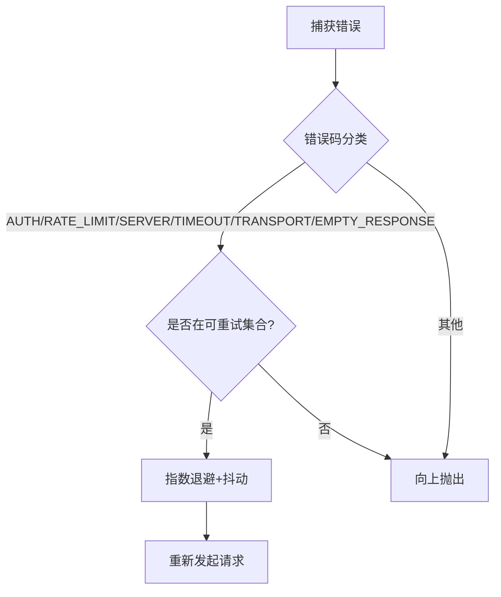
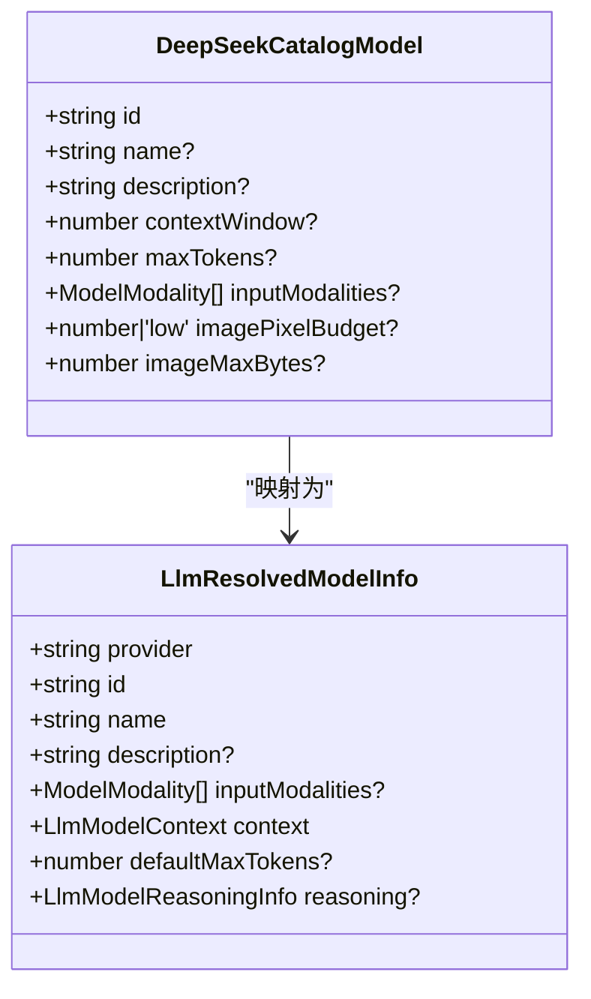
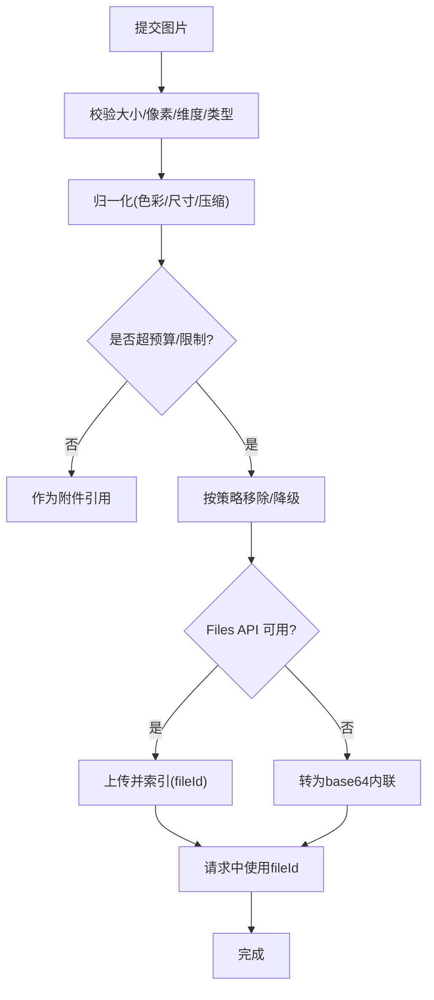
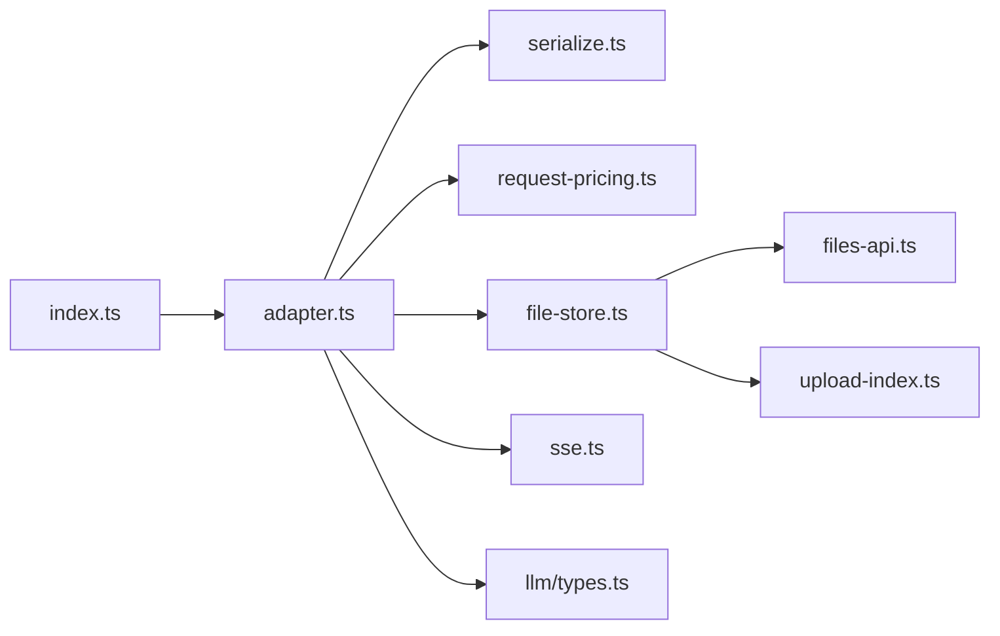

# 直接HTTP调用适配器

<cite>
**本文引用的文件**
- [adapter.ts](file://packages/llm/llm-deepseek/src/adapter.ts)
- [index.ts](file://packages/llm/llm-deepseek/src/index.ts)
- [file-store.ts](file://packages/llm/llm-deepseek/src/file-store.ts)
- [files-api.ts](file://packages/llm/llm-deepseek/src/files-api.ts)
- [sse.ts](file://packages/llm/llm-deepseek/src/sse.ts)
- [types.ts](file://packages/llm/llm/src/types.ts)
- [retry-policy.ts](file://packages/llm/llm/src/retry-policy.ts)
- [store.ts](file://packages/attachment/attachment-local/src/store.ts)
- [index.ts](file://packages/attachment/attachment-local/src/index.ts)
</cite>

## 目录
1. [简介](#简介)
2. [项目结构](#项目结构)
3. [核心组件](#核心组件)
4. [架构总览](#架构总览)
5. [详细组件分析](#详细组件分析)
6. [依赖关系分析](#依赖关系分析)
7. [性能考量](#性能考量)
8. [故障排查指南](#故障排查指南)
9. [结论](#结论)
10. [附录：构建类似HTTP适配器的步骤与示例路径](#附录构建类似http适配器的步骤与示例路径)

## 简介
本文件面向“直接HTTP调用适配器”的实现，聚焦 DeepSeek 适配器的 HTTP 请求构建、流式响应处理、错误重试机制；深入解释 resolveModel 接口的实现（模型元数据获取、能力探测、推理级别映射）；说明提供商特定配置管理（API 密钥处理、请求限流与重试策略）；并介绍文件上传与处理机制（图片优化、大小限制、存储策略）。文末提供完整代码示例路径，帮助读者构建类似的 HTTP 适配器。

## 项目结构
DeepSeek 直接 HTTP 适配器位于 llm-deepseek 包中，围绕以下关键模块组织：
- 适配器主类与流式调用：adapter.ts
- 插件注册与配置解析：index.ts
- 文件存储与复用：file-store.ts
- Files API 客户端：files-api.ts
- SSE 解析器：sse.ts
- LLM 通用类型与重试策略：types.ts、retry-policy.ts
- 本地附件存储与图片规范化：attachment-local store.ts、index.ts

图表来源
- [adapter.ts:446-708](file://packages/llm/llm-deepseek/src/adapter.ts#L446-L708)
- [file-store.ts:142-234](file://packages/llm/llm-deepseek/src/file-store.ts#L142-L234)
- [files-api.ts:176-256](file://packages/llm/llm-deepseek/src/files-api.ts#L176-L256)
- [sse.ts:28-40](file://packages/llm/llm-deepseek/src/sse.ts#L28-L40)
- [retry-policy.ts:149-196](file://packages/llm/llm/src/retry-policy.ts#L149-L196)

章节来源
- [adapter.ts:1-711](file://packages/llm/llm-deepseek/src/adapter.ts#L1-L711)
- [index.ts:85-504](file://packages/llm/llm-deepseek/src/index.ts#L85-L504)

## 核心组件
- DeepSeekAdapter：基于 fetch + SSE 的 OpenAI 兼容 chat-completions 端点适配器，负责请求构建、图片处理、SSE 流式消费、错误码映射与重试配合。
- DeepSeekFileStore：对 DeepSeek Files API 的上传复用、失效与配额恢复，支持并发合并、过期刷新、配额清理。
- DeepSeekFilesClient：OpenAI 兼容 /files 传输层，封装上传、列表、检索、删除等。
- SSE 解析器：严格遵循 SSE 协议，产出 data 事件并在收到 [DONE] 后结束。
- 重试策略：可配置的 normal/always 模式，带指数退避与抖动，默认重试空响应、限流、服务端错误、超时与传输错误。
- 附件与图片处理：本地附件服务负责图片解码、归一化、尺寸/像素限制与压缩，适配器按模型预算进行 offload 或 base64 回退。

章节来源
- [adapter.ts:355-711](file://packages/llm/llm-deepseek/src/adapter.ts#L355-L711)
- [file-store.ts:110-332](file://packages/llm/llm-deepseek/src/file-store.ts#L110-L332)
- [files-api.ts:127-258](file://packages/llm/llm-deepseek/src/files-api.ts#L127-L258)
- [sse.ts:1-41](file://packages/llm/llm-deepseek/src/sse.ts#L1-L41)
- [retry-policy.ts:1-196](file://packages/llm/llm/src/retry-policy.ts#L1-L196)
- [store.ts:92-124](file://packages/attachment/attachment-local/src/store.ts#L92-L124)
- [index.ts:172-198](file://packages/attachment/attachment-local/src/index.ts#L172-L198)

## 架构总览
适配器通过插件注册到 LLM 运行时，暴露 deepseek-official 路由。每次调用时，插件会解析配置快照（baseURL、模型目录、流空闲超时、图片预算等），并按需从凭据服务读取 API Key。请求体由序列化器生成，图片优先走 Files API 引用，失败则回退为 base64。响应以 SSE 流形式消费，错误被映射为稳定错误码，并由重试策略决定是否重试。

图表来源
- [adapter.ts:387-444](file://packages/llm/llm-deepseek/src/adapter.ts#L387-L444)
- [adapter.ts:446-708](file://packages/llm/llm-deepseek/src/adapter.ts#L446-L708)
- [file-store.ts:142-234](file://packages/llm/llm-deepseek/src/file-store.ts#L142-L234)
- [files-api.ts:176-256](file://packages/llm/llm-deepseek/src/files-api.ts#L176-L256)

## 详细组件分析

### 适配器主流程与HTTP请求构建
- 请求头：包含授权、内容类型、接受SSE、用户ID、会话ID、用途标记及可选 TDAI 头部。
- 图片处理：先尝试以文件引用发送，若失败或超限则回退 base64；按模型预算与限制进行 offload。
- 扩展字段：在发送前允许产品注入顶层字段（如 dsh_session_log、dsh_plugin_packages），并与基础请求冲突检测。
- 网络调用：POST 到 baseURL/chat/completions，携带 JSON 负载，信号控制取消与超时。
- 非2xx响应：解析 provider 错误细节，映射为稳定错误码；若检测到陈旧 file id，则失效并重试一次。
- 成功响应：接受扩展字段后，进入 SSE 流式翻译输出。

图表来源
- [adapter.ts:524-708](file://packages/llm/llm-deepseek/src/adapter.ts#L524-L708)
- [sse.ts:28-40](file://packages/llm/llm-deepseek/src/sse.ts#L28-L40)

章节来源
- [adapter.ts:524-708](file://packages/llm/llm-deepseek/src/adapter.ts#L524-L708)

### 流式响应处理与空闲超时
- 使用 idleWatchdog 监控单次读取的空闲时间，超过阈值抛出 TIMEOUT。
- 将上游 AbortSignal 与内部控制器组合，确保取消传播。
- SSE 解析器严格等待 [DONE]，否则视为 STREAM_CLOSED。

图表来源
- [adapter.ts:446-522](file://packages/llm/llm-deepseek/src/adapter.ts#L446-L522)
- [sse.ts:28-40](file://packages/llm/llm-deepseek/src/sse.ts#L28-L40)

章节来源
- [adapter.ts:446-522](file://packages/llm/llm-deepseek/src/adapter.ts#L446-L522)
- [sse.ts:1-41](file://packages/llm/llm-deepseek/src/sse.ts#L1-L41)

### 错误码映射与重试机制
- HTTP 状态映射：AUTH(401/403)、INVALID_REQUEST(413/400特定)、QUOTA、RATE_LIMIT(429)、CONTEXT_WINDOW_EXCEEDED、SERVER(5xx)、其他 HTTP_<status>。
- 传输/中止/超时：TRANSPORT、ABORTED、TIMEOUT。
- 扩展字段准备/冲突：REQUEST_EXTENSION。
- 协议违规：STREAM_CLOSED、MALFORMED_RESPONSE。
- 空响应终止：EMPTY_RESPONSE（默认策略会重试）。
- 重试策略：normal 模式按可重试码与最大次数重试；always 模式持续重试直到成功/取消/生命周期结束；均支持指数退避与抖动。

图表来源
- [adapter.ts:334-346](file://packages/llm/llm-deepseek/src/adapter.ts#L334-L346)
- [retry-policy.ts:149-196](file://packages/llm/llm/src/retry-policy.ts#L149-L196)

章节来源
- [adapter.ts:334-346](file://packages/llm/llm-deepseek/src/adapter.ts#L334-L346)
- [retry-policy.ts:1-196](file://packages/llm/llm/src/retry-policy.ts#L1-L196)

### resolveModel 接口：模型元数据、能力探测与推理级别映射
- 模型目录：来自配置 models 数组，包含 id、name、description、contextWindow、maxTokens、inputModalities、imagePixelBudget、imageMaxBytes。
- 能力探测：若未声明 image 输入模态，则视为 text-only，避免持久化无法被接受的图片输入。
- 推理级别映射：根据 thinking 开关与 defaults.reasoningEffort 映射为 off/low/high/max，并提供展示名称与描述。
- 返回结构：LlmResolvedModelInfo 包含 provider、id、name、description、inputModalities、contextWindow、defaultMaxTokens、reasoning.efforts/defaultEffort。

图表来源
- [adapter.ts:303-432](file://packages/llm/llm-deepseek/src/adapter.ts#L303-L432)
- [types.ts:298-347](file://packages/llm/llm/src/types.ts#L298-L347)

章节来源
- [adapter.ts:387-432](file://packages/llm/llm-deepseek/src/adapter.ts#L387-L432)
- [types.ts:298-347](file://packages/llm/llm/src/types.ts#L298-L347)

### 提供商特定配置管理：API密钥、请求限流与重试策略
- API 密钥：通过 credentialRef 指向环境变量名，每次请求从凭据服务或环境解析；缺失时报 MISSING_CREDENTIAL，格式错误报 INVALID_CREDENTIAL。
- baseURL：优先使用配置，其次受信任环境层 DEEPSEEK_BASE_URL，最后回退公共端点。
- 请求限流：适配器自身不实现令牌桶，但通过 retry-after 头解析延迟，并结合重试策略的指数退避与抖动。
- 重试策略：normal/always 两种模式，支持初始延迟、最大延迟、抖动比例；默认重试空响应、限流、服务端错误、超时与传输错误。

章节来源
- [index.ts:126-165](file://packages/llm/llm-deepseek/src/index.ts#L126-L165)
- [index.ts:295-404](file://packages/llm/llm-deepseek/src/index.ts#L295-L404)
- [index.ts:431-452](file://packages/llm/llm-deepseek/src/index.ts#L431-L452)
- [retry-policy.ts:149-196](file://packages/llm/llm/src/retry-policy.ts#L149-L196)

### 文件上传与处理：图片优化、大小限制与存储策略
- 图片规范化：本地附件服务解码、校验、归一化，限制字节数、像素数、维度与媒体类型，输出不可变引用与标准化后的字节。
- 预算与Offload：按模型 imagePixelBudget/imageMaxBytes 与每请求限制进行 offload，超出则移除图片或回退 base64。
- Files API 上传：文件名含哈希片段，支持过期时间、刷新窗口；并发调用共享同一上传；配额不足时自动删除最旧的 harness 自有文件并重试。
- 失效与释放：当提供方拒绝 file id（过期/不存在/无效），适配器失效对应映射并尝试 base64 回退；也可主动 release/releaseAll 清理。

图表来源
- [store.ts:92-124](file://packages/attachment/attachment-local/src/store.ts#L92-L124)
- [index.ts:172-198](file://packages/attachment/attachment-local/src/index.ts#L172-L198)
- [file-store.ts:142-234](file://packages/llm/llm-deepseek/src/file-store.ts#L142-L234)
- [files-api.ts:176-256](file://packages/llm/llm-deepseek/src/files-api.ts#L176-L256)

章节来源
- [store.ts:92-124](file://packages/attachment/attachment-local/src/store.ts#L92-L124)
- [index.ts:172-198](file://packages/attachment/attachment-local/src/index.ts#L172-L198)
- [file-store.ts:110-332](file://packages/llm/llm-deepseek/src/file-store.ts#L110-L332)
- [files-api.ts:1-258](file://packages/llm/llm-deepseek/src/files-api.ts#L1-L258)

## 依赖关系分析
- adapter.ts 依赖 serialize、request-pricing、file-store、sse、translate 以及 LLM 通用类型与错误。
- index.ts 负责插件注册、配置解析、凭据与环境变量注入、重试策略解析与动态替换。
- file-store.ts 依赖 files-api.ts 与 upload-index.ts，实现上传复用与配额恢复。
- files-api.ts 封装 /files 端点的上传、列表、检索、删除，统一错误分类。
- sse.ts 提供严格的 SSE 解析，保证流完整性。
- types.ts 定义统一的流式块、完成原因、模型信息与重试策略接口。
- retry-policy.ts 提供可配置的退避与重试行为。

图表来源
- [adapter.ts:11-47](file://packages/llm/llm-deepseek/src/adapter.ts#L11-L47)
- [index.ts:14-83](file://packages/llm/llm-deepseek/src/index.ts#L14-L83)
- [file-store.ts:1-9](file://packages/llm/llm-deepseek/src/file-store.ts#L1-L9)
- [files-api.ts:1-8](file://packages/llm/llm-deepseek/src/files-api.ts#L1-L8)

章节来源
- [adapter.ts:1-711](file://packages/llm/llm-deepseek/src/adapter.ts#L1-L711)
- [index.ts:1-504](file://packages/llm/llm-deepseek/src/index.ts#L1-L504)
- [file-store.ts:1-332](file://packages/llm/llm-deepseek/src/file-store.ts#L1-L332)
- [files-api.ts:1-258](file://packages/llm/llm-deepseek/src/files-api.ts#L1-L258)
- [sse.ts:1-41](file://packages/llm/llm-deepseek/src/sse.ts#L1-L41)
- [types.ts:1-444](file://packages/llm/llm/src/types.ts#L1-L444)
- [retry-policy.ts:1-196](file://packages/llm/llm/src/retry-policy.ts#L1-L196)

## 性能考量
- 图片预算与 offload：按模型 imagePixelBudget/imageMaxBytes 与每请求限制进行图片裁剪与 offload，减少请求体积与成本。
- 并发上传合并：ensureUploaded 对相同版本图片的并发调用合并为一次上传，降低重复开销。
- 流空闲超时：idleWatchdog 防止长时间无活动导致资源占用。
- 重试退避：指数退避与抖动避免雪崩，结合 provider 的 retry-after 提升稳定性。
- 本地附件压缩：可配置压缩并发度，平衡吞吐与CPU占用。

[本节为通用指导，无需具体文件引用]

## 故障排查指南
- 认证失败：检查 credentials 或环境变量是否正确设置；错误码 AUTH。
- 配额/存储限制：Files API 配额不足时会自动清理旧文件并重试；错误码 FILES_API/QUOTA。
- 图片被拒绝：若 provider 报告图像解码/处理失败，适配器会给出候选图片诊断信息；检查图片格式、尺寸与像素限制。
- 流中断：SSE 未收到 [DONE] 会抛 STREAM_CLOSED；检查网络与代理。
- 空响应：EMPTY_RESPONSE 默认会被重试；若频繁出现，检查服务端稳定性。
- 超时：TIMEOUT 表示流空闲超时；调整 streamIdleTimeoutMs 或检查下游处理速度。

章节来源
- [adapter.ts:334-346](file://packages/llm/llm-deepseek/src/adapter.ts#L334-L346)
- [adapter.ts:661-707](file://packages/llm/llm-deepseek/src/adapter.ts#L661-L707)
- [sse.ts:28-40](file://packages/llm/llm-deepseek/src/sse.ts#L28-L40)
- [files-api.ts:37-68](file://packages/llm/llm-deepseek/src/files-api.ts#L37-L68)

## 结论
DeepSeek 直接 HTTP 适配器通过清晰的配置解析、健壮的请求构建与流式处理、完善的错误码映射与重试策略，以及与 Files API 和附件服务的深度集成，提供了高可靠、高性能且可扩展的模型调用能力。其模块化设计便于复用到其他提供商的 HTTP 适配器实现。

[本节为总结性内容，无需具体文件引用]

## 附录：构建类似HTTP适配器的步骤与示例路径
- 定义适配器类与选项：参考 adapter.ts 中的 DeepSeekAdapterOptions 与构造函数，注入 options、resolveApiKey、resolveUserId、resolveAttachments、prepareExtensions 等钩子。
- 实现 listModels/resolveModel：参考 adapter.ts 的 listModels 与 resolveModel，返回 LlmModelInfo/LlmResolvedModelInfo，包含能力与推理级别。
- 实现 prepareCall/stream：参考 adapter.ts 的 prepareCall 与 streamWithConnection，组装请求头、处理图片、调用 fetch 并消费 SSE。
- 构建请求体与图片策略：参考 serialize.ts 与 request-pricing.ts，按模型预算与限制进行 offload/base64 回退。
- 文件上传与复用：参考 file-store.ts 与 files-api.ts，实现 ensureUploaded、invalidate、release、reclaimOldestOwned。
- SSE 解析与活动心跳：参考 sse.ts 与 idleWatchdog，确保流完整性与空闲超时。
- 错误码映射与重试：参考 adapter.ts 的 httpErrorCode 与 retry-policy.ts 的 resolveRetryPolicy，统一错误分类与重试行为。
- 插件注册与配置：参考 index.ts 的 apply/resolveAdapterOptions，注册 configurable provider，注入凭据与环境变量，动态替换重试策略。

示例路径
- 适配器主类与流式调用：[adapter.ts:355-711](file://packages/llm/llm-deepseek/src/adapter.ts#L355-L711)
- 插件注册与配置解析：[index.ts:295-504](file://packages/llm/llm-deepseek/src/index.ts#L295-L504)
- 文件存储与复用：[file-store.ts:110-332](file://packages/llm/llm-deepseek/src/file-store.ts#L110-L332)
- Files API 客户端：[files-api.ts:127-258](file://packages/llm/llm-deepseek/src/files-api.ts#L127-L258)
- SSE 解析器：[sse.ts:28-40](file://packages/llm/llm-deepseek/src/sse.ts#L28-L40)
- 重试策略：[retry-policy.ts:149-196](file://packages/llm/llm/src/retry-policy.ts#L149-L196)
- 图片规范化与限制：[store.ts:92-124](file://packages/attachment/attachment-local/src/store.ts#L92-L124), [index.ts:172-198](file://packages/attachment/attachment-local/src/index.ts#L172-L198)