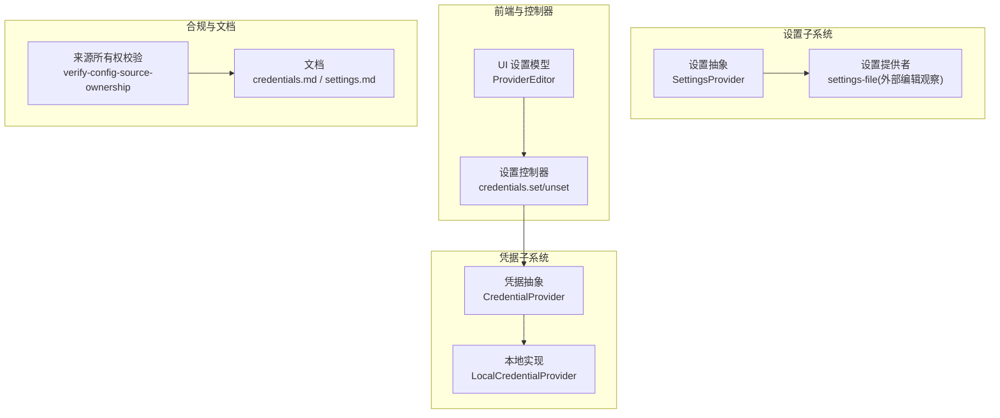
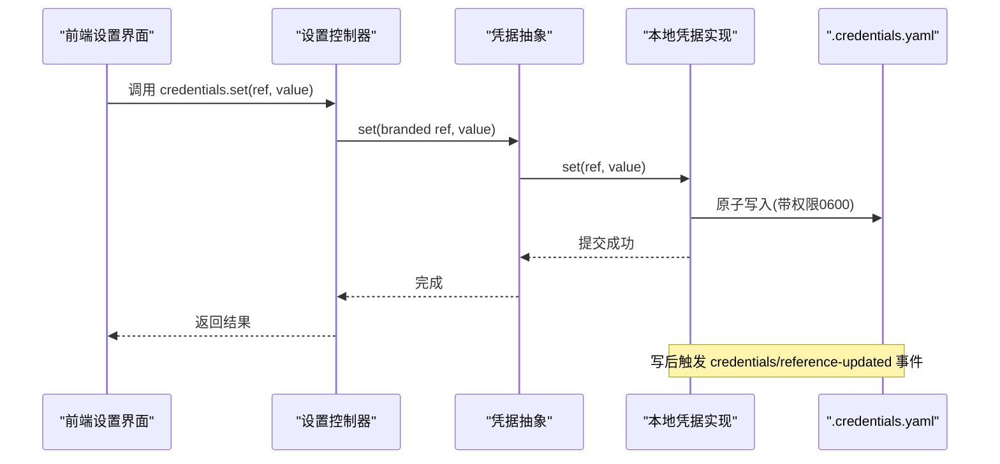
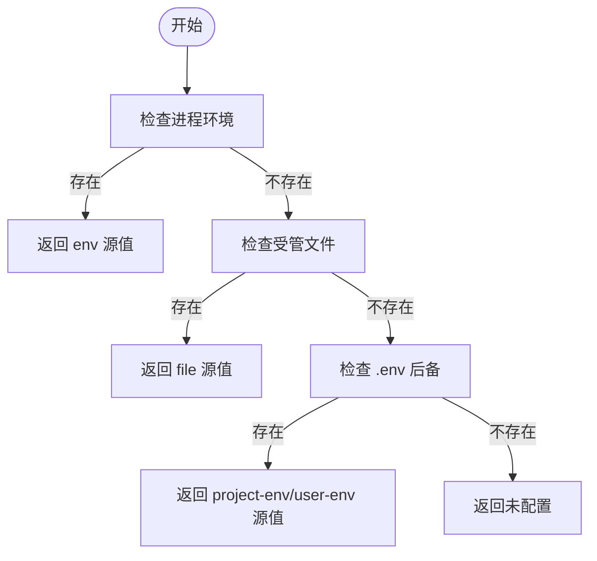
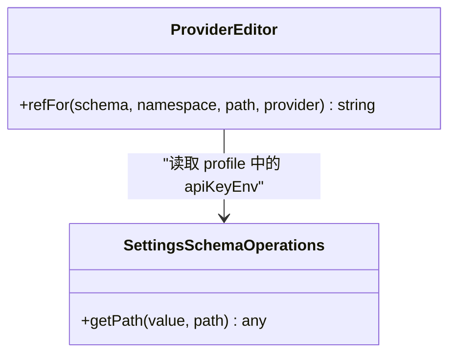
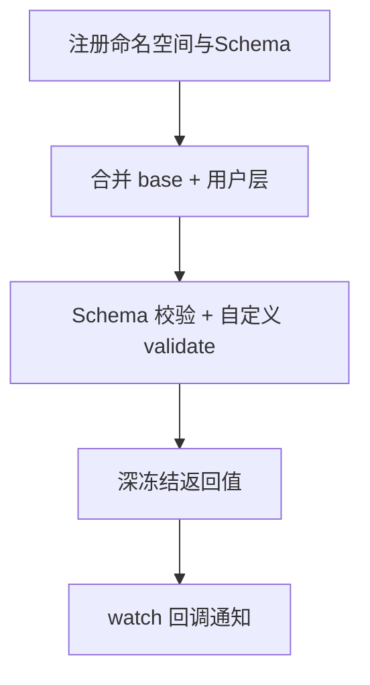
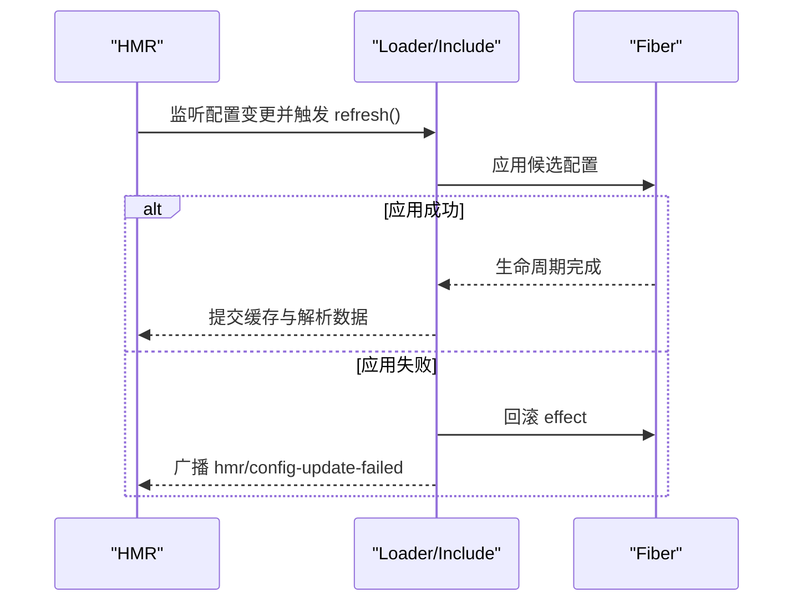
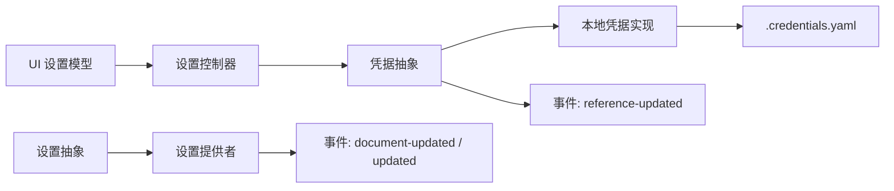

# 配置管理与安全

<cite>
**本文引用的文件**
- [packages/credentials/credentials/src/index.ts](file://packages/credentials/credentials/src/index.ts)
- [packages/credentials/credentials-local/src/index.ts](file://packages/credentials/credentials-local/src/index.ts)
- [packages/api/settings-controller/src/credentials.ts](file://packages/api/settings-controller/src/credentials.ts)
- [packages/settings/settings/src/index.ts](file://packages/settings/settings/src/index.ts)
- [packages/client/ui-settings-models/src/client/ProviderEditor.tsx](file://packages/client/ui-settings-models/src/client/ProviderEditor.tsx)
- [scripts/verify-config-source-ownership.ts](file://scripts/verify-config-source-ownership.ts)
- [.agents/notes/implemented/architecture/2026-08-04-configuration-source-ownership.md](file://.agents/notes/implemented/architecture/2026-08-04-configuration-source-ownership.md)
- [.agents/notes/implemented/architecture/2026-08-04-configuration-source-ownership.zh.md](file://.agents/notes/implemented/architecture/2026-08-04-configuration-source-ownership.zh.md)
- [.agents/notes/implemented/architecture/2026-08-04-credentials-yaml-and-user-environment-layer.zh.md](file://.agents/notes/implemented/architecture/2026-08-04-credentials-yaml-and-user-environment-layer.zh.md)
- [apps/cli/config/examples/cordis/cordis.yml](file://apps/cli/config/examples/cordis/cordis.yml)
- [packages/boot/app-boot/tests/user-patches.spec.ts](file://packages/boot/app-boot/tests/user-patches.spec.ts)
- [docs/subsystems/credentials.md](file://docs/subsystems/credentials.md)
- [docs/subsystems/settings.md](file://docs/subsystems/settings.md)
</cite>

## 目录
1. [简介](#简介)
2. [项目结构](#项目结构)
3. [核心组件](#核心组件)
4. [架构总览](#架构总览)
5. [详细组件分析](#详细组件分析)
6. [依赖关系分析](#依赖关系分析)
7. [性能考量](#性能考量)
8. [故障排查指南](#故障排查指南)
9. [结论](#结论)
10. [附录](#附录)

## 简介
本文件聚焦于“配置管理与安全”，围绕以下目标展开：
- 提供商特定的配置管理：API 密钥处理、环境变量注入、配置文件结构。
- 凭证系统使用：credentialRef 的使用、密钥轮换与安全存储。
- 配置验证机制：Schema 验证、默认值处理、配置继承。
- 运行时配置更新：热重载、配置回滚与错误恢复。
- 不同环境下的最佳实践与安全建议。

该仓库通过“凭据缝（credentials seam）”和“设置缝（settings seam）”将敏感信息与可配置项解耦，采用分层解析、严格 Schema 校验、原子写入与事件驱动的热重载，确保在 CI、容器、本地开发等多环境下的一致性与安全性。

## 项目结构
与配置和安全相关的核心代码分布在以下模块：
- 凭据抽象与本地实现：定义凭据引用、解析顺序、持久化与热重载。
- 设置抽象与提供者：定义命名空间、Schema、默认值、用户层与组合层叠加。
- 前端 UI 设置模型：用于生成 provider 的 apiKeyEnv 引用。
- 合规检查脚本：禁止在已交付配置中内联环境变量。
- 文档与示例：说明分层优先级、热重载行为与示例配置。

图表来源
- [packages/credentials/credentials/src/index.ts:170-317](file://packages/credentials/credentials/src/index.ts#L170-L317)
- [packages/credentials/credentials-local/src/index.ts:512-800](file://packages/credentials/credentials-local/src/index.ts#L512-L800)
- [packages/settings/settings/src/index.ts:419-459](file://packages/settings/settings/src/index.ts#L419-L459)
- [packages/api/settings-controller/src/credentials.ts:92-118](file://packages/api/settings-controller/src/credentials.ts#L92-L118)
- [scripts/verify-config-source-ownership.ts:24-55](file://scripts/verify-config-source-ownership.ts#L24-L55)
- [docs/subsystems/credentials.md:1-330](file://docs/subsystems/credentials.md#L1-L330)
- [docs/subsystems/settings.md:1-406](file://docs/subsystems/settings.md#L1-L406)

章节来源
- [packages/credentials/credentials/src/index.ts:170-317](file://packages/credentials/credentials/src/index.ts#L170-L317)
- [packages/credentials/credentials-local/src/index.ts:512-800](file://packages/credentials/credentials-local/src/index.ts#L512-L800)
- [packages/settings/settings/src/index.ts:419-459](file://packages/settings/settings/src/index.ts#L419-L459)
- [packages/api/settings-controller/src/credentials.ts:92-118](file://packages/api/settings-controller/src/credentials.ts#L92-L118)
- [scripts/verify-config-source-ownership.ts:24-55](file://scripts/verify-config-source-ownership.ts#L24-L55)
- [docs/subsystems/credentials.md:1-330](file://docs/subsystems/credentials.md#L1-L330)
- [docs/subsystems/settings.md:1-406](file://docs/subsystems/settings.md#L1-L406)

## 核心组件
- 凭据抽象（CredentialProvider）：提供 resolve/describe/set/unset/record 操作，保证每次调用重新解析，支持热更新；空值视为未配置。
- 本地凭据实现（LocalCredentialProvider）：以 $DSH_HOME/.credentials.yaml 为受管存储，按优先级解析：进程环境 > 受管文件 > 项目 .env > 用户 .env；支持原子写入、跨进程锁、热重载。
- 设置抽象（SettingsProvider）：注册命名空间与 Schema，合并 base（组合层）与用户层，支持 validate、watch、update/replace/mutate、描述与红脱敏。
- 设置控制器（CredentialsController）：暴露 set/unset 等远程接口，仅单向传输秘密值，进行请求校验与拒绝映射。
- UI ProviderEditor：根据 profile 中的 apiKeyEnv 推导或覆盖 credentialRef，便于前端编辑并落盘。
- 来源所有权校验：禁止在已交付配置中直接内联环境变量，强制走适配器与凭据层。

章节来源
- [packages/credentials/credentials/src/index.ts:170-317](file://packages/credentials/credentials/src/index.ts#L170-L317)
- [packages/credentials/credentials-local/src/index.ts:512-800](file://packages/credentials/credentials-local/src/index.ts#L512-L800)
- [packages/settings/settings/src/index.ts:419-459](file://packages/settings/settings/src/index.ts#L419-L459)
- [packages/api/settings-controller/src/credentials.ts:92-118](file://packages/api/settings-controller/src/credentials.ts#L92-L118)
- [packages/client/ui-settings-models/src/client/ProviderEditor.tsx:139-151](file://packages/client/ui-settings-models/src/client/ProviderEditor.tsx#L139-L151)
- [scripts/verify-config-source-ownership.ts:24-55](file://scripts/verify-config-source-ownership.ts#L24-L55)

## 架构总览
下图展示从 UI 到凭据存储的完整路径，以及设置系统的注册与解析流程。

图表来源
- [packages/api/settings-controller/src/credentials.ts:92-118](file://packages/api/settings-controller/src/credentials.ts#L92-L118)
- [packages/credentials/credentials/src/index.ts:170-317](file://packages/credentials/credentials/src/index.ts#L170-L317)
- [packages/credentials/credentials-local/src/index.ts:641-787](file://packages/credentials/credentials-local/src/index.ts#L641-L787)

## 详细组件分析

### 凭据系统与密钥轮换
- 引用与键：CredentialRef 是 POSIX 风格的环境变量名；CredentialKey 是 <scope>/<id> 形式的记录地址，用于插件自有凭据记录。
- 解析顺序（本地实现）：进程环境（只读且最高优先）> 受管文件 > 项目 .env > 用户 .env。空值一律视为未配置。
- 写入与锁定：所有写操作进入串行队列，使用文件级独占锁，避免并发冲突；写入前校验字段合法性，失败不落地。
- 热重载：文件监听 + 去抖刷新，外部编辑也能即时生效；事件 credentials/reference-updated 通知观察者。
- 密钥轮换：通过 modifyRecord 对记录进行序列化读写，支持跨进程安全地刷新令牌；读取时每次操作重新解析，无需重启。

图表来源
- [packages/credentials/credentials-local/src/index.ts:617-639](file://packages/credentials/credentials-local/src/index.ts#L617-L639)

章节来源
- [packages/credentials/credentials/src/index.ts:170-317](file://packages/credentials/credentials/src/index.ts#L170-L317)
- [packages/credentials/credentials-local/src/index.ts:512-800](file://packages/credentials/credentials-local/src/index.ts#L512-L800)
- [docs/subsystems/credentials.md:1-330](file://docs/subsystems/credentials.md#L1-L330)

### 提供商特定配置与 API 密钥处理
- apiKeyEnv：在 provider profile 中可通过 apiKeyEnv 指定凭据引用名称；若未显式设置，则按 provider 派生默认引用。
- 来源所有权校验：已交付配置不得内联环境变量，必须通过适配器与凭据层解析，确保部署层语义清晰。
- 非机密配置分层：非机密值遵循统一顺序（运行期显式 > 用户设置 > 组合 > 进程环境 > 发现文件 > 默认值），但凭据保持独立更窄的顺序。

图表来源
- [packages/client/ui-settings-models/src/client/ProviderEditor.tsx:139-151](file://packages/client/ui-settings-models/src/client/ProviderEditor.tsx#L139-L151)

章节来源
- [packages/client/ui-settings-models/src/client/ProviderEditor.tsx:139-151](file://packages/client/ui-settings-models/src/client/ProviderEditor.tsx#L139-L151)
- [scripts/verify-config-source-ownership.ts:24-55](file://scripts/verify-config-source-ownership.ts#L24-L55)
- [.agents/notes/implemented/architecture/2026-08-04-configuration-source-ownership.md:17-69](file://.agents/notes/implemented/architecture/2026-08-04-configuration-source-ownership.md#L17-L69)
- [.agents/notes/implemented/architecture/2026-08-04-configuration-source-ownership.zh.md:17-72](file://.agents/notes/implemented/architecture/2026-08-04-configuration-source-ownership.zh.md#L17-L72)

### 配置文件结构与 Schema 验证
- 设置命名空间：每个插件注册一个命名空间与 Schema，支持 base（组合层）和用户层叠加，最终由 Schema 校验并冻结返回值。
- 默认值与继承：resolve 先应用 Schema 默认值，再合并 base，最后叠加用户层；validate 可在 Schema 之外做跨字段校验。
- 描述与红脱敏：describe 输出 schema、value、base、user、secrets 等信息，wire 面必须开启 redactSecrets 以隐藏敏感字段。
- 变更事件：settings/updated 在持久化或发布后发出，settings/document-updated 反映原始用户段变化（即使解析值未变）。

图表来源
- [packages/settings/settings/src/index.ts:419-459](file://packages/settings/settings/src/index.ts#L419-L459)
- [packages/settings/settings/src/index.ts:739-766](file://packages/settings/settings/src/index.ts#L739-L766)
- [docs/subsystems/settings.md:1-406](file://docs/subsystems/settings.md#L1-L406)

章节来源
- [packages/settings/settings/src/index.ts:419-459](file://packages/settings/settings/src/index.ts#L419-L459)
- [packages/settings/settings/src/index.ts:739-766](file://packages/settings/settings/src/index.ts#L739-L766)
- [docs/subsystems/settings.md:1-406](file://docs/subsystems/settings.md#L1-L406)

### 运行时配置更新：热重载、回滚与错误恢复
- 凭据文件热重载：chokidar 监听 .credentials.yaml，去抖后串行刷新；写入失败会记录日志但不中断队列。
- 设置 HMR：用户补丁与 Include 配置更新具备事务性，失败会回滚并广播 hmr/config-update-failed 事件，不影响正在运行的会话。
- 回滚策略：候选项应用失败会 dispose 并恢复先前配置；组内对账失败会还原新增/移除/移动项。

图表来源
- [packages/boot/app-boot/tests/user-patches.spec.ts:355-381](file://packages/boot/app-boot/tests/user-patches.spec.ts#L355-L381)
- [.agents/notes/implemented/bug-fix/2026-07-20-config-hot-reload-resilience.zh.md:1-37](file://.agents/notes/implemented/bug-fix/2026-07-20-config-hot-reload-resilience.zh.md#L1-L37)

章节来源
- [packages/credentials/credentials-local/src/index.ts:728-750](file://packages/credentials/credentials-local/src/index.ts#L728-L750)
- [packages/boot/app-boot/tests/user-patches.spec.ts:355-381](file://packages/boot/app-boot/tests/user-patches.spec.ts#L355-L381)
- [.agents/notes/implemented/bug-fix/2026-07-20-config-hot-reload-resilience.zh.md:1-37](file://.agents/notes/implemented/bug-fix/2026-07-20-config-hot-reload-resilience.zh.md#L1-L37)

### 不同环境的最佳实践与安全建议
- 进程环境（CI/容器）：适合放置一次性或强覆盖的密钥；由于只读且最高优先，UI 无法覆盖，需明确标注。
- 受管文件（$DSH_HOME/.credentials.yaml）：推荐作为长期密钥存储；权限必须为 0600，避免被其他用户读取。
- .env 后备：仅作为发现文件的后备，不应承载生产密钥；项目 .env 优先于用户 .env。
- 已交付配置：禁止内联环境变量；通过适配器与凭据层解析，确保部署层语义清晰。
- 设置与组合：非机密配置遵循统一分层；组合层低于用户设置，因此需要压过用户设置的部署应自带 bin/loader 树或不挂载设置提供方。

章节来源
- [.agents/notes/implemented/architecture/2026-08-04-configuration-source-ownership.md:17-69](file://.agents/notes/implemented/architecture/2026-08-04-configuration-source-ownership.md#L17-L69)
- [.agents/notes/implemented/architecture/2026-08-04-configuration-source-ownership.zh.md:17-72](file://.agents/notes/implemented/architecture/2026-08-04-configuration-source-ownership.zh.md#L17-L72)
- [.agents/notes/implemented/architecture/2026-08-04-credentials-yaml-and-user-environment-layer.zh.md:28-30](file://.agents/notes/implemented/architecture/2026-08-04-credentials-yaml-and-user-environment-layer.zh.md#L28-L30)
- [apps/cli/config/examples/cordis/cordis.yml:1-20](file://apps/cli/config/examples/cordis/cordis.yml#L1-L20)

## 依赖关系分析
- 低耦合高内聚：凭据抽象与本地实现分离；设置抽象与提供者分离；UI 与控制器通过远程接口交互。
- 事件驱动：凭据与设置均通过事件通知变更，消费者按需订阅，避免轮询。
- 安全边界：敏感值单向传输（set/unset），描述接口不暴露值；文件权限与校验保障存储安全。

图表来源
- [packages/api/settings-controller/src/credentials.ts:92-118](file://packages/api/settings-controller/src/credentials.ts#L92-L118)
- [packages/credentials/credentials/src/index.ts:258-313](file://packages/credentials/credentials/src/index.ts#L258-L313)
- [packages/settings/settings/src/index.ts:739-766](file://packages/settings/settings/src/index.ts#L739-L766)

章节来源
- [packages/api/settings-controller/src/credentials.ts:92-118](file://packages/api/settings-controller/src/credentials.ts#L92-L118)
- [packages/credentials/credentials/src/index.ts:258-313](file://packages/credentials/credentials/src/index.ts#L258-L313)
- [packages/settings/settings/src/index.ts:739-766](file://packages/settings/settings/src/index.ts#L739-L766)

## 性能考量
- 解析与缓存：凭据每次操作重新解析，避免缓存过期问题；本地实现维护内存快照以减少频繁 IO。
- 文件锁与原子写：写操作使用文件锁与原子写入，防止并发损坏；等待时间合理设置以避免长时间阻塞。
- 事件与监听：事件分发包含失败隔离，单个监听器失败不影响整体提交；监听器异步失败被捕获并记录。
- HMR 去抖：文件监听使用去抖窗口，合并高频变更，减少重复刷新。

[本节为通用指导，不直接分析具体文件]

## 故障排查指南
- 凭据写入被拒绝：若进程环境存在同名变量，set/unset 会被拒绝（只读遮蔽）；需在启动 shell 中 unset。
- 文件权限错误：.credentials.yaml 权限非 0600 会导致启动失败；需修正权限。
- YAML 解析失败：文档版本或字段非法会抛出错误；修复后重试。
- HMR 更新失败：查看 hmr/config-update-failed 事件，定位失败原因并回滚；必要时撤销最近修改。
- 设置冲突：描述中包含 revision，写回时需携带 expectedRevision，冲突时会拒绝并提示。

章节来源
- [packages/credentials/credentials-local/src/index.ts:127-146](file://packages/credentials/credentials-local/src/index.ts#L127-L146)
- [packages/credentials/credentials-local/src/index.ts:794-800](file://packages/credentials/credentials-local/src/index.ts#L794-L800)
- [packages/credentials/credentials-local/src/index.ts:188-227](file://packages/credentials/credentials-local/src/index.ts#L188-L227)
- [packages/boot/app-boot/tests/user-patches.spec.ts:355-381](file://packages/boot/app-boot/tests/user-patches.spec.ts#L355-L381)
- [docs/subsystems/settings.md:100-153](file://docs/subsystems/settings.md#L100-L153)

## 结论
该仓库通过清晰的凭据与设置分层、严格的 Schema 校验、原子写入与事件驱动的热重载，实现了安全、可观测、可回滚的配置管理。建议在多环境中遵循既定优先级与权限规范，避免在已交付配置中内联环境变量，并通过 UI 与控制器进行安全的凭据与设置管理。

[本节为总结，不直接分析具体文件]

## 附录
- 示例配置：apps/cli/config/examples/cordis/cordis.yml 展示了如何以 patch overlay 方式覆盖 web 配置。
- 文档参考：docs/subsystems/credentials.md 与 docs/subsystems/settings.md 提供了完整的 API 与事件说明。

章节来源
- [apps/cli/config/examples/cordis/cordis.yml:1-20](file://apps/cli/config/examples/cordis/cordis.yml#L1-L20)
- [docs/subsystems/credentials.md:1-330](file://docs/subsystems/credentials.md#L1-L330)
- [docs/subsystems/settings.md:1-406](file://docs/subsystems/settings.md#L1-L406)