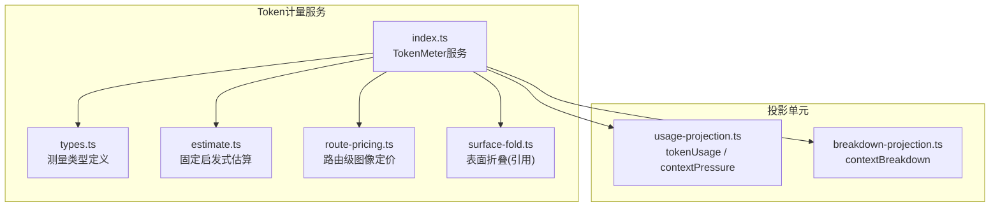
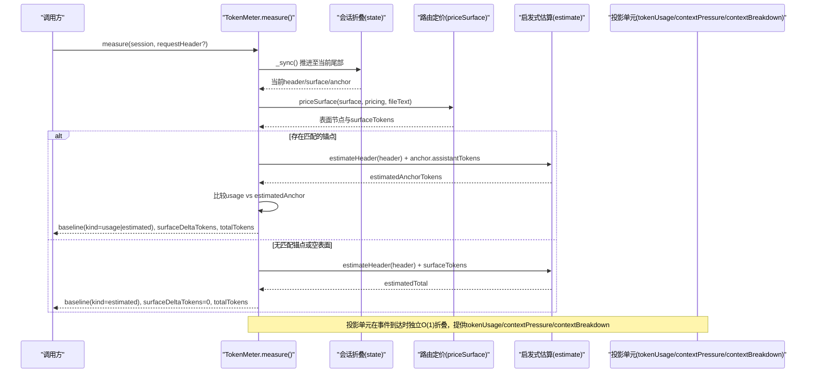
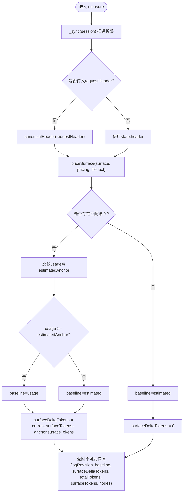
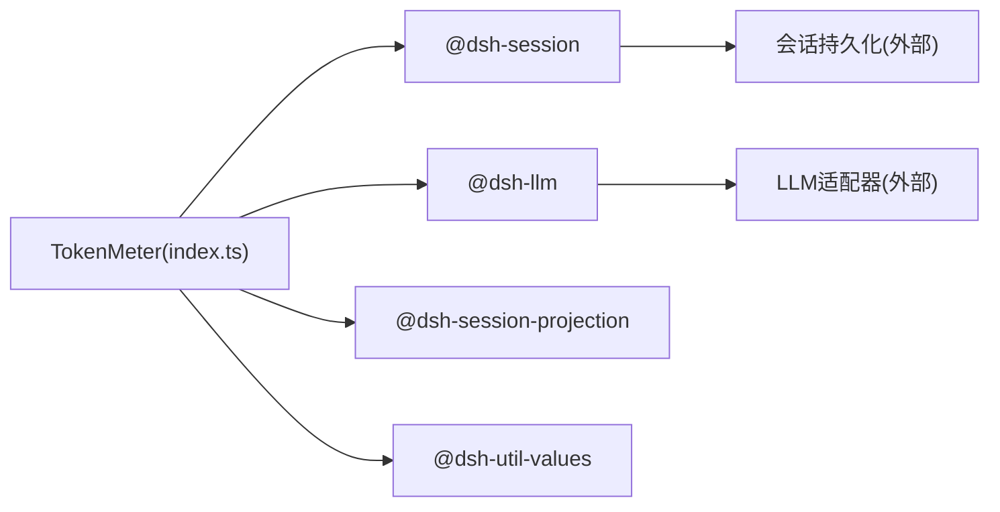

# Token计量与成本监控

<cite>
**本文引用的文件**
- [packages/llm/token-meter/src/index.ts](file://packages/llm/token-meter/src/index.ts)
- [packages/llm/token-meter/src/types.ts](file://packages/llm/token-meter/src/types.ts)
- [packages/llm/token-meter/src/estimate.ts](file://packages/llm/token-meter/src/estimate.ts)
- [packages/llm/token-meter/src/route-pricing.ts](file://packages/llm/token-meter/src/route-pricing.ts)
- [packages/llm/token-meter/src/usage-projection.ts](file://packages/llm/token-meter/src/usage-projection.ts)
- [packages/llm/token-meter/src/breakdown-projection.ts](file://packages/llm/token-meter/src/breakdown-projection.ts)
- [packages/llm/token-meter/README.md](file://packages/llm/token-meter/README.md)
- [docs/subsystems/token-meter.md](file://docs/subsystems/token-meter.md)
- [packages/llm/llm/src/error.ts](file://packages/llm/llm/src/error.ts)
- [apps/cli/tests/web-agent-presets.e2e.ts](file://apps/cli/tests/web-agent-presets.e2e.ts)
</cite>

## 目录
1. [简介](#简介)
2. [项目结构](#项目结构)
3. [核心组件](#核心组件)
4. [架构总览](#架构总览)
5. [详细组件分析](#详细组件分析)
6. [依赖关系分析](#依赖关系分析)
7. [性能考量](#性能考量)
8. [故障排查指南](#故障排查指南)
9. [结论](#结论)
10. [附录](#附录)

## 简介
本文件面向Token计量与成本监控，系统性说明以下能力：
- Token计量的准确性保证机制：基于可重放会话日志的“一次折叠、一个锚点”设计，支持实时计数、批量处理（按事件流推进）与精度控制（固定启发式+路由级图像定价+提供者用量锚定）。
- 成本监控实现原理：模型定价策略（路由级图像定价）、使用量统计（tokenUsage/contextPressure/contextBreakdown投影）、费用计算算法（baseline + surfaceDeltaTokens）。
- usage统计数据收集、存储与查询接口：通过session projections暴露只读视图。
- 成本分析与报告：预算控制、阈值告警、优化建议（结合上下文压力与组成分解）。
- 多租户场景下的资源隔离与计费分离：每会话独立折叠状态；宿主级tokenMeter实例避免跨会话污染。
- 可视化与告警配置示例：提供数据字段与集成方式，便于接入前端图表与告警系统。

## 项目结构
Token计量子系统位于@deepseek-ai/dsh-token-meter包中，核心由服务、估算器、表面折叠、投影单元与路由定价模块构成。

图示来源
- [packages/llm/token-meter/src/index.ts:100-122](file://packages/llm/token-meter/src/index.ts#L100-L122)
- [packages/llm/token-meter/src/estimate.ts:1-100](file://packages/llm/token-meter/src/estimate.ts#L1-L100)
- [packages/llm/token-meter/src/route-pricing.ts:23-49](file://packages/llm/token-meter/src/route-pricing.ts#L23-L49)
- [packages/llm/token-meter/src/usage-projection.ts:120-222](file://packages/llm/token-meter/src/usage-projection.ts#L120-L222)
- [packages/llm/token-meter/src/breakdown-projection.ts:58-89](file://packages/llm/token-meter/src/breakdown-projection.ts#L58-L89)

章节来源
- [packages/llm/token-meter/README.md:10-65](file://packages/llm/token-meter/README.md#L10-L65)
- [docs/subsystems/token-meter.md:1-30](file://docs/subsystems/token-meter.md#L1-L30)

## 核心组件
- TokenMeter服务：维护每个会话的折叠状态（已消费事件数、当前请求头、表面节点、步骤边界、锚点），对外暴露measure()与estimateMessage()。
- 固定启发式估算器：以“四字符=一token”加结构与角色开销估算文本/工具调用等，保证跨路由一致性与可重放确定性。
- 路由级图像定价：当适配器声明图像定价时，按视觉token+可见文本对图片进行精确计价；未声明则回退到固定启发式。
- 会话投影单元：
  - tokenUsage：聚合provider上报的input/cacheRead/cacheWrite/output tokens，并以“最后一次样本替换”语义更新。
  - contextPressure：prompt侧pressureTokens + 基于表面折叠的projectedTokens + 最新contextWindow。
  - contextBreakdown：system/tools/message三部分启发式组成。
- 测量基准与增量：baseline可为none/estimated/usage；surfaceDeltaTokens为相对锚点的有符号增量；totalTokens为非负压力值。

章节来源
- [packages/llm/token-meter/src/index.ts:144-189](file://packages/llm/token-meter/src/index.ts#L144-L189)
- [packages/llm/token-meter/src/types.ts:15-54](file://packages/llm/token-meter/src/types.ts#L15-L54)
- [packages/llm/token-meter/src/estimate.ts:12-100](file://packages/llm/token-meter/src/estimate.ts#L12-L100)
- [packages/llm/token-meter/src/route-pricing.ts:23-49](file://packages/llm/token-meter/src/route-pricing.ts#L23-L49)
- [packages/llm/token-meter/src/usage-projection.ts:14-50,77-89,120-153,176-222:14-50](file://packages/llm/token-meter/src/usage-projection.ts#L14-L50)
- [packages/llm/token-meter/src/breakdown-projection.ts:26-89](file://packages/llm/token-meter/src/breakdown-projection.ts#L26-L89)

## 架构总览
Token计量采用“可重放+单锚点”的架构：每次measure()将折叠同步到当前持久化尾部，再读取不可变快照。Provider用量仅在“规范请求头匹配且总量不低于全路由价格锚点”时复用，否则回退到完整估算。

图示来源
- [packages/llm/token-meter/src/index.ts:144-189](file://packages/llm/token-meter/src/index.ts#L144-L189)
- [packages/llm/token-meter/src/route-pricing.ts:23-49](file://packages/llm/token-meter/src/route-pricing.ts#L23-L49)
- [packages/llm/token-meter/src/estimate.ts:72-100](file://packages/llm/token-meter/src/estimate.ts#L72-L100)
- [packages/llm/token-meter/src/usage-projection.ts:120-222](file://packages/llm/token-meter/src/usage-projection.ts#L120-L222)

## 详细组件分析

### TokenMeter服务与测量流程
- 职责：维护每会话ReplayState，响应measure()生成不可变快照；注册三个投影单元；监听session/event事件按需同步。
- 关键逻辑：
  - _sync：从上次consumedEvents推进到当前session.seq，逐个_foldEvent。
  - _foldEvent：处理request/header、step/start/end、assistant/message等事件，维护header、stepStart、surface与anchor。
  - measure：根据是否携带requestHeader选择pricing，priceSurface得到surfaceTokens与nodes；若锚点header匹配，则比较usage与estimatedAnchor决定baseline；最终返回logRevision、baseline、surfaceDeltaTokens、totalTokens、surfaceTokens、nodes。

图示来源
- [packages/llm/token-meter/src/index.ts:144-189](file://packages/llm/token-meter/src/index.ts#L144-L189)
- [packages/llm/token-meter/src/index.ts:216-311](file://packages/llm/token-meter/src/index.ts#L216-L311)

章节来源
- [packages/llm/token-meter/src/index.ts:99-122,144-189,216-311:99-122](file://packages/llm/token-meter/src/index.ts#L99-L122)
- [packages/llm/token-meter/src/types.ts:15-54](file://packages/llm/token-meter/src/types.ts#L15-L54)

### 固定启发式估算器
- 规则：文本/推理按“长度/4”向上取整并加块开销；工具调用按名称与参数长度分别估算；未知块走JSON序列化保守估计；每条消息加角色开销。
- 用途：在无provider用量或无法复用锚点时作为估算基础；与contextBreakdown共享同一套估算，确保一致性。

章节来源
- [packages/llm/token-meter/src/estimate.ts:12-100](file://packages/llm/token-meter/src/estimate.ts#L12-L100)

### 路由级图像定价
- 行为：当适配器声明imageRequestPricing时，对当前表面的所有图片调用priceImages，得到视觉token；未声明或无图片时回退到固定启发式。
- 安全校验：若定价函数返回的数量与实际图片出现次数不一致，立即抛错，防止静默误价。

章节来源
- [packages/llm/token-meter/src/route-pricing.ts:23-49](file://packages/llm/token-meter/src/route-pricing.ts#L23-L49)
- [packages/llm/token-meter/README.md:30-44](file://packages/llm/token-meter/README.md#L30-L44)

### 会话投影：tokenUsage、contextPressure、contextBreakdown
- tokenUsage：
  - 聚合provider上报的inputTokens、cacheReadTokens、cacheWriteTokens、outputTokens。
  - 以“最后一次样本替换”语义更新，避免重复累加；重试开始时清空last槽位，使重试尝试再次计入。
- contextPressure：
  - pressureTokens仅包含prompt侧（input+cache读写），在响应流式期间保持不变。
  - projectedTokens = pressureTokens + (当前surfaceTokens - 采样时的surfaceTokens)，用于预测下一次请求的提示大小。
  - contextWindow来自最新的request/context记录。
- contextBreakdown：
  - systemTokens与toolsTokens来自最新request/header的启发式估算。
  - messageTokens通过表面折叠的shadow-price协议维护，与measure().nodes[].heuristicTokens保持一致。

章节来源
- [packages/llm/token-meter/src/usage-projection.ts:14-50,77-89,120-153,176-222:14-50](file://packages/llm/token-meter/src/usage-projection.ts#L14-L50)
- [packages/llm/token-meter/src/breakdown-projection.ts:26-89](file://packages/llm/token-meter/src/breakdown-projection.ts#L26-L89)

### 成本计算与精度控制
- 成本基线baseline：
  - none：无有效请求头或空表面。
  - estimated：无可用锚点或usage不满足保守条件，使用estimateHeader + surfaceTokens。
  - usage：当最近成功调用的规范请求头匹配且其usage总量不低于该次请求的全路由价格锚点，则复用provider用量。
- 增量与总量：
  - surfaceDeltaTokens为当前表面相对锚点的有符号增量。
  - totalTokens = max(0, baseline.tokens + surfaceDeltaTokens)。
- 精度策略：
  - 文本与未声明图像路由使用固定启发式；声明图像路由使用视觉token+可见文本。
  - 文件内容按LLM服务解析出的handle文本计价。
  - 缺失历史source seqs时保守处理，避免错误归因。

章节来源
- [docs/subsystems/token-meter.md:29-30](file://docs/subsystems/token-meter.md#L29-L30)
- [packages/llm/token-meter/src/index.ts:144-189](file://packages/llm/token-meter/src/index.ts#L144-L189)
- [packages/llm/token-meter/README.md:30-52](file://packages/llm/token-meter/README.md#L30-L52)

### 多租户资源隔离与计费分离
- 每会话独立折叠状态：WeakMap<Session, ReplayState>，确保不同会话互不干扰。
- 宿主级tokenMeter实例：测试断言表明tokenMeter挂载于宿主平面，避免被隔离域中的preset覆盖，从而保证计量归属正确。
- 计费分离：通过路由级定价与provider用量锚定，不同租户/模型/路由可各自定价；投影单元提供细粒度统计以便分账。

章节来源
- [packages/llm/token-meter/src/index.ts:107-122](file://packages/llm/token-meter/src/index.ts#L107-L122)
- [apps/cli/tests/web-agent-presets.e2e.ts:195-220](file://apps/cli/tests/web-agent-presets.e2e.ts#L195-L220)

## 依赖关系分析
- TokenMeter依赖：
  - @deepseek-ai/dsh-session：会话事件、序列、持久化日志。
  - @deepseek-ai/dsh-llm：消息、BlockAssembler、TokenUsage、LlmRuntime（文件文本与图像定价）。
  - @deepseek-ai/dsh-session-projection：会话投影框架。
  - @deepseek-ai/dsh-util-values：深冻结工具。
- 外部耦合点：
  - LLM适配器：提供imageRequestPricing与fileRequestText。
  - 会话持久化：提供冷日志读取与观察缓存（由session-query层封装）。

图示来源
- [packages/llm/token-meter/src/index.ts:7-37](file://packages/llm/token-meter/src/index.ts#L7-L37)

章节来源
- [packages/llm/token-meter/src/index.ts:7-37](file://packages/llm/token-meter/src/index.ts#L7-L37)

## 性能考量
- 复杂度：
  - measure()时间复杂度为O(surface)，因为每次调用克隆当前表面节点。
  - 投影单元状态保持O(1)，通过shadow-price协议与running total避免逐节点保存。
- 批处理：
  - 通过事件流逐步推进折叠，避免一次性重算；_sync循环消费事件直至当前尾部。
- 缓存与复用：
  - Provider用量仅在规范请求头匹配且保守条件下复用，减少重复估算。
- I/O与异步：
  - 文件文本与图像准备可能涉及异步，但定价发生在同步钩子内，采用保守估计保证安全。

章节来源
- [packages/llm/token-meter/README.md:30-52,127-153:30-52](file://packages/llm/token-meter/README.md#L30-L52)
- [packages/llm/token-meter/src/index.ts:216-237](file://packages/llm/token-meter/src/index.ts#L216-L237)

## 故障排查指南
- 配额耗尽识别：
  - 使用isQuotaExceededError检测提供者错误信息中的配额/余额/额度耗尽关键词，区分瞬时限流与终态配额耗尽。
- 常见异常：
  - 路由图像定价数量不匹配：抛出错误，需检查适配器实现。
  - step/start与step/end不匹配：抛出错误，需检查事件顺序。
- 调试建议：
  - 关注projection的view输出（tokenUsage、contextPressure、contextBreakdown）定位统计偏差。
  - 对比measure().baseline与surfaceDeltaTokens，确认锚点是否命中。
  - 检查request/header变更是否导致锚点失效，必要时调整请求头稳定性。

章节来源
- [packages/llm/llm/src/error.ts:88-100](file://packages/llm/llm/src/error.ts#L88-L100)
- [packages/llm/token-meter/src/route-pricing.ts:23-49](file://packages/llm/token-meter/src/route-pricing.ts#L23-L49)
- [packages/llm/token-meter/src/index.ts:244-311](file://packages/llm/token-meter/src/index.ts#L244-L311)

## 结论
Token计量子系统通过“可重放日志+单锚点+路由级定价”的设计，在保证准确性的同时兼顾性能与可扩展性。其提供的tokenUsage、contextPressure、contextBreakdown投影为成本监控、预算控制与告警提供了稳定数据源。结合多租户隔离与宿主级实例管理，可实现清晰的资源隔离与计费分离。

## 附录

### 使用与集成要点
- 测量API：
  - measure(session, requestHeader?)：获取不可变快照，包含logRevision、baseline、surfaceDeltaTokens、totalTokens、surfaceTokens、nodes。
  - estimateMessage(message)：对单条消息进行启发式估价。
- 投影查询：
  - tokenUsage：uncachedInputTokens、outputTokens、cacheReadTokens、cacheWriteTokens。
  - contextPressure：pressureTokens、projectedTokens、contextWindow。
  - contextBreakdown：systemTokens、toolsTokens、messageTokens。
- 可视化建议：
  - 趋势图：按会话维度绘制tokenUsage各分项随时间变化。
  - 仪表盘：展示contextPressure.pressureTokens与contextWindow，计算占用率。
  - 组成图：contextBreakdown的system/tools/message占比。
- 告警配置示例（概念性）：
  - 预算超支：当累计tokenUsage.outputTokens超过阈值时触发。
  - 占用告警：contextPressure.projectedTokens接近contextWindow的80%时预警。
  - 配额耗尽：捕获isQuotaExceededError错误并升级告警级别。

章节来源
- [packages/llm/token-meter/src/index.ts:144-189](file://packages/llm/token-meter/src/index.ts#L144-L189)
- [packages/llm/token-meter/src/usage-projection.ts:120-222](file://packages/llm/token-meter/src/usage-projection.ts#L120-L222)
- [packages/llm/token-meter/src/breakdown-projection.ts:58-89](file://packages/llm/token-meter/src/breakdown-projection.ts#L58-L89)
- [packages/llm/llm/src/error.ts:88-100](file://packages/llm/llm/src/error.ts#L88-L100)