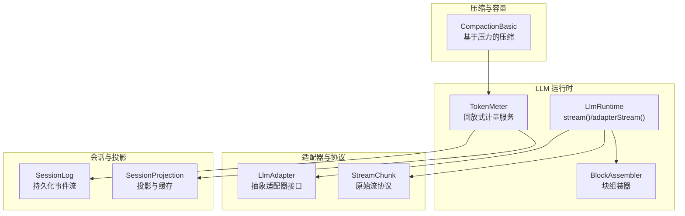
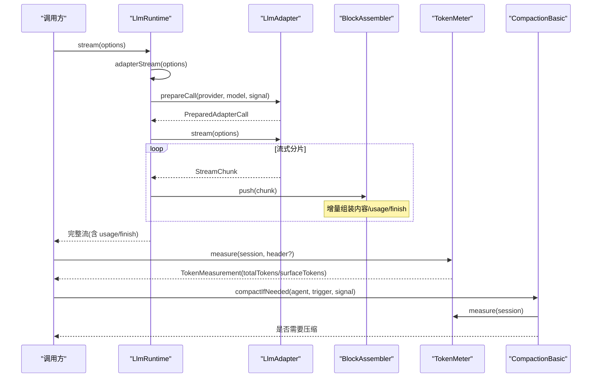
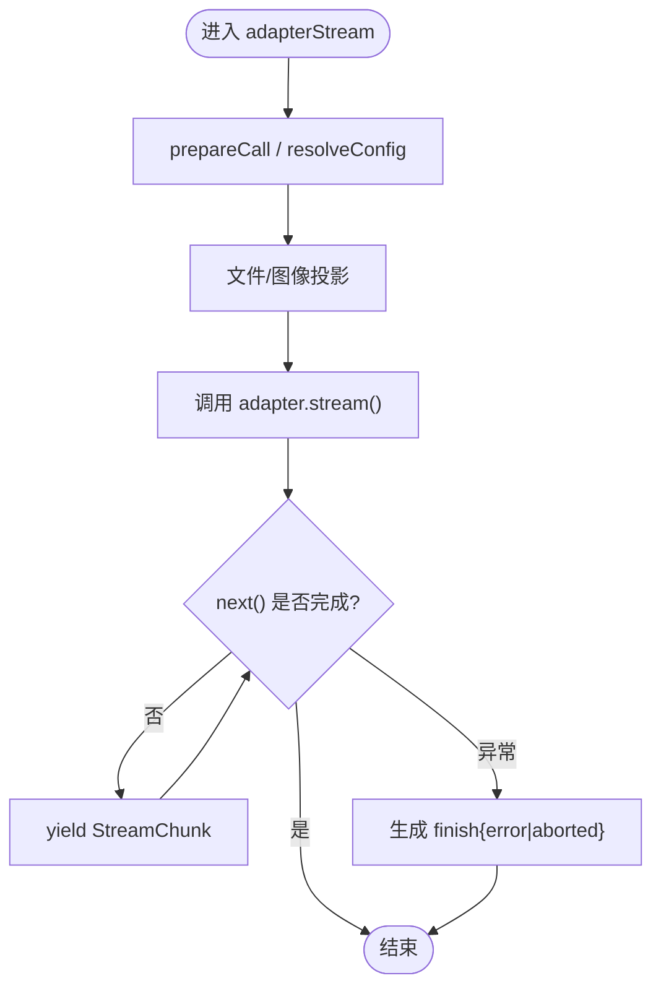
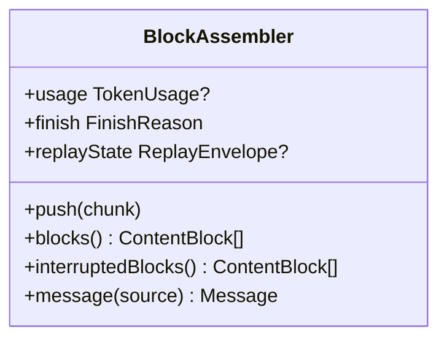
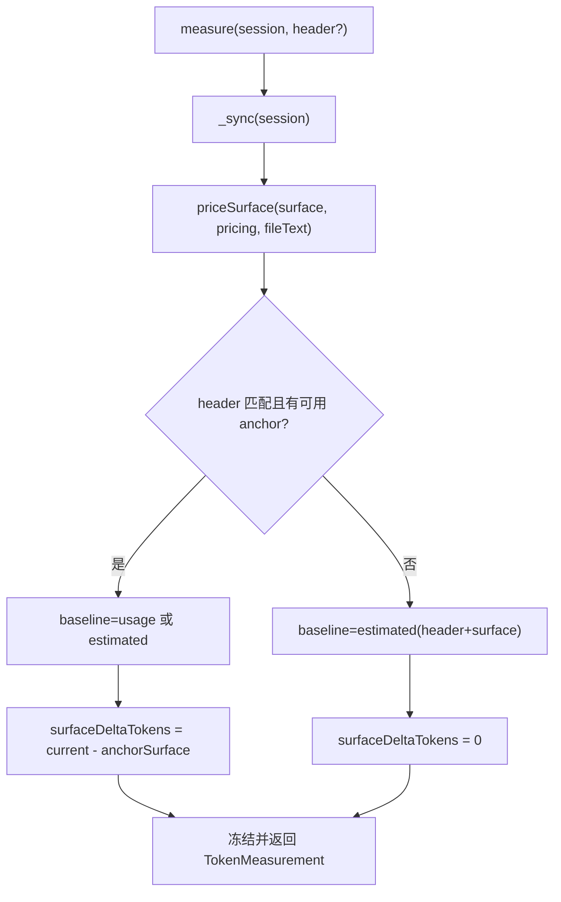
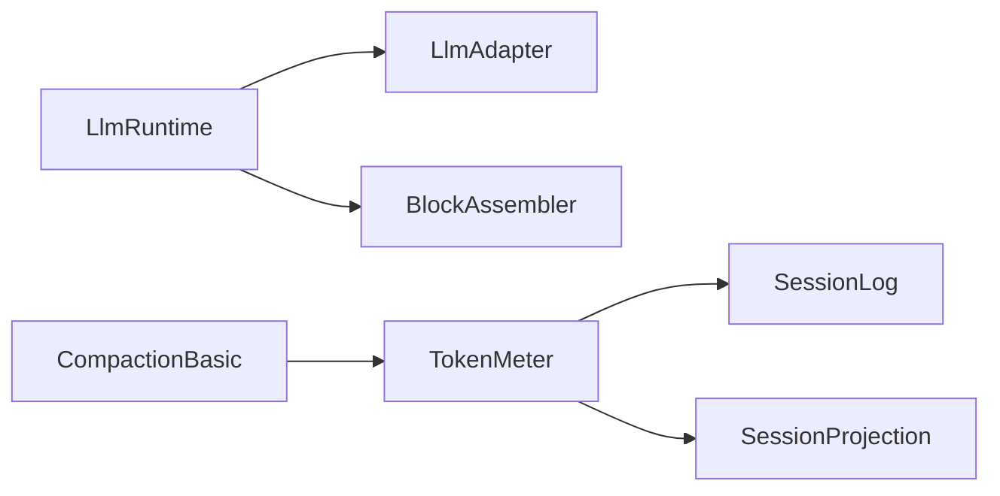

# 性能优化与监控

<cite>
**本文引用的文件**
- [packages/llm/llm/src/index.ts](file://packages/llm/llm/src/index.ts)
- [packages/llm/token-meter/src/index.ts](file://packages/llm/token-meter/src/index.ts)
- [docs/subsystems/llm-streaming.md](file://docs/subsystems/llm-streaming.md)
- [docs/subsystems/token-meter.md](file://docs/subsystems/token-meter.md)
- [apps/web/tests/streaming-fence-highlight.e2e.ts](file://apps/web/tests/streaming-fence-highlight.e2e.ts)
- [apps/web/tests/complex-history.perf.ts](file://apps/web/tests/complex-history.perf.ts)
- [vitest.web-stress.config.ts](file://vitest.web-stress.config.ts)
- [packages/compaction/compaction-basic/src/index.ts](file://packages/compaction/compaction-basic/src/index.ts)
</cite>

## 目录
1. [简介](#简介)
2. [项目结构](#项目结构)
3. [核心组件](#核心组件)
4. [架构总览](#架构总览)
5. [详细组件分析](#详细组件分析)
6. [依赖关系分析](#依赖关系分析)
7. [性能考量](#性能考量)
8. [故障排查指南](#故障排查指南)
9. [结论](#结论)
10. [附录](#附录)

## 简介
本文件聚焦 LLM 适配器的性能优化与监控，覆盖以下主题：
- 流式响应的性能优化策略：缓冲区管理、内存使用优化、网络请求优化。
- Token 计量与成本监控：usage 统计的准确性与实时性保证。
- 适配器级性能指标：延迟、吞吐、错误率。
- 缓存策略：模型元数据缓存与响应结果缓存。
- 性能测试与基准测试：负载与压力测试场景。
- 监控可视化与告警机制。

## 项目结构
围绕 LLM 流式调用与 token 计量的关键代码位于 packages/llm 与 docs/subsystems；性能与压力测试位于 apps/web/tests 与 vitest 配置；压缩触发与 token 计量联动在 compaction-basic。

图表来源
- [packages/llm/llm/src/index.ts:998-1107](file://packages/llm/llm/src/index.ts#L998-L1107)
- [docs/subsystems/llm-streaming.md:169-228](file://docs/subsystems/llm-streaming.md#L169-L228)
- [packages/llm/token-meter/src/index.ts:100-189](file://packages/llm/token-meter/src/index.ts#L100-L189)
- [packages/compaction/compaction-basic/src/index.ts:249-277](file://packages/compaction/compaction-basic/src/index.ts#L249-L277)

章节来源
- [packages/llm/llm/src/index.ts:998-1107](file://packages/llm/llm/src/index.ts#L998-L1107)
- [docs/subsystems/llm-streaming.md:169-228](file://docs/subsystems/llm-streaming.md#L169-L228)
- [packages/llm/token-meter/src/index.ts:100-189](file://packages/llm/token-meter/src/index.ts#L100-L189)
- [packages/compaction/compaction-basic/src/index.ts:249-277](file://packages/compaction/compaction-basic/src/index.ts#L249-L277)

## 核心组件
- LlmRuntime.stream/adapterStream：最终适配器边界，负责选择适配器、准备调用、构建迭代器、统一失败为终端 finish chunk，并暴露 llm/stream 瀑布入口。
- BlockAssembler：将 StreamChunk 增量重组为 ContentBlock、usage、finish reason 与 replayState，支持中断安全的前缀组装。
- TokenMeter：基于会话日志回放的压力与表层定价服务，维护锚点（最近成功 usage）与当前 surface，提供 measure() 快照。
- LlmAdapter 抽象：定义 providerInfo、resolveModel、prepareCall、stream 等契约，要求 usage 在 finish 之前、工具参数保持原始 JSON、空完成视为可重试错误等。

章节来源
- [packages/llm/llm/src/index.ts:998-1107](file://packages/llm/llm/src/index.ts#L998-L1107)
- [docs/subsystems/llm-streaming.md:169-228](file://docs/subsystems/llm-streaming.md#L169-L228)
- [docs/subsystems/llm-streaming.md:288-305](file://docs/subsystems/llm-streaming.md#L288-L305)
- [packages/llm/token-meter/src/index.ts:100-189](file://packages/llm/token-meter/src/index.ts#L100-L189)

## 架构总览
下图展示一次流式调用的端到端流程，包括适配器选择、流式分片、组装、计量与压缩触发。

图表来源
- [packages/llm/llm/src/index.ts:998-1107](file://packages/llm/llm/src/index.ts#L998-L1107)
- [docs/subsystems/llm-streaming.md:169-228](file://docs/subsystems/llm-streaming.md#L169-L228)
- [packages/llm/token-meter/src/index.ts:100-189](file://packages/llm/token-meter/src/index.ts#L100-L189)
- [packages/compaction/compaction-basic/src/index.ts:249-277](file://packages/compaction/compaction-basic/src/index.ts#L249-L277)

## 详细组件分析

### 流式响应与适配器边界
- 适配器选择与准备：通过 prepareCall 绑定 exact-model 元数据与一次性分发函数，避免设置变更导致路由漂移。
- 流式迭代与失败归一化：所有适配器抛错或下游消费失败被统一转换为 finish {kind:'error'|'aborted', failure}，确保消费者只处理标准协议。
- 文件与图像投影：文件以文本句柄发送；不支持图像的模型会投影为文本替代，减少无效传输。
- 超时与中止：适配器需暴露有限 idle timeout，并在 next() 期间守护；abort 映射为 ABORTED。

图表来源
- [packages/llm/llm/src/index.ts:998-1080](file://packages/llm/llm/src/index.ts#L998-L1080)
- [docs/subsystems/llm-streaming.md:288-305](file://docs/subsystems/llm-streaming.md#L288-L305)

章节来源
- [packages/llm/llm/src/index.ts:998-1107](file://packages/llm/llm/src/index.ts#L998-L1107)
- [docs/subsystems/llm-streaming.md:288-305](file://docs/subsystems/llm-streaming.md#L288-L305)

### 块组装与内存控制
- BlockAssembler 将流式增量合并为完整块，支持 interruptedBlocks 安全前缀，避免不完整 tool-call 执行。
- 对未知类型或越界 delta 容忍，防止畸形流增长内存或破坏已关闭块。
- 与 replayState 对齐：当丢弃块时同步丢弃对应元数据条目，保证存储一致。

图表来源
- [docs/subsystems/llm-streaming.md:358-415](file://docs/subsystems/llm-streaming.md#L358-L415)

章节来源
- [docs/subsystems/llm-streaming.md:358-415](file://docs/subsystems/llm-streaming.md#L358-L415)

### Token 计量与成本监控
- 测量快照：measure(session, requestHeader?) 返回不可变快照，包含 totalTokens、surfaceTokens、surfaceDeltaTokens、nodes 与 baseline。
- 锚点复用：若最新成功 usage 的 canonical header 匹配且总量不低于锚点，则复用 provider usage；否则重新计算 envelope 与 surface。
- 图片计价：通过 ctx.llm.imageRequestPricing 解析路由的图片视觉 token 与可见文本，确保计费与实际请求一致。
- 复杂度：每次测量克隆当前表面节点，时间复杂度 O(surface)。

图表来源
- [packages/llm/token-meter/src/index.ts:100-189](file://packages/llm/token-meter/src/index.ts#L100-L189)
- [docs/subsystems/token-meter.md:1-106](file://docs/subsystems/token-meter.md#L1-L106)

章节来源
- [packages/llm/token-meter/src/index.ts:100-189](file://packages/llm/token-meter/src/index.ts#L100-L189)
- [docs/subsystems/token-meter.md:1-106](file://docs/subsystems/token-meter.md#L1-L106)

### 压缩与容量联动
- 压缩触发：compaction-basic 在 step 边界或上下文溢出时，读取 tokenMeter.measure 的结果决定是否压缩。
- 溢出兜底：对于在成功 usage 锚点出现前就被拒绝的请求，适配器侧的上下文溢出分类作为兜底。

章节来源
- [packages/compaction/compaction-basic/src/index.ts:249-277](file://packages/compaction/compaction-basic/src/index.ts#L249-L277)
- [docs/subsystems/llm-streaming.md:288-305](file://docs/subsystems/llm-streaming.md#L288-L305)

### 流式 UI 与缓冲策略
- 测试中通过自定义 LlmAdapter 模拟可控的流式停顿与继续，验证 UI 在流式栅栏下的渲染行为与暂停恢复。
- 建议策略：
  - 小批量累积：按固定字节或条数阈值 flush，平衡首包延迟与 CPU/GC 压力。
  - 背压感知：当消费者处理慢时降低产出速率，避免队列膨胀。
  - 空闲超时：结合适配器 idle timeout，及时释放资源。

章节来源
- [apps/web/tests/streaming-fence-highlight.e2e.ts:31-59](file://apps/web/tests/streaming-fence-highlight.e2e.ts#L31-L59)

## 依赖关系分析
- LlmRuntime 依赖 LlmAdapter 契约与 BlockAssembler；TokenMeter 依赖 SessionLog 与 SessionProjection；CompactionBasic 依赖 TokenMeter。
- 适配器层必须遵守协议约束（usage 顺序、错误路径、重试策略），以保证上层监控与压缩逻辑正确。

图表来源
- [packages/llm/llm/src/index.ts:998-1107](file://packages/llm/llm/src/index.ts#L998-L1107)
- [packages/llm/token-meter/src/index.ts:100-189](file://packages/llm/token-meter/src/index.ts#L100-L189)
- [packages/compaction/compaction-basic/src/index.ts:249-277](file://packages/compaction/compaction-basic/src/index.ts#L249-L277)

章节来源
- [packages/llm/llm/src/index.ts:998-1107](file://packages/llm/llm/src/index.ts#L998-L1107)
- [packages/llm/token-meter/src/index.ts:100-189](file://packages/llm/token-meter/src/index.ts#L100-L189)
- [packages/compaction/compaction-basic/src/index.ts:249-277](file://packages/compaction/compaction-basic/src/index.ts#L249-L277)

## 性能考量
- 流式缓冲与内存
  - 采用小块增量推送至 BlockAssembler，避免大对象拼接；对未知/越界 delta 做防御，防止内存泄漏。
  - 使用 interruptedBlocks 获取中断安全前缀，避免保留未完成的 tool-call。
- 网络请求优化
  - 适配器暴露有限 idle timeout，避免长连接占用；在 next() 期间守护超时，映射为 TIMEOUT。
  - 文件与图像投影减少无效传输，仅发送必要句柄或文本替代。
- Token 计量开销
  - measure 为 O(surface)，适合在步骤边界或压缩触发点调用，避免高频重复测量。
  - 复用 usage 锚点减少重算，仅在 header 不匹配或不足时全量估算。
- 缓存策略
  - 模型元数据缓存：prepareCall 绑定 exact-model 元数据与一次性分发，避免重复解析。
  - 响应结果缓存：通过 replayState 与 BlockAssembler 的确定性重组，可在后续请求中复用状态（同实例、同源适配器）。
  - 投影缓存：session projection 采用 per-session 文件布局，降低写放大与单点故障风险。
- 指标收集
  - 延迟：从 stream 开始到首个 block-start 的首包延迟；整轮耗时从 options.signal 到 finish。
  - 吞吐：单位时间内处理的 StreamChunk 数量与 assembled tokens。
  - 错误率：finish{error|aborted} 占比；区分 ABORTED、TIMEOUT、EMPTY_RESPONSE 等。
- 压缩联动
  - 在 step 边界或上下文溢出时读取 tokenMeter 快照，决定是否需要摘要压缩，控制上下文窗口压力。

[本节为通用指导，不直接分析具体文件]

## 故障排查指南
- 常见错误与定位
  - 空完成：适配器应将无内容的 stop finish 映射为 error{EMPTY_RESPONSE}，由 dsh-llm-retry 默认重试。
  - 上下文溢出：适配器应归类为 CONTEXT_WINDOW_EXCEEDED，消费者按 code 路由而非文本。
  - 中止与超时：abort 映射为 ABORTED；idle timeout 映射为 TIMEOUT。
- 诊断要点
  - 检查 finish 的 reason 与 failure.code/status/requestId。
  - 确认 usage 是否在 finish 之前到达，避免时序问题。
  - 校验 replayState 与 blocks 对齐，防止元数据不一致。
- 相关实现参考
  - 适配器失败转换与终止 chunk 生成。
  - TokenMeter 对 malformed 事件的严格校验，便于快速定位损坏回放。

章节来源
- [packages/llm/llm/src/index.ts:1110-1119](file://packages/llm/llm/src/index.ts#L1110-L1119)
- [docs/subsystems/llm-streaming.md:288-305](file://docs/subsystems/llm-streaming.md#L288-L305)
- [packages/llm/token-meter/src/index.ts:244-311](file://packages/llm/token-meter/src/index.ts#L244-L311)

## 结论
该仓库在 LLM 适配器层提供了严格的流式协议与统一的失败处理，配合回放式 token 计量与压缩联动，实现了高可靠、可观测、可扩展的推理管线。通过适配器契约、BlockAssembler、TokenMeter 与 CompactionBasic 的协作，系统能够在保证准确性的前提下进行性能优化与成本控制。测试与压力用例为持续改进提供了实证基础。

[本节为总结，不直接分析具体文件]

## 附录

### 性能测试与基准测试方法
- 负载测试
  - 使用复杂历史场景（多轮对话、工具调用、长会话）评估 UI 渲染与回放性能。
  - 参考：apps/web/tests/complex-history.perf.ts。
- 压力测试
  - 浏览器压力通道：独立配置文件启用 *.stress.ts，延长超时与禁用并行，观察真实应用响应。
  - 参考：vitest.web-stress.config.ts。
- 流式行为验证
  - 通过自定义适配器模拟停顿与继续，验证 UI 栅栏与渲染稳定性。
  - 参考：apps/web/tests/streaming-fence-highlight.e2e.ts。

章节来源
- [apps/web/tests/complex-history.perf.ts:38-59](file://apps/web/tests/complex-history.perf.ts#L38-L59)
- [vitest.web-stress.config.ts:1-15](file://vitest.web-stress.config.ts#L1-L15)
- [apps/web/tests/streaming-fence-highlight.e2e.ts:31-59](file://apps/web/tests/streaming-fence-highlight.e2e.ts#L31-L59)

### 监控数据可视化与告警机制
- 指标来源
  - 流式指标：首包延迟、整轮耗时、chunk 吞吐、错误率（ABORTED/TIMEOUT/EMPTY_RESPONSE）。
  - 计量指标：totalTokens、surfaceTokens、surfaceDeltaTokens、baseline(kind: usage|estimated|none)。
- 可视化建议
  - 仪表盘：延迟分布（p50/p95/p99）、吞吐曲线、错误率趋势、token 用量趋势。
  - 明细：按 provider/model 维度拆分，识别热点模型与异常路由。
- 告警规则
  - 错误率突增：finish{error|aborted} 比率超过阈值。
  - 延迟退化：首包延迟 p95 持续上升。
  - 上下文溢出：CONTEXT_WINDOW_EXCEEDED 频繁出现，触发压缩策略调整。
  - 用量异常：totalTokens 骤增，可能提示 prompt 膨胀或图片预算过高。

[本节为通用指导，不直接分析具体文件]