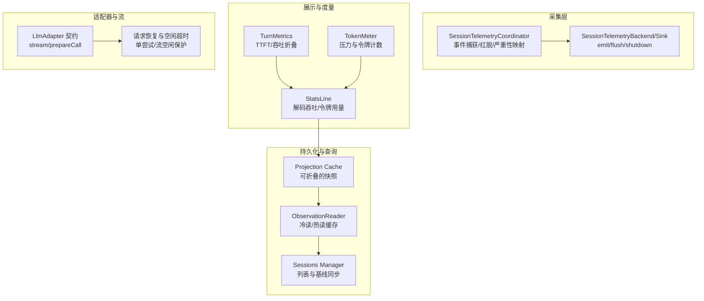
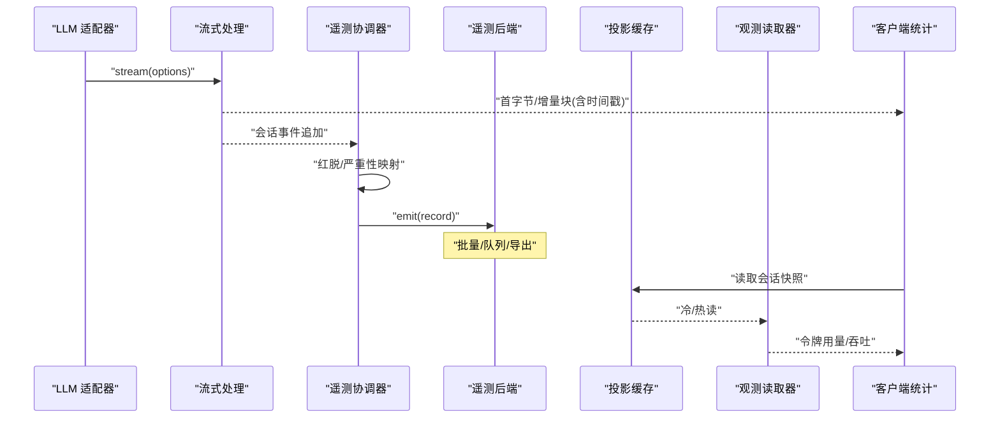
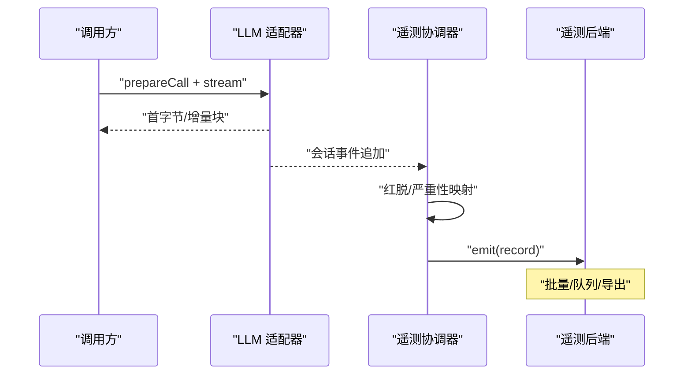
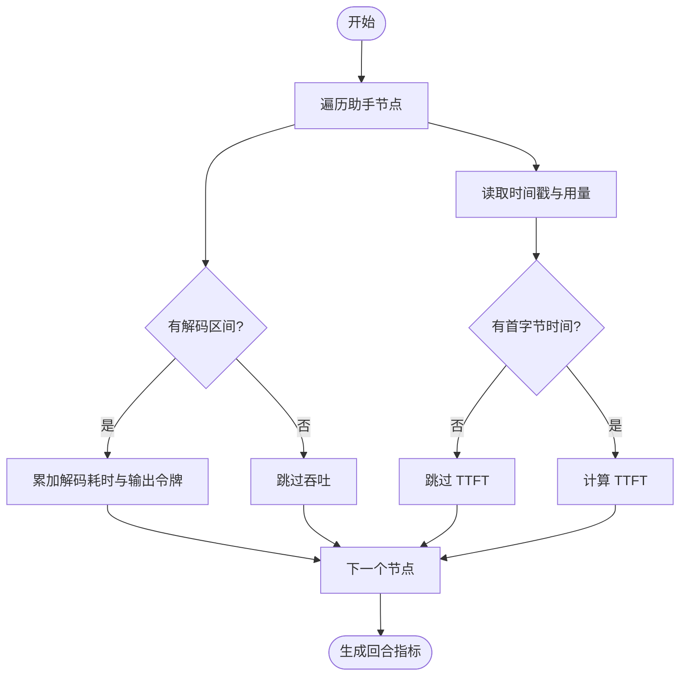
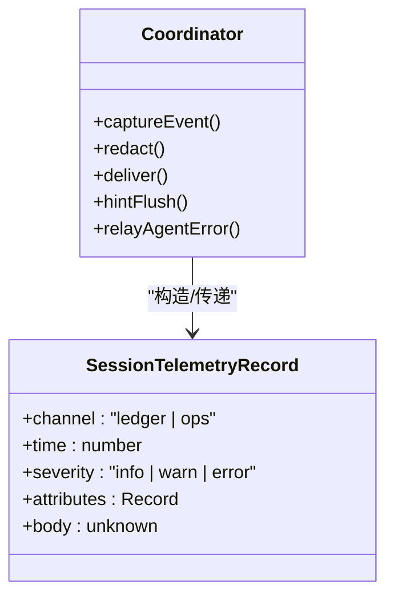
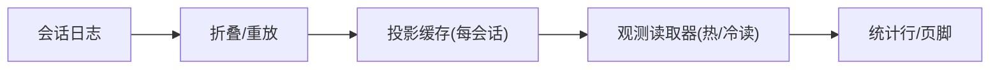
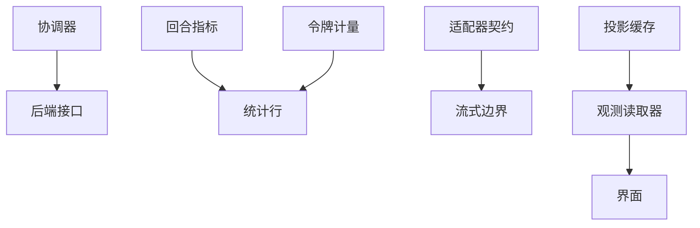

# 性能指标收集

<cite>
**本文引用的文件**
- [packages/session/session-telemetry/src/index.ts](file://packages/session/session-telemetry/src/index.ts)
- [packages/session/session-telemetry/src/coordinator.ts](file://packages/session/session-telemetry/src/coordinator.ts)
- [packages/client/ui-chat/src/client/contract/turn-metrics.ts](file://packages/client/ui-chat/src/client/contract/turn-metrics.ts)
- [packages/client/ui-chat/src/client/chat/StatsLine.tsx](file://packages/client/ui-chat/src/client/chat/StatsLine.tsx)
- [packages/llm/token-meter/README.md](file://packages/llm/token-meter/README.md)
- [packages/client/connection/src/client/fixture.ts](file://packages/client/connection/src/client/fixture.ts)
- [docs/subsystems/llm-streaming.zh.md](file://docs/subsystems/llm-streaming.zh.md)
- [.agents/notes/implemented/architecture/2026-06-21-bounded-llm-request-recovery.md](file://.agents/notes/implemented/architecture/2026-06-21-bounded-llm-request-recovery.md)
- [.agents/notes/implemented/architecture/2026-08-06-subagent-list-identity-projection.md](file://.agents/notes/implemented/architecture/2026-08-06-subagent-list-identity-projection.md)
- [packages/session/session-projection-cache/src/index.ts](file://packages/session/session-projection-cache/src/index.ts)
- [packages/session/session-query/src/observation.ts](file://packages/session/session-query/src/observation.ts)
- [packages/api/session-controller/src/client/sessions/manager.ts](file://packages/api/session-controller/src/client/sessions/manager.ts)
</cite>

## 目录
1. [简介](#简介)
2. [项目结构](#项目结构)
3. [核心组件](#核心组件)
4. [架构总览](#架构总览)
5. [详细组件分析](#详细组件分析)
6. [依赖关系分析](#依赖关系分析)
7. [性能考量](#性能考量)
8. [故障排查指南](#故障排查指南)
9. [结论](#结论)
10. [附录](#附录)

## 简介
本文件面向“适配器级别”的性能指标收集，覆盖延迟统计、吞吐量监控、错误率追踪与资源使用情况；说明采集方法（同步/异步、采样策略、开销控制）、数据聚合存储查询机制、自定义指标扩展与最佳实践、分布式环境下的收集与一致性保证，并给出监控面板配置与告警规则示例，以及瓶颈识别与调优指导。

## 项目结构
围绕性能指标与遥测的关键代码分布在以下模块：
- 会话级遥测采集与后端契约：session-telemetry
- 客户端回合级延迟与吞吐折叠：client/ui-chat turn-metrics
- 令牌用量与压力度量：llm/token-meter
- LLM 适配器契约与流式边界：docs/subsystems/llm-streaming.zh.md 及架构笔记
- 投影缓存与观测读取：session-projection-cache、session-query
- 会话列表与状态同步：api/session-controller

图表来源
- [packages/session/session-telemetry/src/coordinator.ts:1-130](file://packages/session/session-telemetry/src/coordinator.ts#L1-L130)
- [packages/session/session-telemetry/src/index.ts:90-176](file://packages/session/session-telemetry/src/index.ts#L90-L176)
- [packages/client/ui-chat/src/client/contract/turn-metrics.ts:1-100](file://packages/client/ui-chat/src/client/contract/turn-metrics.ts#L1-L100)
- [packages/client/ui-chat/src/client/chat/StatsLine.tsx:183-209](file://packages/client/ui-chat/src/client/chat/StatsLine.tsx#L183-L209)
- [packages/llm/token-meter/README.md:30-41](file://packages/llm/token-meter/README.md#L30-L41)
- [docs/subsystems/llm-streaming.zh.md:772-841](file://docs/subsystems/llm-streaming.zh.md#L772-L841)
- [.agents/notes/implemented/architecture/2026-06-21-bounded-llm-request-recovery.md:69-77](file://.agents/notes/implemented/architecture/2026-06-21-bounded-llm-request-recovery.md#L69-L77)
- [packages/session/session-projection-cache/src/index.ts:1-17](file://packages/session/session-projection-cache/src/index.ts#L1-L17)
- [packages/session/session-query/src/observation.ts:65-103](file://packages/session/session-query/src/observation.ts#L65-L103)
- [packages/api/session-controller/src/client/sessions/manager.ts:476-502](file://packages/api/session-controller/src/client/sessions/manager.ts#L476-L502)

章节来源
- [packages/session/session-telemetry/src/coordinator.ts:1-130](file://packages/session/session-telemetry/src/coordinator.ts#L1-L130)
- [packages/session/session-telemetry/src/index.ts:90-176](file://packages/session/session-telemetry/src/index.ts#L90-L176)
- [packages/client/ui-chat/src/client/contract/turn-metrics.ts:1-100](file://packages/client/ui-chat/src/client/contract/turn-metrics.ts#L1-L100)
- [packages/client/ui-chat/src/client/chat/StatsLine.tsx:183-209](file://packages/client/ui-chat/src/client/chat/StatsLine.tsx#L183-L209)
- [packages/llm/token-meter/README.md:30-41](file://packages/llm/token-meter/README.md#L30-L41)
- [docs/subsystems/llm-streaming.zh.md:772-841](file://docs/subsystems/llm-streaming.zh.md#L772-L841)
- [.agents/notes/implemented/architecture/2026-06-21-bounded-llm-request-recovery.md:69-77](file://.agents/notes/implemented/architecture/2026-06-21-bounded-llm-request-recovery.md#L69-L77)
- [packages/session/session-projection-cache/src/index.ts:1-17](file://packages/session/session-projection-cache/src/index.ts#L1-L17)
- [packages/session/session-query/src/observation.ts:65-103](file://packages/session/session-query/src/observation.ts#L65-L103)
- [packages/api/session-controller/src/client/sessions/manager.ts:476-502](file://packages/api/session-controller/src/client/sessions/manager.ts#L476-L502)

## 核心组件
- 会话遥测协调器：负责订阅会话事件总线、构建统一记录、执行红脱与严重性映射、将记录投递到后端，并在会话生命周期结束时输出关闭标记。
- 遥测后端契约：定义 emit/flush/shutdown 的最小接口，要求 emit 必须非阻塞入队，flush 为可选提示，shutdown 需等待管道静默。
- 客户端回合指标：从助手节点的时间戳与用量推导 TTFT 与解码吞吐，用于页脚与统计行展示。
- 令牌计量：基于持久化日志重放计算 totalTokens/surfaceTokens，提供压力评估与计费粒度估算。
- 适配器契约与流边界：适配器暴露 stream/prepareCall 等能力；架构约束单次尝试与流空闲超时，避免重试放大预算。
- 投影缓存与观测：提供可折叠的持久化快照与冷热读缓存，保障读取零 I/O 且与写入一致。
- 会话管理器：维护会话列表与基线，驱动 UI 与查询侧的一致性视图。

章节来源
- [packages/session/session-telemetry/src/coordinator.ts:1-130](file://packages/session/session-telemetry/src/coordinator.ts#L1-L130)
- [packages/session/session-telemetry/src/index.ts:90-176](file://packages/session/session-telemetry/src/index.ts#L90-L176)
- [packages/client/ui-chat/src/client/contract/turn-metrics.ts:1-100](file://packages/client/ui-chat/src/client/contract/turn-metrics.ts#L1-L100)
- [packages/llm/token-meter/README.md:30-41](file://packages/llm/token-meter/README.md#L30-L41)
- [docs/subsystems/llm-streaming.zh.md:772-841](file://docs/subsystems/llm-streaming.zh.md#L772-L841)
- [.agents/notes/implemented/architecture/2026-06-21-bounded-llm-request-recovery.md:69-77](file://.agents/notes/implemented/architecture/2026-06-21-bounded-llm-request-recovery.md#L69-L77)
- [packages/session/session-projection-cache/src/index.ts:1-17](file://packages/session/session-projection-cache/src/index.ts#L1-L17)
- [packages/session/session-query/src/observation.ts:65-103](file://packages/session/session-query/src/observation.ts#L65-L103)
- [packages/api/session-controller/src/client/sessions/manager.ts:476-502](file://packages/api/session-controller/src/client/sessions/manager.ts#L476-L502)

## 架构总览
下图展示了从适配器调用到指标落盘与展示的端到端路径，包括采集、聚合、存储与查询。

图表来源
- [docs/subsystems/llm-streaming.zh.md:772-841](file://docs/subsystems/llm-streaming.zh.md#L772-L841)
- [packages/session/session-telemetry/src/coordinator.ts:1-130](file://packages/session/session-telemetry/src/coordinator.ts#L1-L130)
- [packages/session/session-projection-cache/src/index.ts:1-17](file://packages/session/session-projection-cache/src/index.ts#L1-L17)
- [packages/session/session-query/src/observation.ts:65-103](file://packages/session/session-query/src/observation.ts#L65-L103)
- [packages/client/ui-chat/src/client/chat/StatsLine.tsx:183-209](file://packages/client/ui-chat/src/client/chat/StatsLine.tsx#L183-L209)

## 详细组件分析

### 适配器级指标定义与采集
- 延迟统计
  - 首字时延（TTFT）：从步骤开始到首个 token 的时间差，按每步最小值归并为回合级指标。
  - 解码耗时：首个 token 到消息完成的时间，用于吞吐计算。
- 吞吐量监控
  - 解码吞吐：以“输出令牌数 / 解码耗时”计算，仅计入同时具备时间与用量的步骤。
- 错误率追踪
  - 通过遥测协调器的严重性映射，将工具结果错误与 turn/end 错误原因映射为 error，便于告警。
- 资源使用情况
  - 令牌用量：totalTokens 与 surfaceTokens 来自对持久化日志的重放，反映请求与响应压力。
  - 缓存命中：结合客户端统计行与令牌用量，计算缓存命中率。

采集方法
- 同步采集：协调器在事件追加时同步构造记录并通过 emit 非阻塞入队，确保不阻塞代理循环。
- 异步导出：后端实现负责批处理、重试与导出；flush 为可选提示，shutdown 需等待管道静默。
- 采样策略：客户端统计行仅在存在令牌活动时渲染相关组；令牌计量基于完整日志重放，无额外模型调用。
- 开销控制：emit 必须为非阻塞入队；协调器对捕获步骤异常进行包裹，失败不影响主流程。

章节来源
- [packages/client/ui-chat/src/client/contract/turn-metrics.ts:1-100](file://packages/client/ui-chat/src/client/contract/turn-metrics.ts#L1-L100)
- [packages/session/session-telemetry/src/index.ts:90-176](file://packages/session/session-telemetry/src/index.ts#L90-L176)
- [packages/session/session-telemetry/src/coordinator.ts:170-207](file://packages/session/session-telemetry/src/coordinator.ts#L170-L207)
- [packages/llm/token-meter/README.md:30-41](file://packages/llm/token-meter/README.md#L30-L41)

#### 时序图：适配器调用与指标采集

图表来源
- [docs/subsystems/llm-streaming.zh.md:772-841](file://docs/subsystems/llm-streaming.zh.md#L772-L841)
- [packages/session/session-telemetry/src/coordinator.ts:170-207](file://packages/session/session-telemetry/src/coordinator.ts#L170-L207)

### 延迟与吞吐的折叠与展示
- 折叠逻辑：遍历会话中的助手节点，计算每步 TTFT 与解码耗时，汇总得到回合级指标。
- 展示逻辑：统计行根据解码耗时计算吞吐，并结合令牌用量显示缓存命中率与令牌计数。

图表来源
- [packages/client/ui-chat/src/client/contract/turn-metrics.ts:42-99](file://packages/client/ui-chat/src/client/contract/turn-metrics.ts#L42-L99)
- [packages/client/ui-chat/src/client/chat/StatsLine.tsx:183-209](file://packages/client/ui-chat/src/client/chat/StatsLine.tsx#L183-L209)

章节来源
- [packages/client/ui-chat/src/client/contract/turn-metrics.ts:1-100](file://packages/client/ui-chat/src/client/contract/turn-metrics.ts#L1-L100)
- [packages/client/ui-chat/src/client/chat/StatsLine.tsx:183-209](file://packages/client/ui-chat/src/client/chat/StatsLine.tsx#L183-L209)

### 错误率追踪与会话关闭信号
- 严重性映射：工具结果错误与 turn/end 错误原因被映射为 error，其他事件默认 info。
- 操作记录：agent/error 被转换为 ops 通道记录，携带会话、代理、轮次、步骤与错误名称。
- 关闭标记：会话销毁或应用关闭时输出 shutdown 操作记录，便于后端对齐生命周期。

图表来源
- [packages/session/session-telemetry/src/index.ts:57-88](file://packages/session/session-telemetry/src/index.ts#L57-L88)
- [packages/session/session-telemetry/src/coordinator.ts:209-256](file://packages/session/session-telemetry/src/coordinator.ts#L209-L256)

章节来源
- [packages/session/session-telemetry/src/coordinator.ts:209-256](file://packages/session/session-telemetry/src/coordinator.ts#L209-L256)
- [packages/session/session-telemetry/src/index.ts:57-88](file://packages/session/session-telemetry/src/index.ts#L57-L88)

### 令牌用量与压力度量
- 重放式测量：基于持久化会话日志重放，确定性且无额外模型调用。
- 压力字段：totalTokens 表示请求+响应压力，surfaceTokens 为表面路由价格总和。
- 估计能力：可对单条消息进行启发式估价，便于前端快速反馈。

章节来源
- [packages/llm/token-meter/README.md:30-41](file://packages/llm/token-meter/README.md#L30-L41)

### 适配器流式边界与重试约束
- 单次尝试：每个适配器每次 stream 调用对应一次提供者请求，避免 SDK 预算被重试放大。
- 流空闲保护：适配器暴露流空闲超时配置，覆盖每次 next() 的等待，防止长时间停滞。
- 直接调用者：未获得自动重试，需自行缓冲与决策。

章节来源
- [.agents/notes/implemented/architecture/2026-06-21-bounded-llm-request-recovery.md:69-77](file://.agents/notes/implemented/architecture/2026-06-21-bounded-llm-request-recovery.md#L69-L77)
- [docs/subsystems/llm-streaming.zh.md:772-841](file://docs/subsystems/llm-streaming.zh.md#L772-L841)

### 数据聚合、存储与查询
- 聚合：客户端将多步指标折叠为回合级指标；令牌计量对日志进行重放聚合。
- 存储：投影缓存提供每会话的持久化快照，支持版本兼容与回退；读取走内存表，零 I/O。
- 查询：观测读取器优先热读（活跃会话），冷读通过缓存与日志重建；会话管理器维护列表与基线，驱动 UI 一致性。

图表来源
- [packages/session/session-projection-cache/src/index.ts:1-17](file://packages/session/session-projection-cache/src/index.ts#L1-L17)
- [packages/session/session-query/src/observation.ts:65-103](file://packages/session/session-query/src/observation.ts#L65-L103)
- [packages/api/session-controller/src/client/sessions/manager.ts:476-502](file://packages/api/session-controller/src/client/sessions/manager.ts#L476-L502)

章节来源
- [packages/session/session-projection-cache/src/index.ts:1-17](file://packages/session/session-projection-cache/src/index.ts#L1-L17)
- [packages/session/session-query/src/observation.ts:65-103](file://packages/session/session-query/src/observation.ts#L65-L103)
- [packages/api/session-controller/src/client/sessions/manager.ts:476-502](file://packages/api/session-controller/src/client/sessions/manager.ts#L476-L502)

### 自定义指标扩展与最佳实践
- 扩展点：遥测协调器提供“记录水线”，可在捕获时对记录进行转换或过滤，部署侧挂载规则即可定制导出内容。
- 最佳实践
  - 保持 emit 非阻塞，避免影响主循环。
  - 使用 flush 作为可选提示，由后端自行决定批处理时机。
  - 在 shutdown 中确保管道静默，避免丢失关键关闭标记。
  - 对敏感字段进行红脱，确保导出数据最小化。

章节来源
- [packages/session/session-telemetry/src/index.ts:24-44](file://packages/session/session-telemetry/src/index.ts#L24-L44)
- [packages/session/session-telemetry/src/coordinator.ts:186-196](file://packages/session/session-telemetry/src/coordinator.ts#L186-L196)

### 分布式环境下的指标收集与一致性
- 一致性保证
  - 投影缓存读写共享同一内存表，写先落地再更新内存，读从不直接触盘，避免脏读。
  - 观测读取器对冷读进行版本匹配与 LRU 缓存，保证跨进程/重启后的一致视图。
- 分布式建议
  - 后端应实现幂等的 append-only 接收与去重，利用 event.seq 与 session.id 做顺序与归属校验。
  - 使用 flush/shutdown 对齐批次边界，确保关闭标记不被丢弃。
  - 对高吞吐场景采用分片与分区键（如 session.id），降低热点。

章节来源
- [packages/session/session-projection-cache/src/index.ts:1-17](file://packages/session/session-projection-cache/src/index.ts#L1-L17)
- [packages/session/session-query/src/observation.ts:65-103](file://packages/session/session-query/src/observation.ts#L65-L103)

### 监控面板与告警规则示例
- 面板指标
  - 延迟：TTFT（毫秒）、解码耗时（毫秒）
  - 吞吐：tokensPerSecond
  - 错误率：error 严重性事件占比
  - 资源：totalTokens、surfaceTokens、缓存命中率
- 告警规则（示例）
  - P95 TTFT > 阈值持续 N 分钟
  - tokensPerSecond < 阈值持续 N 分钟
  - error 严重性事件比例 > 阈值
  - 缓存命中率 < 阈值且输入令牌增长异常

[本节为概念性配置示例，不直接分析具体文件]

## 依赖关系分析
- 低耦合：协调器仅依赖会话事件与上下文，后端通过 Sink 接口解耦。
- 内聚性：客户端指标折叠集中在 turn-metrics，展示集中在 StatsLine。
- 外部依赖：适配器契约与流式行为受文档与架构笔记约束，确保重试与超时策略一致。

图表来源
- [packages/session/session-telemetry/src/coordinator.ts:1-130](file://packages/session/session-telemetry/src/coordinator.ts#L1-L130)
- [packages/client/ui-chat/src/client/contract/turn-metrics.ts:1-100](file://packages/client/ui-chat/src/client/contract/turn-metrics.ts#L1-L100)
- [packages/client/ui-chat/src/client/chat/StatsLine.tsx:183-209](file://packages/client/ui-chat/src/client/chat/StatsLine.tsx#L183-L209)
- [packages/llm/token-meter/README.md:30-41](file://packages/llm/token-meter/README.md#L30-L41)
- [docs/subsystems/llm-streaming.zh.md:772-841](file://docs/subsystems/llm-streaming.zh.md#L772-L841)
- [packages/session/session-projection-cache/src/index.ts:1-17](file://packages/session/session-projection-cache/src/index.ts#L1-L17)
- [packages/session/session-query/src/observation.ts:65-103](file://packages/session/session-query/src/observation.ts#L65-L103)

章节来源
- [packages/session/session-telemetry/src/coordinator.ts:1-130](file://packages/session/session-telemetry/src/coordinator.ts#L1-L130)
- [packages/client/ui-chat/src/client/contract/turn-metrics.ts:1-100](file://packages/client/ui-chat/src/client/contract/turn-metrics.ts#L1-L100)
- [packages/client/ui-chat/src/client/chat/StatsLine.tsx:183-209](file://packages/client/ui-chat/src/client/chat/StatsLine.tsx#L183-L209)
- [packages/llm/token-meter/README.md:30-41](file://packages/llm/token-meter/README.md#L30-L41)
- [docs/subsystems/llm-streaming.zh.md:772-841](file://docs/subsystems/llm-streaming.zh.md#L772-L841)
- [packages/session/session-projection-cache/src/index.ts:1-17](file://packages/session/session-projection-cache/src/index.ts#L1-L17)
- [packages/session/session-query/src/observation.ts:65-103](file://packages/session/session-query/src/observation.ts#L65-L103)

## 性能考量
- 采集开销控制
  - 协调器在事件追加路径上仅做轻量拷贝与红脱，emit 必须非阻塞。
  - 客户端指标折叠仅在加载窗口内进行，避免全量扫描。
- 存储与查询优化
  - 投影缓存提供同步读取，零 I/O；冷读通过版本匹配与 LRU 减少重复重建。
  - 令牌计量基于日志重放，无额外网络开销。
- 适配器边界
  - 单次尝试与流空闲超时避免长尾与重试风暴。
- 资源使用
  - 通过 surfaceTokens 与 totalTokens 区分计费与压力，辅助容量规划。

[本节提供通用指导，不直接分析具体文件]

## 故障排查指南
- 采集失败隔离：协调器对捕获步骤异常进行包裹，失败仅记录警告，不阻塞主流程。
- 后端关闭：shutdown 期间可能丢失部分记录（若 SDK 不支持取消），需在部署侧设置合理超时。
- 数据不一致：检查投影缓存版本与观测读取器缓存命中；确认会话列表基线同步是否完成。
- 适配器问题：核对流空闲超时与重试策略，避免长时间停滞或重试放大。

章节来源
- [packages/session/session-telemetry/src/coordinator.ts:230-241](file://packages/session/session-telemetry/src/coordinator.ts#L230-L241)
- [.agents/notes/implemented/architecture/2026-06-21-bounded-llm-request-recovery.md:69-77](file://.agents/notes/implemented/architecture/2026-06-21-bounded-llm-request-recovery.md#L69-L77)
- [packages/session/session-query/src/observation.ts:65-103](file://packages/session/session-query/src/observation.ts#L65-L103)

## 结论
本项目在适配器级别提供了完整的性能指标采集与展示能力：通过会话遥测协调器实现低开销的事件捕获与严重性映射，借助客户端回合指标与令牌计量完成延迟、吞吐、错误率与资源使用的可视化；投影缓存与观测读取器保障了存储与查询的一致性与高效性。配合适配器流式边界约束与后端最佳实践，可在单机与分布式环境中稳定运行，并为监控面板与告警提供可靠数据源。

## 附录
- 术语
  - TTFT：首字时延
  - 解码吞吐：输出令牌数除以解码耗时
  - 投影缓存：持久化的会话快照，支持版本兼容与回退
  - 观测读取器：提供热读/冷读的会话视图
- 参考
  - 适配器契约与流式边界：docs/subsystems/llm-streaming.zh.md
  - 令牌计量：packages/llm/token-meter/README.md
  - 客户端指标：packages/client/ui-chat/src/client/contract/turn-metrics.ts
  - 统计行：packages/client/ui-chat/src/client/chat/StatsLine.tsx
  - 遥测协调器与后端契约：packages/session/session-telemetry/src/{coordinator,index}.ts
  - 投影缓存与观测：packages/session/{session-projection-cache,session-query}/src/*.ts
  - 会话管理：packages/api/session-controller/src/client/sessions/manager.ts

[本节为补充信息，不直接分析具体文件]