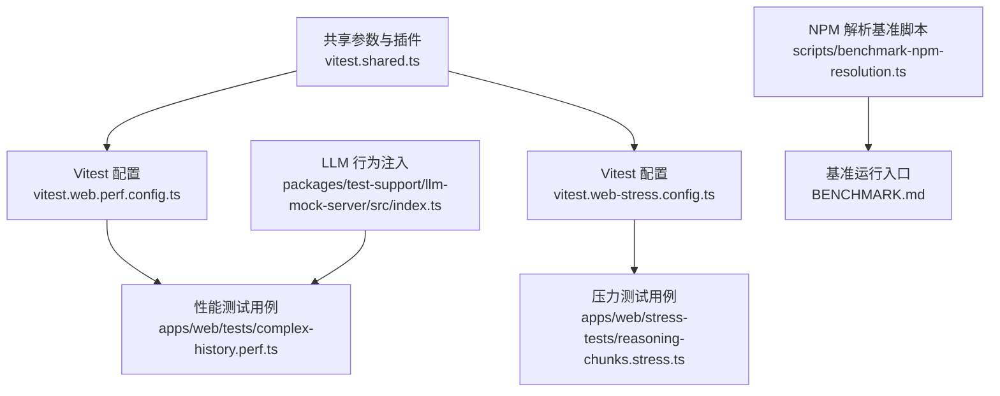
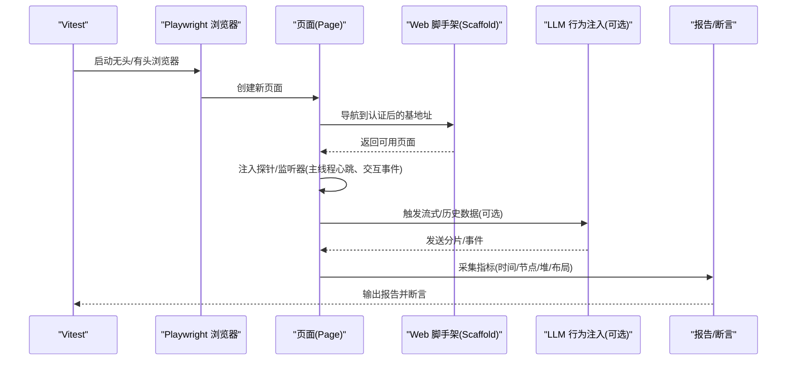
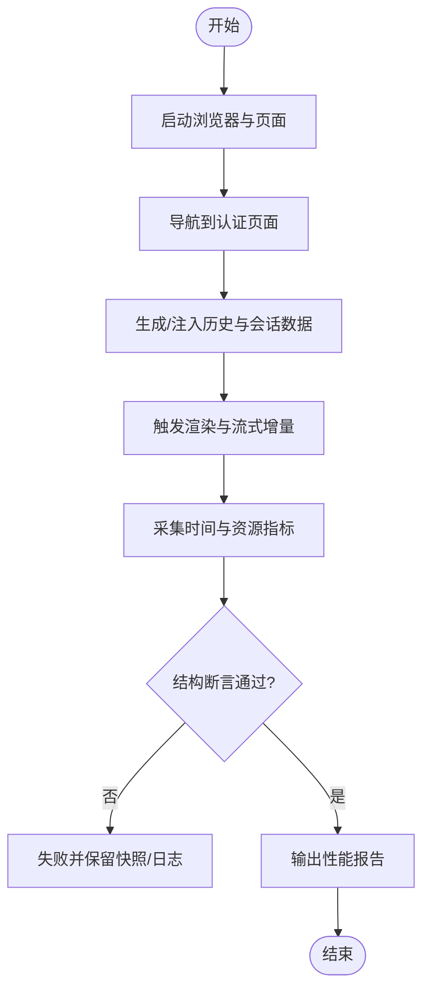
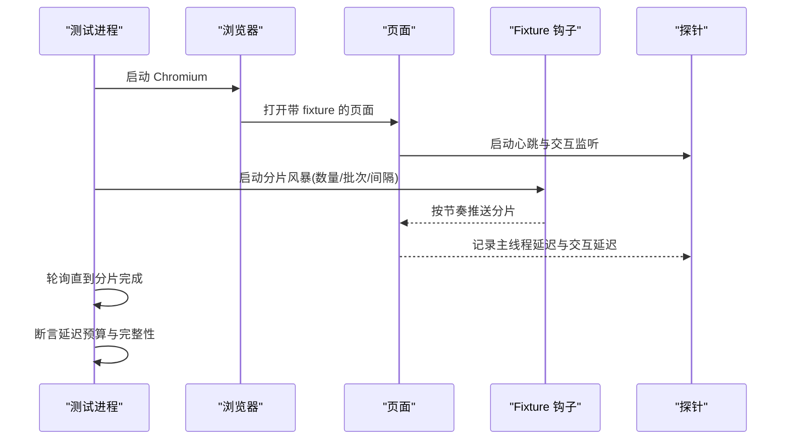
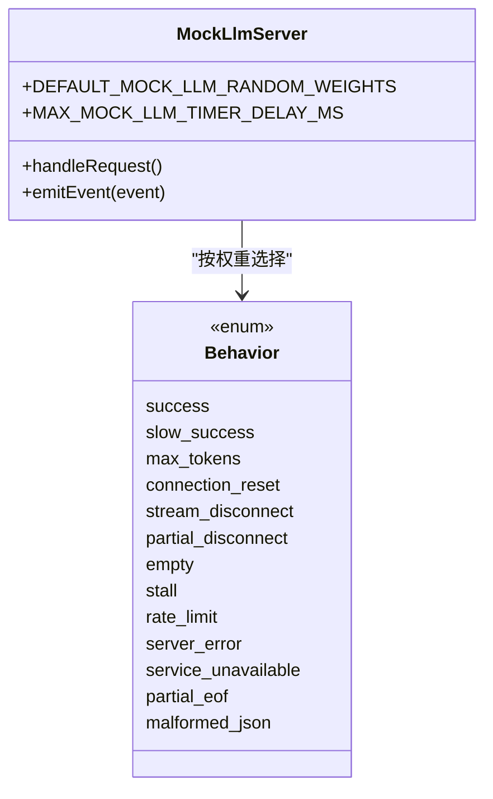
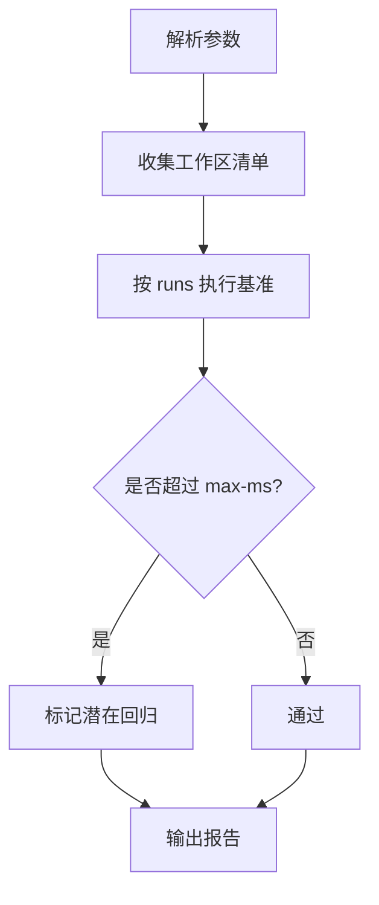
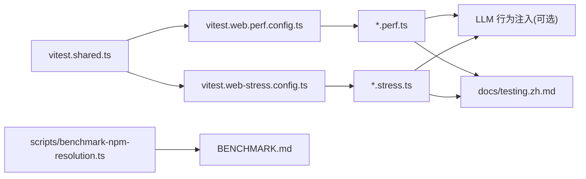

# 性能测试与基准测试

<cite>
**本文引用的文件**
- [BENCHMARK.md](file://BENCHMARK.md)
- [vitest.web-stress.config.ts](file://vitest.web-stress.config.ts)
- [vitest.web.perf.config.ts](file://vitest.web.perf.config.ts)
- [vitest.shared.ts](file://vitest.shared.ts)
- [apps/web/stress-tests/reasoning-chunks.stress.ts](file://apps/web/stress-tests/reasoning-chunks.stress.ts)
- [apps/web/tests/complex-history.perf.ts](file://apps/web/tests/complex-history.perf.ts)
- [scripts/benchmark-npm-resolution.ts](file://scripts/benchmark-npm-resolution.ts)
- [packages/test-support/llm-mock-server/src/index.ts](file://packages/test-support/llm-mock-server/src/index.ts)
- [docs/testing.zh.md](file://docs/testing.zh.md)
</cite>

## 目录
1. [简介](#简介)
2. [项目结构](#项目结构)
3. [核心组件](#核心组件)
4. [架构总览](#架构总览)
5. [详细组件分析](#详细组件分析)
6. [依赖关系分析](#依赖关系分析)
7. [性能注意事项](#性能注意事项)
8. [故障排查指南](#故障排查指南)
9. [结论](#结论)
10. [附录](#附录)

## 简介
本文件面向性能测试与基准测试的落地实践，覆盖负载测试设计、并发用户模拟、请求模式与压力递增策略；基准测试框架使用（用例编写、断言与结果分析）；典型场景（冷启动、持续负载、峰值压力）；性能回归检测（自动化集成与阈值监控）；测试环境搭建与数据准备；脚本示例与结果解读；以及性能问题定位与分析方法。内容基于仓库中已有的 Web 性能/压力测试配置与实现进行说明。

## 项目结构
仓库为多包 monorepo，性能相关能力主要分布在：
- 浏览器端性能与压力测试：apps/web/tests/*.perf.ts、apps/web/stress-tests/*.stress.ts
- Vitest 配置：vitest.web.perf.config.ts、vitest.web-stress.config.ts、vitest.shared.ts
- 通用基准工具：scripts/benchmark-npm-resolution.ts
- LLM 行为注入与压测支撑：packages/test-support/llm-mock-server/src/index.ts
- 运行与执行说明：docs/testing.zh.md、BENCHMARK.md

**图示来源**
- [vitest.web.perf.config.ts:1-22](file://vitest.web.perf.config.ts#L1-L22)
- [vitest.web-stress.config.ts:1-16](file://vitest.web-stress.config.ts#L1-L16)
- [vitest.shared.ts:1-43](file://vitest.shared.ts#L1-L43)
- [apps/web/tests/complex-history.perf.ts:1-200](file://apps/web/tests/complex-history.perf.ts#L1-L200)
- [apps/web/stress-tests/reasoning-chunks.stress.ts:1-154](file://apps/web/stress-tests/reasoning-chunks.stress.ts#L1-L154)
- [packages/test-support/llm-mock-server/src/index.ts:46-94](file://packages/test-support/llm-mock-server/src/index.ts#L46-L94)
- [scripts/benchmark-npm-resolution.ts:105-143](file://scripts/benchmark-npm-resolution.ts#L105-L143)
- [BENCHMARK.md:1-4](file://BENCHMARK.md#L1-L4)

**章节来源**
- [vitest.web.perf.config.ts:1-22](file://vitest.web.perf.config.ts#L1-L22)
- [vitest.web-stress.config.ts:1-16](file://vitest.web-stress.config.ts#L1-L16)
- [vitest.shared.ts:1-43](file://vitest.shared.ts#L1-L43)
- [apps/web/tests/complex-history.perf.ts:1-200](file://apps/web/tests/complex-history.perf.ts#L1-L200)
- [apps/web/stress-tests/reasoning-chunks.stress.ts:1-154](file://apps/web/stress-tests/reasoning-chunks.stress.ts#L1-L154)
- [packages/test-support/llm-mock-server/src/index.ts:46-94](file://packages/test-support/llm-mock-server/src/index.ts#L46-L94)
- [scripts/benchmark-npm-resolution.ts:105-143](file://scripts/benchmark-npm-resolution.ts#L105-L143)
- [BENCHMARK.md:1-4](file://BENCHMARK.md#L1-L4)

## 核心组件
- 性能测试配置（perf）：启用内存诊断、扩大超时、包含 *.perf.ts 用例，适合高基数历史渲染等场景。
- 压力测试配置（stress）：仅包含 *.stress.ts 用例，关闭文件并行，设置长超时，用于极端流式渲染与主线程阻塞验证。
- 共享执行参数：统一处理 Node 环境变量与装饰器转译，保证测试一致性。
- 性能用例：复杂历史渲染、流式增量、交互延迟测量、DOM/内存指标采集。
- 压力用例：大规模推理分片渲染下的主线程延迟预算与交互响应性保障。
- LLM 行为注入：通过权重化的随机行为模拟慢响应、断开、限流等，便于构建稳定可重复的压力场景。
- NPM 解析基准：提供 runs、timeout、max-ms 等参数化基准执行能力。

**章节来源**
- [vitest.web.perf.config.ts:1-22](file://vitest.web.perf.config.ts#L1-L22)
- [vitest.web-stress.config.ts:1-16](file://vitest.web-stress.config.ts#L1-L16)
- [vitest.shared.ts:1-43](file://vitest.shared.ts#L1-L43)
- [apps/web/tests/complex-history.perf.ts:1-200](file://apps/web/tests/complex-history.perf.ts#L1-L200)
- [apps/web/stress-tests/reasoning-chunks.stress.ts:1-154](file://apps/web/stress-tests/reasoning-chunks.stress.ts#L1-L154)
- [packages/test-support/llm-mock-server/src/index.ts:46-94](file://packages/test-support/llm-mock-server/src/index.ts#L46-L94)
- [scripts/benchmark-npm-resolution.ts:105-143](file://scripts/benchmark-npm-resolution.ts#L105-L143)

## 架构总览
下图展示从测试配置到用例执行的端到端流程，包括浏览器实例、页面生命周期、指标采集与断言。

**图示来源**
- [vitest.web.perf.config.ts:1-22](file://vitest.web.perf.config.ts#L1-L22)
- [vitest.web-stress.config.ts:1-16](file://vitest.web-stress.config.ts#L1-L16)
- [apps/web/tests/complex-history.perf.ts:1-200](file://apps/web/tests/complex-history.perf.ts#L1-L200)
- [apps/web/stress-tests/reasoning-chunks.stress.ts:1-154](file://apps/web/stress-tests/reasoning-chunks.stress.ts#L1-L154)
- [packages/test-support/llm-mock-server/src/index.ts:46-94](file://packages/test-support/llm-mock-server/src/index.ts#L46-L94)

## 详细组件分析

### 浏览器性能测试（复杂历史渲染）
- 目标：在高基数工作区与长会话历史下评估渲染性能，记录 wall/task/script/layout/recalcStyle/devtools 等指标，并统计 DOM 节点、监听器与堆变化。
- 关键机制：
  - 使用 Playwright 打开页面，等待 UI 就绪后进入测量阶段。
  - 通过种子数据构造大量会话与历史条目，驱动侧边栏与消息列表渲染。
  - 在流式增量过程中记录首帧、首次分片到达、稳定时间等时序指标。
  - 支持回放与重放目录清理，确保隔离与可重复。
- 断言策略：以结构性断言为主（如会话数量、轨迹行数），避免将宿主速度作为正确性契约；同时记录指标供后续对比。

**图示来源**
- [apps/web/tests/complex-history.perf.ts:1-200](file://apps/web/tests/complex-history.perf.ts#L1-L200)

**章节来源**
- [apps/web/tests/complex-history.perf.ts:1-200](file://apps/web/tests/complex-history.perf.ts#L1-L200)

### 浏览器压力测试（推理分片风暴）
- 目标：在持续推送海量推理分片时，验证主线程延迟预算与交互响应性不被破坏。
- 关键机制：
  - 通过固定间隔与批量大小推送分片，模拟极端流式场景。
  - 在页面内维护心跳采样与交互事件，测量最大主线程延迟与交互响应延迟。
  - 使用 expect.poll 轮询直至分片全部发出或达到超时。
  - 失败时自动保存截图以便定位。
- 断言策略：对已发出分片数、心跳样本数、主线程延迟与交互延迟设定上限预算。

**图示来源**
- [apps/web/stress-tests/reasoning-chunks.stress.ts:1-154](file://apps/web/stress-tests/reasoning-chunks.stress.ts#L1-L154)

**章节来源**
- [apps/web/stress-tests/reasoning-chunks.stress.ts:1-154](file://apps/web/stress-tests/reasoning-chunks.stress.ts#L1-L154)

### LLM 行为注入与压力模型
- 通过权重化的随机行为选择，模拟成功、慢成功、限流、连接重置、流中断、部分 EOF、畸形 JSON 等，从而在测试中可控地制造压力与异常路径。
- 该能力可用于构造“持续负载”和“峰值压力”场景，配合 Web 层用例形成端到端压测闭环。

**图示来源**
- [packages/test-support/llm-mock-server/src/index.ts:46-94](file://packages/test-support/llm-mock-server/src/index.ts#L46-L94)

**章节来源**
- [packages/test-support/llm-mock-server/src/index.ts:46-94](file://packages/test-support/llm-mock-server/src/index.ts#L46-L94)

### NPM 解析基准脚本
- 提供参数化基准执行：runs（运行次数）、timeout-ms（超时）、max-ms（最大耗时限制）、ref（指定分支/提交）。
- 通过 glob/git ls-tree 收集工作区清单，统一执行并汇总结果，适用于模块加载与依赖解析的性能回归检测。

**图示来源**
- [scripts/benchmark-npm-resolution.ts:105-143](file://scripts/benchmark-npm-resolution.ts#L105-L143)

**章节来源**
- [scripts/benchmark-npm-resolution.ts:105-143](file://scripts/benchmark-npm-resolution.ts#L105-L143)

## 依赖关系分析
- 配置层：vitest.web.perf.config.ts 与 vitest.web-stress.config.ts 分别定义两类用例集与运行时参数，均复用 vitest.shared.ts 的共享执行参数与插件。
- 用例层：*.perf.ts 与 *.stress.ts 依赖 Playwright 与 Web 脚手架，必要时注入 LLM 行为以构造压力。
- 支撑层：LLM 行为注入提供稳定的异常与延迟源；NPM 基准脚本提供非浏览器端的基准能力。
- 文档层：docs/testing.zh.md 描述测试执行环境与隔离策略，BENCHMARK.md 给出 SDK 基准运行指引。

**图示来源**
- [vitest.shared.ts:1-43](file://vitest.shared.ts#L1-L43)
- [vitest.web.perf.config.ts:1-22](file://vitest.web.perf.config.ts#L1-L22)
- [vitest.web-stress.config.ts:1-16](file://vitest.web-stress.config.ts#L1-L16)
- [apps/web/tests/complex-history.perf.ts:1-200](file://apps/web/tests/complex-history.perf.ts#L1-L200)
- [apps/web/stress-tests/reasoning-chunks.stress.ts:1-154](file://apps/web/stress-tests/reasoning-chunks.stress.ts#L1-L154)
- [packages/test-support/llm-mock-server/src/index.ts:46-94](file://packages/test-support/llm-mock-server/src/index.ts#L46-L94)
- [docs/testing.zh.md:16-20](file://docs/testing.zh.md#L16-L20)
- [BENCHMARK.md:1-4](file://BENCHMARK.md#L1-L4)

**章节来源**
- [vitest.shared.ts:1-43](file://vitest.shared.ts#L1-L43)
- [vitest.web.perf.config.ts:1-22](file://vitest.web.perf.config.ts#L1-L22)
- [vitest.web-stress.config.ts:1-16](file://vitest.web-stress.config.ts#L1-L16)
- [apps/web/tests/complex-history.perf.ts:1-200](file://apps/web/tests/complex-history.perf.ts#L1-L200)
- [apps/web/stress-tests/reasoning-chunks.stress.ts:1-154](file://apps/web/stress-tests/reasoning-chunks.stress.ts#L1-L154)
- [packages/test-support/llm-mock-server/src/index.ts:46-94](file://packages/test-support/llm-mock-server/src/index.ts#L46-L94)
- [docs/testing.zh.md:16-20](file://docs/testing.zh.md#L16-L20)
- [BENCHMARK.md:1-4](file://BENCHMARK.md#L1-L4)

## 性能注意事项
- 用例隔离与资源管理：遵循测试可靠性技能中的原子分配与进程全局状态隔离原则，避免端口、临时路径、全局变量污染导致的 flaky。
- 超时与重试：性能/压力用例需合理设置 testTimeout/hookTimeout，并使用 expect.poll 等待异步状态收敛。
- 指标采集：优先采集 wall/task/script/layout/recalcStyle/devtools 等浏览器指标，并结合 DOM 节点数、监听器数与堆大小变化判断内存泄漏风险。
- 稳定性：压力测试应关注主线程延迟预算与交互响应性，而非绝对吞吐；结合 LLM 行为注入模拟真实网络波动。
- 可重复性：使用独立工作区与会话 ID，避免跨任务干扰；必要时使用回放/重放目录并清理。

[本节为通用指导，不直接分析具体文件]

## 故障排查指南
- 浏览器无响应：检查页面是否加载完成、fixture 钩子是否可用、分片风暴是否按预期推进；查看控制台错误与警告。
- 主线程延迟超标：确认心跳采样与交互事件是否触发；核对最大主线程延迟预算；检查是否存在同步阻塞逻辑。
- 内存增长：观察堆大小与 DOM 节点/监听器增量；确认 teardown 是否释放资源（页面、脚手架、回放目录）。
- 不稳定/偶发失败：对照测试可靠性技能，核查资源独占、临时路径唯一性、全局状态恢复与最小作用域捕获。
- 基准结果漂移：确认 runs、timeout、max-ms 参数一致；比对不同 ref 的结果差异，定位引入变更。

**章节来源**
- [apps/web/stress-tests/reasoning-chunks.stress.ts:1-154](file://apps/web/stress-tests/reasoning-chunks.stress.ts#L1-L154)
- [apps/web/tests/complex-history.perf.ts:1-200](file://apps/web/tests/complex-history.perf.ts#L1-L200)
- [docs/testing.zh.md:16-20](file://docs/testing.zh.md#L16-L20)

## 结论
本项目提供了完善的浏览器端性能与压力测试基础设施：通过独立的 perf 与 stress 配置、Playwright 驱动的页面级指标采集、LLM 行为注入与 NPM 基准脚本，能够覆盖冷启动、持续负载与峰值压力等典型场景。建议在生产流水线中纳入这些用例，并以主线程延迟预算、交互响应性与资源占用为核心阈值，实现性能回归的自动化检测与快速定位。

[本节为总结，不直接分析具体文件]

## 附录

### 场景设计与实施要点
- 冷启动测试：以首次加载页面、初始化会话与渲染首屏为目标，测量首帧与关键元素可见时间，关注资源加载与初始渲染开销。
- 持续负载测试：通过 LLM 行为注入与流式增量，维持一定速率的请求与渲染，观察 CPU、内存与网络抖动对响应性的影响。
- 峰值压力测试：短时间放大分片/请求量，验证主线程延迟预算与交互响应性，确保 UI 仍保持可操作。

[本节为概念性说明，不直接分析具体文件]

### 测试结果解读指南
- 时间维度：wallMs、taskMs、scriptMs、layoutMs、recalcStyleMs、devtoolsMs 反映各阶段耗时；关注峰值与尾部延迟。
- 资源维度：nodesDelta、listenersDelta、heapDeltaMb 指示内存与 DOM 增长；totalNodes、heapMb 用于基线对比。
- 交互维度：interactionDelayMs 衡量用户交互到响应的延迟；heartbeatSamples 反映主线程调度健康度。
- 结构维度：会话数量、轨迹行数、工具调用数等结构性断言确保测试规模未退化。

[本节为概念性说明，不直接分析具体文件]

### 参考与运行
- 浏览器性能/压力用例：通过对应 Vitest 配置文件运行 *.perf.ts 与 *.stress.ts。
- SDK 基准：遵循 BENCHMARK.md 指引安装 SDK 并运行最小变体，使用独立工作区与会话 ID 隔离任务。
- 执行环境：参考 docs/testing.zh.md 了解 worker 隔离、端口与临时路径管理等约束。

**章节来源**
- [vitest.web.perf.config.ts:1-22](file://vitest.web.perf.config.ts#L1-L22)
- [vitest.web-stress.config.ts:1-16](file://vitest.web-stress.config.ts#L1-L16)
- [BENCHMARK.md:1-4](file://BENCHMARK.md#L1-L4)
- [docs/testing.zh.md:16-20](file://docs/testing.zh.md#L16-L20)