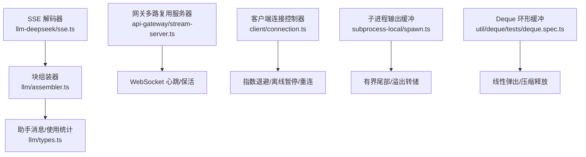
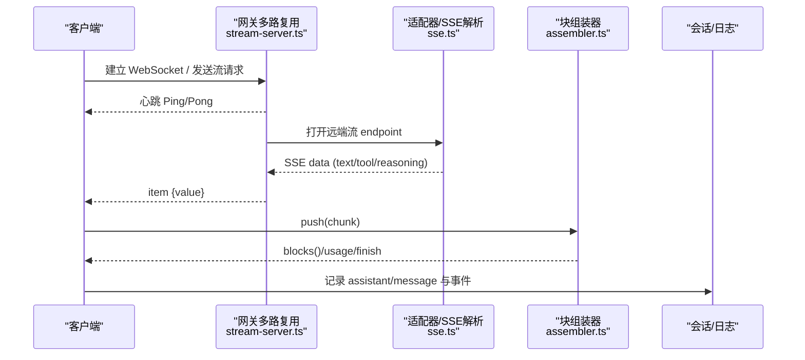
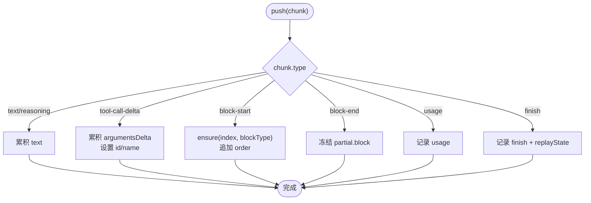
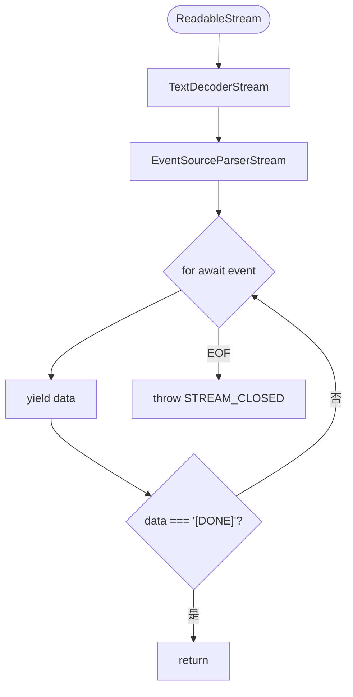
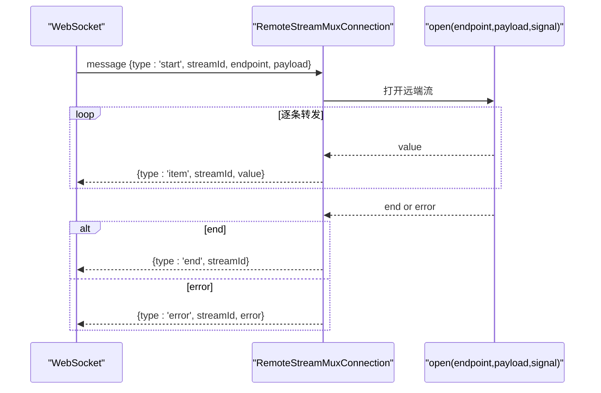
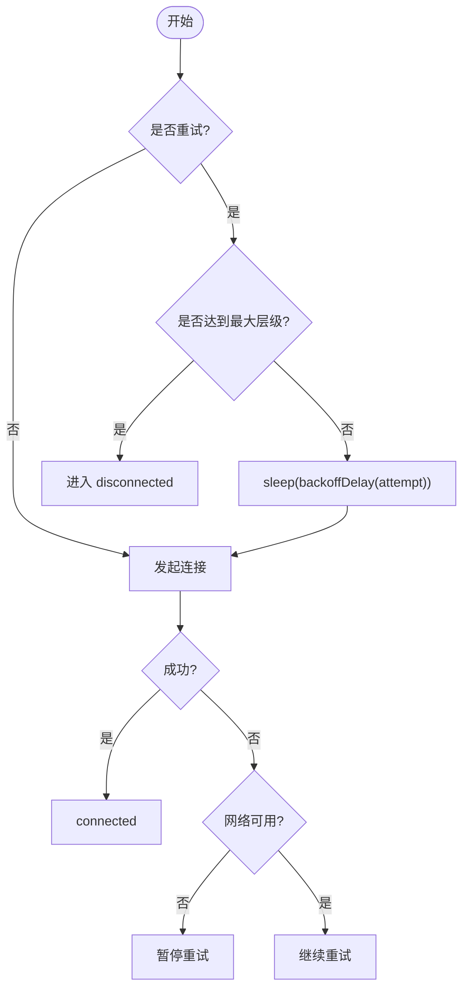
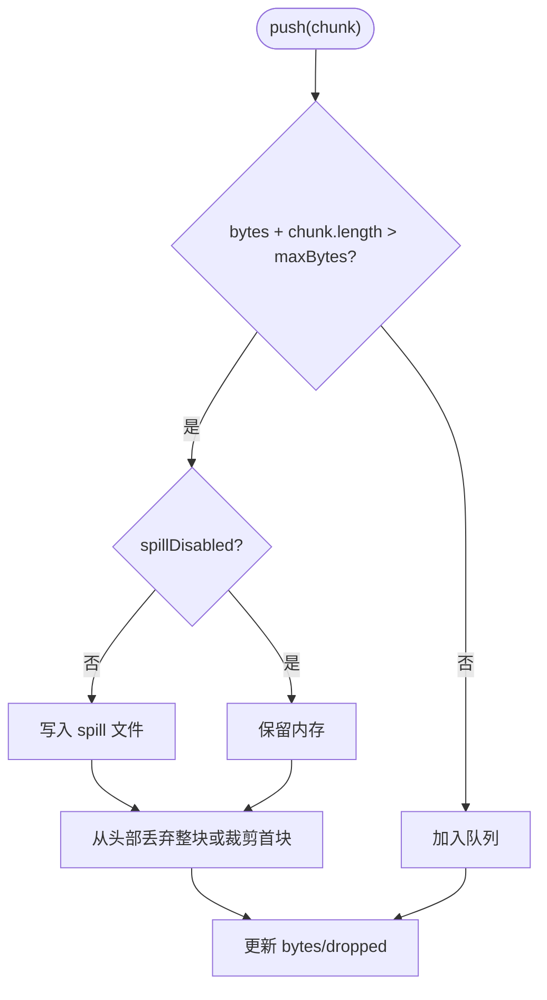
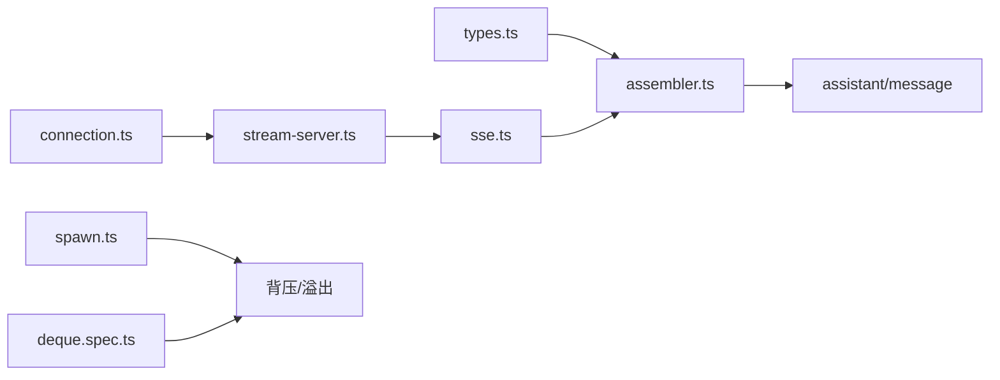

# 流式响应优化

<cite>
**本文引用的文件**
- [packages/llm/llm/src/assembler.ts](file://packages/llm/llm/src/assembler.ts)
- [packages/llm/llm/src/types.ts](file://packages/llm/llm/src/types.ts)
- [packages/llm/llm/src/content.ts](file://packages/llm/llm/src/content.ts)
- [packages/llm/llm-deepseek/src/sse.ts](file://packages/llm/llm-deepseek/src/sse.ts)
- [packages/api/gateway/src/stream-server.ts](file://packages/api/gateway/src/stream-server.ts)
- [packages/client/connection/tests/connection.client.spec.ts](file://packages/client/connection/tests/connection.client.spec.ts)
- [packages/client/connection/src/client/connection.ts](file://packages/client/connection/src/client/connection.ts)
- [packages/subprocess/subprocess-local/src/spawn.ts](file://packages/subprocess/subprocess-local/src/spawn.ts)
- [packages/util/deque/tests/deque.spec.ts](file://packages/util/deque/tests/deque.spec.ts)
- [docs/subsystems/llm-streaming.md](file://docs/subsystems/llm-streaming.md)
</cite>

## 目录
1. [简介](#简介)
2. [项目结构](#项目结构)
3. [核心组件](#核心组件)
4. [架构总览](#架构总览)
5. [详细组件分析](#详细组件分析)
6. [依赖关系分析](#依赖关系分析)
7. [性能考量](#性能考量)
8. [故障排查指南](#故障排查指南)
9. [结论](#结论)
10. [附录](#附录)

## 简介
本文件聚焦 LLM 适配器流式响应的优化实践，围绕以下主题展开：
- 流式数据传输的缓冲区管理策略：动态缓冲大小调整、内存池与零拷贝思路、垃圾回收友好设计。
- 网络请求优化：连接复用、心跳保活、超时与空闲检测、错误恢复与重试。
- 背压处理：防止内存溢出与数据丢失，保证消费端可控。
- 高效流式数据处理管道：从 SSE 解码到块组装、再到消息落盘的端到端流程。
- 不同网络环境下的自适应传输策略与错误恢复机制。
- 性能基准与优化前后对比（以仓库内测试与行为说明为依据）。

## 项目结构
本项目在“LLM 流式”相关能力上采用分层与职责分离：
- 协议与类型定义位于 llm 包，统一 StreamChunk、BlockAssembler 等契约。
- DeepSeek 适配器负责 SSE 解码与协议边界处理。
- API Gateway 提供 WebSocket 多路复用与心跳保活，承载远程流转发。
- 客户端连接控制器实现指数退避、离线暂停与重连。
- 子进程输出缓冲实现有界尾部保留与溢出转储，体现背压与内存控制。
- Deque 测试验证了环形缓冲的线性时间弹出与存储压缩，保障历史帧不长期驻留。

图表来源
- [packages/llm/llm-deepseek/src/sse.ts:1-41](file://packages/llm/llm-deepseek/src/sse.ts#L1-L41)
- [packages/llm/llm/src/assembler.ts:1-209](file://packages/llm/llm/src/assembler.ts#L1-L209)
- [packages/llm/llm/src/types.ts:167-220](file://packages/llm/llm/src/types.ts#L167-L220)
- [packages/api/gateway/src/stream-server.ts:1-225](file://packages/api/gateway/src/stream-server.ts#L1-L225)
- [packages/client/connection/src/client/connection.ts:192-224](file://packages/client/connection/src/client/connection.ts#L192-L224)
- [packages/subprocess/subprocess-local/src/spawn.ts:145-175](file://packages/subprocess/subprocess-local/src/spawn.ts#L145-L175)
- [packages/util/deque/tests/deque.spec.ts:1-94](file://packages/util/deque/tests/deque.spec.ts#L1-L94)

章节来源
- [docs/subsystems/llm-streaming.md:167-220](file://docs/subsystems/llm-streaming.md#L167-L220)

## 核心组件
- 块组装器 BlockAssembler：增量将 StreamChunk 汇聚为 ContentBlock，并维护 usage、finish、replayState；对异常流具备容错（忽略已关闭块的后续 delta），并在 max-tokens 截断时安全丢弃工具调用。
- SSE 解析器 parseSse：严格遵循 SSE 规范，按空白行分帧，支持注释回调，遇到 EOF 未收到终止标记则抛出 STREAM_CLOSED。
- 网关 RemoteStreamMuxServer：基于 WebSocket 的多路复用，心跳 Ping/Pong 检测空闲连接，失败映射为稳定 wire 值，确保逻辑流结束或错误可送达。
- 客户端连接控制器：指数退避、抖动、离线暂停、手动重连打断延迟、最大重试层级后停止。
- 子进程输出缓冲：维持固定容量尾部，超过阈值时写入 spill 文件并从头部丢弃整块或裁剪首块，保证诊断尾部精确。
- Deque 环形缓冲：O(1) 均摊弹出，支持前插/后推，稀疏压缩释放引用，避免历史帧长期占用内存。

章节来源
- [packages/llm/llm/src/assembler.ts:1-209](file://packages/llm/llm/src/assembler.ts#L1-L209)
- [packages/llm/llm-deepseek/src/sse.ts:1-41](file://packages/llm/llm-deepseek/src/sse.ts#L1-L41)
- [packages/api/gateway/src/stream-server.ts:1-225](file://packages/api/gateway/src/stream-server.ts#L1-L225)
- [packages/client/connection/tests/connection.client.spec.ts:45-244](file://packages/client/connection/tests/connection.client.spec.ts#L45-L244)
- [packages/client/connection/src/client/connection.ts:192-224](file://packages/client/connection/src/client/connection.ts#L192-L224)
- [packages/subprocess/subprocess-local/src/spawn.ts:145-175](file://packages/subprocess/subprocess-local/src/spawn.ts#L145-L175)
- [packages/util/deque/tests/deque.spec.ts:1-94](file://packages/util/deque/tests/deque.spec.ts#L1-L94)

## 架构总览
下图展示一次完整的流式调用路径：客户端发起请求，经网关多路复用转发至后端服务，后端通过 SSE 返回数据，客户端侧进行解码、组装、呈现与持久化。

图表来源
- [packages/api/gateway/src/stream-server.ts:48-95](file://packages/api/gateway/src/stream-server.ts#L48-L95)
- [packages/llm/llm-deepseek/src/sse.ts:28-41](file://packages/llm/llm-deepseek/src/sse.ts#L28-L41)
- [packages/llm/llm/src/assembler.ts:49-96](file://packages/llm/llm/src/assembler.ts#L49-L96)

## 详细组件分析

### 块组装器与流协议
- 协议要点：StreamChunk 包含 block-start/text-delta/reasoning-delta/tool-call-delta/block-end/usage/finish，index 关联同一块的不同片段，block-end 携带完整块。
- 组装策略：Map+order 维护部分块与顺序；对已关闭块的后到 delta 直接忽略，避免畸形流导致内存增长或状态破坏。
- 截断安全：max-tokens 结束时丢弃工具调用，保持回放元数据与内容一致。
- 中断安全：interruptedBlocks() 仅保留文本/推理且非空的前缀，避免生成不完整工具调用。

图表来源
- [packages/llm/llm/src/assembler.ts:49-96](file://packages/llm/llm/src/assembler.ts#L49-L96)
- [packages/llm/llm/src/assembler.ts:130-150](file://packages/llm/llm/src/assembler.ts#L130-L150)

章节来源
- [packages/llm/llm/src/assembler.ts:1-209](file://packages/llm/llm/src/assembler.ts#L1-L209)
- [docs/subsystems/llm-streaming.md:167-220](file://docs/subsystems/llm-streaming.md#L167-L220)

### SSE 解码与错误边界
- 严格分帧：仅在空白行触发事件派发，避免未终止尾帧被误刷新。
- 终止语义：必须收到 [DONE] 才结束；否则视为 STREAM_CLOSED，拒绝不可信响应。
- 注释通道：可选 onComment 回调用于传输活动观测，不影响业务 payload。

图表来源
- [packages/llm/llm-deepseek/src/sse.ts:28-41](file://packages/llm/llm-deepseek/src/sse.ts#L28-L41)

章节来源
- [packages/llm/llm-deepseek/src/sse.ts:1-41](file://packages/llm/llm-deepseek/src/sse.ts#L1-L41)

### 网关多路复用与心跳保活
- 单连接多流：一个 WebSocket 承载多个逻辑流，按 streamId 路由。
- 心跳保活：周期性 Ping，连续错过 PONG 则判定死连接并终止。
- 错误映射：将底层异常转换为稳定的 wire 错误对象，确保客户端可识别。
- 优雅关闭：close() 终止所有 socket 并等待所有流迭代结束。

图表来源
- [packages/api/gateway/src/stream-server.ts:112-178](file://packages/api/gateway/src/stream-server.ts#L112-L178)
- [packages/api/gateway/src/stream-server.ts:74-95](file://packages/api/gateway/src/stream-server.ts#L74-L95)

章节来源
- [packages/api/gateway/src/stream-server.ts:1-225](file://packages/api/gateway/src/stream-server.ts#L1-L225)

### 客户端连接与重试策略
- 指数退避+抖动：逐步增大重试间隔，避免雪崩。
- 离线暂停：网络不可用时暂停自动重试，恢复后从基础延迟重新开始。
- 手动重连：可立即打断当前延迟并发起新尝试。
- 最大层级：达到最终层级后停止自动重试，进入断开态。

图表来源
- [packages/client/connection/src/client/connection.ts:192-224](file://packages/client/connection/src/client/connection.ts#L192-L224)
- [packages/client/connection/tests/connection.client.spec.ts:45-244](file://packages/client/connection/tests/connection.client.spec.ts#L45-L244)

章节来源
- [packages/client/connection/src/client/connection.ts:192-224](file://packages/client/connection/src/client/connection.ts#L192-L224)
- [packages/client/connection/tests/connection.client.spec.ts:45-244](file://packages/client/connection/tests/connection.client.spec.ts#L45-L244)

### 背压与缓冲区管理
- 子进程输出缓冲：维持固定字节上限，超限时开启 spill 文件并将后续 chunk 追加到磁盘；内存中保留尾部，必要时裁剪首块以保证最后 N 字节可见。
- Deque 环形缓冲：通过循环数组实现 O(1) 均摊弹出，支持前插/后推；在稀疏压缩时释放已移除引用，避免历史帧长期驻留。
- 图像卸载：当请求图像预算超限，按策略替换最旧图像为占位符，减少请求体积。

图表来源
- [packages/subprocess/subprocess-local/src/spawn.ts:145-175](file://packages/subprocess/subprocess-local/src/spawn.ts#L145-L175)
- [packages/util/deque/tests/deque.spec.ts:33-84](file://packages/util/deque/tests/deque.spec.ts#L33-L84)
- [packages/llm/llm/src/content.ts:339-363](file://packages/llm/llm/src/content.ts#L339-L363)

章节来源
- [packages/subprocess/subprocess-local/src/spawn.ts:145-175](file://packages/subprocess/subprocess-local/src/spawn.ts#L145-L175)
- [packages/util/deque/tests/deque.spec.ts:1-94](file://packages/util/deque/tests/deque.spec.ts#L1-L94)
- [packages/llm/llm/src/content.ts:339-363](file://packages/llm/llm/src/content.ts#L339-L363)

### 错误恢复与重试策略
- 适配器层：禁止库级重试，单次调用即一次提供者尝试；空闲超时由传输层强制，避免停滞。
- Agent 层：将失败标准化为 LlmFailure，携带 providerRetryAfterMs、requestId 等诊断信息；dsh-llm-retry 监听 agent/request-error，依据 ResolvedRetryPolicy 执行有限预算的重试。
- 上下文溢出：统一归类为 CONTEXT_WINDOW_EXCEEDED，消费者按 code 路由而非文本匹配。

章节来源
- [docs/subsystems/llm-streaming.md:230-308](file://docs/subsystems/llm-streaming.md#L230-L308)

## 依赖关系分析
- 类型与协议：llm/types.ts 定义了 StreamChunk、FinishReason、TokenUsage 等，作为各层共享契约。
- 组装与适配：llm/assembler.ts 消费 StreamChunk；llm-deepseek/sse.ts 提供协议解码；两者共同构成“流→消息”的关键链路。
- 传输与保活：api-gateway/stream-server.ts 提供 WebSocket 多路复用与心跳；client/connection.ts 提供客户端重连与退避。
- 资源与背压：subprocess-local/spawn.ts 与 util/deque 提供内存受限与高效数据结构支撑。

图表来源
- [packages/llm/llm/src/types.ts:167-220](file://packages/llm/llm/src/types.ts#L167-L220)
- [packages/llm/llm/src/assembler.ts:1-209](file://packages/llm/llm/src/assembler.ts#L1-L209)
- [packages/llm/llm-deepseek/src/sse.ts:1-41](file://packages/llm/llm-deepseek/src/sse.ts#L1-L41)
- [packages/api/gateway/src/stream-server.ts:1-225](file://packages/api/gateway/src/stream-server.ts#L1-L225)
- [packages/client/connection/src/client/connection.ts:192-224](file://packages/client/connection/src/client/connection.ts#L192-L224)
- [packages/subprocess/subprocess-local/src/spawn.ts:145-175](file://packages/subprocess/subprocess-local/src/spawn.ts#L145-L175)
- [packages/util/deque/tests/deque.spec.ts:1-94](file://packages/util/deque/tests/deque.spec.ts#L1-L94)

章节来源
- [packages/llm/llm/src/types.ts:167-220](file://packages/llm/llm/src/types.ts#L167-L220)
- [packages/llm/llm/src/assembler.ts:1-209](file://packages/llm/llm/src/assembler.ts#L1-L209)
- [packages/llm/llm-deepseek/src/sse.ts:1-41](file://packages/llm/llm-deepseek/src/sse.ts#L1-L41)
- [packages/api/gateway/src/stream-server.ts:1-225](file://packages/api/gateway/src/stream-server.ts#L1-L225)
- [packages/client/connection/src/client/connection.ts:192-224](file://packages/client/connection/src/client/connection.ts#L192-L224)
- [packages/subprocess/subprocess-local/src/spawn.ts:145-175](file://packages/subprocess/subprocess-local/src/spawn.ts#L145-L175)
- [packages/util/deque/tests/deque.spec.ts:1-94](file://packages/util/deque/tests/deque.spec.ts#L1-L94)

## 性能考量
- 线性弹出与压缩：Deque 测试表明，弹出操作为线性 deque 工作而非二次移动，移除的帧引用在回缩前即可被回收，活跃流不会长期持有历史槽位。
- 严格分帧与最小复制：SSE 解析依赖标准库流式转换，避免手工拼接带来的额外拷贝；仅在必要时切片或裁剪。
- 有界尾部与 spill：子进程输出缓冲在超限时转存磁盘，内存仅保留诊断所需的尾部，降低峰值内存。
- 心跳与空闲检测：网关心跳快速发现死连接，避免资源泄漏与无效转发。
- 重试与退避：客户端指数退避降低拥塞时的重试风暴，离线时暂停重试节省资源。

[本节为通用性能讨论，不直接分析具体文件]

## 故障排查指南
- SSE 未收到终止标记：若流在 EOF 前结束且未收到 [DONE]，会抛出 STREAM_CLOSED，需检查上游服务是否正确发送终止信号。
- 连接频繁断开：检查心跳是否收到 PONG；若连续错过两次以上，将被终止；确认网络质量与代理配置。
- 重试风暴：确认退避参数与最大层级；在网络不可用时自动暂停重试，恢复后从基础延迟重启。
- 输出过大导致 OOM：启用 spill 并确保 maxLogBytes/addressSpaceMb 配置兼容；参考加载时兼容性检查与 flush 路径的内存占用。
- 工具调用不完整：max-tokens 截断时会丢弃工具调用；如需执行，应调整 maxTokens 或分段生成。

章节来源
- [packages/llm/llm-deepseek/src/sse.ts:28-41](file://packages/llm/llm-deepseek/src/sse.ts#L28-L41)
- [packages/api/gateway/src/stream-server.ts:74-95](file://packages/api/gateway/src/stream-server.ts#L74-L95)
- [packages/client/connection/tests/connection.client.spec.ts:45-244](file://packages/client/connection/tests/connection.client.spec.ts#L45-L244)
- [packages/subprocess/subprocess-local/src/spawn.ts:145-175](file://packages/subprocess/subprocess-local/src/spawn.ts#L145-L175)

## 结论
该代码库在 LLM 流式响应方面提供了稳健的协议抽象、严格的解码边界、高效的组装算法以及健壮的传输与重试机制。通过有界缓冲、环形队列与心跳保活，系统在长连接、高吞吐场景下仍能保持稳定与低内存占用。结合统一的失败模型与重试策略，系统在不同网络环境下具备良好的自适应能力与错误恢复能力。

[本节为总结性内容，不直接分析具体文件]

## 附录
- 流式协议与类型参考：见 llm-streaming 文档中的 StreamChunk、BlockAssembler、TokenUsage 等定义。
- 适配器契约：每个适配器需实现 stream()，遵守 usage 在 finish 之前、工具调用参数保持原始 JSON 字符串等约定。
- 图像预算：当请求图像超出预算时，按策略替换最旧图像为占位符，减少请求体积。

章节来源
- [docs/subsystems/llm-streaming.md:167-220](file://docs/subsystems/llm-streaming.md#L167-L220)
- [docs/subsystems/llm-streaming.md:288-308](file://docs/subsystems/llm-streaming.md#L288-L308)
- [packages/llm/llm/src/content.ts:339-363](file://packages/llm/llm/src/content.ts#L339-L363)