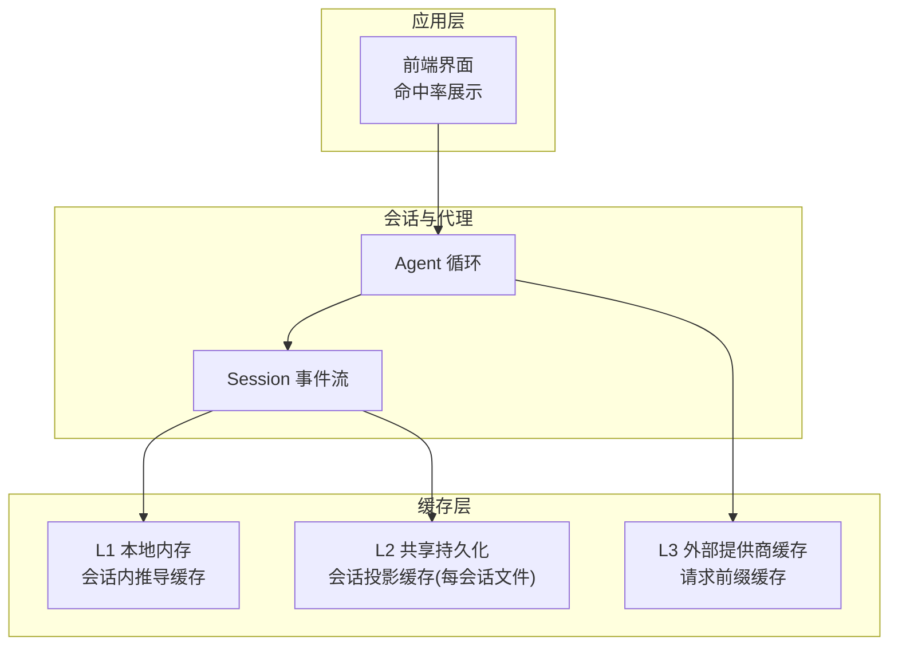
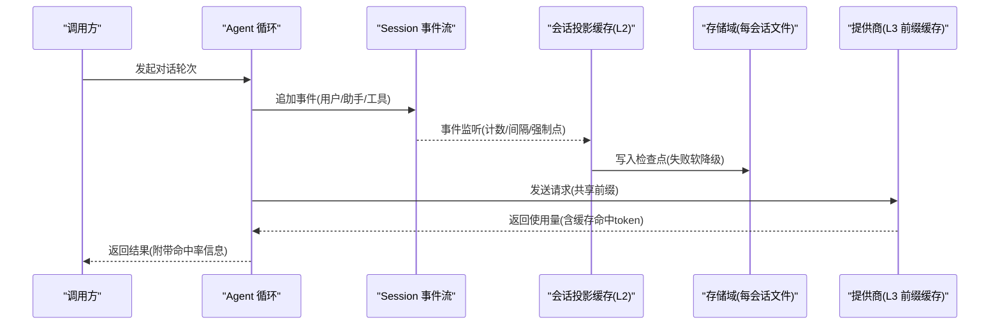
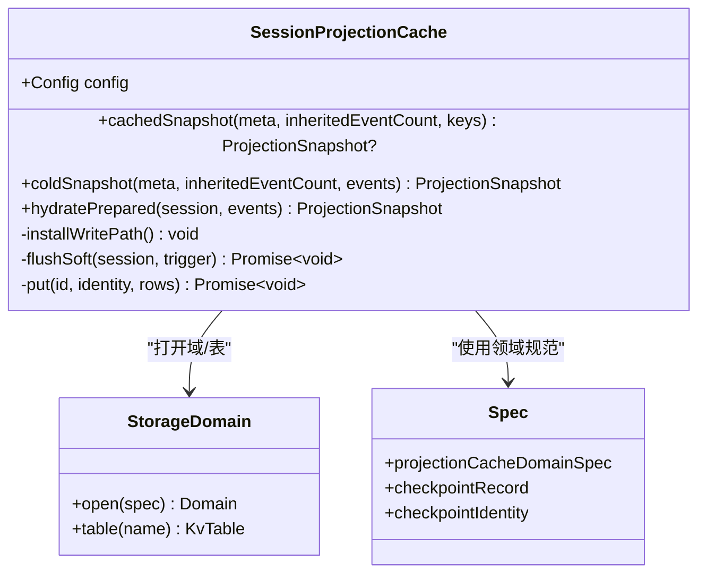
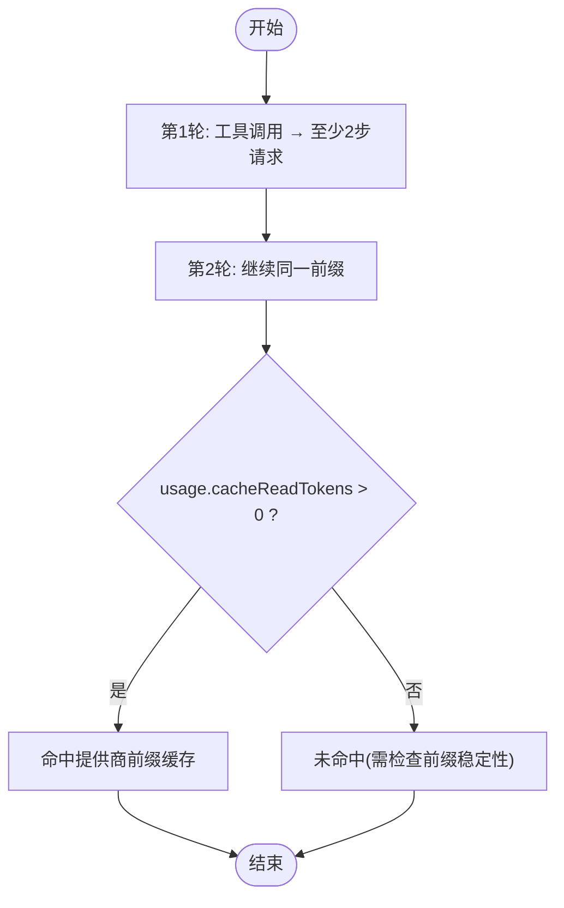
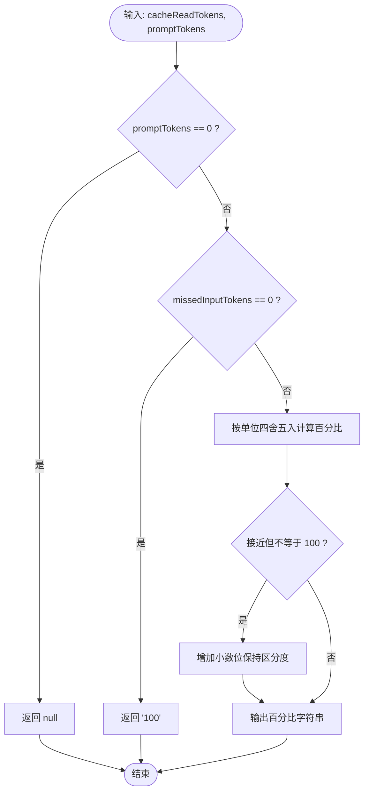
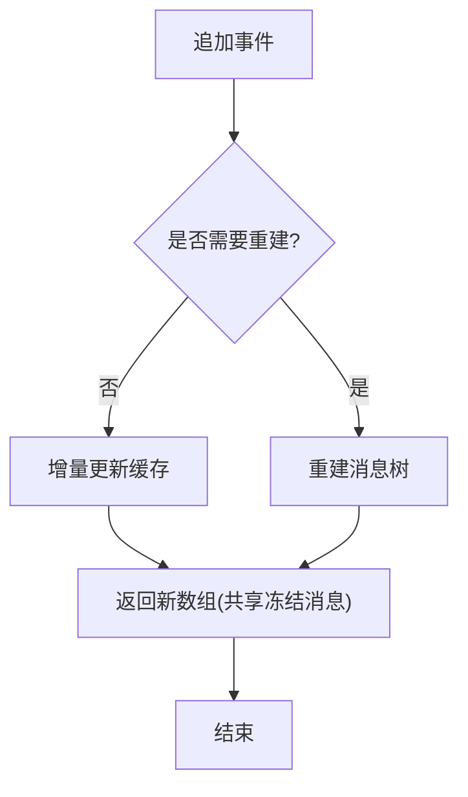
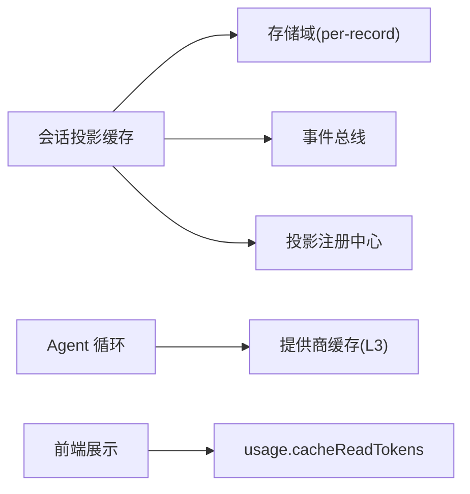

# 缓存策略优化

<cite>
**本文引用的文件**
- [packages/session/session-projection-cache/src/index.ts](file://packages/session/session-projection-cache/src/index.ts)
- [packages/session/session-projection-cache/src/spec.ts](file://packages/session/session-projection-cache/src/spec.ts)
- [packages/session/session-projection-cache/tests/cache.spec.ts](file://packages/session/session-projection-cache/tests/cache.spec.ts)
- [packages/core/agent-loop/tests/request-cache.e2e.ts](file://packages/core/agent-loop/tests/request-cache.e2e.ts)
- [packages/client/ui-chat/src/client/chat/token-format.ts](file://packages/client/ui-chat/src/client/chat/token-format.ts)
- [packages/core/session/tests/derived-cache.spec.ts](file://packages/core/session/tests/derived-cache.spec.ts)
</cite>

## 目录
1. [简介](#简介)
2. [项目结构](#项目结构)
3. [核心组件](#核心组件)
4. [架构总览](#架构总览)
5. [详细组件分析](#详细组件分析)
6. [依赖关系分析](#依赖关系分析)
7. [性能考量](#性能考量)
8. [故障排查指南](#故障排查指南)
9. [结论](#结论)
10. [附录](#附录)

## 简介
本文件围绕仓库中的多级缓存与命中率优化展开，聚焦以下目标：
- 多级缓存架构设计：L1 本地内存、L2 共享持久化（按会话分片）、L3 外部提供商前缀缓存。
- 缓存策略选择依据：TTL/阈值管理、LRU 淘汰思路、命中率统计与展示。
- 模型元数据缓存：模型配置、工具列表、权限信息的缓存策略与一致性。
- 响应结果缓存机制：内容哈希、版本控制、失效策略。
- 一致性与并发：读多写少场景下的幂等、防重放、冷启动回退。
- 调优参数与监控指标：可观测性、关键阈值、部署示例与效果评估方法。

## 项目结构
与缓存相关的关键实现集中在会话投影缓存、请求级缓存测试、以及前端命中率展示模块：
- 会话投影缓存：提供“每会话”的持久化检查点，作为 L2 层；配合事件流在 turn/end、创建、销毁时落盘，支持冷启动快速恢复。
- 请求级缓存：通过端到端测试验证基于日志前缀的提供商缓存命中（L3）。
- 前端命中率展示：将缓存读取 token 占比以稳定百分比呈现，避免高命中率时的显示抖动。
- 派生消息缓存：会话内消息推导的缓存与重建策略，保障 UI 渲染性能与一致性。

图表来源
- [packages/session/session-projection-cache/src/index.ts:92-153](file://packages/session/session-projection-cache/src/index.ts#L92-L153)
- [packages/core/agent-loop/tests/request-cache.e2e.ts:73-106](file://packages/core/agent-loop/tests/request-cache.e2e.ts#L73-L106)
- [packages/client/ui-chat/src/client/chat/token-format.ts:67-98](file://packages/client/ui-chat/src/client/chat/token-format.ts#L67-L98)

章节来源
- [packages/session/session-projection-cache/src/index.ts:92-153](file://packages/session/session-projection-cache/src/index.ts#L92-L153)
- [packages/core/agent-loop/tests/request-cache.e2e.ts:73-106](file://packages/core/agent-loop/tests/request-cache.e2e.ts#L73-L106)
- [packages/client/ui-chat/src/client/chat/token-format.ts:67-98](file://packages/client/ui-chat/src/client/chat/token-format.ts#L67-L98)

## 核心组件
- 会话投影缓存服务：负责会话状态的多级折叠与持久化检查点，提供热路径快照、冷路径恢复、前置标题提示等能力。
- 存储域规范：定义“每会话”布局、记录模式、兼容版本与无效记录处理策略。
- 请求级缓存 E2E：验证日志前缀稳定性带来的提供商缓存命中。
- 命中率格式化：对高命中率进行稳定百分比展示，避免四舍五入导致的视觉跳变。
- 会话派生消息缓存：保证消息推导的增量更新与重建一致性。

章节来源
- [packages/session/session-projection-cache/src/index.ts:92-153](file://packages/session/session-projection-cache/src/index.ts#L92-L153)
- [packages/session/session-projection-cache/src/spec.ts:1-106](file://packages/session/session-projection-cache/src/spec.ts#L1-L106)
- [packages/core/agent-loop/tests/request-cache.e2e.ts:73-106](file://packages/core/agent-loop/tests/request-cache.e2e.ts#L73-L106)
- [packages/client/ui-chat/src/client/chat/token-format.ts:67-98](file://packages/client/ui-chat/src/client/chat/token-format.ts#L67-L98)
- [packages/core/session/tests/derived-cache.spec.ts:22-88](file://packages/core/session/tests/derived-cache.spec.ts#L22-L88)

## 架构总览
下图展示了从用户请求到多级缓存的完整链路，包括 L1/L2/L3 的职责边界与交互顺序。

图表来源
- [packages/session/session-projection-cache/src/index.ts:301-352](file://packages/session/session-projection-cache/src/index.ts#L301-L352)
- [packages/core/agent-loop/tests/request-cache.e2e.ts:73-106](file://packages/core/agent-loop/tests/request-cache.e2e.ts#L73-L106)

## 详细组件分析

### 组件一：会话投影缓存（L2 持久化）
- 职责
  - 维护每个会话的检查点（rows），包含各投影单元的 ver/seq/val。
  - 提供 cachedSnapshot/coldSnapshot/hydratePrepared 等接口，支撑冷/热路径。
  - 通过事件监听实现写后推（write-behind）：turn/end、session/created、session/disposed 为强制落盘点；同时支持按事件数与时间间隔节流。
- 一致性
  - 记录绑定生命周期身份（formatVersion、createdAt、cwd、isSeeded、inheritedEventCount），防止跨会话或格式不匹配导致的状态污染。
  - 读路径只接受 identity 匹配的已持久化记录，否则走冷路径重建并异步回写。
- 容错
  - 所有持久化写入均为 fail-soft：失败仅记录警告，下次冷读会自愈。
  - 存储域采用 per-record 布局，单会话损坏不影响其他会话；无效记录备份跳过，避免启动阻塞。

图表来源
- [packages/session/session-projection-cache/src/index.ts:92-153](file://packages/session/session-projection-cache/src/index.ts#L92-L153)
- [packages/session/session-projection-cache/src/spec.ts:1-106](file://packages/session/session-projection-cache/src/spec.ts#L1-L106)

章节来源
- [packages/session/session-projection-cache/src/index.ts:92-153](file://packages/session/session-projection-cache/src/index.ts#L92-L153)
- [packages/session/session-projection-cache/src/index.ts:301-352](file://packages/session/session-projection-cache/src/index.ts#L301-L352)
- [packages/session/session-projection-cache/src/spec.ts:1-106](file://packages/session/session-projection-cache/src/spec.ts#L1-L106)

### 组件二：请求级缓存命中（L3 提供商前缀缓存）
- 目标
  - 验证由日志推导的请求具备稳定的前缀，从而触发提供商侧的前缀缓存命中。
- 观察点
  - 通过 assistant/message 事件的 usage 字段中的 cacheReadTokens 判断是否命中。
  - 首轮请求无命中，后续共享相同前缀的请求应报告 >0 的缓存 token。
- 意义
  - 证明系统层面的前缀稳定性是获得 L3 缓存收益的前提。

图表来源
- [packages/core/agent-loop/tests/request-cache.e2e.ts:73-106](file://packages/core/agent-loop/tests/request-cache.e2e.ts#L73-L106)

章节来源
- [packages/core/agent-loop/tests/request-cache.e2e.ts:73-106](file://packages/core/agent-loop/tests/request-cache.e2e.ts#L73-L106)

### 组件三：命中率展示与可视化（前端）
- 目标
  - 在高命中率场景下，避免整数四舍五入导致的“虚假 100%”，仅在必要时暴露足够的小数位以保持区分度。
- 行为
  - 当缓存读取 token 接近总量时，动态提升精度，确保不会误报全命中。
  - 该逻辑用于会话级命中率展示，保持视觉稳定且真实。

图表来源
- [packages/client/ui-chat/src/client/chat/token-format.ts:67-98](file://packages/client/ui-chat/src/client/chat/token-format.ts#L67-L98)

章节来源
- [packages/client/ui-chat/src/client/chat/token-format.ts:67-98](file://packages/client/ui-chat/src/client/chat/token-format.ts#L67-L98)

### 组件四：会话派生消息缓存（L1 本地）
- 目标
  - 会话内消息推导的缓存与重建：新增事件时增量更新，表面替换时重建，返回新数组但共享冻结的消息对象。
- 行为
  - deriveMessages 与 deriveEventMessage 保持一致性，确保与从头回放等价。
  - 对空消息或边界事件返回 null，避免冗余。

图表来源
- [packages/core/session/tests/derived-cache.spec.ts:22-88](file://packages/core/session/tests/derived-cache.spec.ts#L22-L88)

章节来源
- [packages/core/session/tests/derived-cache.spec.ts:22-88](file://packages/core/session/tests/derived-cache.spec.ts#L22-L88)

## 依赖关系分析
- 会话投影缓存依赖：
  - 存储域（storage-domain）：提供 KV 表与 per-record 布局。
  - 会话事件总线：监听 session/event、session/created、session/disposed。
  - 会话投影注册中心：用于 checkpoint/hydrate/restore/view 等操作。
- 请求级缓存依赖：
  - Agent 循环与 LLM 运行时：产生带 usage 的事件，供测试断言。
- 前端命中率展示依赖：
  - 会话事件 usage 中的 cacheReadTokens 与 promptTokens。

图表来源
- [packages/session/session-projection-cache/src/index.ts:92-153](file://packages/session/session-projection-cache/src/index.ts#L92-L153)
- [packages/core/agent-loop/tests/request-cache.e2e.ts:73-106](file://packages/core/agent-loop/tests/request-cache.e2e.ts#L73-L106)
- [packages/client/ui-chat/src/client/chat/token-format.ts:67-98](file://packages/client/ui-chat/src/client/chat/token-format.ts#L67-L98)

章节来源
- [packages/session/session-projection-cache/src/index.ts:92-153](file://packages/session/session-projection-cache/src/index.ts#L92-L153)
- [packages/core/agent-loop/tests/request-cache.e2e.ts:73-106](file://packages/core/agent-loop/tests/request-cache.e2e.ts#L73-L106)
- [packages/client/ui-chat/src/client/chat/token-format.ts:67-98](file://packages/client/ui-chat/src/client/chat/token-format.ts#L67-L98)

## 性能考量
- 写路径节流
  - 按事件数量阈值与时间间隔双重触发，减少频繁落盘放大。
  - 强制落盘点（创建、turn/end、销毁）保证关键切面及时持久化。
- 读路径短路
  - 冷路径首次重建后回写检查点，后续冷读可直接复用。
  - 每会话独立文件，降低写放大与单点故障影响。
- 命中率与展示
  - 高命中率下动态调整小数位，避免“假满格”误导。
- 建议的调优参数（来自配置项）
  - writeEveryEvents：每次落盘前的累计事件数阈值。
  - writeIntervalMs：最长延迟落盘时间（毫秒）。
  - 这些参数应在组合配置中显式声明，根据负载与 I/O 特性调优。

章节来源
- [packages/session/session-projection-cache/src/index.ts:63-73](file://packages/session/session-projection-cache/src/index.ts#L63-L73)
- [packages/session/session-projection-cache/tests/cache.spec.ts:236-262](file://packages/session/session-projection-cache/tests/cache.spec.ts#L236-L262)
- [packages/client/ui-chat/src/client/chat/token-format.ts:67-98](file://packages/client/ui-chat/src/client/chat/token-format.ts#L67-L98)

## 故障排查指南
- 常见现象
  - 冷启动慢：可能因检查点缺失或身份不匹配，导致必须冷重建。
  - 命中率低：检查请求前缀稳定性与系统提示/工具调用序列是否变化。
  - 展示异常：高命中率时若出现“100%”波动，确认是否进入动态精度分支。
- 定位步骤
  - 检查会话投影缓存的 identity 匹配与 formatVersion 是否一致。
  - 查看事件监听触发点（turn/end、创建、销毁）是否正常落盘。
  - 通过 assistant/message 的 usage 字段核对 cacheReadTokens 是否 >0。
- 恢复策略
  - 存储域对无效记录采取备份跳过，避免启动阻塞；下一次冷读会重建并回写。
  - 写失败为软降级，不影响主流程，仅延长下次冷读耗时。

章节来源
- [packages/session/session-projection-cache/src/spec.ts:74-106](file://packages/session/session-projection-cache/src/spec.ts#L74-L106)
- [packages/session/session-projection-cache/src/index.ts:301-352](file://packages/session/session-projection-cache/src/index.ts#L301-L352)
- [packages/core/agent-loop/tests/request-cache.e2e.ts:73-106](file://packages/core/agent-loop/tests/request-cache.e2e.ts#L73-L106)

## 结论
- 本项目实现了清晰的多级缓存体系：L1 本地推导缓存、L2 每会话持久化检查点、L3 提供商前缀缓存。
- 通过身份校验、弱一致写后推、fail-soft 持久化与 per-record 布局，兼顾了性能与鲁棒性。
- 前端命中率展示在高命中率场景下保持稳定，避免误导。
- 建议在部署中结合 writeEveryEvents 与 writeIntervalMs 进行压测调优，并以 usage.cacheReadTokens 为核心指标评估 L3 收益。

## 附录
- 部署与配置要点
  - 在组合配置中显式设置 writeEveryEvents 与 writeIntervalMs，并根据业务峰值与磁盘 I/O 能力调整。
  - 确保会话事件流稳定，避免不必要的系统提示或工具调用序列变化，以最大化 L3 前缀命中。
- 监控指标
  - 命中率：cacheReadTokens / promptTokens，注意高命中率时的动态精度展示。
  - 落盘频率：统计 flushSoft 触发次数与耗时分布。
  - 冷/热路径比例：coldSnapshot 与 cachedSnapshot 的使用比例。
- 效果评估方法
  - 使用端到端测试用例（如 request-cache.e2e.ts）验证不同轮次下的 cacheReadTokens 是否持续增长。
  - 对比不同 writeEveryEvents/writeIntervalMs 配置下的吞吐与尾延迟。