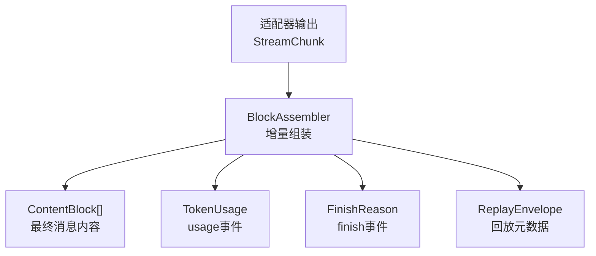
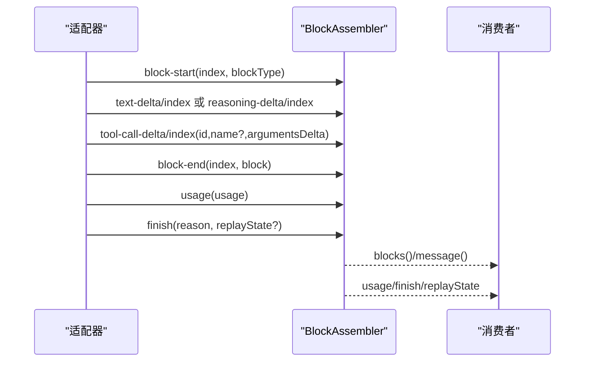
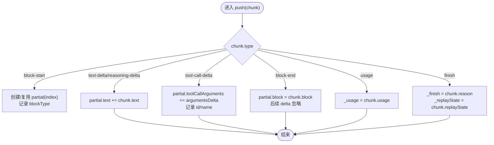
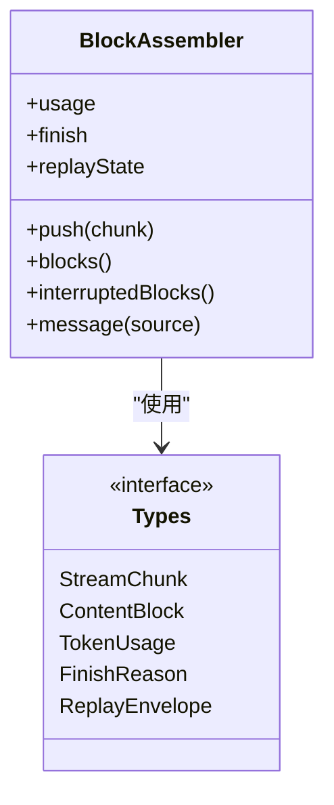
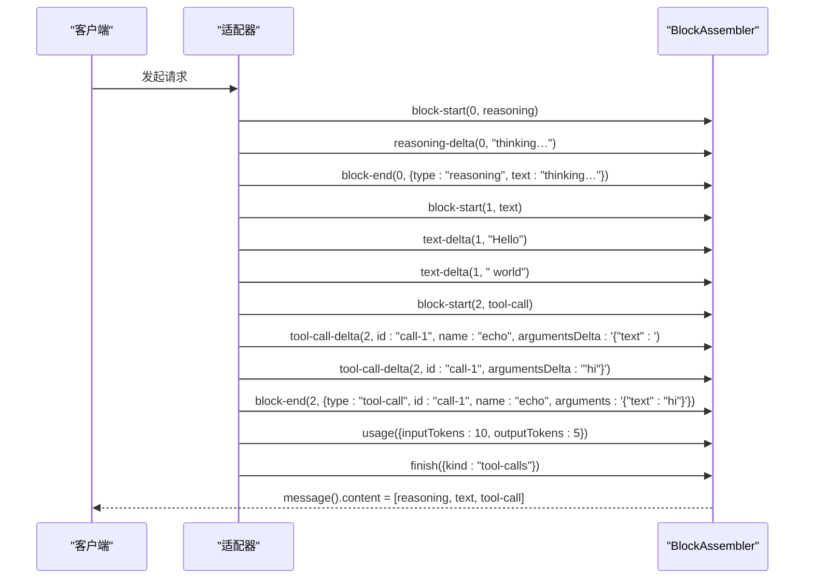

# StreamChunk协议规范

<cite>
**本文引用的文件**
- [llm-streaming.zh.md](file://docs/subsystems/llm-streaming.zh.md)
- [types.ts](file://packages/llm/llm/src/types.ts)
- [assembler.ts](file://packages/llm/llm/src/assembler.ts)
- [assembler.spec.ts](file://packages/llm/llm/tests/assembler.spec.ts)
- [properties.spec.ts](file://packages/llm/llm/tests/properties.spec.ts)
- [mock-adapter.ts](file://packages/core/agent-loop/tests/mock-adapter.ts)
- [convert.spec.ts](file://packages/llm/llm-pi-ai/tests/convert.spec.ts)
</cite>

## 目录
1. [简介](#简介)
2. [项目结构](#项目结构)
3. [核心组件](#核心组件)
4. [架构总览](#架构总览)
5. [详细组件分析](#详细组件分析)
6. [依赖关系分析](#依赖关系分析)
7. [性能考量](#性能考量)
8. [故障排查指南](#故障排查指南)
9. [结论](#结论)
10. [附录：完整流式交互示例](#附录完整流式交互示例)

## 简介
本规范定义大模型（LLM）适配器输出的原始流式协议 StreamChunk，用于在对话轮次中增量传输文本、推理内容、工具调用及其参数，并在结束时提供使用统计与完成信号。该协议通过 index 将交错到达的 delta 关联到对应块，block-end 携带已组装好的 ContentBlock，消费方无需自行拼接 delta。协议是封闭的可辨识联合类型，新增变体会在消费端触发编译错误，从而保证向后兼容与可演进性。

## 项目结构
StreamChunk 协议的核心定义位于 LLM 包中，包含类型声明、组装器实现以及测试用例；文档子系统提供了完整的中文说明。关键位置如下：
- 协议类型与数据模型：packages/llm/llm/src/types.ts
- 组装器实现：packages/llm/llm/src/assembler.ts
- 协议行为与约束：docs/subsystems/llm-streaming.zh.md
- 行为验证与边界用例：packages/llm/llm/tests/*.spec.ts

图表来源
- [types.ts:370-390](file://packages/llm/llm/src/types.ts#L370-L390)
- [assembler.ts:45-96](file://packages/llm/llm/src/assembler.ts#L45-L96)

章节来源
- [llm-streaming.zh.md:169-218](file://docs/subsystems/llm-streaming.zh.md#L169-L218)
- [types.ts:370-390](file://packages/llm/llm/src/types.ts#L370-L390)

## 核心组件
- StreamChunk：原始协议事件联合类型，包含 block-start、text-delta、reasoning-delta、tool-call-delta、block-end、usage、finish。
- BlockAssembler：唯一共享实现，负责将 StreamChunk 流折叠为 ContentBlock、usage、finish reason 与 replayState。
- TokenUsage：逐调用 token 计量，字段互不重叠，支持缓存与推理 token 的可选计数。
- FinishReason：响应停止原因，包括 stop、tool-calls、max-tokens、aborted、error。
- ReplayEnvelope：成功响应的回放元数据，包含 response 级与 per-block 级条目，与 emitted blocks 对齐。

章节来源
- [types.ts:126-163](file://packages/llm/llm/src/types.ts#L126-L163)
- [types.ts:350-390](file://packages/llm/llm/src/types.ts#L350-L390)
- [assembler.ts:26-43](file://packages/llm/llm/src/assembler.ts#L26-L43)

## 架构总览
适配器按流顺序发出 StreamChunk，BlockAssembler 维护每个 index 的部分状态（partial），并处理以下逻辑：
- block-start：初始化 partial，记录 blockType。
- text-delta/reasoning-delta：追加文本到 partial.text。
- tool-call-delta：累积 argumentsDelta 字符串，并记录 id/name。
- block-end：以权威 block 冻结 partial，后续同 index 的 delta 将被忽略。
- usage：记录 TokenUsage。
- finish：记录 FinishReason 与可选 ReplayEnvelope。

图表来源
- [assembler.ts:49-96](file://packages/llm/llm/src/assembler.ts#L49-L96)
- [types.ts:370-390](file://packages/llm/llm/src/types.ts#L370-L390)

## 详细组件分析

### StreamChunk 事件类型与用途
- block-start：声明一个块的开始，携带 index 与 blockType（text/reasoning/tool-call）。
- text-delta/reasoning-delta：向对应 index 追加文本片段。
- tool-call-delta：向对应 index 追加工具调用的参数 JSON 片段，同时携带 id 与可选 name。
- block-end：携带已组装好的 ContentBlock，作为权威结果；同一 index 的后续 delta 被忽略。
- usage：提供 TokenUsage，必须在 finish 之前出现，finish 之后不再有任何分片。
- finish：终止信号，包含 FinishReason 与可选 ReplayEnvelope。

章节来源
- [types.ts:370-390](file://packages/llm/llm/src/types.ts#L370-L390)
- [llm-streaming.zh.md:169-218](file://docs/subsystems/llm-streaming.zh.md#L169-L218)

### 数据结构与字段含义
- TokenUsage：inputTokens、outputTokens、totalTokens（可选）、cacheReadTokens（可选）、cacheWriteTokens（可选）、reasoningTokens（可选）。各计数互不重叠，适配提供方差异。
- FinishReason：stop、tool-calls、max-tokens、aborted（含 failure）、error（含 failure）。
- ReplayEnvelope：response（响应级元数据）、blocks（per-block 条目数组，与 emitted blocks 顺序对齐）。

章节来源
- [types.ts:126-163](file://packages/llm/llm/src/types.ts#L126-L163)
- [types.ts:350-368](file://packages/llm/llm/src/types.ts#L350-L368)

### block 索引机制与 delta 重组
- index：将交错到达的 delta 关联到其所属块；BlockAssembler 用 Map<number, PartialBlock> 维护部分状态，order 数组保持首次出现的顺序。
- 重组逻辑：
  - text/reasoning：拼接 text 字段。
  - tool-call：拼接 argumentsDelta 字符串；id/name 来自 tool-call-delta；若未提供 id/name，则生成默认 id（call-{index}）与空 name。
  - block-end：以权威 block 覆盖 partial.block；重复关闭被忽略（first close wins）。
  - max-tokens 截断：丢弃所有 tool-call 块，replayState.blocks 同步裁剪。

图表来源
- [assembler.ts:49-96](file://packages/llm/llm/src/assembler.ts#L49-L96)
- [assembler.ts:108-121](file://packages/llm/llm/src/assembler.ts#L108-L121)
- [assembler.ts:130-150](file://packages/llm/llm/src/assembler.ts#L130-L150)

章节来源
- [assembler.ts:49-96](file://packages/llm/llm/src/assembler.ts#L49-L96)
- [assembler.ts:108-121](file://packages/llm/llm/src/assembler.ts#L108-L121)
- [assembler.ts:130-150](file://packages/llm/llm/src/assembler.ts#L130-L150)
- [assembler.spec.ts:93-111](file://packages/llm/llm/tests/assembler.spec.ts#L93-L111)

### 工具调用参数的流式传输格式（argumentsDelta）
- 全程保持原始 JSON 字符串；多个 argumentsDelta 片段按顺序拼接。
- 若提供方返回已解析对象，适配器需在 block-end 时重新序列化为字符串。
- 缺失 id/name 时的回退策略：id 使用 call-{index}，name 为空字符串。
- 对无 preceding block-start 的 tool-call-delta 具有容错能力。

章节来源
- [llm-streaming.zh.md:290-302](file://docs/subsystems/llm-streaming.zh.md#L290-L302)
- [assembler.ts:69-75](file://packages/llm/llm/src/assembler.ts#L69-L75)
- [assembler.ts:113-118](file://packages/llm/llm/src/assembler.ts#L113-L118)
- [convert.spec.ts:901-921](file://packages/llm/llm-pi-ai/tests/convert.spec.ts#L901-L921)

### usage、finish、error 的处理时机
- usage 必须出现在 finish 之前；finish 之后不应再有分片。
- finish 可能为 stop、tool-calls、max-tokens、aborted、error；aborted/error 携带 LlmFailure。
- 空 completion（无任何内容块的 stop）映射为 error（EMPTY_RESPONSE），可重试。

章节来源
- [llm-streaming.zh.md:290-302](file://docs/subsystems/llm-streaming.zh.md#L290-L302)
- [types.ts:126-139](file://packages/llm/llm/src/types.ts#L126-L139)

### 版本兼容性与扩展性
- StreamChunk 为封闭可辨识联合类型，新增变体会在消费端 switch/assertNever 处触发编译错误，确保向后兼容。
- ContentBlockMap 与 FinishReasonMap 为合并可扩展的和类型，插件可通过扩展 map 增加新块类型与新完成原因，但需配套 UI、压缩与持久回放支持。
- ReplayEnvelope 的 per-block 条目与 emitted blocks 严格对齐；当 assembly 丢弃块时，相应条目同步裁剪，避免不一致。

章节来源
- [llm-streaming.zh.md:169-171](file://docs/subsystems/llm-streaming.zh.md#L169-L171)
- [types.ts:108-124](file://packages/llm/llm/src/types.ts#L108-L124)
- [types.ts:126-139](file://packages/llm/llm/src/types.ts#L126-L139)
- [types.ts:350-368](file://packages/llm/llm/src/types.ts#L350-L368)

## 依赖关系分析
- BlockAssembler 依赖 types.ts 中的 StreamChunk、ContentBlock、TokenUsage、FinishReason、ReplayEnvelope。
- 测试用例验证了交错 delta、block-end 权威、usage/finish 暴露、replayState 对齐与裁剪等契约。
- mock-adapter 展示了典型工具调用流的 chunk 序列。

图表来源
- [assembler.ts:26-43](file://packages/llm/llm/src/assembler.ts#L26-L43)
- [types.ts:370-390](file://packages/llm/llm/src/types.ts#L370-L390)

章节来源
- [assembler.spec.ts:5-30](file://packages/llm/llm/tests/assembler.spec.ts#L5-L30)
- [mock-adapter.ts:30-56](file://packages/core/agent-loop/tests/mock-adapter.ts#L30-L56)
- [properties.spec.ts:31-81](file://packages/llm/llm/tests/properties.spec.ts#L31-L81)

## 性能考量
- 增量拼接：text/reasoning/tool-call 的 delta 采用字符串拼接，避免频繁分配；对于超长流，建议关注内存峰值与 GC 压力。
- 幂等性：blocks() 多次调用稳定；replayState 与 blocks 保持一致性，避免重复计算。
- 最大 token 截断：丢弃 tool-call 块，减少无效执行成本；replayState 同步裁剪，降低存储开销。
- 容错：忽略 block-end 之后的 straggler delta，防止恶意或异常适配器导致内存增长或状态损坏。

[本节提供通用指导，不直接分析具体文件]

## 故障排查指南
- 未知 blockType：assemble() 遇到未处理的 blockType 会抛出错误；检查适配器是否正确声明 block-start 与 block-end。
- 不变量违反：mustGet 发现 order 中存在但 partials 缺失的情况，表明内部状态不一致；应检查自定义拼装逻辑或外部篡改。
- 重复关闭：first block-end wins，后续 block-end 被忽略；确认上游是否重复发送 block-end。
- 工具调用参数不完整：若 argumentsDelta 非合法 JSON，下游解析失败；检查适配器序列化逻辑。
- 空响应：stop 且无内容块会被映射为 error（EMPTY_RESPONSE），可按策略重试。

章节来源
- [assembler.ts:108-121](file://packages/llm/llm/src/assembler.ts#L108-L121)
- [assembler.ts:123-128](file://packages/llm/llm/src/assembler.ts#L123-L128)
- [assembler.spec.ts:64-80](file://packages/llm/llm/tests/assembler.spec.ts#L64-L80)
- [assembler.spec.ts:215-226](file://packages/llm/llm/tests/assembler.spec.ts#L215-L226)

## 结论
StreamChunk 协议通过 index 与 block-end 的组合，实现了交错 delta 的安全、幂等重组，并提供 usage、finish、error 等标准事件以控制生命周期与计量。BlockAssembler 作为唯一共享实现，保证了行为一致性与可演进性。通过封闭联合与可扩展 map 的设计，协议既具备强类型保障，又支持未来扩展。

[本节总结性内容，不直接分析具体文件]

## 附录：完整流式交互示例
以下示例展示从开始到结束的完整流式交互过程，涵盖 reasoning、text、tool-call 与 usage、finish。

图表来源
- [assembler.spec.ts:5-30](file://packages/llm/llm/tests/assembler.spec.ts#L5-L30)
- [mock-adapter.ts:30-56](file://packages/core/agent-loop/tests/mock-adapter.ts#L30-L56)

章节来源
- [assembler.spec.ts:5-30](file://packages/llm/llm/tests/assembler.spec.ts#L5-L30)
- [mock-adapter.ts:30-56](file://packages/core/agent-loop/tests/mock-adapter.ts#L30-L56)