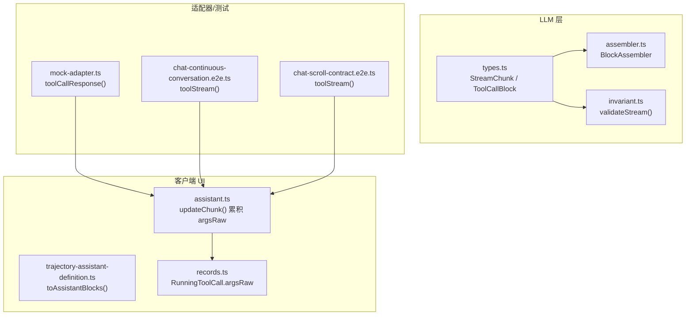
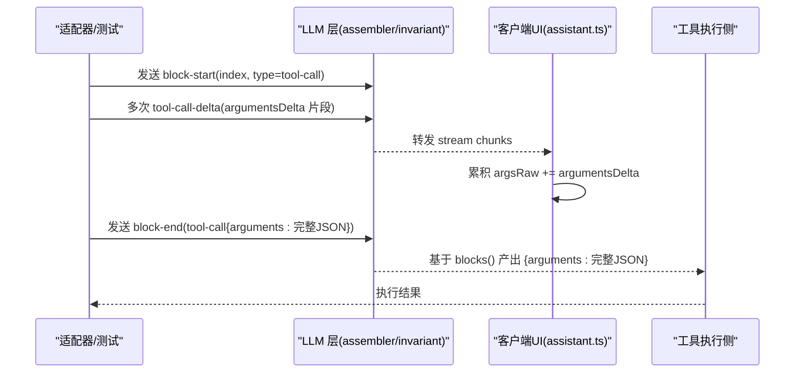
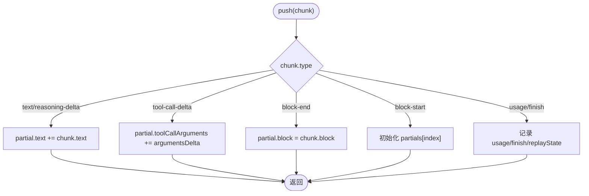
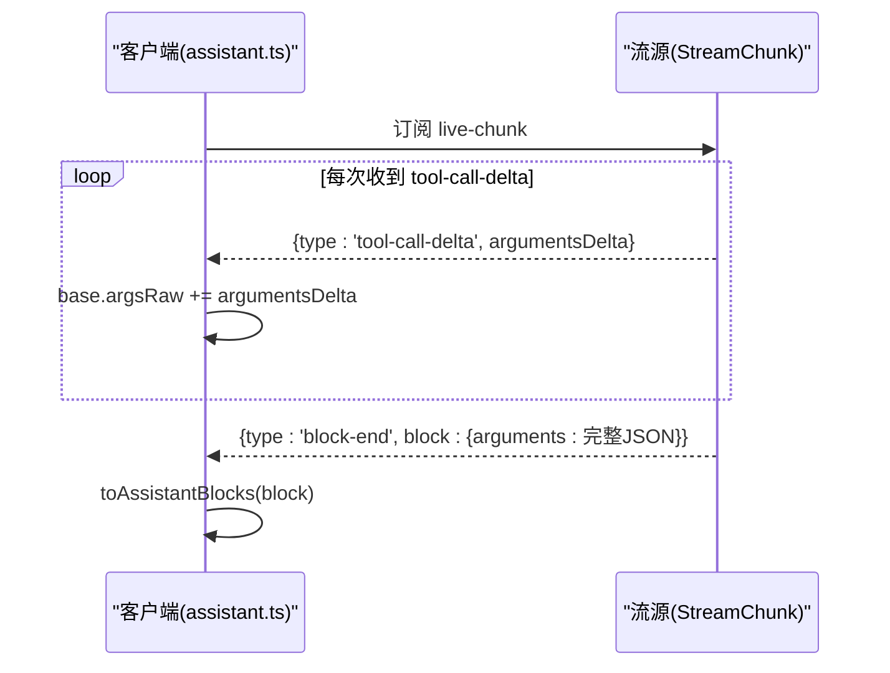
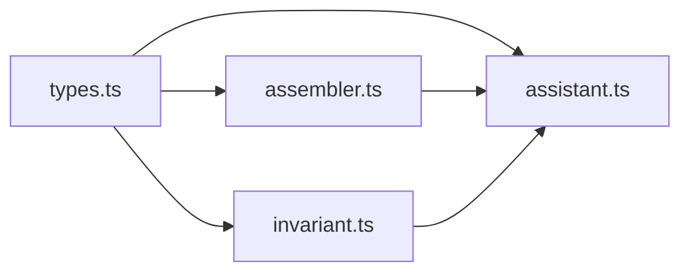

# 工具调用参数流式传输

<cite>
**本文引用的文件**
- [packages/llm/llm/src/assembler.ts](file://packages/llm/llm/src/assembler.ts)
- [packages/llm/llm/src/types.ts](file://packages/llm/llm/src/types.ts)
- [packages/llm/llm/src/invariant.ts](file://packages/llm/llm/src/invariant.ts)
- [packages/core/agent-loop/tests/mock-adapter.ts](file://packages/core/agent-loop/tests/mock-adapter.ts)
- [apps/web/tests/chat-continuous-conversation.e2e.ts](file://apps/web/tests/chat-continuous-conversation.e2e.ts)
- [apps/web/tests/chat-scroll-contract.e2e.ts](file://apps/web/tests/chat-scroll-contract.e2e.ts)
- [packages/client/ui-chat/src/client/conversation-nodes/assistant.ts](file://packages/client/ui-chat/src/client/conversation-nodes/assistant.ts)
- [packages/client/ui-trajectory/src/client/trajectory-assistant-definition.ts](file://packages/client/ui-trajectory/src/client/trajectory-assistant-definition.ts)
- [packages/client/ui-conversation/src/client/contract/records.ts](file://packages/client/ui-conversation/src/client/contract/records.ts)
- [packages/llm/llm/tests/assembler.spec.ts](file://packages/llm/llm/tests/assembler.spec.ts)
- [packages/llm/llm-pi-ai/tests/convert.spec.ts](file://packages/llm/llm-pi-ai/tests/convert.spec.ts)
</cite>

## 目录
1. [简介](#简介)
2. [项目结构](#项目结构)
3. [核心组件](#核心组件)
4. [架构总览](#架构总览)
5. [详细组件分析](#详细组件分析)
6. [依赖关系分析](#依赖关系分析)
7. [性能考量](#性能考量)
8. [故障排查指南](#故障排查指南)
9. [结论](#结论)
10. [附录](#附录)

## 简介
本技术文档聚焦于“工具调用参数的流式传输”，围绕以下关键点展开：
- argumentsDelta 字段的设计原理与使用方式
- JSON 字符串的端到端保持策略，确保复杂对象在流式传输中的完整性
- block 索引分配策略与重组逻辑（含大型参数的多块拆分与合并）
- 不同复杂度工具调用的流式示例（简单参数、嵌套对象、数组）
- 客户端对参数流的接收、验证与组装流程
- 性能优化建议与最佳实践

## 项目结构
与工具调用参数流式传输相关的代码主要分布在如下模块：
- LLM 层：定义流式协议类型、增量组装器、流校验器
- 适配器/测试：构造工具调用流片段（argumentsDelta 分段）
- 客户端 UI：消费流并增量构建工具调用卡片（保留原始 JSON 字符串）
- 会话与事件：将流事件持久化并在回放中重建

图表来源
- [packages/llm/llm/src/types.ts:370-390](file://packages/llm/llm/src/types.ts#L370-L390)
- [packages/llm/llm/src/assembler.ts:49-96](file://packages/llm/llm/src/assembler.ts#L49-L96)
- [packages/llm/llm/src/invariant.ts:35-69](file://packages/llm/llm/src/invariant.ts#L35-L69)
- [packages/core/agent-loop/tests/mock-adapter.ts:30-56](file://packages/core/agent-loop/tests/mock-adapter.ts#L30-L56)
- [apps/web/tests/chat-continuous-conversation.e2e.ts:108-133](file://apps/web/tests/chat-continuous-conversation.e2e.ts#L108-L133)
- [apps/web/tests/chat-scroll-contract.e2e.ts:118-143](file://apps/web/tests/chat-scroll-contract.e2e.ts#L118-L143)
- [packages/client/ui-chat/src/client/conversation-nodes/assistant.ts:122-135](file://packages/client/ui-chat/src/client/conversation-nodes/assistant.ts#L122-L135)
- [packages/client/ui-trajectory/src/client/trajectory-assistant-definition.ts:1-31](file://packages/client/ui-trajectory/src/client/trajectory-assistant-definition.ts#L1-L31)
- [packages/client/ui-conversation/src/client/contract/records.ts:263-279](file://packages/client/ui-conversation/src/client/contract/records.ts#L263-L279)

章节来源
- [packages/llm/llm/src/types.ts:370-390](file://packages/llm/llm/src/types.ts#L370-L390)
- [packages/llm/llm/src/assembler.ts:49-96](file://packages/llm/llm/src/assembler.ts#L49-L96)
- [packages/llm/llm/src/invariant.ts:35-69](file://packages/llm/llm/src/invariant.ts#L35-L69)
- [packages/core/agent-loop/tests/mock-adapter.ts:30-56](file://packages/core/agent-loop/tests/mock-adapter.ts#L30-L56)
- [apps/web/tests/chat-continuous-conversation.e2e.ts:108-133](file://apps/web/tests/chat-continuous-conversation.e2e.ts#L108-L133)
- [apps/web/tests/chat-scroll-contract.e2e.ts:118-143](file://apps/web/tests/chat-scroll-contract.e2e.ts#L118-L143)
- [packages/client/ui-chat/src/client/ui-chat/src/client/conversation-nodes/assistant.ts:122-135](file://packages/client/ui-chat/src/client/conversation-nodes/assistant.ts#L122-L135)
- [packages/client/ui-trajectory/src/client/trajectory-assistant-definition.ts:1-31](file://packages/client/ui-trajectory/src/client/trajectory-assistant-definition.ts#L1-L31)
- [packages/client/ui-conversation/src/client/contract/records.ts:263-279](file://packages/client/ui-conversation/src/client/contract/records.ts#L263-L279)

## 核心组件
- StreamChunk 协议：定义 block-start/text-delta/reasoning-delta/tool-call-delta/block-end/usage/finish 等消息；其中 tool-call-delta 携带 id、可选 name 与 argumentsDelta（JSON 字符串片段）。
- BlockAssembler：增量组装器，维护每个 index 的部分状态，按顺序拼接 text/reasoning/tool-call 内容，并在 block-end 时固化最终块。
- validateStream：对流进行语法校验，保证 block-start/end 配对、类型一致、无重复 index 等不变量。
- 客户端累积器：在 UI 层以 argsRaw 形式累积 argumentsDelta，避免过早解析，保证 JSON 完整无损地传递到执行侧。

章节来源
- [packages/llm/llm/src/types.ts:370-390](file://packages/llm/llm/src/types.ts#L370-L390)
- [packages/llm/llm/src/assembler.ts:49-96](file://packages/llm/llm/src/assembler.ts#L49-L96)
- [packages/llm/llm/src/invariant.ts:35-69](file://packages/llm/llm/src/invariant.ts#L35-L69)
- [packages/client/ui-chat/src/client/conversation-nodes/assistant.ts:122-135](file://packages/client/ui-chat/src/client/conversation-nodes/assistant.ts#L122-L135)

## 架构总览
下图展示了从适配器生成流片段，到服务端/客户端组装，再到工具执行的端到端路径。重点体现 argumentsDelta 的逐段追加与最终 JSON 字符串的无损传递。

图表来源
- [packages/core/agent-loop/tests/mock-adapter.ts:30-56](file://packages/core/agent-loop/tests/mock-adapter.ts#L30-L56)
- [packages/llm/llm/src/assembler.ts:69-82](file://packages/llm/llm/src/assembler.ts#L69-L82)
- [packages/client/ui-chat/src/client/conversation-nodes/assistant.ts:122-135](file://packages/client/ui-chat/src/client/conversation-nodes/assistant.ts#L122-L135)

## 详细组件分析

### 流式协议与数据类型
- StreamChunk.tool-call-delta 包含：
  - index：用于关联同一块的起始与结束
  - id：工具调用标识（可缺省，由组装器回退为 call-{index}）
  - name：工具名（可缺省）
  - argumentsDelta：JSON 字符串片段，必须保持原样拼接
- ContentBlock.ToolCallBlock.arguments 始终为原始 JSON 字符串，禁止在传输过程中被提前解析或格式化，以确保端到端一致性。

章节来源
- [packages/llm/llm/src/types.ts:90-98](file://packages/llm/llm/src/types.ts#L90-L98)
- [packages/llm/llm/src/types.ts:370-390](file://packages/llm/llm/src/types.ts#L370-L390)

### 增量组装器（BlockAssembler）
- 职责：
  - 维护每个 index 的部分状态（text/reasoning/tool-callArguments）
  - 处理重复 block-start、关闭后的 straggler delta 等异常输入
  - 在 finish 或中断场景下输出 blocks()/interruptedBlocks()
- 关键行为：
  - tool-call-delta：追加 argumentsDelta，更新 id/name（若提供）
  - block-end：固化最终块；若已关闭则忽略后续 delta
  - max-tokens 截断：丢弃无法安全执行的 tool-call 块

图表来源
- [packages/llm/llm/src/assembler.ts:49-96](file://packages/llm/llm/src/assembler.ts#L49-L96)

章节来源
- [packages/llm/llm/src/assembler.ts:49-96](file://packages/llm/llm/src/assembler.ts#L49-L96)
- [packages/llm/llm/src/assembler.ts:108-121](file://packages/llm/llm/src/assembler.ts#L108-L121)
- [packages/llm/llm/src/assembler.ts:135-150](file://packages/llm/llm/src/assembler.ts#L135-L150)

### 流校验器（validateStream）
- 职责：在消费流时强制语法规则，防止畸形流导致内存增长或状态错乱
- 规则要点：
  - block-start 不得重复 index
  - delta 必须属于当前打开的 block 类型
  - block-end 必须匹配对应 block 类型并关闭该 index
  - finish 后不得再发任何 chunk

章节来源
- [packages/llm/llm/src/invariant.ts:35-69](file://packages/llm/llm/src/invariant.ts#L35-L69)

### 客户端参数流接收与组装
- assistant.ts 的 updateChunk 对 tool-call-delta 的处理：
  - 若尚未存在 tool-call 块，则创建空 base
  - 将 chunk.argumentsDelta 追加到 base.argsRaw
  - 同时更新 callId/name（若提供）
- 最终通过 toAssistantBlocks 转换为 UI 展示所需的 AssistantBlock，但 arguments 仍保持原始 JSON 字符串，延迟到执行侧再解析。

图表来源
- [packages/client/ui-chat/src/client/conversation-nodes/assistant.ts:122-135](file://packages/client/ui-chat/src/client/conversation-nodes/assistant.ts#L122-L135)
- [packages/client/ui-chat/src/client/conversation-nodes/assistant.ts:137-141](file://packages/client/ui-chat/src/client/conversation-nodes/assistant.ts#L137-L141)

章节来源
- [packages/client/ui-chat/src/client/conversation-nodes/assistant.ts:122-141](file://packages/client/ui-chat/src/client/conversation-nodes/assistant.ts#L122-L141)
- [packages/client/ui-conversation/src/client/contract/records.ts:263-279](file://packages/client/ui-conversation/src/client/contract/records.ts#L263-L279)

### 适配器与测试中的流片段构造
- mock-adapter.ts 的 toolCallResponse：
  - 将完整 JSON 参数拆分为多个 argumentsDelta 片段发送
  - 配合 block-start/block-end 形成完整的 tool-call 块
- e2e 用例：
  - chat-continuous-conversation.e2e.ts 与 chat-scroll-contract.e2e.ts 均演示了工具调用流的构造与消费

章节来源
- [packages/core/agent-loop/tests/mock-adapter.ts:30-56](file://packages/core/agent-loop/tests/mock-adapter.ts#L30-L56)
- [apps/web/tests/chat-continuous-conversation.e2e.ts:108-133](file://apps/web/tests/chat-continuous-conversation.e2e.ts#L108-L133)
- [apps/web/tests/chat-scroll-contract.e2e.ts:118-143](file://apps/web/tests/chat-scroll-contract.e2e.ts#L118-L143)

### 边界与健壮性
- 缺失 id/name 的回退：当未提供 id/name 时，组装器会生成默认 id（call-{index}）与空 name，保证下游能稳定识别
- 关闭后 straggler 忽略：block-end 之后的 tool-call-delta 会被忽略，避免污染已完成块
- 名称为空时的省略：某些适配器在转换时会省略空 name 字段，仅保留 argumentsDelta

章节来源
- [packages/llm/llm/src/assembler.ts:108-121](file://packages/llm/llm/src/assembler.ts#L108-L121)
- [packages/llm/llm/tests/assembler.spec.ts:93-111](file://packages/llm/llm/tests/assembler.spec.ts#L93-L111)
- [packages/llm/llm-pi-ai/tests/convert.spec.ts:901-921](file://packages/llm/llm-pi-ai/tests/convert.spec.ts#L901-L921)

## 依赖关系分析
- types.ts 定义了 StreamChunk 与 ContentBlock 的契约，是 assembler、invariant、客户端 UI 的共同基础
- assembler 依赖 types.ts 的类型，实现增量拼装
- invariant 依赖 types.ts，负责流语法校验
- 客户端 UI 依赖 types.ts 与 assembler 产出的 blocks，但更关注 argsRaw 的累积与展示
- 适配器/测试通过构造符合协议的流片段，驱动端到端验证

图表来源
- [packages/llm/llm/src/types.ts:370-390](file://packages/llm/llm/src/types.ts#L370-L390)
- [packages/llm/llm/src/assembler.ts:49-96](file://packages/llm/llm/src/assembler.ts#L49-L96)
- [packages/llm/llm/src/invariant.ts:35-69](file://packages/llm/llm/src/invariant.ts#L35-L69)
- [packages/client/ui-chat/src/client/conversation-nodes/assistant.ts:122-135](file://packages/client/ui-chat/src/client/conversation-nodes/assistant.ts#L122-L135)

章节来源
- [packages/llm/llm/src/types.ts:370-390](file://packages/llm/llm/src/types.ts#L370-L390)
- [packages/llm/llm/src/assembler.ts:49-96](file://packages/llm/llm/src/assembler.ts#L49-L96)
- [packages/llm/llm/src/invariant.ts:35-69](file://packages/llm/llm/src/invariant.ts#L35-L69)
- [packages/client/ui-chat/src/client/conversation-nodes/assistant.ts:122-135](file://packages/client/ui-chat/src/client/conversation-nodes/assistant.ts#L122-L135)

## 性能考量
- 避免在流式阶段解析 JSON：argumentsDelta 作为字符串拼接，减少 CPU 与 GC 压力，推迟到执行前一次性解析
- 控制内存占用：
  - 使用 index 管理部分状态，及时关闭 block 释放引用
  - 忽略关闭后的 straggler delta，防止恶意或错误流造成无限增长
- 批量与节流：
  - UI 层可按帧或阈值批量刷新，降低渲染开销
  - 大参数分片发送，结合 block-end 聚合，平衡实时性与网络负载
- 最大 token 截断：
  - 在 finish.kind === 'max-tokens' 时丢弃无法安全执行的 tool-call 块，避免无效执行

[本节为通用指导，不直接分析具体文件]

## 故障排查指南
- 现象：工具调用参数不完整或解析失败
  - 检查是否所有 argumentsDelta 都正确追加到 argsRaw
  - 确认 block-end 携带的 arguments 是否为完整 JSON 字符串
- 现象：流中出现重复 index 或类型不匹配
  - 查看 validateStream 抛出的错误信息，定位违规 chunk
- 现象：block-end 之后仍有 delta
  - 确认 assembler 已关闭该 index，后续 delta 应被忽略
- 现象：name 缺失导致下游无法识别
  - 确认适配器是否正确传递 name；若为空，允许省略，但需保证 id 存在

章节来源
- [packages/llm/llm/src/invariant.ts:35-69](file://packages/llm/llm/src/invariant.ts#L35-L69)
- [packages/llm/llm/src/assembler.ts:69-82](file://packages/llm/llm/src/assembler.ts#L69-L82)
- [packages/llm/llm-pi-ai/tests/convert.spec.ts:901-921](file://packages/llm/llm-pi-ai/tests/convert.spec.ts#L901-L921)

## 结论
- argumentsDelta 采用“原始 JSON 字符串片段”的方式在流中传输，确保复杂对象在端到端保持完整性
- block 索引机制将文本、推理与工具调用块有序组织，支持交错流与重入保护
- 客户端通过 argsRaw 累积参数，延迟解析至执行侧，兼顾性能与可靠性
- 通过 assemble/invariant 的双重保障，系统对畸形流具备强鲁棒性
- 针对大参数与高并发场景，建议采用分片传输、批量刷新与严格校验等最佳实践

[本节为总结性内容，不直接分析具体文件]

## 附录

### 流式传输示例（来自仓库测试）
- 简单参数：bash 工具调用，argumentsDelta 为完整 JSON 字符串片段
  - 参考路径：[apps/web/tests/chat-continuous-conversation.e2e.ts:108-133](file://apps/web/tests/chat-continuous-conversation.e2e.ts#L108-L133)
- 长交互与滚动场景：同样以 tool-call 流形式发送参数
  - 参考路径：[apps/web/tests/chat-scroll-contract.e2e.ts:118-143](file://apps/web/tests/chat-scroll-contract.e2e.ts#L118-L143)
- 适配器构造：将 JSON 参数切分为多个 argumentsDelta 片段
  - 参考路径：[packages/core/agent-loop/tests/mock-adapter.ts:30-56](file://packages/core/agent-loop/tests/mock-adapter.ts#L30-L56)

### 客户端处理要点
- 累积规则：argsRaw 按序追加 argumentsDelta，直至 block-end 完成
- 展示规则：toAssistantBlocks 将最终块转为 UI 结构，但 arguments 保持原始 JSON 字符串
- 运行态记录：RunningToolCall 保存 argsRaw 以便追踪与调试

章节来源
- [packages/client/ui-chat/src/client/conversation-nodes/assistant.ts:122-141](file://packages/client/ui-chat/src/client/conversation-nodes/assistant.ts#L122-L141)
- [packages/client/ui-conversation/src/client/contract/records.ts:263-279](file://packages/client/ui-conversation/src/client/contract/records.ts#L263-L279)