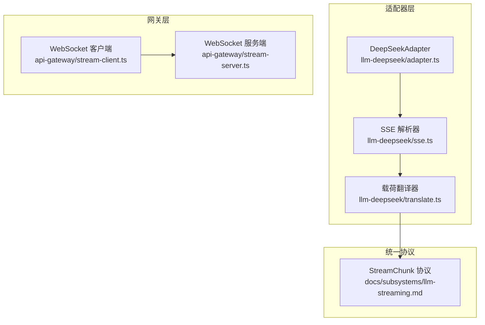
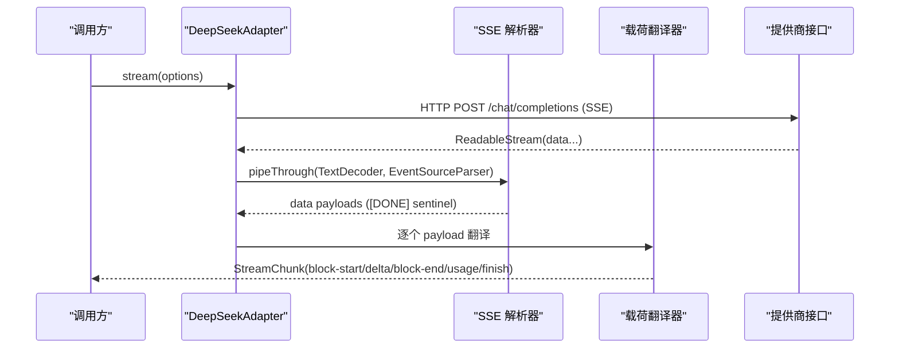
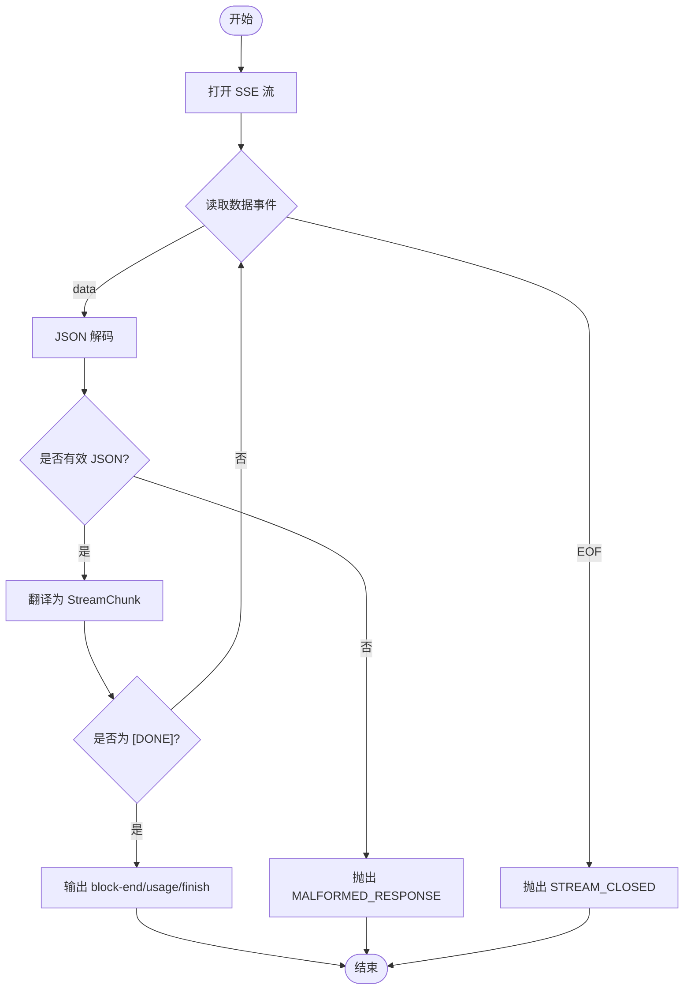
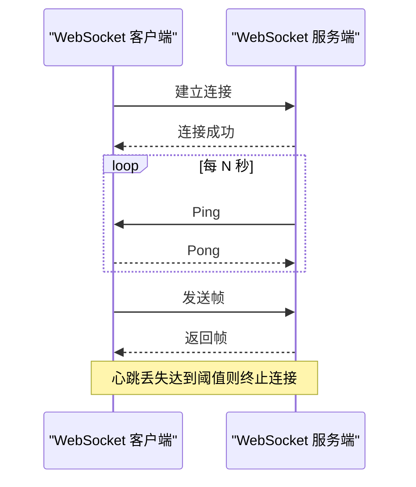
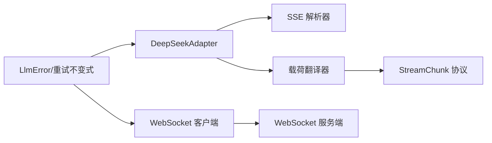

# 提供商流式实现

<cite>
**本文引用的文件**
- [packages/llm/llm-deepseek/src/sse.ts](file://packages/llm/llm-deepseek/src/sse.ts)
- [packages/llm/llm-deepseek/src/translate.ts](file://packages/llm/llm-deepseek/src/translate.ts)
- [packages/llm/llm-deepseek/src/adapter.ts](file://packages/llm/llm-deepseek/src/adapter.ts)
- [packages/llm/llm-deepseek/src/index.ts](file://packages/llm/llm-deepseek/src/index.ts)
- [packages/api/gateway/src/client/stream-client.ts](file://packages/api/gateway/src/client/stream-client.ts)
- [packages/api/gateway/src/stream-server.ts](file://packages/api/gateway/src/stream-server.ts)
- [packages/test-support/llm-mock-server/src/index.ts](file://packages/test-support/llm-mock-server/src/index.ts)
- [docs/subsystems/llm-streaming.md](file://docs/subsystems/llm-streaming.md)
- [packages/llm/llm/src/index.ts](file://packages/llm/llm/src/index.ts)
- [packages/llm/llm-retry/src/invariant.ts](file://packages/llm/llm-retry/src/invariant.ts)
</cite>

## 目录
1. [简介](#简介)
2. [项目结构](#项目结构)
3. [核心组件](#核心组件)
4. [架构总览](#架构总览)
5. [详细组件分析](#详细组件分析)
6. [依赖关系分析](#依赖关系分析)
7. [性能考量](#性能考量)
8. [故障排查指南](#故障排查指南)
9. [结论](#结论)
10. [附录](#附录)

## 简介
本文件聚焦于不同 LLM 提供商的流式响应实现，围绕三种传输方式展开：SSE（Server-Sent Events）、WebSocket、HTTP 流式（分块传输编码）。文档深入说明连接建立、消息解析、错误处理、心跳机制与进度回调；给出 DeepSeek、OpenAI、Anthropic 等主流提供商的适配要点；解释统一抽象层如何屏蔽底层差异；并提供调试技巧与性能优化建议。

## 项目结构
仓库采用多包组织，LLM 流式能力集中在 llm 系列包中：
- llm-deepseek：DeepSeek 官方适配器，基于 fetch + SSE 直接调用 chat-completions 端点，负责协议转换与流式组装。
- api/gateway：提供 WebSocket 远程流通道，包含客户端连接管理、服务端心跳与帧分发。
- test-support/llm-mock-server：测试用 SSE 模拟服务器，便于验证解析与容错。
- docs/subsystems/llm-streaming.md：定义统一的 StreamChunk 协议与适配器契约，是跨提供商的统一抽象层。

图表来源
- [packages/llm/llm-deepseek/src/adapter.ts:1-120](file://packages/llm/llm-deepseek/src/adapter.ts#L1-L120)
- [packages/llm/llm-deepseek/src/sse.ts:1-41](file://packages/llm/llm-deepseek/src/sse.ts#L1-L41)
- [packages/llm/llm-deepseek/src/translate.ts:1-120](file://packages/llm/llm-deepseek/src/translate.ts#L1-L120)
- [packages/api/gateway/src/client/stream-client.ts:142-264](file://packages/api/gateway/src/client/stream-client.ts#L142-L264)
- [packages/api/gateway/src/stream-server.ts:74-110](file://packages/api/gateway/src/stream-server.ts#L74-L110)
- [docs/subsystems/llm-streaming.md:288-335](file://docs/subsystems/llm-streaming.md#L288-L335)

章节来源
- [packages/llm/llm-deepseek/src/adapter.ts:1-120](file://packages/llm/llm-deepseek/src/adapter.ts#L1-L120)
- [docs/subsystems/llm-streaming.md:288-335](file://docs/subsystems/llm-streaming.md#L288-L335)

## 核心组件
- DeepSeek 适配器（Direct-fetch + SSE）
  - 通过 fetch 发起 HTTP 请求，接收 ReadableStream 并交由 SSE 解析器消费。
  - 使用事件源解析库将字节流转为 data 事件，遇到终止标记后结束。
  - 将 provider 原始载荷翻译为统一的 StreamChunk，维护文本、推理、工具调用的块状态。
- SSE 解析器
  - 严格遵循 SSE 规范：UTF-8/CRLF/BOM、注释跳过、多行 data 拼接。
  - 以 [DONE] 作为终止哨兵；若流提前结束则抛出 STREAM_CLOSED。
- 载荷翻译器
  - 按块索引维护 open block，增量累积 text/reasoning/tool-call。
  - 在收到 [DONE] 时统一输出 block-end、usage、finish，保证 usage 在 finish 之前。
  - 空完成映射为 EMPTY_RESPONSE 错误，避免静默成功。
- WebSocket 远程流（Gateway）
  - 客户端维护单连接、重试调度、消息帧解析与失败传播。
  - 服务端周期性 Ping/Pong 心跳，超时未响应则终止连接。
- 统一抽象层（StreamChunk 协议）
  - 所有适配器必须遵守：usage 在 finish 之前、finish 之后无后续 chunk、工具调用参数保持原始 JSON 字符串直到 block-end 再序列化等。
  - 错误路径二选一：throw（传输/协议错误）或 finish {kind:'error'|'aborted'}（提供者内联错误）。

章节来源
- [packages/llm/llm-deepseek/src/sse.ts:17-41](file://packages/llm/llm-deepseek/src/sse.ts#L17-L41)
- [packages/llm/llm-deepseek/src/translate.ts:103-211](file://packages/llm/llm-deepseek/src/translate.ts#L103-L211)
- [packages/api/gateway/src/client/stream-client.ts:142-264](file://packages/api/gateway/src/client/stream-client.ts#L142-L264)
- [packages/api/gateway/src/stream-server.ts:74-110](file://packages/api/gateway/src/stream-server.ts#L74-L110)
- [docs/subsystems/llm-streaming.md:288-335](file://docs/subsystems/llm-streaming.md#L288-L335)

## 架构总览
下图展示从上层调用到下游提供商的端到端流式链路，涵盖 SSE 与 WebSocket 两种典型路径。

图表来源
- [packages/llm/llm-deepseek/src/adapter.ts:1-120](file://packages/llm/llm-deepseek/src/adapter.ts#L1-L120)
- [packages/llm/llm-deepseek/src/sse.ts:20-41](file://packages/llm/llm-deepseek/src/sse.ts#L20-L41)
- [packages/llm/llm-deepseek/src/translate.ts:103-211](file://packages/llm/llm-deepseek/src/translate.ts#L103-L211)

## 详细组件分析

### SSE 流式（DeepSeek/OpenAI 兼容）
- 连接建立
  - 适配器构造 HTTP 请求，设置必要头部（如 attributionHeaders），启用 keep-alive。
  - 读取响应体为 ReadableStream，进入解析管线。
- 消息解析
  - 使用事件源解析器将字节流转换为 data 事件，自动处理分片、CRLF、BOM、注释与多 data 行拼接。
  - 遇到 [DONE] 立即停止；若 EOF 前未收到 [DONE]，抛出 STREAM_CLOSED。
- 错误处理
  - 非 JSON 载荷抛出 MALFORMED_RESPONSE。
  - 空完成（stop 且无内容块）映射为 EMPTY_RESPONSE 错误。
  - 上下文溢出、配额超限等通过统一错误码上报。
- 进度回调
  - 通过 StreamChunk 的 delta 与 block-end 向上传递实时进度；usage 在 finish 前汇总。

图表来源
- [packages/llm/llm-deepseek/src/sse.ts:20-41](file://packages/llm/llm-deepseek/src/sse.ts#L20-L41)
- [packages/llm/llm-deepseek/src/translate.ts:103-211](file://packages/llm/llm-deepseek/src/translate.ts#L103-L211)

章节来源
- [packages/llm/llm-deepseek/src/sse.ts:17-41](file://packages/llm/llm-deepseek/src/sse.ts#L17-L41)
- [packages/llm/llm-deepseek/src/translate.ts:103-211](file://packages/llm/llm-deepseek/src/translate.ts#L103-L211)

### WebSocket 流式（Gateway 远程流）
- 握手过程
  - 客户端创建 WebSocket 连接，监听 open/error/close/message 事件。
  - 连接成功后注册等待者，复用同一 socket 承载多个逻辑流。
- 消息格式
  - 服务端发送结构化帧，客户端解析后推入对应 streamId 队列。
  - 非法帧触发 failAll 并关闭连接。
- 心跳机制
  - 服务端定时 ping，记录 missedHeartbeats，超过阈值则 terminate。
  - 客户端侧维持连接健康，失败时进行指数退避重试。
- 适用场景
  - 长连接双向通信、需要低延迟与可靠重连的场景（如 Web 客户端到 Gateway 的事件流）。

图表来源
- [packages/api/gateway/src/client/stream-client.ts:142-264](file://packages/api/gateway/src/client/stream-client.ts#L142-L264)
- [packages/api/gateway/src/stream-server.ts:74-110](file://packages/api/gateway/src/stream-server.ts#L74-L110)

章节来源
- [packages/api/gateway/src/client/stream-client.ts:142-264](file://packages/api/gateway/src/client/stream-client.ts#L142-L264)
- [packages/api/gateway/src/stream-server.ts:74-110](file://packages/api/gateway/src/stream-server.ts#L74-L110)

### HTTP 流式（分块传输编码与进度回调）
- 分块传输
  - 使用 ReadableStream 逐块消费响应体，避免一次性加载大响应。
  - 结合 TextDecoderStream 与事件源解析器，按事件边界产出数据。
- 进度回调
  - 通过 StreamChunk 的 delta 与 block-end 向上传递增量更新。
  - usage 在 finish 前汇总，供计费与限流使用。
- 适用场景
  - 长文本生成、工具调用参数逐步拼装、需要即时渲染的场景。

章节来源
- [packages/llm/llm-deepseek/src/sse.ts:20-41](file://packages/llm/llm-deepseek/src/sse.ts#L20-L41)
- [packages/llm/llm-deepseek/src/translate.ts:103-211](file://packages/llm/llm-deepseek/src/translate.ts#L103-L211)

### 各提供商适配要点
- DeepSeek
  - 直接 fetch chat-completions 端点，SSE 协议，[DONE] 终止。
  - 支持 thinking/reasoning 模式，reasoning 优先于 text 输出。
  - 图片附件通过 Files API 或 inline base64 回退策略。
- OpenAI（兼容）
  - 与 DeepSeek 共享 SSE 解析与终止约定；注意 gateway 可能补全空字段。
  - 工具调用 id/name 为身份字段，不应被空值覆盖。
- Anthropic（Messages API）
  - 通过 pi-ai 封装的 anthropic-messages 协议接入；适配器层仍输出统一 StreamChunk。
  - 适用于需要 Anthropic 生态能力的部署。

章节来源
- [packages/llm/llm-deepseek/src/adapter.ts:1-120](file://packages/llm/llm-deepseek/src/adapter.ts#L1-L120)
- [packages/llm/llm-pi-ai/src/provider.ts:1-51](file://packages/llm/llm-pi-ai/src/provider.ts#L1-L51)
- [packages/experimental/webworker-runtime/src/node/external_packages/pi-ai.ts:57-92](file://packages/experimental/webworker-runtime/src/node/external_packages/pi-ai.ts#L57-L92)

### 统一抽象层设计
- 适配器契约
  - 每个适配器必须实现 stream()，并遵守 StreamChunk 协议。
  - 错误路径二选一：throw 或 finish {kind:'error'|'aborted'}。
  - 一次适配器调用对应一次提供者尝试；重试由上层策略控制。
- 回放与元数据
  - finish 可携带 ReplayEnvelope，用于后续回放与审计。
  - 块级元数据与块序列对齐，丢弃块即丢弃对应条目。
- 配置与路由
  - 插件注册 provider 路由，动态注入模型、凭据与扩展字段。
  - 重试策略可在注册时捕获并在变更时重新注册。

章节来源
- [docs/subsystems/llm-streaming.md:288-335](file://docs/subsystems/llm-streaming.md#L288-L335)
- [packages/llm/llm-deepseek/src/index.ts:1-200](file://packages/llm/llm-deepseek/src/index.ts#L1-L200)

## 依赖关系分析
- 适配器对 SSE 解析器的强依赖：确保协议一致性与健壮性。
- 翻译器对适配器与统一协议的耦合：将 provider 特定载荷映射为标准块。
- Gateway 客户端与服务端的松耦合：通过帧协议解耦逻辑流与物理连接。
- 统一错误类型与校验：LlmError 与重试不变式保障跨层一致性。

图表来源
- [packages/llm/llm-deepseek/src/adapter.ts:1-120](file://packages/llm/llm-deepseek/src/adapter.ts#L1-L120)
- [packages/llm/llm-deepseek/src/sse.ts:20-41](file://packages/llm/llm-deepseek/src/sse.ts#L20-L41)
- [packages/llm/llm-deepseek/src/translate.ts:103-211](file://packages/llm/llm-deepseek/src/translate.ts#L103-L211)
- [packages/api/gateway/src/client/stream-client.ts:142-264](file://packages/api/gateway/src/client/stream-client.ts#L142-L264)
- [packages/api/gateway/src/stream-server.ts:74-110](file://packages/api/gateway/src/stream-server.ts#L74-L110)
- [packages/llm/llm/src/index.ts:94-124](file://packages/llm/llm/src/index.ts#L94-L124)
- [packages/llm/llm-retry/src/invariant.ts:18-42](file://packages/llm/llm-retry/src/invariant.ts#L18-L42)

章节来源
- [packages/llm/llm/src/index.ts:94-124](file://packages/llm/llm/src/index.ts#L94-L124)
- [packages/llm/llm-retry/src/invariant.ts:18-42](file://packages/llm/llm-retry/src/invariant.ts#L18-L42)

## 性能考量
- SSE 解析开销
  - 使用标准流式管道，避免内存拷贝；合理设置 onComment 回调减少无用事件处理。
- 空闲超时
  - 适配器暴露 streamIdleTimeoutMs，防止长时间无活动导致资源泄漏。
- 心跳与重连
  - WebSocket 心跳间隔可调；指数退避上限封顶，避免雪崩。
- 图片与附件
  - 文件引用优先，超出预算时回退 inline base64；按量子步长移除以降低峰值内存。
- 进度与节流
  - 通过 StreamChunk 的 delta 粒度控制 UI 刷新频率；usage 汇总用于计费与限流。

[本节为通用指导，不直接分析具体文件]

## 故障排查指南
- SSE 流提前结束
  - 现象：STREAM_CLOSED。
  - 排查：检查网络中断、代理裁剪、服务端未按规范发送 [DONE]。
- 载荷解析失败
  - 现象：MALFORMED_RESPONSE。
  - 排查：确认 provider 返回 JSON 格式；关注 gateway 补全空字段导致的语义变化。
- 空完成
  - 现象：EMPTY_RESPONSE。
  - 排查：检查 prompt 与系统提示；考虑重试策略。
- WebSocket 断连
  - 现象：连接关闭、reconnect 频繁。
  - 排查：检查心跳间隔、服务端负载、防火墙/代理策略。
- 错误对象校验
  - 现象：重试阶段失败。
  - 排查：确认 failure 字段符合不变式约束（message/code/status/providerRetryAfterMs/requestId）。

章节来源
- [packages/llm/llm-deepseek/src/sse.ts:20-41](file://packages/llm/llm-deepseek/src/sse.ts#L20-L41)
- [packages/llm/llm-deepseek/src/translate.ts:103-211](file://packages/llm/llm-deepseek/src/translate.ts#L103-L211)
- [packages/api/gateway/src/stream-server.ts:74-110](file://packages/api/gateway/src/stream-server.ts#L74-L110)
- [packages/llm/llm-retry/src/invariant.ts:18-42](file://packages/llm/llm-retry/src/invariant.ts#L18-L42)

## 结论
本项目通过适配器层统一了不同 LLM 提供商的流式实现：DeepSeek 使用 SSE 直连，Gateway 提供 WebSocket 远程流，HTTP 流式通过分块传输与进度回调支撑实时渲染。统一抽象层（StreamChunk）屏蔽底层差异，配合严格的错误类型与重试不变式，确保跨层一致性与可观测性。实践中应合理配置空闲超时、心跳间隔与图片策略，以获得稳定与高性能的流式体验。

## 附录
- 调试技巧
  - 使用 mock SSE 服务器验证解析与容错。
  - 开启 onComment 回调观察传输活动。
  - 打印 StreamChunk 序列，核对 block 顺序与 usage/finish 位置。
- 性能优化建议
  - 调整 streamIdleTimeoutMs 与心跳间隔，平衡资源占用与连通性。
  - 限制 UI 刷新频率，避免高频 delta 导致渲染抖动。
  - 合理使用图片回退策略，降低内存峰值。

[本节为通用指导，不直接分析具体文件]