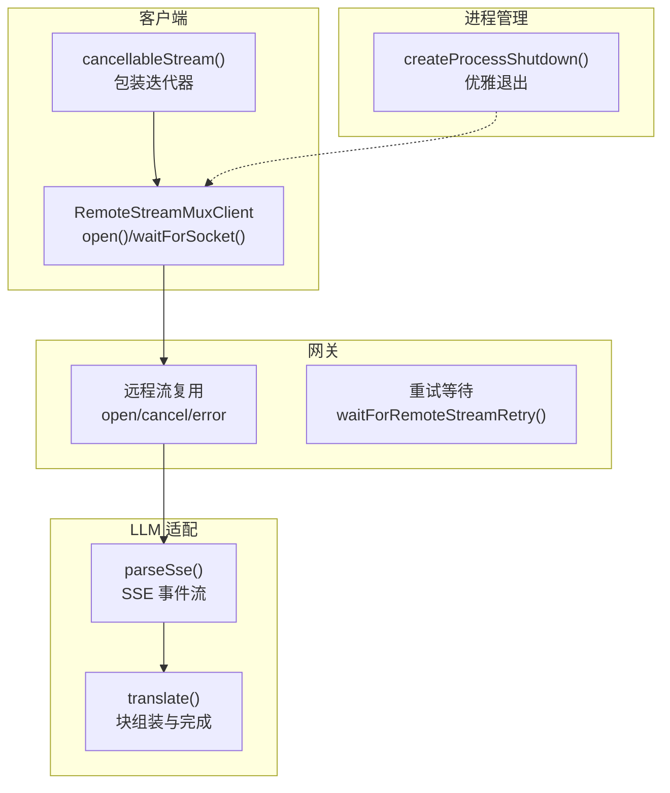
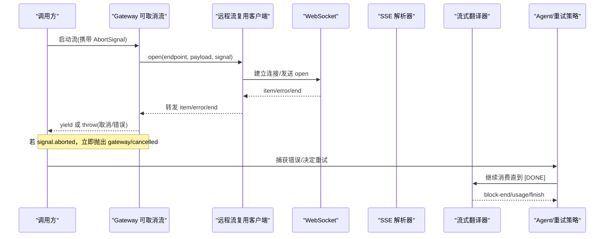
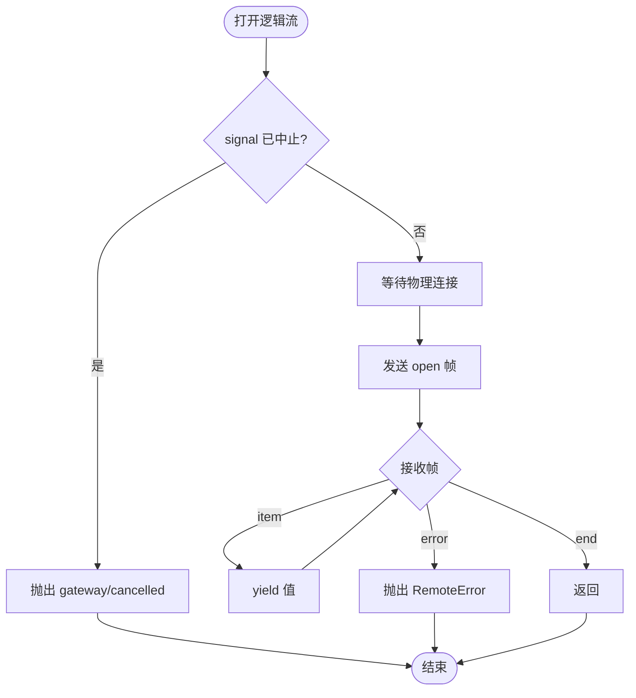
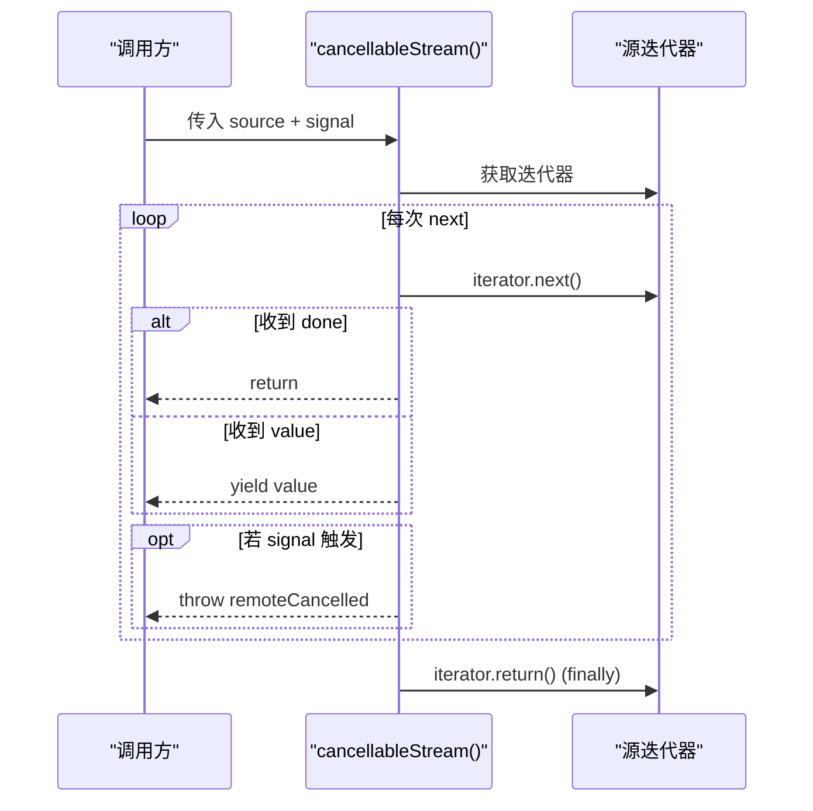
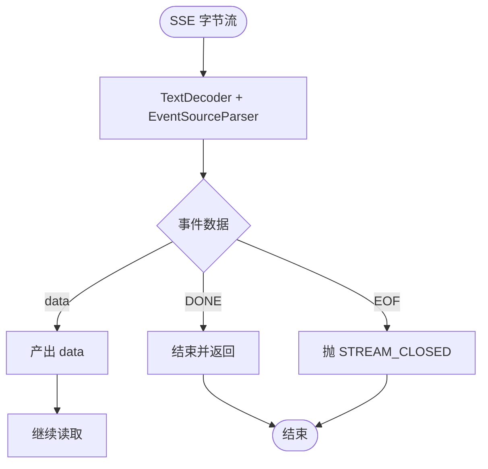
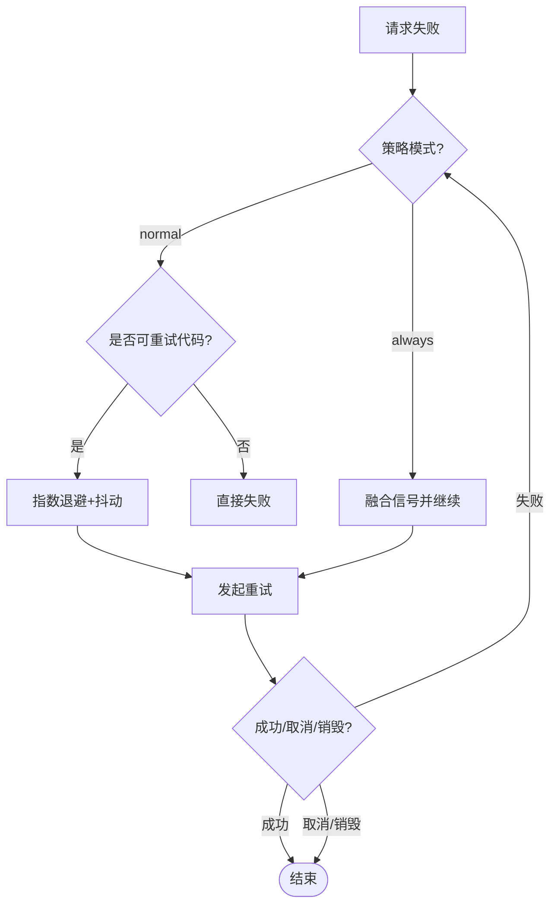
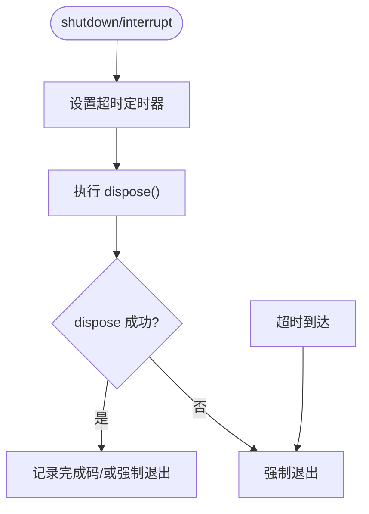
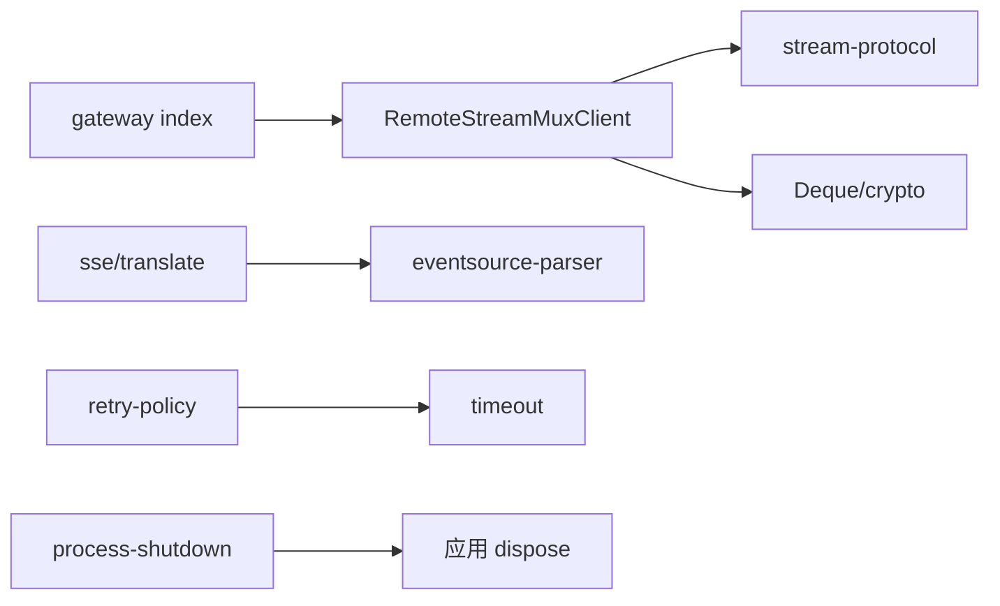

# 流式中断处理

<cite>
**本文引用的文件**
- [packages/api/gateway/src/index.ts](file://packages/api/gateway/src/index.ts)
- [packages/api/gateway/src/client/stream-client.ts](file://packages/api/gateway/src/client/stream-client.ts)
- [packages/api/gateway/src/client/remote-stream.ts](file://packages/api/gateway/src/client/remote-stream.ts)
- [packages/experimental/webworker-runtime/src/client/client.ts](file://packages/experimental/webworker-runtime/src/client/client.ts)
- [packages/llm/llm-deepseek/src/sse.ts](file://packages/llm/llm-deepseek/src/sse.ts)
- [packages/llm/llm-deepseek/src/translate.ts](file://packages/llm/llm-deepseek/src/translate.ts)
- [packages/llm/llm/src/retry-policy.ts](file://packages/llm/llm/src/retry-policy.ts)
- [packages/llm/llm-retry/src/index.ts](file://packages/llm/llm-retry/src/index.ts)
- [apps/cli/src/process-shutdown.ts](file://apps/cli/src/process-shutdown.ts)
- [packages/client/store/src/index.ts](file://packages/client/store/src/index.ts)
- [packages/core/tools/tests/ptc.spec.ts](file://packages/core/tools/tests/ptc.spec.ts)
- [packages/host/directory-picker-browse/tests/service.spec.ts](file://packages/host/directory-picker-browse/tests/service.spec.ts)
- [packages/test-support/llm-mock-server/src/index.ts](file://packages/test-support/llm-mock-server/src/index.ts)
</cite>

## 目录
1. [简介](#简介)
2. [项目结构](#项目结构)
3. [核心组件](#核心组件)
4. [架构总览](#架构总览)
5. [详细组件分析](#详细组件分析)
6. [依赖关系分析](#依赖关系分析)
7. [性能考量](#性能考量)
8. [故障排除指南](#故障排除指南)
9. [结论](#结论)
10. [附录](#附录)

## 简介
本技术文档聚焦于“流式中断处理”，围绕 AbortSignal 在流式响应中的传递机制、优雅关闭策略、不同场景（用户取消、超时、错误恢复）下的中断行为、中断后的状态管理与部分数据保存恢复，以及与不同 LLM 提供商的兼容性（SSE、WebSocket 等传输差异）展开。文档基于仓库中网关、客户端、LLM 适配器与 CLI 进程管理等关键实现进行系统化梳理，并提供可追溯的代码片段路径与可视化图示，帮助读者快速定位并正确实现健壮的中断与恢复流程。

## 项目结构
本项目采用多包协作：API Gateway 负责远程流复用与跨进程/浏览器通信；客户端侧维护 WebSocket 连接与逻辑流；LLM 层提供 SSE 解析与流式协议转换；CLI 提供进程级优雅关闭；Store 提供持久化以支持中断后恢复。整体通过 AbortSignal 贯穿调用链，确保从 UI 到网络再到模型调用的统一取消语义。

**图表来源**
- [packages/api/gateway/src/client/stream-client.ts:80-120](file://packages/api/gateway/src/client/stream-client.ts#L80-L120)
- [packages/api/gateway/src/index.ts:964-991](file://packages/api/gateway/src/index.ts#L964-L991)
- [packages/llm/llm-deepseek/src/sse.ts:28-40](file://packages/llm/llm-deepseek/src/sse.ts#L28-L40)
- [packages/llm/llm-deepseek/src/translate.ts:111-143](file://packages/llm/llm-deepseek/src/translate.ts#L111-L143)
- [apps/cli/src/process-shutdown.ts:22-77](file://apps/cli/src/process-shutdown.ts#L22-L77)

**章节来源**
- [packages/api/gateway/src/client/stream-client.ts:80-120](file://packages/api/gateway/src/client/stream-client.ts#L80-L120)
- [packages/api/gateway/src/index.ts:964-991](file://packages/api/gateway/src/index.ts#L964-L991)
- [packages/llm/llm-deepseek/src/sse.ts:28-40](file://packages/llm/llm-deepseek/src/sse.ts#L28-L40)
- [packages/llm/llm-deepseek/src/translate.ts:111-143](file://packages/llm/llm-deepseek/src/translate.ts#L111-L143)
- [apps/cli/src/process-shutdown.ts:22-77](file://apps/cli/src/process-shutdown.ts#L22-L77)

## 核心组件
- 远程流复用客户端：维护物理 WebSocket，为多个逻辑流提供 open/cancel/error 能力，并在 finally 中发送 cancel 帧，避免资源泄漏。
- 可取消流包装：将任意同步/异步迭代器与 AbortSignal 绑定，一旦中止立即终止迭代并清理资源。
- SSE 解析器：按规范解析字节流为事件数据，遇到 [DONE] 结束；若 EOF 未收到 [DONE]，抛出 STREAM_CLOSED 表示截断。
- 流式翻译器：消费 SSE 数据载荷，产出结构化 StreamChunk，并在 [DONE] 时输出 block-end、usage 与 finish。
- 重试策略：定义 normal/always 两种模式，结合退避与抖动，配合 agent-loop 的错误恢复点决定是否重试。
- 进程优雅关闭：封装 dispose 生命周期，支持正常完成与信号强制退出，保证资源释放与退出码语义。
- 本地持久化：使用 localStorage 存储快照，支持中断后恢复；失败降级不影响主流程。

**章节来源**
- [packages/api/gateway/src/client/stream-client.ts:80-120](file://packages/api/gateway/src/client/stream-client.ts#L80-L120)
- [packages/api/gateway/src/index.ts:964-991](file://packages/api/gateway/src/index.ts#L964-L991)
- [packages/llm/llm-deepseek/src/sse.ts:28-40](file://packages/llm/llm-deepseek/src/sse.ts#L28-L40)
- [packages/llm/llm-deepseek/src/translate.ts:111-143](file://packages/llm/llm-deepseek/src/translate.ts#L111-L143)
- [packages/llm/llm/src/retry-policy.ts:149-196](file://packages/llm/llm/src/retry-policy.ts#L149-L196)
- [apps/cli/src/process-shutdown.ts:22-77](file://apps/cli/src/process-shutdown.ts#L22-L77)
- [packages/client/store/src/index.ts:146-166](file://packages/client/store/src/index.ts#L146-L166)

## 架构总览
下图展示从上层调用到 LLM 提供商的完整流式中断链路，AbortSignal 自顶向下贯穿，异常与取消在各层被正确传播与处理。

**图表来源**
- [packages/api/gateway/src/index.ts:964-991](file://packages/api/gateway/src/index.ts#L964-L991)
- [packages/api/gateway/src/client/stream-client.ts:80-120](file://packages/api/gateway/src/client/stream-client.ts#L80-L120)
- [packages/llm/llm-deepseek/src/sse.ts:28-40](file://packages/llm/llm-deepseek/src/sse.ts#L28-L40)
- [packages/llm/llm-deepseek/src/translate.ts:111-143](file://packages/llm/llm-deepseek/src/translate.ts#L111-L143)
- [packages/llm/llm-retry/src/index.ts:194-217](file://packages/llm/llm-retry/src/index.ts#L194-L217)

## 详细组件分析

### 远程流复用客户端（WebSocket 逻辑流）
- 职责：维护单一物理 WebSocket，为多个逻辑流分配 streamId，处理 open/item/error/end 帧；在 finally 中发送 cancel 帧，确保服务端及时释放资源。
- 中断传播：监听 signal.abort，向 inbox.fail(signal.reason) 注入原因；等待 socket 时也监听 abort，避免阻塞。
- 错误分类：将载体错误标记为 RemoteStreamCarrierError，便于上层区分网络层失败与业务错误。

**图表来源**
- [packages/api/gateway/src/client/stream-client.ts:80-120](file://packages/api/gateway/src/client/stream-client.ts#L80-L120)

**章节来源**
- [packages/api/gateway/src/client/stream-client.ts:80-120](file://packages/api/gateway/src/client/stream-client.ts#L80-L120)

### 可取消流包装（通用迭代器）
- 职责：将任意 Iterable/AsyncIterable 与 AbortSignal 绑定，使用 Promise.race 竞争 next() 与 abort；finally 中移除监听并调用 iterator.return() 确保清理。
- 中断语义：一旦中止，立即抛出 remoteCancelled(endpoint, reason)，并将下游迭代器关闭。

**图表来源**
- [packages/api/gateway/src/index.ts:964-991](file://packages/api/gateway/src/index.ts#L964-L991)

**章节来源**
- [packages/api/gateway/src/index.ts:964-991](file://packages/api/gateway/src/index.ts#L964-L991)

### SSE 解析与流式翻译
- SSE 解析：按规范读取字节流，忽略注释，产出 data 载荷；遇到 [DONE] 结束；EOF 无 [DONE] 抛 STREAM_CLOSED。
- 流式翻译：消费 payloads，累积文本/推理/工具调用块，在 [DONE] 时输出 block-end、usage 与 finish；空完成映射为 EMPTY_RESPONSE 错误。

**图表来源**
- [packages/llm/llm-deepseek/src/sse.ts:28-40](file://packages/llm/llm-deepseek/src/sse.ts#L28-L40)
- [packages/llm/llm-deepseek/src/translate.ts:111-143](file://packages/llm/llm-deepseek/src/translate.ts#L111-L143)

**章节来源**
- [packages/llm/llm-deepseek/src/sse.ts:28-40](file://packages/llm/llm-deepseek/src/sse.ts#L28-L40)
- [packages/llm/llm-deepseek/src/translate.ts:111-143](file://packages/llm/llm-deepseek/src/translate.ts#L111-L143)

### 重试策略与错误恢复
- 策略类型：normal（有限重试，仅对特定代码重试）、always（无限重试直至成功/取消/销毁）。
- 退避参数：initialDelayMs、maxDelayMs、jitterRatio，均受上限约束并校验。
- 恢复流程：在 agent/request-error 事件中，根据策略与信号决定是否重试；always 模式下会融合信号以避免后续状态变更。

**图表来源**
- [packages/llm/llm/src/retry-policy.ts:149-196](file://packages/llm/llm/src/retry-policy.ts#L149-L196)
- [packages/llm/llm-retry/src/index.ts:194-217](file://packages/llm/llm-retry/src/index.ts#L194-L217)

**章节来源**
- [packages/llm/llm/src/retry-policy.ts:149-196](file://packages/llm/llm/src/retry-policy.ts#L149-L196)
- [packages/llm/llm-retry/src/index.ts:194-217](file://packages/llm/llm-retry/src/index.ts#L194-L217)

### 进程级优雅关闭
- 职责：封装应用级 dispose，支持正常完成与信号强制退出；多次 shutdown 合并，interrupt 升级至强制退出。
- 超时保护：超过阈值后强制 exit，防止挂起。

**图表来源**
- [apps/cli/src/process-shutdown.ts:22-77](file://apps/cli/src/process-shutdown.ts#L22-L77)

**章节来源**
- [apps/cli/src/process-shutdown.ts:22-77](file://apps/cli/src/process-shutdown.ts#L22-L77)

### WebWorker 运行时中的中断传播
- 职责：在 body 阶段持有 caller 的 signal，监听 abort 并触发 abortRequest；当消费者停止读取时取消流并通知 worker。
- 最佳努力：即使 worker 失败，也尽力发送 abort 帧。

**章节来源**
- [packages/experimental/webworker-runtime/src/client/client.ts:359-395](file://packages/experimental/webworker-runtime/src/client/client.ts#L359-L395)

### 工具调用与运行时的提前短路
- 行为：若外层 signal 已中止，工具执行路径短路返回 TOOL_ABORTED_BEFORE_DISPATCH，不进入代码运行时。

**章节来源**
- [packages/core/tools/tests/ptc.spec.ts:1591-1613](file://packages/core/tools/tests/ptc.spec.ts#L1591-L1613)

### 可取消原语的统一分类
- 行为：raceAbort 将操作与 signal 竞争，abort 优先且吞掉延迟拒绝，避免未处理拒绝。

**章节来源**
- [packages/host/directory-picker-browse/tests/service.spec.ts:111-137](file://packages/host/directory-picker-browse/tests/service.spec.ts#L111-L137)

### 与不同传输方式的兼容性
- SSE：使用 parseSse 严格遵循事件边界，[DONE] 作为终止标志；若无 [DONE] 则视为截断。
- WebSocket：通过 RemoteStreamMuxClient 复用物理连接，逻辑流通过 open/cancel/error 帧控制；客户端在 finally 中发送 cancel 帧。
- 测试模拟：mock server 提供 openSse/writeSse/writeDone，用于验证 SSE 行为与空闲保活。

**章节来源**
- [packages/llm/llm-deepseek/src/sse.ts:28-40](file://packages/llm/llm-deepseek/src/sse.ts#L28-L40)
- [packages/api/gateway/src/client/stream-client.ts:80-120](file://packages/api/gateway/src/client/stream-client.ts#L80-L120)
- [packages/test-support/llm-mock-server/src/index.ts:313-329](file://packages/test-support/llm-mock-server/src/index.ts#L313-L329)

## 依赖关系分析
- 耦合性：Gateway 与客户端强耦合于 WebSocket 协议；LLM 适配器与 SSE 解析解耦良好，易于替换传输。
- 间接依赖：重试策略依赖 agent-loop 的事件扩展点；进程关闭与上层生命周期解耦，通过回调接入。
- 循环依赖：未发现明显循环；各模块通过接口与事件边界协作。

**图表来源**
- [packages/api/gateway/src/client/stream-client.ts:1-12](file://packages/api/gateway/src/client/stream-client.ts#L1-L12)
- [packages/api/gateway/src/index.ts:964-991](file://packages/api/gateway/src/index.ts#L964-L991)
- [packages/llm/llm-deepseek/src/sse.ts:14-16](file://packages/llm/llm-deepseek/src/sse.ts#L14-L16)
- [packages/llm/llm/src/retry-policy.ts:10-12](file://packages/llm/llm/src/retry-policy.ts#L10-L12)
- [apps/cli/src/process-shutdown.ts:22-27](file://apps/cli/src/process-shutdown.ts#L22-L27)

**章节来源**
- [packages/api/gateway/src/client/stream-client.ts:1-12](file://packages/api/gateway/src/client/stream-client.ts#L1-L12)
- [packages/api/gateway/src/index.ts:964-991](file://packages/api/gateway/src/index.ts#L964-L991)
- [packages/llm/llm-deepseek/src/sse.ts:14-16](file://packages/llm/llm-deepseek/src/sse.ts#L14-L16)
- [packages/llm/llm/src/retry-policy.ts:10-12](file://packages/llm/llm/src/retry-policy.ts#L10-L12)
- [apps/cli/src/process-shutdown.ts:22-27](file://apps/cli/src/process-shutdown.ts#L22-L27)

## 性能考量
- 流式处理：SSE 解析与翻译均为增量处理，内存占用低；注意避免在热点路径创建大对象。
- 重试退避：合理设置 initialDelayMs/maxDelayMs/jitterRatio，避免雪崩；always 模式需配合信号与销毁逻辑。
- 连接复用：RemoteStreamMuxClient 复用 WebSocket，减少握手开销；但需注意并发流数量与背压。
- 持久化：localStorage 写入可能阻塞，建议批量或节流；失败降级不影响主流程。

## 故障排除指南
- 现象：SSE 流提前结束且无 [DONE]
  - 诊断：检查 parseSse 是否抛出 STREAM_CLOSED；确认上游是否发送了 [DONE]。
  - 参考：[SSE 解析器:28-40](file://packages/llm/llm-deepseek/src/sse.ts#L28-L40)
- 现象：用户取消后仍有后台任务
  - 诊断：确认 cancellableStream 与 RemoteStreamMuxClient.open 的 finally 是否发送 cancel；检查 signal.removeEventListener 是否执行。
  - 参考：[可取消流:964-991](file://packages/api/gateway/src/index.ts#L964-L991)、[远程流客户端:80-120](file://packages/api/gateway/src/client/stream-client.ts#L80-L120)
- 现象：重试风暴
  - 诊断：检查 retry-policy 配置与 backoff；确认 always 模式是否正确融合信号。
  - 参考：[重试策略:149-196](file://packages/llm/llm/src/retry-policy.ts#L149-L196)、[重试恢复:194-217](file://packages/llm/llm-retry/src/index.ts#L194-L217)
- 现象：进程无法退出
  - 诊断：检查 createProcessShutdown 的超时与 forceExit；确认 dispose 是否 resolve。
  - 参考：[进程关闭:22-77](file://apps/cli/src/process-shutdown.ts#L22-L77)
- 现象：中断后状态丢失
  - 诊断：确认 Store 的 attachPersistence 是否启用；检查 localStorage 读写失败是否被吞掉。
  - 参考：[本地持久化:146-166](file://packages/client/store/src/index.ts#L146-L166)

**章节来源**
- [packages/llm/llm-deepseek/src/sse.ts:28-40](file://packages/llm/llm-deepseek/src/sse.ts#L28-L40)
- [packages/api/gateway/src/index.ts:964-991](file://packages/api/gateway/src/index.ts#L964-L991)
- [packages/api/gateway/src/client/stream-client.ts:80-120](file://packages/api/gateway/src/client/stream-client.ts#L80-L120)
- [packages/llm/llm/src/retry-policy.ts:149-196](file://packages/llm/llm/src/retry-policy.ts#L149-L196)
- [packages/llm/llm-retry/src/index.ts:194-217](file://packages/llm/llm-retry/src/index.ts#L194-L217)
- [apps/cli/src/process-shutdown.ts:22-77](file://apps/cli/src/process-shutdown.ts#L22-L77)
- [packages/client/store/src/index.ts:146-166](file://packages/client/store/src/index.ts#L146-L166)

## 结论
本仓库在流式中断处理上形成了端到端的统一语义：通过 AbortSignal 贯穿调用链，结合可取消流包装、远程流复用与 SSE 解析，确保用户取消、超时与错误恢复的一致行为；同时通过重试策略与进程优雅关闭保障系统稳定性与资源安全。建议在集成新传输或新提供商时，严格遵循上述模式，保持中断信号的传播与资源清理的一致性。

## 附录
- 代码示例路径（不含具体代码内容）：
  - 可取消流包装：[packages/api/gateway/src/index.ts:964-991](file://packages/api/gateway/src/index.ts#L964-L991)
  - 远程流复用客户端：[packages/api/gateway/src/client/stream-client.ts:80-120](file://packages/api/gateway/src/client/stream-client.ts#L80-L120)
  - SSE 解析与翻译：[packages/llm/llm-deepseek/src/sse.ts:28-40](file://packages/llm/llm-deepseek/src/sse.ts#L28-L40)、[packages/llm/llm-deepseek/src/translate.ts:111-143](file://packages/llm/llm-deepseek/src/translate.ts#L111-L143)
  - 重试策略与恢复：[packages/llm/llm/src/retry-policy.ts:149-196](file://packages/llm/llm/src/retry-policy.ts#L149-L196)、[packages/llm/llm-retry/src/index.ts:194-217](file://packages/llm/llm-retry/src/index.ts#L194-L217)
  - 进程优雅关闭：[apps/cli/src/process-shutdown.ts:22-77](file://apps/cli/src/process-shutdown.ts#L22-L77)
  - WebWorker 中断传播：[packages/experimental/webworker-runtime/src/client/client.ts:359-395](file://packages/experimental/webworker-runtime/src/client/client.ts#L359-L395)
  - 工具调用提前短路：[packages/core/tools/tests/ptc.spec.ts:1591-1613](file://packages/core/tools/tests/ptc.spec.ts#L1591-L1613)
  - 可取消原语统一分类：[packages/host/directory-picker-browse/tests/service.spec.ts:111-137](file://packages/host/directory-picker-browse/tests/service.spec.ts#L111-L137)
  - 本地持久化：[packages/client/store/src/index.ts:146-166](file://packages/client/store/src/index.ts#L146-L166)
  - SSE 测试模拟：[packages/test-support/llm-mock-server/src/index.ts:313-329](file://packages/test-support/llm-mock-server/src/index.ts#L313-L329)