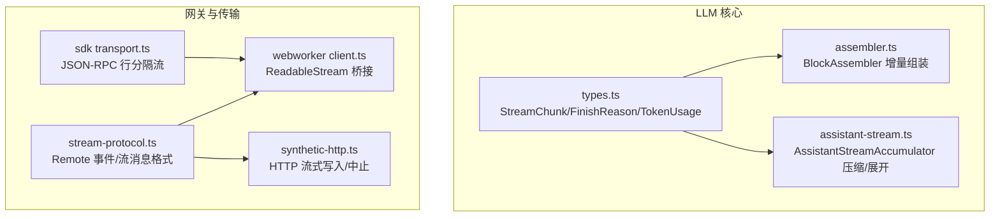
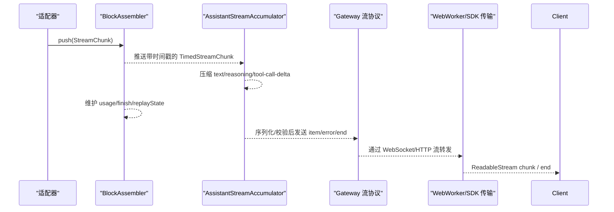
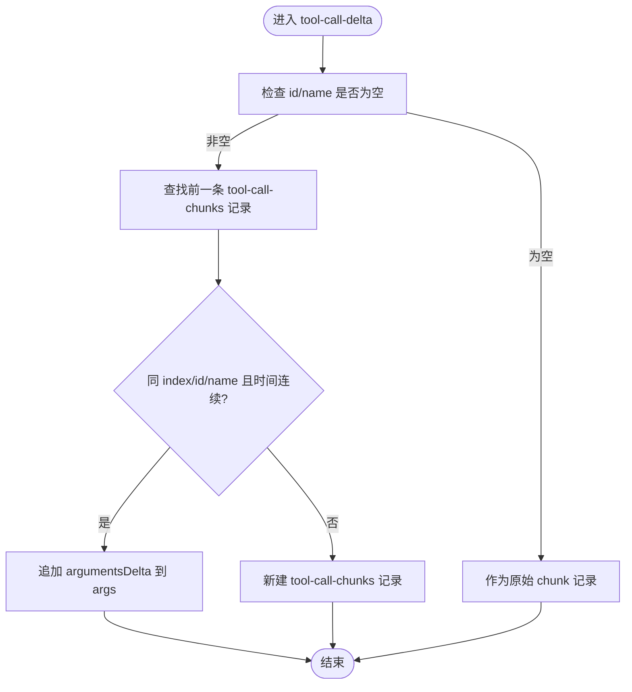
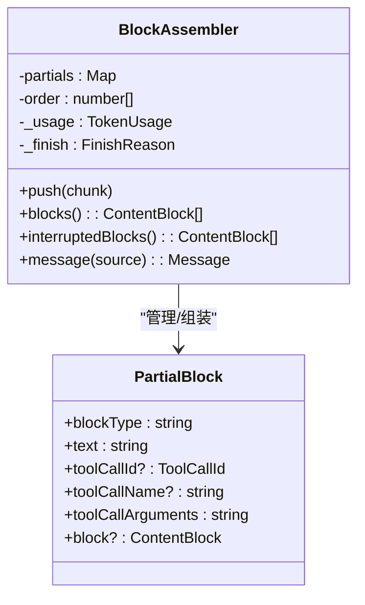
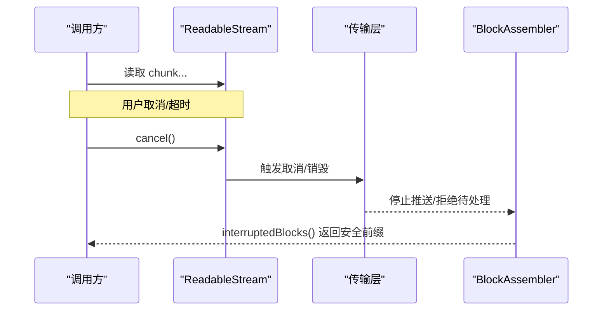
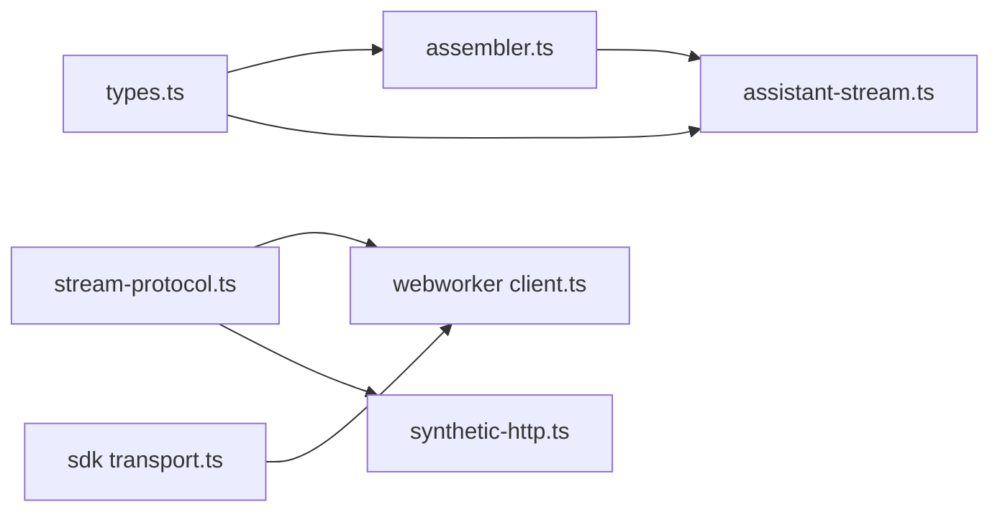

# 流式响应处理

<cite>
**本文引用的文件**
- [packages/llm/llm/src/types.ts](file://packages/llm/llm/src/types.ts)
- [packages/llm/llm/src/assembler.ts](file://packages/llm/llm/src/assembler.ts)
- [packages/llm/llm/src/assistant-stream.ts](file://packages/llm/llm/src/assistant-stream.ts)
- [packages/api/gateway/src/stream-protocol.ts](file://packages/api/gateway/src/stream-protocol.ts)
- [packages/experimental/webworker-runtime/src/client/client.ts](file://packages/experimental/webworker-runtime/src/client/client.ts)
- [packages/experimental/webworker-runtime/src/transport/synthetic-http.ts](file://packages/experimental/webworker-runtime/src/transport/synthetic-http.ts)
- [packages/sdk/protocol/src/transport.ts](file://packages/sdk/protocol/src/transport.ts)
</cite>

## 目录
1. [简介](#简介)
2. [项目结构](#项目结构)
3. [核心组件](#核心组件)
4. [架构总览](#架构总览)
5. [详细组件分析](#详细组件分析)
6. [依赖关系分析](#依赖关系分析)
7. [性能考量](#性能考量)
8. [故障排查指南](#故障排查指南)
9. [结论](#结论)
10. [附录](#附录)

## 简介
本技术文档聚焦于“流式响应处理”，围绕 StreamChunk 协议规范、工具调用参数的流式传输机制、block 索引分配与 delta 重组逻辑、流式中断处理，以及不同提供商的流式传输模式（SSE/WebSocket/HTTP 流）进行系统化说明。文档同时给出错误处理最佳实践，帮助读者在实现或调试 LLM 流式输出时建立一致的理解与工程实践。

## 项目结构
与流式响应相关的关键代码分布在以下模块：
- llm 包：定义 StreamChunk 协议、BlockAssembler 组装器、AssistantStreamAccumulator 压缩记录等核心类型与算法。
- api gateway 包：提供远程事件与流的消息格式、校验与解析，用于跨进程/跨端点的流式通信。
- experimental webworker-runtime：提供 HTTP/ReadableStream 抽象与 chunk 转发、中止能力，便于在不同运行时中复用流式语义。
- sdk protocol：提供基于流的 JSON-RPC 传输层，支持行分隔帧、错误与关闭语义。

图表来源
- [packages/llm/llm/src/types.ts:370-390](file://packages/llm/llm/src/types.ts#L370-L390)
- [packages/llm/llm/src/assembler.ts:38-96](file://packages/llm/llm/src/assembler.ts#L38-L96)
- [packages/llm/llm/src/assistant-stream.ts:84-178](file://packages/llm/llm/src/assistant-stream.ts#L84-L178)
- [packages/api/gateway/src/stream-protocol.ts:242-313](file://packages/api/gateway/src/stream-protocol.ts#L242-L313)
- [packages/experimental/webworker-runtime/src/client/client.ts:410-446](file://packages/experimental/webworker-runtime/src/client/client.ts#L410-L446)
- [packages/experimental/webworker-runtime/src/transport/synthetic-http.ts:92-158](file://packages/experimental/webworker-runtime/src/transport/synthetic-http.ts#L92-L158)
- [packages/sdk/protocol/src/transport.ts:51-92](file://packages/sdk/protocol/src/transport.ts#L51-L92)

章节来源
- [packages/llm/llm/src/types.ts:370-390](file://packages/llm/llm/src/types.ts#L370-L390)
- [packages/llm/llm/src/assembler.ts:38-96](file://packages/llm/llm/src/assembler.ts#L38-L96)
- [packages/llm/llm/src/assistant-stream.ts:84-178](file://packages/llm/llm/src/assistant-stream.ts#L84-L178)
- [packages/api/gateway/src/stream-protocol.ts:242-313](file://packages/api/gateway/src/stream-protocol.ts#L242-L313)
- [packages/experimental/webworker-runtime/src/client/client.ts:410-446](file://packages/experimental/webworker-runtime/src/client/client.ts#L410-L446)
- [packages/experimental/webworker-runtime/src/transport/synthetic-http.ts:92-158](file://packages/experimental/webworker-runtime/src/transport/synthetic-http.ts#L92-L158)
- [packages/sdk/protocol/src/transport.ts:51-92](file://packages/sdk/protocol/src/transport.ts#L51-L92)

## 核心组件
- StreamChunk 协议：统一描述文本块、推理块、工具调用块、usage、finish 等事件，是适配器到上层回路的契约。
- BlockAssembler：将乱序/交错的 StreamChunk 增量组装为完整 ContentBlock 列表，并维护 usage/finish/replayState。
- AssistantStreamAccumulator：对连续同类型的 delta 进行时间间隔与内容压缩，便于持久化与回放。
- Gateway 流协议：定义 Remote 事件与流的消息帧，提供严格的 JSON 校验与错误传播。
- WebWorker 运行时：将上游 chunk 推入 ReadableStream，支持取消与结束；提供合成 HTTP 响应以适配 Node 风格 API。
- SDK JSON-RPC 传输：基于可读/可写流的行分隔协议，支持 start/close 生命周期与待请求失败传播。

章节来源
- [packages/llm/llm/src/types.ts:370-390](file://packages/llm/llm/src/types.ts#L370-L390)
- [packages/llm/llm/src/assembler.ts:38-96](file://packages/llm/llm/src/assembler.ts#L38-L96)
- [packages/llm/llm/src/assistant-stream.ts:84-178](file://packages/llm/llm/src/assistant-stream.ts#L84-L178)
- [packages/api/gateway/src/stream-protocol.ts:242-313](file://packages/api/gateway/src/stream-protocol.ts#L242-L313)
- [packages/experimental/webworker-runtime/src/client/client.ts:410-446](file://packages/experimental/webworker-runtime/src/client/client.ts#L410-L446)
- [packages/experimental/webworker-runtime/src/transport/synthetic-http.ts:92-158](file://packages/experimental/webworker-runtime/src/transport/synthetic-http.ts#L92-L158)
- [packages/sdk/protocol/src/transport.ts:51-92](file://packages/sdk/protocol/src/transport.ts#L51-L92)

## 架构总览
下图展示了从适配器产出 StreamChunk，经 BlockAssembler 组装，再到持久化/回放与传输层的整体流程。

图表来源
- [packages/llm/llm/src/assembler.ts:38-96](file://packages/llm/llm/src/assembler.ts#L38-L96)
- [packages/llm/llm/src/assistant-stream.ts:84-178](file://packages/llm/llm/src/assistant-stream.ts#L84-L178)
- [packages/api/gateway/src/stream-protocol.ts:242-313](file://packages/api/gateway/src/stream-protocol.ts#L242-L313)
- [packages/experimental/webworker-runtime/src/client/client.ts:410-446](file://packages/experimental/webworker-runtime/src/client/client.ts#L410-L446)

## 详细组件分析

### StreamChunk 协议规范与事件处理时机
- block-start：声明一个块的开始，包含 index 与 blockType。用于开启新的文本/推理/工具调用块。
- text-delta / reasoning-delta：向指定 index 追加文本片段。
- tool-call-delta：向指定 index 追加工具调用的参数片段 argumentsDelta，保持原始 JSON 字符串不变。
- block-end：携带已组装好的 ContentBlock，表示该块完成。首次 block-end 生效，后续重复关闭被忽略。
- usage：上报 TokenUsage，通常出现在 finish 之前。
- finish：终止信号，包含 FinishReason 与可选 replayState。若未收到 finish，finish 默认视为 stop。

注意：
- 工具调用参数始终以原始 JSON 字符串形式传递，禁止在传输过程中做结构化解析，确保端到端无损。
- 对于缺失 block-start 的 delta，组装器会按 index 隐式创建局部状态，保证鲁棒性。
- 对已关闭块的后续 delta 将被丢弃，防止畸形流污染内存与结果。

章节来源
- [packages/llm/llm/src/types.ts:370-390](file://packages/llm/llm/src/types.ts#L370-L390)
- [packages/llm/llm/src/assembler.ts:49-96](file://packages/llm/llm/src/assembler.ts#L49-L96)

### 工具调用参数的流式传输与 JSON 端到端保持
- 每个 tool-call-delta 携带 id、可选 name 与 argumentsDelta（字符串）。
- BlockAssembler 将 argumentsDelta 顺序拼接为最终 arguments 字符串，不解析 JSON。
- AssistantStreamAccumulator 对连续的 tool-call-delta 进行压缩，保留 args 数组与时间间隔 dt，以便回放时还原精确边界。
- 当 id/name 为空或缺失时，不走压缩路径，直接以原始 chunk 记录，避免误合并。

图表来源
- [packages/llm/llm/src/assistant-stream.ts:114-151](file://packages/llm/llm/src/assistant-stream.ts#L114-L151)
- [packages/llm/llm/src/assembler.ts:69-76](file://packages/llm/llm/src/assembler.ts#L69-L76)

章节来源
- [packages/llm/llm/src/types.ts:370-390](file://packages/llm/llm/src/types.ts#L370-L390)
- [packages/llm/llm/src/assembler.ts:69-76](file://packages/llm/llm/src/assembler.ts#L69-L76)
- [packages/llm/llm/src/assistant-stream.ts:114-151](file://packages/llm/llm/src/assistant-stream.ts#L114-L151)

### block 索引分配策略与 delta 重组逻辑
- 索引策略：index 用于关联同一块内的交错 delta。BlockAssembler 使用 Map 按 index 维护 PartialBlock，order 数组记录首次出现顺序。
- 重组规则：
  - text/reasoning：累积 text 字段。
  - tool-call：累积 argumentsDelta，并记录 id/name。
  - block-end：冻结块，后续同 index 的 delta 被忽略。
- max-tokens 截断：当 finish.kind 为 max-tokens 时，丢弃所有工具调用块，仅保留文本/推理块，replayState 同步裁剪。

图表来源
- [packages/llm/llm/src/assembler.ts:16-24](file://packages/llm/llm/src/assembler.ts#L16-L24)
- [packages/llm/llm/src/assembler.ts:38-150](file://packages/llm/llm/src/assembler.ts#L38-L150)

章节来源
- [packages/llm/llm/src/assembler.ts:38-150](file://packages/llm/llm/src/assembler.ts#L38-L150)

### 流式中断处理与优雅关闭
- AbortSignal 贯穿：GenerateOptions.signal 可传入，下游适配器/传输需监听并在适当时机终止流。
- 中断时的可见内容：BlockAssembler.interruptedBlocks() 返回已完成的文本/推理块与当前打开的同类型块的前缀，跳过工具调用（因为中断先于执行）。
- 传输层中止：
  - WebWorker 客户端：ReadableStream 的 cancel 回调触发取消，清理 bodyStreams。
  - 合成 HTTP：abort 标记后 write/end 不再写入，并触发 close/aborted 事件。
  - JSON-RPC 传输：close 会移除监听并拒绝待处理请求。

图表来源
- [packages/experimental/webworker-runtime/src/client/client.ts:410-446](file://packages/experimental/webworker-runtime/src/client/client.ts#L410-L446)
- [packages/experimental/webworker-runtime/src/transport/synthetic-http.ts:123-158](file://packages/experimental/webworker-runtime/src/transport/synthetic-http.ts#L123-L158)
- [packages/sdk/protocol/src/transport.ts:75-92](file://packages/sdk/protocol/src/transport.ts#L75-L92)
- [packages/llm/llm/src/assembler.ts:162-179](file://packages/llm/llm/src/assembler.ts#L162-L179)

章节来源
- [packages/experimental/webworker-runtime/src/client/client.ts:410-446](file://packages/experimental/webworker-runtime/src/client/client.ts#L410-L446)
- [packages/experimental/webworker-runtime/src/transport/synthetic-http.ts:123-158](file://packages/experimental/webworker-runtime/src/transport/synthetic-http.ts#L123-L158)
- [packages/sdk/protocol/src/transport.ts:75-92](file://packages/sdk/protocol/src/transport.ts#L75-L92)
- [packages/llm/llm/src/assembler.ts:162-179](file://packages/llm/llm/src/assembler.ts#L162-L179)

### 不同提供商的流式响应解析示例
- SSE（服务端发送事件）：
  - 典型模式：逐行解析 data: 字段，解码 JSON 后作为 StreamChunk 推送至 BlockAssembler。
  - 结合 AssistantStreamAccumulator 对连续 delta 进行压缩，减少存储与网络开销。
- WebSocket：
  - 使用 Gateway 的 Remote 流消息（item/error/end），在两端进行严格校验与错误传播。
  - 客户端通过 open/cancel 控制逻辑流的生命周期。
- HTTP 流式传输：
  - 通过 ReadableStream 逐步产出字节/文本块，由客户端消费并转换为 StreamChunk。
  - 支持 abort 取消与正常 end 收尾。

章节来源
- [packages/api/gateway/src/stream-protocol.ts:242-313](file://packages/api/gateway/src/stream-protocol.ts#L242-L313)
- [packages/experimental/webworker-runtime/src/client/client.ts:410-446](file://packages/experimental/webworker-runtime/src/client/client.ts#L410-L446)
- [packages/llm/llm/src/assistant-stream.ts:84-178](file://packages/llm/llm/src/assistant-stream.ts#L84-L178)

### 错误处理最佳实践
- 传输错误 vs 协议错误：
  - 传输错误：网络断开、读写异常、AbortSignal 触发等，应在传输层捕获并转化为 error 帧或 end。
  - 协议错误：非法消息、字段缺失、类型不符等，应在解析阶段抛出明确错误，并附带上下文。
- 统一收敛：
  - 适配器侧抛出的异常应被 LlmRuntime.stream() 归一化为 terminal finish（error/aborted），避免上层感知内部异常。
  - Gateway 流协议提供 RemoteStreamFailure 与 parse 函数，确保错误信息可序列化、可诊断。
- 健壮性：
  - 对未知/扩展字段采用宽松解析但严格关键字段校验。
  - 对重复 block-end、越界 delta 等畸形流进行防御性处理（忽略或报错）。

章节来源
- [packages/api/gateway/src/stream-protocol.ts:252-313](file://packages/api/gateway/src/stream-protocol.ts#L252-L313)
- [packages/llm/llm/src/types.ts:39-51](file://packages/llm/llm/src/types.ts#L39-L51)
- [packages/llm/llm/src/types.ts:126-139](file://packages/llm/llm/src/types.ts#L126-L139)

## 依赖关系分析
- types.ts 定义了 StreamChunk、FinishReason、TokenUsage、ReplayEnvelope 等基础类型，被 assembler 与 assistant-stream 共同依赖。
- assembler.ts 依赖 types.ts 的类型，负责增量组装与最终消息构建。
- assistant-stream.ts 依赖 types.ts 的类型，负责压缩/展开与时间戳校验。
- stream-protocol.ts 提供跨进程/跨端的流消息格式与校验，被客户端与服务端共同使用。
- webworker-runtime 与 sdk protocol 提供底层流与 RPC 传输能力，支撑上层业务流。

图表来源
- [packages/llm/llm/src/types.ts:370-390](file://packages/llm/llm/src/types.ts#L370-L390)
- [packages/llm/llm/src/assembler.ts:38-96](file://packages/llm/llm/src/assembler.ts#L38-L96)
- [packages/llm/llm/src/assistant-stream.ts:84-178](file://packages/llm/llm/src/assistant-stream.ts#L84-L178)
- [packages/api/gateway/src/stream-protocol.ts:242-313](file://packages/api/gateway/src/stream-protocol.ts#L242-L313)
- [packages/experimental/webworker-runtime/src/client/client.ts:410-446](file://packages/experimental/webworker-runtime/src/client/client.ts#L410-L446)
- [packages/experimental/webworker-runtime/src/transport/synthetic-http.ts:92-158](file://packages/experimental/webworker-runtime/src/transport/synthetic-http.ts#L92-L158)
- [packages/sdk/protocol/src/transport.ts:51-92](file://packages/sdk/protocol/src/transport.ts#L51-L92)

章节来源
- [packages/llm/llm/src/types.ts:370-390](file://packages/llm/llm/src/types.ts#L370-L390)
- [packages/llm/llm/src/assembler.ts:38-96](file://packages/llm/llm/src/assembler.ts#L38-L96)
- [packages/llm/llm/src/assistant-stream.ts:84-178](file://packages/llm/llm/src/assistant-stream.ts#L84-L178)
- [packages/api/gateway/src/stream-protocol.ts:242-313](file://packages/api/gateway/src/stream-protocol.ts#L242-L313)
- [packages/experimental/webworker-runtime/src/client/client.ts:410-446](file://packages/experimental/webworker-runtime/src/client/client.ts#L410-L446)
- [packages/experimental/webworker-runtime/src/transport/synthetic-http.ts:92-158](file://packages/experimental/webworker-runtime/src/transport/synthetic-http.ts#L92-L158)
- [packages/sdk/protocol/src/transport.ts:51-92](file://packages/sdk/protocol/src/transport.ts#L51-L92)

## 性能考量
- 压缩与去重：AssistantStreamAccumulator 对连续同类型 delta 进行压缩，显著降低持久化体积与回放成本。
- 惰性组装：BlockAssembler 仅在 blocks()/message() 时生成最终对象，避免中间态复制。
- 内存保护：对已关闭块的后续 delta 直接丢弃，防止畸形流导致内存增长。
- 传输优化：Gateway 流协议使用最小化的 item/error/end 帧，配合严格校验减少无效数据。

[本节为通用指导，无需特定文件引用]

## 故障排查指南
- 现象：工具调用参数不完整
  - 排查点：确认 tool-call-delta 的 argumentsDelta 是否按序到达；检查 AssistantStreamAccumulator 的压缩记录是否丢失；验证 block-end 是否在最后。
  - 参考：[tool-call-delta 压缩逻辑:114-151](file://packages/llm/llm/src/assistant-stream.ts#L114-L151)、[argumentsDelta 拼接:69-76](file://packages/llm/llm/src/assembler.ts#L69-L76)
- 现象：流提前结束但无 finish
  - 排查点：检查传输层是否触发 end 但未发送 finish；确认 LlmRuntime 是否将异常归一化为 finish(error/aborted)。
  - 参考：[finish 默认值:186-189](file://packages/llm/llm/src/assembler.ts#L186-L189)、[传输关闭:87-92](file://packages/sdk/protocol/src/transport.ts#L87-L92)
- 现象：WebSocket 消息解析失败
  - 排查点：核对消息结构是否符合 RemoteStreamServerMessage；检查 error 字段是否包含 code/message/details。
  - 参考：[消息解析与校验:291-313](file://packages/api/gateway/src/stream-protocol.ts#L291-L313)
- 现象：ReadableStream 无法取消
  - 排查点：确认 cancel 回调是否注册；检查 bodyStreams 映射是否正确清理。
  - 参考：[ReadableStream 取消:430-438](file://packages/experimental/webworker-runtime/src/client/client.ts#L430-L438)

章节来源
- [packages/llm/llm/src/assistant-stream.ts:114-151](file://packages/llm/llm/src/assistant-stream.ts#L114-L151)
- [packages/llm/llm/src/assembler.ts:69-76](file://packages/llm/llm/src/assembler.ts#L69-L76)
- [packages/llm/llm/src/assembler.ts:186-189](file://packages/llm/llm/src/assembler.ts#L186-L189)
- [packages/sdk/protocol/src/transport.ts:87-92](file://packages/sdk/protocol/src/transport.ts#L87-L92)
- [packages/api/gateway/src/stream-protocol.ts:291-313](file://packages/api/gateway/src/stream-protocol.ts#L291-L313)
- [packages/experimental/webworker-runtime/src/client/client.ts:430-438](file://packages/experimental/webworker-runtime/src/client/client.ts#L430-L438)

## 结论
本方案通过统一的 StreamChunk 协议、稳健的 BlockAssembler 组装器、高效的 AssistantStreamAccumulator 压缩机制，以及网关与传输层的严格校验与中止能力，实现了跨提供商、跨运行时的可靠流式响应处理。遵循本文档的协议约定与实践建议，可在保证数据完整性与用户体验的同时，提升系统的可维护性与可扩展性。

[本节为总结性内容，无需特定文件引用]

## 附录
- 术语
  - StreamChunk：适配器产出的最小流式单元，涵盖文本、推理、工具调用、用量与结束事件。
  - Block：按 index 组织的文本/推理/工具调用内容单元。
  - Delta：对某 block 的增量更新片段。
  - Finish：流结束信号，指示成功、错误、中止或达到上限等。
- 参考实现路径
  - 协议定义：[StreamChunk 类型:370-390](file://packages/llm/llm/src/types.ts#L370-L390)
  - 组装算法：[BlockAssembler.push:49-96](file://packages/llm/llm/src/assembler.ts#L49-L96)
  - 压缩回放：[AssistantStreamAccumulator.push:93-161](file://packages/llm/llm/src/assistant-stream.ts#L93-L161)
  - 网关消息：[Remote 流消息:242-313](file://packages/api/gateway/src/stream-protocol.ts#L242-L313)
  - 传输中止：[ReadableStream 取消:430-438](file://packages/experimental/webworker-runtime/src/client/client.ts#L430-L438)

[本节为补充信息，无需特定文件引用]