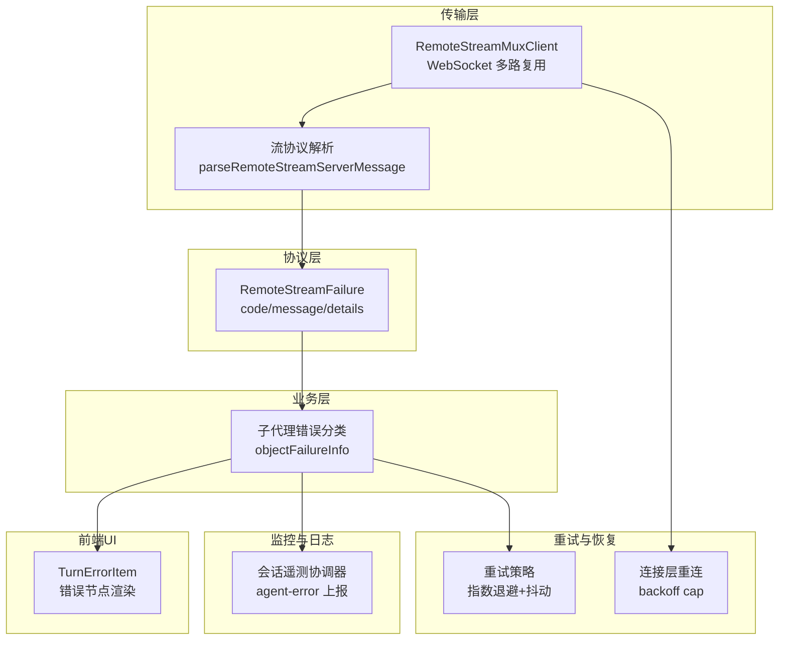
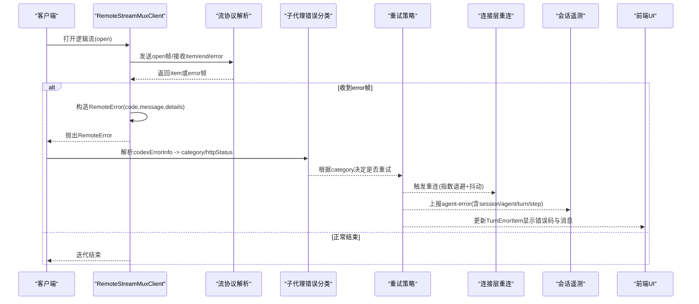
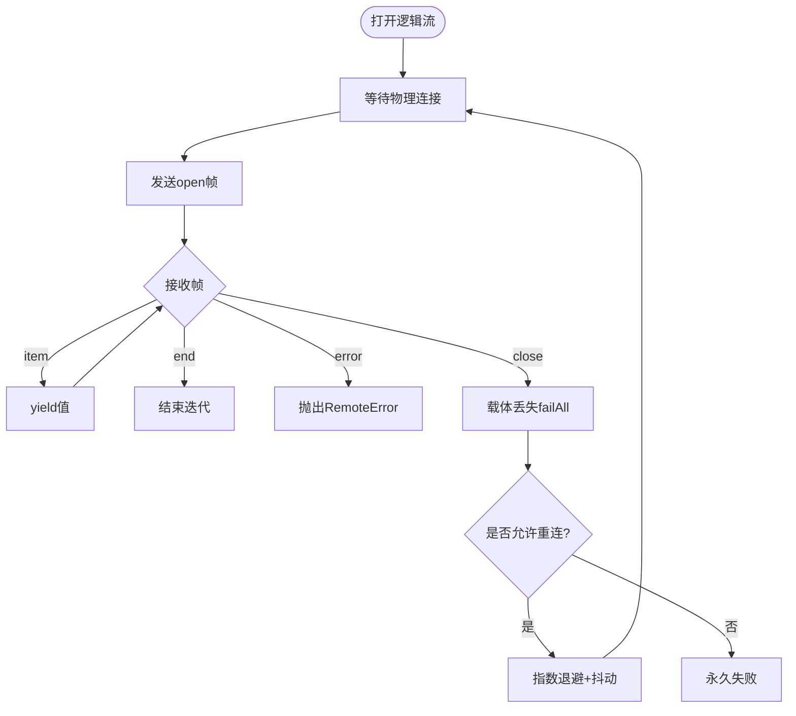
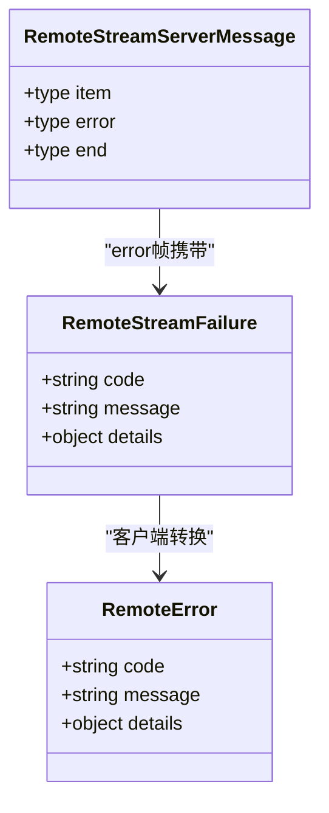
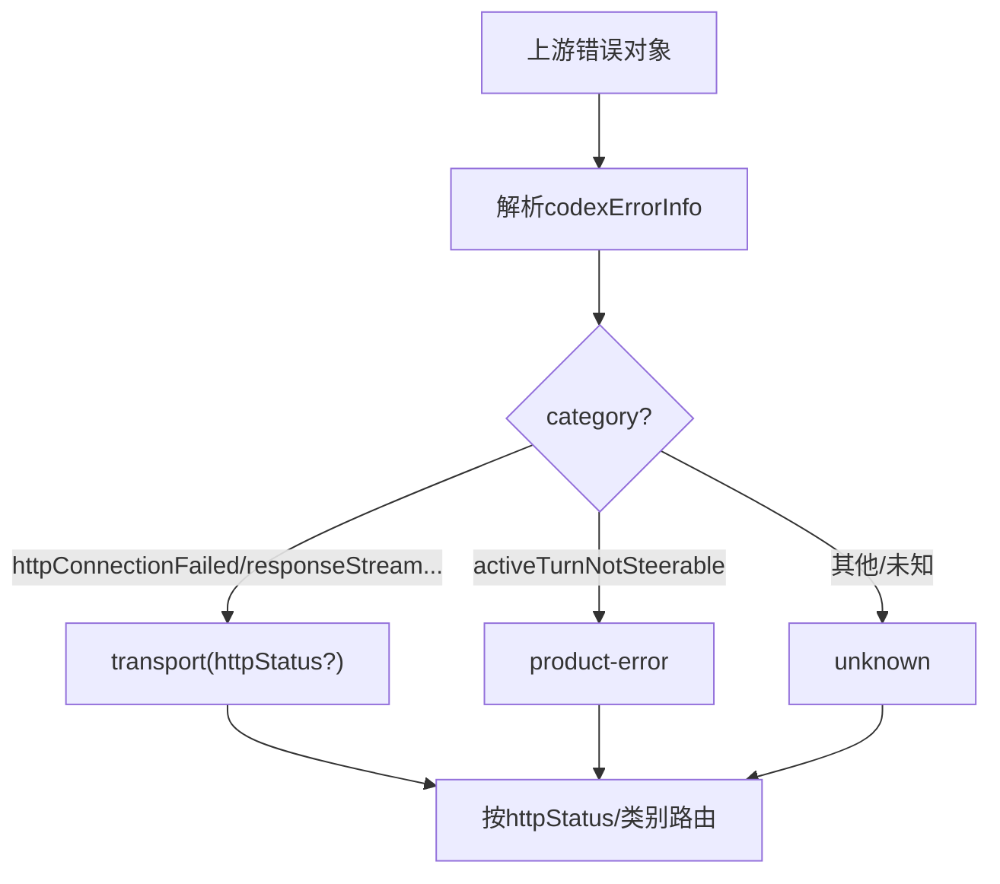
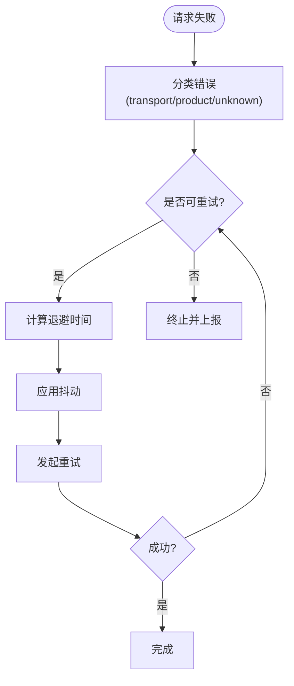
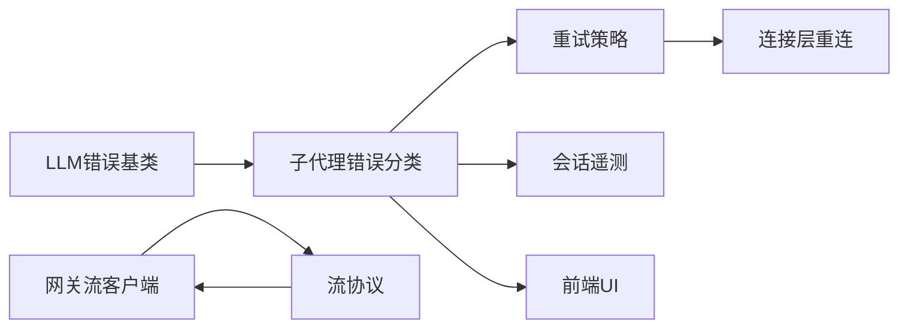

# 流式错误处理

<cite>
**本文引用的文件**
- [packages/llm/llm/src/error.ts](file://packages/llm/llm/src/error.ts)
- [packages/api/gateway/src/client/stream-client.ts](file://packages/api/gateway/src/client/stream-client.ts)
- [packages/api/gateway/src/stream-protocol.ts](file://packages/api/gateway/src/stream-protocol.ts)
- [packages/api/gateway/src/client/remote-stream.ts](file://packages/api/gateway/src/client/remote-stream.ts)
- [packages/subagent/subagent-codex/src/wire.ts](file://packages/subagent/subagent-codex/src/wire.ts)
- [packages/session/session-telemetry/src/coordinator.ts](file://packages/session/session-telemetry/src/coordinator.ts)
- [packages/llm/llm-retry/src/index.ts](file://packages/llm/llm-retry/src/index.ts)
- [packages/llm/llm/src/retry-policy.ts](file://packages/llm/llm/src/retry-policy.ts)
- [packages/client/connection/src/client/connection.ts](file://packages/client/connection/src/client/connection.ts)
- [packages/client/ui-chat/src/client/chat/MessageItem.tsx](file://packages/client/ui-chat/src/client/chat/MessageItem.tsx)
- [snapshots/session/error-finish/replay.override.json](file://snapshots/session/error-finish/replay.override.json)
</cite>

## 目录
1. [简介](#简介)
2. [项目结构](#项目结构)
3. [核心组件](#核心组件)
4. [架构总览](#架构总览)
5. [详细组件分析](#详细组件分析)
6. [依赖关系分析](#依赖关系分析)
7. [性能考量](#性能考量)
8. [故障排查指南](#故障排查指南)
9. [结论](#结论)
10. [附录](#附录)

## 简介
本技术文档围绕“流式错误处理”展开，聚焦于传输层与协议层的错误区分、错误分类与错误码设计、标准化错误处理接口、错误恢复机制（重试、断点续传、状态恢复）、监控与日志最佳实践、常见错误场景（网络异常、服务降级、熔断）以及前端UI的错误提示集成。文档基于仓库中网关流式客户端、LLM错误基类、重试策略、会话遥测等关键实现进行系统化梳理，并提供可操作的流程图与时序图，帮助读者快速理解并落地工程实践。

## 项目结构
本项目采用多包协作的模块化架构：
- 传输层：Gateway 远程流客户端负责 WebSocket 连接、消息收发、物理载体生命周期管理。
- 协议层：Gateway 流协议定义逻辑流帧、错误字段、事件结果等，确保跨边界的数据安全与一致性。
- 业务层：子代理（Subagent）将上游错误信息解析为统一分类（传输/产品错误）。
- 重试与恢复：LLM 重试策略提供指数退避、抖动、最大重试次数；连接层具备断开重连与退避上限。
- 监控与日志：会话遥测协调器捕获 agent 错误并上报，保证观测性。
- UI 集成：聊天界面渲染终端失败节点，展示错误信息与错误码。

**图示来源**
- [packages/api/gateway/src/client/stream-client.ts:15-120](file://packages/api/gateway/src/client/stream-client.ts#L15-L120)
- [packages/api/gateway/src/stream-protocol.ts:252-313](file://packages/api/gateway/src/stream-protocol.ts#L252-L313)
- [packages/subagent/subagent-codex/src/wire.ts:85-112](file://packages/subagent/subagent-codex/src/wire.ts#L85-L112)
- [packages/llm/llm-retry/src/index.ts:39-77](file://packages/llm/llm-retry/src/index.ts#L39-L77)
- [packages/client/connection/src/client/connection.ts:152-190](file://packages/client/connection/src/client/connection.ts#L152-L190)
- [packages/session/session-telemetry/src/coordinator.ts:209-228](file://packages/session/session-telemetry/src/coordinator.ts#L209-L228)
- [packages/client/ui-chat/src/client/chat/MessageItem.tsx:130-160](file://packages/client/ui-chat/src/client/chat/MessageItem.tsx#L130-L160)

**章节来源**
- [packages/api/gateway/src/client/stream-client.ts:15-120](file://packages/api/gateway/src/client/stream-client.ts#L15-L120)
- [packages/api/gateway/src/stream-protocol.ts:252-313](file://packages/api/gateway/src/stream-protocol.ts#L252-L313)
- [packages/subagent/subagent-codex/src/wire.ts:85-112](file://packages/subagent/subagent-codex/src/wire.ts#L85-L112)
- [packages/llm/llm-retry/src/index.ts:39-77](file://packages/llm/llm-retry/src/index.ts#L39-L77)
- [packages/client/connection/src/client/connection.ts:152-190](file://packages/client/connection/src/client/connection.ts#L152-L190)
- [packages/session/session-telemetry/src/coordinator.ts:209-228](file://packages/session/session-telemetry/src/coordinator.ts#L209-L228)
- [packages/client/ui-chat/src/client/chat/MessageItem.tsx:130-160](file://packages/client/ui-chat/src/client/chat/MessageItem.tsx#L130-L160)

## 核心组件
- 错误基类与稳定错误码：提供统一的 HarnessError 基类与 provider-neutral 错误码（如上下文窗口超限、配额耗尽、空响应、无效凭证），便于上层按 code 路由而非解析 message。
- 流式传输错误：RemoteStreamCarrierError 表示物理载体失败（WebSocket 打开失败、关闭、收到非法帧），由上层决定重试或终止。
- 协议错误：RemoteStreamFailure 携带 code/message/details，经协议校验后在客户端转换为 RemoteError，供业务层分类。
- 错误分类：子代理 wire 层将远端错误对象解析为 category（transport/product-error/unknown），并可提取 httpStatus，用于差异化处理。
- 重试策略：指数退避 + 抖动，支持 always/normal 模式，配置项严格校验，避免过度重试与资源浪费。
- 连接层重连：连接管理器维护 backoff 上限与最终层级，断开时进入等待并重试，支持立即重试开关。
- 遥测与日志：会话遥测协调器订阅 agent/error 事件，输出结构化错误记录，包含 session/agent/turn/step 等上下文。
- UI 集成：聊天视图渲染 TurnErrorItem，展示错误标题、消息与错误码，保持用户可见的一致性。

**章节来源**
- [packages/llm/llm/src/error.ts:13-49](file://packages/llm/llm/src/error.ts#L13-L49)
- [packages/api/gateway/src/client/stream-client.ts:15-25](file://packages/api/gateway/src/client/stream-client.ts#L15-L25)
- [packages/api/gateway/src/stream-protocol.ts:252-313](file://packages/api/gateway/src/stream-protocol.ts#L252-L313)
- [packages/subagent/subagent-codex/src/wire.ts:85-112](file://packages/subagent/subagent-codex/src/wire.ts#L85-L112)
- [packages/llm/llm-retry/src/index.ts:39-77](file://packages/llm/llm-retry/src/index.ts#L39-L77)
- [packages/client/connection/src/client/connection.ts:152-190](file://packages/client/connection/src/client/connection.ts#L152-L190)
- [packages/session/session-telemetry/src/coordinator.ts:209-228](file://packages/session/session-telemetry/src/coordinator.ts#L209-L228)
- [packages/client/ui-chat/src/client/chat/MessageItem.tsx:130-160](file://packages/client/ui-chat/src/client/chat/MessageItem.tsx#L130-L160)

## 架构总览
下图展示了从传输层到协议层再到业务层的错误流转路径，以及重试、遥测与 UI 集成的交互关系。

**图示来源**
- [packages/api/gateway/src/client/stream-client.ts:80-120](file://packages/api/gateway/src/client/stream-client.ts#L80-L120)
- [packages/api/gateway/src/stream-protocol.ts:252-313](file://packages/api/gateway/src/stream-protocol.ts#L252-L313)
- [packages/subagent/subagent-codex/src/wire.ts:85-112](file://packages/subagent/subagent-codex/src/wire.ts#L85-L112)
- [packages/llm/llm-retry/src/index.ts:39-77](file://packages/llm/llm-retry/src/index.ts#L39-L77)
- [packages/client/connection/src/client/connection.ts:152-190](file://packages/client/connection/src/client/connection.ts#L152-L190)
- [packages/session/session-telemetry/src/coordinator.ts:209-228](file://packages/session/session-telemetry/src/coordinator.ts#L209-L228)
- [packages/client/ui-chat/src/client/chat/MessageItem.tsx:130-160](file://packages/client/ui-chat/src/client/chat/MessageItem.tsx#L130-L160)

## 详细组件分析

### 传输层错误处理（RemoteStreamMuxClient）
- 职责：维护单一物理 WebSocket，承载多个逻辑流；处理 open/cancel/item/end/error 帧；在载体失效时统一失败所有逻辑流。
- 错误类型：
  - 连接失败：WebSocket 打开失败、关闭前关闭、收到非文本消息。
  - 协议不合法：服务端返回非法帧，导致强制关闭并标记失败。
- 行为：
  - 收到 error 帧时构造 RemoteError 并向上抛出。
  - 载体丢失时调用 lost/failAll，通知所有逻辑流。
  - 支持 reconnect 主动中断当前尝试并重建连接。

**图示来源**
- [packages/api/gateway/src/client/stream-client.ts:80-120](file://packages/api/gateway/src/client/stream-client.ts#L80-L120)
- [packages/api/gateway/src/client/stream-client.ts:142-191](file://packages/api/gateway/src/client/stream-client.ts#L142-L191)
- [packages/api/gateway/src/client/stream-client.ts:222-245](file://packages/api/gateway/src/client/stream-client.ts#L222-L245)

**章节来源**
- [packages/api/gateway/src/client/stream-client.ts:80-120](file://packages/api/gateway/src/client/stream-client.ts#L80-L120)
- [packages/api/gateway/src/client/stream-client.ts:142-191](file://packages/api/gateway/src/client/stream-client.ts#L142-L191)
- [packages/api/gateway/src/client/stream-client.ts:222-245](file://packages/api/gateway/src/client/stream-client.ts#L222-L245)

### 协议层错误处理（流协议与错误字段）
- 协议定义：RemoteStreamFailure 包含 code/message/details，确保跨进程/浏览器安全的错误序列化。
- 解析与校验：服务端消息通过 parseRemoteStreamServerMessage 严格校验字段与类型，非法数据直接抛错并关闭连接。
- 错误还原：客户端将 RemoteStreamFailure 映射为 RemoteError，保留 name/code/message/details，便于上层分类。

**图示来源**
- [packages/api/gateway/src/stream-protocol.ts:252-313](file://packages/api/gateway/src/stream-protocol.ts#L252-L313)

**章节来源**
- [packages/api/gateway/src/stream-protocol.ts:252-313](file://packages/api/gateway/src/stream-protocol.ts#L252-L313)

### 错误分类体系与错误码设计
- 基类与稳定码：HarnessError 提供稳定 code 与 cause 链；provider-neutral 码包括 CONTEXT_WINDOW_EXCEEDED、QUOTA、EMPTY_RESPONSE、INVALID_CREDENTIAL。
- 分类规则：子代理 wire 层将 codexErrorInfo 解析为 category（transport/product-error/unknown），并可提取 httpStatus，用于区分网络/认证与产品逻辑错误。
- 识别函数：isContextWindowExceededError、isQuotaExceededError 通过正则匹配 provider 错误文本，统一归类。

**图示来源**
- [packages/subagent/subagent-codex/src/wire.ts:85-112](file://packages/subagent/subagent-codex/src/wire.ts#L85-L112)
- [packages/llm/llm/src/error.ts:24-49](file://packages/llm/llm/src/error.ts#L24-L49)
- [packages/llm/llm/src/error.ts:80-100](file://packages/llm/llm/src/error.ts#L80-L100)

**章节来源**
- [packages/subagent/subagent-codex/src/wire.ts:85-112](file://packages/subagent/subagent-codex/src/wire.ts#L85-L112)
- [packages/llm/llm/src/error.ts:24-49](file://packages/llm/llm/src/error.ts#L24-L49)
- [packages/llm/llm/src/error.ts:80-100](file://packages/llm/llm/src/error.ts#L80-L100)

### 错误恢复机制：重试、断点续传与状态恢复
- 重试策略：
  - 指数退避：delay = min(initialDelayMs * 2^(retry-1), maxDelayMs)，乘以抖动因子 jitterRatio。
  - 模式：always（始终重试）与 normal（仅对可重试码重试），配置键严格校验。
  - 连接层：backoffCap/backoffDelay/isFinalBackoffTier 控制退避上限与最终层级，断开时进入等待并重试。
- 断点续传与状态恢复：
  - 会话投影恢复：restore 方法校验 checkpoint 版本与 seq，若不可用则要求从头重读，保证状态一致性。
  - 流式重试：waitForRemoteStreamRetry 监听 connection.generation 变化，避免重复重试与竞态。

**图示来源**
- [packages/llm/llm-retry/src/index.ts:39-77](file://packages/llm/llm-retry/src/index.ts#L39-L77)
- [packages/llm/llm/src/retry-policy.ts:105-160](file://packages/llm/llm/src/retry-policy.ts#L105-L160)
- [packages/client/connection/src/client/connection.ts:152-190](file://packages/client/connection/src/client/connection.ts#L152-L190)
- [packages/api/gateway/src/client/remote-stream.ts:160-197](file://packages/api/gateway/src/client/remote-stream.ts#L160-L197)
- [packages/session/session-projection/src/index.ts:490-520](file://packages/session/session-projection/src/index.ts#L490-L520)

**章节来源**
- [packages/llm/llm-retry/src/index.ts:39-77](file://packages/llm/llm-retry/src/index.ts#L39-L77)
- [packages/llm/llm/src/retry-policy.ts:105-160](file://packages/llm/llm/src/retry-policy.ts#L105-L160)
- [packages/client/connection/src/client/connection.ts:152-190](file://packages/client/connection/src/client/connection.ts#L152-L190)
- [packages/api/gateway/src/client/remote-stream.ts:160-197](file://packages/api/gateway/src/client/remote-stream.ts#L160-L197)
- [packages/session/session-projection/src/index.ts:490-520](file://packages/session/session-projection/src/index.ts#L490-L520)

### 错误监控与日志记录最佳实践
- 采集点：会话遥测协调器订阅 agent/error，输出结构化记录，包含 session.id、agent.id、turn、step、error.name 等属性。
- 隔离性：contain 包裹每个步骤，防止后端上报失败影响主流程。
- 去标识化：redact 过滤敏感信息，确保隐私合规。
- 建议：
  - 使用稳定的 code 进行分类与告警，避免解析 message。
  - 在重试边界与载体失败处增加上下文（attempt、backoff、generation）。
  - 结合链路追踪（tracing）关联错误与事件序列。

**章节来源**
- [packages/session/session-telemetry/src/coordinator.ts:209-228](file://packages/session/session-telemetry/src/coordinator.ts#L209-L228)
- [packages/session/session-telemetry/src/coordinator.ts:230-241](file://packages/session/session-telemetry/src/coordinator.ts#L230-L241)

### 前端UI的错误提示集成
- 渲染：TurnErrorItem 展示错误标题、消息与错误码，保持视觉一致性与可访问性（role="status"）。
- 文案：通过国际化翻译 key 获取提示，错误码以代码形式呈现便于复制与诊断。
- 建议：
  - 根据 code 选择不同图标与颜色（如 AUTH 对应认证失败）。
  - 提供重试按钮或引导操作（如检查凭证、切换模型）。
  - 与遥测联动，上报用户可见错误的上下文。

**章节来源**
- [packages/client/ui-chat/src/client/chat/MessageItem.tsx:130-160](file://packages/client/ui-chat/src/client/chat/MessageItem.tsx#L130-L160)
- [snapshots/session/error-finish/replay.override.json:1-3](file://snapshots/session/error-finish/replay.override.json#L1-L3)

## 依赖关系分析
- 耦合度：
  - 传输层依赖协议层进行消息解析与校验，降低跨边界风险。
  - 业务层依赖错误分类与稳定码，解耦具体 provider 实现。
  - 重试策略与连接层相互独立，但共享退避参数，便于统一调优。
- 外部依赖：
  - WebSocket 作为物理载体，需处理打开/关闭/错误事件。
  - 遥测后端接收结构化记录，需保证幂等与去重。
- 循环依赖：未发现明显循环导入；模块间通过明确接口（协议、错误类型）通信。

**图示来源**
- [packages/llm/llm/src/error.ts:13-49](file://packages/llm/llm/src/error.ts#L13-L49)
- [packages/api/gateway/src/client/stream-client.ts:80-120](file://packages/api/gateway/src/client/stream-client.ts#L80-L120)
- [packages/api/gateway/src/stream-protocol.ts:252-313](file://packages/api/gateway/src/stream-protocol.ts#L252-L313)
- [packages/subagent/subagent-codex/src/wire.ts:85-112](file://packages/subagent/subagent-codex/src/wire.ts#L85-L112)
- [packages/llm/llm-retry/src/index.ts:39-77](file://packages/llm/llm-retry/src/index.ts#L39-L77)
- [packages/client/connection/src/client/connection.ts:152-190](file://packages/client/connection/src/client/connection.ts#L152-L190)
- [packages/session/session-telemetry/src/coordinator.ts:209-228](file://packages/session/session-telemetry/src/coordinator.ts#L209-L228)
- [packages/client/ui-chat/src/client/chat/MessageItem.tsx:130-160](file://packages/client/ui-chat/src/client/chat/MessageItem.tsx#L130-L160)

**章节来源**
- [packages/llm/llm/src/error.ts:13-49](file://packages/llm/llm/src/error.ts#L13-L49)
- [packages/api/gateway/src/client/stream-client.ts:80-120](file://packages/api/gateway/src/client/stream-client.ts#L80-L120)
- [packages/api/gateway/src/stream-protocol.ts:252-313](file://packages/api/gateway/src/stream-protocol.ts#L252-L313)
- [packages/subagent/subagent-codex/src/wire.ts:85-112](file://packages/subagent/subagent-codex/src/wire.ts#L85-L112)
- [packages/llm/llm-retry/src/index.ts:39-77](file://packages/llm/llm-retry/src/index.ts#L39-L77)
- [packages/client/connection/src/client/connection.ts:152-190](file://packages/client/connection/src/client/connection.ts#L152-L190)
- [packages/session/session-telemetry/src/coordinator.ts:209-228](file://packages/session/session-telemetry/src/coordinator.ts#L209-L228)
- [packages/client/ui-chat/src/client/chat/MessageItem.tsx:130-160](file://packages/client/ui-chat/src/client/chat/MessageItem.tsx#L130-L160)

## 性能考量
- 重试退避：指数增长配合抖动，避免雪崩与集中重试；设置 maxDelayMs 限制延迟上限。
- 连接层：backoffCap 与 isFinalBackoffTier 确保退避收敛，减少频繁重连开销。
- 协议校验：严格解析与白名单校验，降低非法数据导致的额外处理成本。
- 遥测上报：contain 包裹与异步投递，避免阻塞主流程；去标识化减少体积。
- UI 渲染：错误节点轻量渲染，避免大对象传递；使用稳定 code 做分支判断，减少字符串比较。

[本节为通用指导，无需特定文件引用]

## 故障排查指南
- 常见问题：
  - 网络中断：RemoteStreamCarrierError 出现，检查 WebSocket 状态与服务器可达性。
  - 超时：重试策略达到 maxRetries 后终止，检查 backoff 配置与服务端负载。
  - 认证失败：HTTP 401/403 归为 transport，检查凭证有效性；INVALID_CREDENTIAL 需修正存储值。
  - 数据格式错误：协议解析失败，检查服务端消息结构与字段类型。
  - 协议不兼容：未知 category 或 futureVariant，降级为 unknown 并记录详情。
- 定位步骤：
  - 查看遥测记录中的 agent-error，关注 session/agent/turn/step 与 error.name。
  - 检查重试日志，确认 attempt 与 delay 是否符合预期。
  - 核对 UI 显示的 code 与 message，结合 replay 快照验证。
- 修复建议：
  - 调整 retryPolicy 的 mode、maxRetries、backoff 参数。
  - 在服务端增强错误码与 message 的可诊断性。
  - 在前端提供重试入口与用户引导。

**章节来源**
- [packages/api/gateway/src/client/stream-client.ts:15-25](file://packages/api/gateway/src/client/stream-client.ts#L15-L25)
- [packages/llm/llm/src/error.ts:24-49](file://packages/llm/llm/src/error.ts#L24-L49)
- [packages/session/session-telemetry/src/coordinator.ts:209-228](file://packages/session/session-telemetry/src/coordinator.ts#L209-L228)
- [snapshots/session/error-finish/replay.override.json:1-3](file://snapshots/session/error-finish/replay.override.json#L1-L3)

## 结论
本方案通过明确的传输层与协议层分离、稳定的错误分类与错误码、健壮的重试与恢复机制、完善的监控与日志、以及友好的前端集成，构建了端到端的流式错误处理能力。建议在工程中遵循稳定 code 路由、严格协议校验、合理退避与抖动、全面遥测采集与去标识化，以提升系统韧性与用户体验。

[本节为总结性内容，无需特定文件引用]

## 附录
- 常见错误场景示例：
  - 网络异常：WebSocket 打开失败/关闭，触发 CarrierError 与重连。
  - 服务降级：服务端返回 503/429，按 httpStatus 分类为 transport 并触发重试。
  - 熔断机制：达到 backoffMaxMs 或 final tier 后停止重试，避免级联故障。
- 参考实现路径：
  - 错误基类与识别函数：packages/llm/llm/src/error.ts
  - 流式客户端与协议：packages/api/gateway/src/client/stream-client.ts, packages/api/gateway/src/stream-protocol.ts
  - 错误分类：packages/subagent/subagent-codex/src/wire.ts
  - 重试策略：packages/llm/llm-retry/src/index.ts, packages/llm/llm/src/retry-policy.ts
  - 连接层重连：packages/client/connection/src/client/connection.ts
  - 遥测协调器：packages/session/session-telemetry/src/coordinator.ts
  - UI 集成：packages/client/ui-chat/src/client/chat/MessageItem.tsx

[本节为附录说明，无需特定文件引用]