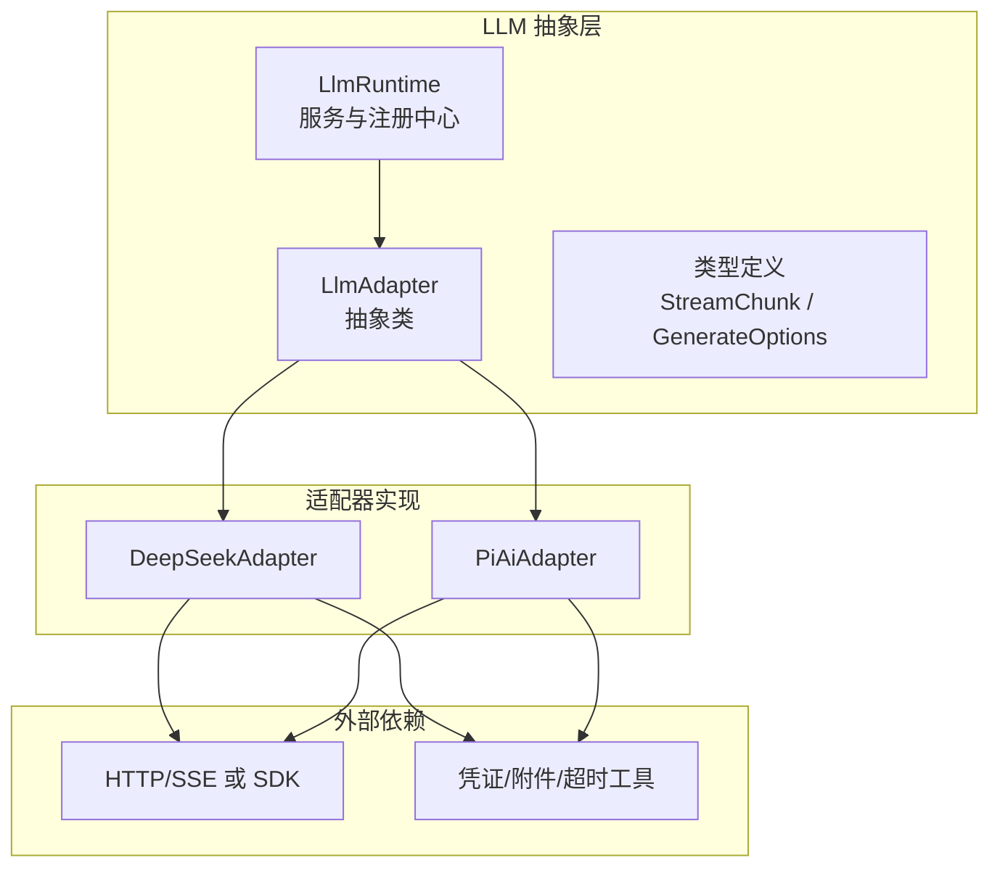
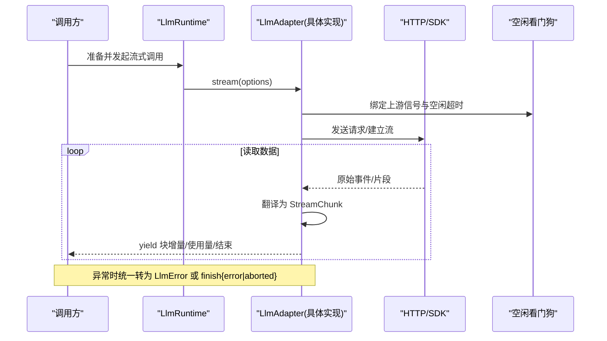
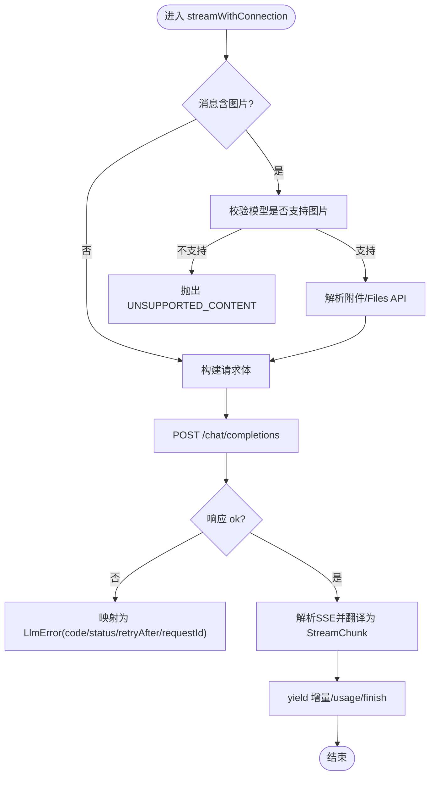
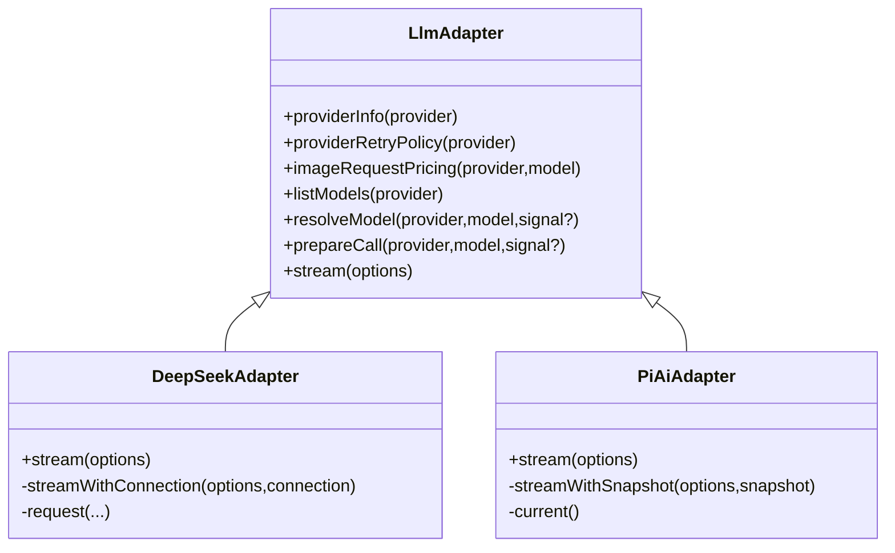
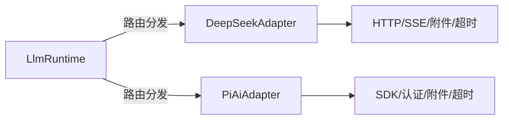

# 适配器接口实现

<cite>
**本文引用的文件**
- [packages/llm/llm/src/index.ts](file://packages/llm/llm/src/index.ts)
- [packages/llm/llm/src/types.ts](file://packages/llm/llm/src/types.ts)
- [packages/llm/llm-deepseek/src/adapter.ts](file://packages/llm/llm-deepseek/src/adapter.ts)
- [packages/llm/llm-pi-ai/src/adapter.ts](file://packages/llm/llm-pi-ai/src/adapter.ts)
- [docs/cookbook/adding-an-llm-adapter.md](file://docs/cookbook/adding-an-llm-adapter.md)
</cite>

## 目录
1. [简介](#简介)
2. [项目结构](#项目结构)
3. [核心组件](#核心组件)
4. [架构总览](#架构总览)
5. [详细组件分析](#详细组件分析)
6. [依赖关系分析](#依赖关系分析)
7. [性能考量](#性能考量)
8. [故障排查指南](#故障排查指南)
9. [结论](#结论)
10. [附录](#附录)

## 简介
本文面向需要为 Harness LLM 子系统实现新模型提供商适配器的开发者，系统性说明 LlmAdapter 基类的继承与实现要求、流式协议约定、注册机制（含 provider 路由、依赖注入与 HMR 安全）、Config 配置对象与环境变量集成、以及适配器生命周期与资源清理。文中以 DeepSeek 与 pi-ai 两个参考实现为例，给出最小化实现路径与最佳实践。

## 项目结构
- LLM 抽象与运行时位于 packages/llm/llm：定义 LlmAdapter、LlmRuntime、类型 StreamChunk/GenerateOptions 等。
- 具体适配器实现位于 packages/llm/llm-deepseek 与 packages/llm/llm-pi-ai：分别基于直连 HTTP+SSE 与第三方 SDK 封装。
- 适配器开发指南位于 docs/cookbook/adding-an-llm-adapter.md：提供协议约定与注册模板。

图表来源
- [packages/llm/llm/src/index.ts:191-279](file://packages/llm/llm/src/index.ts#L191-L279)
- [packages/llm/llm/src/types.ts:370-443](file://packages/llm/llm/src/types.ts#L370-L443)
- [packages/llm/llm-deepseek/src/adapter.ts:355-444](file://packages/llm/llm-deepseek/src/adapter.ts#L355-L444)
- [packages/llm/llm-pi-ai/src/adapter.ts:240-344](file://packages/llm/llm-pi-ai/src/adapter.ts#L240-L344)

章节来源
- [packages/llm/llm/src/index.ts:1-80](file://packages/llm/llm/src/index.ts#L1-L80)
- [docs/cookbook/adding-an-llm-adapter.md:1-44](file://docs/cookbook/adding-an-llm-adapter.md#L1-L44)

## 核心组件
- LlmAdapter：抽象基类，要求实现 stream(options) 返回 AsyncIterable<StreamChunk>；可选覆盖 providerInfo、providerRetryPolicy、imageRequestPricing、listModels、resolveModel、prepareCall。
- LlmRuntime：适配器注册中心与服务入口，提供 registerAdapter、registerConfigurableProviders、registerModelDiscovery、listProviders、listModels、resolveModelInfo 等能力；通过事件 llm/adapters-updated 通知拓扑变更。
- 类型体系：StreamChunk 描述块级增量与结束语义；GenerateOptions 描述一次完整请求；FinishReason、TokenUsage、ReplayEnvelope 等用于完成态与回放。

章节来源
- [packages/llm/llm/src/index.ts:191-279](file://packages/llm/llm/src/index.ts#L191-L279)
- [packages/llm/llm/src/index.ts:330-531](file://packages/llm/llm/src/index.ts#L330-L531)
- [packages/llm/llm/src/types.ts:370-443](file://packages/llm/llm/src/types.ts#L370-L443)

## 架构总览
下图展示从调用方到适配器的流式调用链路与关键控制点（重试、取消、空闲超时、错误归一化）。

图表来源
- [packages/llm/llm/src/index.ts:191-279](file://packages/llm/llm/src/index.ts#L191-L279)
- [packages/llm/llm-deepseek/src/adapter.ts:446-522](file://packages/llm/llm-deepseek/src/adapter.ts#L446-L522)
- [packages/llm/llm-pi-ai/src/adapter.ts:346-440](file://packages/llm/llm-pi-ai/src/adapter.ts#L346-L440)

## 详细组件分析

### LlmAdapter 基类与实现要求
- 必须实现：stream(options): AsyncIterable<StreamChunk>
- 建议覆盖：
  - providerInfo(provider): 声明 provider 显示信息，id 必须等于传入的 provider
  - providerRetryPolicy(provider): 返回该 provider 的重试策略
  - imageRequestPricing(provider, model): 同步计算图片请求价格，不得 I/O
  - listModels(provider): 列出可发现模型（仅建议）
  - resolveModel(provider, model, signal?): 精确模型元数据（上下文窗口、默认 maxTokens、推理努力级别等）
  - prepareCall(provider, model, signal?): 将“模型解析”与“最终流入口”绑定到同一快照，避免配置漂移

实现要点
- 严格遵循 StreamChunk 协议：按首次出现顺序分配 index；usage 必须在 finish 之前发出；finish 之后不得再 emit 任何 chunk。
- 工具调用参数保持原始 JSON 字符串，增量以 argumentsDelta 形式发出，结束时以 block-end 携带完整内容。
- 支持取消：必须监听 options.signal 并在 abort 后尽快释放资源。
- 不支持的选项应抛出 LlmError('UNSUPPORTED_OPTION')，而非静默丢弃。
- 如需下游重放，finish.replayState 携带最小必要元数据，由上层校验与复用。

章节来源
- [packages/llm/llm/src/index.ts:191-279](file://packages/llm/llm/src/index.ts#L191-L279)
- [packages/llm/llm/src/types.ts:370-443](file://packages/llm/llm/src/types.ts#L370-L443)
- [docs/cookbook/adding-an-llm-adapter.md:25-35](file://docs/cookbook/adding-an-llm-adapter.md#L25-L35)

### 流式协议与 StreamChunk
- 块起始：block-start(index, blockType)
- 文本/推理/工具调用增量：text-delta/reasoning-delta/tool-call-delta
- 块结束：block-end(index, ContentBlock)
- 用量统计：usage(TokenUsage)
- 结束：finish(FinishReason, replayState?)

注意
- FinishReason 包含 stop、tool-calls、max-tokens、aborted(error/failure)、error(failure)。
- TokenUsage 字段互斥计数，缓存命中单独报告。

章节来源
- [packages/llm/llm/src/types.ts:370-443](file://packages/llm/llm/src/types.ts#L370-L443)

### 适配器注册机制（Provider 路由、依赖注入、HMR 安全）
- 注册 API：ctx.llm.registerAdapter(providers[], adapter)
  - 全有或全无校验：重复 provider、空名、无效 metadata 会抛错且不改变现有状态。
  - 返回句柄：可调用 dispose() 释放所有路由；replace(newProviders[]) 原子替换当前路由集。
- 可配置提供者目录：registerConfigurableProviders(entries[])
  - 声明插件可激活的 provider 路由及其设置命名空间与路径，便于 UI 暴露。
  - 同样支持 replace() 原子替换与 dispose() 释放。
- 模型发现：registerModelDiscovery(settingsNs, discover)
  - 为某个设置命名空间提供端点探测能力，供配置界面动态发现可用模型。
- 拓扑变更事件：llm/adapters-updated
  - 每次提交点（注册/注销/替换）都会发布，消费者重新读取 listProviders/listModels/listConfigurableProviders。

HMR 安全
- 注册与替换均在 effect 作用域内，确保热更新时旧路由被正确释放，新路由原子切换，无中间态可见。

章节来源
- [packages/llm/llm/src/index.ts:330-531](file://packages/llm/llm/src/index.ts#L330-L531)
- [docs/cookbook/adding-an-llm-adapter.md:18-23](file://docs/cookbook/adding-an-llm-adapter.md#L18-L23)

### 配置对象 Config 与环境变量集成
- 推荐模式：使用 schema 定义 Config（如 zod），并通过 cordis 配置系统注入；环境变量通过 !!js process.env.MY_KEY 等方式接入。
- 密钥处理：不要硬编码或读取任意 key 文件；统一通过凭证 seam 与 normalizeApiKey/assertUsableApiKey 校验。
- 运行时注入：适配器构造期接收“每操作解析钩子”（如 options()、resolveApiKey()），保证每次请求都基于最新配置快照，避免配置漂移。

章节来源
- [docs/cookbook/adding-an-llm-adapter.md:18-23](file://docs/cookbook/adding-an-llm-adapter.md#L18-L23)
- [packages/llm/llm/src/index.ts:126-159](file://packages/llm/llm/src/index.ts#L126-L159)
- [packages/llm/llm-deepseek/src/adapter.ts:114-137](file://packages/llm/llm-deepseek/src/adapter.ts#L114-L137)
- [packages/llm/llm-pi-ai/src/adapter.ts:73-111](file://packages/llm/llm-pi-ai/src/adapter.ts#L73-L111)

### 参考实现一：DeepSeekAdapter（直连 HTTP + SSE）
- 连接与鉴权：通过 options() 获取连接事实（baseURL、默认值、重试策略等），通过 resolveApiKey(connection) 获取本次请求的 token，保证 endpoint 与 secret 同代。
- 图片处理：优先 Files API 上传，失败回退 base64；支持像素/字节/数量上限与去重策略。
- 流式消费：idleWatchdog 管理空闲超时；AbortController 与 upstream signal 合并；finally 中确保 iterator.return() 与 abort。
- 错误归一化：HTTP 非 2xx 映射为稳定 code（AUTH、RATE_LIMIT、CONTEXT_WINDOW_EXCEEDED 等），并携带 retry-after、request-id。
- 模型能力：listModels/resolveModel 输出 inputModalities、contextWindow、defaultMaxTokens、reasoning efforts。

图表来源
- [packages/llm/llm-deepseek/src/adapter.ts:446-708](file://packages/llm/llm-deepseek/src/adapter.ts#L446-L708)

章节来源
- [packages/llm/llm-deepseek/src/adapter.ts:355-711](file://packages/llm/llm-deepseek/src/adapter.ts#L355-L711)

### 参考实现二：PiAiAdapter（SDK 封装）
- 快照隔离：current() 构建不可变 Models 集合，每次配置变化生成新快照；prepareCall 将模型信息与流入口绑定到同一快照。
- 推理努力：根据模型能力过滤/拒绝不支持的 reasoning effort，并在 catalog 中只暴露可描述级别。
- 流式消费：streamSimple 返回事件流，toStreamChunks 转换为 StreamChunk；watchdog 管理空闲超时；finally 中中止并回收迭代器。
- 头部合并：部署自定义头与 Harness 归属头、会话标识头合并，Harness 头具有优先级。

图表来源
- [packages/llm/llm/src/index.ts:191-279](file://packages/llm/llm/src/index.ts#L191-L279)
- [packages/llm/llm-deepseek/src/adapter.ts:355-444](file://packages/llm/llm-deepseek/src/adapter.ts#L355-L444)
- [packages/llm/llm-pi-ai/src/adapter.ts:240-344](file://packages/llm/llm-pi-ai/src/adapter.ts#L240-L344)

章节来源
- [packages/llm/llm-pi-ai/src/adapter.ts:240-442](file://packages/llm/llm-pi-ai/src/adapter.ts#L240-L442)

### 最小化适配器实现示例（步骤指引）
- 定义适配器类：继承 LlmAdapter，实现 stream(options) 返回 AsyncIterable<StreamChunk>。
- 声明 provider 信息：providerInfo 返回 id=provider、name 可读名称。
- 可选能力：listModels、resolveModel、imageRequestPricing、providerRetryPolicy。
- 注册：在 apply(ctx, config) 中调用 ctx.llm.registerAdapter(['your-provider'], new YourAdapter(...))。
- 配置：用 schema 定义 Config，通过 cordis 注入；密钥通过凭证 seam 与 normalizeApiKey 校验。
- 协议遵守：按 StreamChunk 规范发出增量与 finish；usage 在 finish 前；finish 后不再 emit。
- 取消与超时：监听 options.signal；必要时使用 idleWatchdog 管理空闲超时。
- 错误处理：传输/协议错误抛 LlmError；提供方内联错误以 finish{kind:'error'|'aborted'} 表达。

章节来源
- [docs/cookbook/adding-an-llm-adapter.md:7-23](file://docs/cookbook/adding-an-llm-adapter.md#L7-L23)
- [docs/cookbook/adding-an-llm-adapter.md:25-35](file://docs/cookbook/adding-an-llm-adapter.md#L25-L35)

## 依赖关系分析
- LlmRuntime 依赖 LlmAdapter 抽象；具体适配器依赖外部 HTTP/SDK、凭证、附件、超时工具。
- 适配器之间解耦，通过 LlmRuntime 的路由表进行分发；注册阶段进行冲突检测与元数据校验。
- 配置与凭证实例通过“每操作解析钩子”注入，避免全局可变状态导致的竞态。

图表来源
- [packages/llm/llm/src/index.ts:330-531](file://packages/llm/llm/src/index.ts#L330-L531)
- [packages/llm/llm-deepseek/src/adapter.ts:355-711](file://packages/llm/llm-deepseek/src/adapter.ts#L355-L711)
- [packages/llm/llm-pi-ai/src/adapter.ts:240-442](file://packages/llm/llm-pi-ai/src/adapter.ts#L240-L442)

章节来源
- [packages/llm/llm/src/index.ts:330-531](file://packages/llm/llm/src/index.ts#L330-L531)

## 性能考量
- 图片请求优化：优先 Files API 减少 payload；对超大图片执行像素/字节/数量裁剪与去重。
- 流式空闲超时：使用 idleWatchdog 防止长连接挂起；合理设置超时阈值。
- 重试策略：通过 providerRetryPolicy 指定幂等与指数退避策略，避免雪崩。
- 元数据同步：imageRequestPricing 必须同步且无 I/O，以便计量模块快速估算。

[本节为通用指导，不直接分析具体文件]

## 故障排查指南
- 常见错误码与含义
  - AUTH/RATE_LIMIT/CONTEXT_WINDOW_EXCEEDED/INVALID_REQUEST/TRANSPORT/EMPTY_RESPONSE 等，来自适配器对 HTTP 状态与响应的归一化。
- 调试要点
  - 确认 StreamChunk 顺序：usage 必须在 finish 之前；finish 之后不得再 emit。
  - 检查 options.signal 是否正确透传到 fetch/SDK；未取消会导致资源泄漏。
  - 图片相关错误：区分 Files API 失败与 base64 回退失败；关注 provider 对图像格式/尺寸的限制。
  - 配置漂移：确保 prepareCall 将模型信息与流入口绑定到同一快照。
- 日志与诊断
  - 利用 LlmError.failure 中的 message/code/status/providerRetryAfterMs/requestId 定位问题。
  - 通过 llm/adapters-updated 事件观察路由变更是否生效。

章节来源
- [packages/llm/llm-deepseek/src/adapter.ts:334-346](file://packages/llm/llm-deepseek/src/adapter.ts#L334-L346)
- [packages/llm/llm-deepseek/src/adapter.ts:661-707](file://packages/llm/llm-deepseek/src/adapter.ts#L661-L707)
- [packages/llm/llm/src/index.ts:76-124](file://packages/llm/llm/src/index.ts#L76-L124)

## 结论
- 实现 LlmAdapter 的核心在于严格遵守 StreamChunk 协议、正确处理取消与超时、并以 LlmError 统一错误语义。
- 通过 LlmRuntime 的注册机制，可实现多 provider 路由、可配置目录与模型发现，同时保证 HMR 安全与原子切换。
- 借助“每操作解析钩子”注入配置与凭据，避免配置漂移与并发问题。
- 参考实现 DeepSeekAdapter 与 PiAiAdapter 展示了两种典型路径：直连 HTTP+SSE 与 SDK 封装，均可作为新适配器的起点。

[本节为总结性内容，不直接分析具体文件]

## 附录
- 快速清单
  - 实现 stream(options) 并遵守 StreamChunk 协议
  - 覆盖 providerInfo、resolveModel、imageRequestPricing、providerRetryPolicy（按需）
  - 在 apply 中调用 registerAdapter 注册路由
  - 使用 schema 定义 Config，并通过 cordis 注入环境变量与凭证实例
  - 使用 idleWatchdog 与 AbortSignal 管理超时与取消
  - 将传输/协议错误包装为 LlmError，提供方内联错误以 finish{error|aborted} 表达

章节来源
- [docs/cookbook/adding-an-llm-adapter.md:7-23](file://docs/cookbook/adding-an-llm-adapter.md#L7-L23)
- [docs/cookbook/adding-an-llm-adapter.md:25-35](file://docs/cookbook/adding-an-llm-adapter.md#L25-L35)