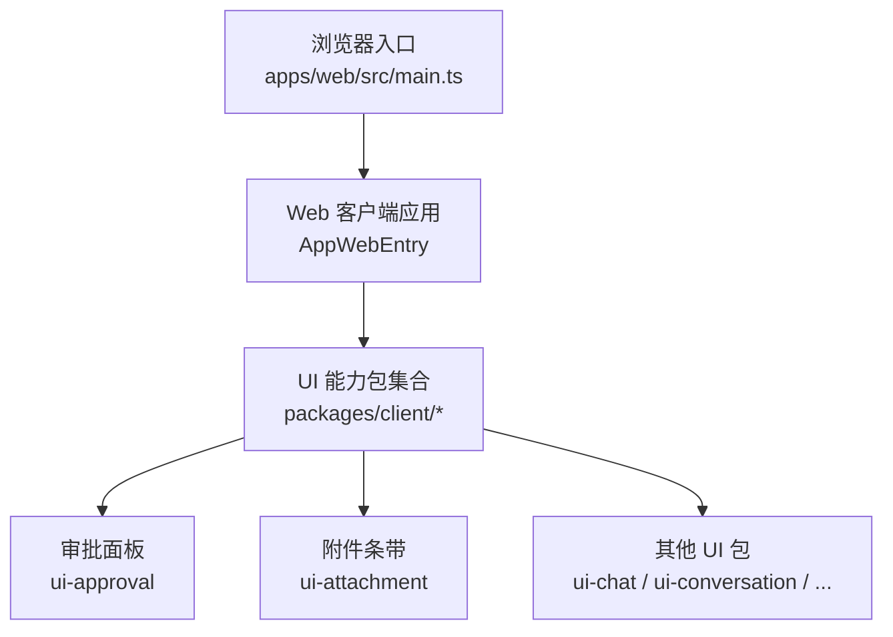
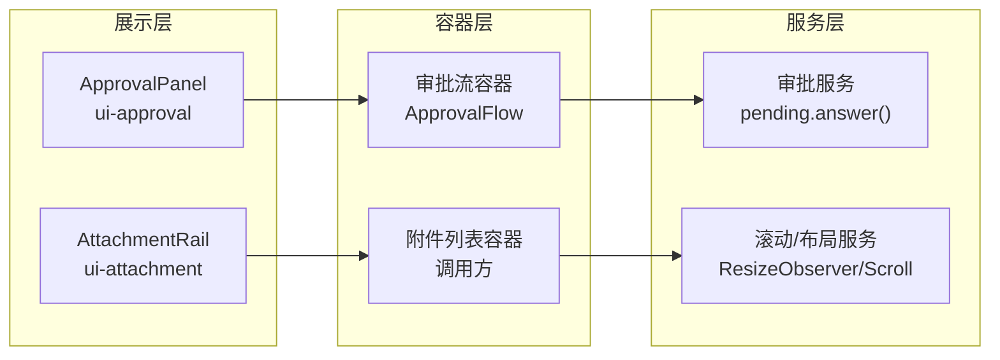
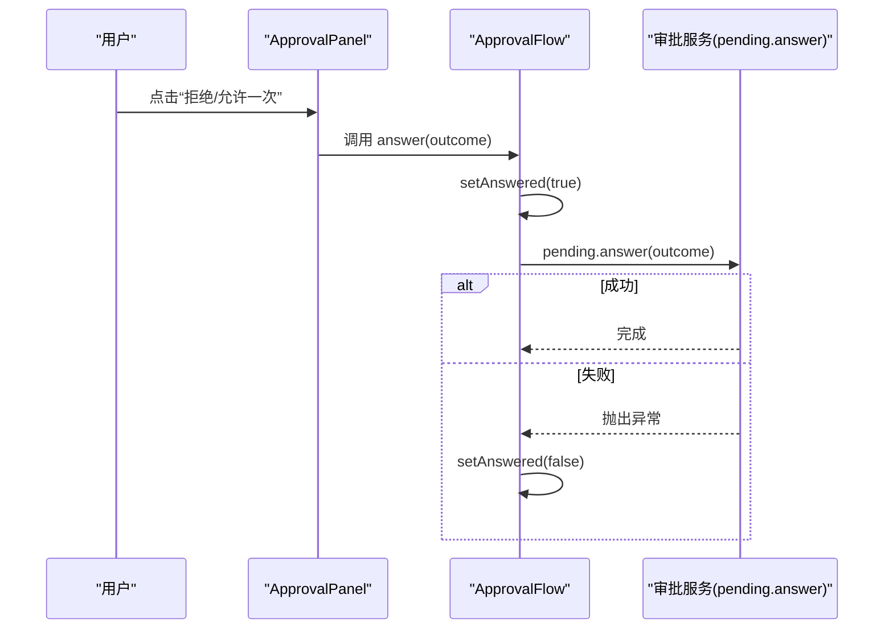
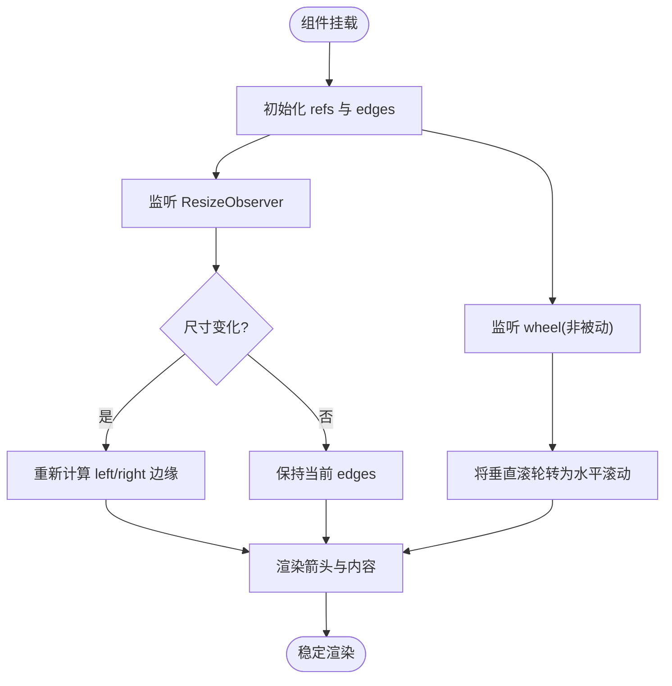
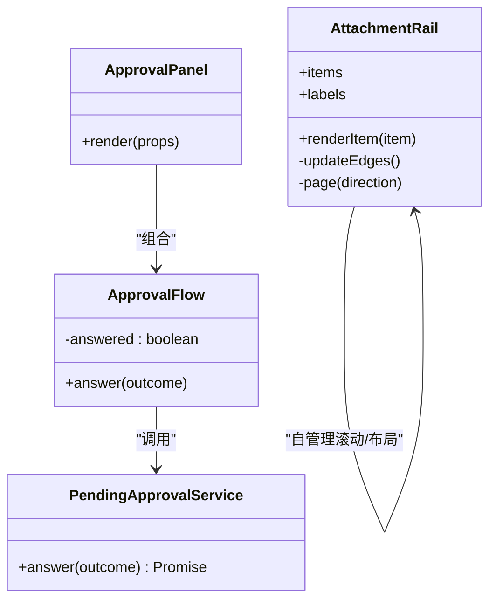
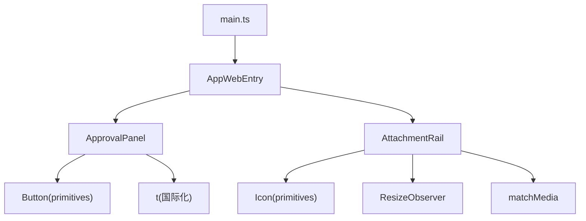

# React组件开发

<cite>
**本文引用的文件**
- [apps/web/src/main.ts](file://apps/web/src/main.ts)
- [packages/client/ui-approval/src/client/ApprovalPanel.tsx](file://packages/client/ui-approval/src/client/ApprovalPanel.tsx)
- [packages/client/ui-attachment/src/AttachmentRail.tsx](file://packages/client/ui-attachment/src/AttachmentRail.tsx)
</cite>

## 目录
1. [简介](#简介)
2. [项目结构](#项目结构)
3. [核心组件](#核心组件)
4. [架构总览](#架构总览)
5. [详细组件分析](#详细组件分析)
6. [依赖分析](#依赖分析)
7. [性能考虑](#性能考虑)
8. [故障排查指南](#故障排查指南)
9. [结论](#结论)
10. [附录](#附录)

## 简介
本指南面向在 DeepSeek Harness 中开发 React 组件的工程师，围绕“展示组件、容器组件、服务组件”的职责分离，阐述状态管理（本地、全局、异步）、事件处理（用户交互、API 调用、状态更新）与典型组件模式（自定义面板、对话框、列表、表单）。文档结合仓库中的实际实现，给出可操作的实践建议、流程图与架构图，帮助你在保证可维护性的同时提升性能与可测试性。

## 项目结构
DeepSeek Harness 的前端以 Web 应用为入口，通过浏览器挂载点启动客户端应用；UI 能力按功能拆分为多个 client 包，每个包聚焦一个领域（如审批、附件、会话等），并通过插槽/契约进行组合。

图表来源
- [apps/web/src/main.ts:1-7](file://apps/web/src/main.ts#L1-L7)

章节来源
- [apps/web/src/main.ts:1-7](file://apps/web/src/main.ts#L1-L7)

## 核心组件
- 审批面板 ApprovalPanel：负责渲染单个待审批项及其可选详情，封装“等待-回答”流程，提供允许一次/拒绝操作，并处理失败回退。
- 附件条带 AttachmentRail：负责横向滚动、边缘箭头分页、滚轮水平平移、可见性边界计算与无障碍标签，由调用方渲染具体卡片。

章节来源
- [packages/client/ui-approval/src/client/ApprovalPanel.tsx:1-56](file://packages/client/ui-approval/src/client/ApprovalPanel.tsx#L1-L56)
- [packages/client/ui-attachment/src/AttachmentRail.tsx:1-172](file://packages/client/ui-attachment/src/AttachmentRail.tsx#L1-L172)

## 架构总览
DeepSeek Harness 的 React 组件遵循“展示-容器-服务”的分层原则：
- 展示组件：纯函数式 UI，仅接收 props 并返回 JSX，无副作用。
- 容器组件：聚合数据与行为，订阅状态/事件，驱动展示组件。
- 服务组件：封装跨组件共享逻辑（如 API 调用、持久化、事件总线），供容器组件复用。

图表来源
- [packages/client/ui-approval/src/client/ApprovalPanel.tsx:12-55](file://packages/client/ui-approval/src/client/ApprovalPanel.tsx#L12-L55)
- [packages/client/ui-attachment/src/AttachmentRail.tsx:56-171](file://packages/client/ui-attachment/src/AttachmentRail.tsx#L56-L171)

## 详细组件分析

### 审批面板 ApprovalPanel
职责与模式
- 作为插槽匹配后的渲染入口，将匹配的待审批项与详情节点传入内部流程组件。
- 内部流程组件维护“已回答”本地状态，避免重复提交，并在失败时回退。
- 通过 t 国际化键渲染文案，按钮禁用态与 answered 绑定，确保幂等。

状态管理
- 本地状态：answered 用于防止重复点击。
- 异步状态：pending.answer() 可能失败，使用 catch 恢复按钮可用。

事件处理
- 用户点击“拒绝/允许一次”触发 answer(outcome)。
- 详情内容由插槽 conversation.approval.detail 动态注入。

图表来源
- [packages/client/ui-approval/src/client/ApprovalPanel.tsx:20-55](file://packages/client/ui-approval/src/client/ApprovalPanel.tsx#L20-L55)

章节来源
- [packages/client/ui-approval/src/client/ApprovalPanel.tsx:1-56](file://packages/client/ui-approval/src/client/ApprovalPanel.tsx#L1-L56)

### 附件条带 AttachmentRail
职责与模式
- 提供隐藏滚动条的水平条带，支持边缘箭头分页、滚轮水平平移、新增项自动滚动到末尾。
- 通过 ResizeObserver 监听容器尺寸变化，实时计算左右边缘是否显示。
- 对 wheel 事件进行非被动监听，将垂直滚轮转换为水平滚动，保持对话区不被联动滚动。

状态与副作用
- 本地状态：edges.left/right 控制箭头显隐。
- 引用：railRef 指向容器元素，countRef 记录条目数量以判断“增长”场景。
- 副作用：useLayoutEffect 处理首次布局与新增项滚动；useEffect 注册 ResizeObserver 与 wheel 监听。

图表来源
- [packages/client/ui-attachment/src/AttachmentRail.tsx:61-127](file://packages/client/ui-attachment/src/AttachmentRail.tsx#L61-L127)
- [packages/client/ui-attachment/src/AttachmentRail.tsx:128-171](file://packages/client/ui-attachment/src/AttachmentRail.tsx#L128-L171)

章节来源
- [packages/client/ui-attachment/src/AttachmentRail.tsx:1-172](file://packages/client/ui-attachment/src/AttachmentRail.tsx#L1-L172)

### 组件分层与职责分离（通用模式）
- 展示组件：只关注 UI 呈现，例如 ApprovalPanel 的卡片布局与按钮；AttachmentRail 的条带结构与箭头。
- 容器组件：聚合业务逻辑与副作用，例如 ApprovalFlow 的状态流转；调用方对 AttachmentRail 的数据组织与滚动策略。
- 服务组件：对外暴露稳定接口，例如 pending.answer() 的审批服务；滚动/布局服务封装原生 API。

图表来源
- [packages/client/ui-approval/src/client/ApprovalPanel.tsx:12-55](file://packages/client/ui-approval/src/client/ApprovalPanel.tsx#L12-L55)
- [packages/client/ui-attachment/src/AttachmentRail.tsx:56-171](file://packages/client/ui-attachment/src/AttachmentRail.tsx#L56-L171)

## 依赖分析
- 入口依赖：Web 应用通过 main.ts 创建 AppWebEntry 实例并运行，加载客户端应用。
- 组件依赖：
  - ApprovalPanel 依赖 primitives 的 Button、插槽系统、CSS 模块与国际化 t。
  - AttachmentRail 依赖 primitives 的图标、clsx、CSS 模块以及浏览器 API（ResizeObserver、matchMedia、WheelEvent）。

图表来源
- [apps/web/src/main.ts:1-7](file://apps/web/src/main.ts#L1-L7)
- [packages/client/ui-approval/src/client/ApprovalPanel.tsx:1-18](file://packages/client/ui-approval/src/client/ApprovalPanel.tsx#L1-L18)
- [packages/client/ui-attachment/src/AttachmentRail.tsx:1-37](file://packages/client/ui-attachment/src/AttachmentRail.tsx#L1-L37)

章节来源
- [apps/web/src/main.ts:1-7](file://apps/web/src/main.ts#L1-L7)
- [packages/client/ui-approval/src/client/ApprovalPanel.tsx:1-18](file://packages/client/ui-approval/src/client/ApprovalPanel.tsx#L1-L18)
- [packages/client/ui-attachment/src/AttachmentRail.tsx:1-37](file://packages/client/ui-attachment/src/AttachmentRail.tsx#L1-L37)

## 性能考虑
- 最小化重渲染
  - 将展示组件与容器组件拆分，减少不必要的子树更新。
  - 对长列表或复杂节点使用 key 稳定标识（如 AttachmentRail 的 item.id）。
- 懒加载与按需渲染
  - 仅在存在附件时渲染 AttachmentRail，避免空渲染开销。
  - 详情内容通过插槽按需注入，减少初始渲染成本。
- 滚动与布局优化
  - 使用 useLayoutEffect 在绘制前同步更新滚动位置，避免闪烁。
  - 使用 ResizeObserver 精确监听容器尺寸变化，避免全窗口 resize 带来的额外计算。
- 事件处理优化
  - 对 wheel 事件使用非被动监听并限制最大滚动步长，避免频繁滚动导致的抖动。
  - 根据 prefers-reduced-motion 选择平滑或自动滚动，兼顾性能与可访问性。
- 缓存与去抖
  - 对边缘计算结果进行状态缓存（edges），避免每次滚动都触发昂贵重排。
  - 对高频事件（如滚动）采用节流/防抖策略（可在容器层实现）。

[本节为通用指导，不直接分析具体文件]

## 故障排查指南
- 审批失败导致按钮永久禁用
  - 现象：点击后无法再次操作。
  - 原因：未捕获异常或未重置 answered。
  - 解决：确保 pending.answer() 的 catch 分支重置 answered，参考审批流程的错误回退逻辑。
- 附件条带箭头不显示或误显示
  - 现象：左右箭头状态不正确。
  - 原因：scrollLeft/scrollWidth/clientWidth 计算时机或精度问题。
  - 解决：检查 updateEdges 的计算与 1px 容差；确认 ResizeObserver 正确观察容器；验证 onScroll 回调触发。
- 滚轮联动对话区滚动
  - 现象：在附件条带上滚轮会滚动对话区。
  - 原因：事件监听器未阻止默认行为或使用了被动监听。
  - 解决：确保 wheel 监听器为非被动且调用 preventDefault；校验 deltaMode 转换逻辑。
- 首次挂载滚动位置跳变
  - 现象：新增附件时跳到末尾或回到起始位置不符合预期。
  - 原因：未区分“挂载覆盖”和“增长”场景。
  - 解决：使用 countRef 判断 items.length 增长，仅在增长时滚动到末尾；首次挂载保持原位置。

章节来源
- [packages/client/ui-approval/src/client/ApprovalPanel.tsx:25-29](file://packages/client/ui-approval/src/client/ApprovalPanel.tsx#L25-L29)
- [packages/client/ui-attachment/src/AttachmentRail.tsx:67-85](file://packages/client/ui-attachment/src/AttachmentRail.tsx#L67-L85)
- [packages/client/ui-attachment/src/AttachmentRail.tsx:109-127](file://packages/client/ui-attachment/src/AttachmentRail.tsx#L109-L127)

## 结论
DeepSeek Harness 的 React 组件以清晰的分层与稳定的 API 设计为基础，结合本地状态、异步处理与浏览器原生能力的合理封装，实现了高内聚、低耦合的可扩展 UI 体系。通过展示/容器/服务的职责分离、精细的事件与滚动处理、以及对性能与可访问性的兼顾，开发者可以高效构建高质量的面板、对话框、列表与表单组件。

[本节为总结性内容，不直接分析具体文件]

## 附录
- 示例组件清单（基于仓库现有实现）
  - 自定义面板：ApprovalPanel（审批面板）
  - 列表组件：AttachmentRail（附件条带）
  - 对话框/弹窗：可参考 ApprovalFlow 的模态交互模式（等待-回答-反馈）
  - 表单组件：可参考按钮与输入的组合模式（如 ApprovalPanel 的 actionRow）
- 最佳实践要点
  - 明确 props 类型与契约，避免隐式依赖。
  - 将副作用集中在容器或服务层，展示组件保持纯函数特性。
  - 对异步操作进行错误恢复与用户提示。
  - 使用浏览器 API 时做好降级与兼容性处理（如 matchMedia、ResizeObserver）。
  - 重视可访问性：role、aria-label、键盘可达性与减少动效选项。

[本节为补充信息，不直接分析具体文件]