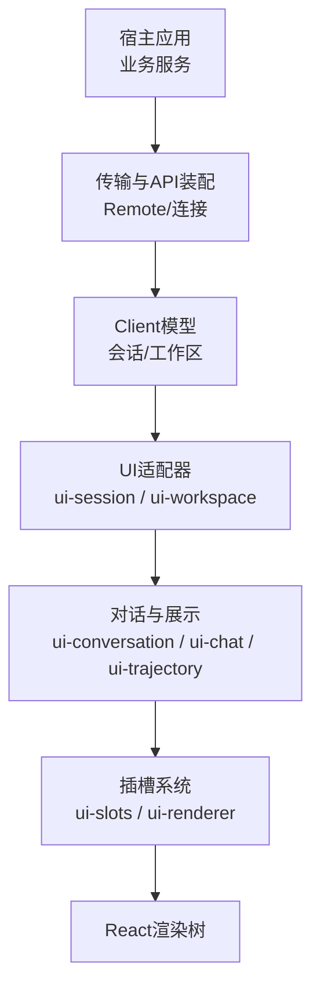
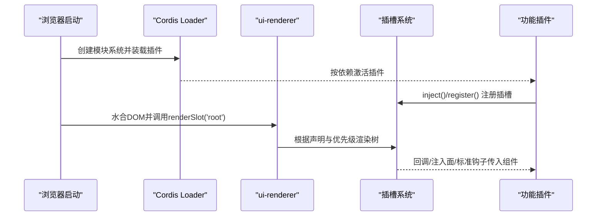
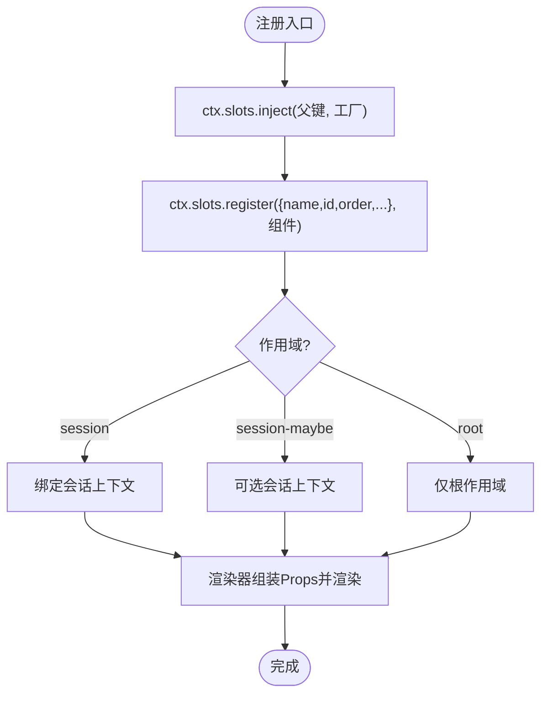
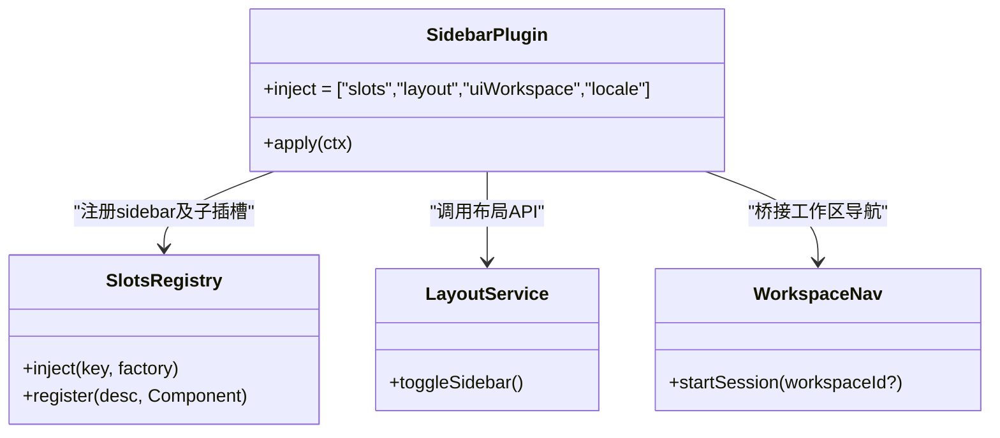
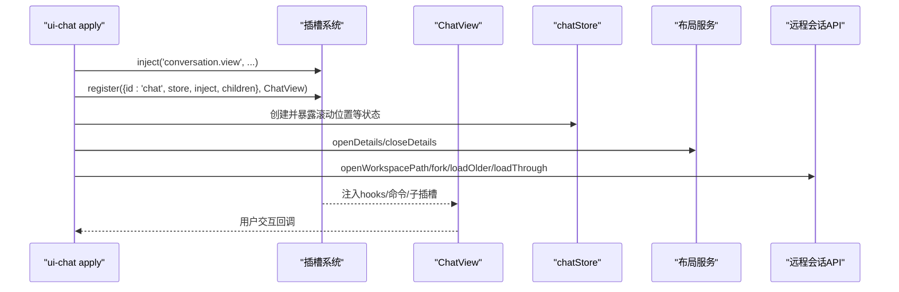
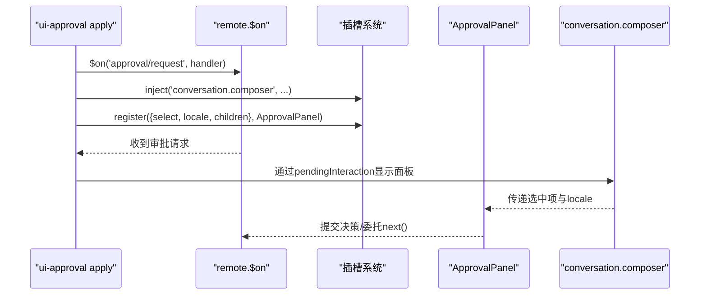
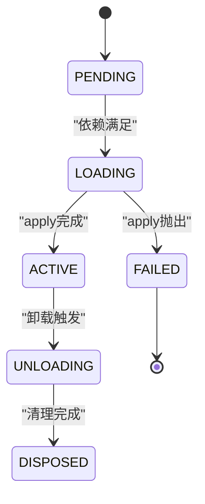
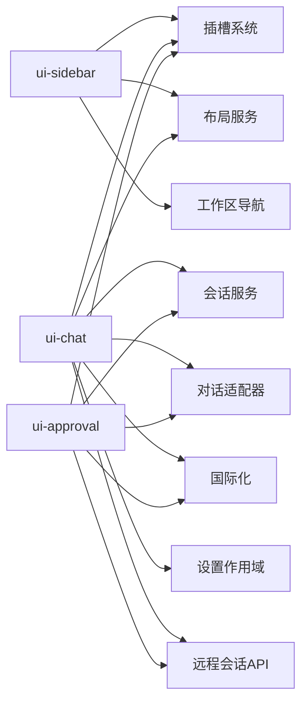

# UI插件开发

<cite>
**本文引用的文件**
- [slots.md](file://docs/subsystems/slots.md)
- [web-client.md](file://docs/subsystems/web-client.md)
- [web-styling.md](file://docs/web-styling.md)
- [01-first-plugin.md](file://docs/cordis-tutorial/01-first-plugin.md)
- [02-lifecycle-and-effects.md](file://docs/cordis-tutorial/02-lifecycle-and-effects.md)
- [index.ts（ui-sidebar）](file://packages/client/ui-sidebar/src/client/index.ts)
- [apply.ts（ui-chat）](file://packages/client/ui-chat/src/client/apply.ts)
- [index.ts（ui-approval）](file://packages/client/ui-approval/src/client/index.ts)
- [SKILL.md（插件开发技能）](file://packages/preset/agent-presets/presets/cordis/skills/cordis-plugin-development/SKILL.md)
</cite>

## 目录
1. [简介](#简介)
2. [项目结构](#项目结构)
3. [核心组件](#核心组件)
4. [架构总览](#架构总览)
5. [详细组件分析](#详细组件分析)
6. [依赖关系分析](#依赖关系分析)
7. [性能考虑](#性能考虑)
8. [故障排查指南](#故障排查指南)
9. [结论](#结论)
10. [附录](#附录)

## 简介
本指南面向需要在 Web 界面中扩展功能的开发者，聚焦于 UI 插件的开发方式与最佳实践。内容涵盖：
- 插槽系统的使用、组件注册与样式定制
- React 组件开发模式（结构、状态管理、事件处理）
- UI 插件生命周期（挂载、更新、卸载）
- 完整示例：自定义面板、对话框、工具栏组件
- 国际化支持与主题定制
- 性能优化与最佳实践

## 项目结构
Web 客户端由多个独立加载的插件组成，通过 Cordis 装配。UI 扩展的核心路径为：Host 状态 → Remote 传输 → Client 模型 → UI 适配器 → 会话/对话视图 → Slots 注册 → React 渲染。插槽是类型化的 React 组合系统，负责声明扩展点、组装组件输入并驱动渲染。

图表来源
- [web-client.md:8-18](file://docs/subsystems/web-client.md#L8-L18)
- [web-client.md:54-60](file://docs/subsystems/web-client.md#L54-L60)

章节来源
- [web-client.md:8-18](file://docs/subsystems/web-client.md#L8-L18)
- [web-client.md:20-30](file://docs/subsystems/web-client.md#L20-L30)
- [web-client.md:54-60](file://docs/subsystems/web-client.md#L54-L60)

## 核心组件
- 插槽系统与渲染器
  - 插槽提供类型化注册表、作用域、基数、注入面与标准钩子；渲染器绑定可观察源到 React hooks，维护上下文并渲染根树。
  - 组件通过 ctx.slots.inject() 在父级声明的生命周期内注册，避免跨包直接导入运行时值。
- 会话与工作区适配
  - ui-session 安装 session 作用域适配器，发布 useSessions/useSession 等标准钩子；ui-workspace 提供 useWorkspaces。
- 对话与目标视图
  - ui-conversation 将会话事件关联为目标快照；ui-chat 与 ui-trajectory 分别实现不同视图，并通过插槽暴露节点渲染点。
- 布局与主题
  - ui-layout 应用主题快照；ui-theme 拥有语义化 token、排版、动效、阴影与滚动条样式。

章节来源
- [slots.md:1-17](file://docs/subsystems/slots.md#L1-L17)
- [slots.md:44-95](file://docs/subsystems/slots.md#L44-L95)
- [web-client.md:8-18](file://docs/subsystems/web-client.md#L8-L18)
- [web-client.md:54-60](file://docs/subsystems/web-client.md#L54-L60)
- [web-styling.md:7-24](file://docs/web-styling.md#L7-L24)

## 架构总览
Web 启动后，模块系统预取立即项，挂载 Cordis Loader，创建图入口；ui-renderer 水合框架无关的引导 DOM，并调用唯一的上下文级 renderSlot('root') 操作。所有功能通过 slots.register() 贡献 UI，不直接引入其他功能包的运行时值。

图表来源
- [web-client.md:20-25](file://docs/subsystems/web-client.md#L20-L25)
- [web-client.md:54-60](file://docs/subsystems/web-client.md#L54-L60)
- [slots.md:9-17](file://docs/subsystems/slots.md#L9-L17)

## 详细组件分析

### 插槽系统与组件注册
- 声明与生命周期
  - SlotMap 是编译期注册表；运行时由拥有该位置的组件通过 children 声明子插槽。
  - 注册遵循 Cordis 效果生命周期；当所有者折叠时，其贡献被移除并递归折叠子插槽。
- 基数与作用域
  - single/list/keyed/chain 四种基数控制渲染策略；root/session-maybe/session 三种作用域决定 Session 绑定强度。
- 组件输入
  - 通过 PropsRuntime、PropsRenderSlots、PropsStore、InjectFace、PropsLocale 等派生类型获得 owner 值、子渲染器、共享状态、私有数据与本地化 t 函数。
- 当前层级
  - 已提供的插槽树包含 sidebar、conversation、details、shell.overlay 等区域，便于定位扩展点。

图表来源
- [slots.md:9-17](file://docs/subsystems/slots.md#L9-L17)
- [slots.md:44-75](file://docs/subsystems/slots.md#L44-L75)
- [slots.md:77-104](file://docs/subsystems/slots.md#L77-L104)
- [slots.md:106-166](file://docs/subsystems/slots.md#L106-L166)

章节来源
- [slots.md:9-17](file://docs/subsystems/slots.md#L9-L17)
- [slots.md:44-104](file://docs/subsystems/slots.md#L44-L104)
- [slots.md:106-176](file://docs/subsystems/slots.md#L106-L176)

### 侧边栏外壳（自定义面板示例）
- 职责：注册 sidebar 壳层，定义品牌标识、工作区列表、设置触发器等子插槽，并提供注入属性（如新建会话、切换侧边栏）。
- 关键点：使用 locale 命名空间提供文案；children 声明子插槽的基数与作用域；inject 返回组件所需能力。

图表来源
- [index.ts（ui-sidebar）:1-68](file://packages/client/ui-sidebar/src/client/index.ts#L1-L68)

章节来源
- [index.ts（ui-sidebar）:1-68](file://packages/client/ui-sidebar/src/client/index.ts#L1-L68)

### 聊天视图（自定义工具栏/详情面板示例）
- 职责：注册 conversation.view 视图、聊天节点渲染器、统计行、详情面板；提供注入面以打开详情、打开文件、加载历史、图片预览、分叉会话等。
- 关键点：通过 uiSession.provide 提供 chat 钩子；使用 store 管理滚动位置等视图状态；通过 inject 暴露命令式能力给组件。

图表来源
- [apply.ts（ui-chat）:1-171](file://packages/client/ui-chat/src/client/apply.ts#L1-L171)

章节来源
- [apply.ts（ui-chat）:1-171](file://packages/client/ui-chat/src/client/apply.ts#L1-L171)

### 审批对话框（自定义对话框示例）
- 职责：监听 approval/request 事件，注册 pending interaction，并在 composer 插槽中以 chain 选择器呈现审批面板；提供 detail 插槽用于展示细节。
- 关键点：使用 select 从 pendingInteraction 中选择匹配项；locale 命名空间提供文案；通过 remote.$on 订阅会话范围的水流事件。

图表来源
- [index.ts（ui-approval）:1-94](file://packages/client/ui-approval/src/client/index.ts#L1-L94)

章节来源
- [index.ts（ui-approval）:1-94](file://packages/client/ui-approval/src/client/index.ts#L1-L94)

### React 组件开发模式
- 组件结构
  - 通过 slots.register 将组件挂载到指定插槽；使用 props 派生类型获取 owner 值、store、注入能力与本地化 t。
- 状态管理
  - 视图状态使用注册的 store；业务状态保留在宿主服务或 Client 模型中；通过 hooks 对象暴露可观察源。
- 事件处理
  - 通过注入的回调（如 openDetails、openFile、forkAt）与远程 API 交互；避免在组件中直接持有 ctx。

章节来源
- [slots.md:60-104](file://docs/subsystems/slots.md#L60-L104)
- [apply.ts（ui-chat）:106-169](file://packages/client/ui-chat/src/client/apply.ts#L106-L169)

### 插件生命周期（挂载、更新、卸载）
- 插件形态
  - 函数插件、对象插件、类插件；apply(ctx) 是统一入口。
- 效果与清理
  - 外部资源需包裹在 ctx.effect() 中，返回清理函数；Cordis 在卸载时按逆序执行清理。
- Fiber 状态机
  - PENDING → LOADING → ACTIVE → UNLOADING → DISPOSED；失败分支进入 FAILED。

图表来源
- [02-lifecycle-and-effects.md:68-82](file://docs/cordis-tutorial/02-lifecycle-and-effects.md#L68-L82)

章节来源
- [01-first-plugin.md:1-96](file://docs/cordis-tutorial/01-first-plugin.md#L1-L96)
- [02-lifecycle-and-effects.md:1-99](file://docs/cordis-tutorial/02-lifecycle-and-effects.md#L1-L99)

### 国际化支持
- 命名空间与字典
  - 各插件通过 ctx.locale.register(NS, { zh, en }) 注册文案；插槽注册时可指定 locale 命名空间，使组件获得 t 函数。
- 语言偏好与持久化
  - 通过 settingsScope 绑定设置命名空间，提供语言切换与持久化；LocaleRuntime 负责活跃语言与版本变更。

章节来源
- [index.ts（ui-sidebar）:26-41](file://packages/client/ui-sidebar/src/client/index.ts#L26-L41)
- [apply.ts（ui-chat）:75-92](file://packages/client/ui-chat/src/client/apply.ts#L75-L92)
- [index.ts（ui-approval）:71-89](file://packages/client/ui-approval/src/client/index.ts#L71-L89)

### 主题与样式定制
- 所有权与规则
  - ui-theme 拥有静态刻度、语义别名、排版、动效、阴影与滚动条样式；ui-layout 应用主题快照。
  - 组件样式应使用 CSS Modules 与 clsx，消费 --dsw-alias-* 语义 token；避免在组件中定义全局主题。
- 表面与边框
  - 提升表面使用 box-shadow 与 hairline stroke；中性边框使用 0.5px；点击链接使用 --dsw-alias-link 与特定下划线行为。

章节来源
- [web-styling.md:7-24](file://docs/web-styling.md#L7-L24)

## 依赖关系分析
- 插件间耦合
  - 功能插件之间仅允许 import type 引用声明合并；运行时依赖通过注入的 Cordis 服务与插槽进行解耦。
- 关键依赖链
  - ui-sidebar 依赖 slots/layout/uiWorkspace/locale；ui-chat 依赖 slots/sessions/uiSession/uiConversation/layout/locale/settingsScope/remote；ui-approval 依赖 sessions/remote/uiSession/slots/locale。

图表来源
- [index.ts（ui-sidebar）:1-68](file://packages/client/ui-sidebar/src/client/index.ts#L1-L68)
- [apply.ts（ui-chat）:1-171](file://packages/client/ui-chat/src/client/apply.ts#L1-L171)
- [index.ts（ui-approval）:1-94](file://packages/client/ui-approval/src/client/index.ts#L1-L94)

章节来源
- [web-client.md:84-95](file://docs/subsystems/web-client.md#L84-L95)
- [index.ts（ui-sidebar）:1-68](file://packages/client/ui-sidebar/src/client/index.ts#L1-L68)
- [apply.ts（ui-chat）:1-171](file://packages/client/ui-chat/src/client/apply.ts#L1-L171)
- [index.ts（ui-approval）:1-94](file://packages/client/ui-approval/src/client/index.ts#L1-L94)

## 性能考虑
- 可观察源稳定性
  - 保持 observable source 与 snapshot 身份稳定，变化时通过同一源重新发布，避免不必要的重渲染。
- 插槽与选择器
  - 合理使用基数与选择器（chain/select），减少无效渲染；single 与占用的 keyed cell 视为替换点，list id 或未占用 key 用于增量扩展。
- 副作用管理
  - 所有副作用必须通过 ctx.effect() 管理，确保卸载时正确清理；避免在模块作用域或 apply 外创建进程/页面级副作用。
- 主题与样式
  - 使用语义 token 与 CSS Modules，避免在组件中硬编码颜色或主题分支；利用共享滚动条与阴影规范，减少重复样式。

章节来源
- [slots.md:168-176](file://docs/subsystems/slots.md#L168-L176)
- [SKILL.md:127-193](file://packages/preset/agent-presets/presets/cordis/skills/cordis-plugin-development/SKILL.md#L127-L193)
- [web-styling.md:13-24](file://docs/web-styling.md#L13-L24)

## 故障排查指南
- 插件未生效
  - 检查 cordis.yml 配置是否正确解析；确认插件名称拼写与模块路径；查看 Cordis 日志输出。
- 插槽未渲染
  - 确认父级是否声明了对应子插槽；检查注册时的 name/id/order/scope 是否与声明一致；验证 select 返回值是否符合预期。
- 生命周期问题
  - 若插件处于 PENDING，检查依赖服务是否可用；确认 effect 清理函数是否正确释放资源；异步清理需在同一 disposer 内顺序执行。
- 样式异常
  - 避免在组件中覆盖全局主题；使用 --dsw-alias-* 语义 token；确保提升表面与边框符合 ui-theme 规范。

章节来源
- [01-first-plugin.md:79-92](file://docs/cordis-tutorial/01-first-plugin.md#L79-L92)
- [02-lifecycle-and-effects.md:62-95](file://docs/cordis-tutorial/02-lifecycle-and-effects.md#L62-L95)
- [slots.md:168-176](file://docs/subsystems/slots.md#L168-L176)
- [web-styling.md:13-24](file://docs/web-styling.md#L13-L24)

## 结论
通过插槽系统与 Cordis 生命周期机制，UI 插件可以安全、类型化地扩展 Web 界面。遵循“声明即契约”的原则，结合会话/工作区适配器、对话视图与主题体系，能够构建出可维护、可扩展且高性能的 UI 插件。实践中应重视副作用管理、可观察源稳定性与样式规范，以确保插件在不同环境与版本下的稳定性。

## 附录
- 快速参考
  - 插槽层级与扩展点：见插槽文档中的当前层级图。
  - 插件生命周期：函数/对象/类插件与 effect/fiber 状态机。
  - 主题与样式：ui-theme 与 ui-layout 的职责边界与组件规则。

[本节为概念性总结，无需列出具体文件来源]