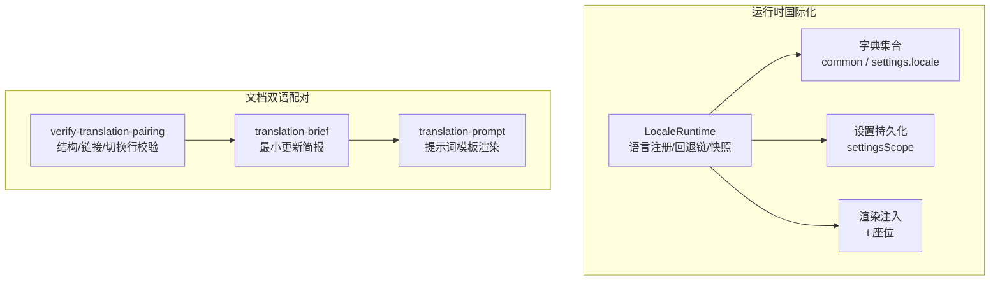
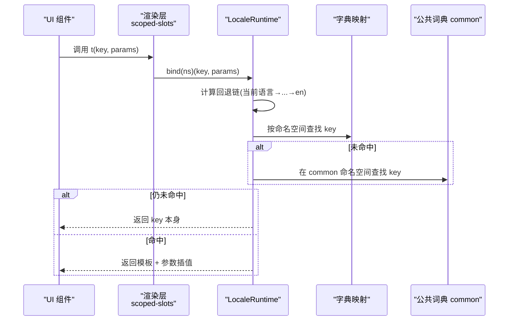
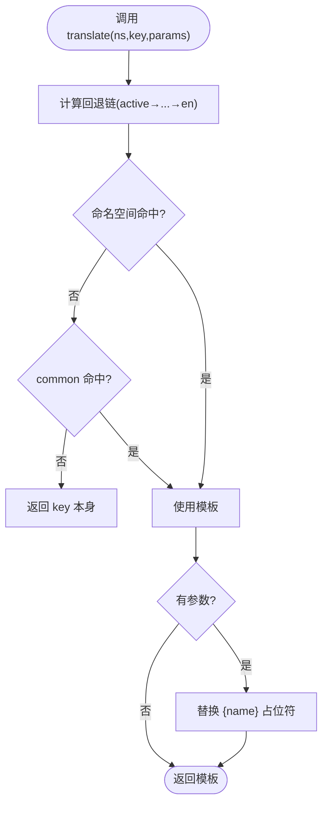
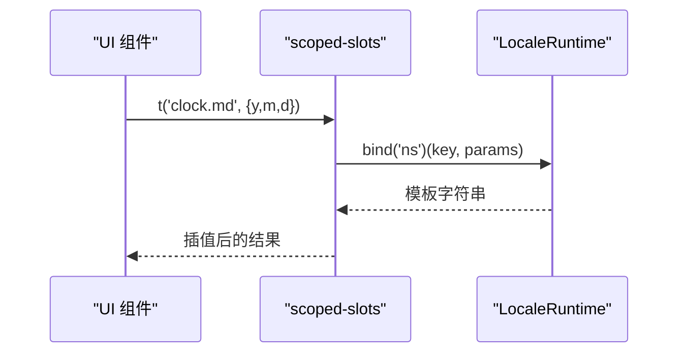
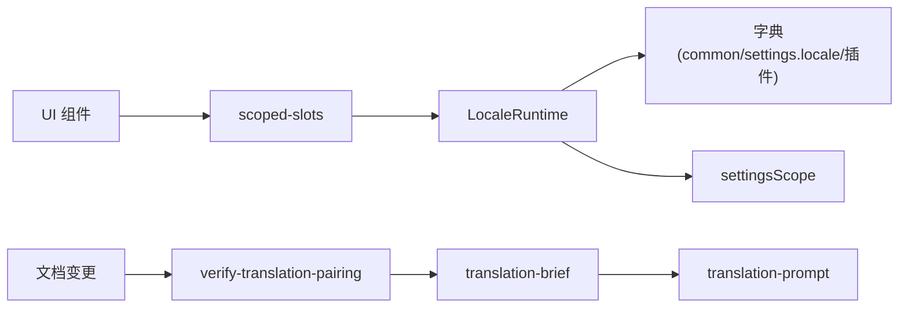

# 国际化支持

<cite>
**本文引用的文件**
- [packages/client/locale/src/client/index.ts](file://packages/client/locale/src/client/index.ts)
- [packages/client/locale/src/locales/index.ts](file://packages/client/locale/src/locales/index.ts)
- [packages/client/locale/src/locales/en.ts](file://packages/client/locale/src/locales/en.ts)
- [packages/client/locale/src/locales/zh.ts](file://packages/client/locale/src/locales/zh.ts)
- [packages/test-support/client-runtime/src/translate.ts](file://packages/test-support/client-runtime/src/translate.ts)
- [packages/client/ui-renderer/src/client/scoped-slots.tsx](file://packages/client/ui-renderer/src/client/scoped-slots.tsx)
- [packages/client/ui-chat/src/client/chat/message-chrome.ts](file://packages/client/ui-chat/src/client/chat/message-chrome.ts)
- [scripts/translation-brief.ts](file://scripts/translation-brief.ts)
- [scripts/verify-translation-pairing.ts](file://scripts/verify-translation-pairing.ts)
- [scripts/translation-prompt.ts](file://scripts/translation-prompt.ts)
- [docs/i18n/README.md](file://docs/i18n/README.md)
- [docs/i18n/translation-rules.md](file://docs/i18n/translation-rules.md)
- [docs/i18n/terminology.md](file://docs/i18n/terminology.md)
</cite>

## 目录
1. [简介](#简介)
2. [项目结构](#项目结构)
3. [核心组件](#核心组件)
4. [架构总览](#架构总览)
5. [详细组件分析](#详细组件分析)
6. [依赖关系分析](#依赖关系分析)
7. [性能考虑](#性能考虑)
8. [故障排查指南](#故障排查指南)
9. [结论](#结论)
10. [附录](#附录)

## 简介
本文件系统性说明 DeepSeek Harness 的国际化（i18n）能力与文档双语配对机制，覆盖运行时多语言加载、UI 插件中的文本提取与翻译键管理、日期/时间/数字/货币本地化实践、RTL 支持与布局适配建议、最佳实践、翻译工作流与自动化质量门禁。目标是让开发者在不深入源码的情况下也能正确实现与维护多语言体验。

## 项目结构
仓库将“运行时国际化”和“文档双语配对”两件事解耦：
- 运行时国际化：由客户端 locale 包提供语言注册、字典合并、回退链解析、设置持久化、渲染注入等能力。
- 文档双语配对：通过 docs/i18n 规则与脚本校验中英文文档的结构一致性、链接与切换行，确保内容对齐与可维护性。

图表来源
- [packages/client/locale/src/client/index.ts:162-494](file://packages/client/locale/src/client/index.ts#L162-L494)
- [scripts/verify-translation-pairing.ts:1-358](file://scripts/verify-translation-pairing.ts#L1-L358)
- [scripts/translation-brief.ts:1-513](file://scripts/translation-brief.ts#L1-L513)
- [scripts/translation-prompt.ts:112-259](file://scripts/translation-prompt.ts#L112-L259)

章节来源
- [docs/i18n/README.md:1-61](file://docs/i18n/README.md#L1-L61)
- [docs/i18n/translation-rules.md:1-70](file://docs/i18n/translation-rules.md#L1-L70)

## 核心组件
- LocaleRuntime：运行时语言中心，负责语言注册、字典合并、回退链计算、活跃语言选择、快照发布与订阅、设置持久化、浏览器语言检测与 html lang 同步。
- 字典与命名空间：common（跨功能通用词汇）、settings.locale（语言设置行文案），以及各插件按命名空间注册自己的字典。
- 渲染注入：ui-renderer 将 LocaleFace 暴露为 t 座位，供 UI 组件以命名空间绑定获取翻译函数。
- 测试辅助：makeTranslate 模拟真实回退链与占位符插值，便于单测。
- 文档配对工具：verify-translation-pairing 强制双语配对完整性与结构一致性；translation-brief 生成最小更新简报；translation-prompt 渲染提示词模板并校验占位符与响应格式。

章节来源
- [packages/client/locale/src/client/index.ts:162-494](file://packages/client/locale/src/client/index.ts#L162-L494)
- [packages/client/locale/src/locales/index.ts:1-9](file://packages/client/locale/src/locales/index.ts#L1-L9)
- [packages/client/locale/src/locales/en.ts:1-45](file://packages/client/locale/src/locales/en.ts#L1-L45)
- [packages/client/locale/src/locales/zh.ts:1-46](file://packages/client/locale/src/locales/zh.ts#L1-L46)
- [packages/test-support/client-runtime/src/translate.ts:1-32](file://packages/test-support/client-runtime/src/translate.ts#L1-L32)
- [packages/client/ui-renderer/src/client/scoped-slots.tsx:235-275](file://packages/client/ui-renderer/src/client/scoped-slots.tsx#L235-L275)

## 架构总览
下图展示从 UI 调用到最终字符串返回的关键路径，包括命名空间查找、回退链、公共词典与 key 自身回退。

图表来源
- [packages/client/ui-renderer/src/client/scoped-slots.tsx:235-275](file://packages/client/ui-renderer/src/client/scoped-slots.tsx#L235-L275)
- [packages/client/locale/src/client/index.ts:447-464](file://packages/client/locale/src/client/index.ts#L447-L464)

章节来源
- [packages/client/locale/src/client/index.ts:447-464](file://packages/client/locale/src/client/index.ts#L447-L464)

## 详细组件分析

### 运行时国际化：LocaleRuntime
- 语言注册与回退链
  - addLanguage 接收 id、label、fallback，校验 BCP 47 标签、非空 label、无环且必须落到 en。
  - fallbackChain 缓存每语言的完整回退链，缺失时直接跳到 en。
- 字典注册与命名空间
  - register 支持批量注册或单语言注册，同一 (ns, locale) 仅允许一次拥有者。
  - 查找顺序：当前命名空间 → common 命名空间 → key 本身。
- 偏好与持久化
  - setLocale 写入持久化设置，并在宿主可用时采用已保存的选择。
  - getSnapshot/subscribe 提供不可变快照与变更通知，驱动 UI 刷新。
- 浏览器语言与文档语言
  - detectBrowserLocale 根据 navigator.languages/language 匹配已注册语言。
  - syncDocumentLanguage 将 <html lang> 设置为 zh-CN 或 active 语言。

图表来源
- [packages/client/locale/src/client/index.ts:447-464](file://packages/client/locale/src/client/index.ts#L447-L464)
- [packages/client/locale/src/client/index.ts:336-356](file://packages/client/locale/src/client/index.ts#L336-L356)

章节来源
- [packages/client/locale/src/client/index.ts:124-150](file://packages/client/locale/src/client/index.ts#L124-L150)
- [packages/client/locale/src/client/index.ts:244-278](file://packages/client/locale/src/client/index.ts#L244-L278)
- [packages/client/locale/src/client/index.ts:314-356](file://packages/client/locale/src/client/index.ts#L314-L356)
- [packages/client/locale/src/client/index.ts:358-418](file://packages/client/locale/src/client/index.ts#L358-L418)
- [packages/client/locale/src/client/index.ts:447-494](file://packages/client/locale/src/client/index.ts#L447-L494)
- [packages/client/locale/src/client/index.ts:504-528](file://packages/client/locale/src/client/index.ts#L504-L528)

### 字典组织与类型安全
- 公共词典 common：zh 作为键集真源，en 必须与其完全一致，编译期保证双语平衡。
- 设置项词典 settings.locale：语言设置行的文案。
- 插件可按命名空间扩展字典，并通过 bind(ns) 获得类型安全的翻译函数。

章节来源
- [packages/client/locale/src/locales/index.ts:1-9](file://packages/client/locale/src/locales/index.ts#L1-L9)
- [packages/client/locale/src/locales/en.ts:1-45](file://packages/client/locale/src/locales/en.ts#L1-L45)
- [packages/client/locale/src/locales/zh.ts:1-46](file://packages/client/locale/src/locales/zh.ts#L1-L46)

### UI 插件中的多语言集成
- 渲染层注入：scoped-slots 将 LocaleFace 暴露为 t 座位，按命名空间绑定并缓存，避免重复订阅。
- 组件用法：通过 t('key', { name }) 获取带参数的本地化字符串，推荐用占位符而非拼接。
- 示例：消息时钟格式化通过传入的 t 获取日期模板，再组合时间，体现“数据与展示分离”。

图表来源
- [packages/client/ui-renderer/src/client/scoped-slots.tsx:235-275](file://packages/client/ui-renderer/src/client/scoped-slots.tsx#L235-L275)
- [packages/client/ui-chat/src/client/chat/message-chrome.ts:72-96](file://packages/client/ui-chat/src/client/chat/message-chrome.ts#L72-L96)

章节来源
- [packages/client/ui-renderer/src/client/scoped-slots.tsx:235-275](file://packages/client/ui-renderer/src/client/scoped-slots.tsx#L235-L275)
- [packages/client/ui-chat/src/client/chat/message-chrome.ts:72-96](file://packages/client/ui-chat/src/client/chat/message-chrome.ts#L72-L96)

### 日期、时间、数字与货币的本地化
- 日期/时间：优先使用 Intl.DateTimeFormat 进行本地化输出；在需要精确时区偏移的场景，可通过 formatToParts 解析字段与偏移。
- 数字/货币：建议使用 Intl.NumberFormat 进行千分位、小数、货币符号与区域格式化处理。
- 策略：业务侧只持有原始数值与时区，格式化逻辑集中在本地化工具中，UI 通过 t 获取模板片段（如日期模板）并与时间组合显示。

章节来源
- [packages/schedule/schedule/src/domain.ts:301-367](file://packages/schedule/schedule/src/domain.ts#L301-L367)
- [packages/client/ui-chat/src/client/chat/message-chrome.ts:72-96](file://packages/client/ui-chat/src/client/chat/message-chrome.ts#L72-L96)

### RTL（从右到左）语言的支持与布局适配
- 当前实现将 <html lang> 设置为 zh-CN 或 active 语言，未内置方向检测。
- 建议做法：
  - 在语言定义中增加 direction 元信息，应用启动时根据 active 语言设置 document.dir = 'rtl'/'ltr'。
  - CSS 使用逻辑属性（margin-inline-start/end、padding-inline-*、text-align: start/end）替代物理左右边距，使布局自动适配方向。
  - 图标与箭头类资源提供镜像版本或使用 CSS transform: scaleX(-1) 翻转。
  - 表格、列表、导航等复杂布局需回归验证 RTL 下的可读性与交互。

[本节为概念性指导，不直接分析具体文件]

### 最佳实践
- 避免字符串拼接：统一使用占位符 {name}，保持语序灵活与复数/性别变化空间。
- 上下文相关翻译：为不同场景拆分键（如 copy.json vs copy.value），避免歧义。
- 命名空间隔离：每个功能域独立命名空间，公共词放入 common。
- 键集真源：中文优先约定下，以 zh 的键集为准，en 必须与之完全一致。
- 回退链设计：新增语言必须声明有效回退链，最终落到 en，避免孤立语言。
- 测试：使用 makeTranslate 构造轻量翻译桩，覆盖回退链与插值路径。

章节来源
- [packages/test-support/client-runtime/src/translate.ts:1-32](file://packages/test-support/client-runtime/src/translate.ts#L1-L32)
- [packages/client/locale/src/client/index.ts:447-464](file://packages/client/locale/src/client/index.ts#L447-L464)

### 翻译工作流程与团队协作
- 配对契约：每个文档以 .md、.zh.md 与 .i18n.yaml 三件套合并提交，保持结构签名一致。
- 质量门禁：verify-translation-pairing 检查成对存在、blob 哈希一致、语言切换行、相对链接目标、生成区域一致性、结构签名（标题层级、代码块、表格行列、列表种类与数量）。
- 最小更新：当变更仅发生在围栏代码块内，可直接机械复制；否则基于单元/章节粒度生成简报，指引最小必要编辑。
- 术语表：terminology.md 为术语权威来源，首次出现标注与禁止译法约束双方。
- 提示词与校验：translation-prompt 渲染模板并校验占位符与三段式响应格式，保障自动化流程稳定。

章节来源
- [docs/i18n/README.md:1-61](file://docs/i18n/README.md#L1-L61)
- [docs/i18n/translation-rules.md:1-70](file://docs/i18n/translation-rules.md#L1-L70)
- [docs/i18n/terminology.md:1-215](file://docs/i18n/terminology.md#L1-L215)
- [scripts/verify-translation-pairing.ts:1-358](file://scripts/verify-translation-pairing.ts#L1-L358)
- [scripts/translation-brief.ts:1-513](file://scripts/translation-brief.ts#L1-L513)
- [scripts/translation-prompt.ts:112-259](file://scripts/translation-prompt.ts#L112-L259)

## 依赖关系分析
- 运行时依赖
  - ui-renderer 依赖 LocaleFace 暴露的 bind/getSnapshot/subscribe，用于合成 t 座位。
  - locale 包依赖 settingsScope 持久化用户语言偏好，并注入 LanguageRow 到设置界面。
  - 字典模块以 zh 为键集真源，en 通过类型断言保证键集一致。
- 文档工具依赖
  - verify-translation-pairing 依赖 translation-pairing 系列工具解析 Markdown、计算结构签名、校验链接与切换行。
  - translation-brief 基于上次确认的 blob 哈希与当前差异，生成最小更新简报。
  - translation-prompt 渲染提示词模板，校验占位符与三段式响应。

图表来源
- [packages/client/ui-renderer/src/client/scoped-slots.tsx:235-275](file://packages/client/ui-renderer/src/client/scoped-slots.tsx#L235-L275)
- [packages/client/locale/src/client/index.ts:539-583](file://packages/client/locale/src/client/index.ts#L539-L583)
- [scripts/verify-translation-pairing.ts:1-358](file://scripts/verify-translation-pairing.ts#L1-L358)
- [scripts/translation-brief.ts:1-513](file://scripts/translation-brief.ts#L1-L513)
- [scripts/translation-prompt.ts:112-259](file://scripts/translation-prompt.ts#L112-L259)

章节来源
- [packages/client/locale/src/client/index.ts:539-583](file://packages/client/locale/src/client/index.ts#L539-L583)
- [scripts/verify-translation-pairing.ts:1-358](file://scripts/verify-translation-pairing.ts#L1-L358)

## 性能考虑
- 回退链缓存：fallbackChain 对每语言的回退链进行缓存，避免重复计算。
- 绑定函数复用：bind(ns) 返回稳定的翻译函数引用，减少订阅与重建成本。
- 渲染层缓存：scoped-slots 按 face+namespace 缓存 t 函数与订阅，避免每次渲染重绑。
- 事件节流：字典注册仅提升 revision，不触发 locale/change 事件风暴，降低重渲染压力。
- 文档校验：结构化签名与生成区域比对仅在必要时执行，配合 --list/--write 精准范围扫描。

章节来源
- [packages/client/locale/src/client/index.ts:336-356](file://packages/client/locale/src/client/index.ts#L336-L356)
- [packages/client/locale/src/client/index.ts:420-445](file://packages/client/locale/src/client/index.ts#L420-L445)
- [packages/client/ui-renderer/src/client/scoped-slots.tsx:235-275](file://packages/client/ui-renderer/src/client/scoped-slots.tsx#L235-L275)
- [scripts/verify-translation-pairing.ts:103-125](file://scripts/verify-translation-pairing.ts#L103-L125)

## 故障排查指南
- 语言未生效
  - 检查是否已通过 addLanguage 注册语言且回退链完整；setLocale 是否成功写入设置。
  - 确认浏览器语言列表与已注册语言匹配；html lang 是否正确同步。
- 翻译键缺失
  - 若命名空间未命中，会回退到 common；仍缺失则返回 key 本身。请核对命名空间与键名。
  - 使用 makeTranslate 在单测中快速验证回退链行为。
- 文档配对失败
  - verify-translation-pairing 报告 out-of-sync 或 missing：检查 .i18n.yaml 哈希、语言切换行、相对链接目标、结构签名。
  - 对于仅代码块变更，可使用最小更新简报机械替换；否则按单元/章节最小化编辑。
- 提示词错误
  - translation-prompt 校验模板占位符与三段式响应；若报错，检查模板与模型输出格式。

章节来源
- [packages/client/locale/src/client/index.ts:236-242](file://packages/client/locale/src/client/index.ts#L236-L242)
- [packages/client/locale/src/client/index.ts:447-464](file://packages/client/locale/src/client/index.ts#L447-L464)
- [packages/test-support/client-runtime/src/translate.ts:1-32](file://packages/test-support/client-runtime/src/translate.ts#L1-L32)
- [scripts/verify-translation-pairing.ts:185-329](file://scripts/verify-translation-pairing.ts#L185-L329)
- [scripts/translation-prompt.ts:112-259](file://scripts/translation-prompt.ts#L112-L259)

## 结论
DeepSeek Harness 的国际化体系以 LocaleRuntime 为核心，结合命名空间与回退链实现可扩展、类型安全的多语言支持；通过 ui-renderer 注入 t 座位简化 UI 集成。文档双语配对则以严格的契约与自动化门禁保障内容一致性。遵循本文的最佳实践与工作流，可在保证质量的前提下高效推进多语言与国际化演进。

## 附录
- 术语与风格：参考 terminology.md 与 translation-rules.md，确保术语一致与行文规范。
- 常用命令
  - 运行文档配对校验：pnpm run verify-translation-pairing
  - 列出配对状态：pnpm run verify-translation-pairing --list
  - 记录确认的配对：pnpm run verify-translation-pairing --write <pair>
  - 生成最小更新简报：scripts/gen-translation-brief.ts（见 translation-brief.ts）

章节来源
- [docs/i18n/README.md:24-61](file://docs/i18n/README.md#L24-L61)
- [scripts/translation-brief.ts:448-513](file://scripts/translation-brief.ts#L448-L513)
- [scripts/verify-translation-pairing.ts:147-179](file://scripts/verify-translation-pairing.ts#L147-L179)