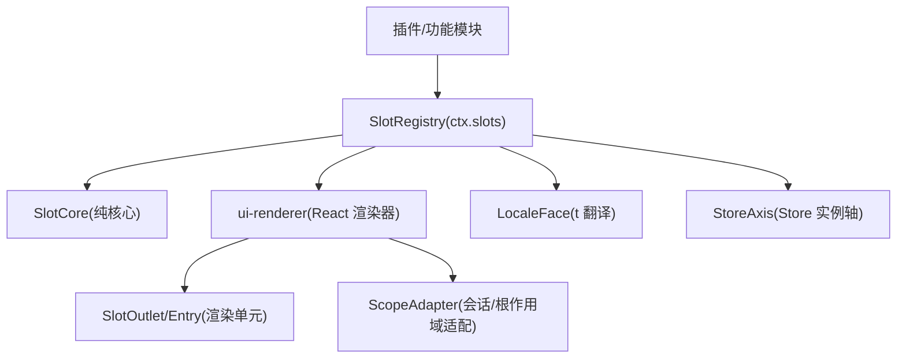
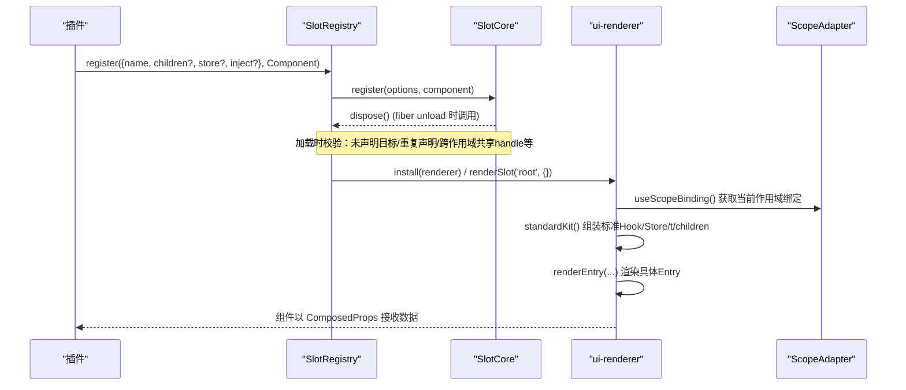
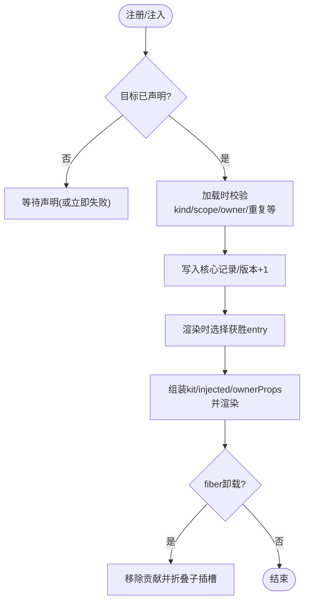
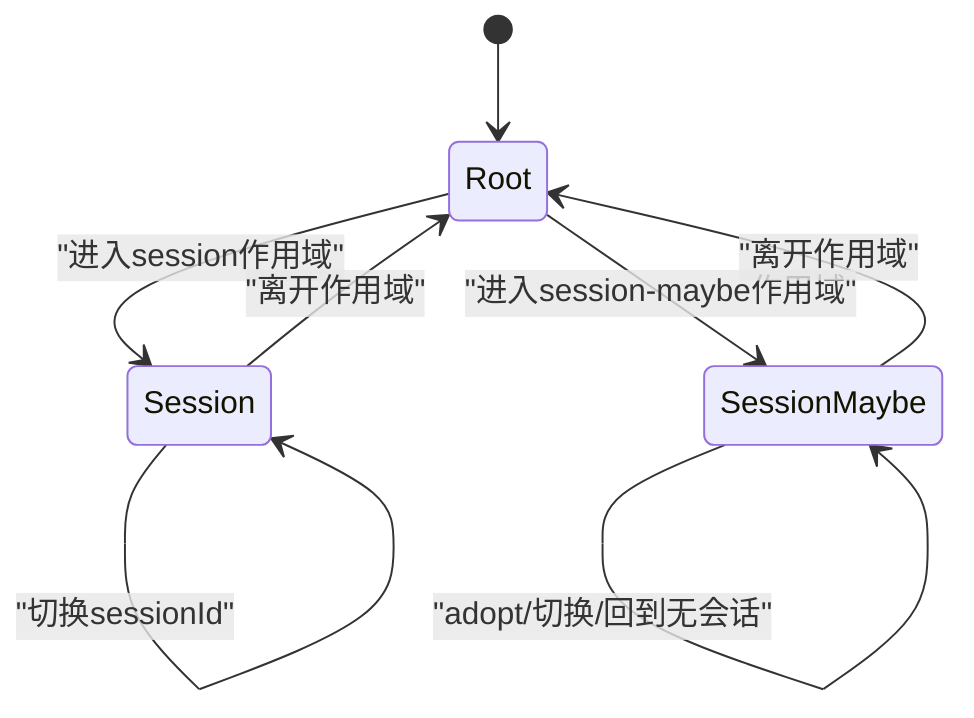
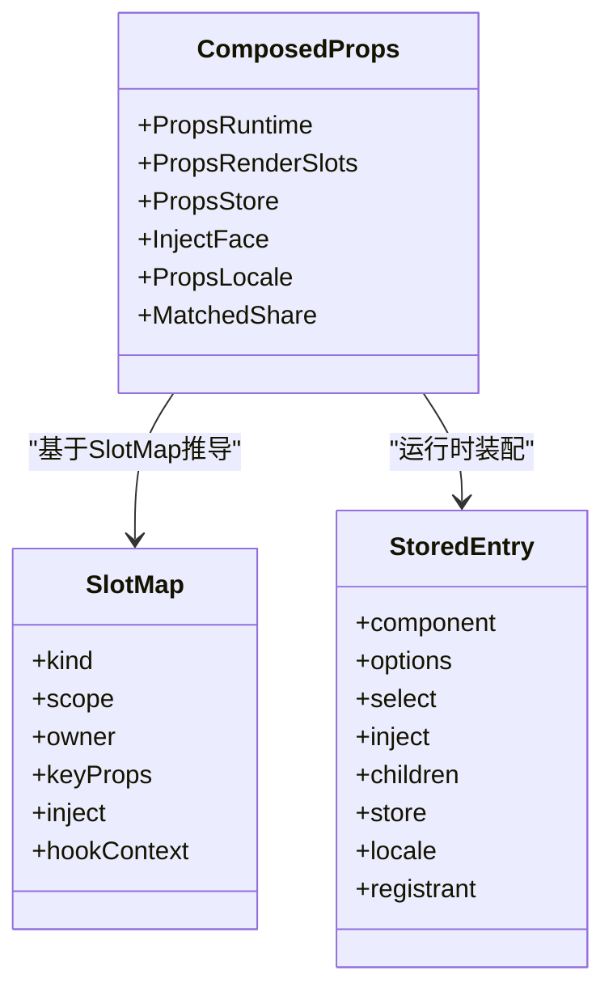
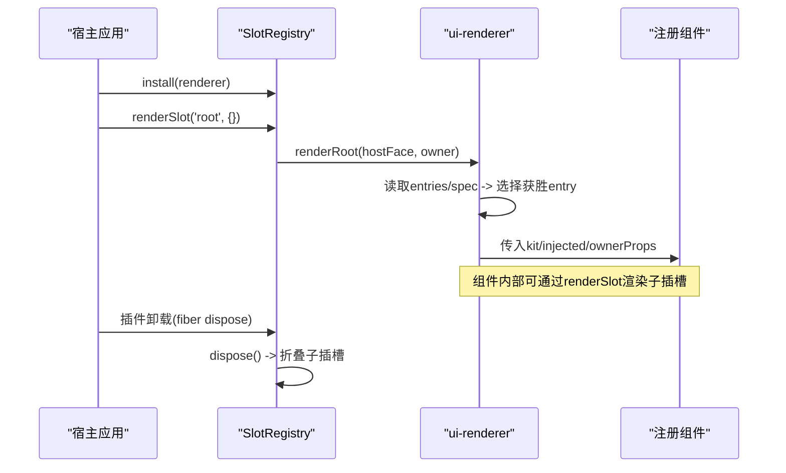
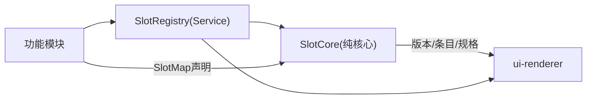

# 插槽系统

<cite>
**本文引用的文件**
- [slots.md](file://docs/subsystems/slots.md)
- [scoped-slots.tsx](file://packages/client/ui-renderer/src/client/scoped-slots.tsx)
- [registry.ts](file://packages/client/ui-renderer/src/client/registry.ts)
- [index.ts](file://packages/client/ui-slots/src/index.ts)
- [guard.ts](file://packages/extensions/cordis-client-runner/src/client/guard.ts)
- [providers.ts](file://packages/extensions/cordis-client-runner/src/client/providers.ts)
- [gen-client-catalog.spec.ts](file://scripts/gen-client-catalog.spec.ts)
- [slot-walk.ts](file://scripts/slot-walk.ts)
- [slots.ts](file://packages/client/ui-conversation/src/client/contract/slots.ts)
</cite>

## 目录
1. [简介](#简介)
2. [项目结构](#项目结构)
3. [核心组件](#核心组件)
4. [架构总览](#架构总览)
5. [详细组件分析](#详细组件分析)
6. [依赖关系分析](#依赖关系分析)
7. [性能考量](#性能考量)
8. [故障排查指南](#故障排查指南)
9. [结论](#结论)
10. [附录：使用示例与最佳实践](#附录使用示例与最佳实践)

## 简介
本文件系统性地阐述 Web 客户端的插槽（Slot）体系：从声明、注册、挂载生命周期到 Props 传递模式；区分标准插槽与自定义插槽；说明如何扩展新的插槽位置；解释类型安全机制（Props 类型定义与验证规则）；提供根级、会话级和功能模块级的完整使用示例；并总结性能优化策略、与 React 组件树的集成方式，以及动态加载与卸载的处理。

## 项目结构
插槽系统由“纯核心 + 运行时服务 + React 渲染器”三层组成：
- 纯核心：负责声明合并、注册语义、生命周期与校验（无 Cordis 事件）。
- 运行时服务：桥接 Cordis 上下文、安装渲染器、管理 Store 实例轴、暴露 ctx.slots API。
- React 渲染器：将可观察源绑定为 Hook，渲染树，维护错误边界与隔离。

图表来源
- [registry.ts:95-155](file://packages/client/ui-renderer/src/client/registry.ts#L95-L155)
- [scoped-slots.tsx:694-799](file://packages/client/ui-renderer/src/client/scoped-slots.tsx#L694-L799)
- [index.ts:709-735](file://packages/client/ui-slots/src/index.ts#L709-L735)

章节来源
- [slots.md:1-17](file://docs/subsystems/slots.md#L1-L17)
- [registry.ts:1-11](file://packages/client/ui-renderer/src/client/registry.ts#L1-L11)

## 核心组件
- SlotMap：编译期插槽契约表，通过 declare module 合并扩展。每个键描述 kind、scope、owner props、keyProps、inject、hookContext 等。
- SlotCore：纯核心，维护每个 key 的记录、版本、条目、声明 epoch、abdicated 集合、订阅与变更通知。
- SlotRegistry：Cordis Service 层，封装 register/inject/install/renderSlot/provideRoot/installScope/bindStoreScope 等能力，管理 Store 实例轴与 locale 面。
- ui-renderer 渲染器：实现 SlotRendererHost，将标准源与注入面绑定为 Hook/Props，按 scope 渲染 Root/Session/SessionMaybe 入口，并提供错误边界与锚点。

章节来源
- [index.ts:25-124](file://packages/client/ui-slots/src/index.ts#L25-L124)
- [index.ts:709-735](file://packages/client/ui-slots/src/index.ts#L709-L735)
- [registry.ts:95-155](file://packages/client/ui-renderer/src/client/registry.ts#L95-L155)
- [scoped-slots.tsx:1-18](file://packages/client/ui-renderer/src/client/scoped-slots.tsx#L1-L18)

## 架构总览
插槽系统的职责分层清晰：
- 声明与注册：SlotMap 定义契约，register 同时声明子插槽、store 座位、inject 业务面，并进行加载时校验。
- 作用域与数据：root/session/session-maybe 三种作用域决定标准 Hook/Props 的可用性与严格性。
- 渲染与装配：渲染器根据 spec(kind/scope) 选择 Outlet 分支，组装 kit（标准 Hook）、injected（注册项 inject）、slotInject（插槽级 inject）、ownerProps，最终调用组件。
- 生命周期：注册项随 Cordis fiber 生命周期卸载；声明被替换会触发 injection 重新执行；Store 实例按 handle x scope key 管理，会话作用域在 scope 死亡时清理持久化状态。

图表来源
- [registry.ts:338-359](file://packages/client/ui-renderer/src/client/registry.ts#L338-L359)
- [scoped-slots.tsx:425-476](file://packages/client/ui-renderer/src/client/scoped-slots.tsx#L425-L476)
- [scoped-slots.tsx:508-535](file://packages/client/ui-renderer/src/client/scoped-slots.tsx#L508-L535)

## 详细组件分析

### 插槽注册机制与生命周期
- 单一注册入口：ctx.slots.register 是唯一的注册 API，内部委托 SlotCore.register 完成声明合并、children 授权、store 座位、inject 面、加载时校验与卸载级联。
- 声明即授权：children 对象既声明了子插槽的存在，也授权该父 entry 渲染这些子插槽；一个 slot 的生命周期与其声明者一致。
- 注入等待：ctx.slots.inject(key, callback) 用于在声明存在时运行贡献逻辑；若尚未声明则等待，并在声明替换时重新执行。
- 卸载级联：dispose 移除贡献并递归折叠其声明的子插槽；StaleAuthorizationError 保护已释放的 renderSlot 调用。

图表来源
- [registry.ts:138-155](file://packages/client/ui-renderer/src/client/registry.ts#L138-L155)
- [registry.ts:172-234](file://packages/client/ui-renderer/src/client/registry.ts#L172-L234)
- [scoped-slots.tsx:41-61](file://packages/client/ui-renderer/src/client/scoped-slots.tsx#L41-L61)
- [index.ts:737-768](file://packages/client/ui-slots/src/index.ts#L737-L768)

章节来源
- [slots.md:9-17](file://docs/subsystems/slots.md#L9-L17)
- [registry.ts:138-234](file://packages/client/ui-renderer/src/client/registry.ts#L138-L234)
- [scoped-slots.tsx:41-90](file://packages/client/ui-renderer/src/client/scoped-slots.tsx#L41-L90)

### 组件挂载生命周期与作用域
- root：全局唯一，框架内置，仅通过 ctx.slots.renderSlot('root', {}) 渲染。
- session：严格会话绑定，必须存在当前 Session；切换会话时 remount。
- session-maybe：可选会话，首次出现时 adopt 第一个 sessionId，之后行为同 session；回到无会话时重建新实例。
- 渲染边界：每个 Entry 包裹在错误边界中，崩溃上报并通过 abdicate 机制让位给下一个候选（chain 除外）。

图表来源
- [scoped-slots.tsx:537-628](file://packages/client/ui-renderer/src/client/scoped-slots.tsx#L537-L628)
- [scoped-slots.tsx:640-684](file://packages/client/ui-renderer/src/client/scoped-slots.tsx#L640-L684)

章节来源
- [slots.md:44-58](file://docs/subsystems/slots.md#L44-L58)
- [scoped-slots.tsx:537-684](file://packages/client/ui-renderer/src/client/scoped-slots.tsx#L537-L684)

### Props 传递模式与类型安全
- 四份 Props 组合：
  - 运行时 share：OwnerOf + KeyPropsOf + ScopeStandardProps + GlobalStandardProps。
  - 子插槽渲染 share：PropsRenderSlots<S>（renderSlot/renderSlotChain/SessionProvider）。
  - Store share：PropsStore<H>（useStore/actions）。
  - 注入 share：InjectFace<I>（hooks/keyedHooks 转为 useXxx 选择器）。
  - 国际化 share：PropsLocale<N>（t）。
  - Chain 选中值：MatchedShare<E,M>（matched）。
- 类型推导：ComposedProps<K,S,H,I,M,N> 将以上来源交叉组合，组件只引用此类型，避免重复定义。
- 校验与生成：构建期脚本扫描 SlotMap 与 register 调用，校验 kind/scope 字面量、ownerType 引用、重复声明、盲注等，保证“可教学”的契约。

图表来源
- [index.ts:210-224](file://packages/client/ui-slots/src/index.ts#L210-L224)
- [index.ts:334-361](file://packages/client/ui-slots/src/index.ts#L334-L361)
- [index.ts:473-481](file://packages/client/ui-slots/src/index.ts#L473-L481)
- [index.ts:588-603](file://packages/client/ui-slots/src/index.ts#L588-L603)

章节来源
- [slots.md:60-75](file://docs/subsystems/slots.md#L60-L75)
- [index.ts:210-481](file://packages/client/ui-slots/src/index.ts#L210-L481)
- [gen-client-catalog.spec.ts:64-93](file://scripts/gen-client-catalog.spec.ts#L64-L93)

### 标准插槽 vs 自定义插槽
- 标准插槽：由框架或领域 adapter 提供的标准 Hook/Props（如 useSessions/useWorkspaces/useConversation/useInput/inputActions），按 scope 提供，不依赖具体注册包。
- 自定义插槽：功能模块通过 ctx.slots.register 贡献的具体 UI 组件，拥有独立的 name/id/order/priority/select 等选项，受 SlotMap 约束。
- 扩展新插槽位置：在拥有该位置的组件内，通过 children 声明子插槽键；其他包通过 ctx.slots.inject(key, () => ctx.slots.register(...)) 贡献，保持声明与贡献分离。

章节来源
- [slots.md:77-104](file://docs/subsystems/slots.md#L77-L104)
- [slots.md:168-176](file://docs/subsystems/slots.md#L168-L176)

### 与 React 组件树的集成与动态加载/卸载
- 集成点：ui-renderer 将 SlotRendererHost 暴露给 React 渲染管线，所有插槽通过 SlotOutlet 渲染，并以 data-slot 锚点暴露稳定 DOM 地址。
- 动态加载：register 后立刻生效；inject 会在声明存在时同步运行或在声明到来时运行；HMR/热替换下，声明替换会触发 injection 重新执行。
- 动态卸载：fiber 卸载时，注册项 dispose 并级联折叠子插槽；Store 实例在 scope 死亡时清理持久化状态；错误边界捕获崩溃并上报，支持 abdicate 让位。

图表来源
- [registry.ts:338-359](file://packages/client/ui-renderer/src/client/registry.ts#L338-L359)
- [scoped-slots.tsx:694-799](file://packages/client/ui-renderer/src/client/scoped-slots.tsx#L694-L799)

章节来源
- [scoped-slots.tsx:293-341](file://packages/client/ui-renderer/src/client/scoped-slots.tsx#L293-L341)
- [registry.ts:236-267](file://packages/client/ui-renderer/src/client/registry.ts#L236-L267)

## 依赖关系分析
- 组件耦合：
  - SlotRegistry 依赖 SlotCore（纯核心）与 ui-renderer（渲染器），对外暴露 ctx.slots。
  - ui-renderer 依赖 SlotRendererHost 接口，消费 SlotCore 的版本/条目/规格。
  - 各功能模块通过 SlotMap 声明与 register 贡献，彼此解耦。
- 外部依赖：
  - Cordis 上下文与 effect/fiber 生命周期。
  - React Hooks 与 Context（通过 ui-renderer 内部绑定）。
  - LocaleFace（翻译面）与 Store 实例轴。
- 循环依赖：
  - 纯核心无运行时依赖；Service 层与渲染器通过接口解耦，避免循环。

图表来源
- [registry.ts:95-155](file://packages/client/ui-renderer/src/client/registry.ts#L95-L155)
- [index.ts:709-735](file://packages/client/ui-slots/src/index.ts#L709-L735)

章节来源
- [registry.ts:1-11](file://packages/client/ui-renderer/src/client/registry.ts#L1-L11)
- [index.ts:1-23](file://packages/client/ui-slots/src/index.ts#L1-L23)

## 性能考量
- 缓存与稳定性：
  - renderSlot/renderSlotChain 绑定 per-entry 缓存（WeakMap），避免无关重渲染导致重建。
  - inject 结果按 entry/binding 缓存；locale t 函数按 face/ns/revision 缓存；locale 订阅按 face 缓存。
  - 标准 Hook 绑定 per source 缓存，避免每渲染一次就 subscribe/unsubscribe。
- 作用域与实例：
  - Store 实例按 handle x scope key 管理，会话作用域在 scope 死亡时清理持久化状态，避免内存泄漏。
  - session-maybe 采用 adoption 计数作为 key，确保首次 adopt 不 remount，后续切换才重建。
- 渲染锚点：
  - SlotOutlet 使用 display:contents 的 div[data-slot=...] 作为稳定锚点，不影响布局且便于动态样式定位。
- 建议：
  - 保持 observable 源与快照身份稳定，变更时复用同一源。
  - 使用 list id 或空闲 key 做增量扩展，避免 single/keyed 替换带来的重渲染。
  - 将业务与传输状态放在 Cordis 服务或 Client 模型，插槽 store 仅持有共享视图状态。

章节来源
- [scoped-slots.tsx:92-135](file://packages/client/ui-renderer/src/client/scoped-slots.tsx#L92-L135)
- [scoped-slots.tsx:225-291](file://packages/client/ui-renderer/src/client/scoped-slots.tsx#L225-L291)
- [scoped-slots.tsx:686-719](file://packages/client/ui-renderer/src/client/scoped-slots.tsx#L686-L719)
- [registry.ts:526-559](file://packages/client/ui-renderer/src/client/registry.ts#L526-L559)

## 故障排查指南
- 常见错误与原因：
  - StaleAuthorizationError：从已释放的注册项调用 renderSlot/renderSlotChain。
  - SlotOwnershipError：使用了未声明的子插槽或错误的 dispatch 方法（chain 用 renderSlotChain）。
  - SlotAssemblyError：严格 session 插槽在无作用域绑定下渲染；缺少 locale 面；缺少 session 作用域适配器。
  - 重复声明/未声明目标：加载时报错，需检查 SlotMap 与 register 调用。
- 诊断与观测：
  - entries()/entriesOfSlot() 查看当前条目与获胜者。
  - snapshot(root?) 导出 JSON-safe 插槽树用于调试。
  - onEntryError 监听崩溃与 abdication。
- 工具链：
  - gen-client-catalog 校验契约（kind/scope 字面量、ownerType 引用、重复声明、盲注）。
  - slot-walk 解析 SlotMap 与 register 调用，辅助审计。

章节来源
- [scoped-slots.tsx:325-341](file://packages/client/ui-renderer/src/client/scoped-slots.tsx#L325-L341)
- [scoped-slots.tsx:438-473](file://packages/client/ui-renderer/src/client/scoped-slots.tsx#L438-L473)
- [registry.ts:361-405](file://packages/client/ui-renderer/src/client/registry.ts#L361-L405)
- [gen-client-catalog.spec.ts:64-93](file://scripts/gen-client-catalog.spec.ts#L64-L93)
- [slot-walk.ts:147-183](file://scripts/slot-walk.ts#L147-L183)

## 结论
插槽系统通过“声明即授权”的设计，将插槽的位置、作用域、Props 与生命周期统一在注册点，结合严格的类型系统与构建期校验，实现了高内聚、低耦合的可插拔 UI 架构。运行时通过作用域适配、Store 实例轴与错误边界，保证了健壮性与可维护性。遵循本文的最佳实践，可在根级、会话级与功能模块级灵活扩展 UI，同时保持类型安全与性能。

## 附录：使用示例与最佳实践

### 根级插槽使用
- 框架内置 'root' 插槽，由 shell 通过 ctx.slots.renderSlot('root', {}) 渲染。
- 布局组件（如 AppFrame）在 'root' 内声明 sidebar/conversation/details/shell.overlay 等子插槽。
- 扩展覆盖层应注册到 'shell.overlay'（list 插槽，叠加而非替换）。

章节来源
- [registry.ts:27-48](file://packages/client/ui-renderer/src/client/registry.ts#L27-L48)
- [slots.md:106-166](file://docs/subsystems/slots.md#L106-L166)

### 会话级插槽使用
- 会话级插槽（如 conversation.session/header/composer）需要严格 session 作用域，组件可访问 useSession/useConversation/inputActions 等标准 Hook。
- 通过 children 声明子插槽，例如 conversation.session.header.actions 为 list，可按 order 排序。

章节来源
- [slots.ts:118-174](file://packages/client/ui-conversation/src/client/contract/slots.ts#L118-L174)
- [slots.md:77-94](file://docs/subsystems/slots.md#L77-L94)

### 功能模块级插槽使用
- 功能模块通过 ctx.slots.inject('conversation.session.header.actions', () => ctx.slots.register({...}, Component)) 贡献列表项。
- 使用 id/order 控制顺序，priority 控制替换优先级；避免与 shipped 单元格冲突。

章节来源
- [slots.md:19-42](file://docs/subsystems/slots.md#L19-L42)
- [guard.ts:116-137](file://packages/extensions/cordis-client-runner/src/client/guard.ts#L116-L137)

### 扩展新插槽位置
- 在拥有该位置的组件内，通过 children 声明新子插槽键，并指定 kind/scope 与 owner/keyProps/inject/hookContext。
- 其他包通过 ctx.slots.inject(newKey, () => ctx.slots.register(...)) 贡献，保持声明与贡献分离。

章节来源
- [slots.md:168-176](file://docs/subsystems/slots.md#L168-L176)
- [index.ts:126-147](file://packages/client/ui-slots/src/index.ts#L126-L147)

### 类型安全与验证
- 组件 Props 通过 ComposedProps 自动推导，避免手动复制成员。
- 构建期校验确保 kind/scope 字面量、ownerType 可解析、无重复声明、无盲注。
- 运行时校验防止未声明插槽、错误作用域、缺失 locale 面等问题。

章节来源
- [index.ts:473-481](file://packages/client/ui-slots/src/index.ts#L473-L481)
- [gen-client-catalog.spec.ts:64-93](file://scripts/gen-client-catalog.spec.ts#L64-L93)
- [scoped-slots.tsx:438-473](file://packages/client/ui-renderer/src/client/scoped-slots.tsx#L438-L473)

### 动态加载与卸载
- 动态加载：register 后立即生效；inject 在声明存在时同步运行或等待声明到来。
- 动态卸载：fiber 卸载时 dispose 并级联折叠子插槽；Store 实例在 scope 死亡时清理持久化状态。
- 错误处理：错误边界捕获崩溃并上报，支持 abdicate 让位给下一个候选。

章节来源
- [registry.ts:172-234](file://packages/client/ui-renderer/src/client/registry.ts#L172-L234)
- [registry.ts:526-559](file://packages/client/ui-renderer/src/client/registry.ts#L526-L559)
- [scoped-slots.tsx:325-341](file://packages/client/ui-renderer/src/client/scoped-slots.tsx#L325-L341)

### 性能优化与最佳实践
- 保持 observable 源与快照身份稳定，变更时复用同一源。
- 使用 list id 或空闲 key 做增量扩展，避免 single/keyed 替换带来的重渲染。
- 将业务与传输状态放在 Cordis 服务或 Client 模型，插槽 store 仅持有共享视图状态。
- 通过 data-slot 锚点进行动态样式定位，避免影响布局。

章节来源
- [slots.md:170-176](file://docs/subsystems/slots.md#L170-L176)
- [scoped-slots.tsx:686-719](file://packages/client/ui-renderer/src/client/scoped-slots.tsx#L686-L719)