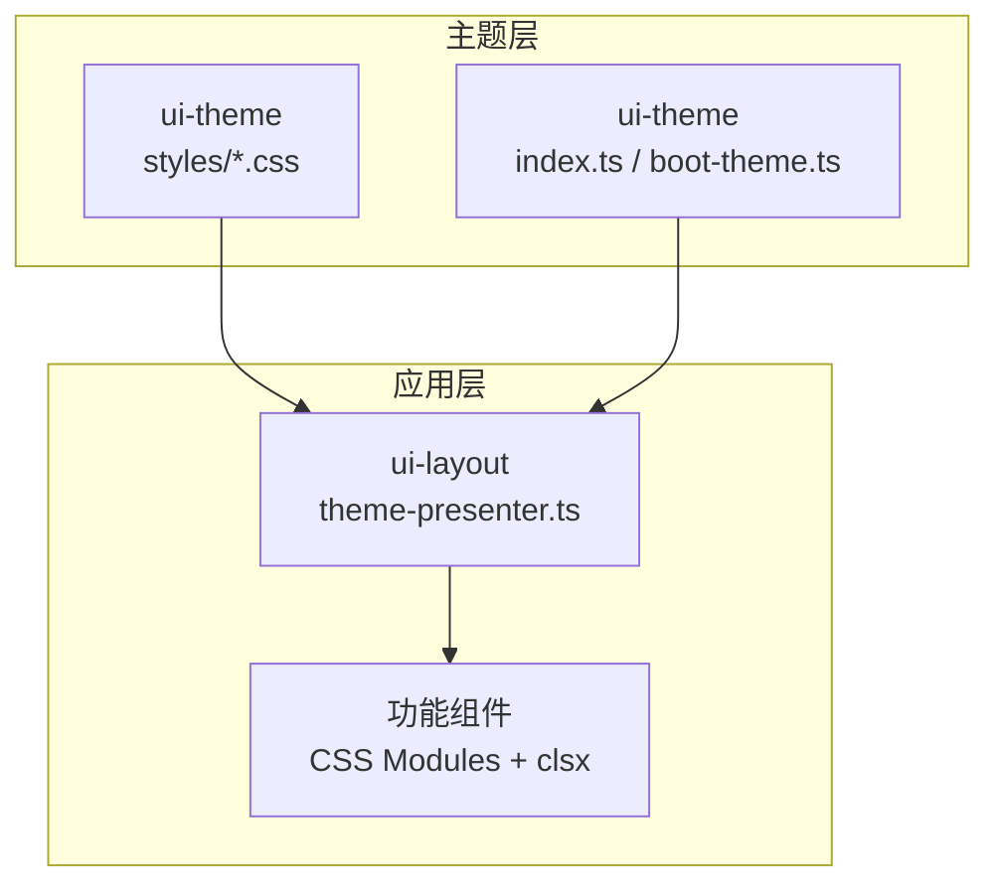
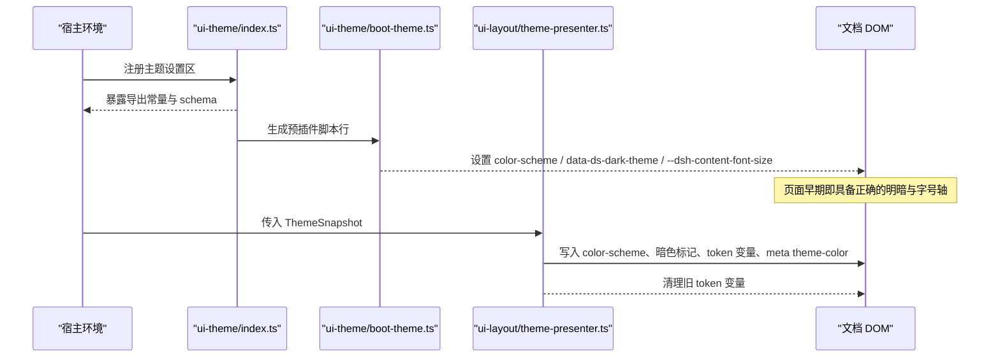
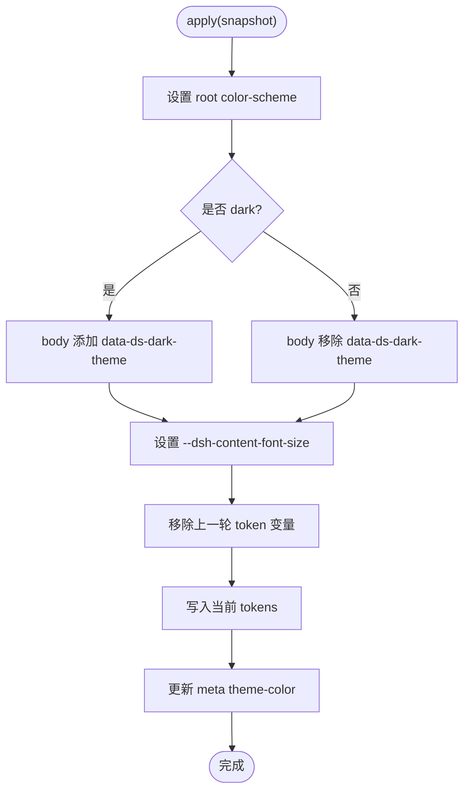
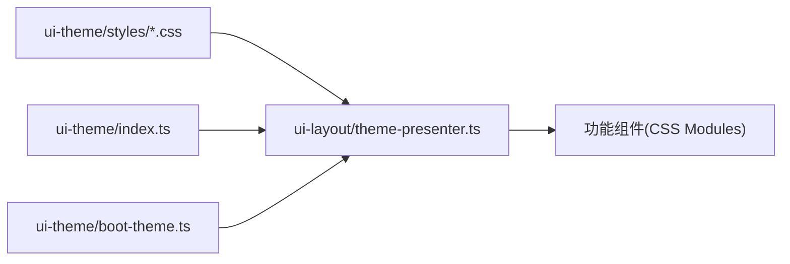

# 样式与主题定制

<cite>
**本文引用的文件**
- [web-styling.md](file://docs/web-styling.md)
- [web-styling.zh.md](file://docs/web-styling.zh.md)
- [index.ts](file://packages/client/ui-theme/src/index.ts)
- [boot-theme.ts](file://packages/client/ui-theme/src/boot-theme.ts)
- [theme-presenter.ts](file://packages/client/ui-layout/src/client/theme-presenter.ts)
- [base.css](file://packages/client/ui-theme/src/styles/base.css)
- [corner-shape.css](file://packages/client/ui-theme/src/styles/corner-shape.css)
- [design-platform.css](file://packages/client/ui-theme/src/styles/design-platform.css)
- [gradient-shadow-text.css](file://packages/client/ui-theme/src/styles/gradient-shadow-text.css)
- [scrollbar.css](file://packages/client/ui-theme/src/styles/scrollbar.css)
- [shiki.css](file://packages/client/ui-theme/src/styles/shiki.css)
</cite>

## 目录
1. [简介](#简介)
2. [项目结构](#项目结构)
3. [核心组件](#核心组件)
4. [架构总览](#架构总览)
5. [详细组件分析](#详细组件分析)
6. [依赖关系分析](#依赖关系分析)
7. [性能考虑](#性能考虑)
8. [故障排查指南](#故障排查指南)
9. [结论](#结论)
10. [附录](#附录)

## 简介
本指南面向 DeepSeek Harness 的样式与主题定制，聚焦以下目标：
- 阐明样式架构：CSS-in-JS 的使用边界、主题系统与样式隔离机制。
- 指导如何定制现有组件样式：覆盖默认样式、添加自定义类名、使用样式变量。
- 说明主题系统配置：颜色方案、字体设置与布局参数。
- 提供响应式设计最佳实践：移动端适配与多屏幕优化。
- 给出样式性能优化技巧：代码分割、按需加载与缓存策略。
- 介绍无障碍访问的样式支持：键盘导航与高对比度模式。
- 提供完整主题定制示例与常见问题解决方案。

## 项目结构
DeepSeek Harness 的前端样式职责清晰分离：
- ui-theme：负责全局 token、语义别名、排版、动效、渐变、阴影、滚动条与明暗偏好。
- ui-layout：将解析后的主题快照应用到文档（DOM），并维护主题呈现状态。
- 功能包：通过 CSS Modules 与语义 token 消费样式，不定义全局主题。

图示来源
- [index.ts:1-45](file://packages/client/ui-theme/src/index.ts#L1-L45)
- [boot-theme.ts:1-38](file://packages/client/ui-theme/src/boot-theme.ts#L1-L38)
- [theme-presenter.ts:1-69](file://packages/client/ui-layout/src/client/theme-presenter.ts#L1-L69)
- [base.css:1-16](file://packages/client/ui-theme/src/styles/base.css#L1-L16)

章节来源
- [web-styling.md:1-30](file://docs/web-styling.md#L1-L30)
- [web-styling.zh.md:1-30](file://docs/web-styling.zh.md#L1-L30)

## 核心组件
- 主题注入与持久化读取
  - 在宿主环境中注册主题设置区，并在索引注入阶段输出预插件脚本，提前设置 color-scheme、暗色属性与内容字号轴。
- 主题呈现器
  - 将主题快照投影到 DOM：设置根级 color-scheme、body 暗色标记、发布内容字号轴、批量写入/移除 token 变量，并同步浏览器地址栏主题色元数据。
- 基础样式与规范
  - 统一字体栈、过渡曲线与时长；圆角超级椭圆平滑；滚动条样式；代码高亮主题等。

章节来源
- [index.ts:20-45](file://packages/client/ui-theme/src/index.ts#L20-L45)
- [boot-theme.ts:11-37](file://packages/client/ui-theme/src/boot-theme.ts#L11-L37)
- [theme-presenter.ts:19-69](file://packages/client/ui-layout/src/client/theme-presenter.ts#L19-L69)
- [base.css:1-16](file://packages/client/ui-theme/src/styles/base.css#L1-L16)

## 架构总览
主题从“持久化设置 → 预插件脚本 → 运行时快照 → DOM 应用”的链路如下：

图示来源
- [index.ts:30-45](file://packages/client/ui-theme/src/index.ts#L30-L45)
- [boot-theme.ts:11-37](file://packages/client/ui-theme/src/boot-theme.ts#L11-L37)
- [theme-presenter.ts:32-69](file://packages/client/ui-layout/src/client/theme-presenter.ts#L32-L69)

## 详细组件分析

### 主题注入与预插件脚本（ui-theme）
- 作用：在插件树挂载前，尽早确定明暗主题与内容字号，避免闪烁。
- 关键点：
  - 读取持久化的主题偏好与字号，生成内联脚本。
  - 脚本设置 documentElement.colorScheme、body 的 data-ds-dark-theme 属性以及 --dsh-content-font-size 变量。
- 扩展点：如需新增可持久化主题字段，应在设置 schema 中扩展并在注入脚本中处理。

章节来源
- [index.ts:20-45](file://packages/client/ui-theme/src/index.ts#L20-L45)
- [boot-theme.ts:11-37](file://packages/client/ui-theme/src/boot-theme.ts#L11-L37)

### 主题呈现器（ui-layout）
- 作用：将主题快照映射为 DOM 状态，确保 UI 与主题一致。
- 关键点：
  - 根据 active.colorScheme 设置 root color-scheme 与 body 暗色标记。
  - 发布 --dsh-content-font-size 轴，供组件按用户字号缩放。
  - 批量写入/移除 token 变量，避免残留。
  - 同步 meta[name="theme-color"] 以匹配浏览器 UI 背景。
- 生命周期：每个插件 fiber 一个实例，dispose 时回滚所有写入。

图示来源
- [theme-presenter.ts:32-69](file://packages/client/ui-layout/src/client/theme-presenter.ts#L32-L69)

章节来源
- [theme-presenter.ts:1-69](file://packages/client/ui-layout/src/client/theme-presenter.ts#L1-L69)

### 基础样式与规范（ui-theme/styles）
- base.css：定义字体栈、过渡曲线与时长，确保跨平台一致性。
- corner-shape.css：全局超级椭圆圆角平滑，配合正圆 border-radius 保持圆弧。
- scrollbar.css：共享滚动条样式，避免组件各自实现。
- design-platform.css / gradient-shadow-text.css / shiki.css：设计平台相关视觉基线、渐变/阴影/文本效果与代码高亮主题。

章节来源
- [base.css:1-16](file://packages/client/ui-theme/src/styles/base.css#L1-L16)
- [corner-shape.css](file://packages/client/ui-theme/src/styles/corner-shape.css)
- [scrollbar.css](file://packages/client/ui-theme/src/styles/scrollbar.css)
- [design-platform.css](file://packages/client/ui-theme/src/styles/design-platform.css)
- [gradient-shadow-text.css](file://packages/client/ui-theme/src/styles/gradient-shadow-text.css)
- [shiki.css](file://packages/client/ui-theme/src/styles/shiki.css)

### 组件样式规则与隔离
- 使用 CSS Modules 与 clsx，禁止引入第三方组件库或 Tailwind。
- 组件仅消费 --dsw-alias-* 语义 token，不得复制静态色板或写死颜色。
- 组件 CSS 不包含主题选择器；明暗覆盖由主题方管理。
- 当值属于组件自身布局/呈现约定时，可定义局部自定义属性；共享颜色、排版、层级与动效归主题包。
- 链接、边框、阴影、圆角等遵循主题 spec，保证一致性与可维护性。

章节来源
- [web-styling.md:13-26](file://docs/web-styling.md#L13-L26)
- [web-styling.zh.md:13-26](file://docs/web-styling.zh.md#L13-L26)

## 依赖关系分析
- ui-theme 对外暴露主题设置与注入能力，ui-layout 消费主题快照并驱动 DOM。
- 功能组件依赖 ui-theme 提供的 token 与规范，不直接耦合具体样式实现。
- 样式资源以 CSS 模块形式就近组织，便于按需打包与隔离。

图示来源
- [index.ts:1-45](file://packages/client/ui-theme/src/index.ts#L1-L45)
- [boot-theme.ts:1-38](file://packages/client/ui-theme/src/boot-theme.ts#L1-L38)
- [theme-presenter.ts:1-69](file://packages/client/ui-layout/src/client/theme-presenter.ts#L1-L69)

章节来源
- [web-styling.zh.md:7-11](file://docs/web-styling.zh.md#L7-L11)

## 性能考虑
- 代码分割与按需加载
  - 使用 CSS Modules 使样式随组件按需打包，减少首屏体积。
  - 将主题基础样式与通用样式放入 ui-theme，避免重复。
- 样式缓存
  - 利用浏览器缓存与构建产物指纹；主题 token 变更通过版本化资源命中缓存。
- 最小化重排重绘
  - 主题呈现器批量写入/移除 token 变量，减少多次回流。
  - 预插件脚本尽早设置 color-scheme 与暗色标记，避免首次渲染闪烁。
- 动画与动效
  - 遵循统一的过渡曲线与时长；尊重 reduced-motion 偏好。

[本节为通用性能建议，不直接分析具体文件]

## 故障排查指南
- 主题未生效或闪烁
  - 检查预插件脚本是否正确设置 color-scheme 与 data-ds-dark-theme。
  - 确认主题呈现器已正确写入 tokens 并清理旧变量。
- 字号异常
  - 检查 --dsh-content-font-size 是否被正确设置与继承。
- 链接/边框/阴影不符合预期
  - 确认组件使用了 --dsw-alias-* 语义 token，而非硬编码颜色。
  - 高层级表面应使用 elevation 阴影，避免与中性 border 混用。
- 圆角形状异常
  - 正圆或胶囊需配对 corner-shape: round，确保超级椭圆平滑生效。
- 滚动条样式不一致
  - 使用共享滚动条样式，不要在各组件内自定义滚动条选择器。

章节来源
- [boot-theme.ts:11-37](file://packages/client/ui-theme/src/boot-theme.ts#L11-L37)
- [theme-presenter.ts:32-69](file://packages/client/ui-layout/src/client/theme-presenter.ts#L32-L69)
- [web-styling.zh.md:13-26](file://docs/web-styling.zh.md#L13-L26)

## 结论
DeepSeek Harness 的样式与主题体系以“主题集中管理 + 组件语义消费 + 运行时 DOM 应用”为核心，结合 CSS Modules 与严格的设计规范，实现了可定制、可维护且高性能的 UI 体验。通过预插件脚本与主题呈现器的协作，系统在启动早期即可稳定呈现主题与字号，保障一致的视觉与交互质量。

[本节为总结性内容，不直接分析具体文件]

## 附录

### 主题定制步骤（端到端）
- 新增/修改共享 token
  - 在 ui-theme 样式表中添加或调整 token，并通过语义别名暴露给功能组件。
- 更新主题设置
  - 在主题设置 schema 中扩展新字段（如颜色方案、字号范围），并在注入脚本中处理。
- 应用至组件
  - 组件通过 CSS Modules 消费 --dsw-alias-* 语义 token，必要时定义局部自定义属性。
- 验证与回归
  - 遵循测试策略，确保明暗主题、字号、动效与无障碍行为符合预期。

章节来源
- [web-styling.zh.md:27-30](file://docs/web-styling.zh.md#L27-L30)
- [index.ts:20-45](file://packages/client/ui-theme/src/index.ts#L20-L45)
- [boot-theme.ts:11-37](file://packages/client/ui-theme/src/boot-theme.ts#L11-L37)

### 响应式设计最佳实践
- 使用相对单位与主题字号轴（--dsh-content-font-size）进行缩放。
- 基于容器与视口媒体查询调整布局；优先采用弹性布局与网格。
- 控制动画与过渡，尊重 reduced-motion 偏好。
- 在小屏上简化阴影与复杂装饰，提升可读性与性能。

[本节为通用实践建议，不直接分析具体文件]

### 无障碍访问的样式支持
- 保留清晰的键盘焦点可见性。
- 遵循主题的高对比度与色彩对比要求。
- 避免仅依赖颜色传达信息，结合图标与文字标签。
- 尊重 reduced-motion 与 prefers-contrast 等媒体查询。

[本节为通用无障碍建议，不直接分析具体文件]

### 常见问题与解决方案
- 问题：覆盖默认样式导致主题失效
  - 解决：优先使用语义 token；仅在组件契约范围内定义局部变量。
- 问题：明暗切换后样式错乱
  - 解决：确保主题呈现器正确写入/移除 tokens，并清理旧变量。
- 问题：链接样式不符合规范
  - 解决：使用 --dsw-alias-link 与规定字重、下划线行为。
- 问题：圆角显示异常
  - 解决：正圆/胶囊搭配 corner-shape: round，遵循 corner-shape 规范。

章节来源
- [web-styling.zh.md:13-26](file://docs/web-styling.zh.md#L13-L26)
- [theme-presenter.ts:32-69](file://packages/client/ui-layout/src/client/theme-presenter.ts#L32-L69)