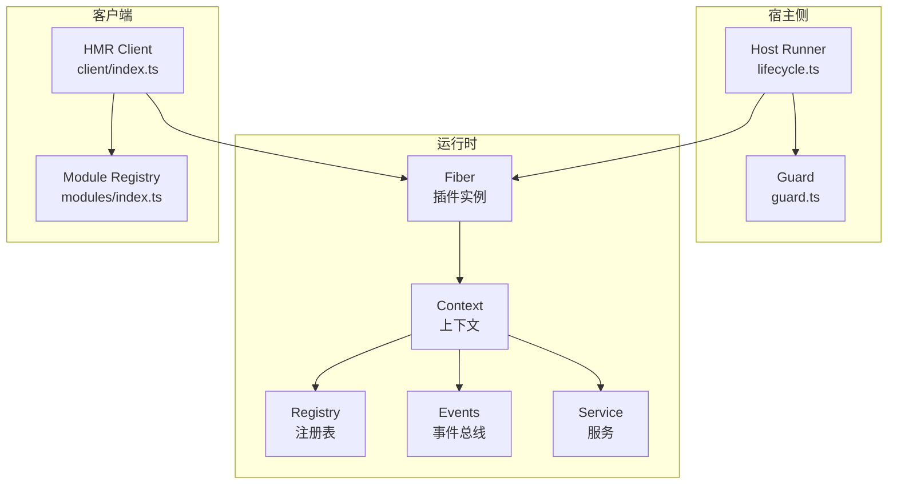
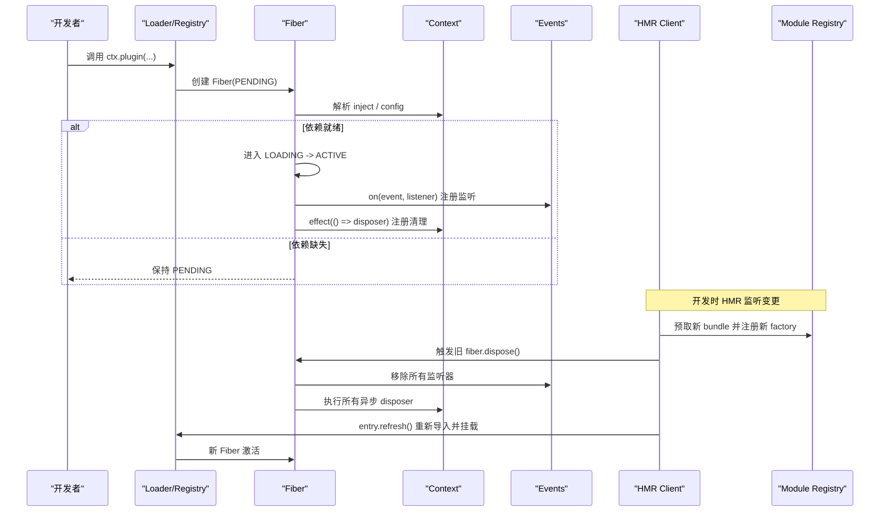
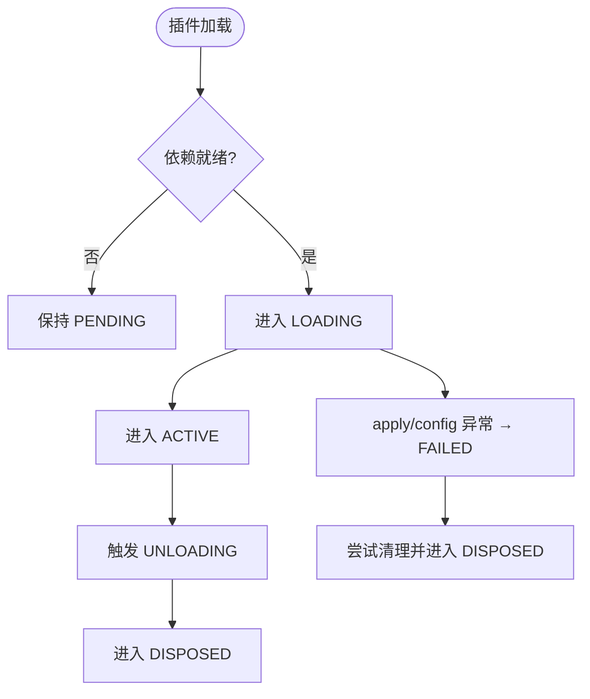
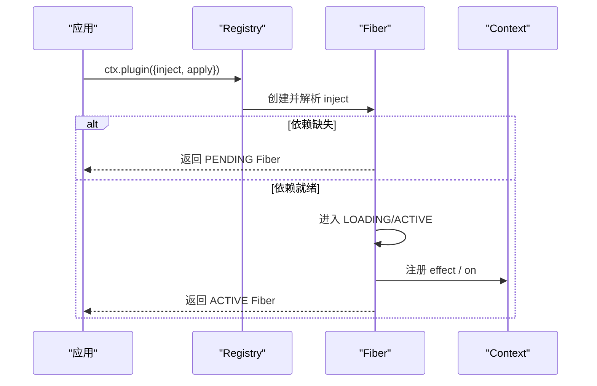
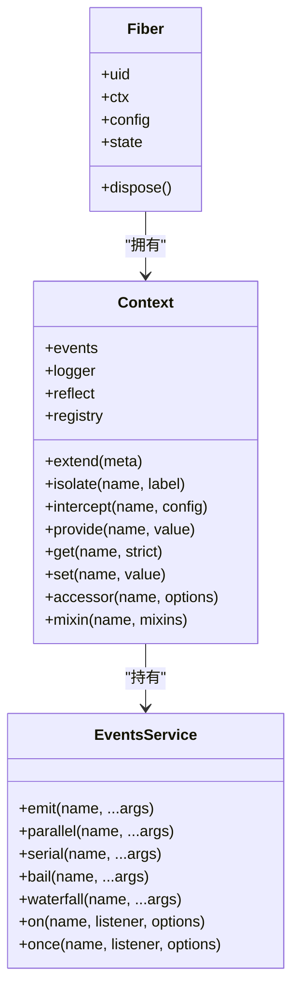
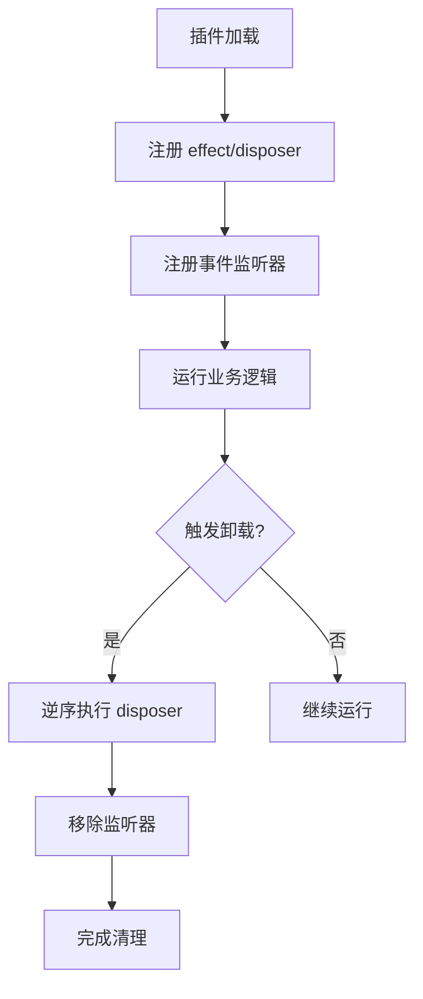
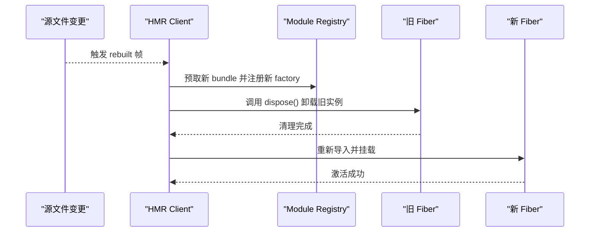
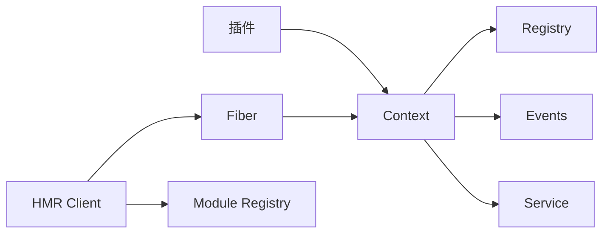

# 生命周期管理

<cite>
**本文引用的文件**
- [docs/cordis-tutorial/02-lifecycle-and-effects.zh.md](file://docs/cordis-tutorial/02-lifecycle-and-effects.zh.md)
- [docs/cordis-api/events.md](file://docs/cordis-api/events.md)
- [docs/cordis-api/context.md](file://docs/cordis-api/context.md)
- [docs/cordis-api/fiber.md](file://docs/cordis-api/fiber.md)
- [docs/cordis-api/registry.md](file://docs/cordis-api/registry.md)
- [docs/cordis-api/service.md](file://docs/cordis-api/service.md)
- [docs/cordis-api/inherited.md](file://docs/cordis-api/inherited.md)
- [packages/extensions/cordis-host-runner/src/lifecycle.ts](file://packages/extensions/cordis-host-runner/src/lifecycle.ts)
- [packages/client/hmr/README.zh.md](file://packages/client/hmr/README.zh.md)
- [packages/client/hmr/src/client/index.ts](file://packages/client/hmr/src/client/index.ts)
- [packages/client/modules/src/index.ts](file://packages/client/modules/src/index.ts)
- [packages/extensions/cordis-host-runner/src/guard.ts](file://packages/extensions/cordis-host-runner/src/guard.ts)
- [packages/extensions/cordis-client-runner/src/client/guard.ts](file://packages/extensions/cordis-client-runner/src/client/guard.ts)
</cite>

## 目录
1. [简介](#简介)
2. [项目结构](#项目结构)
3. [核心组件](#核心组件)
4. [架构总览](#架构总览)
5. [详细组件分析](#详细组件分析)
6. [依赖关系分析](#依赖关系分析)
7. [性能考虑](#性能考虑)
8. [故障排查指南](#故障排查指南)
9. [结论](#结论)
10. [附录](#附录)

## 简介
本文件系统性阐述 UI 插件在 Cordis 框架中的完整生命周期：从加载、挂载、更新到销毁，覆盖启动顺序与依赖管理、插件间通信（事件总线、服务注入、上下文共享）、资源管理与泄漏防护、错误处理与恢复、以及热重载与动态更新。文档面向不同技术背景的读者，提供由浅入深的说明与可视化图示，帮助开发者正确设计并维护可演进、可观测、可回滚的 UI 插件体系。

## 项目结构
围绕生命周期管理的代码与文档分布在以下位置：
- 教程与 API 文档：定义生命周期、Fiber 状态机、事件、服务、上下文、注册表等概念与用法。
- 宿主侧运行器：负责安全地启动、卸载和诊断动态插件，保证失败不残留。
- 客户端 HMR：实现浏览器端的热模块替换，串行化重载、级联失效与无回滚策略。
- 守卫机制：对动态插件暴露的 ctx 进行白名单限制，避免越权访问内部服务。

**图表来源**
- [docs/cordis-api/context.md:120-160](file://docs/cordis-api/context.md#L120-L160)
- [docs/cordis-api/fiber.md:82-109](file://docs/cordis-api/fiber.md#L82-L109)
- [docs/cordis-api/registry.md:35-56](file://docs/cordis-api/registry.md#L35-L56)
- [packages/extensions/cordis-host-runner/src/lifecycle.ts:22-45](file://packages/extensions/cordis-host-runner/src/lifecycle.ts#L22-L45)
- [packages/client/hmr/src/client/index.ts:142-185](file://packages/client/hmr/src/client/index.ts#L142-L185)
- [packages/client/modules/src/index.ts:1002-1027](file://packages/client/modules/src/index.ts#L1002-L1027)

**章节来源**
- [docs/cordis-api/context.md:120-160](file://docs/cordis-api/context.md#L120-L160)
- [docs/cordis-api/fiber.md:82-109](file://docs/cordis-api/fiber.md#L82-L109)
- [docs/cordis-api/registry.md:35-56](file://docs/cordis-api/registry.md#L35-L56)
- [packages/extensions/cordis-host-runner/src/lifecycle.ts:22-45](file://packages/extensions/cordis-host-runner/src/lifecycle.ts#L22-L45)
- [packages/client/hmr/src/client/index.ts:142-185](file://packages/client/hmr/src/client/index.ts#L142-L185)
- [packages/client/modules/src/index.ts:1002-1027](file://packages/client/modules/src/index.ts#L1002-L1027)

## 核心组件
- Context（上下文）：插件运行的根容器，聚合事件总线、日志、反射层、注册表；支持扩展、隔离、拦截配置，提供 effect 与 mixin 能力。
- Fiber（纤维）：单个插件实例的运行时句柄，跟踪依赖、配置、生命周期状态与清理；对外暴露 dispose、await、state、config 等。
- Registry（注册表）：插件加载与依赖注入的核心，支持函数/类/对象三种插件形态，统一 inject 声明与 provide 能力。
- Events（事件总线）：提供 emit、parallel、serial、bail、waterfall、on、once 等分发模式，监听器随 fiber 自动清理。
- Service（服务）：基于 Context 的命名服务基类，构造即注册，随 fiber 卸载自动移除。
- HMR（热模块替换）：客户端通过 SSE 接收 rebuilt 帧，串行执行重载，先注册新工厂再卸载旧 fiber，无回滚策略。
- Guard（守卫）：对动态插件暴露的 ctx 做白名单限制，仅允许声明的服务被访问，防止越权。

**章节来源**
- [docs/cordis-api/context.md:120-160](file://docs/cordis-api/context.md#L120-L160)
- [docs/cordis-api/fiber.md:82-109](file://docs/cordis-api/fiber.md#L82-L109)
- [docs/cordis-api/registry.md:35-56](file://docs/cordis-api/registry.md#L35-L56)
- [docs/cordis-api/events.md:8-171](file://docs/cordis-api/events.md#L8-L171)
- [docs/cordis-api/service.md:1-103](file://docs/cordis-api/service.md#L1-L103)
- [packages/client/hmr/README.zh.md:64-74](file://packages/client/hmr/README.zh.md#L64-L74)
- [packages/extensions/cordis-host-runner/src/guard.ts:680-711](file://packages/extensions/cordis-host-runner/src/guard.ts#L680-L711)
- [packages/extensions/cordis-client-runner/src/client/guard.ts:180-204](file://packages/extensions/cordis-client-runner/src/client/guard.ts#L180-L204)

## 架构总览
下图展示 UI 插件从加载到卸载的关键路径，包括依赖解析、effect 注册、事件订阅、HMR 重载与最终清理。

**图表来源**
- [docs/cordis-api/registry.md:35-56](file://docs/cordis-api/registry.md#L35-L56)
- [docs/cordis-api/events.md:125-171](file://docs/cordis-api/events.md#L125-L171)
- [docs/cordis-api/context.md:286-314](file://docs/cordis-api/context.md#L286-L314)
- [packages/client/hmr/README.zh.md:64-74](file://packages/client/hmr/README.zh.md#L64-L74)
- [packages/client/hmr/src/client/index.ts:142-185](file://packages/client/hmr/src/client/index.ts#L142-L185)

## 详细组件分析

### 生命周期与 Fiber 状态机
- 状态转换：PENDING → LOADING → ACTIVE → UNLOADING → DISPOSED；异常路径可达 FAILED。
- 关键语义：
  - PENDING：已声明但所需服务不可用，等待提供方出现。
  - LOADING/ACTIVE：apply 正在运行或已完成。
  - FAILED：apply 或配置校验抛出异常。
  - UNLOADING/DISPOSED：disposer 正在运行或已清理完毕。
- 资源清理：effect 主体在加载期间运行，返回的 disposer 在卸载期间按逆序并发执行；若需顺序拆除，应在同一 disposer 中依次 await。

**图表来源**
- [docs/cordis-tutorial/02-lifecycle-and-effects.zh.md:68-83](file://docs/cordis-tutorial/02-lifecycle-and-effects.zh.md#L68-L83)
- [docs/cordis-api/fiber.md:91-109](file://docs/cordis-api/fiber.md#L91-L109)

**章节来源**
- [docs/cordis-tutorial/02-lifecycle-and-effects.zh.md:5-95](file://docs/cordis-tutorial/02-lifecycle-and-effects.zh.md#L5-L95)
- [docs/cordis-api/fiber.md:82-109](file://docs/cordis-api/fiber.md#L82-L109)

### 启动顺序与依赖管理
- 依赖声明：插件通过 inject 声明所需服务，数组或对象形式；未满足则处于 PENDING。
- 加载流程：ctx.plugin 创建 Fiber，解析依赖，依赖就绪后进入 ACTIVE；ctx.inject 是快捷方式，依赖变化时会卸载并重载回调。
- 服务提供：ctx.provide 在当前 fiber 作用域内提供实现，fiber 卸载时自动注销并唤醒等待者。
- 隔离与拦截：ctx.isolate 为某服务名建立独立作用域；ctx.intercept 为下游插件合并拦截配置。

**图表来源**
- [docs/cordis-api/registry.md:8-33](file://docs/cordis-api/registry.md#L8-L33)
- [docs/cordis-api/registry.md:35-56](file://docs/cordis-api/registry.md#L35-L56)
- [docs/cordis-api/context.md:286-314](file://docs/cordis-api/context.md#L286-L314)
- [docs/cordis-api/context.md:39-96](file://docs/cordis-api/context.md#L39-L96)

**章节来源**
- [docs/cordis-api/registry.md:8-33](file://docs/cordis-api/registry.md#L8-L33)
- [docs/cordis-api/registry.md:35-56](file://docs/cordis-api/registry.md#L35-L56)
- [docs/cordis-api/context.md:39-96](file://docs/cordis-api/context.md#L39-L96)
- [docs/cordis-api/context.md:286-314](file://docs/cordis-api/context.md#L286-L314)

### 插件间通信机制
- 事件总线：ctx.on/ctx.once 注册的监听器随 fiber 卸载自动移除；分发模式包括 emit（同步忽略返回值）、parallel（并发等待）、serial（顺序直到 bail）、bail（同步短路）、waterfall（链式 next）。
- 服务注入：通过 inject 声明依赖，ctx.get/set/provide 读写服务；accessor 提供计算属性；mixin 将服务方法直接挂到 ctx。
- 上下文共享：Context 作为代理，extend/isolate/intercept 创建子上下文而不影响父上下文；root 指向应用根上下文。

**图表来源**
- [docs/cordis-api/context.md:120-160](file://docs/cordis-api/context.md#L120-L160)
- [docs/cordis-api/events.md:8-171](file://docs/cordis-api/events.md#L8-L171)
- [docs/cordis-api/fiber.md:82-109](file://docs/cordis-api/fiber.md#L82-L109)

**章节来源**
- [docs/cordis-api/events.md:8-171](file://docs/cordis-api/events.md#L8-L171)
- [docs/cordis-api/context.md:120-160](file://docs/cordis-api/context.md#L120-L160)
- [docs/cordis-api/context.md:286-314](file://docs/cordis-api/context.md#L286-L314)

### 资源管理与泄漏防护
- Effect 管理：定时器、连接、watcher 等外部资源应包装在 ctx.effect 中并返回 disposer；Cordis 会在卸载阶段自动调用。
- 监听器清理：ctx.on/ctx.once 返回 disposer，并在 fiber 卸载时移除；确保不会在死应用中触发回调。
- 异步清理顺序：多个异步 disposer 并发执行；如需顺序，请在同一 disposer 中依次 await。
- 宿主侧安全：startHostHalf 包裹 guardedPlugin，确保启动失败时立即 dispose，避免 FAILED fiber 残留；missingServices 用于诊断 PENDING 原因。

**图表来源**
- [docs/cordis-tutorial/02-lifecycle-and-effects.zh.md:5-95](file://docs/cordis-tutorial/02-lifecycle-and-effects.zh.md#L5-L95)
- [docs/cordis-api/events.md:125-171](file://docs/cordis-api/events.md#L125-L171)
- [packages/extensions/cordis-host-runner/src/lifecycle.ts:22-45](file://packages/extensions/cordis-host-runner/src/lifecycle.ts#L22-L45)

**章节来源**
- [docs/cordis-tutorial/02-lifecycle-and-effects.zh.md:5-95](file://docs/cordis-tutorial/02-lifecycle-and-effects.zh.md#L5-L95)
- [packages/extensions/cordis-host-runner/src/lifecycle.ts:22-45](file://packages/extensions/cordis-host-runner/src/lifecycle.ts#L22-L45)

### 生命周期钩子使用示例
- 初始化与挂载：在 apply 中使用 ctx.on 注册事件监听，使用 ctx.effect 注册定时器/连接等资源清理。
- 更新：当依赖服务变化时，ctx.inject 会卸载并重载回调；也可通过 ctx.intercept 调整下游插件的配置。
- 销毁：fiber.dispose 会递归卸载子插件并等待所有异步清理完成；HMR 场景下先注册新工厂再卸载旧 fiber。

提示：具体示例请参考教程中的生命周期示例与 HMR 组合章节。

**章节来源**
- [docs/cordis-tutorial/02-lifecycle-and-effects.zh.md:5-95](file://docs/cordis-tutorial/02-lifecycle-and-effects.zh.md#L5-L95)
- [docs/cordis-api/registry.md:8-33](file://docs/cordis-api/registry.md#L8-L33)
- [docs/cordis-api/context.md:286-314](file://docs/cordis-api/context.md#L286-L314)

### 错误处理与恢复机制
- 启动失败：apply 或配置校验抛错进入 FAILED；宿主侧 startHostHalf 捕获异常后立即 dispose，避免残留。
- 重复注册：若名称已被占用，抛出“already registered”错误；需先停止旧 id 再替换。
- 依赖缺失：PENDING 是合法状态，可通过 missingServices 诊断缺少的服务。
- 恢复策略：HMR 无回滚，导入失败会使 entry 失去 fiber，下一次 rebuilt 重试；apply 失败会在外壳状态投影中保留 FAILED fiber。

**章节来源**
- [packages/extensions/cordis-host-runner/src/lifecycle.ts:22-45](file://packages/extensions/cordis-host-runner/src/lifecycle.ts#L22-L45)
- [docs/cordis-api/fiber.md:91-109](file://docs/cordis-api/fiber.md#L91-L109)
- [packages/client/hmr/README.zh.md:64-74](file://packages/client/hmr/README.zh.md#L64-L74)

### 热重载与动态更新
- 客户端 HMR：通过 EventSource 订阅 events 端点，收到 rebuilt 帧后串行执行重载；先 prefetch 新 bundle 并注册新 factory，再卸载旧 fiber，最后刷新入口重新挂载。
- 级联与自重载：fiber 的激活 epoch 串联其服务提供方的 uid，替换提供方会级联依赖方；HMR 自身也是图 entry，可被重建。
- 服务端模块路由：/plugins 下的资源通过 serveBundle 提供，未知资源返回 404。

**图表来源**
- [packages/client/hmr/src/client/index.ts:142-185](file://packages/client/hmr/src/client/index.ts#L142-L185)
- [packages/client/modules/src/index.ts:1002-1027](file://packages/client/modules/src/index.ts#L1002-L1027)
- [packages/client/hmr/README.zh.md:64-74](file://packages/client/hmr/README.zh.md#L64-L74)

**章节来源**
- [packages/client/hmr/src/client/index.ts:142-185](file://packages/client/hmr/src/client/index.ts#L142-L185)
- [packages/client/modules/src/index.ts:1002-1027](file://packages/client/modules/src/index.ts#L1002-L1027)
- [packages/client/hmr/README.zh.md:64-74](file://packages/client/hmr/README.zh.md#L64-L74)

## 依赖关系分析
- 插件与上下文：插件通过 ctx 获取事件、服务、注册表；Context 聚合这些能力并通过 proxy 转发。
- Fiber 与 Registry：Registry 负责创建与管理 Fiber；Fiber 持有 ctx 并驱动生命周期。
- 事件与服务：Events 与 Services 通过 Context 暴露给插件；监听器与服务实现均受 fiber 生命周期约束。
- HMR 与模块系统：HMR 客户端与 Module Registry 协作，确保新旧版本安全切换。

**图表来源**
- [docs/cordis-api/context.md:120-160](file://docs/cordis-api/context.md#L120-L160)
- [docs/cordis-api/registry.md:35-56](file://docs/cordis-api/registry.md#L35-L56)
- [packages/client/hmr/src/client/index.ts:142-185](file://packages/client/hmr/src/client/index.ts#L142-L185)

**章节来源**
- [docs/cordis-api/context.md:120-160](file://docs/cordis-api/context.md#L120-L160)
- [docs/cordis-api/registry.md:35-56](file://docs/cordis-api/registry.md#L35-L56)
- [packages/client/hmr/src/client/index.ts:142-185](file://packages/client/hmr/src/client/index.ts#L142-L185)

## 性能考虑
- 事件分发选择：并行（parallel）适合独立副作用；串行（serial/bail）适合有短路需求的管线；waterfall 适合链式拦截。
- 异步清理并发：多个异步 disposer 并发执行可提升卸载速度，但需注意竞态与顺序要求。
- HMR 串行队列：客户端将 rebuild 请求串行化，避免交错 dispose/execute 导致状态损坏。
- 依赖解析缓存：Fiber 的 store 快照减少重复解析开销；隔离作用域避免不必要的服务冲突。

[本节为通用指导，无需特定文件引用]

## 故障排查指南
- 插件始终 PENDING：检查 inject 声明的服务是否提供；使用 missingServices 列出缺失项。
- 启动失败残留：确认宿主侧是否正确捕获异常并调用 fiber.dispose；避免 FAILED fiber 挂载。
- HMR 重载失败：查看浏览器控制台日志；确认 rebuilt 帧序列与 module registry 响应；必要时重新加载页面。
- 事件未触发：确认 ctx.on 是否在 effect 中注册；检查事件名与参数类型；验证监听器未被提前移除。

**章节来源**
- [packages/extensions/cordis-host-runner/src/lifecycle.ts:22-45](file://packages/extensions/cordis-host-runner/src/lifecycle.ts#L22-L45)
- [packages/extensions/cordis-host-runner/src/lifecycle.ts:47-57](file://packages/extensions/cordis-host-runner/src/lifecycle.ts#L47-L57)
- [packages/client/hmr/src/client/index.ts:142-185](file://packages/client/hmr/src/client/index.ts#L142-L185)
- [docs/cordis-api/events.md:125-171](file://docs/cordis-api/events.md#L125-L171)

## 结论
Cordis 通过 Context、Fiber、Registry、Events、Service 构建了清晰且可扩展的插件生命周期模型。借助 effect 与监听器的自动清理、依赖驱动的加载顺序、以及 HMR 的安全替换机制，UI 插件能够在复杂环境中保持稳定与可维护性。开发者应遵循最佳实践：显式声明依赖、合理使用 effect、选择合适的事件分发模式、并利用宿主侧守卫与诊断工具保障健壮性。

[本节为总结性内容，无需特定文件引用]

## 附录
- 内置事件参考：internal/plugin、internal/status、internal/update、hmr/change、hmr/reload 等，可用于监控与调试。
- 推荐实践：
  - 所有外部资源通过 ctx.effect 管理。
  - 使用 ctx.inject 声明依赖，避免隐式耦合。
  - 在 HMR 场景下关注级联失效与无回滚策略。
  - 利用 missingServices 与 FiberState 进行诊断。

**章节来源**
- [docs/cordis-api/inherited.md:23-39](file://docs/cordis-api/inherited.md#L23-L39)
- [docs/cordis-tutorial/06-composition-and-hmr.zh.md:23-63](file://docs/cordis-tutorial/06-composition-and-hmr.zh.md#L23-L63)