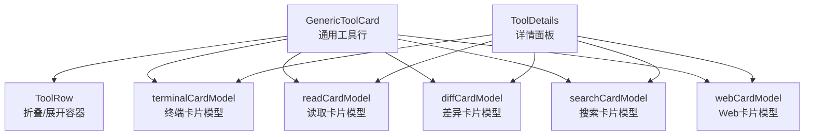
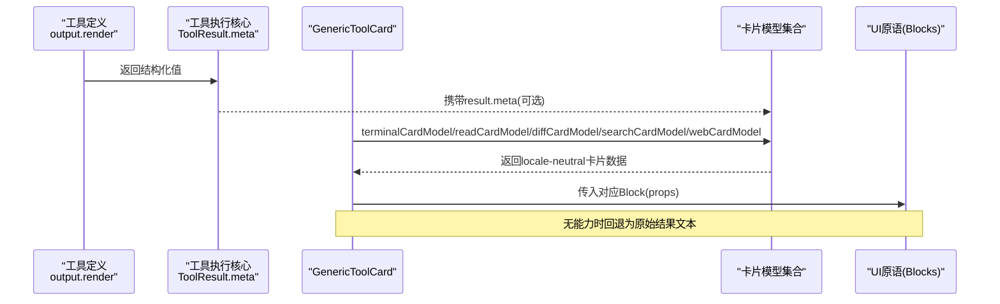
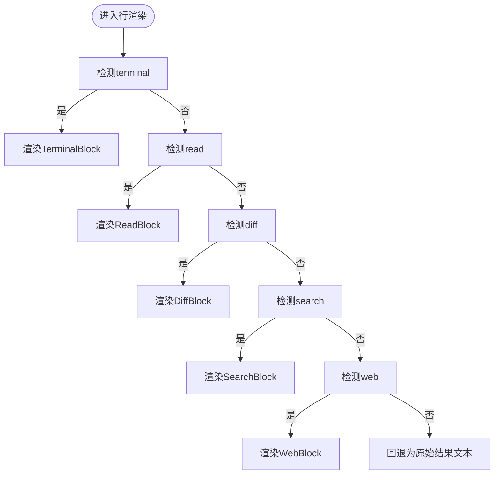
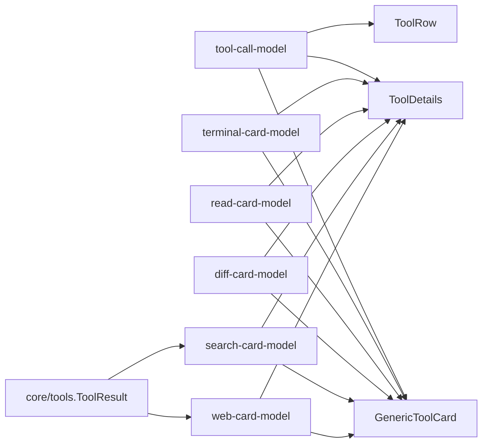

# UI展示与卡片渲染

<cite>
**本文引用的文件**
- [packages/client/ui-tool/src/client/tool/models/tool-call-model.ts](file://packages/client/ui-tool/src/client/tool/models/tool-call-model.ts)
- [packages/client/ui-tool/src/client/tool/ToolDetails.tsx](file://packages/client/ui-tool/src/client/tool/ToolDetails.tsx)
- [packages/client/ui-tool/src/client/tool/toolviews/GenericToolCard.tsx](file://packages/client/ui-tool/src/client/tool/toolviews/GenericToolCard.tsx)
- [packages/client/ui-tool/src/client/tool/components/ToolRow.tsx](file://packages/client/ui-tool/src/client/tool/components/ToolRow.tsx)
- [packages/client/ui-tool/src/client/tool/models/terminal-card-model.ts](file://packages/client/ui-tool/src/client/tool/models/terminal-card-model.ts)
- [packages/client/ui-tool/src/client/tool/models/read-card-model.ts](file://packages/client/ui-tool/src/client/tool/models/read-card-model.ts)
- [packages/client/ui-tool/src/client/tool/models/diff-card-model.ts](file://packages/client/ui-tool/src/client/tool/models/diff-card-model.ts)
- [packages/web/tool-web/src/fetch.ts](file://packages/web/tool-web/src/fetch.ts)
- [docs/cookbook/adding-a-tool.md](file://docs/cookbook/adding-a-tool.md)
- [docs/cookbook/adding-a-tool.zh.md](file://docs/cookbook/adding-a-tool.zh.md)
- [packages/core/tools/src/index.ts](file://packages/core/tools/src/index.ts)
</cite>

## 目录
1. [简介](#简介)
2. [项目结构](#项目结构)
3. [核心组件](#核心组件)
4. [架构总览](#架构总览)
5. [详细组件分析](#详细组件分析)
6. [依赖关系分析](#依赖关系分析)
7. [性能考虑](#性能考虑)
8. [故障排查指南](#故障排查指南)
9. [结论](#结论)
10. [附录](#附录)

## 简介
本文件面向DeepSeek Harness工具UI的“展示与卡片渲染”主题，聚焦以下目标：
- 说明模型可见内容的生成与格式化（output.render）如何与UI卡片解耦。
- 解释presentCall与presentResult的区别、适用时机与纯函数约束。
- 梳理不同类型卡片的配置与使用：generic、terminal、diff、read、search、web。
- 说明presentationMeta在持久化与回放恢复中的作用。
- 给出不同工具类型的UI展示示例（文件操作、命令执行、搜索结果等）。

## 项目结构
围绕UI展示与卡片渲染的关键代码位于ui-tool包与相关文档中：
- 行级通用渲染：GenericToolCard将工具调用归类为不同variant，并组合Terminal/Diff/Read/Search/Web等卡片。
- 详情面板：ToolDetails根据block内容选择最合适的卡片进行详情展示。
- 卡片模型：terminal/read/diff/search/web等各自提供从原始block到UI原语的纯推导。
- 工具作者参考：cookbook文档定义了presentCall/presentResult与presentationMeta的契约。

图表来源
- [packages/client/ui-tool/src/client/tool/toolviews/GenericToolCard.tsx:1-68](file://packages/client/ui-tool/src/client/tool/toolviews/GenericToolCard.tsx#L1-L68)
- [packages/client/ui-tool/src/client/tool/ToolDetails.tsx:1-69](file://packages/client/ui-tool/src/client/tool/ToolDetails.tsx#L1-L69)
- [packages/client/ui-tool/src/client/tool/models/terminal-card-model.ts:1-308](file://packages/client/ui-tool/src/client/tool/models/terminal-card-model.ts#L1-L308)
- [packages/client/ui-tool/src/client/tool/models/read-card-model.ts:1-98](file://packages/client/ui-tool/src/client/tool/models/read-card-model.ts#L1-L98)
- [packages/client/ui-tool/src/client/tool/models/diff-card-model.ts:1-121](file://packages/client/ui-tool/src/client/tool/models/diff-card-model.ts#L1-L121)

章节来源
- [packages/client/ui-tool/src/client/tool/toolviews/GenericToolCard.tsx:1-68](file://packages/client/ui-tool/src/client/tool/toolviews/GenericToolCard.tsx#L1-L68)
- [packages/client/ui-tool/src/client/tool/ToolDetails.tsx:1-69](file://packages/client/ui-tool/src/client/tool/ToolDetails.tsx#L1-L69)

## 核心组件
- 工具行模型与分类：tool-call-model负责将工具名映射为variant（search/read/bash/write/edit/code/others），并派生摘要、状态、输出文本、可打开路径等。
- 通用工具行：GenericToolCard基于tool-call-model与各类card model，决定在行内展示何种卡片。
- 详情面板：ToolDetails按优先级尝试terminal→read→diff→search→web，否则回退为原始结果文本。
- 各卡片模型：terminal/read/diff/search/web分别实现从原始block到UI原语的纯推导，确保回放稳定。

章节来源
- [packages/client/ui-tool/src/client/tool/models/tool-call-model.ts:1-265](file://packages/client/ui-tool/src/client/tool/models/tool-call-model.ts#L1-L265)
- [packages/client/ui-tool/src/client/tool/toolviews/GenericToolCard.tsx:1-68](file://packages/client/ui-tool/src/client/tool/toolviews/GenericToolCard.tsx#L1-L68)
- [packages/client/ui-tool/src/client/tool/ToolDetails.tsx:1-69](file://packages/client/ui-tool/src/client/tool/ToolDetails.tsx#L1-L69)

## 架构总览
下图展示了“工具调用→卡片模型→UI原语”的数据流，以及详情面板的选择逻辑。

图表来源
- [packages/core/tools/src/index.ts:282-295](file://packages/core/tools/src/index.ts#L282-L295)
- [packages/client/ui-tool/src/client/tool/models/terminal-card-model.ts:267-308](file://packages/client/ui-tool/src/client/tool/models/terminal-card-model.ts#L267-L308)
- [packages/client/ui-tool/src/client/tool/models/read-card-model.ts:78-98](file://packages/client/ui-tool/src/client/tool/models/read-card-model.ts#L78-L98)
- [packages/client/ui-tool/src/client/tool/models/diff-card-model.ts:108-121](file://packages/client/ui-tool/src/client/tool/models/diff-card-model.ts#L108-L121)
- [packages/client/ui-tool/src/client/tool/ToolDetails.tsx:23-69](file://packages/client/ui-tool/src/client/tool/ToolDetails.tsx#L23-L69)

## 详细组件分析

### output.render：模型可见内容的生成与格式化
- output.render仅负责生成模型可见的内容块（content blocks），不应包含UI专属格式（如diff、终端围栏等）。
- 对于需要UI呈现的结构化事实（如已应用的hunk、检索元信息），通过output.presentationMeta投影为可持久化的meta，供presentResult与回放恢复使用。
- 工具作者参考文档明确区分了render与present*的职责边界。

章节来源
- [docs/cookbook/adding-a-tool.md:67-91](file://docs/cookbook/adding-a-tool.md#L67-L91)
- [docs/cookbook/adding-a-tool.zh.md:73-85](file://docs/cookbook/adding-a-tool.zh.md#L73-L85)
- [packages/core/tools/src/index.ts:282-295](file://packages/core/tools/src/index.ts#L282-L295)

### presentCall与presentResult：区别与时机
- presentCall(args)：用于PENDING阶段，描述即将执行的意图（如shell命令、待写入的差异、读取/搜索的意图）。适合“调用前”的预览。
- presentResult(args, { content, isError, meta? })：用于完成阶段，描述最终结果（如终端输出、已应用差异、读取窗口、搜索结果、Web抓取摘要）。适合“调用后”的结果展示。
- 两者都必须为纯函数，保证直播流与会话回放的一致性。

章节来源
- [docs/cookbook/adding-a-tool.md:71-89](file://docs/cookbook/adding-a-tool.md#L71-L89)
- [docs/cookbook/adding-a-tool.zh.md:73-85](file://docs/cookbook/adding-a-tool.zh.md#L73-L85)

### 卡片类型与使用
- generic：默认卡片，适用于无专用视图的工具；可通过kind指定图标，locations标注相关文件。
- terminal：当调用本身就是Shell命令时使用；支持cwd、description、退出码/信号解析。
- diff：当调用创建或修改文件时使用；支持write/edit/str_replace_editor等场景，可从args或meta推导。
- read：读取文件窗口；需result.meta提供path/offset/lines/totalLines/lang等字段。
- search：发现型结果；支持matches/glob两种shape，附带truncated/total提示截断。
- web：Web检索完成态；由result.meta派生kind('search'|'fetch')，不携带正文副本。

章节来源
- [docs/cookbook/adding-a-tool.md:71-83](file://docs/cookbook/adding-a-tool.md#L71-L83)
- [packages/client/ui-tool/src/client/tool/models/terminal-card-model.ts:267-308](file://packages/client/ui-tool/src/client/tool/models/terminal-card-model.ts#L267-L308)
- [packages/client/ui-tool/src/client/tool/models/read-card-model.ts:78-98](file://packages/client/ui-tool/src/client/tool/models/read-card-model.ts#L78-L98)
- [packages/client/ui-tool/src/client/tool/models/diff-card-model.ts:108-121](file://packages/client/ui-tool/src/client/tool/models/diff-card-model.ts#L108-L121)
- [packages/web/tool-web/src/fetch.ts:380-409](file://packages/web/tool-web/src/fetch.ts#L380-L409)

### presentationMeta：持久化与回放恢复
- presentationMeta从工具返回值中抽取可持久化的结构化事实（如read的lines/totalLines、web的url/statusCode/truncated、diff的applied hunks）。
- 这些meta随tool/result事件持久化，回放时由UI侧重新构建卡片，确保回放与实时一致。
- Web fetch的meta构造与还原示例见web工具实现。

章节来源
- [docs/cookbook/adding-a-tool.md:48-49](file://docs/cookbook/adding-a-tool.md#L48-L49)
- [packages/web/tool-web/src/fetch.ts:380-409](file://packages/web/tool-web/src/fetch.ts#L380-L409)
- [packages/core/tools/src/index.ts:282-295](file://packages/core/tools/src/index.ts#L282-L295)

### 纯函数要求与回放一致性
- presentCall/presentResult必须是无副作用的纯函数：不访问会话状态、时钟、随机数或I/O。
- 所有UI展示均由args与result（及meta）推导，确保直播与回放等价。
- 若需要上下文（如工作目录、旧文件内容），应通过meta或适配器层提供，而非在presenter中读取。

章节来源
- [docs/cookbook/adding-a-tool.md:85-89](file://docs/cookbook/adding-a-tool.md#L85-L89)
- [docs/cookbook/adding-a-tool.zh.md:73-85](file://docs/cookbook/adding-a-tool.zh.md#L73-L85)

### 行级渲染与详情面板协作
- GenericToolCard负责在消息流中快速识别并渲染卡片（优先terminal→read→diff→search→web），并在行内折叠/展开。
- ToolDetails在选中某次调用时，按相同优先级渲染更丰富的详情视图。
- ToolRow作为统一容器，接收多种卡片数据，并在展开body中显示首个存在的卡片。

图表来源
- [packages/client/ui-tool/src/client/tool/toolviews/GenericToolCard.tsx:30-68](file://packages/client/ui-tool/src/client/tool/toolviews/GenericToolCard.tsx#L30-L68)
- [packages/client/ui-tool/src/client/tool/ToolDetails.tsx:23-69](file://packages/client/ui-tool/src/client/tool/ToolDetails.tsx#L23-L69)
- [packages/client/ui-tool/src/client/tool/components/ToolRow.tsx:108-154](file://packages/client/ui-tool/src/client/tool/components/ToolRow.tsx#L108-L154)

章节来源
- [packages/client/ui-tool/src/client/tool/toolviews/GenericToolCard.tsx:30-68](file://packages/client/ui-tool/src/client/tool/toolviews/GenericToolCard.tsx#L30-L68)
- [packages/client/ui-tool/src/client/tool/ToolDetails.tsx:23-69](file://packages/client/ui-tool/src/client/tool/ToolDetails.tsx#L23-L69)
- [packages/client/ui-tool/src/client/tool/components/ToolRow.tsx:108-154](file://packages/client/ui-tool/src/client/tool/components/ToolRow.tsx#L108-L154)

### 不同工具类型的UI展示示例
- 文件操作（read/write/edit）
  - read：通过readCardModel从meta重建文件窗口（path/offset/lines/totalLines/lang），行摘要可点击打开文件。
  - write/edit：通过diffCardModel从args或meta推导差异，行内以差异卡片展示。
- 命令执行（bash/pwsh）
  - 通过terminalCardModel识别shell命令，解析工作目录、输出、退出码/信号，行内以终端卡片展示。
- 搜索结果（grep/glob/web_search）
  - searchCardModel从meta重建匹配列表或路径列表，并携带truncated/total避免误判完整结果。
  - web_search/web_fetch：通过webCardModel与web meta（url/statusCode/truncated）展示检索摘要。

章节来源
- [packages/client/ui-tool/src/client/tool/models/read-card-model.ts:78-98](file://packages/client/ui-tool/src/client/tool/models/read-card-model.ts#L78-L98)
- [packages/client/ui-tool/src/client/tool/models/diff-card-model.ts:108-121](file://packages/client/ui-tool/src/client/tool/models/diff-card-model.ts#L108-L121)
- [packages/client/ui-tool/src/client/tool/models/terminal-card-model.ts:267-308](file://packages/client/ui-tool/src/client/tool/models/terminal-card-model.ts#L267-L308)
- [packages/web/tool-web/src/fetch.ts:380-409](file://packages/web/tool-web/src/fetch.ts#L380-L409)

## 依赖关系分析
- tool-call-model为行级展示提供基础分类与摘要，被GenericToolCard与ToolRow复用。
- 各卡片模型独立且纯函数，依赖raw-tool-call中的解析工具与路径处理库。
- ToolDetails与GenericToolCard共享同一套卡片识别顺序，保证行与详情的一致性。
- 工具核心（core/tools）负责传递ToolResult.meta给UI，使卡片能基于持久化数据重建。

图表来源
- [packages/client/ui-tool/src/client/tool/models/tool-call-model.ts:1-265](file://packages/client/ui-tool/src/client/tool/models/tool-call-model.ts#L1-L265)
- [packages/client/ui-tool/src/client/tool/toolviews/GenericToolCard.tsx:1-68](file://packages/client/ui-tool/src/client/tool/toolviews/GenericToolCard.tsx#L1-L68)
- [packages/client/ui-tool/src/client/tool/ToolDetails.tsx:1-69](file://packages/client/ui-tool/src/client/tool/ToolDetails.tsx#L1-L69)
- [packages/core/tools/src/index.ts:282-295](file://packages/core/tools/src/index.ts#L282-L295)

章节来源
- [packages/client/ui-tool/src/client/tool/models/tool-call-model.ts:1-265](file://packages/client/ui-tool/src/client/tool/models/tool-call-model.ts#L1-L265)
- [packages/core/tools/src/index.ts:282-295](file://packages/core/tools/src/index.ts#L282-L295)

## 性能考虑
- 卡片模型均为纯函数推导，计算开销小，适合高频渲染。
- 行级渲染采用短路判断（terminal→read→diff→search→web），减少不必要的解析。
- 长输出（终端/差异/读取）在行内限制最大行数，详情面板保留完整内容，兼顾滚动性能与可读性。

[本节为通用指导，无需特定文件引用]

## 故障排查指南
- 回放崩溃：检查presentCall/presentResult是否引入非纯逻辑（I/O、时间、随机）。
- 卡片未显示：确认block是否满足对应card model的校验条件（如read需有效meta与特定文本包裹）。
- 终端失败状态：terminalFailed会基于exitCode/signal标记失败，注意其不影响isError语义。
- Web卡片异常：验证web meta字段完整性（url/statusCode/truncated），缺失则回退generic。

章节来源
- [packages/client/ui-tool/src/client/tool/models/terminal-card-model.ts:84-96](file://packages/client/ui-tool/src/client/tool/models/terminal-card-model.ts#L84-L96)
- [packages/client/ui-tool/src/client/tool/models/read-card-model.ts:78-98](file://packages/client/ui-tool/src/client/tool/models/read-card-model.ts#L78-L98)
- [packages/web/tool-web/src/fetch.ts:380-409](file://packages/web/tool-web/src/fetch.ts#L380-L409)
- [docs/cookbook/adding-a-tool.md:85-89](file://docs/cookbook/adding-a-tool.md#L85-L89)

## 结论
DeepSeek Harness将“模型可见内容”与“UI卡片展示”清晰解耦：output.render专注模型内容，presentCall/presentResult负责UI意图，presentationMeta承载可持久化的结构化事实。通过统一的行级与详情面板渲染流程，结合纯函数卡片模型，系统在保证回放一致性的同时，提供了丰富而稳定的UI体验。

[本节为总结，无需特定文件引用]

## 附录
- 行级与详情面板的协作：行侧重摘要与快速识别，详情面板提供更完整的可视化。
- 工具作者实践建议：
  - 将UI专属格式留在present*/meta中，不在render中掺杂。
  - 对复杂结果（如大文件读取、大量匹配）尽量用meta+分页/截断策略。
  - 保持present*纯函数，确保回放与直播一致。

[本节为补充说明，无需特定文件引用]