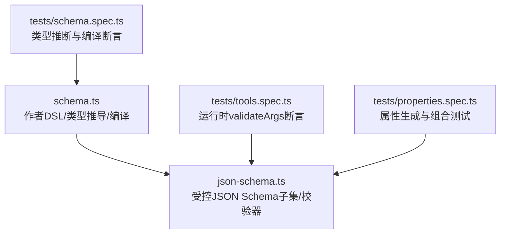
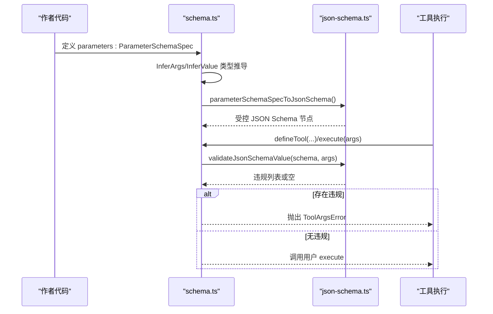
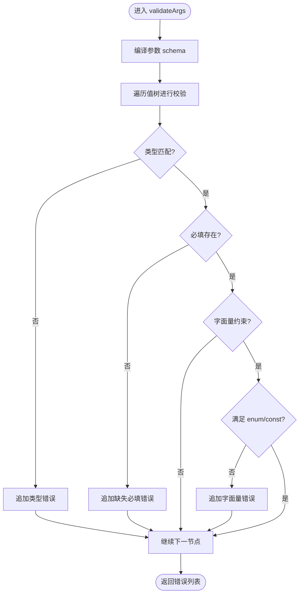
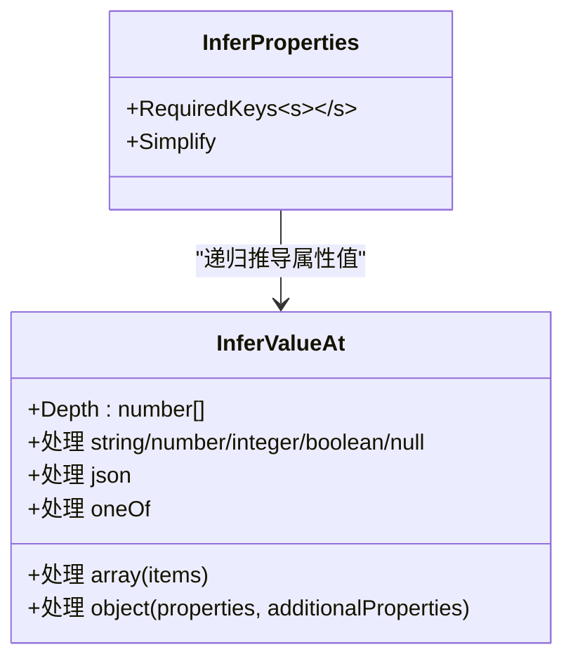
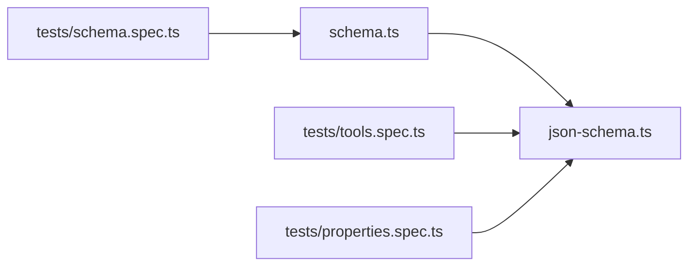

# 参数验证与类型系统

<cite>
**本文引用的文件**
- [packages/core/tools/src/schema.ts](file://packages/core/tools/src/schema.ts)
- [packages/core/tools/src/json-schema.ts](file://packages/core/tools/src/json-schema.ts)
- [packages/core/tools/tests/schema.spec.ts](file://packages/core/tools/tests/schema.spec.ts)
- [packages/core/tools/tests/tools.spec.ts](file://packages/core/tools/tests/tools.spec.ts)
- [packages/core/tools/tests/properties.spec.ts](file://packages/core/tools/tests/properties.spec.ts)
- [docs/subsystems/tools.md](file://docs/subsystems/tools.md)
</cite>

## 目录
1. [简介](#简介)
2. [项目结构](#项目结构)
3. [核心组件](#核心组件)
4. [架构总览](#架构总览)
5. [详细组件分析](#详细组件分析)
6. [依赖关系分析](#依赖关系分析)
7. [性能考量](#性能考量)
8. [故障排查指南](#故障排查指南)
9. [结论](#结论)
10. [附录](#附录)

## 简介
本文件系统性说明 DeepSeek Harness 工具参数验证与类型系统的实现，重点覆盖：
- ParameterSchemaSpec 的使用：基础类型、必填标记、默认值注解、嵌套对象与数组。
- 运行时参数验证机制：类型检查、required 字段校验、字面量约束（enum/const）、精确联合 oneOf。
- InferArgs 类型推导：从 schema 自动生成 TypeScript 类型，包括数组、对象嵌套与 additionalProperties 的影响。
- 复杂参数结构示例：数组、对象嵌套、条件验证（oneOf）。
- additionalProperties 的配置与使用场景。
- 跨字段验证与自定义验证逻辑的处理方式。

## 项目结构
该能力位于 core/tools 包中，主要由两类文件组成：
- 作者面向的 Schema DSL 与类型推导：schema.ts
- 受控 JSON Schema 子集与运行时校验：json-schema.ts
- 配套测试用例用于验证行为与类型推断一致性：tests/*

图表来源
- [packages/core/tools/src/schema.ts:143-175](file://packages/core/tools/src/schema.ts#L143-L175)
- [packages/core/tools/src/json-schema.ts:385-400](file://packages/core/tools/src/json-schema.ts#L385-L400)

章节来源
- [packages/core/tools/src/schema.ts:1-112](file://packages/core/tools/src/schema.ts#L1-L112)
- [packages/core/tools/src/json-schema.ts:1-60](file://packages/core/tools/src/json-schema.ts#L1-L60)

## 核心组件
- ParameterSchemaSpec：工具参数的隐式开放对象根，键为字符串，值为 ParameterPropertySpec；每个属性可标注 required: true 表示必填。
- ValueSchemaSpec：任意 JSON 值的作者级 schema，支持 string/number/integer/boolean/null/array/object/json/oneOf，并允许 enum/const 等字面量约束。
- InferValue<S>：将 ValueSchemaSpec 推导为 TypeScript 类型，最多递归 16 层容器深度，超出回退到 JsonValue。
- InferArgs<S>：将 ParameterSchemaSpec 推导为参数对象类型，根据 required: true 决定属性是否可选。
- parameterSchemaSpecToJsonSchema(spec)：将作者级参数 schema 编译为受控 JSON Schema 节点。
- validateArgs(spec, args)：基于编译后的 schema 对运行时参数进行校验，返回路径化的错误消息数组。
- defineTool(options)：定义工具时自动编译参数与输出 schema，并在执行前进行严格校验。

章节来源
- [packages/core/tools/src/schema.ts:84-112](file://packages/core/tools/src/schema.ts#L84-L112)
- [packages/core/tools/src/schema.ts:143-175](file://packages/core/tools/src/schema.ts#L143-L175)
- [packages/core/tools/src/schema.ts:449-480](file://packages/core/tools/src/schema.ts#L449-L480)
- [packages/core/tools/src/schema.ts:545-617](file://packages/core/tools/src/schema.ts#L545-L617)

## 架构总览
作者通过 ParameterSchemaSpec 声明参数结构；编译期 InferArgs/InferValue 提供强类型；运行期 validateArgs 基于受控 JSON Schema 子集进行严格校验。

图表来源
- [packages/core/tools/src/schema.ts:449-480](file://packages/core/tools/src/schema.ts#L449-L480)
- [packages/core/tools/src/schema.ts:545-617](file://packages/core/tools/src/schema.ts#L545-L617)
- [packages/core/tools/src/json-schema.ts:654-656](file://packages/core/tools/src/json-schema.ts#L654-L656)

## 详细组件分析

### ParameterSchemaSpec 与基础类型
- 基础类型：string、number、integer、boolean、null、array、object、json。
- 字面量约束：enum（枚举）与 const（常量），要求与类型一致。
- 必填标记：在参数属性上设置 required: true 表示必填；未设置则为可选。
- 默认值：default 是注解，不参与运行时默认填充，仅作为元数据保留。
- 嵌套结构：object 必须显式声明 additionalProperties（true/false）以决定开放性；array 通过 items 指定元素 schema。
- 精确联合：oneOf 至少两个分支，用于表达“二选一或多选一”的条件结构。

章节来源
- [packages/core/tools/src/schema.ts:23-95](file://packages/core/tools/src/schema.ts#L23-L95)
- [packages/core/tools/src/schema.ts:96-112](file://packages/core/tools/src/schema.ts#L96-L112)
- [packages/core/tools/src/schema.ts:360-412](file://packages/core/tools/src/schema.ts#L360-L412)

### 运行时参数验证机制
- 类型检查：严格匹配 string/number/integer/boolean/null，number 需为有限非负零的 JSON 数字。
- required 校验：缺失或值为 undefined 均视为缺失必填项。
- 字面量约束：enum 与 const 同时存在时，const 必须是 enum 之一；否则报错。
- 精确联合 oneOf：至少两个分支，且不能与 type 共存；oneOf 旁不支持 properties/required/additionalProperties/items/enum/const。
- 额外键：参数根为隐式开放对象，允许额外键；但 object 若声明 additionalProperties: false，则拒绝未声明键。
- 默认值不应用：validateArgs 仅做校验，不会合成默认值。

图表来源
- [packages/core/tools/src/json-schema.ts:227-376](file://packages/core/tools/src/json-schema.ts#L227-L376)
- [packages/core/tools/src/json-schema.ts:654-656](file://packages/core/tools/src/json-schema.ts#L654-L656)

章节来源
- [packages/core/tools/tests/tools.spec.ts:2473-2550](file://packages/core/tools/tests/tools.spec.ts#L2473-L2550)
- [packages/core/tools/tests/schema.spec.ts:60-112](file://packages/core/tools/tests/schema.spec.ts#L60-L112)

### InferArgs 类型推导
- 必填与可选：根据属性上的 required: true 生成必填键，其余为可选。
- 标量字面量：enum/const 优先于宽泛类型，例如 enum:['a','b'] 推导为 'a'|'b'。
- 数组与对象：items 与 properties 递归推导；当 object 声明 additionalProperties: true 时，结果类型为 { ...props } & Record<string, JsonValue>。
- 深度限制：容器深度超过 16 层后回退为 JsonValue，避免类型实例化栈耗尽。
- oneOf：推导为各分支类型的联合。

图表来源
- [packages/core/tools/src/schema.ts:119-175](file://packages/core/tools/src/schema.ts#L119-L175)

章节来源
- [packages/core/tools/tests/schema.spec.ts:142-187](file://packages/core/tools/tests/schema.spec.ts#L142-L187)
- [packages/core/tools/tests/tools.spec.ts:2354-2406](file://packages/core/tools/tests/tools.spec.ts#L2354-L2406)
- [docs/subsystems/tools.md:123-147](file://docs/subsystems/tools.md#L123-L147)

### 复杂参数结构示例
- 数组：names: { type: 'array'; required: true; items: { type: 'string' } } 推导为 names: string[]。
- 对象嵌套：servers: { type: 'array'; items: { type: 'object'; additionalProperties: true; properties: { host: { type: 'string'; required: true }, port: { type: 'number' } } } } 推导为 servers?: ({ host: string; port?: number } & Record<string, JsonValue>)[]。
- 条件验证：oneOf 可用于表达“二选一或多选一”，如 { type: 'string' } | { type: 'null' }。

章节来源
- [packages/core/tools/tests/tools.spec.ts:2354-2406](file://packages/core/tools/tests/tools.spec.ts#L2354-L2406)
- [packages/core/tools/tests/schema.spec.ts:142-163](file://packages/core/tools/tests/schema.spec.ts#L142-L163)

### additionalProperties 的配置与使用场景
- 参数根为隐式开放对象，允许额外键。
- 对于 object 类型，必须显式声明 additionalProperties: true 或 false：
  - additionalProperties: true：允许任意额外键，类型推导附加 Record<string, JsonValue>。
  - additionalProperties: false：拒绝未声明键，适合严格契约。
- 未声明 additionalProperties 的 object 在作者 schema 层面会被拒绝，确保明确性。

章节来源
- [packages/core/tools/src/schema.ts:64-72](file://packages/core/tools/src/schema.ts#L64-L72)
- [packages/core/tools/src/schema.ts:365-381](file://packages/core/tools/src/schema.ts#L365-L381)
- [packages/core/tools/tests/schema.spec.ts:36-58](file://packages/core/tools/tests/schema.spec.ts#L36-L58)

### 跨字段验证与自定义验证逻辑
- 参数 schema 本身不直接表达跨字段规则；如需跨字段校验，可在工具执行前后使用 settings.validate 或工具自身的 finalizeContent/presentCall/presentResult 等钩子进行软校验或业务校验。
- 推荐做法：
  - 在 schema 中表达尽可能多的单字段约束（类型、enum、const、required、additionalProperties）。
  - 对跨字段约束，在工具执行前或配置写入时进行额外校验，失败则拒绝写入或执行。
  - 展示层（presentCall/presentResult）应容忍历史日志中的旧 schema，采用软校验并回退通用渲染。

章节来源
- [packages/settings/settings/src/index.ts:48-74](file://packages/settings/settings/src/index.ts#L48-L74)
- [packages/core/tools/src/schema.ts:594-617](file://packages/core/tools/src/schema.ts#L594-L617)

## 依赖关系分析
- schema.ts 依赖 json-schema.ts 提供的受控 JSON Schema 子集与校验函数。
- 类型推导（InferValue/InferArgs）完全在编译期完成，不引入运行时开销。
- 运行时 validateArgs 通过 compile -> assertSupportedJsonSchema -> validateJsonSchemaValue 形成闭环。

图表来源
- [packages/core/tools/src/schema.ts:449-480](file://packages/core/tools/src/schema.ts#L449-L480)
- [packages/core/tools/src/json-schema.ts:385-400](file://packages/core/tools/src/json-schema.ts#L385-L400)

章节来源
- [packages/core/tools/src/schema.ts:1-10](file://packages/core/tools/src/schema.ts#L1-L10)
- [packages/core/tools/src/json-schema.ts:1-12](file://packages/core/tools/src/json-schema.ts#L1-L12)

## 性能考量
- 编译与校验均为栈安全实现，使用任务队列而非递归调用，支持深层 schema（如 5000 层 oneOf）。
- 类型推导限制最大容器深度为 16 层，避免 TypeScript 类型实例化栈溢出。
- 校验过程收集所有违规信息，便于一次性修复问题。

章节来源
- [packages/core/tools/src/schema.ts:274-414](file://packages/core/tools/src/schema.ts#L274-L414)
- [packages/core/tools/src/json-schema.ts:227-376](file://packages/core/tools/src/json-schema.ts#L227-L376)
- [packages/core/tools/tests/schema.spec.ts:114-129](file://packages/core/tools/tests/schema.spec.ts#L114-L129)

## 故障排查指南
常见错误与定位方法：
- 类型不匹配：检查字段类型是否与 schema 一致，注意 number 需为有限非负零的 JSON 数字。
- 必填缺失：确认 required: true 的字段是否存在且不为 undefined。
- 字面量约束冲突：enum 与 const 的类型必须一致，const 必须在 enum 范围内。
- oneOf 使用不当：oneOf 至少两个分支，且不能与 type 共存；oneOf 旁不支持其他约束关键字。
- 循环引用：schema 中出现自引用会导致编译期报错。
- 额外键被拒：object 若声明 additionalProperties: false，请确保只包含已声明的属性。

章节来源
- [packages/core/tools/tests/tools.spec.ts:2473-2550](file://packages/core/tools/tests/tools.spec.ts#L2473-L2550)
- [packages/core/tools/tests/schema.spec.ts:60-112](file://packages/core/tools/tests/schema.spec.ts#L60-L112)
- [packages/core/tools/src/json-schema.ts:227-376](file://packages/core/tools/src/json-schema.ts#L227-L376)

## 结论
DeepSeek Harness 的参数验证与类型系统通过作者级 schema 与受控 JSON Schema 子集的结合，提供了：
- 编译期强类型推导（InferArgs/InferValue），提升开发体验与安全性。
- 运行期严格校验（validateArgs），保证输入数据的正确性与一致性。
- 灵活的复杂结构支持（数组、对象嵌套、oneOf），以及明确的 additionalProperties 语义。
- 可扩展的跨字段与自定义验证策略，兼顾契约严谨性与业务灵活性。

## 附录
- 参考文档：tools 子系统文档对 ParameterSchemaSpec、InferValue、InferArgs 的定义与用法进行了说明。
- 测试用例：提供了大量边界情况与组合行为的断言，可作为最佳实践参考。

章节来源
- [docs/subsystems/tools.md:123-147](file://docs/subsystems/tools.md#L123-L147)
- [packages/core/tools/tests/properties.spec.ts:142-175](file://packages/core/tools/tests/properties.spec.ts#L142-L175)