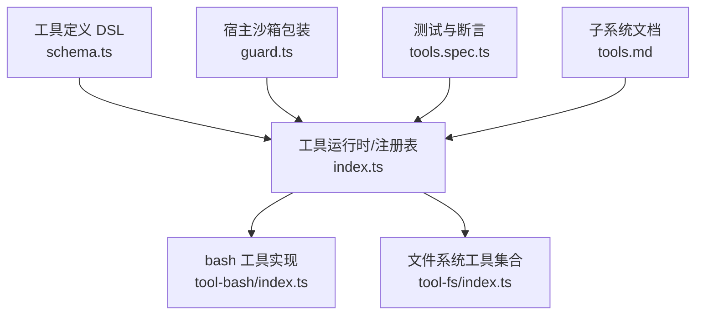
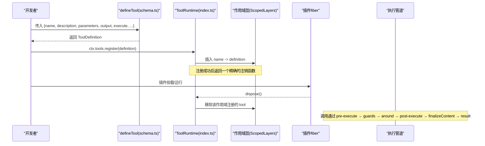
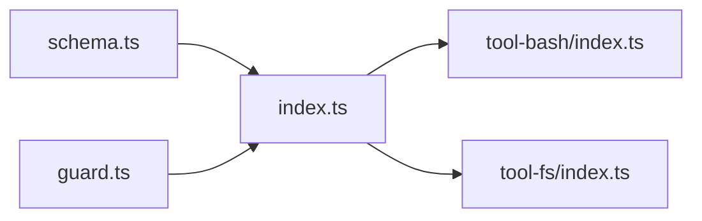
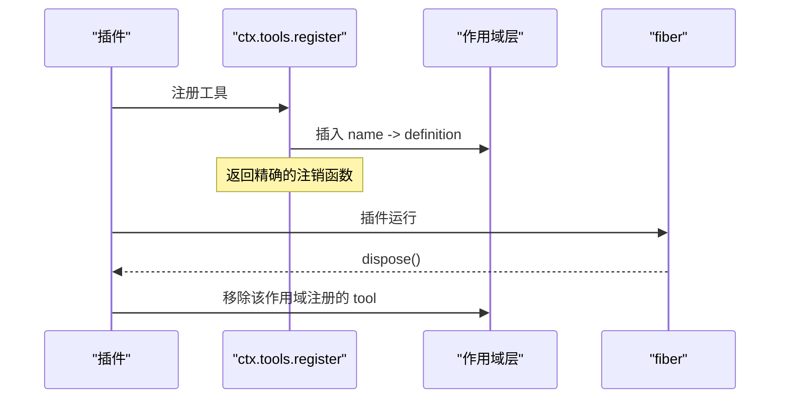
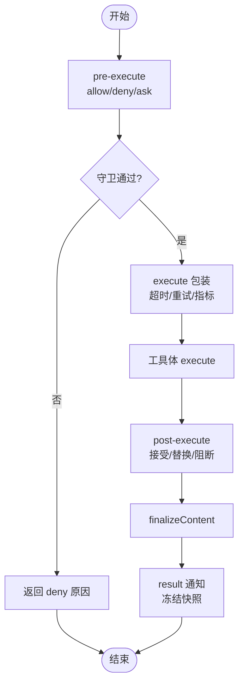

# 工具定义与注册

<cite>
**本文引用的文件**
- [packages/core/tools/src/index.ts](file://packages/core/tools/src/index.ts)
- [packages/core/tools/src/schema.ts](file://packages/core/tools/src/schema.ts)
- [packages/shell/tool-bash/src/index.ts](file://packages/shell/tool-bash/src/index.ts)
- [packages/fs/tool-fs/src/index.ts](file://packages/fs/tool-fs/src/index.ts)
- [packages/extensions/cordis-host-runner/src/guard.ts](file://packages/extensions/cordis-host-runner/src/guard.ts)
- [packages/core/tools/tests/tools.spec.ts](file://packages/core/tools/tests/tools.spec.ts)
- [docs/subsystems/tools.md](file://docs/subsystems/tools.md)
</cite>

## 目录
1. [简介](#简介)
2. [项目结构](#项目结构)
3. [核心组件](#核心组件)
4. [架构总览](#架构总览)
5. [详细组件分析](#详细组件分析)
6. [依赖关系分析](#依赖关系分析)
7. [性能考虑](#性能考虑)
8. [故障排查指南](#故障排查指南)
9. [结论](#结论)
10. [附录](#附录)

## 简介
本文件聚焦 DeepSeek Harness 的“工具定义与注册”机制，系统性说明如何使用 defineTool 定义工具、如何通过 ctx.tools.register 完成注册、工具的生命周期（含插件 fiber dispose 时自动注销）、以及工具元数据（名称、描述、参数 schema、返回值 schema）的作用与配置方式。文档同时提供从简单文本处理到复杂文件/命令操作的完整示例指引，并给出关键流程图与时序图帮助理解。

## 项目结构
围绕工具系统的关键代码分布在以下位置：
- 工具运行时与注册表：packages/core/tools/src/index.ts
- 工具参数/返回值 Schema DSL 与类型推断：packages/core/tools/src/schema.ts
- 具体工具实现示例（bash、文件系统）：packages/shell/tool-bash/src/index.ts、packages/fs/tool-fs/src/index.ts
- 沙箱侧对 tools 的只读视图与注册入口封装：packages/extensions/cordis-host-runner/src/guard.ts
- 生命周期与注册行为测试：packages/core/tools/tests/tools.spec.ts
- 子系统文档：docs/subsystems/tools.md

**图示来源**
- [packages/core/tools/src/index.ts:780-800](file://packages/core/tools/src/index.ts#L780-L800)
- [packages/core/tools/src/schema.ts:482-510](file://packages/core/tools/src/schema.ts#L482-L510)
- [packages/shell/tool-bash/src/index.ts:241-392](file://packages/shell/tool-bash/src/index.ts#L241-L392)
- [packages/fs/tool-fs/src/index.ts:53-79](file://packages/fs/tool-fs/src/index.ts#L53-L79)
- [packages/extensions/cordis-host-runner/src/guard.ts:639-655](file://packages/extensions/cordis-host-runner/src/guard.ts#L639-L655)
- [packages/core/tools/tests/tools.spec.ts:1984-2003](file://packages/core/tools/tests/tools.spec.ts#L1984-L2003)
- [docs/subsystems/tools.md:478-570](file://docs/subsystems/tools.md#L478-L570)

**章节来源**
- [packages/core/tools/src/index.ts:780-800](file://packages/core/tools/src/index.ts#L780-L800)
- [packages/core/tools/src/schema.ts:482-510](file://packages/core/tools/src/schema.ts#L482-L510)
- [packages/shell/tool-bash/src/index.ts:241-392](file://packages/shell/tool-bash/src/index.ts#L241-L392)
- [packages/fs/tool-fs/src/index.ts:53-79](file://packages/fs/tool-fs/src/index.ts#L53-L79)
- [packages/extensions/cordis-host-runner/src/guard.ts:639-655](file://packages/extensions/cordis-host-runner/src/guard.ts#L639-L655)
- [packages/core/tools/tests/tools.spec.ts:1984-2003](file://packages/core/tools/tests/tools.spec.ts#L1984-L2003)
- [docs/subsystems/tools.md:478-570](file://docs/subsystems/tools.md#L478-L570)

## 核心组件
- defineTool：统一的工具定义入口，接收 name、description、parameters、output、execute 等字段，并负责参数/返回值的 JSON Schema 编译与类型推断。
- ToolRuntime：工具运行时与执行管道，提供 register、schemas、get、execute、executionMode 等方法；维护作用域层叠、可见性过滤、预/后策略水线、守卫、结果投影等。
- Schema DSL：ValueSchemaSpec/ParameterSchemaSpec 将作者友好的参数/返回值声明编译为标准 JSON Schema，并提供 InferArgs/InferValue 类型推导。
- 工具元数据：name/description/parameters 构成模型可见的工具能力描述；output.schema 约束成功返回值；timeoutMs/isConcurrencySafe/presentCall/presentResult 为执行与 UI 呈现的元数据。

**章节来源**
- [packages/core/tools/src/schema.ts:482-510](file://packages/core/tools/src/schema.ts#L482-L510)
- [packages/core/tools/src/index.ts:213-280](file://packages/core/tools/src/index.ts#L213-L280)
- [docs/subsystems/tools.md:9-151](file://docs/subsystems/tools.md#L9-L151)

## 架构总览
下图展示了从 defineTool 定义到 ctx.tools.register 注册，再到执行管道的关键路径，以及 fiber dispose 时的自动注销。

**图示来源**
- [packages/core/tools/src/schema.ts:482-510](file://packages/core/tools/src/schema.ts#L482-L510)
- [packages/core/tools/src/index.ts:1022-1053](file://packages/core/tools/src/index.ts#L1022-L1053)
- [packages/core/tools/tests/tools.spec.ts:1984-2003](file://packages/core/tools/tests/tools.spec.ts#L1984-L2003)

**章节来源**
- [packages/core/tools/src/index.ts:1022-1053](file://packages/core/tools/src/index.ts#L1022-L1053)
- [packages/core/tools/tests/tools.spec.ts:1984-2003](file://packages/core/tools/tests/tools.spec.ts#L1984-L2003)

## 详细组件分析

### 使用 defineTool 定义工具
- 必填字段
  - name：工具名，需唯一且不可为保留名（如 PTC 模式下的 run_code）。
  - description：人类可读的描述，会进入模型可见的工具列表。
  - parameters：使用 ParameterSchemaSpec 声明参数，支持 string/number/integer/boolean/null/array/object/json/oneOf，并通过 required: true 标记必填项。
  - output：包含 schema（对成功返回值进行校验）、render（生成模型可见内容块）、presentationMeta（顶层调用的可回放展示元数据）。
- 可选字段
  - timeoutMs：协作式超时预算（毫秒），由外部策略执行器在 tools/execute 中生效。
  - isConcurrencySafe：纯函数分类器，用于允许并行分组。
  - presentCall/presentResult：UI 呈现意图（终端、diff、搜索、读取等卡片）。
- 类型推断
  - InferArgs<S> 将参数 map 转换为 TS 对象键的可选项；InferValue<O> 将输出 schema 映射为值类型。

参考路径
- [packages/core/tools/src/schema.ts:482-510](file://packages/core/tools/src/schema.ts#L482-L510)
- [docs/subsystems/tools.md:98-151](file://docs/subsystems/tools.md#L98-L151)

**章节来源**
- [packages/core/tools/src/schema.ts:482-510](file://packages/core/tools/src/schema.ts#L482-L510)
- [docs/subsystems/tools.md:98-151](file://docs/subsystems/tools.md#L98-L151)

### 通过 ctx.tools.register 注册工具
- 注册过程
  - 校验 output 结构（schema/render/presentationMeta）与支持的 JSON Schema。
  - 校验 timeoutMs 为正有限数。
  - 拒绝保留名（如 run_code）。
  - 通过 layers.effect 在当前作用域插入工具，并返回一个精确的注销函数。
- 作用域与可见性
  - 全局与 agent 作用域注册可叠加；同层重复名报错；受限作用域可通过 restrict 过滤继承的全局工具。
- 只读视图
  - 沙箱侧暴露的 ctx.tools.get/schemas 仅返回模型可见的 schema 视图，不暴露 execute 等回调，防止绕过执行管道。

参考路径
- [packages/core/tools/src/index.ts:1022-1053](file://packages/core/tools/src/index.ts#L1022-L1053)
- [packages/extensions/cordis-host-runner/src/guard.ts:639-655](file://packages/extensions/cordis-host-runner/src/guard.ts#L639-L655)
- [docs/subsystems/tools.md:478-570](file://docs/subsystems/tools.md#L478-L570)

**章节来源**
- [packages/core/tools/src/index.ts:1022-1053](file://packages/core/tools/src/index.ts#L1022-L1053)
- [packages/extensions/cordis-host-runner/src/guard.ts:639-655](file://packages/extensions/cordis-host-runner/src/guard.ts#L639-L655)
- [docs/subsystems/tools.md:478-570](file://docs/subsystems/tools.md#L478-L570)

### 工具生命周期管理（fiber dispose 自动注销）
- 注册返回的 disposer 可直接调用以注销工具。
- 当插件 fiber 被 dispose 时，其在该 fiber 作用域内注册的工具会被自动移除，避免 HMR 或热更新导致重复注册。
- 测试覆盖：重复注册抛错；fiber.dispose 后 schemas 列表中不再包含已注销工具。

参考路径
- [packages/core/tools/tests/tools.spec.ts:1984-2003](file://packages/core/tools/tests/tools.spec.ts#L1984-L2003)

**章节来源**
- [packages/core/tools/tests/tools.spec.ts:1984-2003](file://packages/core/tools/tests/tools.spec.ts#L1984-L2003)

### 执行管道与事件水线
- 顺序：pre-execute（allow/deny/ask）→ 守卫（monotonic guard）→ execute（around-dispatch 包装）→ post-execute（接受/替换/阻断）→ finalizeContent（定义级内容最终化）→ result（冻结快照通知）。
- 取消与超时：exec.signal 贯穿；timeoutMs 由外部策略在 execute 阶段生效；取消可能发生在 body 之前或之后，分别对应不同错误码。
- 结果：成功时 snapshot + validate + render/presentationMeta；失败时统一为结构化错误。

参考路径
- [docs/subsystems/tools.md:170-405](file://docs/subsystems/tools.md#L170-L405)

**章节来源**
- [docs/subsystems/tools.md:170-405](file://docs/subsystems/tools.md#L170-L405)

### 示例一：简单文本处理工具（概念流程）
- 目标：将输入字符串转为大写并返回。
- 关键点
  - parameters 定义输入字段（例如 text）。
  - output.schema 定义返回结构（例如 { text: string }）。
  - render 将返回值渲染为模型可见内容。
  - execute 执行转换逻辑，返回符合 output.schema 的值。
- 适用场景：轻量、无副作用、可并行的工具。

[本节为概念性说明，不直接分析具体文件]

### 示例二：复杂文件操作工具（基于文件系统工具集）
- 目标：提供 read/write/edit/read_image 等文件能力。
- 关键点
  - 通过 applyReadTool/applyWriteTool/applyEditTool/applyReadImageTool 组合注册多个工具。
  - 使用 FsSandboxController 统一处理沙箱策略与升级审批。
  - 参数与输出均通过 Schema DSL 严格声明，保证类型安全与模型提示质量。
- 参考路径
  - [packages/fs/tool-fs/src/index.ts:53-79](file://packages/fs/tool-fs/src/index.ts#L53-L79)

**章节来源**
- [packages/fs/tool-fs/src/index.ts:53-79](file://packages/fs/tool-fs/src/index.ts#L53-L79)

### 示例三：命令执行工具（bash）
- 目标：执行 bash 命令，支持前台/后台、工作目录、超时、沙箱权限升级等。
- 关键点
  - parameters 声明 command/description/timeoutMs/workdir/run_in_background/sandbox_permissions/justification。
  - output 使用 oneOf 区分后台任务与前台结果，并对 stdout/stderr/sandbox 等字段做严格约束。
  - presentCall/presentResult 提供终端卡片与结果卡片呈现。
  - 执行前进行参数校验与沙箱策略解析，必要时发起升级审批。
- 参考路径
  - [packages/shell/tool-bash/src/index.ts:241-392](file://packages/shell/tool-bash/src/index.ts#L241-L392)

**章节来源**
- [packages/shell/tool-bash/src/index.ts:241-392](file://packages/shell/tool-bash/src/index.ts#L241-L392)

### 工具元数据的作用与配置
- 模型可见元数据
  - name/description/parameters：决定模型如何发现与选择工具。
  - output.schema：约束成功返回值，确保下游稳定消费。
- 执行与 UI 元数据
  - timeoutMs：协作式超时预算。
  - isConcurrencySafe：是否允许与兄弟调用并行。
  - presentCall/presentResult：UI 呈现意图（终端、diff、搜索、读取、Web 等）。
- 安全与可见性
  - 沙箱侧 get/schemas 仅暴露 schema 视图，不暴露 execute，防止绕过执行管道。

参考路径
- [packages/core/tools/src/index.ts:213-280](file://packages/core/tools/src/index.ts#L213-L280)
- [packages/extensions/cordis-host-runner/src/guard.ts:639-655](file://packages/extensions/cordis-host-runner/src/guard.ts#L639-L655)
- [docs/subsystems/tools.md:9-151](file://docs/subsystems/tools.md#L9-L151)

**章节来源**
- [packages/core/tools/src/index.ts:213-280](file://packages/core/tools/src/index.ts#L213-L280)
- [packages/extensions/cordis-host-runner/src/guard.ts:639-655](file://packages/extensions/cordis-host-runner/src/guard.ts#L639-L655)
- [docs/subsystems/tools.md:9-151](file://docs/subsystems/tools.md#L9-L151)

## 依赖关系分析
- 模块耦合
  - schema.ts 提供 defineTool 与 Schema DSL，被 index.ts 复用。
  - index.ts 作为运行时核心，被各工具包（bash、fs 等）通过 ctx.tools.register 使用。
  - guard.ts 在宿主沙箱中对 tools 进行只读封装，限制 package 代码直接调用 execute。
- 外部依赖
  - 执行管道依赖 Cordis 上下文与 Scope 层；JSON Schema 校验依赖 schemastery。
- 循环依赖
  - 当前未见循环导入；工具实现通过注入服务（如 shell、fs、jobs）解耦。

**图示来源**
- [packages/core/tools/src/schema.ts:482-510](file://packages/core/tools/src/schema.ts#L482-L510)
- [packages/core/tools/src/index.ts:780-800](file://packages/core/tools/src/index.ts#L780-L800)
- [packages/shell/tool-bash/src/index.ts:241-392](file://packages/shell/tool-bash/src/index.ts#L241-L392)
- [packages/fs/tool-fs/src/index.ts:53-79](file://packages/fs/tool-fs/src/index.ts#L53-L79)
- [packages/extensions/cordis-host-runner/src/guard.ts:639-655](file://packages/extensions/cordis-host-runner/src/guard.ts#L639-L655)

**章节来源**
- [packages/core/tools/src/index.ts:780-800](file://packages/core/tools/src/index.ts#L780-L800)
- [packages/shell/tool-bash/src/index.ts:241-392](file://packages/shell/tool-bash/src/index.ts#L241-L392)
- [packages/fs/tool-fs/src/index.ts:53-79](file://packages/fs/tool-fs/src/index.ts#L53-L79)
- [packages/extensions/cordis-host-runner/src/guard.ts:639-655](file://packages/extensions/cordis-host-runner/src/guard.ts#L639-L655)

## 性能考虑
- 并发控制
  - 通过 isConcurrencySafe 标识可并行的工具；PTC 模式下可通过 maxParallelSubCalls 限制子调用并发度。
- 超时与取消
  - timeoutMs 配合 exec.signal 实现协作式超时；取消可能在 body 前或后发生，需妥善处理资源清理。
- 结果投影
  - render/presentationMeta 应为纯函数，避免在 UI 流式与回放中产生副作用。

[本节提供通用指导，不直接分析具体文件]

## 故障排查指南
- 常见错误
  - 重复注册：同一作用域重复同名工具会抛出异常。
  - 非法超时：timeoutMs 非正有限数会抛错。
  - 未知工具：调用未注册工具会返回 UNKNOWN_TOOL。
  - 输出校验失败：execute 返回值或投影不符合 output.schema 会抛出 INVALID_TOOL_OUTPUT。
- 定位建议
  - 检查 schemas() 输出确认工具可见性。
  - 检查 tools/change 事件确认注册/注销时机。
  - 在 tools/post-execute 中捕获并替换内容或阻断错误反馈。

参考路径
- [packages/core/tools/tests/tools.spec.ts:1972-2003](file://packages/core/tools/tests/tools.spec.ts#L1972-L2003)
- [docs/subsystems/tools.md:478-570](file://docs/subsystems/tools.md#L478-L570)

**章节来源**
- [packages/core/tools/tests/tools.spec.ts:1972-2003](file://packages/core/tools/tests/tools.spec.ts#L1972-L2003)
- [docs/subsystems/tools.md:478-570](file://docs/subsystems/tools.md#L478-L570)

## 结论
DeepSeek Harness 的工具系统通过 defineTool 提供强类型的参数/返回值声明，结合 ctx.tools.register 的作用域注册与 fiber 生命周期自动注销，实现了安全、可扩展、可观测的工具生态。元数据（名称、描述、参数与返回值 schema、超时、并发、UI 呈现）既服务于模型发现与提示，也支撑执行管道与 UI 呈现。实际工程中推荐优先使用 Schema DSL 与现成工具（如 bash、fs）作为模板，遵循执行管道与策略约定，以获得一致性与可维护性。

[本节为总结性内容，不直接分析具体文件]

## 附录

### 工具注册与注销时序（含 fiber dispose）

**图示来源**
- [packages/core/tools/src/index.ts:1022-1053](file://packages/core/tools/src/index.ts#L1022-L1053)
- [packages/core/tools/tests/tools.spec.ts:1984-2003](file://packages/core/tools/tests/tools.spec.ts#L1984-L2003)

### 工具执行流水线（简化）

**图示来源**
- [docs/subsystems/tools.md:170-405](file://docs/subsystems/tools.md#L170-L405)