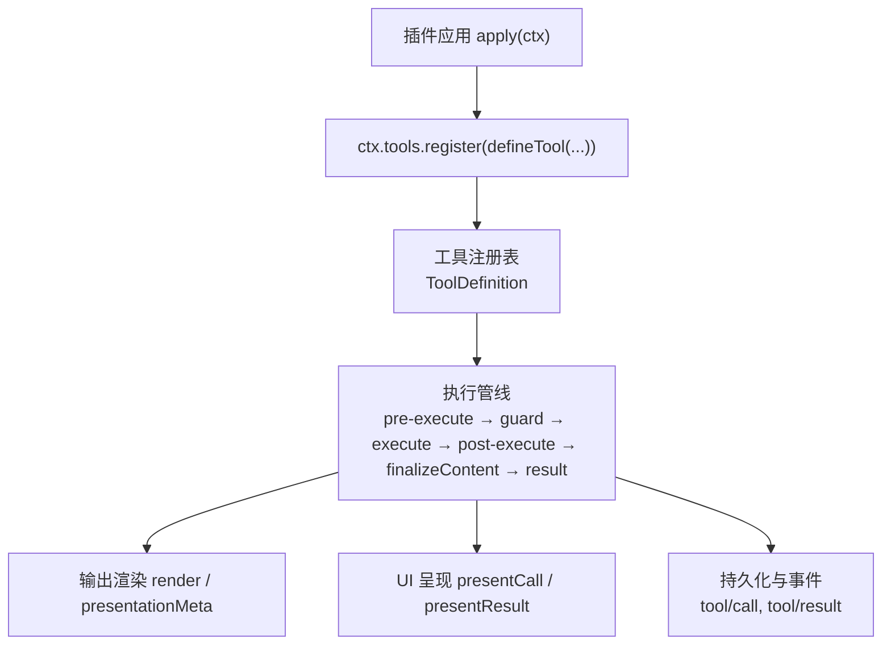
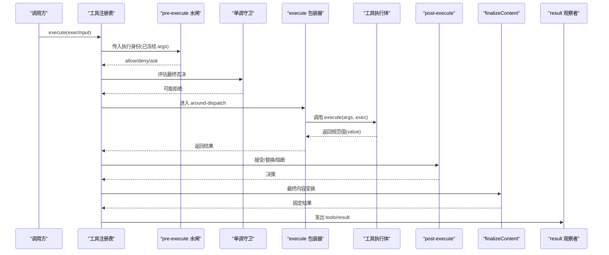
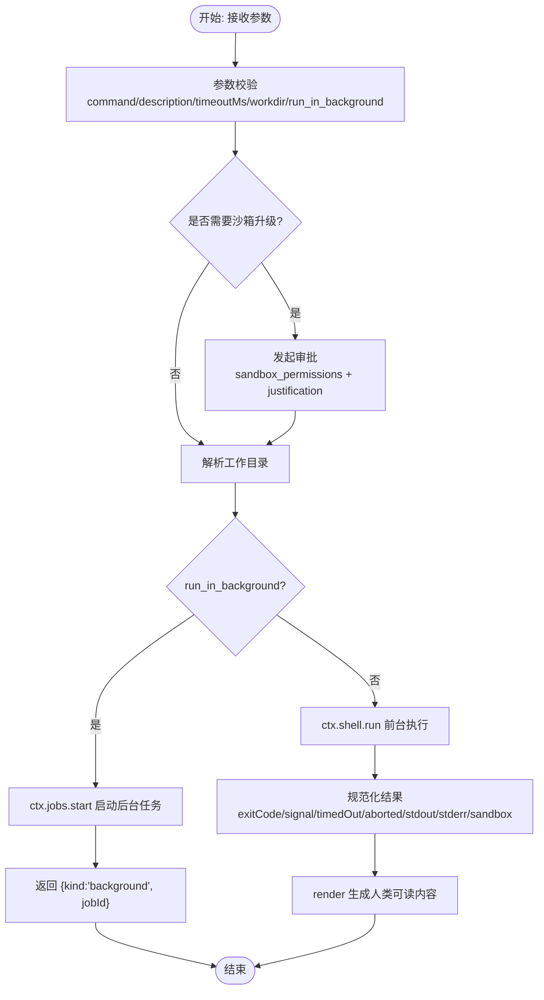
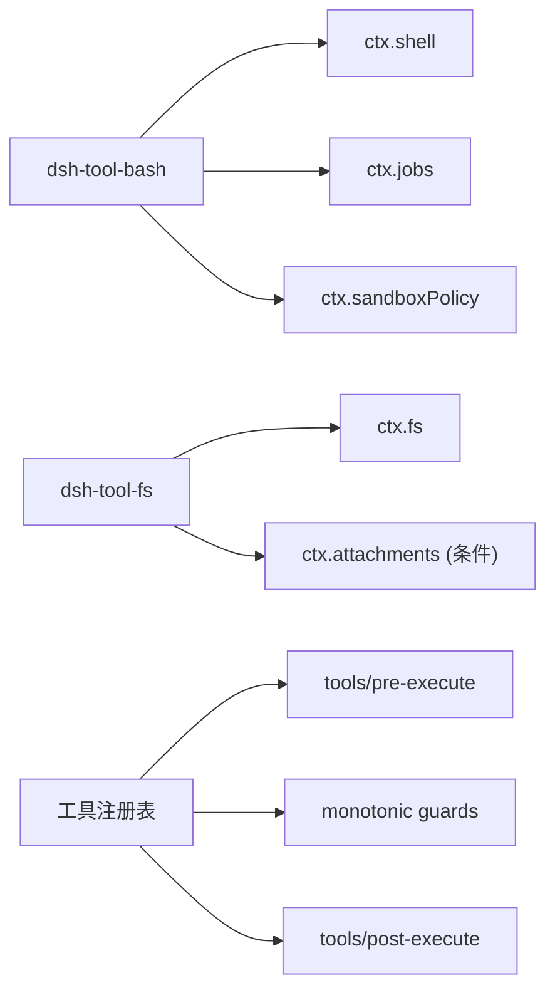

# 工具插件开发

<cite>
**本文引用的文件**
- [adding-a-tool.md](file://docs/cookbook/adding-a-tool.md)
- [tools.md](file://docs/subsystems/tools.md)
- [tool-catalog.md](file://docs/tool-catalog.md)
- [sandbox.md](file://docs/subsystems/sandbox.md)
- [testing.md](file://docs/testing.md)
- [index.ts（bash 工具）](file://packages/shell/tool-bash/src/index.ts)
- [index.ts（文件系统工具套件）](file://packages/fs/tool-fs/src/index.ts)
</cite>

## 目录
1. [简介](#简介)
2. [项目结构](#项目结构)
3. [核心组件](#核心组件)
4. [架构总览](#架构总览)
5. [详细组件分析](#详细组件分析)
6. [依赖关系分析](#依赖关系分析)
7. [性能考虑](#性能考虑)
8. [故障排查指南](#故障排查指南)
9. [结论](#结论)
10. [附录](#附录)

## 简介
本指南面向 DeepSeek Harness 的工具插件开发者，系统讲解如何定义与注册工具、声明参数与返回值 Schema、实现执行函数与错误处理、配置元数据（描述、权限）、理解执行环境（工作区访问、文件系统操作、外部命令执行），并提供从简单文本处理到复杂文件操作的完整示例路径。同时覆盖调试与测试方法、安全与最佳实践，帮助你在生产环境中构建可靠、可观测、可审计的工具。

## 项目结构
DeepSeek Harness 将“工具”作为一等公民：每个工具由“模型可见的 Schema + 执行函数 + 输出渲染 + 可选 UI 呈现”组成，并通过统一的工具注册表进行调度、策略拦截与结果持久化。仓库中提供了丰富的参考实现与文档：
- 工具作者参考与契约说明
- 工具子系统类型、执行管线与扩展点
- 内置工具目录与 Schema 清单
- 沙箱与安全策略
- 测试策略与分层验证

图表来源
- [tools.md:13-94](file://docs/subsystems/tools.md#L13-L94)
- [tools.md:170-375](file://docs/subsystems/tools.md#L170-L375)

章节来源
- [tools.md:1-152](file://docs/subsystems/tools.md#L1-L152)
- [adding-a-tool.md:7-66](file://docs/cookbook/adding-a-tool.md#L7-L66)

## 核心组件
- 工具定义 ToolDefinition：包含模型可见的 name/description/parameters、强制的输出 output、execute 执行函数、可选 finalizeContent、timeoutMs、isConcurrencySafe、presentCall/presentResult。
- 统一 Schema DSL：参数与输出共用 ValueSchemaSpec，支持标量、数组、对象、oneOf、enum/const 等；运行时严格校验并生成 JSON Schema。
- 执行上下文与身份保护：args 在政策前被冻结为不可变值，exec.token/callId/name/agent/signal 等不可变；wrapper 仅能替换 signal，不能移除。
- 执行管线与扩展点：tools/pre-execute（允许/拒绝/询问）、monotonic guards（最终否决）、tools/execute（超时/重试/指标）、tools/post-execute（替换内容或值）、finalizeContent（最终内容变换）、tools/result（只读观察）。
- UI 呈现协议：presentCall/presentResult 返回中性 card 意图（generic/terminal/diff/read/search/web），与具体客户端解耦。

章节来源
- [tools.md:13-94](file://docs/subsystems/tools.md#L13-L94)
- [tools.md:98-152](file://docs/subsystems/tools.md#L98-L152)
- [tools.md:170-375](file://docs/subsystems/tools.md#L170-L375)
- [tools.md:459-468](file://docs/subsystems/tools.md#L459-L468)

## 架构总览
下图展示了工具从注册到执行的端到端流程，包括策略、执行、渲染与持久化。

图表来源
- [tools.md:170-375](file://docs/subsystems/tools.md#L170-L375)
- [tools.md:576-719](file://docs/subsystems/tools.md#L576-L719)

## 详细组件分析

### 工具定义与注册（最小形态）
- 使用 defineTool 声明 name、description、parameters、output（schema + render + 可选 presentationMeta）、execute。
- 参数通过 ParameterSchemaSpec 声明，required 标记必填；输出 schema 决定 execute 返回值的类型约束。
- 注册是 effect-based：fiber 销毁时自动注销工具；schemas() 仅暴露模型可见字段。

章节来源
- [adding-a-tool.md:7-48](file://docs/cookbook/adding-a-tool.md#L7-L48)
- [tools.md:13-94](file://docs/subsystems/tools.md#L13-L94)

### 执行契约与错误处理
- 参数校验：defineTool 在 execute 前完成类型、必填、字面量、union、嵌套校验；未表达的业务约束需自行检查。
- 返回值：只能返回一个符合 output.schema 的规范 JSON 值；渲染与展示逻辑在 render/presentationMeta 中完成。
- 错误语义：抛出异常或返回非法值均视为 isError；基础设施失败应抛错，领域成功即使状态不理想也应以规范值表达。
- 取消信号：必须尊重 exec.signal，及时中止进行中工作。
- 长任务：通过 run_in_background 与 ctx.jobs.start 注册后台任务，返回句柄；前台工作仍受 exec.signal 控制。

章节来源
- [adding-a-tool.md:40-66](file://docs/cookbook/adding-a-tool.md#L40-L66)
- [tools.md:170-375](file://docs/subsystems/tools.md#L170-L375)

### 元数据与权限
- 描述信息：name/description/parameters.description 用于系统提示组装与 UI 展示。
- 权限控制：通过 tools/pre-execute 实现可扩展的允许/拒绝/询问策略；通过 ctx.tools.guard 设置最终单调否决；结合沙箱模式与审批流实现细粒度授权。
- 并发安全：isConcurrencySafe 声明是否可与兄弟调用并行；true 才加入并行池。

章节来源
- [tools.md:53-74](file://docs/subsystems/tools.md#L53-L74)
- [tools.md:153-172](file://docs/subsystems/tools.md#L153-L172)
- [tools.md:376-404](file://docs/subsystems/tools.md#L376-L404)

### 执行环境与资源访问
- 工作区与工作目录：工具可通过会话 cwd 与 workdir 解析实际工作目录；相对路径基于会话工作区解析。
- 文件系统：通过 ctx.fs 提供的 read/write/edit/read_image 等能力；读取窗口、行/字节上限、流式读取阈值可配置。
- 外部命令：通过 ctx.shell 执行 bash/pwsh；支持超时、工作目录、沙箱模式、后台运行与作业管理。
- 沙箱策略：SandboxMode（read-only/workspace-write/danger-full-access）与执行完整性（full/partial）；每调用解析策略，必要时走审批升级。

章节来源
- [index.ts（bash 工具）:144-156](file://packages/shell/tool-bash/src/index.ts#L144-L156)
- [index.ts（bash 工具）:242-393](file://packages/shell/tool-bash/src/index.ts#L242-L393)
- [index.ts（文件系统工具套件）:21-79](file://packages/fs/tool-fs/src/index.ts#L21-L79)
- [sandbox.md:9-94](file://docs/subsystems/sandbox.md#L9-L94)
- [sandbox.md:41-79](file://docs/subsystems/sandbox.md#L41-L79)

### 完整的工具开发示例（路径指引）
- 简单文本处理工具：参考“最小形态”与“执行契约”，以 defineTool 注册，参数 schema 校验输入，output.render 输出人类可读内容，presentationMeta 提供可回放的结构化元数据。
  - 参考路径：[adding-a-tool.md:7-66](file://docs/cookbook/adding-a-tool.md#L7-L66)
- 复杂文件操作工具：参考文件系统工具套件，组合 read/write/edit/read_image，配合沙箱控制器与观察策略，确保读写安全与 UI 呈现（diff/read）。
  - 参考路径：[index.ts（文件系统工具套件）:21-79](file://packages/fs/tool-fs/src/index.ts#L21-L79)
- 外部命令工具：参考 bash 工具，演示参数校验、工作目录解析、沙箱策略与审批升级、前台/后台执行、终端卡片呈现与退出码解析。
  - 参考路径：[index.ts（bash 工具）:55-93](file://packages/shell/tool-bash/src/index.ts#L55-L93)
  - 参考路径：[index.ts（bash 工具）:102-136](file://packages/shell/tool-bash/src/index.ts#L102-L136)
  - 参考路径：[index.ts（bash 工具）:190-393](file://packages/shell/tool-bash/src/index.ts#L190-L393)

章节来源
- [adding-a-tool.md:7-66](file://docs/cookbook/adding-a-tool.md#L7-L66)
- [index.ts（文件系统工具套件）:21-79](file://packages/fs/tool-fs/src/index.ts#L21-L79)
- [index.ts（bash 工具）:55-136](file://packages/shell/tool-bash/src/index.ts#L55-L136)
- [index.ts（bash 工具）:190-393](file://packages/shell/tool-bash/src/index.ts#L190-L393)

### 工具执行流程图（以 bash 为例）

图表来源
- [index.ts（bash 工具）:55-93](file://packages/shell/tool-bash/src/index.ts#L55-L93)
- [index.ts（bash 工具）:144-156](file://packages/shell/tool-bash/src/index.ts#L144-L156)
- [index.ts（bash 工具）:242-393](file://packages/shell/tool-bash/src/index.ts#L242-L393)

## 依赖关系分析
- 工具包与模型可见名称映射：工具包名与对外工具名一一对应，部分工具具备部署别名或条件注册（如 image 工具需要 attachments）。
- 服务依赖：多数工具依赖 ctx.tools、ctx.systemPrompt，以及特定能力（shell/fs/jobs/approval/sandboxPolicy 等）。
- 策略与扩展：工具不内嵌部署策略，策略通过 pre-execute/guard/post-execute 等扩展点注入，保持工具与策略解耦。

图表来源
- [tool-catalog.md:16-43](file://docs/tool-catalog.md#L16-L43)
- [index.ts（bash 工具）:30-32](file://packages/shell/tool-bash/src/index.ts#L30-L32)
- [index.ts（文件系统工具套件）:18-23](file://packages/fs/tool-fs/src/index.ts#L18-L23)

章节来源
- [tool-catalog.md:16-43](file://docs/tool-catalog.md#L16-L43)

## 性能考虑
- 避免在 execute 中返回超大中间值；仅返回必要的规范值，渲染与展示在 render/presentationMeta 中进行。
- 合理使用 isConcurrencySafe 提升并行度；对共享状态需保证并发安全。
- 长任务优先使用后台模式（run_in_background），通过 job_* 工具管理与采集输出。
- 利用 timeoutMs 与 exec.signal 控制超时与取消，避免资源泄漏。
- 大文件读取采用流式与窗口限制（readLimit/maxBytes/streamMinSize），减少内存占用。

章节来源
- [tools.md:53-74](file://docs/subsystems/tools.md#L53-L74)
- [index.ts（文件系统工具套件）:25-41](file://packages/fs/tool-fs/src/index.ts#L25-L41)
- [index.ts（bash 工具）:242-393](file://packages/shell/tool-bash/src/index.ts#L242-L393)

## 故障排查指南
- 常见错误分类：
  - 参数校验失败：INVALID_ARGS（类型/必填/字面量/union 不匹配）
  - 输出校验失败：INVALID_TOOL_OUTPUT（execute 返回值不符合 output.schema）
  - 未知工具：UNKNOWN_TOOL（工具不可见或未注册）
  - 沙箱不可用：SANDBOX_UNAVAILABLE（无可用后端）
- 定位步骤：
  - 检查 parameters 与 output.schema 是否一致且完备
  - 确认 execute 中是否尊重 exec.signal 并及时中止
  - 查看 pre-execute/guard 是否拒绝或要求审批
  - 对于命令执行，区分“命令失败”和“沙箱基础设施失败”（runnerFailureRules）
- 日志与回放：
  - 使用 tools/result 观察最终冻结结果
  - 通过 presentCall/presentResult 与 presentationMeta 确保回放一致性

章节来源
- [tools.md:170-375](file://docs/subsystems/tools.md#L170-L375)
- [sandbox.md:152-157](file://docs/subsystems/sandbox.md#L152-L157)

## 结论
DeepSeek Harness 的工具体系以“强类型 Schema + 严格执行契约 + 可扩展策略 + 中立 UI 呈现”为核心，既保证了模型交互的一致性与安全性，又为插件开发者提供了清晰的扩展点与丰富的参考实现。遵循本文档的规范与实践，你可以高效地构建从简单到复杂的工具，并在生产环境中获得良好的可观测性、可维护性与安全性。

## 附录
- 测试策略与分层验证：
  - 单元测试：vitest 覆盖包与脚本规格，关注边界、错误路径、事件顺序与并发竞态
  - 覆盖率门禁：按文件 100% 覆盖 src，缺失常意味着死代码
  - 真实 API e2e：带密钥测试，断言端到端行为
  - 快照测试：记录会话与 UI 输出，确保回归稳定
- 建议：
  - 优先使用真实实现而非 mock，仅在昂贵或非确定性边界使用模拟
  - 测试入口路径应为发布产物，避免 tsx 掩盖的问题
  - 对非平凡的用户/模型可见变更，补充关键场景的快照测试

章节来源
- [testing.md:7-51](file://docs/testing.md#L7-L51)