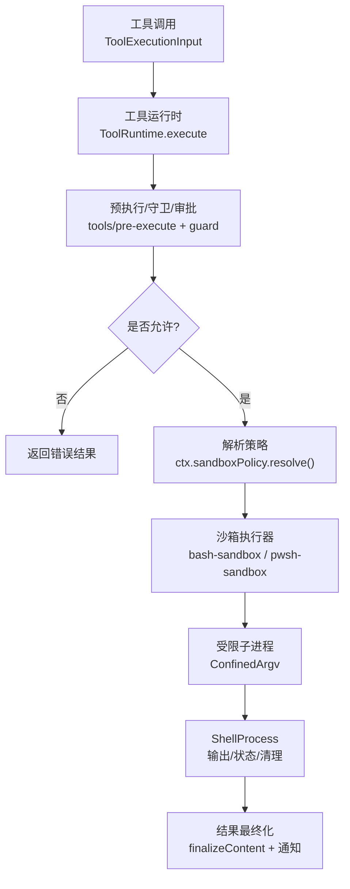
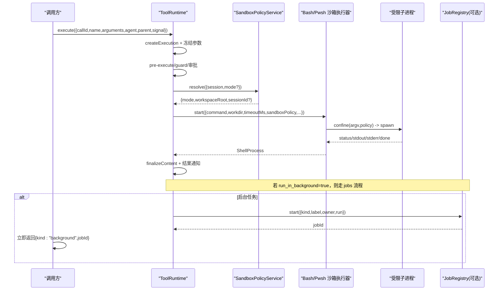
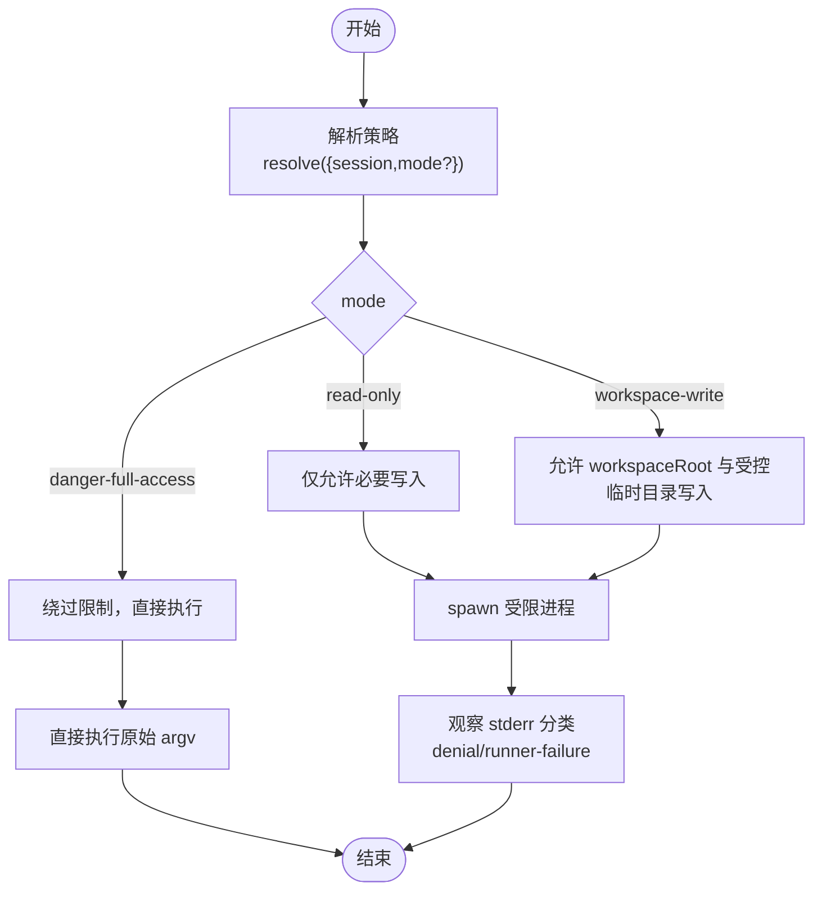
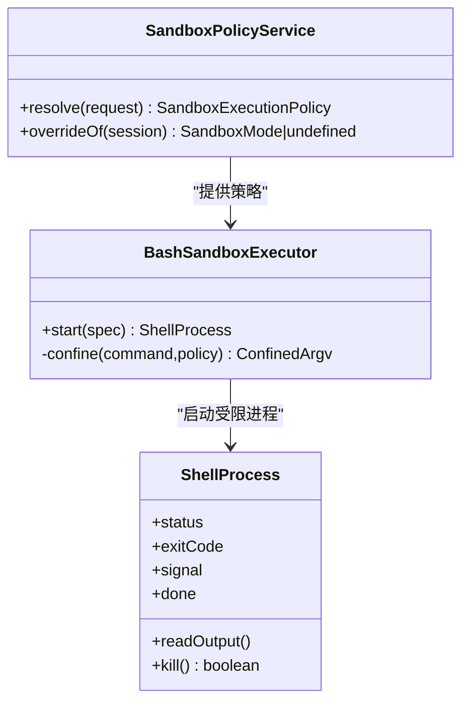
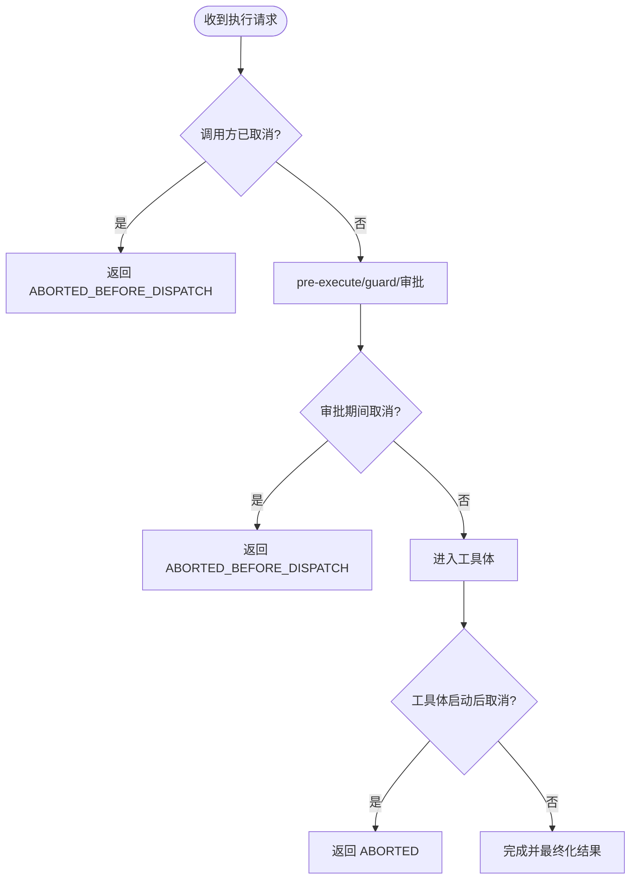
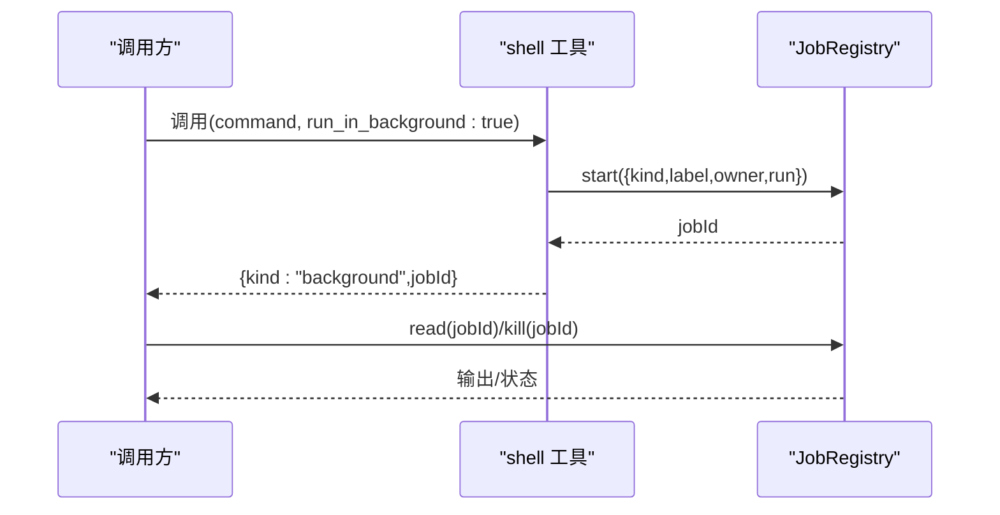
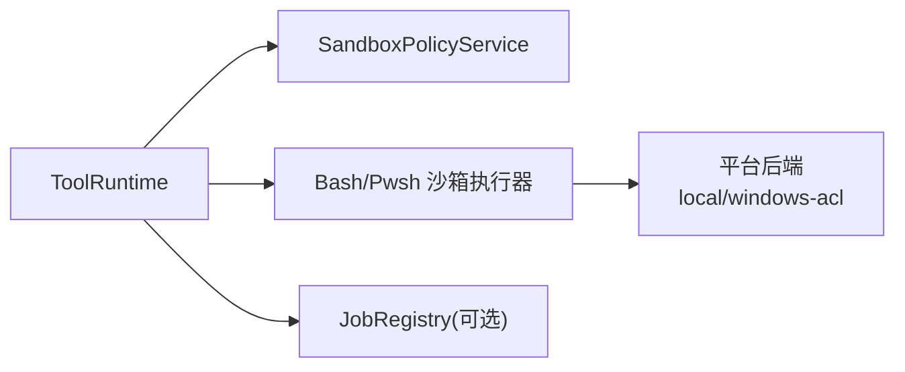

# 执行环境与上下文

<cite>
**本文引用的文件**
- [packages/core/tools/src/index.ts](file://packages/core/tools/src/index.ts)
- [docs/subsystems/sandbox.md](file://docs/subsystems/sandbox.md)
- [packages/shell/bash-sandbox/src/index.ts](file://packages/shell/bash-sandbox/src/index.ts)
- [packages/shell/tool-bash/src/index.ts](file://packages/shell/tool-bash/src/index.ts)
- [packages/shell/shell/src/types.ts](file://packages/shell/shell/src/types.ts)
- [docs/subsystems/jobs.md](file://docs/subsystems/jobs.md)
- [packages/sandbox/sandbox-policy/src/index.ts](file://packages/sandbox/sandbox-policy/src/index.ts)
- [packages/sandbox/sandbox-windows-acl/src/index.ts](file://packages/sandbox/sandbox-windows-acl/src/index.ts)
- [packages/e2b/subprocess-e2b/src/terminal.ts](file://packages/e2b/subprocess-e2b/src/terminal.ts)
</cite>

## 目录
1. [简介](#简介)
2. [项目结构](#项目结构)
3. [核心组件](#核心组件)
4. [架构总览](#架构总览)
5. [详细组件分析](#详细组件分析)
6. [依赖关系分析](#依赖关系分析)
7. [性能考量](#性能考量)
8. [故障排查指南](#故障排查指南)
9. [结论](#结论)
10. [附录](#附录)

## 简介
本文件聚焦 DeepSeek Harness 工具执行环境的“执行环境与上下文”，围绕 execute 函数的执行上下文、exec 参数结构与用途、工作区访问权限与安全边界、外部命令执行的沙箱机制与进程隔离、信号处理与取消、身份保护与调用者隔离，以及异步操作最佳实践与后台任务执行模式进行系统化说明。目标是帮助读者在不深入源码的情况下理解执行路径、安全模型与可观测性。

## 项目结构
- 工具执行入口与调度：位于 core/tools，提供 ToolRuntime.execute 及完整的执行管线（预执行、守卫、分发、后处理、结果最终化）。
- 沙箱策略与执行：通过 ctx.sandboxPolicy 解析每调用策略；bash/pwsh 沙箱执行器在启动时应用策略并注入受限 argv。
- 工作区与文件系统限制：策略以会话 cwd 为 workspace-write 根，后端实现负责具体限制（Linux/macOS/Windows）。
- 后台任务：jobs 子系统提供统一的任务注册、生命周期、读取与终止能力，shell 工具可通过 run_in_background 进入后台模式。

**图表来源**
- [packages/core/tools/src/index.ts:1333-1498](file://packages/core/tools/src/index.ts#L1333-L1498)
- [docs/subsystems/sandbox.md:41-77](file://docs/subsystems/sandbox.md#L41-L77)
- [packages/shell/bash-sandbox/src/index.ts:116-144](file://packages/shell/bash-sandbox/src/index.ts#L116-L144)

**章节来源**
- [packages/core/tools/src/index.ts:307-331](file://packages/core/tools/src/index.ts#L307-L331)
- [docs/subsystems/sandbox.md:41-77](file://docs/subsystems/sandbox.md#L41-L77)

## 核心组件
- 工具执行输入与上下文
  - ToolExecutionInput：包含 callId、name、arguments、agent、parent、signal。execute 会将其扩展为 ToolExecution，并附加 registry 分配的 token。
  - ToolRunContext：在执行体中可见，支持 deferContext 和 concludeTurn，用于携带嵌套上下文或标记本轮结束。
- 工具运行时
  - ToolRuntime.execute：统一的执行入口，串联 prepareExecution → dispatch → finalize/finish，并在各阶段处理取消与错误。
- 沙箱策略与服务
  - SandboxPolicyService.resolve：基于会话 cwd 与部署默认值解析 per-call 的 mode 与 workspaceRoot，并可携带 sessionId。
- 沙箱执行器
  - bash-sandbox/pwsh-sandbox：在 start(spec) 时根据 policy 将原始 argv 包装为 ConfinedArgv 并启动受限进程。
- 后台任务
  - jobs：提供 JobRegistry 抽象与本地实现，支持 start/read/kill/wait/listen，shell 工具通过 run_in_background 接入。

**章节来源**
- [packages/core/tools/src/index.ts:307-331](file://packages/core/tools/src/index.ts#L307-L331)
- [packages/core/tools/src/index.ts:397-414](file://packages/core/tools/src/index.ts#L397-L414)
- [packages/core/tools/src/index.ts:1333-1498](file://packages/core/tools/src/index.ts#L1333-L1498)
- [docs/subsystems/sandbox.md:41-77](file://docs/subsystems/sandbox.md#L41-L77)
- [packages/shell/bash-sandbox/src/index.ts:116-144](file://packages/shell/bash-sandbox/src/index.ts#L116-L144)
- [docs/subsystems/jobs.md:24-96](file://docs/subsystems/jobs.md#L24-L96)

## 架构总览
下图展示一次工具调用的完整生命周期，包括策略解析、沙箱封装、进程执行与结果最终化。

**图表来源**
- [packages/core/tools/src/index.ts:1333-1498](file://packages/core/tools/src/index.ts#L1333-L1498)
- [docs/subsystems/sandbox.md:41-77](file://docs/subsystems/sandbox.md#L41-L77)
- [packages/shell/bash-sandbox/src/index.ts:116-144](file://packages/shell/bash-sandbox/src/index.ts#L116-L144)
- [docs/subsystems/jobs.md:24-96](file://docs/subsystems/jobs.md#L24-L96)

## 详细组件分析

### 工具执行上下文与 exec 参数
- ToolExecutionInput 字段含义
  - callId：本次调用的唯一标识。
  - name/arguments：工具名与已解析的参数（JSON 可序列化）。
  - agent：代表执行主体的 Agent（由代理循环设置）。
  - parent：父级传输执行的令牌，用于 PTC 模式下区分模型直调与 SDK 子分发。
  - signal：调用方持有的 AbortSignal，贯穿整个执行链。
- ToolExecution 与 ToolRunContext
  - ToolExecution 在 ToolExecutionInput 基础上增加 rootCallId 与 registry 分配的 token。
  - ToolRunContext 在执行体中可用，支持 deferContext（延迟附加上下文）与 concludeTurn（标记本轮结束）。
- 执行管线要点
  - 参数在进入策略前被深拷贝并冻结，保证日志与观察一致性。
  - 取消检查发生在多个阶段：创建执行、pre-execute/guard 之后、dispatch 前后。
  - 失败与拒绝均转化为 ToolExecutionResult，保持可持久化的结构化错误。

**章节来源**
- [packages/core/tools/src/index.ts:307-331](file://packages/core/tools/src/index.ts#L307-L331)
- [packages/core/tools/src/index.ts:397-414](file://packages/core/tools/src/index.ts#L397-L414)
- [packages/core/tools/src/index.ts:1355-1442](file://packages/core/tools/src/index.ts#L1355-L1442)
- [packages/core/tools/src/index.ts:1454-1498](file://packages/core/tools/src/index.ts#L1454-L1498)

### 工作区访问权限与安全边界
- 策略解析
  - SandboxPolicyService.resolve 以会话 cwd 作为 workspace-write 的绝对根，结合部署默认模式得到 per-call 的 mode 与 workspaceRoot，并可附带 sessionId。
- 模式与强制程度
  - read-only：仅允许必要写入（如 /dev/null），后端可能报告 partial 强制。
  - workspace-write：允许在工作区根与后端定义的临时区域写入。
  - danger-full-access：绕过限制，不经过 ctx.sandbox。
- 执行期约束
  - bash-sandbox/pwsh-sandbox 在 start 时依据 policy 将 argv 包装为 ConfinedArgv，并记录 enforcement、denialSignatures、runnerFailureRules 等事实。
  - Windows ACL 后端使用受限令牌与 kill-on-close job 隔离进程，确保资源回收。

**图表来源**
- [docs/subsystems/sandbox.md:41-77](file://docs/subsystems/sandbox.md#L41-L77)
- [packages/shell/bash-sandbox/src/index.ts:116-144](file://packages/shell/bash-sandbox/src/index.ts#L116-L144)
- [packages/sandbox/sandbox-windows-acl/src/index.ts:338-367](file://packages/sandbox/sandbox-windows-acl/src/index.ts#L338-L367)

**章节来源**
- [docs/subsystems/sandbox.md:41-77](file://docs/subsystems/sandbox.md#L41-L77)
- [packages/shell/bash-sandbox/src/index.ts:116-144](file://packages/shell/bash-sandbox/src/index.ts#L116-L144)
- [packages/sandbox/sandbox-windows-acl/src/index.ts:338-367](file://packages/sandbox/sandbox-windows-acl/src/index.ts#L338-L367)

### 外部命令执行的沙箱机制与进程隔离
- 策略到执行器的传递
  - tool-bash 在 apply 时从 ctx.shell.sandboxMode 与 ctx.sandboxPolicy 解析 standing policy，并将 resolve(exec.agent.session) 的结果传入执行器。
- 受限 argv 与分类
  - ConfinedArgv 包含替换后的 argv、enforcement、denialSignatures、runnerFailureRules。消费者据此区分“被沙箱拒绝”和“沙箱运行器失败”。
- 进程生命周期
  - ShellProcess 暴露 status、exitCode、signal、done、readOutput、kill，确保输出可读且进程组可杀。
- 终端与进程组（e2b）
  - 通过 ps/awk 查询进程会话与进程组，过滤不安全组号，避免跨会话干扰。

**图表来源**
- [packages/shell/tool-bash/src/index.ts:189-199](file://packages/shell/tool-bash/src/index.ts#L189-L199)
- [packages/shell/bash-sandbox/src/index.ts:116-144](file://packages/shell/bash-sandbox/src/index.ts#L116-L144)
- [packages/shell/shell/src/types.ts:155-183](file://packages/shell/shell/src/types.ts#L155-L183)
- [packages/e2b/subprocess-e2b/src/terminal.ts:135-174](file://packages/e2b/subprocess-e2b/src/terminal.ts#L135-L174)

**章节来源**
- [packages/shell/tool-bash/src/index.ts:189-199](file://packages/shell/tool-bash/src/index.ts#L189-L199)
- [packages/shell/bash-sandbox/src/index.ts:116-144](file://packages/shell/bash-sandbox/src/index.ts#L116-L144)
- [packages/shell/shell/src/types.ts:155-183](file://packages/shell/shell/src/types.ts#L155-L183)
- [packages/e2b/subprocess-e2b/src/terminal.ts:135-174](file://packages/e2b/subprocess-e2b/src/terminal.ts#L135-L174)

### 信号处理机制与取消
- 信号所有权
  - ToolExecutionInput.signal 必填且只读，注册表不提供后备信号；每个阶段只能借用或组合，不能移除。
- 取消时机与结果
  - 在 createExecution、prepareExecution、dispatch 前后均可发生取消。
  - ABORTED_BEFORE_DISPATCH：工具体未启动即取消。
  - ABORTED：工具体已启动后被取消，仍会等待副作用停稳。
- 环绕包装层
  - 可在有限作用域内替换信号（例如加入截止时间），但必须融合调用方信号，不可切断上游取消。

**图表来源**
- [packages/core/tools/src/index.ts:1355-1442](file://packages/core/tools/src/index.ts#L1355-L1442)
- [packages/core/tools/src/index.ts:1454-1498](file://packages/core/tools/src/index.ts#L1454-L1498)

**章节来源**
- [packages/core/tools/src/index.ts:1355-1442](file://packages/core/tools/src/index.ts#L1355-L1442)
- [packages/core/tools/src/index.ts:1454-1498](file://packages/core/tools/src/index.ts#L1454-L1498)

### 身份保护机制与调用者隔离
- 会话与工作区绑定
  - 策略解析使用 session.cwd 作为 workspace-write 根，确保不同会话的工作区隔离。
- 会话标识
  - SandboxExecutionPolicy 可携带 sessionId，供后端按会话维护私有临时目录与 SID（如 Windows ACL）。
- 工具可见性与作用域
  - ToolRuntime 通过 scope 与 layers 控制工具可见性，PTC 模式下仅暴露 run_code，防止模型直调其他工具。
- 后台任务所有者
  - jobs 的 JobStart.owner 关联 Agent，按 ownerSession 授权访问，避免跨会话泄露。

**章节来源**
- [docs/subsystems/sandbox.md:41-77](file://docs/subsystems/sandbox.md#L41-L77)
- [packages/core/tools/src/index.ts:1143-1183](file://packages/core/tools/src/index.ts#L1143-L1183)
- [docs/subsystems/jobs.md:24-96](file://docs/subsystems/jobs.md#L24-L96)

### 异步操作最佳实践
- 始终监听并传播 signal
  - 在长耗时 IO、网络请求、子进程等待中定期检查 signal.aborted 或 await Promise.race 与 signal 事件。
- 资源清理优先于快速失败
  - 即使取消，也要确保文件句柄、子进程、管道等资源释放，遵循“dispose 必须完全停稳”的原则。
- 结构化错误与可观测性
  - 使用 ToolExecutionResult 的错误码与元信息，便于下游重试、审计与诊断。
- 输出与内存上限
  - 对 stdout/stderr 做字节上限与流式消费，避免 OOM；必要时落盘 spill。

[本节为通用指导，无需特定文件引用]

### 后台任务的执行模式（run_in_background）
- 触发方式
  - shell 工具（bash/pwsh）支持 run_in_background 配置项，开启后将任务交由 jobs 子系统管理。
- 生命周期
  - 启动后立即返回 {kind:"background",jobId}，后续通过 job_output/job_kill 等工具读取输出与终止任务。
- 任务契约
  - JobStart.run 同步返回 JobHooks，cancel 必须幂等并最终 settle done；readOutput 提供增量输出。
- 管理与授权
  - 通过 JobRegistry 的 list/get/read/kill/wait/onJobDone 进行全生命周期管理，按 ownerSession 授权。

**图表来源**
- [docs/subsystems/jobs.md:24-96](file://docs/subsystems/jobs.md#L24-L96)
- [docs/subsystems/jobs.md:155-285](file://docs/subsystems/jobs.md#L155-L285)

**章节来源**
- [docs/subsystems/jobs.md:24-96](file://docs/subsystems/jobs.md#L24-L96)
- [docs/subsystems/jobs.md:155-285](file://docs/subsystems/jobs.md#L155-L285)

## 依赖关系分析
- 工具运行时依赖策略服务与沙箱执行器，形成“策略→执行器→进程”的单向依赖。
- 沙箱执行器依赖平台后端（local/windows-acl 等），并通过 ShellProcess 抽象进程生命周期。
- 后台任务与工具解耦：工具只需声明 run_in_background，具体执行由 jobs 接管。

**图表来源**
- [packages/core/tools/src/index.ts:1333-1498](file://packages/core/tools/src/index.ts#L1333-L1498)
- [packages/shell/bash-sandbox/src/index.ts:116-144](file://packages/shell/bash-sandbox/src/index.ts#L116-L144)
- [docs/subsystems/jobs.md:155-285](file://docs/subsystems/jobs.md#L155-L285)

**章节来源**
- [packages/core/tools/src/index.ts:1333-1498](file://packages/core/tools/src/index.ts#L1333-L1498)
- [packages/shell/bash-sandbox/src/index.ts:116-144](file://packages/shell/bash-sandbox/src/index.ts#L116-L144)
- [docs/subsystems/jobs.md:155-285](file://docs/subsystems/jobs.md#L155-L285)

## 性能考量
- 策略解析与可见性计算应在调用前完成，避免重复计算。
- 子进程输出采用流式读取与上限控制，减少内存峰值。
- 后台任务批量启动时注意并发度与资源配额，避免争用系统资源。
- 取消应尽早传播，减少无效计算与 I/O。

[本节为通用指导，无需特定文件引用]

## 故障排查指南
- 未知工具/模式折叠
  - 在 PTC 模式下模型直调非 run_code 会被拒绝，需通过 SDK 调用。
- 沙箱不可用
  - 当后端不可用时抛出 SANDBOX_UNAVAILABLE，需检查平台能力与配置。
- 进程组与终端异常
  - e2b 终端查询进程组时需校验组号安全性，避免非法组导致越权。
- 后台任务无输出
  - 确认 readOutput 是否被消费，或任务是否为最终输出型；必要时查看 job_output 的最终状态行。

**章节来源**
- [packages/core/tools/src/index.ts:1315-1317](file://packages/core/tools/src/index.ts#L1315-L1317)
- [docs/subsystems/sandbox.md:154-158](file://docs/subsystems/sandbox.md#L154-L158)
- [packages/e2b/subprocess-e2b/src/terminal.ts:146-174](file://packages/e2b/subprocess-e2b/src/terminal.ts#L146-L174)
- [docs/subsystems/jobs.md:155-285](file://docs/subsystems/jobs.md#L155-L285)

## 结论
DeepSeek Harness 的执行环境以“策略驱动、执行器封装、进程隔离、可取消、可观测”为核心原则。通过 ToolRuntime 的统一入口、SandboxPolicyService 的 per-call 策略解析、bash/pwsh 沙箱执行器的受限进程启动，以及 jobs 的后台任务管理，系统在安全性、可维护性与可扩展性之间取得平衡。开发者应严格遵循信号传播、资源清理与输出限流的实践，以获得稳定可靠的执行体验。

[本节为总结性内容，无需特定文件引用]

## 附录
- 关键类型速查
  - ToolExecutionInput/ToolExecution/ToolRunContext：定义工具调用的输入、执行上下文与回调能力。
  - SandboxExecutionPolicy/SandboxPolicy：定义 per-call 的文件影响策略与工作区根。
  - ConfinedArgv/ShellProcess：描述受限 argv 与进程生命周期。
  - JobStart/JobHooks/JobSnapshot：描述后台任务的启动、钩子与快照。

[本节为概念性汇总，无需特定文件引用]