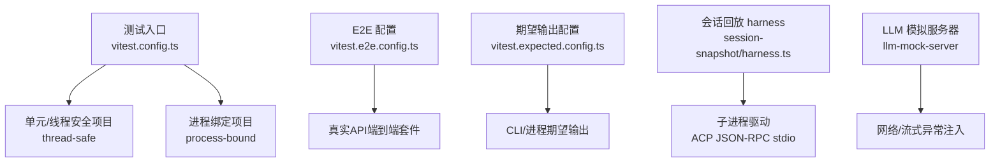
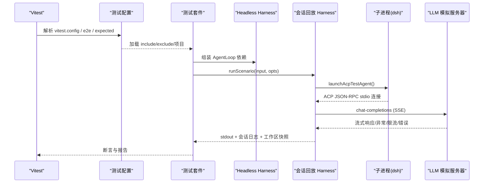
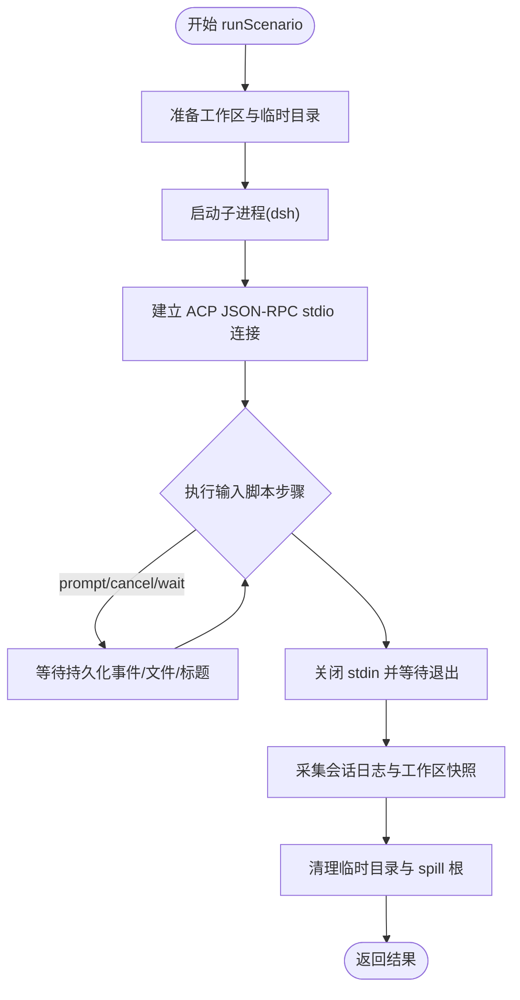
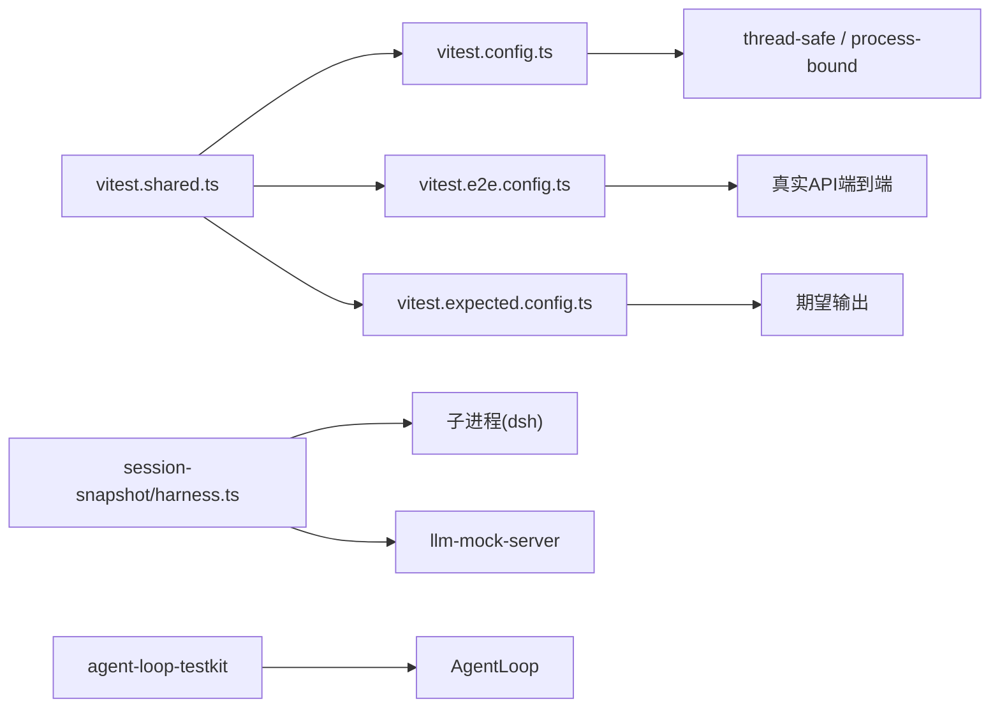

# 测试与调试

<cite>
**本文引用的文件**
- [vitest.config.ts](file://vitest.config.ts)
- [vitest.e2e.config.ts](file://vitest.e2e.config.ts)
- [vitest.expected.config.ts](file://vitest.expected.config.ts)
- [vitest.shared.ts](file://vitest.shared.ts)
- [docs/testing.md](file://docs/testing.md)
- [packages/test-support/agent-loop-testkit/src/index.ts](file://packages/test-support/agent-loop-testkit/src/index.ts)
- [packages/test-support/session-snapshot/src/harness.ts](file://packages/test-support/session-snapshot/src/harness.ts)
- [packages/test-support/llm-mock-server/src/index.ts](file://packages/test-support/llm-mock-server/src/index.ts)
- [apps/cli/tests/profiles/headless/tests/harness.ts](file://apps/cli/tests/profiles/headless/tests/harness.ts)
- [scripts/test-proxy-environment.spec.ts](file://scripts/test-proxy-environment.spec.ts)
- [scripts/coverage-partitions.ts](file://scripts/coverage-partitions.ts)
</cite>

## 目录
1. [简介](#简介)
2. [项目结构](#项目结构)
3. [核心组件](#核心组件)
4. [架构总览](#架构总览)
5. [详细组件分析](#详细组件分析)
6. [依赖关系分析](#依赖关系分析)
7. [性能考虑](#性能考虑)
8. [故障排查指南](#故障排查指南)
9. [结论](#结论)
10. [附录](#附录)

## 简介
本文件面向 DeepSeek Harness 的测试与调试，覆盖单元测试、集成测试（端到端与会话回放）、调试技巧（日志、断点、性能分析）、最佳实践（用例设计、边界与错误覆盖）、工具验证（参数校验与执行结果验证），以及常见陷阱（异步与并发）及解决方案。内容基于仓库中的测试配置、测试支撑库与示例套件进行系统化说明，帮助读者在不深入源码细节的前提下也能高效编写与维护高质量测试。

## 项目结构
仓库采用分层测试策略：
- 单元测试：Vitest 驱动，按包组织在 tests/** 下，使用 fork 隔离 worker，强制 100% 行覆盖率门禁。
- 真实 API 端到端：独立配置，支持重试与并行度控制，适合调用真实模型或外部服务。
- 期望输出测试：无需记录会话的 CLI/进程级预期输出对比。
- 快照测试：以“会话回放”为核心，通过固定输入脚本驱动子进程，录制/回放并比对持久化产物。
- Web 浏览器快照：Chromium 驱动的 UI 回归测试，CI 只读模式运行。

图示来源
- [vitest.config.ts:158-200](file://vitest.config.ts#L158-L200)
- [vitest.e2e.config.ts:31-62](file://vitest.e2e.config.ts#L31-L62)
- [vitest.expected.config.ts:6-19](file://vitest.expected.config.ts#L6-L19)
- [packages/test-support/session-snapshot/src/harness.ts:238-401](file://packages/test-support/session-snapshot/src/harness.ts#L238-L401)
- [packages/test-support/llm-mock-server/src/index.ts:626-739](file://packages/test-support/llm-mock-server/src/index.ts#L626-L739)

章节来源
- [docs/testing.md:7-17](file://docs/testing.md#L7-L17)
- [vitest.config.ts:10-20](file://vitest.config.ts#L10-L20)
- [vitest.e2e.config.ts:5-14](file://vitest.e2e.config.ts#L5-L14)
- [vitest.expected.config.ts:6-19](file://vitest.expected.config.ts#L6-L19)

## 核心组件
- 测试运行器与项目划分
  - 双项目策略：thread-safe（通用单测）与 process-bound（进程相关单测）分离，避免共享状态污染。
  - 平台/环境适配：Windows 不支持的套件自动排除；pwsh 可用性影响覆盖豁免。
  - 覆盖率门禁：每文件 100%，失败即阻断合并；提供未覆盖位置报告。
- 端到端与期望输出
  - E2E 配置加载 .env，支持并行度与环境变量开关；默认重试与较长超时。
  - 期望输出测试用于无会话记录的 CLI/进程行为对比。
- 会话回放与快照
  - 通过 harness 启动真实 agent 子进程，使用 ACP JSON-RPC stdio 驱动，支持 replay 与 record 模式。
  - 工作区快照、会话日志采集、清理保证幂等与失败安全。
- LLM 模拟服务器
  - 可配置的 OpenAI 兼容 HTTP/SSE 服务器，支持多种网络/协议/语义异常场景，便于恢复与容错测试。
- Agent Loop 测试依赖挂载
  - 统一挂载 LLM、SessionStore、SystemPrompt、ToolRuntime、AgentRegistry，保持测试拓扑可控。

章节来源
- [vitest.config.ts:121-200](file://vitest.config.ts#L121-L200)
- [vitest.config.ts:201-371](file://vitest.config.ts#L201-L371)
- [vitest.e2e.config.ts:31-62](file://vitest.e2e.config.ts#L31-L62)
- [vitest.expected.config.ts:6-19](file://vitest.expected.config.ts#L6-L19)
- [packages/test-support/session-snapshot/src/harness.ts:238-401](file://packages/test-support/session-snapshot/src/harness.ts#L238-L401)
- [packages/test-support/llm-mock-server/src/index.ts:16-739](file://packages/test-support/llm-mock-server/src/index.ts#L16-L739)
- [packages/test-support/agent-loop-testkit/src/index.ts:17-46](file://packages/test-support/agent-loop-testkit/src/index.ts#L17-L46)

## 架构总览
下图展示从测试配置到具体执行路径的关键交互：Vitest 根据配置选择不同项目与包含规则；E2E 与期望输出分别走独立流程；会话回放通过 harness 启动子进程并与 LLM 模拟服务器交互；Agent Loop 测试依赖由 testkit 统一挂载。

图示来源
- [vitest.config.ts:158-200](file://vitest.config.ts#L158-L200)
- [vitest.e2e.config.ts:31-62](file://vitest.e2e.config.ts#L31-L62)
- [packages/test-support/session-snapshot/src/harness.ts:238-401](file://packages/test-support/session-snapshot/src/harness.ts#L238-L401)
- [packages/test-support/llm-mock-server/src/index.ts:626-739](file://packages/test-support/llm-mock-server/src/index.ts#L626-L739)
- [packages/test-support/agent-loop-testkit/src/index.ts:37-46](file://packages/test-support/agent-loop-testkit/src/index.ts#L37-L46)

## 详细组件分析

### 单元测试：编写方法与依赖 Mock
- 使用 Vitest 双项目隔离：
  - thread-safe：适用于大多数单测，fork 池提升稳定性。
  - process-bound：针对进程全局状态、子进程、时间敏感 I/O 的测试。
- 平台与环境：
  - Windows 不支持的套件自动排除；pwsh 缺失时豁免特定覆盖范围。
  - 所有配置统一注入标准装饰器预处理与 execArgv 选项。
- 覆盖率门禁：
  - 每文件 100% 阈值；提供未覆盖位置报告；分区模式关闭阈值以便并行覆盖。
- 推荐做法：
  - 优先使用真实实现，仅对昂贵/非确定性边界（LLM 适配器、网络、时钟）打桩。
  - 将测试与代码同域组织，每个注册项附带 HMR 安全测试。

章节来源
- [vitest.config.ts:22-119](file://vitest.config.ts#L22-L119)
- [vitest.config.ts:158-200](file://vitest.config.ts#L158-L200)
- [vitest.config.ts:201-371](file://vitest.config.ts#L201-L371)
- [vitest.shared.ts:1-43](file://vitest.shared.ts#L1-L43)
- [docs/testing.md:26-30](file://docs/testing.md#L26-L30)

### 集成测试：端到端与会话回放
- 端到端（真实 API）：
  - 独立配置，加载 .env，支持重试与并行度控制；适合冒烟与关键路径验证。
- 会话回放（快照）：
  - 通过 harness 启动真实 agent 子进程，使用 ACP JSON-RPC stdio 驱动。
  - 支持 replay（无密钥）与 record（录制会话）两种模式；收集 stdout、stderr、会话日志与工作区快照。
  - 输入脚本定义步骤序列（初始化、新建会话、提示、取消、等待事件/转结束等）。
  - 失败安全清理：确保子进程终止、临时目录与 spill 根删除。
- Headless 测试 harness：
  - 统一装配 AgentLoop、LLM、工具、子进程运行时、持久化与压缩引擎等插件栈。

图示来源
- [packages/test-support/session-snapshot/src/harness.ts:238-401](file://packages/test-support/session-snapshot/src/harness.ts#L238-L401)
- [packages/test-support/session-snapshot/src/harness.ts:404-549](file://packages/test-support/session-snapshot/src/harness.ts#L404-L549)
- [packages/test-support/session-snapshot/src/harness.ts:552-749](file://packages/test-support/session-snapshot/src/harness.ts#L552-L749)

章节来源
- [vitest.e2e.config.ts:31-62](file://vitest.e2e.config.ts#L31-L62)
- [packages/test-support/session-snapshot/src/harness.ts:238-401](file://packages/test-support/session-snapshot/src/harness.ts#L238-L401)
- [apps/cli/tests/profiles/headless/tests/harness.ts:57-86](file://apps/cli/tests/profiles/headless/tests/harness.ts#L57-L86)

### 调试技巧：日志、断点与性能分析
- 日志输出：
  - 会话回放 harness 捕获 rawStdout/stderr，便于定位子进程问题。
  - LLM 模拟服务器暴露请求记录与事件观察者，可用于诊断网络/流式行为。
- 断点调试：
  - 使用 Vitest 原生调试；注意 fork 模式下需启用 Node 调试参数。
  - 对于子进程，可通过环境变量或日志标记配合外部调试器附加。
- 性能分析：
  - Web 性能测试配置启用 --expose-gc 与更长超时，便于内存基线测量。
  - 覆盖率门禁提供未覆盖位置报告，辅助定位热点与瓶颈。

章节来源
- [packages/test-support/session-snapshot/src/harness.ts:351-360](file://packages/test-support/session-snapshot/src/harness.ts#L351-L360)
- [packages/test-support/llm-mock-server/src/index.ts:96-168](file://packages/test-support/llm-mock-server/src/index.ts#L96-L168)
- [vitest.web.perf.config.ts:5-21](file://vitest.web.perf.config.ts#L5-L21)
- [vitest.config.ts:10-15](file://vitest.config.ts#L10-L15)

### 测试最佳实践：用例设计、边界与错误覆盖
- 用例设计：
  - 优先真实实现，仅在必要边界打桩；用最小 mock 证明桥接正确性。
  - 端到端断言“世界状态”而非自报告；外部读取文件或命令输出作为证据。
- 边界情况：
  - 覆盖空响应、部分 EOF、流断开、限流、认证失败、上下文溢出、配额不足等。
  - 会话回放中利用 wait 步骤精确同步持久化事件（turn/end、goal 阶段、标题更新等）。
- 错误场景：
  - 明确区分客户端与服务端错误；对不可达路径使用 expectError 步骤。
  - 权限请求队列耗尽时回退为 cancelled，确保无审批场景稳定。

章节来源
- [docs/testing.md:22-40](file://docs/testing.md#L22-L40)
- [packages/test-support/session-snapshot/src/harness.ts:101-117](file://packages/test-support/session-snapshot/src/harness.ts#L101-L117)
- [packages/test-support/llm-mock-server/src/index.ts:16-739](file://packages/test-support/llm-mock-server/src/index.ts#L16-L739)

### 工具验证：参数验证与执行结果验证
- 参数验证：
  - LLM 模拟服务器严格校验端口、权重、文本、工具参数等，失败即抛错，便于用例快速发现配置错误。
- 执行结果验证：
  - 会话回放 harness 采集最终工作区快照与会话日志，结合标准化输出进行断言。
  - Headless harness 提供事件监听与最终文本提取，便于断言模型可见输出。

章节来源
- [packages/test-support/llm-mock-server/src/index.ts:197-289](file://packages/test-support/llm-mock-server/src/index.ts#L197-L289)
- [packages/test-support/session-snapshot/src/harness.ts:348-360](file://packages/test-support/session-snapshot/src/harness.ts#L348-L360)
- [apps/cli/tests/profiles/headless/tests/harness.ts:88-106](file://apps/cli/tests/profiles/headless/tests/harness.ts#L88-L106)

### 常见陷阱与解决方案：异步与并发
- 异步操作：
  - 使用 vi.waitFor 轮询持久化事件（turn/start/end、goal 阶段、inbox 消息等），避免竞态导致的误报。
  - 对 cancel/prompt 等长耗时操作，先等待就绪标记再发送取消，确保时序正确。
- 并发场景：
  - E2E 支持文件级并行与 maxWorkers 控制；必要时设置 DSH_E2E_MAX_WORKERS=1 串行执行。
  - 资源分配原子化：使用 mkdtemp、listen(0) 动态端口、唯一命名空间，避免共享资源冲突。
  - 进程全局状态隔离：捕获并恢复 env、cwd、定时器、locale、模块 mock 等。

章节来源
- [packages/test-support/session-snapshot/src/harness.ts:552-749](file://packages/test-support/session-snapshot/src/harness.ts#L552-L749)
- [vitest.e2e.config.ts:50-62](file://vitest.e2e.config.ts#L50-L62)
- [.agents/skills/dsh-ci-test-reliability/SKILL.md:31-54](file://.agents/skills/dsh-ci-test-reliability/SKILL.md#L31-L54)

## 依赖关系分析
- 测试配置依赖：
  - vitest.config.ts 聚合路径解析、平台排除、项目划分与覆盖率策略。
  - vitest.e2e.config.ts 与 vitest.expected.config.ts 分别聚焦真实 API 与期望输出。
  - vitest.shared.ts 提供装饰器预处理与 execArgv 选项。
- 测试支撑库依赖：
  - session-snapshot/harness.ts 依赖 launcher、normalize、workspace、session-files 等模块。
  - llm-mock-server 提供 HTTP/SSE 行为注入，被 E2E/回放测试复用。
  - agent-loop-testkit 统一挂载 AgentLoop 前置依赖，简化测试装配。

图示来源
- [vitest.config.ts:158-200](file://vitest.config.ts#L158-L200)
- [vitest.e2e.config.ts:31-62](file://vitest.e2e.config.ts#L31-L62)
- [vitest.expected.config.ts:6-19](file://vitest.expected.config.ts#L6-L19)
- [vitest.shared.ts:1-43](file://vitest.shared.ts#L1-L43)
- [packages/test-support/session-snapshot/src/harness.ts:238-401](file://packages/test-support/session-snapshot/src/harness.ts#L238-L401)
- [packages/test-support/llm-mock-server/src/index.ts:626-739](file://packages/test-support/llm-mock-server/src/index.ts#L626-L739)
- [packages/test-support/agent-loop-testkit/src/index.ts:37-46](file://packages/test-support/agent-loop-testkit/src/index.ts#L37-L46)

章节来源
- [vitest.config.ts:158-200](file://vitest.config.ts#L158-L200)
- [vitest.e2e.config.ts:31-62](file://vitest.e2e.config.ts#L31-L62)
- [vitest.expected.config.ts:6-19](file://vitest.expected.config.ts#L6-L19)
- [vitest.shared.ts:1-43](file://vitest.shared.ts#L1-L43)
- [packages/test-support/session-snapshot/src/harness.ts:238-401](file://packages/test-support/session-snapshot/src/harness.ts#L238-L401)
- [packages/test-support/llm-mock-server/src/index.ts:626-739](file://packages/test-support/llm-mock-server/src/index.ts#L626-L739)
- [packages/test-support/agent-loop-testkit/src/index.ts:37-46](file://packages/test-support/agent-loop-testkit/src/index.ts#L37-L46)

## 性能考虑
- 覆盖率门禁与分区：
  - 分区模式关闭阈值，便于并行覆盖；正常模式开启每文件 100% 阈值。
  - 未覆盖位置报告有助于快速定位热点与瓶颈。
- 并行与超时：
  - E2E 默认重试与较长超时，降低瞬态失败影响；可通过环境变量调整并行度。
  - Web 性能测试启用 GC 暴露与更长超时，便于内存基线测量。
- 资源隔离：
  - 使用临时目录与唯一命名空间，避免跨测试干扰；子进程与 spill 根在失败后清理。

章节来源
- [vitest.config.ts:201-371](file://vitest.config.ts#L201-L371)
- [scripts/coverage-partitions.ts:378-411](file://scripts/coverage-partitions.ts#L378-L411)
- [vitest.e2e.config.ts:50-62](file://vitest.e2e.config.ts#L50-L62)
- [vitest.web.perf.config.ts:5-21](file://vitest.web.perf.config.ts#L5-L21)

## 故障排查指南
- 常见问题定位：
  - 检查 setupFiles 是否在所有 Vitest 配置中声明，确保代理环境与不变量生效。
  - 确认平台不支持套件已正确排除；pwsh 缺失时豁免合理。
  - 会话回放失败时查看 stderr 与 rawStdout，结合持久化事件等待逻辑定位时序问题。
- 资源泄漏与清理：
  - 确保子进程关闭、临时目录与 spill 根删除；失败时聚合清理错误。
- 并发与竞态：
  - 使用 vi.waitFor 等待持久化事件；避免直接断言瞬时状态。
  - 控制 E2E 并行度，必要时串行执行以避免配额限制。

章节来源
- [scripts/test-proxy-environment.spec.ts:26-43](file://scripts/test-proxy-environment.spec.ts#L26-L43)
- [vitest.config.ts:22-119](file://vitest.config.ts#L22-L119)
- [packages/test-support/session-snapshot/src/harness.ts:361-401](file://packages/test-support/session-snapshot/src/harness.ts#L361-L401)
- [packages/test-support/session-snapshot/src/harness.ts:552-749](file://packages/test-support/session-snapshot/src/harness.ts#L552-L749)

## 结论
DeepSeek Harness 的测试体系以分层策略与强约束为核心：单元层强调隔离与覆盖率门禁，集成层通过会话回放与期望输出保障端到端正确性，Web 层提供浏览器级回归能力。借助 LLM 模拟服务器与统一的测试支撑库，开发者可以高效构建稳健、可维护且可复现的测试套件。遵循最佳实践与故障排查建议，能够显著降低异步与并发带来的不确定性，提升整体质量与交付效率。

## 附录
- 常用命令参考：见仓库根 AGENTS.md 中的测试命令。
- 更多规范与决策：参见 docs/testing.md 与相关 Agent Notes。