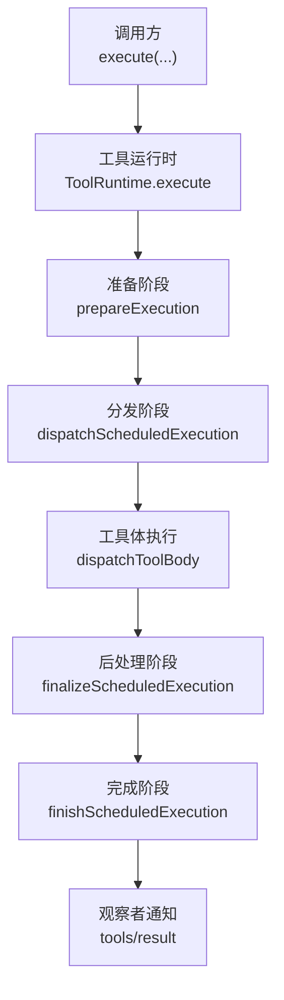
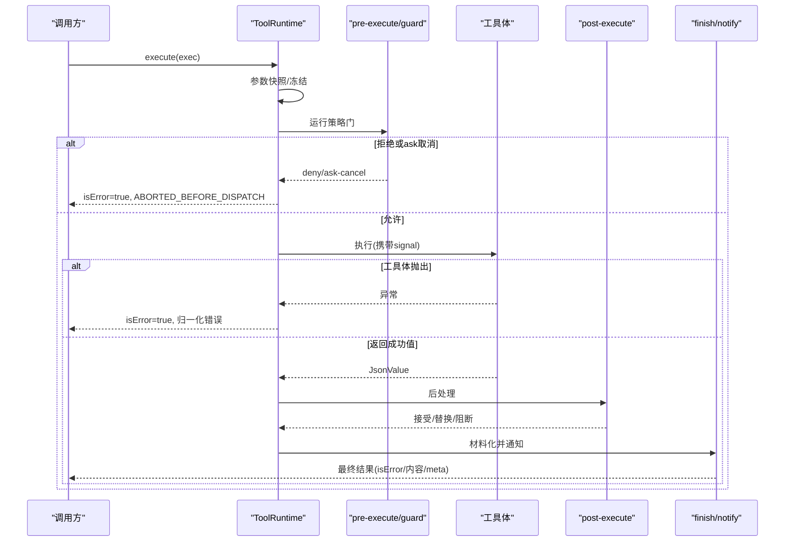
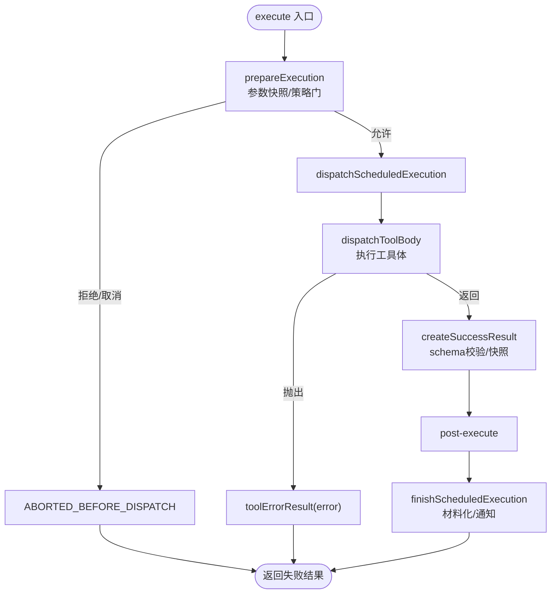
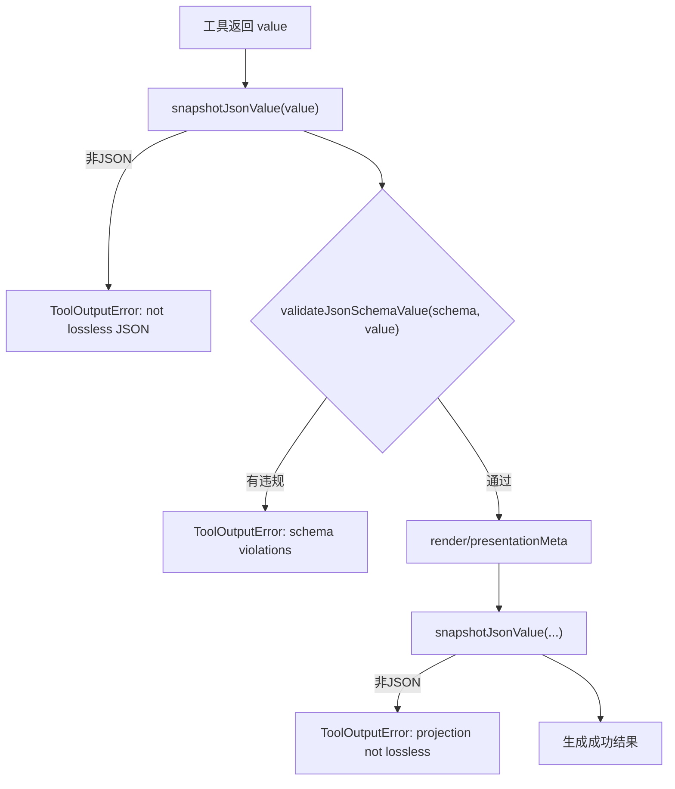
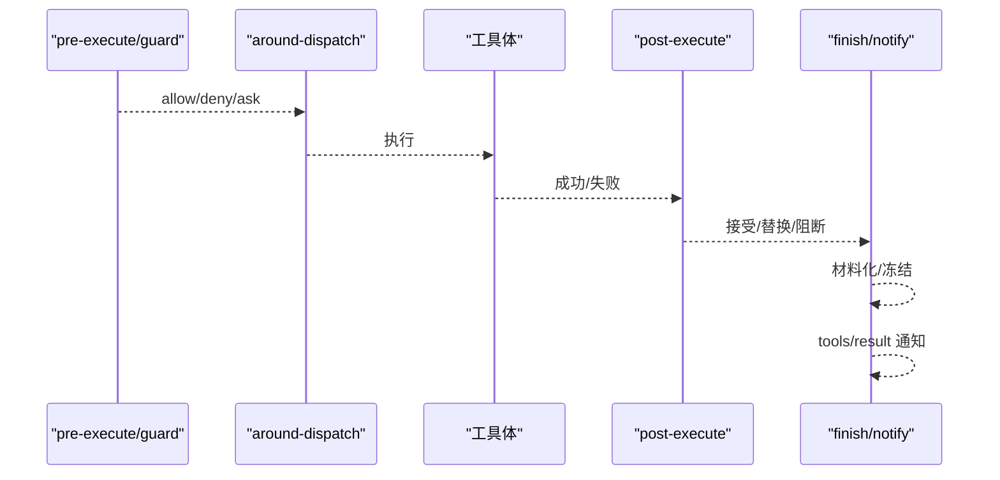
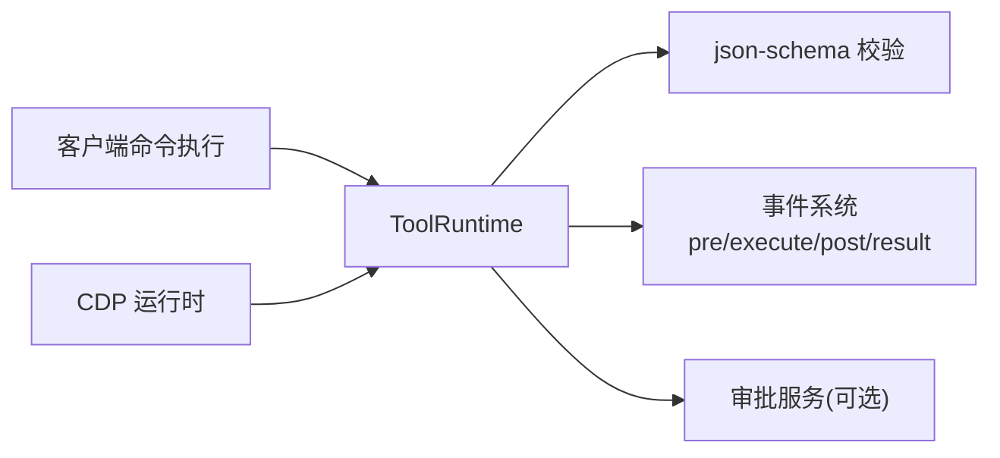

# 错误处理与异常管理

<cite>
**本文引用的文件**
- [packages/core/tools/src/index.ts](file://packages/core/tools/src/index.ts)
- [packages/core/tools/src/json-schema.ts](file://packages/core/tools/src/json-schema.ts)
- [packages/core/tools/tests/tools.spec.ts](file://packages/core/tools/tests/tools.spec.ts)
- [packages/experimental/inspector/src/client/cdp/runtime.ts](file://packages/experimental/inspector/src/client/cdp/runtime.ts)
- [packages/client/ui-commands/src/client/service.ts](file://packages/client/ui-commands/src/client/service.ts)
- [packages/shell/tool-bash/src/index.ts](file://packages/shell/tool-bash/src/index.ts)
- [packages/subagent/subagent-in-process-driver/src/structured.ts](file://packages/subagent/subagent-in-process-driver/src/structured.ts)
- [docs/subsystems/filesystem.md](file://docs/subsystems/filesystem.md)
</cite>

## 目录
1. [简介](#简介)
2. [项目结构](#项目结构)
3. [核心组件](#核心组件)
4. [架构总览](#架构总览)
5. [详细组件分析](#详细组件分析)
6. [依赖关系分析](#依赖关系分析)
7. [性能考虑](#性能考虑)
8. [故障排查指南](#故障排查指南)
9. [结论](#结论)
10. [附录](#附录)

## 简介
本文件聚焦 DeepSeek Harness 工具执行管线中的错误处理与异常管理，围绕 execute 函数的错误抛出机制、返回值验证（output.schema 类型检查与 JSON 序列化）、isError 状态语义、错误传播路径、常见错误场景以及调试与日志记录最佳实践进行系统化说明。目标是帮助开发者在工具链中正确捕获、归一化、传播和呈现错误，确保可观测性与稳定性。

## 项目结构
- 工具运行时位于 packages/core/tools，提供工具注册、调度、预/后策略、内容最终化与结果通知等能力。
- JSON Schema 校验与值验证位于同一包的 json-schema.ts，用于强制子集与严格的路径化诊断。
- 客户端命令执行、CDP 运行时等上层组件对工具执行结果进行消费与展示。
- 子系统文档（如文件系统）定义了特定领域的错误码与超时策略。

**图表来源**
- [packages/core/tools/src/index.ts:1333-1335](file://packages/core/tools/src/index.ts#L1333-L1335)
- [packages/core/tools/src/index.ts:1454-1498](file://packages/core/tools/src/index.ts#L1454-L1498)
- [packages/core/tools/src/index.ts:1560-1590](file://packages/core/tools/src/index.ts#L1560-L1590)
- [packages/core/tools/src/index.ts:1600-1637](file://packages/core/tools/src/index.ts#L1600-L1637)

**章节来源**
- [packages/core/tools/src/index.ts:1333-1335](file://packages/core/tools/src/index.ts#L1333-L1335)
- [packages/core/tools/src/index.ts:1454-1498](file://packages/core/tools/src/index.ts#L1454-L1498)
- [packages/core/tools/src/index.ts:1560-1590](file://packages/core/tools/src/index.ts#L1560-L1590)
- [packages/core/tools/src/index.ts:1600-1637](file://packages/core/tools/src/index.ts#L1600-L1637)

## 核心组件
- ToolRuntime.execute：统一入口，负责参数快照、策略门控、分发、后处理与最终结果材料化。
- 错误归一化：将任意抛出的值转换为统一的失败结果（包含可读消息与结构化 info）。
- 输出契约：工具必须声明 output.schema 与 render/presentationMeta；成功值需通过 JSON 快照与 schema 校验。
- 取消与中止：区分“未进入工具体”的提前中止与“已进入工具体”的中止，分别映射不同错误码。
- 观察者：tools/result 事件接收冻结后的最终结果，便于审计与 UI 渲染。

**章节来源**
- [packages/core/tools/src/index.ts:203-211](file://packages/core/tools/src/index.ts#L203-L211)
- [packages/core/tools/src/index.ts:548-573](file://packages/core/tools/src/index.ts#L548-L573)
- [packages/core/tools/src/index.ts:601-615](file://packages/core/tools/src/index.ts#L601-L615)
- [packages/core/tools/src/index.ts:1508-1516](file://packages/core/tools/src/index.ts#L1508-L1516)

## 架构总览
下图展示了从 execute 到最终结果的完整流程，包括错误捕获点、schema 校验点与取消分支。

**图表来源**
- [packages/core/tools/src/index.ts:1333-1335](file://packages/core/tools/src/index.ts#L1333-L1335)
- [packages/core/tools/src/index.ts:1454-1498](file://packages/core/tools/src/index.ts#L1454-L1498)
- [packages/core/tools/src/index.ts:1523-1551](file://packages/core/tools/src/index.ts#L1523-L1551)
- [packages/core/tools/src/index.ts:1600-1637](file://packages/core/tools/src/index.ts#L1600-L1637)

## 详细组件分析

### execute 函数与错误抛出机制
- 入口 execute 委托 prepareExecution -> completeScheduledExecution，贯穿 pre-execute、around-dispatch、post-execute 与 finish。
- 任何阶段的异常都会被捕获并转为工具失败结果（isError=true），并通过 finalize/finish 的材料化流程生成稳定的 content 与 error.info。
- 未知工具会抛出专用错误类，以便上层按 code 路由重试或降级。

**图表来源**
- [packages/core/tools/src/index.ts:1333-1335](file://packages/core/tools/src/index.ts#L1333-L1335)
- [packages/core/tools/src/index.ts:1454-1498](file://packages/core/tools/src/index.ts#L1454-L1498)
- [packages/core/tools/src/index.ts:1523-1551](file://packages/core/tools/src/index.ts#L1523-L1551)
- [packages/core/tools/src/index.ts:1600-1637](file://packages/core/tools/src/index.ts#L1600-L1637)

**章节来源**
- [packages/core/tools/src/index.ts:1333-1335](file://packages/core/tools/src/index.ts#L1333-L1335)
- [packages/core/tools/src/index.ts:1454-1498](file://packages/core/tools/src/index.ts#L1454-L1498)
- [packages/core/tools/src/index.ts:1523-1551](file://packages/core/tools/src/index.ts#L1523-L1551)
- [packages/core/tools/src/index.ts:1600-1637](file://packages/core/tools/src/index.ts#L1600-L1637)

### 返回值验证：output.schema 类型检查与 JSON 序列化
- 工具必须声明 output.schema（受支持的 JSON Schema 子集）与 render/presentationMeta。
- 成功返回值先做 lossless JSON 快照，再按 schema 校验；不合法则抛出 ToolOutputError（INVALID_TOOL_OUTPUT）。
- 投影函数（render/presentationMeta）也必须产出 lossless JSON，否则同样转为 INVALID_TOOL_OUTPUT。

**图表来源**
- [packages/core/tools/src/index.ts:536-546](file://packages/core/tools/src/index.ts#L536-L546)
- [packages/core/tools/src/json-schema.ts:378-405](file://packages/core/tools/src/json-schema.ts#L378-L405)
- [packages/core/tools/src/json-schema.ts:486-656](file://packages/core/tools/src/json-schema.ts#L486-L656)

**章节来源**
- [packages/core/tools/src/index.ts:536-546](file://packages/core/tools/src/index.ts#L536-L546)
- [packages/core/tools/src/json-schema.ts:378-405](file://packages/core/tools/src/json-schema.ts#L378-L405)
- [packages/core/tools/src/json-schema.ts:486-656](file://packages/core/tools/src/json-schema.ts#L486-L656)

### isError 状态与何时抛出异常
- 工具执行管线内部会将所有异常归一化为失败结果（isError=true），并在 content 中包含人类可读的错误文本，error.info 包含 name/code。
- 对于“未知工具”，抛出专用错误类（UNKNOWN_TOOL），便于上层按 code 路由。
- 取消分为两类：
  - 未进入工具体：ABORTED_BEFORE_DISPATCH（提前中止）。
  - 已进入工具体：ABORTED（已启动工作被取消）。
- 当需要让调用方感知不可恢复的协议级错误（例如未知工具、严重配置错误）时，应在合适边界抛出异常，由管线捕获并转为失败结果；普通业务错误应返回结构化失败结果而非向上抛出。

**章节来源**
- [packages/core/tools/src/index.ts:461-515](file://packages/core/tools/src/index.ts#L461-L515)
- [packages/core/tools/src/index.ts:1508-1516](file://packages/core/tools/src/index.ts#L1508-L1516)
- [packages/core/tools/tests/tools.spec.ts:634-646](file://packages/core/tools/tests/tools.spec.ts#L634-L646)

### 错误传播机制（工具链传递）
- pre-execute 与 guard 拒绝会直接生成失败结果，不会进入工具体。
- around-dispatch（tools/execute）可包装超时、重试、指标等逻辑；若包装器抛出，会被捕获为失败结果。
- post-execute 可接受、替换或阻断结果；阻断会转为失败结果。
- 最终结果经 materialize 与 applyFinalContent 后冻结，并通过 tools/result 通知观察者；观察者异常被安全捕获并记录警告。

**图表来源**
- [packages/core/tools/src/index.ts:1454-1498](file://packages/core/tools/src/index.ts#L1454-L1498)
- [packages/core/tools/src/index.ts:1560-1590](file://packages/core/tools/src/index.ts#L1560-L1590)
- [packages/core/tools/src/index.ts:1600-1637](file://packages/core/tools/src/index.ts#L1600-L1637)

**章节来源**
- [packages/core/tools/src/index.ts:1454-1498](file://packages/core/tools/src/index.ts#L1454-L1498)
- [packages/core/tools/src/index.ts:1560-1590](file://packages/core/tools/src/index.ts#L1560-L1590)
- [packages/core/tools/src/index.ts:1600-1637](file://packages/core/tools/src/index.ts#L1600-L1637)

### 常见错误场景与处理示例
- 网络超时/中断：
  - 使用 AbortSignal 驱动取消；若工具体已开始工作但被取消，返回 ABORTED；若尚未开始，返回 ABORTED_BEFORE_DISPATCH。
  - 客户端侧连接层可实现退避与重连，但工具层仅关注信号取消语义。
- 文件不存在/权限拒绝：
  - 文件系统子系统定义 FS_NOT_FOUND、FS_PERMISSION_DENIED、FS_IO_ERROR 等错误码；工具实现应将底层错误映射为结构化失败结果，保留 message 与 info。
  - 注意：文件系统操作无 timeoutMs，取消通过 signal 传播。
- 权限拒绝（沙箱/审批）：
  - pre-execute 的 ask 决策若无可用审批服务或无 agent，则降级为 deny；guard 也可返回拒绝原因。
- 未知工具：
  - 抛出 ToolNotFoundError（UNKNOWN_TOOL），上层可按 code 路由提示或重试。

**章节来源**
- [packages/core/tools/src/index.ts:1508-1516](file://packages/core/tools/src/index.ts#L1508-L1516)
- [docs/subsystems/filesystem.md:270-274](file://docs/subsystems/filesystem.md#L270-L274)
- [packages/core/tools/src/index.ts:481-503](file://packages/core/tools/src/index.ts#L481-L503)

### 调试与日志记录最佳实践
- 错误信息格式化：
  - 使用统一的 errorMessage 提取 message，兼容 Error、对象 {message} 与原始值；对不可打印值回退为占位符，避免二次崩溃。
- 上下文信息收集：
  - 利用 ToolExecution 的 callId/rootCallId/name/agent 等字段，在日志与持久化中关联调用链。
  - 通过 tools/result 观察最终冻结结果，便于回放与审计。
- 日志预算与截断：
  - 代码运行时对日志采用预算控制与截断标记，防止恶意输出耗尽内存；工具实现应避免输出超大文本。
- 结构化错误：
  - 尽量保持 error.info.name/code，便于上层分类处理（如 UNKNOWN_TOOL、INVALID_TOOL_OUTPUT、ABORTED_*）。

**章节来源**
- [packages/core/tools/src/index.ts:601-615](file://packages/core/tools/src/index.ts#L601-L615)
- [packages/core/tools/src/index.ts:1647-1667](file://packages/core/tools/src/index.ts#L1647-L1667)
- [packages/experimental/code-runtime-python/src/index.ts:1157-1541](file://packages/experimental/code-runtime-python/src/index.ts#L1157-L1541)

## 依赖关系分析
- ToolRuntime 依赖：
  - JSON Schema 校验（json-schema.ts）用于参数与输出的强约束。
  - 事件系统（tools/pre-execute、tools/execute、tools/post-execute、tools/result）用于扩展与审计。
  - 审批服务（可选）用于 ask 决策。
- 上层组件依赖：
  - 客户端命令执行根据远程结果 ok/value 决定继续或报错。
  - CDP 运行时在执行请求后检查响应大小与取消状态，必要时返回 transport 错误。

**图表来源**
- [packages/core/tools/src/index.ts:1454-1498](file://packages/core/tools/src/index.ts#L1454-L1498)
- [packages/core/tools/src/index.ts:1560-1590](file://packages/core/tools/src/index.ts#L1560-L1590)
- [packages/client/ui-commands/src/client/service.ts:339-354](file://packages/client/ui-commands/src/client/service.ts#L339-L354)
- [packages/experimental/inspector/src/client/cdp/runtime.ts:67-104](file://packages/experimental/inspector/src/client/cdp/runtime.ts#L67-L104)

**章节来源**
- [packages/client/ui-commands/src/client/service.ts:339-354](file://packages/client/ui-commands/src/client/service.ts#L339-L354)
- [packages/experimental/inspector/src/client/cdp/runtime.ts:67-104](file://packages/experimental/inspector/src/client/cdp/runtime.ts#L67-L104)

## 性能考虑
- 参数与结果均进行 lossless JSON 快照与冻结，避免后续修改与循环引用问题；快照失败会快速失败。
- 日志与输出采用预算控制与截断，防止大输出导致内存膨胀。
- 取消信号在关键等待点检查，避免无效工作；已启动的工作仍会尽力收敛至稳定状态。

[本节为通用指导，不直接分析具体文件]

## 故障排查指南
- 现象：工具返回 isError=true 且 content 包含 “Error: ...”
  - 检查 toolErrorResult 的归一化路径，确认是否来自工具体抛出或策略拒绝。
  - 查看 error.info.code 定位类别（如 UNKNOWN_TOOL、INVALID_TOOL_OUTPUT、ABORTED_*）。
- 现象：输出不符合 schema
  - 检查 output.schema 与 validateJsonSchemaValue 的违规路径；修正 value 或 schema。
- 现象：长时间无响应
  - 检查 AbortSignal 是否正确传递；确认工具体是否在可取消点响应取消。
- 现象：文件系统错误
  - 对照文件系统错误码（FS_NOT_FOUND、FS_PERMISSION_DENIED、FS_IO_ERROR、FS_SANDBOX_DENIED）定位根因。
- 现象：客户端命令执行失败
  - 检查远程结果 ok/value；若 value 为 undefined 表示未知或格式错误的命令。

**章节来源**
- [packages/core/tools/src/index.ts:1523-1551](file://packages/core/tools/src/index.ts#L1523-L1551)
- [packages/core/tools/src/json-schema.ts:486-656](file://packages/core/tools/src/json-schema.ts#L486-L656)
- [docs/subsystems/filesystem.md:270-274](file://docs/subsystems/filesystem.md#L270-L274)
- [packages/client/ui-commands/src/client/service.ts:339-354](file://packages/client/ui-commands/src/client/service.ts#L339-L354)

## 结论
DeepSeek Harness 的工具执行管线以“失败即结果”的方式统一了错误处理：所有异常被捕获并归一化为带结构与可读信息的失败结果；同时通过严格的 JSON Schema 校验保障输出契约。取消语义清晰区分“未进入工具体”与“已进入工具体”两种情况。借助 pre/post 策略与 tools/result 观察者，可在不破坏稳定性的前提下实现可观测、可扩展的错误治理。遵循本文的最佳实践，可有效提升工具链的健壮性与可维护性。

[本节为总结，不直接分析具体文件]

## 附录
- 相关测试用例参考：
  - 未知工具与抛出值的规范化：[packages/core/tools/tests/tools.spec.ts:634-646](file://packages/core/tools/tests/tools.spec.ts#L634-L646)
  - 非 Error 抛出与字符串抛出的报告：[packages/core/tools/tests/tools.spec.ts:2408-2436](file://packages/core/tools/tests/tools.spec.ts#L2408-L2436)
  - 输出契约违规的失败结果：[packages/core/tools/tests/tools.spec.ts:136-160](file://packages/core/tools/tests/tools.spec.ts#L136-L160)
  - 输出值与 schema 不匹配：[packages/core/tools/tests/tools.spec.ts:241-264](file://packages/core/tools/tests/tools.spec.ts#L241-L264)
- 结构化输出子代理绑定示例：[packages/subagent/subagent-in-process-driver/src/structured.ts:41-72](file://packages/subagent/subagent-in-process-driver/src/structured.ts#L41-L72)
- Bash 工具输出规范化（便于对比错误与成功结构）：[packages/shell/tool-bash/src/index.ts:157-187](file://packages/shell/tool-bash/src/index.ts#L157-L187)