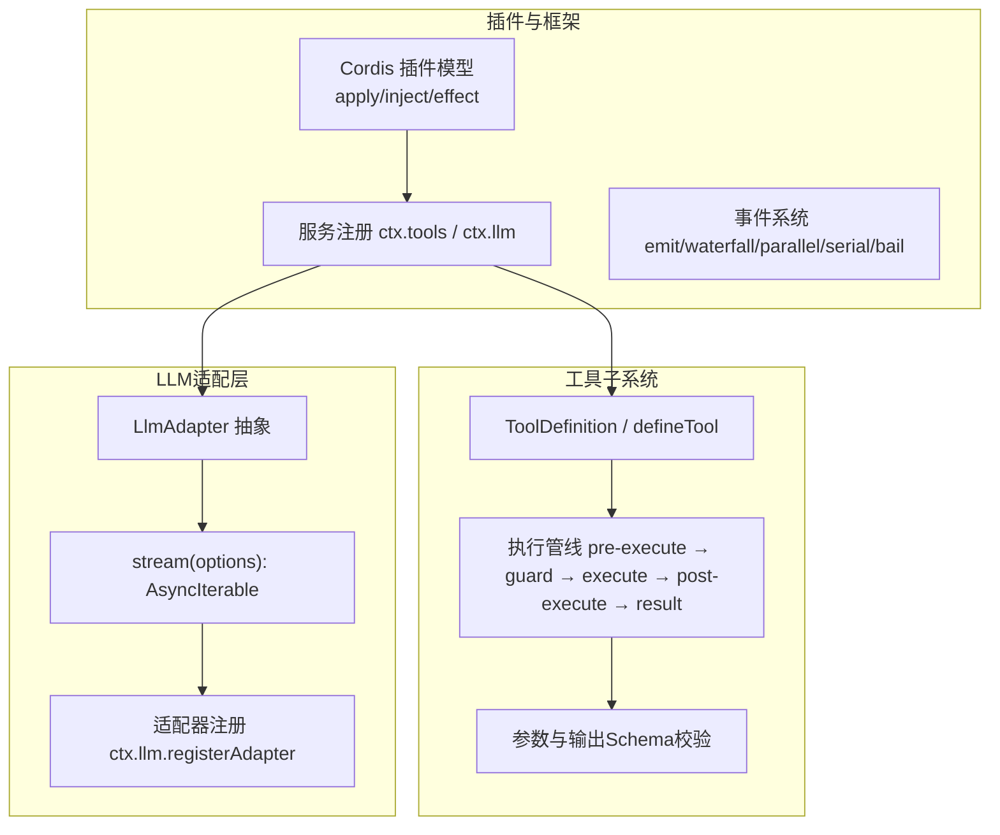
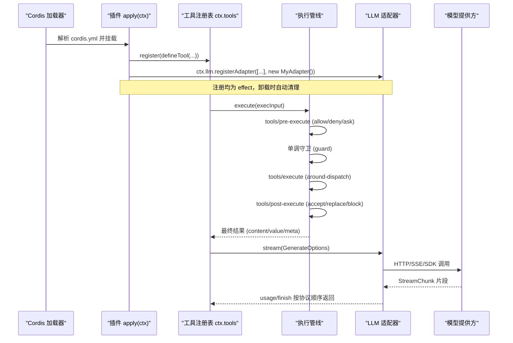
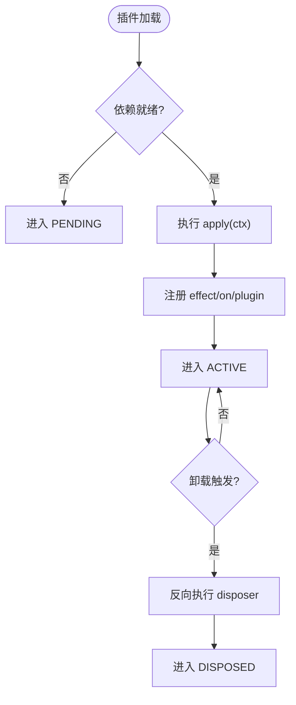
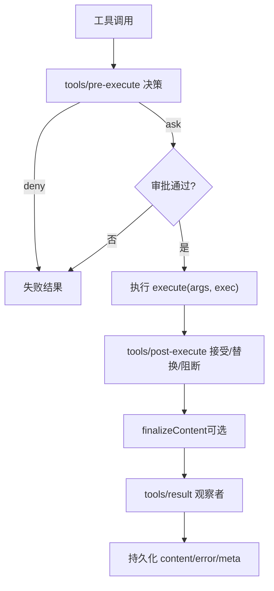
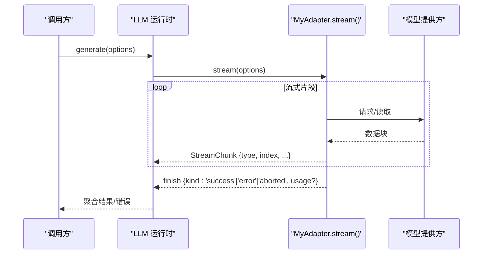
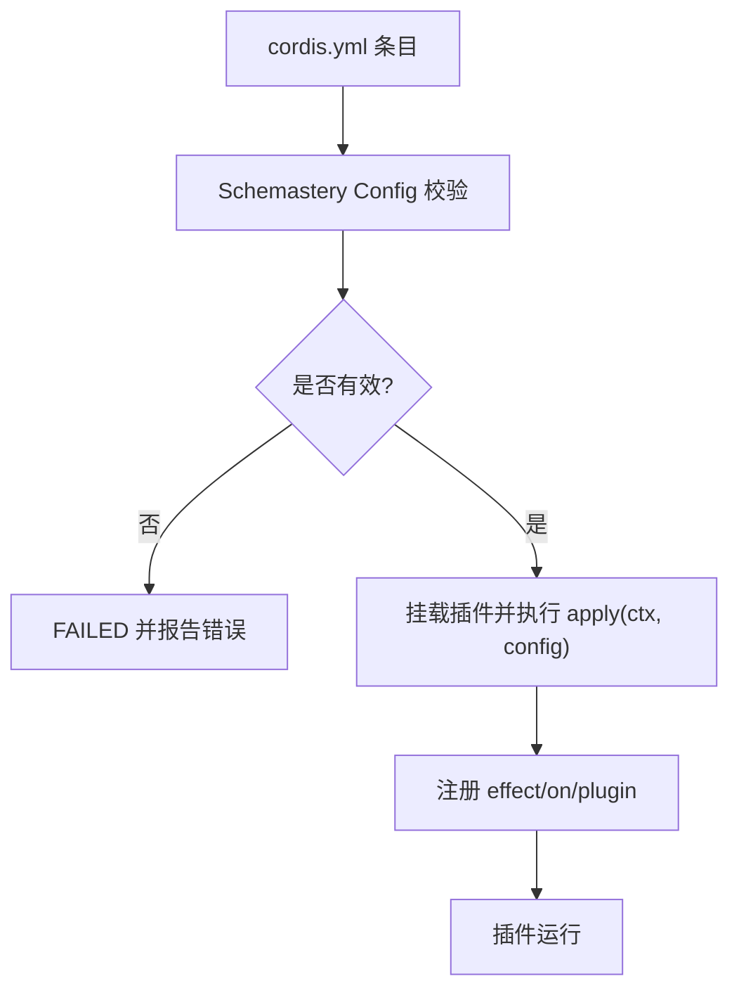

# 插件开发

<cite>
**本文引用的文件**
- [docs/cordis-primer.md](file://docs/cordis-primer.md)
- [docs/cordis-tutorial/01-first-plugin.md](file://docs/cordis-tutorial/01-first-plugin.md)
- [docs/cordis-tutorial/02-lifecycle-and-effects.md](file://docs/cordis-tutorial/02-lifecycle-and-effects.md)
- [docs/cordis-tutorial/03-services.md](file://docs/cordis-tutorial/03-services.md)
- [docs/cordis-tutorial/04-events.md](file://docs/cordis-tutorial/04-events.md)
- [docs/cordis-tutorial/05-config.md](file://docs/cordis-tutorial/05-config.md)
- [docs/cookbook/adding-a-tool.md](file://docs/cookbook/adding-a-tool.md)
- [docs/cookbook/adding-an-llm-adapter.md](file://docs/cookbook/adding-an-llm-adapter.md)
- [docs/subsystems/tools.md](file://docs/subsystems/tools.md)
- [packages/core/tools/src/index.ts](file://packages/core/tools/src/index.ts)
- [packages/llm/llm-deepseek/src/index.ts](file://packages/llm/llm-deepseek/src/index.ts)
</cite>

## 目录
1. [简介](#简介)
2. [项目结构](#项目结构)
3. [核心组件](#核心组件)
4. [架构总览](#架构总览)
5. [详细组件分析](#详细组件分析)
6. [依赖关系分析](#依赖关系分析)
7. [性能考量](#性能考量)
8. [故障排查指南](#故障排查指南)
9. [结论](#结论)
10. [附录](#附录)

## 简介
本指南面向DeepSeek Harness插件开发者，基于Cordis框架系统讲解插件开发的基础概念与高级实践。内容涵盖：
- 服务注册、事件处理与生命周期管理
- 工具插件开发（定义、参数校验、错误处理、UI呈现）
- LLM适配器开发（接口实现、流式协议、错误处理）
- 插件组合与配置覆盖最佳实践
- 实战示例与调试技巧

## 项目结构
DeepSeek Harness采用多包仓库组织，插件相关能力主要分布在以下位置：
- Cordis框架与教程：docs/cordis-* 系列文档
- 工具子系统：docs/subsystems/tools.md 与 packages/core/tools
- LLM适配层：docs/cookbook/adding-an-llm-adapter.md 与 packages/llm/*
- 示例与参考：apps/cli/config/examples 下的cordis配置文件

图表来源
- [docs/cordis-primer.md:7-13](file://docs/cordis-primer.md#L7-L13)
- [docs/subsystems/tools.md:9-96](file://docs/subsystems/tools.md#L9-L96)
- [packages/core/tools/src/index.ts:137-200](file://packages/core/tools/src/index.ts#L137-L200)
- [packages/llm/llm-deepseek/src/index.ts:84-90](file://packages/llm/llm-deepseek/src/index.ts#L84-L90)

章节来源
- [docs/cordis-primer.md:7-13](file://docs/cordis-primer.md#L7-L13)
- [docs/cordis-tutorial/01-first-plugin.md:23-51](file://docs/cordis-tutorial/01-first-plugin.md#L23-L51)

## 核心组件
- 插件模型：函数、对象或Service子类；通过inject声明依赖，通过effect管理资源
- 上下文与服务：ctx.<key>提供稳定能力访问；服务可被替换且热重载安全
- 事件系统：五种分发模式，支持拦截、包装、并行、串行与短路决策
- 工具管道：统一Schema DSL、严格参数校验、可插拔策略与结果投影
- LLM适配器：统一的流式协议，要求usage在finish前、arguments为原始JSON字符串等

章节来源
- [docs/cordis-tutorial/01-first-plugin.md:53-77](file://docs/cordis-tutorial/01-first-plugin.md#L53-L77)
- [docs/cordis-tutorial/03-services.md:5-42](file://docs/cordis-tutorial/03-services.md#L5-L42)
- [docs/cordis-tutorial/04-events.md:80-92](file://docs/cordis-tutorial/04-events.md#L80-L92)
- [docs/subsystems/tools.md:98-151](file://docs/subsystems/tools.md#L98-L151)
- [docs/cookbook/adding-an-llm-adapter.md:25-35](file://docs/cookbook/adding-an-llm-adapter.md#L25-L35)

## 架构总览
下图展示了从插件加载到工具执行与LLM调用的整体流程，以及关键扩展点。

图表来源
- [docs/cordis-tutorial/01-first-plugin.md:23-51](file://docs/cordis-tutorial/01-first-plugin.md#L23-L51)
- [docs/subsystems/tools.md:170-172](file://docs/subsystems/tools.md#L170-L172)
- [packages/core/tools/src/index.ts:137-200](file://packages/core/tools/src/index.ts#L137-L200)
- [packages/llm/llm-deepseek/src/index.ts:84-90](file://packages/llm/llm-deepseek/src/index.ts#L84-L90)

## 详细组件分析

### 服务注册、事件与生命周期
- 服务注册：通过Service子类或ctx.plugin注册，名称唯一，可在运行时替换
- 依赖注入：inject声明强依赖，保证apply中可用；可选依赖用ctx.get
- 生命周期：fiber状态机PENDING→LOADING→ACTIVE→UNLOADING→DISPOSED；所有注册都是effect，卸载时反向清理
- 事件分发：emit（广播）、waterfall（中间件）、parallel（并发）、serial（有序短路）、bail（同步短路）

图表来源
- [docs/cordis-tutorial/02-lifecycle-and-effects.md:68-82](file://docs/cordis-tutorial/02-lifecycle-and-effects.md#L68-L82)
- [docs/cordis-tutorial/03-services.md:44-78](file://docs/cordis-tutorial/03-services.md#L44-L78)
- [docs/cordis-tutorial/04-events.md:80-92](file://docs/cordis-tutorial/04-events.md#L80-L92)

章节来源
- [docs/cordis-tutorial/02-lifecycle-and-effects.md:7-95](file://docs/cordis-tutorial/02-lifecycle-and-effects.md#L7-L95)
- [docs/cordis-tutorial/03-services.md:5-96](file://docs/cordis-tutorial/03-services.md#L5-L96)
- [docs/cordis-tutorial/04-events.md:1-145](file://docs/cordis-tutorial/04-events.md#L1-L145)

### 工具插件开发
- 工具定义：使用defineTool声明name、description、parameters、output、execute等
- 参数验证：运行时依据ParameterSchemaSpec校验类型、必填、联合约束等
- 错误处理：抛出异常或返回非法值会被转为结构化错误；成功领域结果应体现在规范值中
- UI呈现：presentCall/presentResult返回中性card意图，供不同客户端渲染
- 执行管线：pre-ex允许/拒绝/询问；guard单调否决；execute前后钩子；result观察

图表来源
- [docs/subsystems/tools.md:170-172](file://docs/subsystems/tools.md#L170-L172)
- [docs/subsystems/tools.md:376-404](file://docs/subsystems/tools.md#L376-L404)
- [docs/cookbook/adding-a-tool.md:40-65](file://docs/cookbook/adding-a-tool.md#L40-L65)

章节来源
- [docs/cookbook/adding-a-tool.md:7-65](file://docs/cookbook/adding-a-tool.md#L7-L65)
- [docs/subsystems/tools.md:9-96](file://docs/subsystems/tools.md#L9-L96)
- [docs/subsystems/tools.md:459-468](file://docs/subsystems/tools.md#L459-L468)

### LLM适配器开发
- 适配器接口：继承LlmAdapter，实现stream(options)生成StreamChunk流
- 协议义务：usage必须在finish之前；arguments为原始JSON字符串；index按首次出现分配；错误分两类（抛错或finish{kind:'error'|'aborted'}）
- 信号与选项：必须尊重options.signal；不支持的选项需抛出LlmError('UNSUPPORTED_OPTION')
- 回放状态：必要时在finish.replayState携带最小可恢复信息
- 注册方式：ctx.llm.registerAdapter(['provider'], adapter)，配置通过Schemastery schema校验

图表来源
- [docs/cookbook/adding-an-llm-adapter.md:25-35](file://docs/cookbook/adding-an-llm-adapter.md#L25-L35)
- [packages/llm/llm-deepseek/src/index.ts:84-90](file://packages/llm/llm-deepseek/src/index.ts#L84-L90)

章节来源
- [docs/cookbook/adding-an-llm-adapter.md:7-39](file://docs/cookbook/adding-an-llm-adapter.md#L7-L39)
- [packages/llm/llm-deepseek/src/index.ts:84-90](file://packages/llm/llm-deepseek/src/index.ts#L84-L90)

### 插件组合与配置覆盖
- 组合方式：cordis.yml列出插件条目，按依赖而非顺序启动
- 配置校验：每个插件可导出Config schema，加载时校验，失败即FAILED
- 动态计算：config内可使用!!js表达式，disabled字段也可用表达式控制挂载
- 覆盖策略：部署层overlay可替换提供者或服务，依赖链会重新加载消费者

图表来源
- [docs/cordis-tutorial/05-config.md:7-51](file://docs/cordis-tutorial/05-config.md#L7-L51)
- [docs/cordis-tutorial/05-config.md:70-81](file://docs/cordis-tutorial/05-config.md#L70-L81)
- [docs/cordis-tutorial/03-services.md:74-78](file://docs/cordis-tutorial/03-services.md#L74-L78)

章节来源
- [docs/cordis-tutorial/05-config.md:1-85](file://docs/cordis-tutorial/05-config.md#L1-L85)
- [docs/cordis-primer.md:37-45](file://docs/cordis-primer.md#L37-L45)

## 依赖关系分析
- 插件对服务的依赖通过inject声明，避免硬编码导入，便于替换与测试
- 工具注册与执行管线解耦：定义与执行分离，策略可插拔
- LLM适配器与运行时解耦：适配器仅关注协议，运行时负责重试、回放等

图表来源
- [docs/cordis-tutorial/03-services.md:44-78](file://docs/cordis-tutorial/03-services.md#L44-L78)
- [packages/core/tools/src/index.ts:137-200](file://packages/core/tools/src/index.ts#L137-L200)

章节来源
- [docs/cordis-tutorial/03-services.md:44-78](file://docs/cordis-tutorial/03-services.md#L44-L78)
- [packages/core/tools/src/index.ts:137-200](file://packages/core/tools/src/index.ts#L137-L200)

## 性能考量
- 工具并发：isConcurrencySafe可将同类调用分组并行，注意共享状态需线程安全
- 超时预算：timeoutMs配合tools/execute包装实现协作式取消
- 流式优化：LLM适配器应在收到结束标记后一次性flush usage/finish，避免多余片段
- 资源释放：所有外部资源放入ctx.effect，确保卸载时快速回收

[本节为通用指导，不直接分析具体文件]

## 故障排查指南
- 插件未生效：检查cordis.yml拼写与模块解析；解析失败不会崩溃但可能丢失日志
- 插件无输出：确认inject依赖是否满足；PENDING状态的fiber不会保持进程存活
- 配置错误：查看ValidationError定位字段；确保schema默认值与期望一致
- 工具报错：区分参数校验错误（INVALID_ARGS）与输出校验错误（INVALID_TOOL_OUTPUT）
- LLM适配器问题：确认usage在finish前；arguments为原始JSON；错误分类正确

章节来源
- [docs/cordis-tutorial/01-first-plugin.md:79-92](file://docs/cordis-tutorial/01-first-plugin.md#L79-L92)
- [docs/cordis-tutorial/05-config.md:53-68](file://docs/cordis-tutorial/05-config.md#L53-L68)
- [docs/cookbook/adding-a-tool.md:40-49](file://docs/cookbook/adding-a-tool.md#L40-L49)
- [docs/cookbook/adding-an-llm-adapter.md:25-35](file://docs/cookbook/adding-an-llm-adapter.md#L25-L35)

## 结论
通过Cordis框架，DeepSeek Harness提供了高内聚、低耦合的插件体系。借助服务、事件与effect机制，插件可以安全地扩展工具与LLM能力；严格的Schema与执行管线保障了健壮性与可观测性。遵循本文的最佳实践，可高效构建从入门到高级的插件生态。

[本节为总结，不直接分析具体文件]

## 附录
- 快速上手：参考“你的第一个插件”与“生命周期与效果”两节，逐步理解插件加载与资源管理
- 工具开发：以“添加工具”为起点，结合工具子系统文档完善参数、输出与UI呈现
- LLM适配器：参考“添加LLM适配器”，对照协议义务完成流式实现与错误处理
- 配置与组合：利用Schemastery与cordis.yml实现可维护的配置与覆盖策略

[本节为指引，不直接分析具体文件]