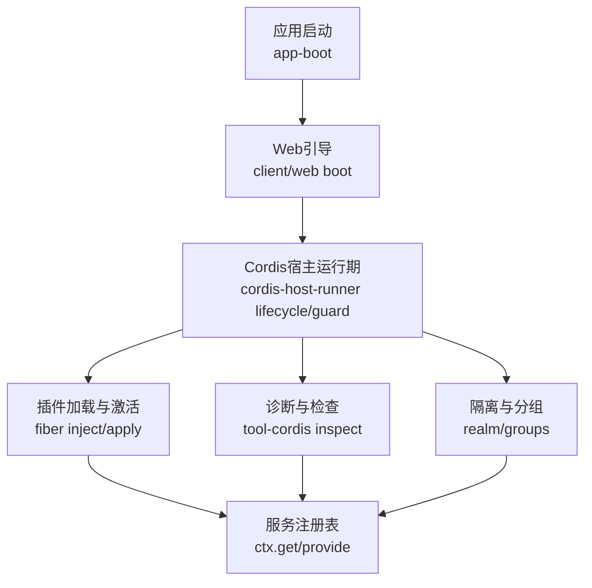
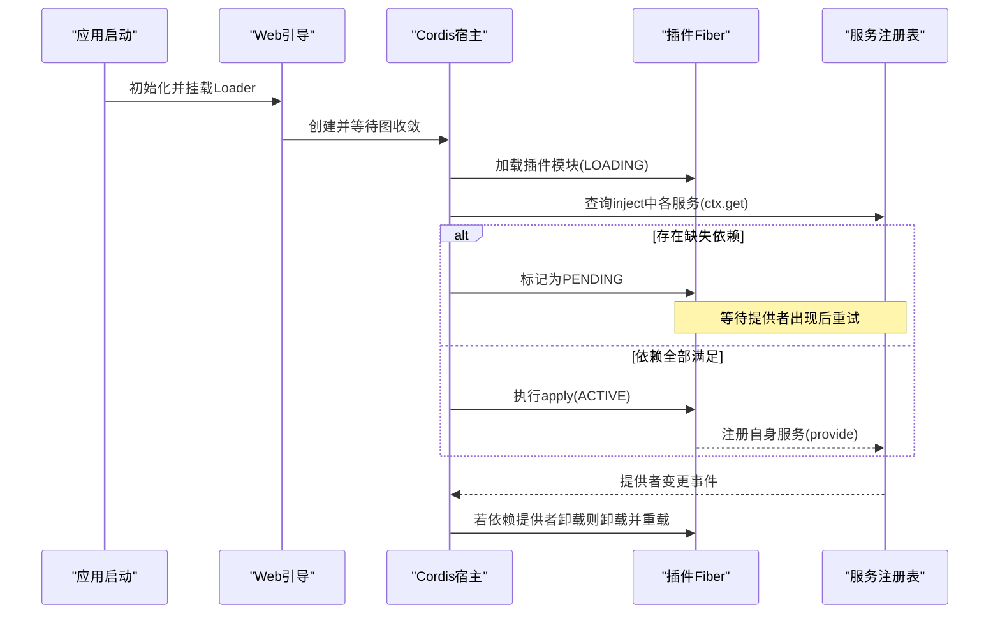
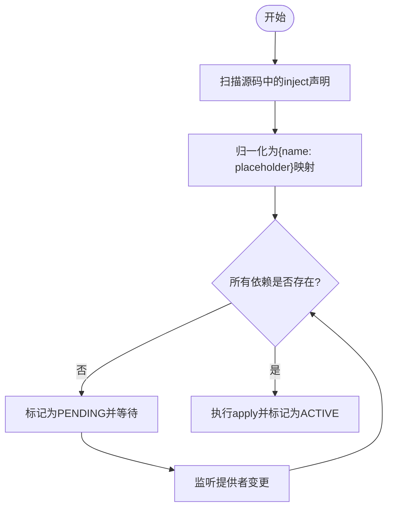
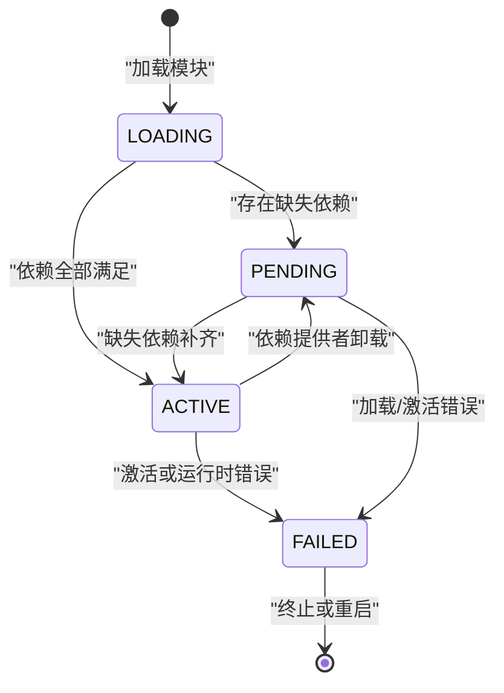
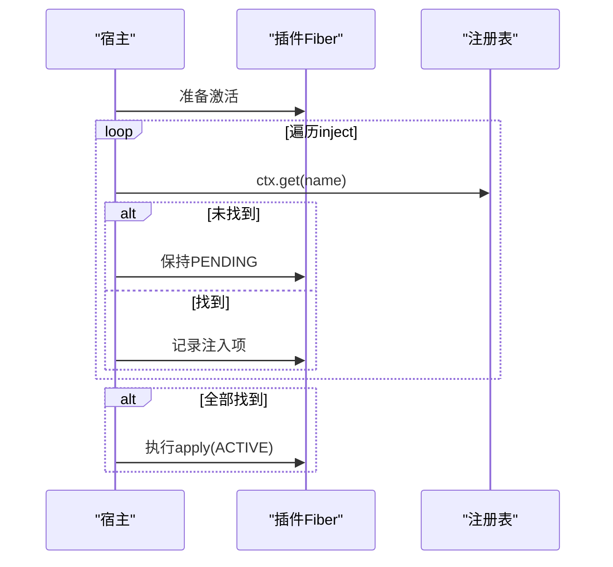
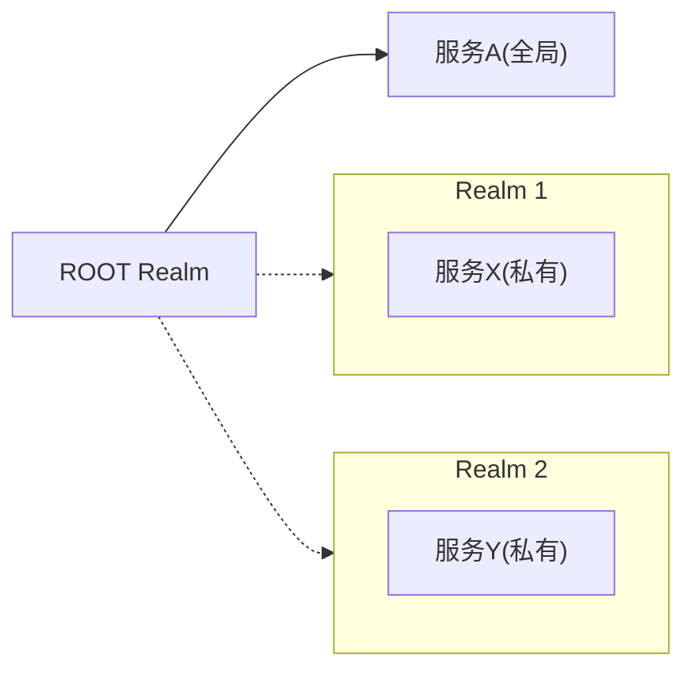
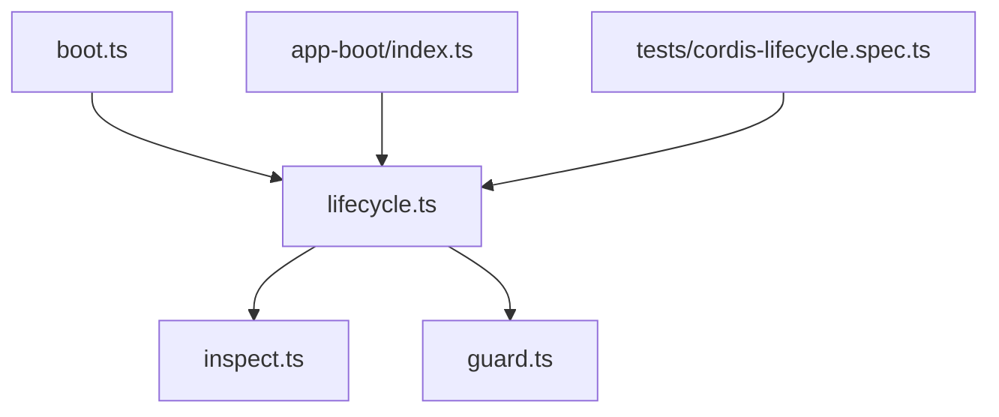

# 插件依赖管理

<cite>
**本文引用的文件**
- [packages/extensions/cordis-host-runner/src/lifecycle.ts](file://packages/extensions/cordis-host-runner/src/lifecycle.ts)
- [packages/extensions/cordis-host-runner/src/guard.ts](file://packages/extensions/cordis-host-runner/src/guard.ts)
- [packages/extensions/tool-cordis/src/inspect.ts](file://packages/extensions/tool-cordis/src/inspect.ts)
- [scripts/gen-config-catalog.ts](file://scripts/gen-config-catalog.ts)
- [docs/cordis-tutorial/03-services.md](file://docs/cordis-tutorial/03-services.md)
- [packages/boot/app-boot/src/index.ts](file://packages/boot/app-boot/src/index.ts)
- [packages/client/web/src/boot.ts](file://packages/client/web/src/boot.ts)
- [packages/preset/agent-presets/tests/mount.spec.ts](file://packages/preset/agent-presets/tests/mount.spec.ts)
- [packages/preset/agent-presets/presets/cordis/skills/editing-cordis-compositions/SKILL.md](file://packages/preset/agent-presets/presets/cordis/skills/editing-cordis-compositions/SKILL.md)
- [packages/extensions/tool-cordis/tests/cordis-lifecycle.spec.ts](file://packages/extensions/tool-cordis/tests/cordis-lifecycle.spec.ts)
</cite>

## 目录
1. [简介](#简介)
2. [项目结构](#项目结构)
3. [核心组件](#核心组件)
4. [架构总览](#架构总览)
5. [详细组件分析](#详细组件分析)
6. [依赖关系分析](#依赖关系分析)
7. [性能考量](#性能考量)
8. [故障排查指南](#故障排查指南)
9. [结论](#结论)
10. [附录：配置示例与最佳实践](#附录配置示例与最佳实践)

## 简介
本文面向Cordis框架的插件依赖管理，聚焦以下主题：
- 依赖解析机制：inject数组如何声明依赖、服务提供者如何被查找、依赖注入过程何时发生。
- 生命周期状态：ACTIVE、PENDING、ERROR等状态的语义及转换条件。
- 诊断与排错：如何定位PENDING状态的原因，以及依赖缺失或提供者变更时的行为。
- 服务隔离：如何通过groups（realm）实现服务的独立实例与可见性控制。
- 配置示例：从单服务依赖到复杂多层依赖的完整示例。
- 验证与错误处理：依赖校验、失败回滚与健壮性建议。

## 项目结构
围绕依赖管理与生命周期，关键代码分布在如下位置：
- 宿主运行期与生命周期：packages/extensions/cordis-host-runner/src/lifecycle.ts、guard.ts
- 诊断与检查工具：packages/extensions/tool-cordis/src/inspect.ts
- 生成器对inject的读取：scripts/gen-config-catalog.ts
- 教程与说明：docs/cordis-tutorial/03-services.md
- 启动审计与状态映射：packages/boot/app-boot/src/index.ts、packages/client/web/src/boot.ts
- 隔离与分组（realm/groups）：packages/preset/agent-presets/tests/mount.spec.ts、SKILL.md
- 生命周期测试用例：packages/extensions/tool-cordis/tests/cordis-lifecycle.spec.ts

图表来源
- [packages/boot/app-boot/src/index.ts:684-711](file://packages/boot/app-boot/src/index.ts#L684-L711)
- [packages/client/web/src/boot.ts:112-135](file://packages/client/web/src/boot.ts#L112-L135)
- [packages/extensions/cordis-host-runner/src/lifecycle.ts:47-57](file://packages/extensions/cordis-host-runner/src/lifecycle.ts#L47-L57)
- [packages/extensions/cordis-host-runner/src/guard.ts:680-711](file://packages/extensions/cordis-host-runner/src/guard.ts#L680-L711)
- [packages/extensions/tool-cordis/src/inspect.ts:82-121](file://packages/extensions/tool-cordis/src/inspect.ts#L82-L121)

章节来源
- [packages/boot/app-boot/src/index.ts:684-711](file://packages/boot/app-boot/src/index.ts#L684-L711)
- [packages/client/web/src/boot.ts:112-135](file://packages/client/web/src/boot.ts#L112-L135)
- [packages/extensions/cordis-host-runner/src/lifecycle.ts:47-57](file://packages/extensions/cordis-host-runner/src/lifecycle.ts#L47-L57)
- [packages/extensions/cordis-host-runner/src/guard.ts:680-711](file://packages/extensions/cordis-host-runner/src/guard.ts#L680-L711)
- [packages/extensions/tool-cordis/src/inspect.ts:82-121](file://packages/extensions/tool-cordis/src/inspect.ts#L82-L121)

## 核心组件
- 依赖声明与解析
  - inject数组：插件通过inject声明所需服务键名；Cordis在activate前将inject归一化为名称到占位值的映射，并在所有依赖就绪后才执行apply。
  - 缺失检测：missingServices用于计算当前未满足的依赖集合，决定插件是否处于PENDING。
- 生命周期状态机
  - LOADING：插件模块正在加载。
  - PENDING：已加载但依赖未满足，等待提供者出现。
  - ACTIVE：依赖全部满足，apply已执行且插件可用。
  - FAILED/ERROR：激活或运行时出错进入失败态。
  - 状态变化会触发internal/status事件，便于UI与诊断工具订阅。
- 服务提供者查找与注入
  - 通过ctx.get获取服务；当依赖缺失时，插件保持PENDING，不执行apply。
  - 当提供者卸载或热替换，依赖该提供者的插件会被卸载并重新加载，避免持有过期引用。
- 安全与守卫
  - 注入的服务方法返回会被代理并做上下文限制，防止越权访问。
- 诊断能力
  - providedServices列出某子树提供的服务名。
  - missingServices列出某fiber尚未满足的依赖。
  - withinFiber判断fiber是否属于某子树。

章节来源
- [docs/cordis-tutorial/03-services.md:59-78](file://docs/cordis-tutorial/03-services.md#L59-L78)
- [packages/extensions/cordis-host-runner/src/lifecycle.ts:47-57](file://packages/extensions/cordis-host-runner/src/lifecycle.ts#L47-L57)
- [packages/extensions/cordis-host-runner/src/guard.ts:680-711](file://packages/extensions/cordis-host-runner/src/guard.ts#L680-L711)
- [packages/extensions/tool-cordis/src/inspect.ts:82-121](file://packages/extensions/tool-cordis/src/inspect.ts#L82-L121)

## 架构总览
下图展示了插件从加载到激活的关键流程，以及依赖缺失时的挂起机制。

图表来源
- [packages/client/web/src/boot.ts:112-135](file://packages/client/web/src/boot.ts#L112-L135)
- [packages/extensions/cordis-host-runner/src/lifecycle.ts:47-57](file://packages/extensions/cordis-host-runner/src/lifecycle.ts#L47-L57)
- [docs/cordis-tutorial/03-services.md:59-78](file://docs/cordis-tutorial/03-services.md#L59-L78)

## 详细组件分析

### 依赖声明与解析（inject）
- 支持两种声明形式：
  - 顶层变量inject数组
  - 类静态属性inject数组
- 生成器会扫描源码提取inject列表，作为构建期信息用于诊断与校验。
- 运行时，Cordis将inject归一化为名称到占位的映射，供后续激活阶段使用。

图表来源
- [scripts/gen-config-catalog.ts:520-544](file://scripts/gen-config-catalog.ts#L520-L544)
- [packages/extensions/cordis-host-runner/src/lifecycle.ts:47-57](file://packages/extensions/cordis-host-runner/src/lifecycle.ts#L47-L57)

章节来源
- [scripts/gen-config-catalog.ts:520-544](file://scripts/gen-config-catalog.ts#L520-L544)
- [packages/extensions/cordis-host-runner/src/lifecycle.ts:47-57](file://packages/extensions/cordis-host-runner/src/lifecycle.ts#L47-L57)

### 生命周期状态与转换
- 状态定义与事件：
  - LOADING：模块加载阶段。
  - PENDING：依赖未满足，等待提供者。
  - ACTIVE：依赖满足，apply已执行。
  - FAILED/ERROR：激活或运行时异常。
- 转换条件：
  - 依赖补齐：PENDING → ACTIVE。
  - 依赖丢失：ACTIVE → 卸载并可能回到PENDING或FAILED。
  - 错误：任意状态 → FAILED/ERROR。
- 事件：internal/status在状态切换时发出，便于外部订阅。

图表来源
- [packages/extensions/tool-cordis/tests/cordis-lifecycle.spec.ts:122-161](file://packages/extensions/tool-cordis/tests/cordis-lifecycle.spec.ts#L122-L161)
- [packages/boot/app-boot/src/index.ts:684-711](file://packages/boot/app-boot/src/index.ts#L684-L711)

章节来源
- [packages/extensions/tool-cordis/tests/cordis-lifecycle.spec.ts:122-161](file://packages/extensions/tool-cordis/tests/cordis-lifecycle.spec.ts#L122-L161)
- [packages/boot/app-boot/src/index.ts:684-711](file://packages/boot/app-boot/src/index.ts#L684-L711)

### 服务提供者查找与注入过程
- 查找：通过ctx.get按名称检索服务。
- 注入时机：在activate前完成依赖检查，确保apply内可安全使用已注入服务。
- 动态变更：提供者卸载或热替换时，依赖方将被卸载并重新加载，避免悬空引用。

图表来源
- [packages/extensions/cordis-host-runner/src/lifecycle.ts:47-57](file://packages/extensions/cordis-host-runner/src/lifecycle.ts#L47-L57)
- [docs/cordis-tutorial/03-services.md:59-78](file://docs/cordis-tutorial/03-services.md#L59-L78)

章节来源
- [packages/extensions/cordis-host-runner/src/lifecycle.ts:47-57](file://packages/extensions/cordis-host-runner/src/lifecycle.ts#L47-L57)
- [docs/cordis-tutorial/03-services.md:59-78](file://docs/cordis-tutorial/03-services.md#L59-L78)

### 服务隔离与分组（groups/realm）
- 概念：通过realm（组）将服务实例隔离，不同会话或子树拥有各自实例，互不可见。
- 行为：
  - 无realm的服务位于ROOT realm，全局可见。
  - realm私有服务在同一realm内共享，跨realm不可见。
  - 同一realm内重复provide会抛错，避免意外复用。
- 用途：适用于插件或预设内部拥有的服务，不应包裹仅消费宿主能力的消费者。

图表来源
- [packages/preset/agent-presets/presets/cordis/skills/editing-cordis-compositions/SKILL.md:99-103](file://packages/preset/agent-presets/presets/cordis/skills/editing-cordis-compositions/SKILL.md#L99-L103)
- [packages/preset/agent-presets/tests/mount.spec.ts:283-300](file://packages/preset/agent-presets/tests/mount.spec.ts#L283-L300)

章节来源
- [packages/preset/agent-presets/presets/cordis/skills/editing-cordis-compositions/SKILL.md:99-103](file://packages/preset/agent-presets/presets/cordis/skills/editing-cordis-compositions/SKILL.md#L99-L103)
- [packages/preset/agent-presets/tests/mount.spec.ts:283-300](file://packages/preset/agent-presets/tests/mount.spec.ts#L283-L300)

### 诊断与调试工具
- 列出某子树提供的服务：providedServices
- 列出某fiber缺失的依赖：missingServices
- 判断fiber归属：withinFiber
- 这些工具可用于快速定位PENDING原因与依赖拓扑。

章节来源
- [packages/extensions/tool-cordis/src/inspect.ts:82-121](file://packages/extensions/tool-cordis/src/inspect.ts#L82-L121)

## 依赖关系分析
- 耦合点：
  - 宿主运行期依赖fiber的inject映射与状态机。
  - 诊断工具依赖注册表快照与fiber树结构。
  - 启动审计依赖loader条目与fiber状态常量。
- 潜在循环：
  - 依赖应形成DAG；若出现循环，会在激活阶段暴露为无法解决的依赖。
- 外部集成：
  - Web界面订阅internal/status以更新UI状态。
  - 应用启动后审计未加载条目，抛出明确错误。

图表来源
- [packages/extensions/cordis-host-runner/src/lifecycle.ts:47-57](file://packages/extensions/cordis-host-runner/src/lifecycle.ts#L47-L57)
- [packages/extensions/tool-cordis/src/inspect.ts:82-121](file://packages/extensions/tool-cordis/src/inspect.ts#L82-L121)
- [packages/extensions/cordis-host-runner/src/guard.ts:680-711](file://packages/extensions/cordis-host-runner/src/guard.ts#L680-L711)
- [packages/client/web/src/boot.ts:112-135](file://packages/client/web/src/boot.ts#L112-L135)
- [packages/boot/app-boot/src/index.ts:684-711](file://packages/boot/app-boot/src/index.ts#L684-L711)
- [packages/extensions/tool-cordis/tests/cordis-lifecycle.spec.ts:122-161](file://packages/extensions/tool-cordis/tests/cordis-lifecycle.spec.ts#L122-L161)

章节来源
- [packages/extensions/cordis-host-runner/src/lifecycle.ts:47-57](file://packages/extensions/cordis-host-runner/src/lifecycle.ts#L47-L57)
- [packages/extensions/tool-cordis/src/inspect.ts:82-121](file://packages/extensions/tool-cordis/src/inspect.ts#L82-L121)
- [packages/extensions/cordis-host-runner/src/guard.ts:680-711](file://packages/extensions/cordis-host-runner/src/guard.ts#L680-L711)
- [packages/client/web/src/boot.ts:112-135](file://packages/client/web/src/boot.ts#L112-L135)
- [packages/boot/app-boot/src/index.ts:684-711](file://packages/boot/app-boot/src/index.ts#L684-L711)
- [packages/extensions/tool-cordis/tests/cordis-lifecycle.spec.ts:122-161](file://packages/extensions/tool-cordis/tests/cordis-lifecycle.spec.ts#L122-L161)

## 性能考量
- 依赖解析在activate前完成，避免运行时频繁查找开销。
- PENDING fiber不会阻止进程退出，适合“按需激活”的场景。
- 提供者热替换会触发依赖方卸载与重加载，注意避免昂贵初始化逻辑重复执行。
- 使用providedServices/missingServices进行批量诊断，减少逐条查询成本。

## 故障排查指南
- 常见症状
  - 插件始终PENDING：检查inject中是否有服务未提供，或使用missingServices查看缺失列表。
  - 插件ACTIVE但功能异常：确认服务提供者是否正确注册，是否在正确的realm内。
  - 热替换后行为异常：确认依赖方是否被正确卸载并重新加载。
- 诊断步骤
  - 订阅internal/status观察状态变化。
  - 使用providedServices列出当前可用的服务。
  - 使用missingServices定位缺失依赖。
  - 使用withinFiber确认服务归属的子树。
- 典型问题与解决
  - 提供者未注册：补全provide或调整mount顺序。
  - realm不匹配：将消费者与服务置于同一realm，或将服务提升到ROOT。
  - 循环依赖：重构依赖图，打破环。

章节来源
- [packages/extensions/tool-cordis/src/inspect.ts:82-121](file://packages/extensions/tool-cordis/src/inspect.ts#L82-L121)
- [packages/client/web/src/boot.ts:112-135](file://packages/client/web/src/boot.ts#L112-L135)
- [packages/boot/app-boot/src/index.ts:684-711](file://packages/boot/app-boot/src/index.ts#L684-L711)

## 结论
Cordis通过声明式inject与严格的激活时机控制，实现了稳定可靠的插件依赖管理。PENDING状态确保“无依赖不启动”，提供者变更触发自动重载，避免悬空引用。结合realm隔离与完善的诊断工具，开发者可以构建高内聚、低耦合的可插拔系统。遵循本文的最佳实践，可有效降低依赖问题的定位成本，提升系统的可维护性与稳定性。

## 附录：配置示例与最佳实践

### 简单单服务依赖
- 插件A提供服务“greeting”。
- 插件B通过inject声明依赖“greeting”，在apply中使用。
- 行为：若“greeting”不存在，B保持PENDING；提供者出现后自动激活。

章节来源
- [docs/cordis-tutorial/03-services.md:59-78](file://docs/cordis-tutorial/03-services.md#L59-L78)

### 多层依赖关系
- 插件A提供“core”。
- 插件B依赖“core”，并提供“feature”。
- 插件C依赖“feature”，间接依赖“core”。
- 行为：C在B激活后才能激活；若“core”提供者更换，B与C都会卸载并重载。

章节来源
- [docs/cordis-tutorial/03-services.md:59-78](file://docs/cordis-tutorial/03-services.md#L59-L78)

### 基于groups/realm的隔离示例
- 将插件内的服务放入realm私有空间，不同会话互不可见。
- 宿主能力（如工具、作业）保持在ROOT realm，供所有realm消费。
- 避免将仅消费的插件放入realm，否则无法解析宿主服务。

章节来源
- [packages/preset/agent-presets/presets/cordis/skills/editing-cordis-compositions/SKILL.md:99-103](file://packages/preset/agent-presets/presets/cordis/skills/editing-cordis-compositions/SKILL.md#L99-L103)
- [packages/preset/agent-presets/tests/mount.spec.ts:283-300](file://packages/preset/agent-presets/tests/mount.spec.ts#L283-L300)

### 依赖验证与错误处理最佳实践
- 启动后审计未加载条目，确保无静默失败。
- 在apply中尽量幂等，避免重复初始化。
- 对异步依赖提供者，确保其尽快提供，缩短PENDING时间。
- 使用providedServices/missingServices定期巡检，提前发现依赖缺口。
- 对重要服务提供健康检查与降级策略，提高鲁棒性。

章节来源
- [packages/boot/app-boot/src/index.ts:684-711](file://packages/boot/app-boot/src/index.ts#L684-L711)
- [packages/extensions/tool-cordis/src/inspect.ts:82-121](file://packages/extensions/tool-cordis/src/inspect.ts#L82-L121)