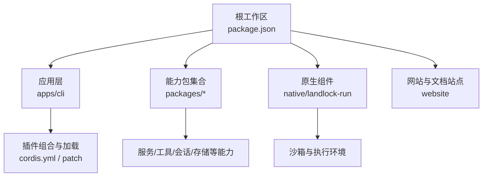
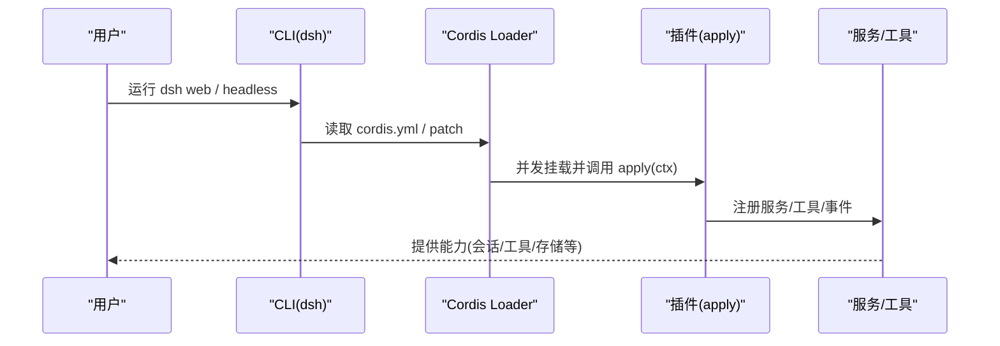
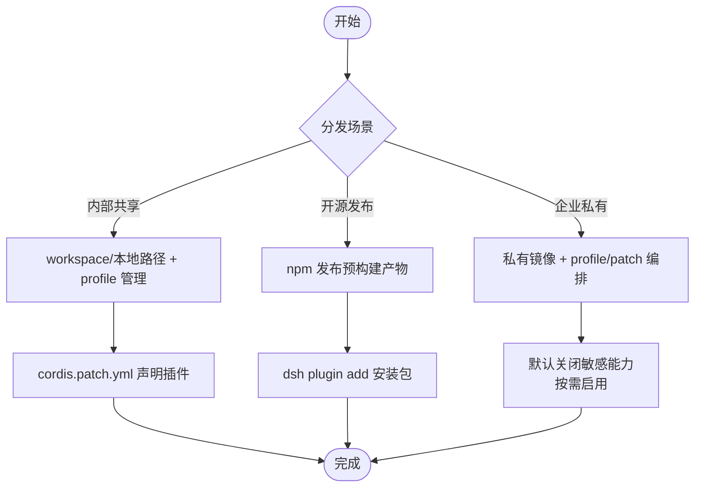
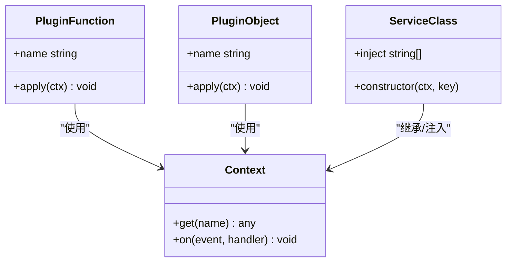
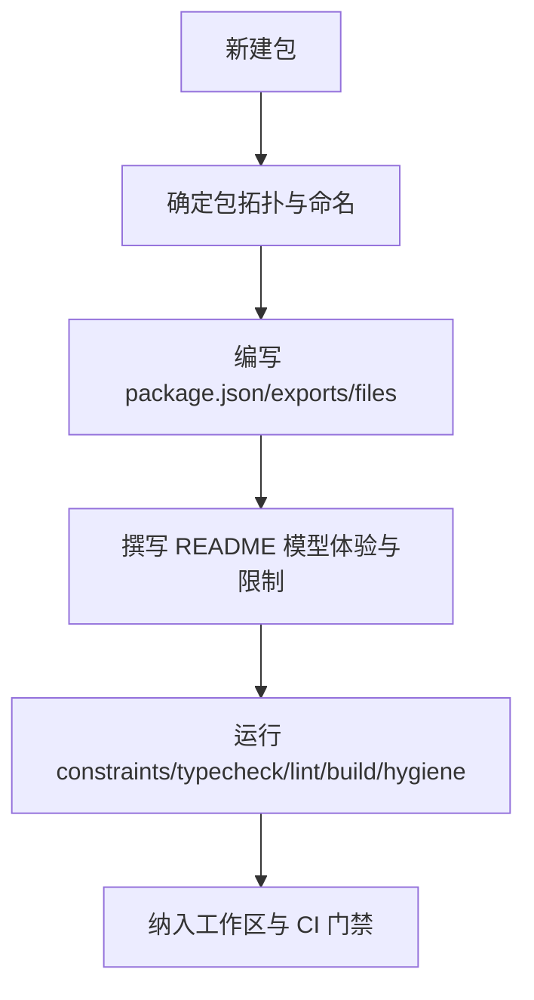
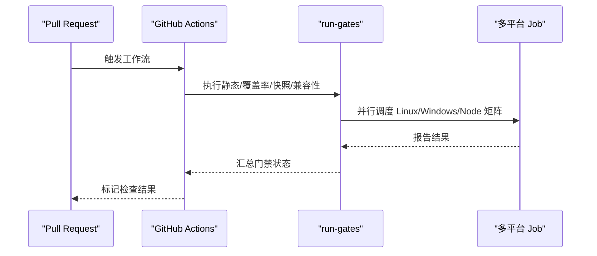
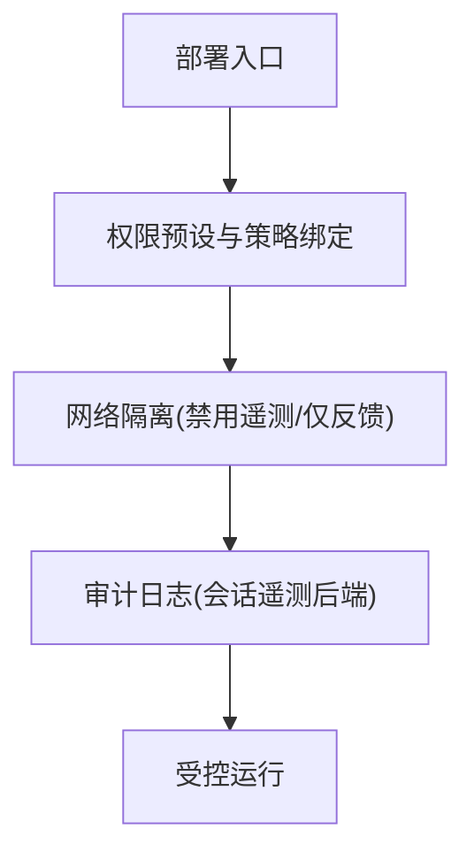
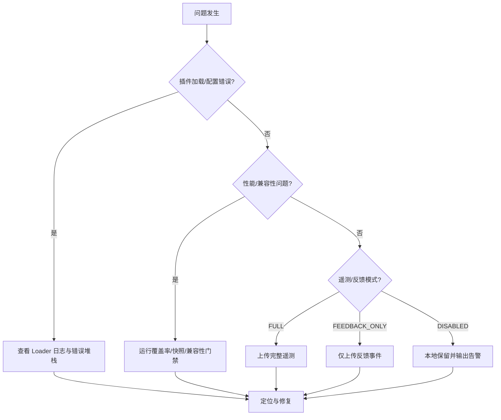
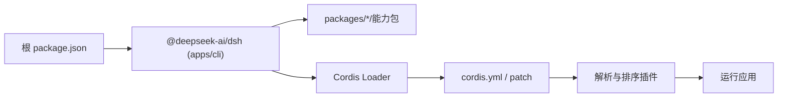

# 分发策略与最佳实践

<cite>
**本文引用的文件**
- [README.md](file://README.md)
- [package.json](file://package.json)
- [apps/cli/package.json](file://apps/cli/package.json)
- [packages/AGENTS.md](file://packages/AGENTS.md)
- [docs/cookbook/adding-a-package.md](file://docs/cookbook/adding-a-package.md)
- [docs/user/develop/basic/publish.md](file://docs/user/develop/basic/publish.md)
- [docs/cordis-tutorial/01-first-plugin.md](file://docs/cordis-tutorial/01-first-plugin.md)
- [scripts/run-gates.ts](file://scripts/run-gates.ts)
- [.github/workflows/ci.yml](file://.github/workflows/ci.yml)
- [scripts/cordis-yaml.ts](file://scripts/cordis-yaml.ts)
- [scripts/verify-cordis-config.ts](file://scripts/verify-cordis-config.ts)
- [packages/session/session-telemetry-otel/src/index.ts](file://packages/session/session-telemetry-otel/src/index.ts)
</cite>

## 目录
1. [简介](#简介)
2. [项目结构](#项目结构)
3. [核心组件](#核心组件)
4. [架构总览](#架构总览)
5. [详细组件分析](#详细组件分析)
6. [依赖关系分析](#依赖关系分析)
7. [性能考量](#性能考量)
8. [故障排查指南](#故障排查指南)
9. [结论](#结论)
10. [附录](#附录)

## 简介
本指南面向插件作者、团队维护者与部署负责人，围绕 DeepSeek Harness（dsh）的“一切皆插件”架构，提供在不同分发场景下的策略选择与实践建议。内容覆盖：
- 内部团队共享、开源社区发布与企业私有部署的分发策略
- 包结构与模块划分、接口设计与文档规范
- 持续集成要点：自动化测试、代码质量与安全扫描
- 企业级部署：权限控制、网络隔离与审计日志
- 监控与故障排查：错误追踪、性能监控与用户反馈收集

## 项目结构
仓库采用 monorepo 组织，根 package.json 通过 workspaces 聚合 apps、packages、native、website 等子工程；CLI 入口位于 apps/cli，核心能力以 packages/* 形式模块化；CI 由 .github/workflows 驱动，脚本集中在 scripts。

**图表来源**
- [package.json:11-18](file://package.json#L11-L18)
- [apps/cli/package.json:14-28](file://apps/cli/package.json#L14-L28)

**章节来源**
- [package.json:1-20](file://package.json#L1-L20)
- [apps/cli/package.json:1-28](file://apps/cli/package.json#L1-L28)

## 核心组件
- CLI 与插件装配：CLI 暴露 dsh 命令，负责 profile 启动、插件管理与 Web UI 别名；通过 cordis.yml 与 patch 机制组合插件。
- 插件形态：函数插件、对象插件、类插件（Service 子类），统一通过 apply(ctx) 注册能力。
- 包契约：每个包遵循 tsconfig、exports、files 清单与 README 模型体验约定，确保可被 Loader 正确解析与消费。
- CI 门禁：run-gates 聚合静态检查、覆盖率、快照、兼容性等门；CI 工作流按平台与任务拆分并行执行。

**章节来源**
- [docs/cordis-tutorial/01-first-plugin.md:5-31](file://docs/cordis-tutorial/01-first-plugin.md#L5-L31)
- [docs/cookbook/adding-a-package.md:7-38](file://docs/cookbook/adding-a-package.md#L7-L38)
- [scripts/run-gates.ts:115-157](file://scripts/run-gates.ts#L115-L157)

## 架构总览
dsh 基于 Cordis 运行时，Loader 读取配置并挂载插件；插件通过 Context 注入服务、事件、工具等能力；CLI 作为装配入口，将基础能力与业务插件组合为可运行的应用。

**图表来源**
- [docs/cordis-tutorial/01-first-plugin.md:23-49](file://docs/cordis-tutorial/01-first-plugin.md#L23-L49)
- [apps/cli/package.json:20-28](file://apps/cli/package.json#L20-L28)

## 详细组件分析

### 分发策略与包结构
- 内部团队共享
  - 使用 workspace 内联引用或本地路径安装，配合 dsh plugin --profile 管理依赖与补丁。
  - 通过 cordis.patch.yml 声明插件条目，避免在用户侧手动编辑主配置。
- 开源社区发布
  - 构建产物随 npm publish 发布；用户通过 dsh plugin add 安装预构建产物，无需源码编译权限。
  - 也可分发 tarball，便于离线或受控环境安装。
- 企业私有部署
  - 结合私有 npm 镜像或制品库；通过 profile 与 patch 实现多环境差异化装配。
  - 限制可选功能默认开启，按需启用敏感能力（如审批、沙箱）。

**图表来源**
- [docs/user/develop/basic/publish.md:33-73](file://docs/user/develop/basic/publish.md#L33-L73)
- [docs/user/develop/basic/publish.md:175-179](file://docs/user/develop/basic/publish.md#L175-L179)

**章节来源**
- [docs/user/develop/basic/publish.md:33-73](file://docs/user/develop/basic/publish.md#L33-L73)
- [docs/user/develop/basic/publish.md:175-179](file://docs/user/develop/basic/publish.md#L175-L179)

### 插件生命周期与接口设计
- 插件形态
  - 函数插件：导出 name 与 apply(ctx)。
  - 对象插件：包含 name 与 apply。
  - 类插件：继承 Service，通过 inject 声明依赖。
- 上下文与注入
  - 通过 ctx 注册服务、订阅事件、暴露工具；推荐用 ctx.get(name) 获取可选服务。
- 组合顺序
  - 插件并发启动，顺序由依赖注入决定，而非配置文件中的位置。

**图表来源**
- [docs/cordis-tutorial/01-first-plugin.md:55-77](file://docs/cordis-tutorial/01-first-plugin.md#L55-L77)
- [packages/AGENTS.md:5-7](file://packages/AGENTS.md#L5-L7)

**章节来源**
- [docs/cordis-tutorial/01-first-plugin.md:5-31](file://docs/cordis-tutorial/01-first-plugin.md#L5-L31)
- [packages/AGENTS.md:5-17](file://packages/AGENTS.md#L5-L17)

### 包组织与文档规范
- 包拓扑
  - 单一职责优先；可替换能力拆分为定义/提供者/消费者三层。
  - 命名体现角色（Controller/Store/Registry/Runtime/Policy 等），避免实现细节污染名称。
- 包清单与导出
  - type: module、main/types/exports 对齐；files 仅包含必要产物；CLI 包额外包含 bin。
- README 模型体验
  - 明确请求上下文、Token/KV Cache 影响；记录已知限制与延期工作。
- 验证与门禁
  - 通过 constraints/typecheck/lint/build/hygiene 等脚本校验；新增包需同步更新文档与契约。

**图表来源**
- [docs/cookbook/adding-a-package.md:7-38](file://docs/cookbook/adding-a-package.md#L7-L38)
- [docs/cookbook/adding-a-package.md:72-115](file://docs/cookbook/adding-a-package.md#L72-L115)

**章节来源**
- [docs/cookbook/adding-a-package.md:7-38](file://docs/cookbook/adding-a-package.md#L7-L38)
- [docs/cookbook/adding-a-package.md:72-115](file://docs/cookbook/adding-a-package.md#L72-L115)

### 持续集成配置要点
- 门禁聚合
  - run-gates 支持多种模式（ci-primary/static/coverage/snapshot/artifacts/consumers 等），fail-fast 快速失败。
- 多平台与矩阵
  - Node 版本矩阵、Windows Wine 与原生 Windows 任务分离；Linux 与 Windows 独立流水线。
- 缓存与加速
  - pnpm store、Playwright 浏览器缓存、Wine apt 缓存复用，缩短冷启动时间。
- 安全与合规
  - 禁用生产遥测端点；对第三方依赖进行许可证与链接校验；产物一致性校验。

**图表来源**
- [scripts/run-gates.ts:115-157](file://scripts/run-gates.ts#L115-L157)
- [.github/workflows/ci.yml:23-51](file://.github/workflows/ci.yml#L23-L51)
- [.github/workflows/ci.yml:94-157](file://.github/workflows/ci.yml#L94-L157)
- [.github/workflows/ci.yml:249-304](file://.github/workflows/ci.yml#L249-L304)

**章节来源**
- [scripts/run-gates.ts:115-157](file://scripts/run-gates.ts#L115-L157)
- [.github/workflows/ci.yml:23-51](file://.github/workflows/ci.yml#L23-L51)
- [.github/workflows/ci.yml:94-157](file://.github/workflows/ci.yml#L94-L157)
- [.github/workflows/ci.yml:249-304](file://.github/workflows/ci.yml#L249-L304)

### 企业级部署考虑
- 权限控制
  - 通过预设与策略绑定沙箱模式与审批策略；默认最小权限，按需提升。
- 网络隔离
  - 禁止向生产遥测端点上报；通过环境变量关闭遥测或使用反馈-only 模式。
- 审计日志
  - 会话遥测后端支持不同分享模式；禁用模式下仅本地保留并输出稳定告警。

**图表来源**
- [packages/session/session-telemetry-otel/src/index.ts:141-168](file://packages/session/session-telemetry-otel/src/index.ts#L141-L168)

**章节来源**
- [packages/session/session-telemetry-otel/src/index.ts:141-168](file://packages/session/session-telemetry-otel/src/index.ts#L141-L168)

### 监控与故障排查
- 错误追踪
  - 插件加载失败会抛出异常；配置项解析失败通过 Loader 日志上报。
- 性能监控
  - 覆盖率与快照门禁保障稳定性；Node 版本矩阵确保兼容性。
- 用户反馈收集
  - 会话遥测支持 FULL/FEEDBACK_ONLY/DISABLED 三种模式；禁用时仅本地保留并提示。

**图表来源**
- [docs/cordis-tutorial/01-first-plugin.md:79-91](file://docs/cordis-tutorial/01-first-plugin.md#L79-L91)
- [scripts/verify-cordis-config.ts:1-11](file://scripts/verify-cordis-config.ts#L1-L11)
- [packages/session/session-telemetry-otel/src/index.ts:141-168](file://packages/session/session-telemetry-otel/src/index.ts#L141-L168)

**章节来源**
- [docs/cordis-tutorial/01-first-plugin.md:79-91](file://docs/cordis-tutorial/01-first-plugin.md#L79-L91)
- [scripts/verify-cordis-config.ts:1-11](file://scripts/verify-cordis-config.ts#L1-L11)
- [packages/session/session-telemetry-otel/src/index.ts:141-168](file://packages/session/session-telemetry-otel/src/index.ts#L141-L168)

## 依赖关系分析
- 工作区依赖
  - 根 package.json 通过 workspaces 聚合 apps、packages、native、website；CLI 依赖大量 dsh-* 能力包。
- 插件装配依赖
  - cordis.yml 与 patch 决定最终装配图；Loader 根据注入关系排序启动。
- 配置校验
  - verify-cordis-config 校验 Loader 条目元数据与包解析；cordis-yaml 辅助识别分组条目。

**图表来源**
- [package.json:11-18](file://package.json#L11-L18)
- [apps/cli/package.json:30-105](file://apps/cli/package.json#L30-L105)
- [scripts/cordis-yaml.ts:43-54](file://scripts/cordis-yaml.ts#L43-L54)
- [scripts/verify-cordis-config.ts:1-11](file://scripts/verify-cordis-config.ts#L1-L11)

**章节来源**
- [package.json:11-18](file://package.json#L11-L18)
- [apps/cli/package.json:30-105](file://apps/cli/package.json#L30-L105)
- [scripts/cordis-yaml.ts:43-54](file://scripts/cordis-yaml.ts#L43-L54)
- [scripts/verify-cordis-config.ts:1-11](file://scripts/verify-cordis-config.ts#L1-L11)

## 性能考量
- 构建与安装
  - 使用 pnpm 与缓存（store、Playwright、Wine）减少冷启动；CI 中分阶段恢复缓存。
- 测试与覆盖率
  - 分区覆盖率与并发门限（DSH_COVERAGE_*）提升吞吐；快照与兼容性门禁保障稳定性。
- 运行时
  - 插件并发启动，依赖注入保证顺序；避免全局状态扩散，降低耦合带来的性能抖动。

[本节为通用指导，不直接分析具体文件]

## 故障排查指南
- 插件加载失败
  - 检查 cordis.yml 条目拼写与模块解析；Loader 会在启动阶段报告无法解析的配置项。
- 配置校验失败
  - 运行 verify-cordis-config 与 cordis-yaml 相关脚本，确认条目结构与分组标识。
- 遥测与反馈
  - 禁用模式下仅本地保留并输出稳定告警；反馈-only 模式仅上传必要事件。

**章节来源**
- [docs/cordis-tutorial/01-first-plugin.md:79-91](file://docs/cordis-tutorial/01-first-plugin.md#L79-L91)
- [scripts/verify-cordis-config.ts:1-11](file://scripts/verify-cordis-config.ts#L1-L11)
- [packages/session/session-telemetry-otel/src/index.ts:141-168](file://packages/session/session-telemetry-otel/src/index.ts#L141-L168)

## 结论
- 通过 workspace + profile + patch 的组合，可在内部共享、开源发布与企业私有部署之间灵活切换。
- 严格遵循包契约与 README 模型体验规范，能显著降低维护成本与集成风险。
- CI 门禁覆盖静态检查、覆盖率、快照与兼容性，保障交付质量。
- 企业部署应默认最小权限、网络隔离与审计日志，结合遥测模式满足合规要求。
- 监控与排障围绕 Loader 日志、配置校验与遥测模式展开，形成闭环。

[本节为总结性内容，不直接分析具体文件]

## 附录
- 快速参考
  - 运行 CLI：见仓库根说明。
  - 添加包：遵循 cookbook 清单并运行门禁。
  - 发布插件：构建产物随 npm 发布或打包 tarball。

**章节来源**
- [README.md:17-41](file://README.md#L17-L41)
- [docs/cookbook/adding-a-package.md:7-38](file://docs/cookbook/adding-a-package.md#L7-L38)
- [docs/user/develop/basic/publish.md:175-179](file://docs/user/develop/basic/publish.md#L175-L179)